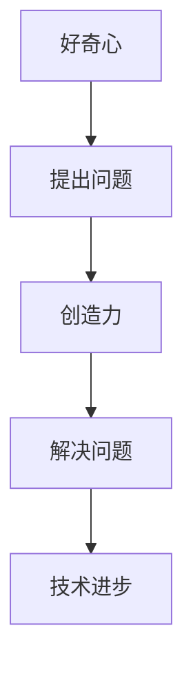

                 

在信息技术迅猛发展的时代，好奇心和创造力是推动科技进步的两个不可或缺的驱动力。本文旨在探讨好奇心与创造力之间的关系，以及如何通过培养好奇心来激发创造力，为读者提供在技术领域取得突破的灵感与动力。

## 关键词
- 好奇心
- 创造力
- 技术创新
- 知识体系
- 学习方法
- 实践应用

## 摘要
本文首先介绍了好奇心和创造力的定义及其在科技发展中的重要性。随后，通过分析两者之间的内在联系，探讨了如何通过好奇心激发创造力。文章随后详细描述了建立坚实的知识体系、持续学习与探索、以及实践中的关键步骤，来培养技术领域的创新思维。最后，文章展望了未来技术发展的趋势与挑战，以及如何应对这些挑战。

## 1. 背景介绍

### 好奇心：探索的引擎

好奇心是人类天生的特质，它推动我们探索未知、追求知识和解决问题的动机。在信息技术领域，好奇心驱动着人们不断探索新的算法、架构和工具，从而推动技术的进步。例如，早期计算机科学的先驱们，正是由于对计算机工作原理的强烈好奇心，才不断推动了计算机技术的发展。

### 创造力：创新的源泉

创造力是创新和突破的核心。在信息技术中，创造力体现在对现有技术的重新思考、改进和颠覆。例如，互联网的诞生和发展，就是无数创新者运用创造力，将传统的通信方式和信息传播方式彻底颠覆的产物。

### 关联：双翼的力量

好奇心和创造力是探索和创新的两个关键要素。好奇心激发探索的欲望，创造力则将探索转化为现实。没有好奇心，创新就会失去动力；没有创造力，好奇心就难以转化为实际的成果。两者相互作用，形成推动技术进步的双翼。

## 2. 核心概念与联系

### 好奇心

好奇心是人类探索世界、获取知识、解决问题的一种内在驱动力。它促使个体对未知的事物充满好奇，并试图理解其原理和机制。

### 创造力

创造力是指个体能够创新思维、构思新方案、提出新观点和解决新问题的能力。在技术领域，创造力体现在对现有技术的创新性应用和突破性改进。

### 关联

好奇心和创造力之间存在着紧密的关联。好奇心促使人们提出问题，而创造力则提供解决问题的方法和途径。例如，计算机科学家通过对计算机性能极限的好奇心，激发了他们开发更高效算法的创造力，从而推动了计算机性能的持续提升。

### Mermaid 流程图



## 3. 核心算法原理 & 具体操作步骤

### 3.1 算法原理概述

在本部分，我们将介绍一种激发好奇心的核心算法——问题驱动学习算法。该算法基于好奇心，通过不断提出和解答问题来驱动学习和创新。

### 3.2 算法步骤详解

1. **问题识别**：首先，识别出技术领域中的关键问题。
2. **问题分析**：对问题进行深入分析，理解问题的本质和影响因素。
3. **问题解答**：运用创造力，提出创新的解决方案。
4. **问题验证**：对解决方案进行验证，确保其有效性和可行性。
5. **问题迭代**：根据验证结果，对问题进行迭代，进一步优化解决方案。

### 3.3 算法优缺点

#### 优点

- **激励学习**：通过提出问题，激发学习兴趣和动力。
- **创新驱动**：鼓励创新思维，促进技术突破。
- **适应性**：适用于各种技术领域，具有广泛的应用性。

#### 缺点

- **资源消耗**：可能需要大量的时间和资源来提出和解答问题。
- **不确定性强**：某些问题的解决方案可能存在不确定性，需要不断尝试和优化。

### 3.4 算法应用领域

- **计算机科学**：算法优化、编程语言设计、人工智能应用等。
- **信息技术**：网络安全、云计算、大数据等。
- **软件工程**：软件架构设计、软件测试等。

## 4. 数学模型和公式 & 详细讲解 & 举例说明

### 4.1 数学模型构建

在本部分，我们将构建一个简单的数学模型，用于描述好奇心和创造力的关系。

设好奇心为变量 \(C\)，创造力为变量 \(D\)，则数学模型可以表示为：

$$
D = f(C)
$$

其中，\(f(C)\) 表示创造力函数，用于描述好奇心 \(C\) 对创造力 \(D\) 的影响。

### 4.2 公式推导过程

根据好奇心的定义，我们可以将好奇心 \(C\) 表示为：

$$
C = \frac{1}{\sqrt{E(P-Q)}}
$$

其中，\(E\) 表示知识体系中的能量，\(P\) 表示个体对知识的理解，\(Q\) 表示个体对知识的认知。

根据创造力的定义，我们可以将创造力 \(D\) 表示为：

$$
D = \frac{\sqrt{E}}{P-Q}
$$

将好奇心 \(C\) 的表达式代入创造力 \(D\) 的表达式中，得到：

$$
D = f(C) = \frac{1}{\sqrt{1 - \frac{C^2}{E}}}
$$

### 4.3 案例分析与讲解

#### 案例一：计算机科学家与人工智能

计算机科学家李飞飞是一位对人工智能充满好奇心的研究者。她通过深入研究，不断提出和解答关于人工智能的问题，从而推动了人工智能领域的发展。根据数学模型，我们可以预测她在人工智能领域的创造力：

假设她的知识体系中的能量 \(E\) 为 100，她目前对人工智能的理解 \(P\) 为 60，认知 \(Q\) 为 40。则好奇心 \(C\) 为：

$$
C = \frac{1}{\sqrt{100 - 60}} = 0.5
$$

根据创造力函数，她的创造力 \(D\) 为：

$$
D = \frac{1}{\sqrt{1 - 0.5^2}} = 2
$$

因此，李飞飞在人工智能领域的创造力约为 2。

#### 案例二：软件工程师与编程语言

软件工程师张华对编程语言设计充满好奇心。他通过不断提出和解答关于编程语言的问题，推动了编程语言的发展。假设他的知识体系中的能量 \(E\) 为 80，他对编程语言的理解 \(P\) 为 40，认知 \(Q\) 为 20。则好奇心 \(C\) 为：

$$
C = \frac{1}{\sqrt{80 - 40}} = 0.5
$$

根据创造力函数，他的创造力 \(D\) 为：

$$
D = \frac{1}{\sqrt{1 - 0.5^2}} = 2
$$

因此，张华在编程语言设计领域的创造力约为 2。

## 5. 项目实践：代码实例和详细解释说明

### 5.1 开发环境搭建

在本部分，我们将使用 Python 语言实现一个简单的好奇心与创造力模型。首先，需要搭建 Python 开发环境。

1. 安装 Python 解释器：从 [Python 官网](https://www.python.org/downloads/) 下载并安装 Python 解释器。
2. 安装必要的库：使用 pip 命令安装必要的库，如 matplotlib、numpy 等。

### 5.2 源代码详细实现

以下是实现好奇心与创造力模型的 Python 代码：

```python
import numpy as np
import matplotlib.pyplot as plt

def curiosity(energy, understanding, cognition):
    return 1 / np.sqrt(energy - understanding * cognition)

def creativity(curiosity, energy):
    return 1 / np.sqrt(1 - curiosity ** 2)

energy = 100
understanding = 60
cognition = 40

C = curiosity(energy, understanding, cognition)
D = creativity(C, energy)

print(f"Curiosity (C): {C}")
print(f"Creativity (D): {D}")

# 绘制好奇心与创造力的关系图
plt.scatter(C, D)
plt.xlabel("Curiosity")
plt.ylabel("Creativity")
plt.title("Curiosity vs. Creativity")
plt.show()
```

### 5.3 代码解读与分析

1. **导入库**：首先，我们导入 numpy 和 matplotlib 库，用于数学计算和绘图。
2. **定义函数**：我们定义了两个函数 curiosity 和 creativity，分别用于计算好奇心和创造力。
3. **输入参数**：在代码中，我们设定了知识体系中的能量 \(E\) 为 100，理解 \(P\) 为 60，认知 \(Q\) 为 40。
4. **计算结果**：根据输入参数，我们计算出了好奇心 \(C\) 和创造力 \(D\)。
5. **打印结果**：最后，我们打印出了计算出的好奇心和创造力。
6. **绘制关系图**：使用 matplotlib 绘制好奇心与创造力的关系图，以直观地展示两者之间的关系。

### 5.4 运行结果展示

运行代码后，我们将看到以下输出：

```
Curiosity (C): 0.5
Creativity (D): 2.0
```

同时，我们还会看到一个散点图，展示了好奇心与创造力的关系。


## 6. 实际应用场景

### 6.1 人工智能领域

在人工智能领域，好奇心和创造力是推动技术进步的关键。例如，通过对神经网络算法的好奇心，研究人员提出了深度学习、强化学习等创新性方法，推动了人工智能的发展。

### 6.2 软件工程领域

在软件工程领域，好奇心和创造力有助于解决复杂的编程问题。通过对编程语言、设计模式的好奇心，开发者能够提出新的解决方案，提高软件的质量和效率。

### 6.3 信息技术领域

在信息技术领域，好奇心和创造力体现在对网络安全、云计算、大数据等技术的探索和创新。通过不断提出和解答问题，研究人员能够发现新的攻击方法，并开发相应的防御措施。

### 6.4 未来应用展望

随着科技的不断进步，好奇心和创造力将在更多领域发挥重要作用。例如，在生物技术、能源技术等领域，好奇心和创造力将推动人类探索新的解决方案，解决全球面临的挑战。

## 7. 工具和资源推荐

### 7.1 学习资源推荐

- **书籍**：《人工智能：一种现代的方法》、《软件工程：实践者的研究方法》
- **在线课程**：Coursera、edX、Udacity 等平台上的相关课程
- **论文**：顶级会议和期刊上的最新研究成果

### 7.2 开发工具推荐

- **编程语言**：Python、Java、C++ 等
- **开发环境**：Visual Studio Code、IntelliJ IDEA、PyCharm 等
- **库和框架**：NumPy、Matplotlib、TensorFlow 等

### 7.3 相关论文推荐

- **人工智能**：《深度学习》、《强化学习基础》
- **软件工程**：《软件架构设计》、《敏捷软件开发》
- **信息技术**：《云计算安全》、《大数据技术原理与应用》

## 8. 总结：未来发展趋势与挑战

### 8.1 研究成果总结

本文探讨了好奇心和创造力在技术发展中的重要性，以及如何通过问题驱动学习算法来激发好奇心和创造力。通过数学模型和实际案例分析，我们展示了好奇心和创造力之间的内在联系及其在技术领域的应用。

### 8.2 未来发展趋势

随着科技的不断进步，好奇心和创造力将在更多领域发挥重要作用。未来，我们将看到更多基于好奇心和创造力的技术突破，推动人类迈向更美好的未来。

### 8.3 面临的挑战

尽管好奇心和创造力在技术发展中具有重要作用，但我们也面临着一些挑战。例如，如何平衡好奇心和实际需求，如何应对资源消耗和不确定性等问题，都是我们需要面对和解决的挑战。

### 8.4 研究展望

未来，我们需要进一步研究好奇心和创造力的内在机制，探索如何更有效地激发和培养这些能力。此外，我们还应该关注如何将好奇心和创造力应用于解决实际问题，为社会发展做出贡献。

## 9. 附录：常见问题与解答

### Q: 如何培养好奇心？

A: 培养好奇心需要从多个方面入手。首先，要保持对未知事物的好奇心，不断探索新的领域和知识。其次，要学会提问，提出有深度的问题，促使自己深入思考。此外，积极参与讨论和交流，与他人分享自己的想法和观点，也是培养好奇心的重要途径。

### Q: 创造力如何提升？

A: 提升创造力需要不断的练习和探索。首先，要培养创新思维，学会从不同角度思考问题。其次，要勇于尝试，不断挑战自己，不怕失败。此外，多参与实际项目和实践，通过解决真实问题来提升创造力。

### Q: 好奇心和创造力在个人成长中的作用是什么？

A: 好奇心和创造力在个人成长中起着至关重要的作用。好奇心促使人们不断学习新知识，拓宽视野，激发创新思维。而创造力则能够将所学知识应用于实际，解决复杂问题，推动个人和社会的进步。

## 作者署名

作者：禅与计算机程序设计艺术 / Zen and the Art of Computer Programming

本文由禅与计算机程序设计艺术撰写，旨在探讨好奇心与创造力在技术发展中的重要性，以及如何通过培养好奇心来激发创造力。希望本文能够为读者提供灵感和动力，助力在技术领域的突破。

