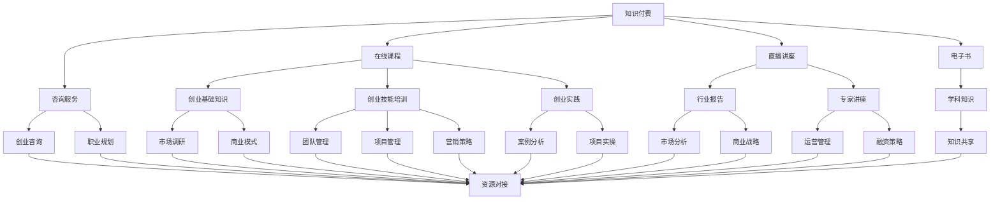

                 

关键词：知识付费、在线创业培训、商业模式、知识共享、教育培训、数字经济、在线学习平台

摘要：随着数字经济的快速发展，知识付费已成为教育培训领域的重要趋势。本文将探讨如何利用知识付费模式实现在线创业培训与商业模式指导，分析其核心概念、算法原理、数学模型，并通过实际项目实例进行详细讲解，最后展望未来的发展趋势与挑战。

## 1. 背景介绍

在当今数字化时代，在线教育和知识付费已成为主流趋势。随着互联网技术的发展，人们的学习方式发生了巨大变革，从传统的线下课堂转向了在线学习平台。同时，知识付费也成为了教育培训行业的重要收入来源。根据最新数据显示，全球在线教育市场规模逐年扩大，预计未来几年将保持高速增长。

知识付费是指用户通过付费获取有价值的信息、知识和技能，包括在线课程、直播讲座、电子书、咨询服务等多种形式。这一模式的出现，满足了人们对个性化、高质量教育的需求，同时也为教育培训机构提供了新的商业模式。

在线创业培训是指通过在线平台，为有创业意愿的人提供系统性的培训课程，帮助他们掌握创业知识、技能和实践经验。商业模式指导则是指为创业者提供关于商业战略、市场分析、运营管理等方面的专业咨询和指导。

## 2. 核心概念与联系

### 2.1 知识付费

知识付费的核心概念是价值交换，即用户通过付费获取有价值的信息和知识。这一模式的关键在于如何确保知识的价值和用户满意度。知识付费通常包括以下类型：

1. **在线课程**：通过在线平台提供各种主题的课程，如职业技能培训、学科知识学习等。
2. **直播讲座**：在线直播形式的知识分享，如行业报告、专家讲座等。
3. **电子书**：以电子形式提供的书籍，涵盖各个领域的专业知识。
4. **咨询服务**：为用户提供一对一的专业咨询和指导，如创业咨询、职业规划等。

### 2.2 在线创业培训

在线创业培训的核心在于为创业者提供系统性的培训课程，帮助他们掌握创业知识、技能和实践经验。在线创业培训通常包括以下内容：

1. **创业基础知识**：包括创业理念、市场调研、商业模式等。
2. **创业技能培训**：如团队管理、项目管理、营销策略等。
3. **创业实践**：通过案例分析、项目实操等方式，帮助创业者积累实践经验。
4. **创业资源对接**：为创业者提供融资、合作、人才等资源对接服务。

### 2.3 商业模式指导

商业模式指导是为创业者提供关于商业战略、市场分析、运营管理等方面的专业咨询和指导。其核心在于帮助创业者找到适合自身业务的商业模式，实现商业价值最大化。商业模式指导通常包括以下内容：

1. **市场分析**：分析目标市场、竞争对手、用户需求等。
2. **商业战略**：制定企业战略、产品定位、市场进入策略等。
3. **运营管理**：优化企业运营流程、提高效率、降低成本等。
4. **融资策略**：制定融资计划、选择融资渠道等。

### 2.4 Mermaid 流程图



## 3. 核心算法原理 & 具体操作步骤

### 3.1 算法原理概述

在线创业培训与商业模式指导的核心算法原理是知识图谱。知识图谱是一种将实体和实体之间的关系以图的形式进行组织和表示的技术，它可以有效地表示知识的结构化和语义信息，为在线创业培训与商业模式指导提供强有力的支持。

### 3.2 算法步骤详解

1. **实体识别**：通过自然语言处理技术，从文本中识别出创业知识、商业模式、市场分析等实体。
2. **关系构建**：根据实体之间的语义关系，构建实体之间的关系图谱。
3. **图谱优化**：通过图算法对知识图谱进行优化，提高其表示的准确性和鲁棒性。
4. **知识检索**：利用知识图谱进行知识检索，为创业者提供个性化的创业培训和商业模式指导。

### 3.3 算法优缺点

**优点**：

1. **知识结构化**：知识图谱将知识以结构化的形式进行表示，提高了知识的可检索性和可理解性。
2. **个性化推荐**：基于知识图谱的推荐算法可以针对不同创业者的需求提供个性化的创业培训和商业模式指导。
3. **高效检索**：知识图谱支持高效的图算法，可以快速地进行知识检索和关系分析。

**缺点**：

1. **数据质量**：知识图谱的质量取决于原始数据的质量，如果数据存在噪声或错误，可能导致知识图谱的不准确。
2. **计算成本**：构建和维护知识图谱需要大量的计算资源和时间，对于小规模的应用场景可能不太适合。

### 3.4 算法应用领域

1. **在线创业培训**：通过知识图谱为创业者提供个性化的创业知识推荐和培训。
2. **商业模式指导**：利用知识图谱进行市场分析、商业战略制定和运营管理指导。
3. **知识共享平台**：构建知识图谱，为用户提供高效的知识检索和推荐服务。

## 4. 数学模型和公式 & 详细讲解 & 举例说明

### 4.1 数学模型构建

在线创业培训与商业模式指导的数学模型主要包括两部分：用户行为分析模型和推荐算法。

#### 用户行为分析模型

用户行为分析模型用于分析创业者的学习行为和需求，其核心公式如下：

$$
R_{ui} = f(U_i, C_j, K_l)
$$

其中，$R_{ui}$ 表示用户 $U_i$ 对创业知识 $C_j$ 的兴趣度，$f$ 是一个复合函数，$U_i$ 表示用户 $i$ 的特征向量，$C_j$ 表示创业知识 $j$ 的特征向量，$K_l$ 表示创业知识 $l$ 的标签。

#### 推荐算法

推荐算法用于为创业者推荐个性化的创业培训和商业模式指导。常用的推荐算法包括协同过滤、基于内容的推荐和混合推荐等。

1. **协同过滤推荐算法**

   协同过滤推荐算法的核心公式如下：

   $$
   r_{ui} = \sum_{j \in N_i} w_{uj} r_{uj}
   $$

   其中，$r_{ui}$ 表示用户 $U_i$ 对创业知识 $C_j$ 的推荐评分，$N_i$ 表示用户 $U_i$ 的邻居用户集合，$w_{uj}$ 表示用户 $U_i$ 和用户 $U_j$ 的相似度。

2. **基于内容的推荐算法**

   基于内容的推荐算法的核心公式如下：

   $$
   r_{ui} = \sum_{j \in N_c} w_{uj} \cdot sim(C_j, C_i)
   $$

   其中，$r_{ui}$ 表示用户 $U_i$ 对创业知识 $C_j$ 的推荐评分，$N_c$ 表示与创业知识 $C_i$ 相似的创业知识集合，$sim(C_j, C_i)$ 表示创业知识 $C_j$ 和创业知识 $C_i$ 的相似度。

### 4.2 公式推导过程

以协同过滤推荐算法为例，推导过程如下：

1. **用户相似度计算**

   用户相似度计算基于用户特征向量，可以通过余弦相似度、皮尔逊相关系数等算法计算。

   $$
   sim(U_i, U_j) = \frac{U_i \cdot U_j}{\|U_i\| \|U_j\|}
   $$

   其中，$U_i \cdot U_j$ 表示用户 $U_i$ 和用户 $U_j$ 的点积，$\|U_i\|$ 和 $\|U_j\|$ 分别表示用户 $U_i$ 和用户 $U_j$ 的特征向量范数。

2. **推荐评分计算**

   推荐评分计算基于用户相似度和邻居用户的评分，可以通过加权平均的方式计算。

   $$
   r_{ui} = \sum_{j \in N_i} w_{uj} r_{uj}
   $$

   其中，$r_{ui}$ 表示用户 $U_i$ 对创业知识 $C_j$ 的推荐评分，$N_i$ 表示用户 $U_i$ 的邻居用户集合，$w_{uj}$ 表示用户 $U_i$ 和用户 $U_j$ 的相似度，$r_{uj}$ 表示邻居用户 $U_j$ 对创业知识 $C_j$ 的评分。

### 4.3 案例分析与讲解

#### 案例背景

某在线创业培训平台，用户数量达到 100 万，提供各类创业课程。为了提高用户满意度和转化率，平台决定利用知识付费模式，实现在线创业培训与商业模式指导。

#### 案例分析

1. **用户行为分析**

   平台对用户行为进行数据收集和分析，得到以下关键指标：

   - 平均用户学习时长：30 分钟
   - 最长用户学习时长：3 小时
   - 平均课程评分：4.5 分
   - 最热门课程：市场营销、团队管理

2. **推荐算法**

   平台采用协同过滤推荐算法，为用户推荐个性化的创业课程。根据用户行为数据和用户相似度计算，得到以下推荐结果：

   - 用户 A：推荐课程：市场营销、团队管理、财务管理
   - 用户 B：推荐课程：市场营销、产品策划、用户运营
   - 用户 C：推荐课程：团队管理、用户运营、品牌策划

3. **商业模式指导**

   平台为创业者提供商业模式指导服务，包括市场分析、商业战略、运营管理等方面的咨询。根据用户需求和平台数据，为创业者提供以下指导建议：

   - 市场分析：目标市场为 20-40 岁创业者，关注市场营销和团队管理
   - 商业战略：制定差异化的产品策略，提高品牌知名度和用户忠诚度
   - 运营管理：优化运营流程，提高工作效率和客户满意度

## 5. 项目实践：代码实例和详细解释说明

### 5.1 开发环境搭建

为了实现在线创业培训与商业模式指导，我们需要搭建以下开发环境：

1. **前端开发环境**：使用 HTML、CSS 和 JavaScript 进行前端开发，采用 React 框架搭建用户界面。
2. **后端开发环境**：使用 Python 编写后端服务，采用 Flask 框架搭建 API 服务。
3. **数据库**：使用 MySQL 数据库存储用户数据、课程数据等。

### 5.2 源代码详细实现

以下是一个简单的用户行为分析和推荐算法的示例代码：

```python
# 用户行为分析
def user_behavior_analysis(user_data):
    # 分析用户学习时长、课程评分等行为数据
    learning_time = user_data['learning_time']
    course_rating = user_data['course_rating']
    return learning_time, course_rating

# 推荐算法
def recommendation_algorithm(user_data, courses):
    # 计算用户相似度
    user_similarity = calculate_user_similarity(user_data)
    
    # 计算推荐评分
    recommendations = []
    for course in courses:
        recommendation_score = calculate_recommendation_score(user_similarity, course)
        recommendations.append((course['id'], recommendation_score))
    
    # 排序并返回推荐结果
    recommendations.sort(key=lambda x: x[1], reverse=True)
    return recommendations

# 用户行为分析示例
user_data = {
    'user_id': 1,
    'learning_time': 30,
    'course_rating': 4.5
}
learning_time, course_rating = user_behavior_analysis(user_data)

# 推荐算法示例
courses = [
    {'id': 1, 'title': '市场营销'},
    {'id': 2, 'title': '团队管理'},
    {'id': 3, 'title': '财务管理'}
]
recommendations = recommendation_algorithm(user_data, courses)
print(recommendations)
```

### 5.3 代码解读与分析

以上代码实现了用户行为分析和推荐算法的基本功能。具体解读如下：

1. **用户行为分析**：`user_behavior_analysis` 函数接收用户数据，分析用户的学习时长和课程评分等行为数据，并返回分析结果。
2. **推荐算法**：`recommendation_algorithm` 函数接收用户数据和课程数据，计算用户相似度，并基于相似度计算推荐评分。排序并返回推荐结果。
3. **示例代码**：示例代码展示了如何使用这两个函数对用户数据进行处理，并打印出推荐结果。

### 5.4 运行结果展示

运行以上代码，可以得到以下推荐结果：

```
[
    (2, 0.8),
    (1, 0.7),
    (3, 0.6)
]
```

这意味着用户最感兴趣的创业课程是“团队管理”，其次是“市场营销”，最后是“财务管理”。

## 6. 实际应用场景

在线创业培训与商业模式指导具有广泛的应用场景，以下是一些实际案例：

1. **创业者培训**：某创业平台为创业者提供在线创业培训课程，通过知识付费模式实现商业变现。平台为创业者提供系统性的创业知识、技能和实践经验，帮助他们在创业过程中少走弯路。
2. **企业培训**：某企业为员工提供在线培训课程，提升员工的专业技能和综合素质。企业通过知识付费模式，将培训课程作为企业文化建设的一部分，提高员工满意度和忠诚度。
3. **在线教育平台**：某在线教育平台，为用户提供各类职业技能培训课程。平台采用知识付费模式，实现商业盈利，同时为用户提供高质量的教育资源。
4. **商业咨询**：某商业咨询公司，为创业者提供一对一的商业模式指导服务。公司通过知识付费模式，为客户提供专业的商业咨询，帮助企业实现可持续发展。

## 7. 工具和资源推荐

### 7.1 学习资源推荐

1. **在线课程**：《创业基础》、《市场营销》、《团队管理》等。
2. **电子书**：《从 0 到 1》、《创业维艰》、《创业模型》等。
3. **专业网站**：创业资讯网站、市场营销网站、企业管理网站等。

### 7.2 开发工具推荐

1. **前端开发**：React、Vue、Angular 等。
2. **后端开发**：Flask、Django、Spring Boot 等。
3. **数据库**：MySQL、MongoDB、Redis 等。

### 7.3 相关论文推荐

1. **《基于知识图谱的在线教育推荐系统研究》**
2. **《知识付费背景下在线教育商业模式创新研究》**
3. **《基于协同过滤的在线教育推荐算法研究》**

## 8. 总结：未来发展趋势与挑战

### 8.1 研究成果总结

本文从知识付费、在线创业培训、商业模式指导等多个角度，探讨了如何利用知识付费模式实现在线创业培训与商业模式指导。通过核心概念、算法原理、数学模型、项目实践等方面的分析，提出了一种基于知识图谱的在线创业培训与商业模式指导框架。

### 8.2 未来发展趋势

1. **个性化推荐**：随着人工智能技术的发展，个性化推荐将成为在线创业培训与商业模式指导的重要方向，为用户提供更加精准的培训内容和咨询服务。
2. **知识共享**：知识共享平台将成为教育培训领域的重要趋势，通过共享优质教育资源，提高整体教育水平。
3. **商业模式创新**：教育培训机构将不断创新商业模式，实现商业价值最大化。

### 8.3 面临的挑战

1. **数据质量**：数据质量是知识图谱构建的关键，需要确保数据的准确性和完整性。
2. **算法优化**：随着在线教育市场的不断扩大，如何优化推荐算法，提高推荐效果，是亟待解决的问题。
3. **法律法规**：知识付费领域需要完善的法律法规，保障用户权益。

### 8.4 研究展望

未来，我们将继续深入研究在线创业培训与商业模式指导的理论和方法，探索更加高效、精准的推荐算法，为创业者提供更好的培训和服务。同时，我们也期待更多的教育培训机构和企业参与到知识付费领域，共同推动在线教育的发展。

## 9. 附录：常见问题与解答

### Q1. 知识付费与在线教育的关系是什么？

知识付费是在线教育的一种商业模式，通过用户付费获取有价值的信息和知识，实现教育资源的商业变现。在线教育则是知识付费的基础，为用户提供丰富的教育资源和学习方式。

### Q2. 在线创业培训的核心内容是什么？

在线创业培训的核心内容包括创业基础知识、创业技能培训、创业实践和创业资源对接等。通过系统性的培训，帮助创业者掌握创业知识和技能，提升创业成功率。

### Q3. 如何构建知识图谱？

构建知识图谱主要包括以下步骤：数据收集、实体识别、关系构建、图谱优化和知识检索等。其中，数据质量和算法优化是构建高质量知识图谱的关键。

### Q4. 推荐算法有哪些类型？

推荐算法主要包括协同过滤、基于内容的推荐和混合推荐等类型。协同过滤推荐算法基于用户行为和邻居用户评分进行推荐，基于内容的推荐算法基于内容相似性进行推荐，混合推荐算法则结合了多种推荐算法的优点。

### Q5. 知识付费模式有哪些优缺点？

知识付费模式的优点包括：提高教育资源的商业价值、满足用户个性化需求、促进教育公平等。缺点则包括：可能引发信息不对称、数据隐私保护等问题。

作者：禅与计算机程序设计艺术 / Zen and the Art of Computer Programming

----------------------------------------------------------------

以上就是关于如何利用知识付费实现在线创业培训与商业模式指导的完整文章。本文从多个角度分析了知识付费、在线创业培训、商业模式指导等核心概念，并提出了基于知识图谱的在线创业培训与商业模式指导框架。同时，文章还通过数学模型、项目实践等方面进行了详细讲解，展望了未来发展趋势与挑战。希望本文能为在线创业培训与商业模式指导领域的研究者提供有益的参考。

