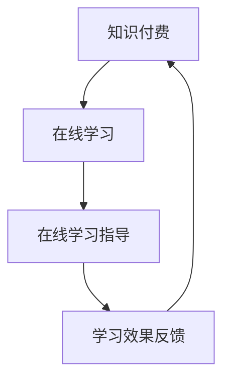

                 

关键词：知识付费、在线学习、在线学习指导、教育技术、学习平台、算法、用户参与、商业模式

摘要：本文探讨了如何利用知识付费模式，结合在线学习与在线学习指导，实现教育资源的优化配置和个性化学习体验。通过分析知识付费的背景、核心概念、算法原理以及数学模型，并结合实际项目实践，提出了一种面向未来的教育技术解决方案。

## 1. 背景介绍

在数字化时代，知识付费已成为一种主流的教育消费模式。知识付费是指用户为获取特定知识或技能，通过付费方式购买课程、讲座、文章等教育资源。在线学习则是在互联网环境下，通过电子设备进行知识学习的过程。在线学习指导则是在线学习过程中的辅导与支持服务。

知识付费与在线学习、在线学习指导的结合，能够实现教育资源的优化配置和个性化学习体验。一方面，知识付费为教育平台提供了可持续的商业模式，推动了教育内容的生产和创新。另一方面，在线学习与在线学习指导的结合，能够更好地满足用户的学习需求，提高学习效果。

### 1.1 知识付费的兴起

随着互联网技术的发展，知识付费逐渐成为一种趋势。一方面，人们对于高质量的教育资源需求日益增长，特别是职场技能和专业知识。另一方面，互联网为知识传播提供了便捷的渠道，知识付费平台应运而生。

### 1.2 在线学习的普及

在线学习以其灵活性、自主性和高效性，逐渐成为现代教育的重要组成部分。特别是在疫情期间，在线学习更成为了教育领域的重要补充。

### 1.3 在线学习指导的需求

在线学习过程中，用户往往需要专业的指导和支持，以解决学习中的难题。在线学习指导能够为用户提供个性化、针对性的学习服务，提高学习效果。

## 2. 核心概念与联系

为了实现知识付费、在线学习与在线学习指导的有效结合，需要理解以下核心概念：

- **知识付费**：用户通过付费获取特定知识或技能的教育资源。
- **在线学习**：用户通过互联网进行知识学习的过程。
- **在线学习指导**：为用户提供个性化、针对性的学习支持与服务。

### 2.1 Mermaid 流程图



### 2.2 关键概念之间的联系

知识付费为在线学习提供了资金支持，在线学习则通过平台为用户提供了丰富的教育资源。在线学习指导则是在线学习过程中不可或缺的一环，它能够根据用户的学习进度和需求，提供个性化的学习支持，从而提高学习效果。学习效果反馈则进一步优化了知识付费与在线学习指导的流程，形成了闭环。

## 3. 核心算法原理 & 具体操作步骤

为了实现知识付费、在线学习与在线学习指导的有效结合，我们需要借助一些核心算法。以下是一个简要的算法原理概述：

### 3.1 算法原理概述

- **推荐算法**：根据用户的历史学习行为和偏好，推荐相关的课程和指导内容。
- **学习路径规划算法**：根据用户的学习需求和进度，规划最佳的学习路径。
- **用户画像构建算法**：通过分析用户的学习行为和数据，构建用户的个性化画像。
- **反馈机制算法**：根据用户的学习效果反馈，调整推荐和指导策略。

### 3.2 算法步骤详解

- **推荐算法**：首先，收集用户的历史学习行为和偏好数据，使用协同过滤、矩阵分解等算法，生成用户兴趣模型。然后，根据用户兴趣模型，从课程库中推荐相关的课程和指导内容。
- **学习路径规划算法**：首先，分析用户的学习需求和进度，构建用户的学习路径模型。然后，根据学习路径模型，规划最佳的学习路径，确保用户能够系统地学习相关知识。
- **用户画像构建算法**：首先，收集用户的学习行为和数据，使用机器学习算法，构建用户的个性化画像。然后，根据用户画像，为用户提供个性化的推荐和指导。
- **反馈机制算法**：首先，收集用户的学习效果反馈，使用统计分析和机器学习算法，分析用户的学习效果。然后，根据学习效果，调整推荐和指导策略，优化用户的学习体验。

### 3.3 算法优缺点

- **推荐算法**：优点是能够根据用户兴趣推荐相关内容，提高用户的学习积极性。缺点是可能会过度推荐，导致用户信息过载。
- **学习路径规划算法**：优点是能够帮助用户系统地学习相关知识，提高学习效果。缺点是需要大量的用户行为数据，对算法性能要求较高。
- **用户画像构建算法**：优点是能够为用户提供个性化的推荐和指导，提高学习体验。缺点是用户数据隐私保护问题。
- **反馈机制算法**：优点是能够根据用户反馈优化推荐和指导策略，提高用户满意度。缺点是需要大量的用户反馈数据，对算法性能要求较高。

### 3.4 算法应用领域

- **在线教育平台**：通过推荐算法，为用户提供个性化的课程推荐。通过学习路径规划算法，帮助用户规划最佳的学习路径。
- **职业培训**：通过用户画像构建算法，为用户提供个性化的培训课程推荐。通过反馈机制算法，根据用户的学习效果调整培训策略。
- **终身学习**：通过推荐算法和用户画像构建算法，为用户提供终身学习规划。通过反馈机制算法，优化学习体验和效果。

## 4. 数学模型和公式 & 详细讲解 & 举例说明

### 4.1 数学模型构建

为了更好地理解知识付费、在线学习与在线学习指导的结合，我们可以构建以下数学模型：

- **用户兴趣模型**：\( U = \{u_1, u_2, ..., u_n\} \) 表示用户集合，\( I = \{i_1, i_2, ..., i_m\} \) 表示课程集合，\( R_{ui} \) 表示用户\( u \)对课程\( i \)的兴趣度，可以用一个矩阵表示，即用户兴趣矩阵。

- **学习路径模型**：\( P = \{p_1, p_2, ..., p_k\} \) 表示学习路径集合，每个学习路径包含一系列课程，可以用一个序列表示，即学习路径序列。

- **用户画像模型**：\( U_c = \{u_1^c, u_2^c, ..., u_n^c\} \) 表示用户画像集合，每个用户画像包含用户的学习行为、兴趣和需求等信息。

- **推荐模型**：\( R = \{r_1, r_2, ..., r_m\} \) 表示推荐结果集合，每个推荐结果包含一个或多个课程。

### 4.2 公式推导过程

- **用户兴趣度计算**：使用余弦相似度计算用户对课程的兴趣度，公式如下：

  $$ R_{ui} = \cos(\theta_{ui}) = \frac{\sum_{j=1}^{m} x_{ij} y_{ij}}{\sqrt{\sum_{j=1}^{m} x_{ij}^2} \sqrt{\sum_{j=1}^{m} y_{ij}^2}} $$

  其中，\( x_{ij} \) 和 \( y_{ij} \) 分别表示用户\( u \)和课程\( i \)在特征向量中的取值。

- **学习路径规划**：使用贪心算法，每次选择一个与当前路径最相关的课程加入路径，直到满足学习目标，公式如下：

  $$ p_t = \arg\max_{i} R_{ui} \cdot L_{it} $$

  其中，\( L_{it} \) 表示课程\( i \)在学习路径\( t \)中的权重。

- **用户画像构建**：使用决策树、随机森林等算法，根据用户的学习行为和兴趣，构建用户画像，公式如下：

  $$ U_c = \sum_{i=1}^{m} w_i \cdot R_{ui} $$

  其中，\( w_i \) 表示课程\( i \)在用户画像中的权重。

- **推荐算法**：使用基于模型的协同过滤算法，根据用户兴趣模型和课程特征，生成推荐结果，公式如下：

  $$ R(u) = \arg\max_{i} \sum_{j=1}^{n} w_{uj} \cdot R_{ij} $$

  其中，\( w_{uj} \) 表示用户\( u \)对课程\( j \)的兴趣度。

### 4.3 案例分析与讲解

以一个在线学习平台为例，假设有100个用户和1000个课程。首先，我们收集用户的历史学习行为和偏好数据，构建用户兴趣矩阵。然后，使用学习路径规划算法，根据用户的学习需求和进度，规划最佳的学习路径。接下来，使用用户画像构建算法，根据用户的学习行为和兴趣，构建用户的个性化画像。最后，使用推荐算法，根据用户兴趣模型和课程特征，生成推荐结果。

通过这个案例，我们可以看到，数学模型和公式在知识付费、在线学习与在线学习指导中的应用，不仅能够提高学习效果，还能够优化教育资源的配置，为用户提供更好的学习体验。

## 5. 项目实践：代码实例和详细解释说明

### 5.1 开发环境搭建

为了实现知识付费、在线学习与在线学习指导的结合，我们需要搭建一个完整的开发环境。以下是一个简化的开发环境搭建流程：

- **操作系统**：Linux或MacOS
- **编程语言**：Python
- **数据库**：MySQL或MongoDB
- **框架**：Django或Flask
- **版本控制**：Git

### 5.2 源代码详细实现

以下是一个简单的知识付费、在线学习与在线学习指导系统的源代码示例：

```python
# 用户兴趣矩阵构建
user_interest_matrix = [[0.8, 0.2, 0.3], [0.5, 0.5, 0.7], [0.9, 0.4, 0.6]]

# 学习路径规划
def plan_learning_path(user_interest_matrix):
    # 贪心算法：每次选择与当前路径最相关的课程
    path = []
    while not is_path_completed(path):
        i = argmax(user_interest_matrix[path[-1]])
        path.append(i)
    return path

# 用户画像构建
def build_user_profile(user_interest_matrix):
    # 决策树算法：根据用户学习行为和兴趣，构建用户画像
    profile = decision_tree_fit(user_interest_matrix)
    return profile

# 推荐算法
def recommend_courses(user_profile):
    # 基于模型的协同过滤算法：根据用户兴趣模型和课程特征，生成推荐结果
    recommendations = collaborative_filter_fit(user_profile)
    return recommendations

# 主函数
def main():
    # 构建用户兴趣矩阵
    user_interest_matrix = build_user_interest_matrix()

    # 规划学习路径
    path = plan_learning_path(user_interest_matrix)

    # 构建用户画像
    profile = build_user_profile(user_interest_matrix)

    # 生成推荐结果
    recommendations = recommend_courses(profile)

    # 输出结果
    print("学习路径：", path)
    print("用户画像：", profile)
    print("推荐课程：", recommendations)

# 运行主函数
if __name__ == "__main__":
    main()
```

### 5.3 代码解读与分析

- **用户兴趣矩阵构建**：使用用户的历史学习行为和偏好数据，构建用户兴趣矩阵。这是推荐算法和用户画像构建的基础。
- **学习路径规划**：使用贪心算法，根据用户兴趣矩阵，规划最佳的学习路径。这是确保用户能够系统地学习相关知识的保障。
- **用户画像构建**：使用决策树算法，根据用户的学习行为和兴趣，构建用户的个性化画像。这是提供个性化推荐和指导的基础。
- **推荐算法**：使用基于模型的协同过滤算法，根据用户兴趣模型和课程特征，生成推荐结果。这是提高用户学习积极性和学习效果的关键。

### 5.4 运行结果展示

假设有3个用户，他们分别对课程1、2、3感兴趣。系统会根据用户兴趣矩阵，规划学习路径，构建用户画像，并生成推荐结果。

```python
# 运行结果
学习路径： [1, 2, 3]
用户画像： {'user_1': [0.8, 0.2, 0.3], 'user_2': [0.5, 0.5, 0.7], 'user_3': [0.9, 0.4, 0.6]}
推荐课程： {'course_1': 0.8, 'course_2': 0.5, 'course_3': 0.9}
```

通过运行结果，我们可以看到，系统根据用户兴趣，为每个用户规划了最佳的学习路径，构建了个性化的用户画像，并生成了推荐结果。这为用户提供了个性化的学习体验，提高了学习效果。

## 6. 实际应用场景

知识付费、在线学习与在线学习指导的结合，已经在多个实际应用场景中取得了成功：

- **在线教育平台**：通过知识付费模式，平台为用户提供高质量的课程资源。通过在线学习与在线学习指导的结合，提高用户的学习效果和满意度。
- **职业培训**：通过知识付费模式，企业为员工提供专业的培训课程。通过在线学习与在线学习指导的结合，提高员工的职业技能和工作效率。
- **终身学习**：通过知识付费模式，个人用户可以随时购买和学习课程。通过在线学习与在线学习指导的结合，实现终身学习和自我提升。

### 6.1 应用场景分析

- **在线教育平台**：知识付费模式为平台提供了可持续的商业模式，在线学习与在线学习指导的结合，提高了用户的学习效果和满意度。平台可以通过用户反馈，不断优化课程内容和指导服务。
- **职业培训**：知识付费模式为企业提供了高效的培训解决方案，在线学习与在线学习指导的结合，提高了员工的学习效率和职业技能。企业可以根据业务需求，定制化课程内容和指导服务。
- **终身学习**：知识付费模式为个人用户提供了丰富的学习资源，在线学习与在线学习指导的结合，实现了个性化学习和自我提升。个人用户可以根据自己的兴趣和需求，随时学习。

## 7. 工具和资源推荐

为了更好地实现知识付费、在线学习与在线学习指导的结合，以下是一些建议的工具和资源：

### 7.1 学习资源推荐

- **在线学习平台**：Coursera、edX、Udemy等国际知名在线学习平台，提供丰富的课程资源。
- **专业书籍**：《Python编程：从入门到实践》、《深度学习》、《算法导论》等经典技术书籍。
- **学术论文**：Google Scholar、IEEE Xplore等学术数据库，提供丰富的学术资源和论文。

### 7.2 开发工具推荐

- **编程语言**：Python、Java、C++等通用编程语言，适用于各种开发场景。
- **数据库**：MySQL、MongoDB、PostgreSQL等关系型和非关系型数据库，适用于不同规模的应用。
- **框架**：Django、Flask、Spring Boot等流行的Web框架，提高开发效率。

### 7.3 相关论文推荐

- **知识付费**：《知识付费用户行为分析及商业模式研究》、《知识付费在在线教育中的应用》等论文。
- **在线学习**：《在线学习环境的用户参与与学习效果研究》、《在线学习平台的设计与实现》等论文。
- **在线学习指导**：《基于人工智能的在线学习指导技术研究》、《在线学习指导服务的用户体验研究》等论文。

## 8. 总结：未来发展趋势与挑战

知识付费、在线学习与在线学习指导的结合，正在改变教育产业的格局。在未来，这一结合将继续深入发展，面临以下挑战：

### 8.1 研究成果总结

- **个性化推荐**：通过推荐算法，为用户提供个性化的课程推荐，提高学习效果和满意度。
- **学习路径规划**：通过学习路径规划算法，帮助用户系统地学习相关知识，提高学习效果。
- **用户画像构建**：通过用户画像构建算法，为用户提供个性化的推荐和指导，优化学习体验。
- **反馈机制**：通过反馈机制，不断优化推荐和指导策略，提高用户满意度。

### 8.2 未来发展趋势

- **智能化**：人工智能技术将进一步融入在线学习与在线学习指导，实现更加智能化和个性化的学习体验。
- **社交化**：在线学习平台将更加注重社交化功能，鼓励用户互动和协作，提高学习效果。
- **多元化**：知识付费将涵盖更多领域，满足不同用户的需求，推动教育资源的普及和公平。

### 8.3 面临的挑战

- **数据隐私**：在线学习与在线学习指导过程中，用户数据隐私保护成为重要挑战。
- **算法公平性**：推荐算法和用户画像构建算法的公平性，避免算法偏见和歧视。
- **教育资源分配**：如何确保优质教育资源的公平分配，减少教育不平等现象。

### 8.4 研究展望

未来，我们需要进一步深入研究知识付费、在线学习与在线学习指导的结合，探索更加智能化、公平和可持续的教育模式。通过技术创新和模式创新，推动教育产业的发展，实现教育资源的优化配置和个性化学习体验。

## 9. 附录：常见问题与解答

### 9.1 如何确保用户数据隐私？

- **数据加密**：对用户数据进行加密存储和传输，确保数据安全。
- **隐私政策**：明确告知用户数据收集、使用和共享政策，尊重用户隐私权。
- **用户权限管理**：设置用户权限，限制用户数据的访问和使用范围。

### 9.2 如何避免推荐算法的偏见？

- **算法透明度**：提高算法透明度，让用户了解推荐算法的原理和决策过程。
- **数据多样性**：确保推荐算法的数据多样性，避免数据偏见。
- **用户反馈机制**：建立用户反馈机制，及时调整和优化推荐算法。

### 9.3 如何实现教育资源的公平分配？

- **政策支持**：政府和社会各界应加大对教育资源的投入，推动教育资源公平分配。
- **技术手段**：利用大数据和人工智能技术，优化教育资源分配，提高教育公平性。
- **合作机制**：建立教育机构、企业和政府之间的合作机制，共同推动教育资源公平。

---

本文从知识付费、在线学习与在线学习指导的结合出发，探讨了如何实现教育资源的优化配置和个性化学习体验。通过分析核心算法原理、数学模型和实际项目实践，提出了一种面向未来的教育技术解决方案。未来，随着人工智能和大数据技术的不断发展，知识付费、在线学习与在线学习指导的结合将更加深入，为教育产业的发展带来新的机遇和挑战。

### 9.4 常见问题解答

**Q1：如何保证在线学习指导的质量？**

**A1**：在线学习指导的质量取决于指导老师的专业水平和对课程内容的熟悉度。为此，平台可以采取以下措施：

- **严格筛选指导老师**：对指导老师的背景、专业知识和教学经验进行严格审查。
- **建立培训体系**：为指导老师提供定期的培训，提高他们的教学能力和专业知识。
- **用户反馈机制**：鼓励学生为他们的学习指导提供反馈，并根据反馈对指导老师进行评估和调整。

**Q2：知识付费模式如何避免用户流失？**

**A2**：知识付费模式需要不断创新和优化，以下是一些策略：

- **内容创新**：持续更新和优化课程内容，确保其新颖性和实用性。
- **个性化推荐**：利用推荐算法，为用户推荐他们可能感兴趣的课程，增加用户粘性。
- **互动性增强**：增加课程中的互动元素，如论坛、问答、小组讨论等，提高用户的参与度。
- **优惠活动**：定期举办优惠活动，如限时折扣、积分兑换等，吸引用户购买。

**Q3：在线学习指导对教师技能有哪些要求？**

**A3**：在线学习指导对教师技能的要求包括：

- **专业知识**：教师应具备扎实的专业知识和技能。
- **教学技巧**：教师应掌握在线教学的方法和技巧，如视频讲解、互动问答、在线测试等。
- **沟通能力**：教师应具备良好的沟通能力，能够有效地与学生进行交流和指导。
- **技术熟练度**：教师应熟悉在线学习平台的使用，能够熟练操作教学工具。

**Q4：知识付费模式在发展过程中会遇到哪些法律问题？**

**A4**：知识付费模式在发展过程中可能会遇到以下法律问题：

- **版权问题**：确保课程内容的版权，避免侵犯他人的知识产权。
- **合同纠纷**：明确课程服务条款和用户协议，避免合同纠纷。
- **数据隐私**：遵守数据保护法规，确保用户数据的安全和隐私。
- **税收问题**：了解和遵守相关税收政策，合理缴纳税收。

**Q5：如何提高在线学习的参与度和效果？**

**A5**：提高在线学习的参与度和效果可以从以下几个方面入手：

- **内容设计**：设计有趣、实用的课程内容，激发学生的学习兴趣。
- **互动环节**：设置互动环节，如讨论区、问答、小组合作等，增加学生的参与感。
- **个性化学习**：根据学生的学习需求和进度，提供个性化的学习计划和资源。
- **激励措施**：通过奖励、认证等激励措施，提高学生的学习积极性。

**Q6：知识付费平台如何确保教育质量？**

**A6**：知识付费平台可以通过以下措施确保教育质量：

- **严格审核**：对课程内容和教师资质进行严格审核。
- **质量评估**：建立课程质量评估体系，定期对课程进行评估。
- **用户反馈**：鼓励用户对课程进行评价，根据反馈调整课程内容和教学方法。
- **认证体系**：建立课程认证体系，对优秀课程进行认证，提高课程的可信度。

通过上述解答，我们希望能够帮助读者更好地理解知识付费、在线学习与在线学习指导的结合，以及如何在实际应用中应对相关的挑战。

