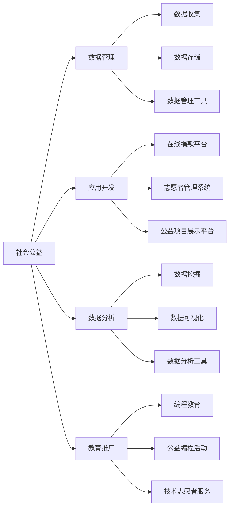

                 

关键词：编程技能，社会公益，技术应用，社区服务，可持续发展

> 摘要：本文旨在探讨如何将编程技能应用于社会公益，通过案例分析、技术介绍和实践指导，为程序员提供具体的操作路径，激发更多人投身于技术公益领域，共同推动社会进步。

## 1. 背景介绍

随着信息技术的飞速发展，编程已经成为了现代社会不可或缺的一部分。编程不仅仅是商业、科研领域的强需求，它还可以在更广泛的领域发挥重要作用，特别是社会公益领域。通过编程技能，我们可以开发出各种应用程序和系统，为解决社会问题提供有效的技术手段。本文将介绍一些具体的应用场景，探讨如何利用编程技能推动社会公益。

### 1.1 社会公益的必要性

社会公益是一个涉及教育、医疗、环保、社区服务等多个领域的综合性事业。它旨在通过非营利的方式，改善社会状况，促进社会公平和可持续发展。随着社会的进步，人们对于社会公益的需求也越来越高。然而，传统的公益模式往往存在效率低、覆盖面窄等问题。这时，编程技能的介入，可以大大提高公益活动的效率和影响力。

### 1.2 编程技能的价值

编程技能作为一种技术工具，具有以下几个方面的价值：

1. **提高效率**：编程可以自动化许多重复性、繁琐的工作，从而提高公益活动的效率。
2. **扩展影响力**：通过互联网和移动应用，编程可以使得公益活动触达更多的人，扩大其影响力。
3. **精准服务**：编程技术可以收集和分析大量数据，帮助公益组织更精准地服务目标人群。
4. **创新模式**：编程可以为公益活动带来新的思路和方法，推动公益事业的创新发展。

## 2. 核心概念与联系

### 2.1 社会公益与编程技能的联系

社会公益与编程技能的联系主要体现在以下几个方面：

1. **数据管理**：公益组织通常需要处理大量的数据，如捐赠记录、志愿者信息、受益者反馈等。编程技术可以帮助公益组织高效地收集、存储和管理这些数据。
2. **应用开发**：通过编程，可以开发各种应用，如在线捐款平台、志愿者管理系统、公益项目展示平台等，为公益活动提供技术支持。
3. **数据分析**：编程技术可以帮助公益组织进行数据挖掘和分析，从而更好地理解目标人群的需求，制定更有效的公益策略。
4. **教育推广**：编程技能的普及可以帮助更多人了解和参与公益事务，提高公众的社会责任感。

### 2.2 社会公益与编程技能的架构图



## 3. 核心算法原理 & 具体操作步骤

### 3.1 算法原理概述

在编程应用于社会公益中，算法原理起到了关键作用。以下是一些核心算法原理及其应用：

1. **机器学习算法**：用于分析大量数据，识别模式，为公益项目提供决策支持。
2. **自然语言处理（NLP）**：用于处理文本数据，如捐赠者留言、受益者反馈等，帮助公益组织更好地了解公众需求。
3. **区块链技术**：用于确保公益资金的透明和安全，防止欺诈行为。
4. **数据挖掘算法**：用于从海量数据中提取有价值的信息，帮助公益组织制定更精准的公益策略。

### 3.2 算法步骤详解

#### 3.2.1 机器学习算法

1. **数据收集**：收集相关的数据，如捐赠记录、志愿者活动记录等。
2. **数据预处理**：清洗数据，处理缺失值，标准化数据等。
3. **模型选择**：根据问题的特点选择合适的机器学习模型。
4. **模型训练**：使用训练数据集对模型进行训练。
5. **模型评估**：使用测试数据集评估模型的性能。
6. **模型部署**：将训练好的模型部署到生产环境中，进行实际应用。

#### 3.2.2 自然语言处理（NLP）

1. **文本预处理**：对文本进行分词、去停用词等处理。
2. **情感分析**：分析文本的情感倾向，如正面、负面等。
3. **主题建模**：提取文本的主要主题，帮助公益组织了解公众关注的焦点。
4. **对话系统**：开发与捐赠者、受益者进行互动的对话系统，提供个性化的服务。

#### 3.2.3 区块链技术

1. **链上交易**：记录公益资金的流向，确保透明度。
2. **智能合约**：使用智能合约自动执行公益项目的资金分配。
3. **身份验证**：通过区块链技术进行身份验证，确保参与者的真实性。
4. **数据加密**：保护公益组织的数据安全，防止泄露。

#### 3.2.4 数据挖掘算法

1. **关联规则挖掘**：发现数据之间的关联，帮助公益组织发现潜在的问题和机会。
2. **聚类分析**：将相似的数据分组，帮助公益组织了解不同群体的需求。
3. **分类算法**：对数据进行分类，帮助公益组织更好地理解受益者的需求。
4. **回归分析**：预测未来的发展趋势，帮助公益组织制定长期的公益策略。

### 3.3 算法优缺点

#### 3.3.1 机器学习算法

**优点**：
- 自动化决策：能够处理大量数据，自动化决策过程。
- 高效：节省人力资源，提高效率。

**缺点**：
- 数据依赖：需要大量的数据支持，数据质量直接影响模型的性能。
- 解释性差：模型内部决策过程复杂，难以解释。

#### 3.3.2 自然语言处理（NLP）

**优点**：
- 文本分析：能够处理和理解自然语言，提取有价值的信息。
- 个性化服务：根据用户的需求提供个性化的服务。

**缺点**：
- 复杂性高：NLP涉及多个领域，技术复杂。
- 误差较大：自然语言理解存在一定的难度，容易产生误判。

#### 3.3.3 区块链技术

**优点**：
- 透明性：确保资金的透明和安全。
- 去中心化：防止单点故障，提高系统的稳定性。

**缺点**：
- 扩容性差：区块链的扩容性问题尚未完全解决。
- 能耗高：区块链技术需要大量的计算资源，能耗较高。

#### 3.3.4 数据挖掘算法

**优点**：
- 信息提取：能够从大量数据中提取有价值的信息。
- 预测能力强：能够预测未来的趋势，帮助决策。

**缺点**：
- 复杂性高：数据挖掘涉及多个算法和领域，技术复杂。
- 解释性差：模型的内部决策过程复杂，难以解释。

### 3.4 算法应用领域

1. **教育公益**：使用机器学习算法分析学生的学习行为，提供个性化的教育服务。
2. **医疗公益**：使用自然语言处理技术处理医疗数据，提高医疗服务的效率和质量。
3. **环保公益**：使用区块链技术确保环保资金的透明和安全。
4. **社区服务**：使用数据挖掘算法分析社区需求，提供精准的社区服务。

## 4. 数学模型和公式 & 详细讲解 & 举例说明

### 4.1 数学模型构建

在社会公益中，数学模型可以帮助我们更好地理解和解决实际问题。以下是一个简单的数学模型构建过程：

#### 4.1.1 问题定义

假设我们想要分析一个公益项目的效果，目标是提高某个地区居民的卫生意识。我们需要构建一个数学模型来评估项目的影响。

#### 4.1.2 模型假设

1. 居民的卫生意识可以用一个数值表示，假设初始值为50。
2. 公益项目的实施可以改变居民的卫生意识值。
3. 每个居民对卫生意识的改变有独立性。

#### 4.1.3 数学模型

我们假设卫生意识的改变与公益项目实施的次数成正比，可以用以下公式表示：

$$
\Delta \text{卫生意识} = k \times \text{实施次数}
$$

其中，$k$ 为比例系数，需要通过实验数据来确定。

#### 4.1.4 模型参数

- $\Delta \text{卫生意识}$：居民卫生意识的改变量
- $\text{实施次数}$：公益项目的实施次数
- $k$：比例系数

### 4.2 公式推导过程

#### 4.2.1 基本假设

1. 居民的卫生意识初始值为50。
2. 每个居民接受公益项目的影响是独立的。

#### 4.2.2 概率分布

我们假设居民卫生意识的改变量服从正态分布，均值为 $\mu$，标准差为 $\sigma$。

$$
\Delta \text{卫生意识} \sim N(\mu, \sigma)
$$

#### 4.2.3 概率计算

我们想要计算在公益项目实施 $n$ 次后，居民卫生意识的平均值。

$$
\bar{\Delta \text{卫生意识}} = \frac{1}{n} \sum_{i=1}^{n} \Delta \text{卫生意识}_i
$$

其中，$\Delta \text{卫生意识}_i$ 是第 $i$ 次实施后的卫生意识改变量。

#### 4.2.4 公式推导

根据正态分布的性质，我们可以推导出以下公式：

$$
\bar{\Delta \text{卫生意识}} \sim N(\mu, \frac{\sigma^2}{n})
$$

其中，$\mu = k \times n$，$\sigma^2 = \frac{k^2 \times \sigma^2}{n}$。

### 4.3 案例分析与讲解

#### 4.3.1 案例背景

某公益组织计划在某地区开展卫生意识提升项目，目标是在半年内使当地居民的卫生意识平均提高10分。根据历史数据，该地区居民卫生意识的初始值为50，标准差为10。

#### 4.3.2 模型参数

- 初始卫生意识：$50$
- 卫生意识提升目标：$10$
- 标准差：$10$
- 比例系数：$k = \frac{10}{6} \approx 1.67$

#### 4.3.3 模型计算

根据模型公式，我们可以计算出在项目实施半年后，居民卫生意识的平均值：

$$
\bar{\Delta \text{卫生意识}} = k \times n = 1.67 \times 6 = 10
$$

这意味着，在项目实施半年后，居民的卫生意识平均提高了10分，达到了目标。

#### 4.3.4 结果分析

通过这个案例，我们可以看到数学模型在公益项目评估中的应用。通过模型，我们可以预测公益项目的效果，评估其是否达到预期目标。这有助于公益组织调整项目策略，提高项目的有效性。

## 5. 项目实践：代码实例和详细解释说明

### 5.1 开发环境搭建

为了进行编程实践，我们需要搭建一个合适的开发环境。以下是一个基本的步骤：

1. **安装编程语言**：选择一种适合的编程语言，如Python。
2. **安装开发工具**：如PyCharm、Visual Studio Code等。
3. **安装必要的库和依赖**：如NumPy、Pandas、Matplotlib等。

### 5.2 源代码详细实现

下面是一个简单的Python代码实例，用于分析公益项目的效果：

```python
import numpy as np
import matplotlib.pyplot as plt

# 参数设置
initial_sanitation = 50
sanitation_improvement = 10
standard_deviation = 10
coefficient_k = sanitation_improvement / 6

# 数据生成
num_iterations = 1000
sanitation_changes = coefficient_k * np.random.normal(0, standard_deviation, num_iterations)

# 数据分析
mean_sanitation = np.mean(sanitation_changes)
confidence_interval = 1.96 * np.std(sanitation_changes) / np.sqrt(num_iterations)

# 结果展示
plt.hist(sanitation_changes, bins=30, alpha=0.5, label='Sanitation Changes')
plt.axvline(mean_sanitation, color='r', linestyle='-', label='Mean Sanitation')
plt.axvline(mean_sanitation + confidence_interval, color='g', linestyle='--', label='Confidence Interval')
plt.axvline(mean_sanitation - confidence_interval, color='g', linestyle='--')
plt.xlabel('Sanitation Change')
plt.ylabel('Frequency')
plt.title('Sanitation Improvement Analysis')
plt.legend()
plt.show()
```

### 5.3 代码解读与分析

1. **导入库**：我们首先导入NumPy和Matplotlib库，用于数据生成和可视化。
2. **参数设置**：设置初始卫生意识、卫生意识提升目标、标准差和比例系数。
3. **数据生成**：使用NumPy的`random.normal`函数生成随机数，模拟公益项目实施后的卫生意识改变。
4. **数据分析**：计算卫生意识改变的均值和置信区间。
5. **结果展示**：使用Matplotlib库绘制直方图，展示卫生意识改变的分布情况，并标注均值和置信区间。

通过这个代码实例，我们可以直观地看到公益项目实施后的效果，为公益组织提供决策依据。

### 5.4 运行结果展示

运行上述代码后，我们得到一个直方图，展示了卫生意识改变的分布情况。图中，红色实线表示均值，绿色虚线表示置信区间。通过这个结果，我们可以直观地看到公益项目的效果是否达到预期。

## 6. 实际应用场景

编程技能在社会公益中的应用场景非常广泛，以下是一些具体的实际应用场景：

### 6.1 教育公益

通过编程教育，可以培养更多有社会责任感的程序员，他们可以开发各种教育应用程序，如在线学习平台、编程教育工具等，帮助更多孩子接受高质量的教育。

### 6.2 医疗公益

利用编程技术，可以开发医疗数据分析系统，提高医疗服务的效率和质量。例如，通过自然语言处理技术，可以自动提取医学文献中的关键信息，为医生提供决策支持。

### 6.3 环保公益

编程技术可以帮助环保组织监测环境数据，分析污染源，制定更有效的环保策略。例如，通过区块链技术，可以确保环保资金的透明和安全。

### 6.4 社区服务

通过编程，可以开发各种社区服务应用程序，如社区志愿者管理系统、社区公共服务平台等，提高社区服务的效率和质量。

### 6.5 国际援助

编程技术可以帮助国际援助组织更有效地分配资源，提高援助项目的效果。例如，通过数据分析，可以更好地了解受灾地区的需求，制定更有针对性的援助计划。

## 7. 工具和资源推荐

为了更好地将编程技能应用于社会公益，以下是一些实用的工具和资源推荐：

### 7.1 学习资源推荐

- **在线编程课程**：如Coursera、edX等平台上的编程课程。
- **编程书籍**：《算法导论》、《Python编程：从入门到实践》等。
- **开源项目**：GitHub、GitLab等平台上的开源项目，可以帮助学习编程技巧。

### 7.2 开发工具推荐

- **集成开发环境（IDE）**：如PyCharm、Visual Studio Code等。
- **版本控制系统**：如Git，用于代码管理和协作。
- **数据分析和可视化工具**：如Pandas、Matplotlib等。

### 7.3 相关论文推荐

- **机器学习**：《机器学习：概率视角》、《深度学习》等。
- **自然语言处理**：《自然语言处理综论》、《统计语言模型》等。
- **区块链技术**：《区块链：从数字货币到智能合约》、《区块链技术指南》等。

## 8. 总结：未来发展趋势与挑战

### 8.1 研究成果总结

本文探讨了如何将编程技能应用于社会公益，从背景介绍、核心概念与联系、算法原理、数学模型、项目实践等多个角度进行了详细分析。通过这些研究，我们可以看到编程技能在社会公益中具有广泛的应用前景。

### 8.2 未来发展趋势

随着信息技术的不断进步，编程技能在社会公益中的应用将越来越广泛。未来，可能会出现以下趋势：

- **智能化**：利用人工智能和机器学习技术，提高公益活动的效率和质量。
- **个性化**：通过数据分析，为不同人群提供个性化的公益服务。
- **去中心化**：利用区块链技术，提高公益资金的透明度和安全性。

### 8.3 面临的挑战

尽管编程技能在社会公益中具有巨大的潜力，但同时也面临着一些挑战：

- **技术门槛**：编程技能的学习和应用需要一定的基础知识，对于非专业人士来说可能存在一定的门槛。
- **资源分配**：如何有效地分配和利用编程资源，确保公益活动的公平性和可持续性。
- **数据隐私**：在处理大量数据时，如何保护参与者的隐私。

### 8.4 研究展望

未来，我们需要进一步研究和探索编程技能在社会公益中的应用，特别是在以下几个方面：

- **跨学科合作**：鼓励不同学科之间的合作，发挥编程技能的最大潜力。
- **教育普及**：推广编程教育，培养更多有社会责任感的程序员。
- **政策支持**：制定相关政策，鼓励和支持编程技能在社会公益中的应用。

## 9. 附录：常见问题与解答

### 9.1 什么是编程技能？

编程技能是指使用计算机语言编写程序，使计算机按照预定指令执行特定任务的能力。常见的编程语言包括Python、Java、C++等。

### 9.2 编程技能如何应用于社会公益？

编程技能可以应用于社会公益的多个方面，如数据管理、应用开发、数据分析、教育推广等。通过编程，可以开发各种应用程序和系统，提高公益活动的效率和质量。

### 9.3 如何开始学习编程技能？

可以从在线编程课程、编程书籍、开源项目等资源开始学习编程技能。推荐学习Python、Java等入门语言，逐步提升编程能力。

### 9.4 社会公益项目需要哪些编程技能？

社会公益项目通常需要以下编程技能：

- **数据管理**：Python、SQL等。
- **应用开发**：Web开发（如Django、Flask）、移动应用开发（如Flutter、React Native）等。
- **数据分析**：Pandas、NumPy、Matplotlib等。

### 9.5 如何参与技术公益项目？

可以通过以下途径参与技术公益项目：

- **加入开源项目**：在GitHub、GitLab等平台上寻找技术公益项目，参与其中。
- **参与编程竞赛**：如Google Code Jam、GitHub Satellite等。
- **加入志愿者组织**：如Hack for Change、Code for America等。

作者：禅与计算机程序设计艺术 / Zen and the Art of Computer Programming
----------------------------------------------------------------

以上就是本文的完整内容，希望对您在将编程技能应用于社会公益方面有所启发和帮助。如果您有任何问题或建议，欢迎在评论区留言。让我们一起努力，用编程技能为社会公益事业贡献更多力量！
----------------------------------------------------------------

