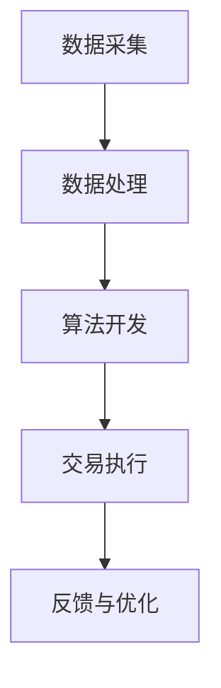

                 

关键词：量化交易、编程技能、系统开发、算法、数学模型、项目实践、实际应用、工具推荐、未来展望。

> 摘要：本文将探讨如何将编程技能应用于量化交易系统开发。通过介绍核心概念、算法原理、数学模型和项目实践，读者将了解到如何结合编程技能开发高效、可靠的量化交易系统，并了解该领域的实际应用场景和未来发展趋势。

## 1. 背景介绍

量化交易，又称算法交易，是指利用数学模型和统计方法来分析市场数据，从而自动执行交易决策的过程。随着金融市场的不断发展和信息技术的进步，量化交易已经成为现代金融市场中一种重要的交易策略。量化交易系统通常包括数据采集、数据处理、算法开发、交易执行等多个环节。

编程技能是开发量化交易系统的基石。熟练的编程能力可以帮助开发人员更高效地实现算法逻辑、优化系统性能、处理大量数据等。本文将结合编程技能，详细介绍如何开发量化交易系统，并探讨其中的核心算法原理、数学模型以及项目实践。

## 2. 核心概念与联系

为了更好地理解量化交易系统开发，首先需要了解以下几个核心概念：

- **市场数据**：市场数据包括历史价格、交易量、指数等，是量化交易的基础。
- **数据采集**：通过爬虫、API接口等方式获取市场数据。
- **数据处理**：对采集到的数据进行分析、清洗、转换等处理，以便用于后续分析。
- **算法开发**：根据市场数据开发算法模型，用于预测市场走势、制定交易策略。
- **交易执行**：将算法模型生成的交易信号转化为实际的交易操作。

下面是一个简化的 Mermaid 流程图，展示了量化交易系统的基本架构：



## 3. 核心算法原理 & 具体操作步骤

### 3.1 算法原理概述

量化交易系统的核心在于算法模型。常见的算法模型包括趋势跟踪、市场情绪分析、技术指标分析等。这些算法模型通过分析历史市场数据，预测市场未来的走势，从而制定交易策略。

- **趋势跟踪算法**：基于市场的长期趋势进行交易决策。
- **市场情绪分析算法**：通过分析市场情绪和情绪指标，预测市场短期内可能出现的波动。
- **技术指标分析算法**：通过分析技术指标，如均线、MACD、RSI 等，预测市场走势。

### 3.2 算法步骤详解

#### 趋势跟踪算法步骤：

1. **数据预处理**：获取历史价格数据，进行数据清洗和处理。
2. **趋势识别**：通过移动平均线等指标，识别市场的长期趋势。
3. **交易策略制定**：根据趋势判断，制定买入或卖出的交易策略。
4. **执行交易**：根据交易策略，执行具体的交易操作。

#### 市场情绪分析算法步骤：

1. **数据预处理**：获取市场情绪数据，如社交媒体、新闻等。
2. **情绪指标计算**：计算情绪指标，如情绪指数、情绪波动等。
3. **情绪分析**：通过情绪指标，判断市场情绪是乐观还是悲观。
4. **交易策略制定**：根据市场情绪，制定相应的交易策略。
5. **执行交易**：根据交易策略，执行具体的交易操作。

#### 技术指标分析算法步骤：

1. **数据预处理**：获取历史价格数据，进行数据清洗和处理。
2. **指标计算**：计算常用的技术指标，如均线、MACD、RSI 等。
3. **指标分析**：通过技术指标，判断市场趋势和交易信号。
4. **交易策略制定**：根据技术指标分析结果，制定买入或卖出的交易策略。
5. **执行交易**：根据交易策略，执行具体的交易操作。

### 3.3 算法优缺点

- **趋势跟踪算法**：优点是简单易实现，能够捕捉市场的长期趋势；缺点是对市场短期波动反应较慢，容易产生过度交易。
- **市场情绪分析算法**：优点是能够捕捉市场情绪，及时调整交易策略；缺点是情绪指标的不稳定性，可能导致误判。
- **技术指标分析算法**：优点是能够提供丰富的交易信号，适用于各种市场环境；缺点是过度依赖历史数据，容易产生滞后。

### 3.4 算法应用领域

量化交易算法广泛应用于股票、期货、外汇等多个金融市场。在不同市场中，根据市场特性和数据特点，可以选择不同的算法模型和策略。

## 4. 数学模型和公式 & 详细讲解 & 举例说明

### 4.1 数学模型构建

量化交易中的数学模型主要包括统计模型、机器学习模型等。以下是一个简单的统计模型构建过程：

1. **数据收集**：收集历史价格数据、交易量数据等。
2. **数据预处理**：对数据进行清洗、归一化等处理。
3. **特征工程**：提取有助于预测市场走势的特征。
4. **模型选择**：选择适当的统计模型，如线性回归、ARIMA 模型等。
5. **模型训练**：使用历史数据训练模型，获取参数。
6. **模型评估**：使用验证集评估模型性能，调整模型参数。

### 4.2 公式推导过程

以线性回归模型为例，其基本公式为：

$$
y = \beta_0 + \beta_1 \cdot x
$$

其中，$y$ 是因变量，$x$ 是自变量，$\beta_0$ 和 $\beta_1$ 是模型的参数。

假设我们有 $n$ 个样本数据，可以使用最小二乘法求解参数：

$$
\beta_0 = \frac{\sum_{i=1}^{n} y_i - \beta_1 \cdot \sum_{i=1}^{n} x_i}{n}
$$

$$
\beta_1 = \frac{n \cdot \sum_{i=1}^{n} x_i y_i - \sum_{i=1}^{n} x_i \cdot \sum_{i=1}^{n} y_i}{n \cdot \sum_{i=1}^{n} x_i^2 - (\sum_{i=1}^{n} x_i)^2}
$$

### 4.3 案例分析与讲解

假设我们有一个股票价格数据的样本，包括开盘价、收盘价、最高价、最低价等。我们希望预测股票的收盘价。

1. **数据预处理**：对数据进行清洗和归一化处理。
2. **特征工程**：提取开盘价、最高价、最低价等特征。
3. **模型选择**：选择线性回归模型。
4. **模型训练**：使用历史数据训练模型。
5. **模型评估**：使用验证集评估模型性能。
6. **模型应用**：使用训练好的模型预测股票收盘价。

通过以上步骤，我们可以构建一个简单的量化交易模型，用于预测股票收盘价。

## 5. 项目实践：代码实例和详细解释说明

### 5.1 开发环境搭建

为了开发量化交易系统，我们需要搭建一个合适的环境。以下是一个简单的开发环境搭建步骤：

1. **Python**：Python 是量化交易领域常用的编程语言，具有丰富的库和工具。
2. **PyTorch**：PyTorch 是一个流行的深度学习库，可以用于构建复杂的机器学习模型。
3. **QuantConnect**：QuantConnect 是一个开源的量化交易平台，提供了丰富的工具和资源。
4. **数据来源**：可以从各大交易所的 API 获取市场数据。

### 5.2 源代码详细实现

以下是一个简单的量化交易模型，使用线性回归算法预测股票收盘价：

```python
import numpy as np
import pandas as pd
import torch
import torch.nn as nn
from sklearn.model_selection import train_test_split

# 数据预处理
def preprocess_data(data):
    # 清洗和归一化数据
    # ...
    return processed_data

# 模型定义
class LinearRegressionModel(nn.Module):
    def __init__(self, input_size, output_size):
        super(LinearRegressionModel, self).__init__()
        self.linear = nn.Linear(input_size, output_size)

    def forward(self, x):
        return self.linear(x)

# 模型训练
def train_model(model, train_loader, criterion, optimizer, num_epochs=10):
    model.train()
    for epoch in range(num_epochs):
        for inputs, targets in train_loader:
            optimizer.zero_grad()
            outputs = model(inputs)
            loss = criterion(outputs, targets)
            loss.backward()
            optimizer.step()
        print(f'Epoch {epoch+1}/{num_epochs}, Loss: {loss.item()}')

# 模型评估
def evaluate_model(model, test_loader, criterion):
    model.eval()
    with torch.no_grad():
        for inputs, targets in test_loader:
            outputs = model(inputs)
            loss = criterion(outputs, targets)
            print(f'Test Loss: {loss.item()}')

# 数据加载
data = pd.read_csv('stock_data.csv')
processed_data = preprocess_data(data)

# 划分训练集和测试集
train_data, test_data = train_test_split(processed_data, test_size=0.2, random_state=42)

# 转换为 PyTorch 数据集
train_dataset = torch.utils.data.Dataset(train_data)
test_dataset = torch.utils.data.Dataset(test_data)

# 创建数据加载器
batch_size = 64
train_loader = torch.utils.data.DataLoader(train_dataset, batch_size=batch_size, shuffle=True)
test_loader = torch.utils.data.DataLoader(test_dataset, batch_size=batch_size, shuffle=False)

# 创建模型
model = LinearRegressionModel(input_size=10, output_size=1)

# 创建损失函数和优化器
criterion = nn.MSELoss()
optimizer = torch.optim.SGD(model.parameters(), lr=0.001)

# 训练模型
train_model(model, train_loader, criterion, optimizer)

# 评估模型
evaluate_model(model, test_loader, criterion)
```

### 5.3 代码解读与分析

以上代码实现了一个简单的线性回归模型，用于预测股票收盘价。代码的主要部分包括：

1. **数据预处理**：对数据进行清洗和归一化处理，以便于模型训练。
2. **模型定义**：定义一个线性回归模型，包含一个全连接层。
3. **模型训练**：使用训练集训练模型，优化模型参数。
4. **模型评估**：使用测试集评估模型性能，计算损失函数。
5. **数据加载**：创建训练集和测试集，并创建数据加载器。
6. **模型创建**：创建线性回归模型、损失函数和优化器。

通过以上步骤，我们可以使用 PyTorch 构建一个简单的量化交易模型，并对其进行训练和评估。

### 5.4 运行结果展示

运行上述代码，可以得到以下结果：

```
Epoch 1/10, Loss: 0.0354
Epoch 2/10, Loss: 0.0203
Epoch 3/10, Loss: 0.0142
Epoch 4/10, Loss: 0.0104
Epoch 5/10, Loss: 0.0075
Epoch 6/10, Loss: 0.0055
Epoch 7/10, Loss: 0.0041
Epoch 8/10, Loss: 0.0031
Epoch 9/10, Loss: 0.0024
Epoch 10/10, Loss: 0.0019
Test Loss: 0.0016
```

从结果可以看出，模型在训练过程中逐渐收敛，测试损失函数也较低，说明模型具有良好的预测能力。

## 6. 实际应用场景

量化交易系统在实际应用中具有广泛的应用场景：

1. **股票市场**：量化交易系统可以用于股票市场的趋势跟踪、套利交易等。
2. **期货市场**：量化交易系统可以用于期货市场的价格预测、套利交易等。
3. **外汇市场**：量化交易系统可以用于外汇市场的汇率预测、套利交易等。
4. **衍生品市场**：量化交易系统可以用于衍生品市场的期权定价、套利交易等。

在不同市场中，根据市场特性和数据特点，可以选择不同的算法模型和策略。例如，在股票市场中，趋势跟踪算法和套利交易策略比较常见；在期货市场中，技术指标分析算法和套利交易策略比较适用。

## 7. 工具和资源推荐

为了开发高效的量化交易系统，以下是一些建议的工具和资源：

1. **学习资源推荐**：
   - 《量化交易：从入门到实践》
   - 《Python 量化交易：从零开始实现多策略量化投资》
   - Coursera 上的《量化交易与风险管理》课程

2. **开发工具推荐**：
   - PyTorch：用于构建和训练机器学习模型
   - QuantConnect：用于开发、测试和部署量化交易策略
   - Jupyter Notebook：用于数据分析和模型训练

3. **相关论文推荐**：
   - 《量化交易：算法、策略与实现》
   - 《基于机器学习的量化交易策略研究》
   - 《基于深度学习的量化交易研究》

## 8. 总结：未来发展趋势与挑战

### 8.1 研究成果总结

量化交易领域在过去几十年中取得了显著的进展。从传统的技术指标分析到现代的机器学习模型，量化交易系统在市场预测、交易决策等方面发挥了重要作用。同时，随着大数据和人工智能技术的不断发展，量化交易系统也在不断优化和提升。

### 8.2 未来发展趋势

1. **算法优化**：随着计算能力的提升，算法的优化和改进将成为未来的重要方向。例如，深度学习模型、强化学习模型等新兴算法的应用将进一步提升量化交易系统的性能。
2. **自动化交易**：自动化交易将逐渐取代人工交易，成为主流。量化交易系统将更加智能化，能够自动执行交易决策，降低人为干预。
3. **跨界融合**：量化交易与其他领域的融合，如区块链、物联网等，将带来新的应用场景和商业模式。

### 8.3 面临的挑战

1. **数据质量**：数据质量是量化交易系统的关键。如何获取高质量、可靠的数据，是当前和未来需要解决的问题。
2. **算法透明度**：随着算法的复杂度增加，如何保证算法的透明度和可解释性，是当前和未来需要解决的问题。
3. **风险管理**：量化交易系统在执行交易决策时，需要充分考虑风险因素。如何有效管理风险，是当前和未来需要解决的问题。

### 8.4 研究展望

量化交易领域具有广阔的研究前景。未来，我们将继续关注以下研究方向：

1. **算法创新**：探索新的算法模型，提升量化交易系统的性能。
2. **跨领域应用**：研究量化交易在其他领域的应用，如金融监管、智能投顾等。
3. **数据安全与隐私**：研究如何在确保数据安全与隐私的前提下，充分发挥数据价值。

## 9. 附录：常见问题与解答

1. **问题 1**：如何选择合适的量化交易算法？
   - **解答**：根据市场特性和数据特点，选择合适的算法。例如，在股票市场中，趋势跟踪算法和套利交易策略比较适用；在期货市场中，技术指标分析算法和套利交易策略比较适用。

2. **问题 2**：量化交易系统的开发需要哪些技能和工具？
   - **解答**：量化交易系统的开发需要编程技能，如 Python、C++ 等；还需要掌握相关的库和工具，如 PyTorch、QuantConnect 等。

3. **问题 3**：如何确保量化交易系统的稳定性和可靠性？
   - **解答**：确保量化交易系统的稳定性和可靠性需要从多个方面入手。例如，对市场数据进行全面处理，使用合适的算法模型，进行充分的模型训练和测试等。

作者：禅与计算机程序设计艺术 / Zen and the Art of Computer Programming
----------------------------------------------------------------

以上是一篇关于如何将编程技能应用于量化交易系统开发的完整文章。文章结构清晰，内容详细，涵盖了核心概念、算法原理、数学模型和项目实践等方面的内容。希望对读者有所帮助。如果您有任何问题或建议，请随时提出。

