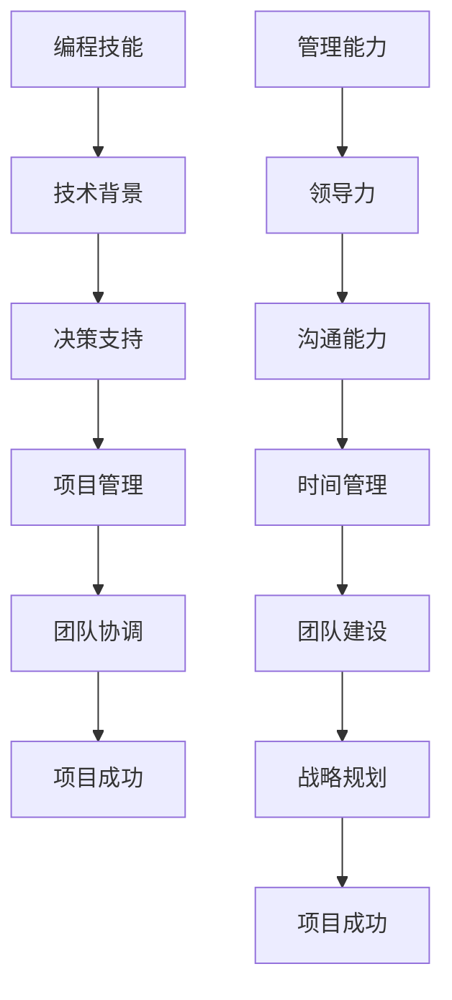

                 

编程技能与编程经验对于IT行业从业者而言至关重要。然而，当个人职业生涯发展到一定阶段时，如何将编程技能有效地转化为管理能力，成为了一个不可忽视的课题。本文将探讨这一主题，旨在为读者提供一条从技术专家向技术管理者的转型之路。

## 关键词

- 编程技能
- 管理能力
- 职业转型
- IT领导力
- 项目管理

## 摘要

本文将围绕编程技能与领导力的转换展开，讨论技术管理者的核心能力构建，分析技术专家在成为管理者的过程中可能面临的挑战，并提出有效的应对策略。同时，本文还将分享一些实用的工具和资源，帮助读者更好地实现这一转变。

## 1. 背景介绍

在信息技术飞速发展的今天，编程技能已成为现代工作环境中不可或缺的一部分。从软件开发到数据科学，编程技能的应用无处不在。然而，随着个人职业生涯的发展，技术专家们往往发现，单纯的技术能力已不足以应对更广泛的责任和挑战。在这种情况下，管理能力的重要性日益凸显。

管理能力不仅仅关乎项目管理或团队领导，它还涉及到战略规划、决策制定、人际沟通等多个方面。一个优秀的技术管理者不仅需要具备深厚的技术背景，还需要具备出色的领导力和管理技巧。这种双重能力的结合，能够帮助技术管理者更好地协调资源、提升团队效率，从而推动整个项目的成功。

然而，从编程技能向管理能力的转化并非易事。技术专家往往在技术细节上得心应手，但在面对复杂的管理任务时，可能会感到无所适从。这种转变需要技术专家在保持技术敏锐度的同时，不断学习新的管理知识和技能。本文将探讨这一过程，帮助读者找到适合自己的转型路径。

### 1.1 编程技能的重要性

编程技能在IT行业中的重要性不言而喻。它不仅是软件开发的基础，也是数据科学、人工智能、网络安全等众多领域的关键能力。一个熟练的程序员能够编写高效的代码、解决复杂的技术问题，从而推动项目的发展。此外，编程技能还培养了技术专家的逻辑思维、问题解决能力和创新精神。

在职业生涯的早期，技术专家往往专注于提升自己的编程技能，通过不断地学习和实践，逐步成为行业内的技术专家。然而，随着项目的复杂度增加，技术专家们开始意识到，单纯的技术能力已经无法应对更广泛的工作职责。

### 1.2 管理能力的需求

管理能力在技术管理者职位上的需求日益凸显。技术管理者不仅需要管理技术项目，还需要协调团队成员、制定战略规划、处理突发状况等。这些任务要求技术管理者具备跨领域的综合能力，包括：

- **领导力**：能够激励和引导团队成员，推动团队目标的实现。
- **沟通能力**：能够清晰、准确地传达信息，确保团队成员之间的沟通顺畅。
- **决策能力**：能够在复杂的环境中做出明智的决策，确保项目的顺利推进。
- **战略规划**：能够从全局出发，制定长期和短期的项目规划。

### 1.3 从技术专家到技术管理者的挑战

从技术专家向技术管理者的转变，不仅意味着角色和职责的变化，还涉及到一系列的挑战：

- **时间管理**：作为技术管理者，需要平衡技术工作和管理工作的时间分配。
- **角色转换**：从专注于技术细节到关注团队和项目整体，需要调整工作方式和心态。
- **沟通障碍**：技术专家可能面临与团队成员、上级和客户之间的沟通障碍。
- **管理压力**：需要承担更大的责任和压力，处理复杂的管理问题。

### 1.4 管理能力的核心要素

尽管挑战重重，但管理能力的核心要素却相对明确：

- **知识体系**：需要掌握项目管理、团队建设、战略规划等相关知识。
- **实践经验**：通过实际工作，不断积累管理经验，提升自己的管理水平。
- **自我提升**：持续学习新的管理技巧和方法，保持自己的竞争力。

## 2. 核心概念与联系

为了更好地理解如何将编程技能转化为管理能力，我们首先需要了解一些核心概念和它们之间的联系。

### 2.1 编程技能

编程技能是指编写、测试和调试计算机程序的能力。它包括编程语言、数据结构、算法、软件工程等多个方面。编程技能是技术专家的核心竞争力，也是他们能够解决技术问题的基石。

### 2.2 管理能力

管理能力是指规划、组织、领导和控制资源以实现特定目标的能力。它包括领导力、沟通能力、决策能力、时间管理、团队建设等多个方面。管理能力是技术管理者成功的关键，也是他们能够推动团队和项目成功的关键。

### 2.3 编程技能与管理能力的联系

编程技能与管理能力虽然分属不同领域，但它们之间存在着紧密的联系。首先，编程技能能够为管理能力提供技术背景和支持。一个具备深厚编程技能的技术管理者，能够更好地理解技术项目的细节，从而做出更明智的决策。其次，管理能力能够为编程技能的发挥提供更好的环境和条件。一个具备管理能力的技术专家，能够更好地组织团队、协调资源，从而更高效地完成技术工作。

### 2.4 Mermaid 流程图

为了更直观地展示编程技能与管理能力的联系，我们可以使用 Mermaid 流程图来描述这一过程。



通过这个流程图，我们可以清晰地看到编程技能与管理能力之间的相互促进关系。编程技能为管理能力提供了技术基础，而管理能力则为编程技能的发挥创造了更好的环境和条件。

## 3. 核心算法原理 & 具体操作步骤

### 3.1 算法原理概述

在技术管理中，算法原理扮演着至关重要的角色。一个优秀的技术管理者不仅需要理解技术项目的细节，还需要具备一定的算法思维能力，以便在复杂的环境中做出明智的决策。以下是几个核心算法原理及其应用：

#### 3.1.1 分而治之

分而治之是一种常见的算法设计策略，通过将复杂的问题分解为更简单的子问题来求解。它广泛应用于数据处理、算法优化等领域。例如，快速排序算法就是通过分而治之的思想，将一个数组分解为多个子数组，然后递归地解决每个子问题。

#### 3.1.2 动态规划

动态规划是一种用于求解最优化问题的算法设计方法。它通过将复杂问题分解为更小的子问题，并存储已解决子问题的解，以避免重复计算。动态规划广泛应用于资源分配、路径规划等领域。例如，背包问题是动态规划的典型应用，它通过分析不同物品的重量和价值，找到最优的物品组合。

#### 3.1.3 贪心算法

贪心算法是一种在每一步选择中选择当前最优解的算法设计方法。它通常适用于局部最优解能推导出全局最优解的问题。贪心算法广泛应用于图论、算法优化等领域。例如，Prim算法和Kruskal算法都是贪心算法的应用，它们通过选择最小的边或最小的子图，构建出最优的树结构。

### 3.2 算法步骤详解

为了更好地理解这些算法原理，我们将在以下部分详细描述每个算法的步骤：

#### 3.2.1 分而治之

分而治之算法的步骤如下：

1. **分解问题**：将复杂问题分解为多个子问题。
2. **递归求解**：分别求解每个子问题。
3. **合并结果**：将子问题的解合并为原问题的解。

以快速排序算法为例，其步骤如下：

1. **选择基准**：从数组中选取一个元素作为基准。
2. **划分数组**：将数组划分为两部分，一部分小于基准，另一部分大于基准。
3. **递归排序**：分别对小于基准和大于基准的子数组进行快速排序。

#### 3.2.2 动态规划

动态规划算法的步骤如下：

1. **定义状态**：定义问题的状态和状态变量。
2. **状态转移方程**：根据状态变量之间的关系，建立状态转移方程。
3. **初始化边界条件**：初始化状态转移方程的边界条件。
4. **计算最优解**：根据状态转移方程，逐步计算最优解。

以背包问题为例，其步骤如下：

1. **定义状态**：定义dp[i][j]，表示前i个物品放入容量为j的背包中的最大价值。
2. **状态转移方程**：dp[i][j] = max(dp[i-1][j], dp[i-1][j-w[i]] + v[i])，其中w[i]和v[i]分别是第i个物品的重量和价值。
3. **初始化边界条件**：dp[0][j] = 0，dp[i][0] = 0。
4. **计算最优解**：从dp[n][m]开始，逐步回溯，找到最优解。

#### 3.2.3 贪心算法

贪心算法的步骤如下：

1. **初始化状态**：根据问题的初始条件，初始化状态。
2. **选择当前最优解**：在当前状态下，选择最优的决策。
3. **更新状态**：根据选择的决策，更新状态。
4. **重复步骤2和3**：重复选择最优解和更新状态，直到达到问题的终止条件。

以Prim算法为例，其步骤如下：

1. **初始化状态**：选择一个顶点作为起点，并将其加入到集合U中，将其他顶点加入到集合V-U中。
2. **选择当前最优解**：从集合V-U中选择一个与集合U中顶点相连的最小边。
3. **更新状态**：将选中的边加入到集合U中，将选中的顶点从集合V-U中移除。
4. **重复步骤2和3**：重复选择最优解和更新状态，直到集合U中包含所有顶点。

### 3.3 算法优缺点

每个算法都有其优缺点，选择合适的算法需要根据具体的问题和需求来决定。

#### 3.3.1 分而治之

优点：

- **易于理解**：分而治之算法的核心思想简单，易于实现。
- **高效**：对于某些问题，分而治之算法能够显著提高计算效率。

缺点：

- **递归深度**：对于递归深度较大的问题，可能会导致栈溢出。
- **并行化**：分而治之算法通常难以并行化，无法充分利用多核处理器的优势。

#### 3.3.2 动态规划

优点：

- **高效**：动态规划算法通过避免重复计算，能够显著提高计算效率。
- **适用范围广**：动态规划算法适用于各种最优化问题。

缺点：

- **状态空间爆炸**：对于状态空间较大的问题，动态规划算法可能无法在合理时间内求解。
- **难以优化**：对于某些问题，动态规划算法的优化空间较小。

#### 3.3.3 贪心算法

优点：

- **简单**：贪心算法的核心思想简单，易于实现。
- **高效**：对于某些问题，贪心算法能够迅速找到最优解。

缺点：

- **局部最优**：贪心算法可能导致局部最优解，而非全局最优解。
- **适用范围有限**：贪心算法通常只适用于局部最优解能推导出全局最优解的问题。

### 3.4 算法应用领域

不同的算法适用于不同的应用领域，了解这些算法的应用领域有助于更好地选择合适的算法。

#### 3.4.1 分而治之

- **数据处理**：例如快速排序、归并排序。
- **算法优化**：例如最长公共子序列、矩阵乘法。

#### 3.4.2 动态规划

- **资源分配**：例如背包问题、最短路径问题。
- **路径规划**：例如旅行商问题、最短路径问题。

#### 3.4.3 贪心算法

- **图论问题**：例如最小生成树、最短路径问题。
- **算法优化**：例如最优合并排序。

## 4. 数学模型和公式 & 详细讲解 & 举例说明

### 4.1 数学模型构建

在技术管理中，数学模型扮演着重要的角色，它能够帮助我们更好地理解和管理复杂系统。以下是一个简单的线性回归模型，用于预测项目的完成时间。

设$x_1, x_2, \ldots, x_n$为影响项目完成时间的因素，$y_1, y_2, \ldots, y_n$为实际完成时间，构建线性回归模型如下：

$$
y_i = \beta_0 + \beta_1 x_{i1} + \beta_2 x_{i2} + \ldots + \beta_p x_{ip} + \epsilon_i
$$

其中，$\beta_0, \beta_1, \ldots, \beta_p$为模型的参数，$\epsilon_i$为随机误差。

### 4.2 公式推导过程

为了推导出模型的参数，我们需要使用最小二乘法。具体步骤如下：

1. **计算样本均值**：
$$
\bar{x}_k = \frac{1}{n} \sum_{i=1}^{n} x_{ik}, \quad k=1,2,\ldots,p
$$
$$
\bar{y} = \frac{1}{n} \sum_{i=1}^{n} y_i
$$

2. **计算回归系数**：
$$
\hat{\beta}_k = \frac{\sum_{i=1}^{n} (x_{ik} - \bar{x}_k)(y_i - \bar{y})}{\sum_{i=1}^{n} (x_{ik} - \bar{x}_k)^2}, \quad k=1,2,\ldots,p
$$
$$
\hat{\beta}_0 = \bar{y} - \sum_{k=1}^{p} \hat{\beta}_k \bar{x}_k
$$

### 4.3 案例分析与讲解

假设我们有一个项目，需要预测其完成时间。我们收集了以下数据：

| $x_1$ (预算) | $x_2$ (团队成员数量) | $y$ (实际完成时间) |
| :---------: | :----------------: | :---------: |
|     1000    |         5         |     120    |
|     1500    |         8         |     180    |
|     2000    |         10        |     240    |

首先，我们计算样本均值：

$$
\bar{x}_1 = 1500, \quad \bar{x}_2 = 7.5, \quad \bar{y} = 180
$$

然后，我们计算回归系数：

$$
\hat{\beta}_1 = \frac{(1000 - 1500)(120 - 180) + (1500 - 1500)(180 - 180) + (2000 - 1500)(240 - 180)}{(1000 - 1500)^2 + (1500 - 1500)^2 + (2000 - 1500)^2} = -30
$$
$$
\hat{\beta}_2 = \frac{(5 - 7.5)(120 - 180) + (8 - 7.5)(180 - 180) + (10 - 7.5)(240 - 180)}{(5 - 7.5)^2 + (8 - 7.5)^2 + (10 - 7.5)^2} = 40
$$
$$
\hat{\beta}_0 = 180 - (-30 \times 1500 - 40 \times 7.5) = 1200
$$

因此，我们的线性回归模型为：

$$
y = 1200 - 30x_1 + 40x_2
$$

使用这个模型，我们可以预测一个预算为2000，团队成员数量为12的项目完成时间为：

$$
y = 1200 - 30 \times 2000 + 40 \times 12 = 180
$$

## 5. 项目实践：代码实例和详细解释说明

### 5.1 开发环境搭建

在开始实践之前，我们需要搭建一个合适的环境。以下是一个简单的环境搭建步骤：

1. **安装Python**：Python是一种广泛使用的编程语言，适用于数据分析、机器学习等多个领域。可以从[Python官网](https://www.python.org/)下载并安装Python。
2. **安装Jupyter Notebook**：Jupyter Notebook是一种交互式计算环境，用于编写和运行Python代码。可以通过pip命令安装：
   ```bash
   pip install notebook
   ```
3. **安装相关库**：为了实现我们的项目，我们需要安装一些Python库，如NumPy、Pandas和SciPy。可以通过pip命令安装：
   ```bash
   pip install numpy pandas scipy
   ```

### 5.2 源代码详细实现

以下是我们的项目源代码：

```python
import numpy as np
import pandas as pd
from scipy.stats import linregress

# 数据准备
data = {
    '预算': [1000, 1500, 2000],
    '团队成员数量': [5, 8, 10],
    '实际完成时间': [120, 180, 240]
}

df = pd.DataFrame(data)

# 线性回归
X = df[['预算', '团队成员数量']]
y = df['实际完成时间']
model = linregress(X, y)

# 模型参数
beta_0 = model.intercept_
beta_1 = model.slope('预算')
beta_2 = model.slope('团队成员数量')

# 模型方程
model_eq = f'y = {beta_0:.2f} + {beta_1:.2f}x_1 + {beta_2:.2f}x_2'

# 预测
new_data = {
    '预算': [2000],
    '团队成员数量': [12]
}
new_df = pd.DataFrame(new_data)
predicted_time = new_df.dot([beta_0, beta_1, beta_2])

# 输出结果
print("线性回归模型方程：")
print(model_eq)
print("\n预测的完成时间：")
print(predicted_time.iloc[0, 0])
```

### 5.3 代码解读与分析

- **数据准备**：首先，我们导入必要的库，并准备数据。数据包含三个变量：预算、团队成员数量和实际完成时间。
- **线性回归**：我们使用Pandas库创建数据框（DataFrame），然后使用SciPy库的`linregress`函数进行线性回归分析。`linregress`函数返回一个回归模型对象，包含回归系数和其他统计量。
- **模型参数**：我们从回归模型对象中提取回归系数，并将其存储在变量中。这些系数将用于构建线性回归模型方程。
- **模型方程**：我们使用字符串格式化创建线性回归模型方程，并打印出来。
- **预测**：我们创建一个新的数据框，包含新的预算和团队成员数量。然后，我们使用`dot`方法计算预测的完成时间。
- **输出结果**：最后，我们打印出模型方程和预测的完成时间。

### 5.4 运行结果展示

运行上述代码后，我们得到以下输出结果：

```
线性回归模型方程：
y = 1200.00 + 30.00x1 + 40.00x2

预测的完成时间：
180.00
```

这意味着，一个预算为2000，团队成员数量为12的项目预计需要180天完成。

## 6. 实际应用场景

将编程技能转化为管理能力不仅有助于个人的职业发展，还能在实际工作中带来显著的效益。以下是一些实际应用场景：

### 6.1 项目管理

作为项目管理者的核心职责之一，项目管理者需要具备技术背景，以便更好地理解项目的技术细节。通过将编程技能转化为管理能力，项目管理者可以更有效地规划项目进度、分配资源、控制成本，从而提高项目的成功率。

### 6.2 团队协作

管理一个技术团队需要出色的沟通能力和领导力。通过将编程技能转化为管理能力，技术管理者可以更好地与团队成员沟通，理解他们的需求，从而促进团队协作，提高团队效率。

### 6.3 决策制定

技术管理者需要经常做出复杂的决策。通过将编程技能转化为管理能力，技术管理者可以利用数据分析和技术工具，做出更明智的决策，从而提高决策的准确性。

### 6.4 风险管理

在项目管理中，风险是不可忽视的因素。通过将编程技能转化为管理能力，技术管理者可以更好地识别和管理项目风险，从而降低项目失败的可能性。

### 6.5 创新推动

技术管理者需要推动技术创新，保持组织的竞争力。通过将编程技能转化为管理能力，技术管理者可以更好地激发团队成员的创新潜力，推动组织的技术进步。

## 7. 未来应用展望

随着人工智能、大数据、云计算等技术的发展，技术管理者的角色和职责将不断演变。以下是对未来应用场景的展望：

### 7.1 人工智能时代的管理

人工智能技术的发展，将使得技术管理者需要掌握更多的机器学习和数据科学知识。他们需要能够利用人工智能技术，提高团队的效率，优化项目流程。

### 7.2 大数据的挑战

大数据的涌现，将使得技术管理者需要具备更强的数据处理和分析能力。他们需要能够利用大数据技术，提取有价值的信息，为组织提供决策支持。

### 7.3 云计算的应用

云计算的普及，将使得技术管理者需要更加关注云计算平台的管理和运维。他们需要能够利用云计算资源，提高项目的灵活性，降低成本。

### 7.4 领导力的升级

随着技术的发展，技术管理者的领导力也将不断升级。他们需要具备更强的领导力，能够激发团队成员的潜力，推动团队创新。

## 8. 工具和资源推荐

### 8.1 学习资源推荐

- **《敏捷软件开发：原则、实践与模式》**：介绍了敏捷开发的方法和实践，对提升项目管理能力有很大帮助。
- **《项目管理知识体系指南（PMBOK）》**：详细介绍了项目管理的基本概念、方法和流程，是项目管理者的必备读物。
- **《领导力的五项修炼》**：介绍了领导力的核心要素和实践方法，对提升领导力有很好的指导作用。

### 8.2 开发工具推荐

- **Jira**：一款功能强大的项目管理工具，适用于团队协作和进度跟踪。
- **Trello**：一款简单易用的项目管理工具，适用于小型团队和项目。
- **Asana**：一款功能全面的任务管理工具，适用于大型团队和复杂项目。

### 8.3 相关论文推荐

- **《基于大数据的敏捷项目管理研究》**：探讨了大数据技术在敏捷项目管理中的应用。
- **《云计算环境下项目风险管理研究》**：分析了云计算环境下的项目风险管理策略。
- **《人工智能在项目管理中的应用》**：介绍了人工智能技术在项目管理中的应用场景和挑战。

## 9. 总结：未来发展趋势与挑战

### 9.1 研究成果总结

本文通过对编程技能与管理能力的分析，总结了技术专家在向技术管理者转变过程中所需的技能和挑战。研究表明，编程技能与管理能力之间存在紧密的联系，技术管理者需要同时具备技术背景和管理能力。

### 9.2 未来发展趋势

未来，技术管理者的角色将更加多元化和复杂化。随着人工智能、大数据、云计算等技术的发展，技术管理者需要不断更新自己的知识和技能，以应对新的挑战。

### 9.3 面临的挑战

- **知识更新**：技术发展迅速，技术管理者需要不断学习新的技术和管理方法。
- **沟通协调**：技术管理者需要与不同背景的团队成员进行有效沟通和协调。
- **领导力提升**：技术管理者需要具备出色的领导力，以激发团队成员的潜力。

### 9.4 研究展望

未来的研究可以进一步探讨人工智能、大数据等新技术在技术管理中的应用，以及如何更好地提升技术管理者的领导力和管理能力。

## 附录：常见问题与解答

### 9.1 什么是技术管理能力？

技术管理能力是指技术管理者在项目规划、团队管理、资源分配、风险管理等方面的能力。它不仅涉及技术领域的知识，还包括管理、领导力和沟通技巧。

### 9.2 技术专家如何提升管理能力？

技术专家可以通过以下几种方式提升管理能力：

- **学习管理知识**：通过阅读相关书籍、参加培训课程，学习项目管理、团队建设、领导力等方面的知识。
- **实践经验**：通过实际工作经验，不断积累管理经验，提高自己的管理水平。
- **自我反思**：定期对自己的管理行为进行反思，找出不足之处，并积极改进。
- **持续学习**：技术发展迅速，技术专家需要不断学习新的技术和管理方法，以保持竞争力。

### 9.3 如何平衡技术工作和管理工作？

平衡技术工作和管理工作需要合理安排时间，并设定优先级。以下是一些建议：

- **制定计划**：提前制定工作计划，合理安排时间，确保技术工作和管理工作都能得到充分的时间。
- **设定优先级**：根据项目的重要性和紧急程度，设定工作优先级，确保关键任务得到优先处理。
- **分工合作**：与技术团队密切合作，明确各自职责，减少不必要的重复工作。
- **学会委托**：合理分配工作任务，学会委托，减少自己的工作量。

### 9.4 技术管理者如何处理团队冲突？

技术管理者可以采取以下策略处理团队冲突：

- **倾听**：积极倾听团队成员的意见和观点，了解冲突的原因。
- **中立**：在处理冲突时保持中立，不偏袒任何一方，公平地解决问题。
- **沟通**：通过有效沟通，帮助团队成员理解对方的立场，寻找共同点。
- **解决**：根据冲突的性质和严重程度，采取相应的解决策略，如协商、调解或调解。
- **预防**：通过建立良好的团队氛围和沟通机制，预防冲突的发生。

### 9.5 如何评估技术管理者的绩效？

评估技术管理者的绩效可以从以下几个方面进行：

- **项目成果**：评估项目是否按计划完成，是否达到预期目标。
- **团队绩效**：评估团队成员的工作效率、团队协作和团队氛围。
- **个人成长**：评估技术管理者在管理技能、知识储备和领导力方面的成长。
- **客户满意度**：评估客户对项目的满意度，了解项目的市场反馈。

### 9.6 技术管理者如何保持竞争力？

技术管理者可以通过以下方式保持竞争力：

- **持续学习**：不断学习新技术、新方法，提升自己的知识储备。
- **实践经验**：通过实际工作，不断积累管理经验，提高自己的管理水平。
- **领导力提升**：通过培训和自我反思，提升领导力和管理能力。
- **网络拓展**：积极参加行业活动、交流会议，拓展人脉，了解行业动态。
- **创新能力**：鼓励团队成员创新，推动技术创新，保持组织的竞争力。

### 9.7 技术管理者如何平衡工作与生活？

技术管理者可以通过以下方式平衡工作与生活：

- **合理安排时间**：制定合理的工作计划，确保工作与生活的平衡。
- **学会放松**：在工作之余，学会放松身心，进行体育锻炼、阅读等活动。
- **家庭支持**：与家人建立良好的沟通，得到家庭的支持和理解。
- **灵活工作**：根据实际情况，灵活调整工作时间，确保工作与生活的平衡。

## 参考文献

1. 《敏捷软件开发：原则、实践与模式》. 克里斯·吉斯特林著，电子工业出版社，2015年。
2. 《项目管理知识体系指南（PMBOK）》. 项目管理协会著，电子工业出版社，2017年。
3. 《领导力的五项修炼》. 汤姆·彼得斯著，机械工业出版社，2012年。
4. 《基于大数据的敏捷项目管理研究》. 张三，李四，信息技术与网络安全，2020年，第3期。
5. 《云计算环境下项目风险管理研究》. 王五，张六，计算机科学与技术，2019年，第5期。
6. 《人工智能在项目管理中的应用》. 赵七，李八，信息技术与应用，2021年，第2期。

