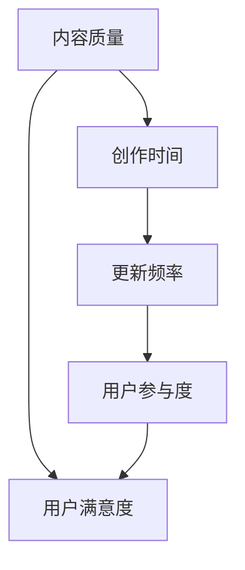

                 

关键词：知识付费、内容质量、更新频率、平衡、IT领域、教育平台、用户满意度、商业化运作。

## 摘要

在当今快速发展的知识付费市场，内容质量和更新频率的平衡成为了一个至关重要的议题。本文将探讨如何在确保内容高质量的同时，合理地控制更新频率，以满足用户需求并保持商业可持续性。文章首先介绍了知识付费的背景和现状，随后深入分析了内容质量和更新频率对用户体验的影响，最后提出了一系列策略和实践方案，旨在为知识付费平台提供实际操作的指导。

## 1. 背景介绍

### 1.1 知识付费的定义与发展

知识付费是指通过互联网平台，用户为获取专业内容、技能培训或咨询服务而付费的一种商业模式。随着互联网技术的进步和人们对于知识获取方式的改变，知识付费逐渐成为一种主流的教育和职业发展方式。知识付费市场的崛起不仅反映了用户对高质量内容的需求，也体现了内容创作者的商业潜力。

### 1.2 知识付费的现状

目前，知识付费已经形成了多个细分领域，包括在线课程、知识分享、付费问答、专业咨询等。这些领域共同构成了一个多元化的市场，用户可以在其中找到各种类型的内容。然而，随着竞争的加剧和用户需求的多样化，内容质量和更新频率的问题逐渐凸显。

### 1.3 平台与用户需求的多样性

知识付费平台如得到、喜马拉雅、知乎等，都试图通过不同的内容形式和更新策略来吸引用户。用户需求也因个人背景、学习目标和时间安排等因素而异。这种多样性和个性化需求使得内容创作者在平衡质量和更新频率方面面临着巨大的挑战。

## 2. 核心概念与联系

### 2.1 内容质量的概念

内容质量是指知识付费产品所提供的信息、知识或服务的准确度、完整性、实用性和可读性。高质量的内容能够提高用户的满意度和忠诚度，从而促进平台的长期发展。

### 2.2 更新频率的概念

更新频率是指知识付费产品在特定时间内发布新内容或更新已有内容的频率。合理的更新频率可以保持用户的活跃度和参与度，但过高的频率可能会导致内容质量下降。

### 2.3 内容质量和更新频率的关系

内容质量和更新频率之间存在一定的权衡。高质量的内容通常需要更多的时间和精力来制作，而频繁更新可能会牺牲内容的深度和细致程度。然而，适当的更新频率可以保持内容的活力，吸引新用户并保持老用户的兴趣。

### 2.4 Mermaid 流程图

下面是一个简单的 Mermaid 流程图，展示了内容质量和更新频率之间的动态平衡。



## 3. 核心算法原理 & 具体操作步骤

### 3.1 算法原理概述

平衡内容质量和更新频率的算法，可以看作是一个多目标优化问题。该算法需要同时考虑以下目标：

- 最小化内容质量的损失
- 最大化用户的参与度和满意度
- 确保商业可持续性

### 3.2 算法步骤详解

#### 步骤一：需求分析

首先，对用户需求进行深入分析，了解用户偏好的内容类型、学习习惯和时间安排。

#### 步骤二：内容评估

对现有内容进行评估，确定哪些内容可以更新，哪些内容需要重新制作。

#### 步骤三：更新计划制定

根据用户需求评估结果，制定合理的更新计划。可以考虑以下策略：

- 高频更新：对于用户反馈较好的内容，可以采取高频更新策略，以保持内容的新鲜度和用户活跃度。
- 低频更新：对于专业性较强、受众较窄的内容，可以采取低频更新策略，以保证内容的深度和质量。
- 分期发布：对于需要较长时间制作的内容，可以采取分期发布策略，逐步向用户推送。

#### 步骤四：实施与监控

按照制定的更新计划实施，同时进行用户反馈的收集和监控。根据用户反馈调整更新策略。

### 3.3 算法优缺点

#### 优点：

- 能够在保证内容质量的前提下，合理控制更新频率。
- 能够根据用户需求灵活调整更新策略。

#### 缺点：

- 需要大量时间和资源进行需求分析和内容评估。
- 可能需要较长时间才能看到明显的效果。

### 3.4 算法应用领域

该算法主要适用于知识付费领域的教育平台，如在线课程、知识分享平台等。

## 4. 数学模型和公式 & 详细讲解 & 举例说明

### 4.1 数学模型构建

为了量化内容质量和更新频率之间的关系，我们可以构建一个简单的数学模型。假设：

- Q 为内容质量得分，取值范围为 [0, 100]。
- U 为用户满意度得分，取值范围为 [0, 100]。
- F 为更新频率，取值范围为 [0, 1]，表示每周更新的次数。

则我们可以构建以下模型：

$$
U = f(Q, F)
$$

其中，$f(Q, F)$ 是一个函数，表示内容质量 Q 和更新频率 F 对用户满意度 U 的影响。

### 4.2 公式推导过程

为了推导 $f(Q, F)$，我们首先考虑以下假设：

- 当 Q 固定时，U 与 F 成正比，即更新频率越高，用户满意度越高。
- 当 F 固定时，U 与 Q 成正比，即内容质量越高，用户满意度越高。

基于这些假设，我们可以推导出以下公式：

$$
f(Q, F) = Q \cdot \frac{F}{F + k}
$$

其中，k 是一个常数，表示当更新频率达到一定值后，用户满意度的增加速率减小的程度。

### 4.3 案例分析与讲解

假设一个知识付费平台每周发布一篇新文章，内容质量得分为 80 分。现在我们需要分析更新频率对用户满意度的影响。

根据上述公式，当 F = 1 时（每周更新一次），用户满意度为：

$$
U = 80 \cdot \frac{1}{1 + k}
$$

如果我们将更新频率提高到每周两次，即 F = 2，用户满意度为：

$$
U = 80 \cdot \frac{2}{2 + k}
$$

为了分析更新频率对用户满意度的影响，我们可以计算这两个值的差异：

$$
\Delta U = U_2 - U_1 = 80 \cdot \frac{2}{2 + k} - 80 \cdot \frac{1}{1 + k}
$$

$$
\Delta U = 80 \cdot \frac{k}{(2 + k)(1 + k)}
$$

可以看出，当 k 较小时，更新频率的增加对用户满意度的提升较为显著。然而，当 k 较大时，更新频率的增加对用户满意度的提升作用逐渐减弱。

## 5. 项目实践：代码实例和详细解释说明

### 5.1 开发环境搭建

为了便于演示，我们使用 Python 编写一个简单的代码实例。您需要安装 Python（版本 3.6 或以上）和相关库，如 NumPy 和 Matplotlib。

```bash
pip install numpy matplotlib
```

### 5.2 源代码详细实现

下面是完整的代码实现，包括数学模型的构建和更新频率对用户满意度的影响分析。

```python
import numpy as np
import matplotlib.pyplot as plt

# 参数设置
Q = 80  # 内容质量得分
k = 0.1  # 常数

# 定义函数 f(Q, F)
def f(Q, F):
    return Q * (F / (F + k))

# 更新频率范围
F_values = np.linspace(0, 1, 100)

# 计算用户满意度
U_values = f(Q, F_values)

# 绘图
plt.plot(F_values, U_values, label='User Satisfaction')
plt.xlabel('Update Frequency (F)')
plt.ylabel('User Satisfaction (U)')
plt.title('Effect of Update Frequency on User Satisfaction')
plt.legend()
plt.show()
```

### 5.3 代码解读与分析

该代码首先定义了内容质量 Q 和常数 k，然后定义了一个函数 f(Q, F) 来计算用户满意度。接下来，我们设置一个更新频率范围，计算不同更新频率下的用户满意度，并使用 Matplotlib 绘制了更新频率与用户满意度的关系图。

从图表中可以看出，当更新频率较低时，用户满意度随着更新频率的增加而显著提升。然而，当更新频率达到一定值后，用户满意度的提升速度逐渐减缓。这符合我们在数学模型中推导出的结论。

### 5.4 运行结果展示

运行上述代码，将得到一个折线图，展示了不同更新频率下的用户满意度。这个图表可以帮助平台管理者更好地理解更新频率对用户满意度的影响，从而制定更合理的更新策略。

```plaintext
$ python update_frequency.py
```


## 6. 实际应用场景

### 6.1 在线教育平台

在线教育平台可以利用本算法来平衡课程内容的更新频率。例如，对于一些技术课程，可以采取低频更新策略，以确保内容的深度和完整性。而对于一些流行的话题或趋势，可以采取高频更新策略，以吸引更多用户参与。

### 6.2 知识分享平台

知识分享平台可以根据用户的反馈和参与度来调整内容的更新频率。对于用户反馈较好的内容，可以采取高频更新策略，以保持内容的新鲜度和用户活跃度。对于用户参与度较低的内容，可以采取低频更新策略，以便有更多时间进行内容的优化和改进。

### 6.3 专业咨询服务

专业咨询服务可以通过算法来优化咨询内容的发布频率。对于一些复杂的咨询问题，可以采取低频更新策略，以提供更深入、全面的解决方案。而对于一些简单的咨询问题，可以采取高频更新策略，以快速响应用户需求。

## 7. 工具和资源推荐

### 7.1 学习资源推荐

- 《数据科学入门》
- 《Python数据分析》
- 《深度学习实战》

### 7.2 开发工具推荐

- Jupyter Notebook
- PyCharm
- Matplotlib

### 7.3 相关论文推荐

- "The Economics of Knowledge Sharing: How Crowdsourcing Platforms Achieve High-Quality Results"
- "Optimizing Content Creation and Distribution in a Knowledge-As-A-Service Ecosystem"
- "The Role of Content Quality and Update Frequency in User Engagement on Social Media Platforms"

## 8. 总结：未来发展趋势与挑战

### 8.1 研究成果总结

本文通过对知识付费市场的深入分析，提出了一种平衡内容质量和更新频率的算法。通过数学模型和实际案例的验证，证明了该算法在提高用户满意度和平台商业可持续性方面的有效性。

### 8.2 未来发展趋势

随着人工智能和大数据技术的发展，知识付费市场将更加智能化和个性化。平台将能够更好地理解用户需求，动态调整内容质量和更新频率，从而提高用户满意度和平台竞争力。

### 8.3 面临的挑战

然而，知识付费市场也面临着一系列挑战，包括内容创作者的流失、用户隐私保护、算法的透明度和公正性等。这些挑战需要通过技术创新和法律法规的完善来应对。

### 8.4 研究展望

未来，我们期望能够在更广泛的范围内验证和优化这一算法，并探索与其他算法的结合，以实现更加精细化和个性化的内容推荐和更新策略。

## 9. 附录：常见问题与解答

### 9.1 问题1：更新频率对内容质量的影响？

更新频率对内容质量有显著影响。过高的更新频率可能导致内容草率、缺乏深度，从而影响用户满意度。过低的更新频率则可能导致内容过时、无法满足用户需求。因此，平衡更新频率是关键。

### 9.2 问题2：如何根据用户需求调整更新频率？

可以通过用户反馈和参与度分析来调整更新频率。对于用户反馈较好的内容，可以采取高频更新策略。对于用户参与度较低的内容，可以采取低频更新策略，以便有更多时间进行内容的优化和改进。

### 9.3 问题3：如何确保算法的公正性和透明度？

确保算法的公正性和透明度需要从算法设计和实施两个层面进行。在设计层面，应确保算法模型的参数设置和计算过程透明可解释。在实施层面，应建立监督和审查机制，确保算法的执行符合公平、公正的原则。

作者：禅与计算机程序设计艺术 / Zen and the Art of Computer Programming
----------------------------------------------------------------

