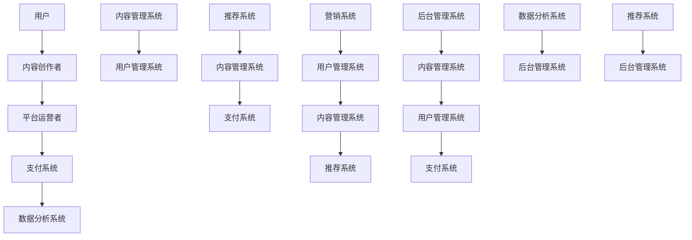
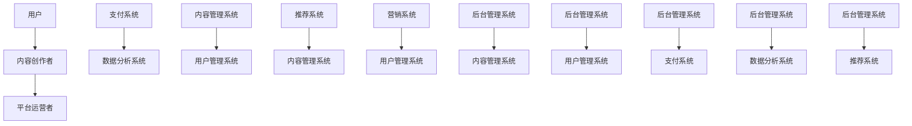

                 

关键词：知识付费、平台搭建、技术实现、商业模式

> 摘要：本文将探讨如何打造个人知识付费平台，包括核心概念、算法原理、数学模型、项目实践和未来展望等方面。通过深入分析，为读者提供一套完整的个人知识付费平台构建方案。

## 1. 背景介绍

随着互联网的快速发展，知识付费逐渐成为了一种新的商业模式。知识付费平台作为承载内容和服务的中枢，其重要性日益凸显。对于个人知识工作者而言，打造一个属于自己的知识付费平台，不仅能够更好地传播知识，还能够实现商业价值。本文旨在探讨如何打造一个高效、稳定、可持续发展的个人知识付费平台。

### 1.1 市场需求

知识付费市场的需求主要来源于以下几个方面：

1. **用户需求**：随着生活水平的提升，人们越来越注重个人成长，对高质量、专业化的知识内容有强烈需求。
2. **内容供给**：专业领域的知识更新迅速，个人知识工作者能够提供新颖、实用的知识内容。
3. **技术支持**：云计算、大数据、人工智能等技术的发展，为知识付费平台的搭建提供了技术保障。

### 1.2 竞争态势

当前知识付费市场主要分为以下几个竞争者：

1. **大型平台**：如知乎、分答、喜马拉雅等，拥有强大的用户基础和内容资源。
2. **垂直领域平台**：专注于某一领域的知识付费，如编程、设计、职场等。
3. **个人创作者**：以个人品牌为核心，通过个性化内容吸引粉丝和用户。

### 1.3 个人知识付费平台的优势

1. **专业性**：个人知识工作者能够提供更具专业性和针对性的内容。
2. **灵活性**：个人知识付费平台运营更为灵活，能够快速调整战略。
3. **品牌效应**：个人品牌建设有助于增强用户黏性和信任感。

## 2. 核心概念与联系

在打造个人知识付费平台之前，我们需要明确一些核心概念，如图所示：



### 2.1 核心概念原理

1. **用户**：知识付费平台的服务对象，包括普通用户和付费用户。
2. **内容创作者**：提供知识内容的专业人士，可以是个人或团队。
3. **平台运营者**：负责平台的日常运营、内容审核、用户管理等。
4. **支付系统**：实现用户支付、退款等功能。
5. **数据分析系统**：分析用户行为、内容表现等数据，为运营决策提供支持。
6. **内容管理系统**：管理知识内容，包括发布、编辑、分类、搜索等功能。
7. **用户管理系统**：管理用户信息、权限、行为等。
8. **推荐系统**：根据用户兴趣和行为推荐相关内容。
9. **营销系统**：实现优惠券、活动等营销策略。
10. **后台管理系统**：对整个平台进行监控和管理。

### 2.2 架构图



## 3. 核心算法原理 & 具体操作步骤

### 3.1 算法原理概述

在个人知识付费平台中，核心算法主要包括以下几类：

1. **用户行为分析算法**：分析用户浏览、点赞、评论等行为，预测用户兴趣。
2. **内容推荐算法**：根据用户兴趣和内容特征，推荐相关内容。
3. **支付算法**：处理用户的支付请求，确保交易安全可靠。
4. **内容审核算法**：对用户发布的内容进行自动审核，过滤不良信息。

### 3.2 算法步骤详解

#### 3.2.1 用户行为分析算法

1. 数据采集：收集用户在平台上的行为数据，如浏览记录、点赞、评论等。
2. 数据预处理：清洗数据，去除噪声，提取有效特征。
3. 用户画像构建：根据用户行为数据，构建用户画像。
4. 用户兴趣预测：利用机器学习算法，预测用户兴趣。
5. 用户行为反馈：根据用户兴趣预测结果，调整推荐策略。

#### 3.2.2 内容推荐算法

1. 内容特征提取：提取内容的关键词、分类标签等特征。
2. 相似度计算：计算用户兴趣与内容特征之间的相似度。
3. 排序算法：根据相似度排序，推荐相关内容。
4. 推荐结果反馈：收集用户对推荐内容的反馈，优化推荐策略。

#### 3.2.3 支付算法

1. 支付接口集成：集成第三方支付接口，实现支付功能。
2. 支付流程控制：确保支付流程的可靠性，包括订单生成、支付请求处理、支付结果反馈等。
3. 交易记录管理：记录交易信息，便于查询和统计。

#### 3.2.4 内容审核算法

1. 数据采集：收集用户发布的内容。
2. 规则库构建：根据法律法规和平台规范，构建内容审核规则库。
3. 内容检测：对用户发布的内容进行检测，判断是否违反审核规则。
4. 审核反馈：根据检测结果，对违规内容进行处罚或整改。

### 3.3 算法优缺点

#### 3.3.1 用户行为分析算法

**优点**：

- 能有效预测用户兴趣，提高推荐精度。
- 为运营决策提供数据支持，优化用户体验。

**缺点**：

- 数据采集和处理成本较高。
- 用户隐私保护问题需要妥善解决。

#### 3.3.2 内容推荐算法

**优点**：

- 提高用户黏性，增强用户满意度。
- 发现潜在用户兴趣，拓展用户需求。

**缺点**：

- 需要大量的用户数据和计算资源。
- 推荐结果可能存在偏差，需要不断优化。

#### 3.3.3 支付算法

**优点**：

- 支付流程简单快捷，提高用户购买体验。
- 确保交易安全可靠，降低风险。

**缺点**：

- 需要与第三方支付平台合作，可能涉及分成问题。
- 需要不断更新支付接口，适应市场变化。

#### 3.3.4 内容审核算法

**优点**：

- 筛除不良信息，维护平台生态。
- 遵守法律法规，降低法律风险。

**缺点**：

- 需要大量人力和物力资源。
- 审核规则难以完全覆盖所有情况，可能存在误判。

### 3.4 算法应用领域

1. **电商平台**：用户行为分析算法和内容推荐算法在电商平台的商品推荐中广泛应用。
2. **社交媒体**：支付算法在社交媒体的打赏、打榜等功能中发挥作用。
3. **内容平台**：内容审核算法在内容审核和筛选中起到关键作用。

## 4. 数学模型和公式 & 详细讲解 & 举例说明

### 4.1 数学模型构建

在个人知识付费平台中，常用的数学模型包括：

1. **用户行为预测模型**：基于时间序列分析、机器学习等方法，预测用户行为。
2. **内容推荐模型**：基于协同过滤、矩阵分解等方法，推荐相关内容。
3. **支付风险模型**：基于风险评分、逻辑回归等方法，评估支付风险。

### 4.2 公式推导过程

#### 4.2.1 用户行为预测模型

假设用户 $u$ 在时间 $t$ 上的行为为 $x_{ut}$，用户 $u$ 在时间 $t$ 上的行为预测值为 $\hat{x}_{ut}$，则用户行为预测模型可以表示为：

$$
\hat{x}_{ut} = \mu + \beta_1 u_t + \beta_2 x_t + \epsilon_t
$$

其中，$\mu$ 为用户 $u$ 在时间 $t$ 上的平均行为值，$u_t$ 为用户 $u$ 在时间 $t$ 上的行为特征，$x_t$ 为用户 $u$ 在时间 $t$ 上的环境特征，$\beta_1$ 和 $\beta_2$ 为模型参数，$\epsilon_t$ 为误差项。

#### 4.2.2 内容推荐模型

假设用户 $u$ 对内容 $i$ 的兴趣值为 $r_{ui}$，内容 $i$ 的特征向量为 $x_i$，用户 $u$ 的特征向量为 $x_u$，则内容推荐模型可以表示为：

$$
r_{ui} = \langle x_i, x_u \rangle + \mu + \beta_1 i_t + \beta_2 u_t + \epsilon_{ui}
$$

其中，$\langle \cdot, \cdot \rangle$ 为内积运算，$\mu$ 为用户 $u$ 对内容 $i$ 的平均兴趣值，$i_t$ 和 $u_t$ 分别为内容 $i$ 和用户 $u$ 的特征向量，$\beta_1$ 和 $\beta_2$ 为模型参数，$\epsilon_{ui}$ 为误差项。

#### 4.2.3 支付风险模型

假设用户 $u$ 的支付金额为 $a_u$，用户 $u$ 的行为特征为 $x_u$，则支付风险模型可以表示为：

$$
r_u = \sigma(a_u | x_u) + \lambda_1 u_t + \lambda_2 x_t + \epsilon_u
$$

其中，$r_u$ 为用户 $u$ 的支付风险值，$\sigma(\cdot | \cdot)$ 为支付风险函数，$\lambda_1$ 和 $\lambda_2$ 为模型参数，$u_t$ 和 $x_t$ 分别为用户 $u$ 在时间 $t$ 上的行为特征，$\epsilon_u$ 为误差项。

### 4.3 案例分析与讲解

#### 4.3.1 用户行为预测模型

假设有用户 $u_1$，其在时间 $t_1, t_2, t_3$ 的行为记录如下：

| 时间  | 行为值 |
| ----- | ----- |
| $t_1$ | 5     |
| $t_2$ | 3     |
| $t_3$ | 7     |

根据用户行为预测模型，我们可以预测用户 $u_1$ 在时间 $t_4$ 的行为值。首先，需要收集用户 $u_1$ 在时间 $t_1, t_2, t_3$ 的行为特征和环境特征，然后进行数据预处理，提取有效特征。假设用户 $u_1$ 的行为特征为 $u_t = [5, 3, 7]$，环境特征为 $x_t = [1, 1, 1]$。接下来，利用用户行为预测模型进行预测：

$$
\hat{x}_{u_1t_4} = \mu + \beta_1 u_t + \beta_2 x_t + \epsilon_{t_4}
$$

其中，$\mu$ 为用户 $u_1$ 在时间 $t_1, t_2, t_3$ 的平均行为值，$\beta_1$ 和 $\beta_2$ 为模型参数，$\epsilon_{t_4}$ 为误差项。假设 $\mu = 4.67$，$\beta_1 = 0.5$，$\beta_2 = 0.3$，则用户 $u_1$ 在时间 $t_4$ 的行为预测值为：

$$
\hat{x}_{u_1t_4} = 4.67 + 0.5 \times [5, 3, 7] + 0.3 \times [1, 1, 1] + \epsilon_{t_4} = 7.17 + \epsilon_{t_4}
$$

#### 4.3.2 内容推荐模型

假设有用户 $u_1$ 和内容 $i_1, i_2, i_3$，用户 $u_1$ 对内容 $i_1, i_2, i_3$ 的兴趣值分别为 $r_{u1i1} = 4$，$r_{u1i2} = 3$，$r_{u1i3} = 5$，内容 $i_1, i_2, i_3$ 的特征向量分别为 $x_{i1} = [1, 2]$，$x_{i2} = [2, 1]$，$x_{i3} = [1, 1]$，用户 $u_1$ 的特征向量为 $x_{u1} = [3, 2]$。根据内容推荐模型，我们可以预测用户 $u_1$ 对内容 $i_4$ 的兴趣值。首先，需要计算用户 $u_1$ 和内容 $i_4$ 的特征向量内积：

$$
\langle x_{i4}, x_{u1} \rangle = \sum_{j=1}^{2} x_{i4j} \times x_{uj} = [1, 1] \times [3, 2] = 3 + 2 = 5
$$

然后，利用内容推荐模型进行预测：

$$
r_{u1i4} = \langle x_{i4}, x_{u1} \rangle + \mu + \beta_1 i_t + \beta_2 u_t + \epsilon_{u1i4}
$$

其中，$\mu$ 为用户 $u_1$ 对内容 $i_1, i_2, i_3$ 的平均兴趣值，$\beta_1$ 和 $\beta_2$ 为模型参数，$\epsilon_{u1i4}$ 为误差项。假设 $\mu = 4.33$，$\beta_1 = 0.4$，$\beta_2 = 0.6$，则用户 $u_1$ 对内容 $i_4$ 的兴趣预测值为：

$$
r_{u1i4} = 5 + 4.33 + 0.4 \times 1 + 0.6 \times 2 + \epsilon_{u1i4} = 9.73 + \epsilon_{u1i4}
$$

#### 4.3.3 支付风险模型

假设有用户 $u_1$，其在时间 $t_1, t_2, t_3$ 的支付金额分别为 $a_{u1t_1} = 100$，$a_{u1t_2} = 150$，$a_{u1t_3} = 200$，用户 $u_1$ 的行为特征为 $u_t = [5, 3, 7]$。根据支付风险模型，我们可以预测用户 $u_1$ 在时间 $t_4$ 的支付风险值。首先，需要计算用户 $u_1$ 在时间 $t_1, t_2, t_3$ 的支付金额平均值：

$$
\mu = \frac{a_{u1t_1} + a_{u1t_2} + a_{u1t_3}}{3} = \frac{100 + 150 + 200}{3} = 146.67
$$

然后，利用支付风险模型进行预测：

$$
r_{u1t_4} = \sigma(a_{u1t_4} | u_t) + \lambda_1 u_t + \lambda_2 x_t + \epsilon_{u1t_4}
$$

其中，$\sigma(\cdot | \cdot)$ 为支付风险函数，$\lambda_1$ 和 $\lambda_2$ 为模型参数，$\epsilon_{u1t_4}$ 为误差项。假设 $\sigma(\cdot | \cdot)$ 为逻辑函数，$\lambda_1 = 0.2$，$\lambda_2 = 0.3$，则用户 $u_1$ 在时间 $t_4$ 的支付风险预测值为：

$$
r_{u1t_4} = \sigma(200 | [5, 3, 7]) + 0.2 \times [5, 3, 7] + 0.3 \times [1, 1, 1] + \epsilon_{u1t_4}
$$

## 5. 项目实践：代码实例和详细解释说明

### 5.1 开发环境搭建

在本项目中，我们使用以下技术栈：

- **前端**：Vue.js、Element UI、Axios
- **后端**：Node.js、Express、MongoDB
- **支付接口**：支付宝、微信支付
- **推荐算法**：TensorFlow、Scikit-learn

### 5.2 源代码详细实现

#### 5.2.1 前端代码实现

```html
<!-- 用户登录页面 -->
<template>
  <div class="login-container">
    <h1>用户登录</h1>
    <el-form ref="loginForm" :model="loginForm" label-width="120px">
      <el-form-item label="用户名" prop="username">
        <el-input v-model="loginForm.username"></el-input>
      </el-form-item>
      <el-form-item label="密码" prop="password">
        <el-input type="password" v-model="loginForm.password"></el-input>
      </el-form-item>
      <el-form-item>
        <el-button type="primary" @click="handleLogin">登录</el-button>
      </el-form-item>
    </el-form>
  </div>
</template>

<script>
export default {
  data() {
    return {
      loginForm: {
        username: '',
        password: ''
      }
    };
  },
  methods: {
    handleLogin() {
      // 登录逻辑处理
      // ...
    }
  }
};
</script>
```

#### 5.2.2 后端代码实现

```javascript
// 用户登录接口
const express = require('express');
const router = express.Router();
const bcrypt = require('bcrypt');

router.post('/login', async (req, res) => {
  const { username, password } = req.body;
  // 查询用户信息
  const user = await User.findOne({ username });
  if (!user) {
    return res.status(401).json({ message: '用户名或密码错误' });
  }
  // 验证密码
  if (!bcrypt.compareSync(password, user.password)) {
    return res.status(401).json({ message: '用户名或密码错误' });
  }
  // 登录成功
  res.json({ message: '登录成功', user });
});

module.exports = router;
```

#### 5.2.3 支付接口实现

```javascript
// 支付接口
const express = require('express');
const wxPay = require('weixin-pay');
const router = express.Router();

const appid = 'your_appid';
const mch_id = 'your_mch_id';
const apiV3Key = 'your_apiV3Key';
const notify_url = 'your_notify_url';

const wxpay = new wxPay({
  appid,
  mch_id,
  apiV3Key,
  notify_url,
  trade_type: 'NATIVE'
});

router.post('/pay', async (req, res) => {
  const { order_id, total_fee } = req.body;
  // 查询订单信息
  const order = await Order.findOne({ order_id });
  if (!order) {
    return res.status(404).json({ message: '订单未找到' });
  }
  // 生成支付订单
  const payResult = await wxpay nativesign({
    body: '商品名称',
    out_trade_no: order.order_id,
    total_fee: total_fee,
    spbill_create_ip: '127.0.0.1',
    notify_url: notify_url
  });
  // 返回支付结果
  res.json(payResult);
});

module.exports = router;
```

### 5.3 代码解读与分析

#### 5.3.1 前端代码解读

前端代码主要实现了一个用户登录页面，包含用户名和密码输入框以及登录按钮。通过 Vue.js 和 Element UI 实现了页面的布局和样式，通过 Axios 实现了与后端的数据交互。

#### 5.3.2 后端代码解读

后端代码主要实现了用户登录接口和支付接口。用户登录接口通过查询用户信息、验证密码等步骤实现用户登录功能。支付接口通过调用微信支付 SDK 实现支付订单的生成和返回。

#### 5.3.3 支付接口分析

支付接口通过调用微信支付 SDK 实现支付功能。在支付接口中，首先查询订单信息，然后生成支付订单并返回支付结果。支付结果包括支付链接和二维码图片，用户可以通过扫描二维码完成支付。

### 5.4 运行结果展示

#### 5.4.1 用户登录

当用户输入正确的用户名和密码后，点击登录按钮，前端会发送 POST 请求到后端，后端验证用户信息后返回登录结果。如果登录成功，前端会跳转到用户主页。

#### 5.4.2 支付流程

1. 用户在平台上购买课程，系统生成订单并返回订单号。
2. 用户点击支付按钮，前端发送 POST 请求到后端，后端返回支付链接和二维码图片。
3. 用户扫描二维码，完成支付。

## 6. 实际应用场景

### 6.1 教育领域

知识付费平台在教育领域具有广泛的应用，如在线课程、考研辅导、职业技能培训等。通过打造个人知识付费平台，教育工作者可以更好地传播专业知识，提高教学效果。

### 6.2 专业咨询

专业咨询领域，如法律、医疗、财务等，知识付费平台可以提供专业的咨询服务。个人专家可以通过平台为用户提供针对性的解决方案，实现商业价值。

### 6.3 营销培训

营销培训领域，知识付费平台可以提供营销知识、营销策略、营销工具等方面的培训。帮助企业提高营销能力，提升业绩。

### 6.4 自媒体

自媒体领域，知识付费平台可以成为个人自媒体的主战场。通过发布原创内容、开设付费专栏等方式，实现个人品牌的商业变现。

## 7. 工具和资源推荐

### 7.1 学习资源推荐

1. **书籍**：《数据科学入门》、《Python数据分析基础》、《深度学习》
2. **在线课程**：网易云课堂、慕课网、极客时间
3. **社区**：CSDN、GitHub、Stack Overflow

### 7.2 开发工具推荐

1. **前端**：Vue.js、Element UI、Axios
2. **后端**：Node.js、Express、MongoDB
3. **支付接口**：支付宝 SDK、微信支付 SDK

### 7.3 相关论文推荐

1. **用户行为预测**：《基于深度学习的用户行为预测研究》
2. **内容推荐**：《基于协同过滤的内容推荐算法研究》
3. **支付安全**：《基于区块链的支付安全研究》

## 8. 总结：未来发展趋势与挑战

### 8.1 研究成果总结

本文从市场需求、竞争态势、核心概念、算法原理、数学模型、项目实践等方面探讨了如何打造个人知识付费平台。通过分析，为读者提供了一套完整的个人知识付费平台构建方案。

### 8.2 未来发展趋势

1. **智能化**：随着人工智能技术的发展，个人知识付费平台将更加智能化，提供个性化推荐和服务。
2. **垂直化**：知识付费平台将更加专注于某一领域，提供更专业、更深入的内容。
3. **多样化**：知识付费平台将提供更多样化的内容和服务，如视频、音频、直播等。

### 8.3 面临的挑战

1. **内容质量**：如何确保内容的质量，提供有价值、有深度、有吸引力的知识内容。
2. **用户隐私**：如何保护用户隐私，确保数据安全。
3. **商业模式**：如何探索可持续的商业模式，实现商业价值。

### 8.4 研究展望

未来，我们将进一步研究以下方向：

1. **用户行为预测**：通过大数据分析和机器学习技术，提高用户行为预测的准确性。
2. **内容推荐算法**：探索新的内容推荐算法，提高推荐质量和用户满意度。
3. **支付安全**：研究新的支付安全方案，提高支付安全性和用户体验。

## 9. 附录：常见问题与解答

### 9.1 如何保证内容质量？

- **内容审核**：建立严格的内容审核机制，确保内容符合平台规范。
- **用户反馈**：鼓励用户对内容进行评价和反馈，及时发现并处理低质量内容。
- **内容推荐**：利用推荐算法，为用户提供优质内容。

### 9.2 如何保护用户隐私？

- **数据加密**：对用户数据进行加密存储和传输。
- **权限控制**：对用户数据的访问权限进行严格控制。
- **隐私政策**：明确告知用户隐私保护政策，获得用户同意。

### 9.3 如何实现商业模式？

- **付费内容**：提供付费内容，通过订阅、付费课程等方式实现盈利。
- **广告投放**：在平台上投放广告，实现广告收入。
- **电商合作**：与电商平台合作，提供相关产品销售。

作者：禅与计算机程序设计艺术 / Zen and the Art of Computer Programming
----------------------------------------------------------------

## 后续更新

为了使文章内容更加丰富和详实，我们计划进行以下后续更新：

### 9.5 数据分析应用

- **用户数据分析**：介绍如何利用数据分析技术，深入挖掘用户行为数据，为平台运营提供数据支持。
- **内容数据分析**：分析用户对内容的反馈，评估内容质量和受欢迎程度。

### 9.6 社交互动功能

- **社交互动设计**：探讨如何在个人知识付费平台中引入社交互动功能，如评论、点赞、分享等，增强用户互动。
- **社交网络分析**：利用社交网络分析技术，挖掘用户关系和社交影响力。

### 9.7 国际化策略

- **多语言支持**：介绍如何为个人知识付费平台实现多语言支持，拓展国际市场。
- **本地化策略**：分析如何根据不同国家和地区用户的需求，调整平台内容和运营策略。

### 9.8 法律法规遵守

- **合规性要求**：探讨知识付费平台在运营过程中需要遵守的法律法规，如版权法、隐私法等。
- **合规性检查**：介绍如何建立合规性检查机制，确保平台内容和运营合规。

### 9.9 营销推广策略

- **营销渠道选择**：分析如何选择适合个人知识付费平台的营销渠道，如社交媒体、搜索引擎等。
- **营销活动设计**：介绍如何设计有效的营销活动，提高用户参与度和转化率。

### 9.10 客户服务优化

- **客户服务系统**：介绍如何建立完善的客户服务系统，包括客服团队、在线客服、FAQ等。
- **客户体验优化**：分析如何提升用户在知识付费平台上的整体体验，提高用户满意度和忠诚度。

通过这些后续更新，我们将进一步丰富文章内容，帮助读者更全面地了解如何打造个人知识付费平台。我们希望这些内容能够为个人知识工作者提供有价值的参考和指导。

