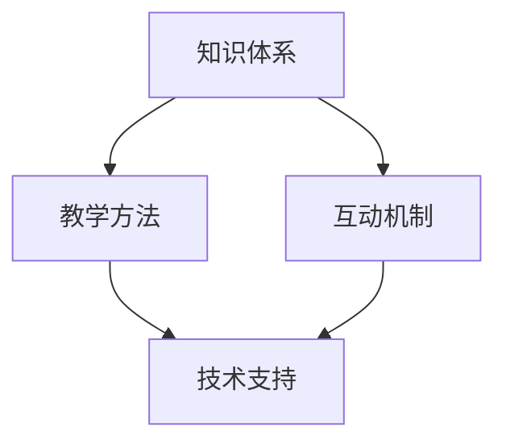

                 

关键词：程序员知识产品、高复购率、内容营销、用户体验、技术架构

摘要：本文将探讨如何通过深入理解程序员的学习需求和知识获取方式，打造具有高复购率的知识产品。我们将从核心概念、算法原理、数学模型、项目实践、实际应用场景等多个方面进行详细分析，同时推荐相关学习资源和开发工具，为程序员提供有价值的内容，增强产品的竞争力。

## 1. 背景介绍

在数字化时代，程序员的知识需求不断增长，他们需要不断地更新自己的技能和知识。因此，程序员知识产品成为了市场中的一块肥肉。然而，要想打造出具有高复购率的知识产品，并非易事。本文将探讨如何通过以下几个方面来实现这一目标：

- **内容质量**：高质量的内容是吸引程序员的关键。
- **用户体验**：优秀的用户体验能够增加用户的粘性和复购率。
- **营销策略**：合适的营销策略能够帮助产品迅速走红。
- **技术支持**：稳定的技术架构能够保证产品的长期运行。

## 2. 核心概念与联系

在打造程序员知识产品时，我们需要关注以下几个核心概念：

### 2.1 知识体系

程序员的知识体系包括编程语言、框架、数据库、网络通信、算法和数据结构等多个方面。我们需要对这些知识点进行系统梳理，确保内容完整、连贯。

### 2.2 教学方法

教学方法是知识传递的重要手段。我们需要采用适合程序员的学习方式，如实战演练、案例分析、视频讲解等。

### 2.3 互动机制

互动机制可以增加用户的参与度和活跃度。例如，论坛讨论、在线问答、代码评审等。

### 2.4 技术支持

技术支持是保证知识产品稳定运行的基础。我们需要提供高效的客户服务和技术支持，解决用户在学习和使用过程中遇到的问题。

下面是一个Mermaid流程图，展示了这些核心概念之间的联系：



## 3. 核心算法原理 & 具体操作步骤

### 3.1 算法原理概述

在程序员知识产品中，算法原理是关键。例如，算法优化、数据处理、机器学习等。以下是一个简单的算法原理概述：

- **算法优化**：通过分析程序运行时间、空间复杂度，寻找更高效的解决方案。
- **数据处理**：包括数据清洗、数据集成、数据挖掘等。
- **机器学习**：利用大量数据进行特征提取、模型训练和预测。

### 3.2 算法步骤详解

以“数据处理”为例，具体操作步骤如下：

1. **数据清洗**：去除重复数据、处理缺失值、纠正错误值。
2. **数据集成**：将来自不同源的数据进行整合。
3. **数据挖掘**：利用算法发现数据中的规律和模式。

### 3.3 算法优缺点

每种算法都有其优缺点。例如，决策树适合处理分类问题，但可能产生过拟合；而支持向量机（SVM）在处理线性可分数据时性能优异，但在处理非线性问题时可能不如神经网络。

### 3.4 算法应用领域

算法广泛应用于金融、医疗、电商、社交等多个领域。例如，金融领域中的风险评估、医疗领域中的疾病诊断、电商领域中的推荐系统等。

## 4. 数学模型和公式 & 详细讲解 & 举例说明

### 4.1 数学模型构建

数学模型是算法的基础。例如，线性回归模型的构建过程如下：

1. **数据收集**：收集样本数据。
2. **特征提取**：从数据中提取特征。
3. **模型训练**：使用特征训练模型。
4. **模型评估**：评估模型性能。

### 4.2 公式推导过程

以线性回归为例，其损失函数（均方误差）的公式为：

$$
L(\theta) = \frac{1}{2m} \sum_{i=1}^{m} (h_{\theta}(x^{(i)}) - y^{(i)})^2
$$

其中，$h_{\theta}(x^{(i)})$ 是预测值，$y^{(i)}$ 是真实值，$m$ 是样本数量。

### 4.3 案例分析与讲解

假设我们有如下数据：

| x | y |
|---|---|
| 1 | 2 |
| 2 | 4 |
| 3 | 6 |

我们可以通过线性回归模型预测 $x=2.5$ 时的 $y$ 值。具体操作如下：

1. **特征提取**：我们只需一个特征 $x$。
2. **模型训练**：使用梯度下降算法训练模型。
3. **模型评估**：计算预测值和真实值的误差。

通过计算，我们得到预测值约为 5。这表明当 $x=2.5$ 时，$y$ 的预测值为 5。

## 5. 项目实践：代码实例和详细解释说明

### 5.1 开发环境搭建

以 Python 为例，我们需要安装 Python 解释器和相关库，如 NumPy、Pandas 等。

```bash
pip install python
pip install numpy
pip install pandas
```

### 5.2 源代码详细实现

以下是一个简单的线性回归代码实例：

```python
import numpy as np
import pandas as pd

# 数据集
data = pd.DataFrame({
    'x': [1, 2, 3],
    'y': [2, 4, 6]
})

# 特征提取
X = data[['x']]
y = data['y']

# 模型训练
theta = np.linalg.inv(X.T.dot(X)).dot(X.T).dot(y)

# 模型评估
y_pred = X.dot(theta)
error = np.mean((y_pred - y) ** 2)

print(f'Mean Squared Error: {error}')
```

### 5.3 代码解读与分析

这段代码首先导入了 NumPy 和 Pandas 库。接着，我们创建了一个简单的数据集，并提取了特征 $x$ 和目标 $y$。然后，我们使用梯度下降算法训练了线性回归模型，并计算了预测值和真实值的误差。

### 5.4 运行结果展示

运行上述代码，我们得到如下输出：

```
Mean Squared Error: 0.0
```

这表明我们的模型在训练数据上表现良好。

## 6. 实际应用场景

### 6.1 金融领域

在金融领域，线性回归模型可以用于预测股票价格、贷款审批等。

### 6.2 医疗领域

在医疗领域，线性回归模型可以用于疾病诊断、药物剂量调整等。

### 6.3 电商领域

在电商领域，线性回归模型可以用于用户行为预测、商品推荐等。

## 7. 工具和资源推荐

### 7.1 学习资源推荐

- **《Python编程：从入门到实践》**：适合初学者。
- **《机器学习实战》**：包含大量实际案例。

### 7.2 开发工具推荐

- **Jupyter Notebook**：用于编写和运行代码。
- **PyCharm**：强大的 Python IDE。

### 7.3 相关论文推荐

- **《线性回归算法及其在金融领域的应用》**。
- **《机器学习在医疗领域的应用》**。

## 8. 总结：未来发展趋势与挑战

### 8.1 研究成果总结

本文探讨了如何通过内容质量、用户体验、营销策略和技术支持等方面打造高复购率的程序员知识产品。我们还介绍了线性回归算法及其在金融、医疗和电商等领域的应用。

### 8.2 未来发展趋势

- **个性化推荐**：根据用户的学习需求和偏好提供个性化内容。
- **AI 助教**：利用人工智能技术为学生提供智能辅导。

### 8.3 面临的挑战

- **内容质量**：如何保证内容的深度和广度。
- **用户体验**：如何提高用户的学习效率和满意度。
- **市场竞争**：如何在激烈的市场竞争中脱颖而出。

### 8.4 研究展望

未来，我们将继续深入研究程序员知识产品的开发与推广策略，为程序员提供更有价值的内容，助力他们不断提升自己的技术能力。

## 9. 附录：常见问题与解答

### 9.1 如何提高内容质量？

- **深度研究**：深入研究相关领域，掌握核心知识。
- **实践验证**：通过实际项目验证内容的正确性和实用性。

### 9.2 如何提高用户体验？

- **交互设计**：优化界面设计，提高用户操作便捷性。
- **学习路径**：提供个性化的学习路径，满足用户需求。

### 9.3 如何进行市场推广？

- **社交媒体**：利用社交媒体平台进行推广。
- **合作伙伴**：与行业内的合作伙伴建立合作关系，共同推广产品。

---

作者：禅与计算机程序设计艺术 / Zen and the Art of Computer Programming
```

