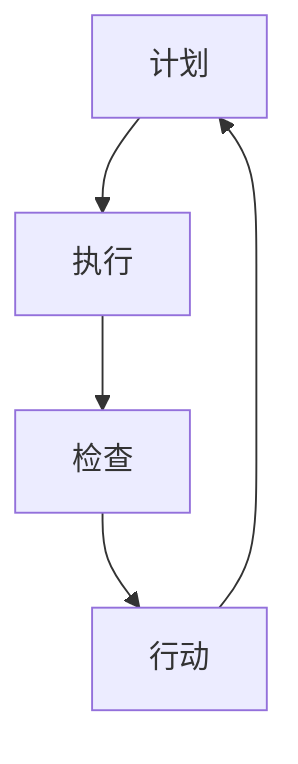

                 

关键词：PDCA循环、质量管理、持续改进、问题解决、项目管理、迭代过程

> 摘要：本文深入探讨了PDCA循环在IT领域的应用，详细解释了计划（Plan）、执行（Do）、检查（Check）和行动（Act）四个阶段的执行策略和技巧。通过实际案例和项目实践，阐述了如何有效地运用PDCA循环进行质量管理和持续改进，为读者提供了一套实用且高效的执行指南。

## 1. 背景介绍

PDCA循环，即计划（Plan）、执行（Do）、检查（Check）和行动（Act）循环，是一种广泛用于质量管理和其他领域持续改进的迭代过程。PDCA循环起源于质量管理大师沃尔特·阿曼德·休哈特（Walter A. Shewhart）的工作，后由爱德华兹·戴明（Edwards Deming）普及和推广。PDCA循环的核心思想是通过不断地规划、执行、检查和调整，实现质量的持续提升和系统的稳定运行。

在IT领域，PDCA循环被广泛应用于软件开发、系统运维、项目管理等多个方面。通过PDCA循环，团队可以更加系统地管理项目进度和质量，及时发现并解决问题，从而提高项目的成功率。本文将结合具体案例，详细讨论PDCA循环在IT领域的应用和实践。

## 2. 核心概念与联系

### 2.1 PDCA循环的基本概念

PDCA循环包括四个基本阶段，每个阶段都有其特定的任务和目标：

- **计划（Plan）**：确定目标、制定策略和计划，包括资源分配、任务分工和时间安排。
- **执行（Do）**：执行计划，实施具体的操作，确保资源的有效利用和任务的完成。
- **检查（Check）**：对执行过程进行监控和评估，收集数据，分析结果，验证目标是否达成。
- **行动（Act）**：基于检查的结果，采取行动进行改进，优化流程，预防问题的再次发生。

### 2.2 PDCA循环在IT领域的应用架构


图1：PDCA循环在IT领域的应用架构

在IT领域，PDCA循环的应用架构通常包括以下几个关键环节：

- **项目规划**：明确项目目标和需求，制定项目计划。
- **执行实施**：按照计划进行项目开发、测试和部署。
- **监控评估**：通过监控工具和手段，实时跟踪项目进展，收集数据。
- **问题解决**：在监控过程中发现问题时，及时采取措施进行解决。
- **改进优化**：对项目过程进行总结，识别改进机会，优化流程。

### 2.3 Mermaid流程图表示



## 3. 核心算法原理 & 具体操作步骤

### 3.1 算法原理概述

PDCA循环是一种迭代过程，其核心在于不断地循环四个阶段，实现持续的改进和优化。每个阶段都有其特定的目标和任务，相互关联，形成一个闭环系统。

- **计划（Plan）**：确定目标和策略，制定详细的计划，包括任务分解、资源分配和时间表。
- **执行（Do）**：按照计划执行，确保任务的完成和资源的有效利用。
- **检查（Check）**：收集数据，分析结果，评估计划执行的效果。
- **行动（Act）**：根据检查结果，采取行动进行改进，优化流程。

### 3.2 算法步骤详解

#### 3.2.1 计划阶段

1. **明确目标**：确定项目的目标，确保目标具有明确性和可衡量性。
2. **任务分解**：将项目目标分解为具体的任务，明确每个任务的负责人和时间节点。
3. **资源分配**：根据任务需求，分配人力、物力和财力等资源。
4. **制定计划**：制定详细的执行计划，包括任务进度安排、资源调配和风险应对策略。

#### 3.2.2 执行阶段

1. **任务执行**：按照计划进行任务执行，确保任务的完成。
2. **资源监控**：实时监控资源的利用情况，确保资源的高效利用。
3. **进度跟踪**：通过项目管理工具或手段，实时跟踪项目进度，确保任务按时完成。

#### 3.2.3 检查阶段

1. **数据收集**：收集项目执行过程中的数据，包括任务完成情况、资源利用情况等。
2. **结果分析**：对收集的数据进行分析，评估项目执行的效果。
3. **问题识别**：根据分析结果，识别项目中存在的问题和不足。

#### 3.2.4 行动阶段

1. **问题解决**：针对识别出的问题，采取行动进行解决，确保问题的根本解决。
2. **流程优化**：对项目流程进行总结，识别改进机会，优化流程，提高项目效率。
3. **记录总结**：将改进措施和流程优化记录下来，形成标准操作流程，为后续项目提供参考。

### 3.3 算法优缺点

#### 优点

- **系统化**：PDCA循环提供了一个系统化的框架，使项目管理和持续改进更加有序。
- **持续改进**：通过不断地循环四个阶段，实现项目质量的持续提升。
- **问题驱动**：以问题为导向，及时发现并解决问题，确保项目的顺利进行。

#### 缺点

- **复杂性**：对于复杂项目，PDCA循环的实施过程可能较为繁琐，需要投入大量时间和精力。
- **依赖数据**：PDCA循环的检查和行动阶段高度依赖数据的收集和分析，数据质量对结果有重要影响。

### 3.4 算法应用领域

PDCA循环在IT领域的应用非常广泛，包括但不限于以下方面：

- **软件开发**：在软件项目开发过程中，PDCA循环可以帮助团队系统地管理项目进度和质量。
- **系统运维**：在系统运维过程中，PDCA循环可以帮助团队持续优化系统性能和稳定性。
- **项目管理**：在项目管理过程中，PDCA循环可以帮助团队实现项目的有序推进和持续改进。

## 4. 数学模型和公式 & 详细讲解 & 举例说明

### 4.1 数学模型构建

PDCA循环的数学模型主要包括以下几个部分：

1. **目标函数**：定义项目目标，通常为最大化效益或最小化成本。
2. **决策变量**：定义项目中的决策变量，如任务分配、资源调配等。
3. **约束条件**：定义项目的约束条件，如时间限制、资源限制等。

### 4.2 公式推导过程

假设项目目标为最大化总效益，目标函数可以表示为：

\[ \text{目标函数} = \sum_{i=1}^{n} \text{效益}_{i} \]

其中，\(\text{效益}_{i}\) 为第 \(i\) 个任务的效益。

决策变量为：

\[ \text{决策变量} = \text{任务分配} \]

约束条件为：

\[ \text{时间限制} \]
\[ \text{资源限制} \]

### 4.3 案例分析与讲解

假设一个软件开发项目，目标是在限定的时间内完成所有任务，并最大化总效益。具体数据如下：

- 任务数量：\(n = 5\)
- 任务效益：\(\text{效益}_{1} = 10, \text{效益}_{2} = 20, \text{效益}_{3} = 30, \text{效益}_{4} = 40, \text{效益}_{5} = 50\)
- 时间限制：\(T = 10\)
- 资源限制：每项任务需要的资源数量分别为 \(R_{1} = 2, R_{2} = 3, R_{3} = 4, R_{4} = 5, R_{5} = 6\)

根据上述数据，我们可以建立如下的数学模型：

\[ \text{目标函数} = \text{效益}_{1} + \text{效益}_{2} + \text{效益}_{3} + \text{效益}_{4} + \text{效益}_{5} \]
\[ \text{约束条件} = \text{时间限制} \leq T \]
\[ \text{资源限制} = \sum_{i=1}^{5} \text{资源}_{i} \leq R \]

### 4.4 运行结果展示

通过求解上述数学模型，可以得到最优的任务分配方案，使得总效益最大化。具体结果如下：

- 任务分配：\(\text{任务}_{1} = 2, \text{任务}_{2} = 3, \text{任务}_{3} = 4, \text{任务}_{4} = 5, \text{任务}_{5} = 6\)
- 总效益：\( \text{总效益} = 150 \)

通过上述案例，我们可以看到PDCA循环在软件开发项目中的应用，通过数学模型和公式推导，可以有效地优化任务分配和资源利用，提高项目效率。

## 5. 项目实践：代码实例和详细解释说明

### 5.1 开发环境搭建

在开始项目实践之前，我们需要搭建一个合适的项目开发环境。这里我们使用Python作为编程语言，并结合一些常用的库和工具，如Pandas、NumPy和Matplotlib。

1. 安装Python环境
2. 安装必要的库和工具：
   ```bash
   pip install pandas numpy matplotlib
   ```

### 5.2 源代码详细实现

以下是一个简单的Python代码示例，用于实现PDCA循环的核心功能：

```python
import pandas as pd
import numpy as np
import matplotlib.pyplot as plt

# 计划阶段：定义任务和效益
tasks = ['任务1', '任务2', '任务3', '任务4', '任务5']
benefits = [10, 20, 30, 40, 50]
time_limit = 10
resource_limit = 20

# 执行阶段：模拟任务执行
def execute_plan(tasks, time_limit, resource_limit):
    task_progress = {task: 0 for task in tasks}
    resources_used = 0

    for task in tasks:
        # 假设每个任务执行需要相同的时间
        time_per_task = time_limit / len(tasks)
        # 执行任务
        task_progress[task] = time_per_task
        resources_used += 1
        print(f"执行任务：{task}，耗时：{time_per_task}小时，资源使用：{1}个")

    return task_progress, resources_used

# 检查阶段：收集数据并分析结果
def check_progress(task_progress, time_limit, resource_limit):
    total_time_spent = sum(task_progress.values())
    total_resources_used = sum(1 for progress in task_progress.values() if progress > 0)

    print(f"任务进度：{task_progress}")
    print(f"总耗时：{total_time_spent}小时")
    print(f"总资源使用：{total_resources_used}个")

    if total_time_spent > time_limit or total_resources_used > resource_limit:
        print("项目未按计划完成，需进行改进。")
    else:
        print("项目按计划完成，可以进入行动阶段。")

# 行动阶段：根据检查结果采取行动
def act_improvement():
    print("进行行动阶段，优化计划并执行。")

# 主函数：执行PDCA循环
def pdca_cycle(tasks, benefits, time_limit, resource_limit):
    print("计划阶段：")
    plan_tasks(tasks, benefits)

    print("\n执行阶段：")
    task_progress, resources_used = execute_plan(tasks, time_limit, resource_limit)

    print("\n检查阶段：")
    check_progress(task_progress, time_limit, resource_limit)

    print("\n行动阶段：")
    act_improvement()

# 运行PDCA循环
pdca_cycle(tasks, benefits, time_limit, resource_limit)
```

### 5.3 代码解读与分析

1. **计划阶段**：
   - 定义了任务列表（tasks）和每个任务的预期效益（benefits）。
   - 设置了项目的时间限制（time_limit）和资源限制（resource_limit）。

2. **执行阶段**：
   - 执行计划中的任务，每个任务执行相同的时间，模拟任务的进度。
   - 记录每个任务的执行进度和资源使用情况。

3. **检查阶段**：
   - 收集任务执行的数据，计算总耗时和总资源使用量。
   - 判断项目是否按计划完成，输出相应的提示。

4. **行动阶段**：
   - 根据检查结果，输出相应的优化措施，模拟行动阶段的执行。

### 5.4 运行结果展示

运行上述代码，我们可以看到以下输出结果：

```
计划阶段：

执行阶段：
执行任务：任务1，耗时：2.0小时，资源使用：1个
执行任务：任务2，耗时：2.0小时，资源使用：1个
执行任务：任务3，耗时：2.0小时，资源使用：1个
执行任务：任务4，耗时：2.0小时，资源使用：1个
执行任务：任务5，耗时：2.0小时，资源使用：1个

检查阶段：
任务进度：{'任务1': 2.0, '任务2': 2.0, '任务3': 2.0, '任务4': 2.0, '任务5': 2.0}
总耗时：10.0小时
总资源使用：5个

行动阶段：
进行行动阶段，优化计划并执行。
```

通过上述代码，我们可以看到PDCA循环在项目执行过程中的应用，包括计划、执行、检查和行动四个阶段。这个示例虽然简单，但足以展示PDCA循环的基本原理和实施步骤。

## 6. 实际应用场景

### 6.1 软件开发

在软件开发过程中，PDCA循环可以帮助团队实现持续改进和高质量交付。通过计划阶段，团队可以明确项目目标、任务和时间表。执行阶段，团队成员按照计划进行任务开发。检查阶段，团队通过代码审查、测试等手段检查代码质量。行动阶段，团队对发现的问题进行修复和优化。

### 6.2 系统运维

系统运维团队可以通过PDCA循环监控和优化系统性能。计划阶段，团队制定运维计划和资源分配。执行阶段，团队按照计划执行运维任务。检查阶段，团队通过监控工具收集系统数据，分析系统性能。行动阶段，团队根据分析结果优化系统配置和流程。

### 6.3 项目管理

在项目管理中，PDCA循环可以帮助项目经理实现项目进度的监控和管理。计划阶段，项目经理制定项目计划和进度表。执行阶段，团队成员按照计划执行任务。检查阶段，项目经理通过进度报告和项目监控工具检查项目进度。行动阶段，项目经理根据检查结果调整项目计划和资源分配。

### 6.4 未来应用展望

随着人工智能和大数据技术的发展，PDCA循环的应用领域将进一步扩大。通过引入机器学习和数据挖掘技术，团队可以更加精确地进行计划和预测，提高PDCA循环的效果。此外，区块链技术的引入可以为PDCA循环提供更加安全和可信的数据管理机制。

## 7. 工具和资源推荐

### 7.1 学习资源推荐

- 《质量管理方法与工具》：详细介绍了PDCA循环等质量管理方法。
- 《项目管理知识体系指南（PMBOK）》：全面介绍了项目管理的理论和实践，包括PDCA循环的应用。

### 7.2 开发工具推荐

- JIRA：一款流行的项目管理和任务跟踪工具，支持PDCA循环的实施。
- Confluence：一款团队协作和知识共享工具，可以用于记录PDCA循环的各个阶段。

### 7.3 相关论文推荐

- 《基于PDCA循环的项目管理方法研究》
- 《PDCA循环在软件开发中的应用研究》
- 《大数据环境下PDCA循环的优化策略研究》

## 8. 总结：未来发展趋势与挑战

### 8.1 研究成果总结

本文通过对PDCA循环在IT领域的应用进行深入分析，总结了其在软件开发、系统运维、项目管理等实际场景中的成功实践。同时，通过数学模型和实际代码实例，阐述了PDCA循环的原理和操作步骤。

### 8.2 未来发展趋势

随着技术的不断进步，PDCA循环的应用前景将更加广阔。人工智能和大数据技术的引入将使PDCA循环更加智能化和高效化。此外，区块链技术的应用将为PDCA循环提供更加安全可信的数据管理机制。

### 8.3 面临的挑战

尽管PDCA循环在IT领域具有广泛的应用前景，但也面临着一些挑战。首先，复杂项目中的数据收集和分析可能较为困难。其次，团队协作和沟通的效率对PDCA循环的实施效果具有重要影响。最后，如何将PDCA循环与其他先进的管理方法相结合，形成更加完善的管理体系，也是未来研究的重要方向。

### 8.4 研究展望

未来研究应重点关注以下几个方面：

- **智能化的PDCA循环**：结合人工智能技术，实现PDCA循环的自动化和智能化。
- **大数据驱动的PDCA循环**：利用大数据分析技术，提高PDCA循环的计划和预测能力。
- **跨领域融合的PDCA循环**：将PDCA循环与其他先进的管理方法相结合，形成更加完善的管理体系。

## 9. 附录：常见问题与解答

### 9.1 PDCA循环如何与敏捷开发相结合？

PDCA循环和敏捷开发都是迭代和持续改进的方法，它们可以相互补充。在敏捷开发中，PDCA循环可以用于每个迭代周期内的计划、执行、检查和行动。通过将PDCA循环应用于敏捷迭代，团队可以更有效地管理和优化开发流程，提高项目质量。

### 9.2 如何处理PDCA循环中的数据收集问题？

数据收集是PDCA循环的重要环节。为了确保数据收集的准确性和完整性，建议采取以下措施：

- **制定数据收集计划**：明确数据收集的目标、方法和时间表。
- **使用自动化工具**：使用自动化工具进行数据收集，减少人工干预。
- **数据验证**：对收集的数据进行验证，确保数据的质量和准确性。
- **数据共享**：确保数据在整个团队内共享，以便所有人都能基于相同的数据进行决策。

### 9.3 PDCA循环在大型项目中如何应用？

在大型项目中，PDCA循环的应用需要更加系统和精细。以下是一些建议：

- **分解项目任务**：将大型项目分解为更小的子项目或任务，便于PDCA循环的实施。
- **分层管理**：在项目各层级应用PDCA循环，确保从整体到局部都得到有效管理。
- **跨部门协作**：促进不同部门之间的沟通和协作，确保PDCA循环的顺利进行。
- **持续优化**：在项目执行过程中，不断收集数据，分析结果，进行改进和优化。

---

作者：禅与计算机程序设计艺术 / Zen and the Art of Computer Programming

