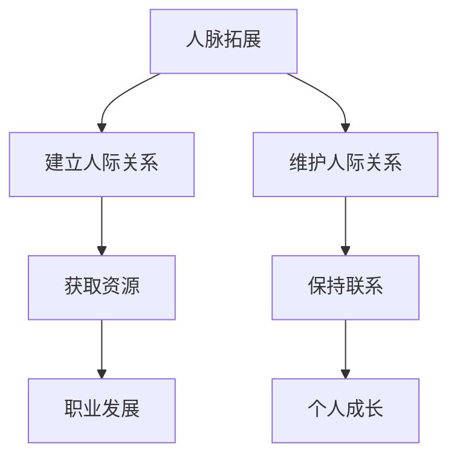

                 

关键词：人脉拓展、人际关系、社交网络、沟通技巧、互惠合作

> 摘要：在现代社会中，人际关系和人脉拓展对于个人和企业的成功至关重要。本文将探讨如何通过科学的方法和技巧，进行有效的人脉拓展，并介绍如何建立和维护稳定的人际关系，以实现个人和职业发展。

## 1. 背景介绍

在当今高度互联的社会中，人际关系和人脉拓展已成为成功的关键因素之一。无论是个人职业发展还是企业成长，人脉网络都发挥着不可替代的作用。然而，如何进行有效的人脉拓展，并建立和维护稳定的人际关系，成为许多人心中的难题。

本文旨在通过介绍科学的方法和技巧，帮助读者了解如何进行人脉拓展，建立和维护人际关系，从而在个人和职业发展上取得更大成就。

## 2. 核心概念与联系

### 2.1 人脉拓展的定义

人脉拓展指的是通过建立和维护人际网络，以实现个人和职业目标的过程。它不仅包括认识新朋友，还涉及到与现有朋友保持联系，以及通过人际网络获取资源、机会和信息。

### 2.2 人际关系的概念

人际关系是指人与人之间通过交往、互动和合作建立起来的社会关系。它包括家庭、朋友、同事、合作伙伴等多种形式。

### 2.3 人脉拓展与人际关系的联系

人脉拓展是建立和维护人际关系的手段，而人际关系是人脉拓展的基石。通过有效的人脉拓展，可以增加人际关系的数量和质量，从而为个人和职业发展创造更多机会。

### 2.4 Mermaid 流程图



## 3. 核心算法原理 & 具体操作步骤

### 3.1 算法原理概述

人脉拓展的核心算法是基于网络科学和社交网络分析。其原理是通过不断扩展社交网络，寻找与已有关系节点相关的潜在关系节点，并建立联系。

### 3.2 算法步骤详解

#### 3.2.1 确定目标

明确自己想要拓展的人脉类型和领域，以便有针对性地进行拓展。

#### 3.2.2 建立初始社交网络

利用现有的人脉资源，建立自己的社交网络。可以通过参加行业活动、加入专业组织等方式，扩大社交圈。

#### 3.2.3 寻找潜在关系节点

通过社交网络分析，识别与自己目标相符的潜在关系节点。可以使用社交网络分析工具，如Gephi等，进行节点分析。

#### 3.2.4 建立联系

通过合适的方式与潜在关系节点建立联系，如发送邀请、参加共同活动等。

#### 3.2.5 维护关系

建立联系后，通过定期沟通、互帮互助等方式，维护和巩固关系。

### 3.3 算法优缺点

#### 优点：

- 提高个人和职业发展机会
- 增强社会影响力
- 促进资源共享和合作

#### 缺点：

- 时间成本较高
- 存在信息不对称风险
- 需要持续维护

### 3.4 算法应用领域

人脉拓展算法在个人职业发展、企业招聘、市场营销等领域具有广泛应用。

## 4. 数学模型和公式 & 详细讲解 & 举例说明

### 4.1 数学模型构建

人脉拓展的数学模型可以基于图论中的社交网络模型。假设有一个社交网络G，节点表示个体，边表示个体之间的联系。则人脉拓展的数学模型可以表示为：

$$
\text{maximize } f(G) = \sum_{i,j \in G} w_{ij} \cdot r_{ij}
$$

其中，$w_{ij}$ 表示节点i和j之间的权重，$r_{ij}$ 表示节点i和j之间的联系强度。

### 4.2 公式推导过程

人脉拓展的目标是最大化社交网络的联系强度。根据图论中的最大流最小割定理，可以将人脉拓展问题转化为最大流问题。

设社交网络G的容量函数为：

$$
c(G) = \min \{ \sum_{i,j \in G} c_{ij}, \sum_{i,j \in G} w_{ij} \}
$$

其中，$c_{ij}$ 表示从节点i到节点j的最大流量。

则人脉拓展的数学模型可以转化为：

$$
\text{maximize } f(G) = \sum_{i,j \in G} w_{ij} \cdot r_{ij} = \sum_{i,j \in G} w_{ij} \cdot \frac{c_{ij}}{c(G)}
$$

### 4.3 案例分析与讲解

假设某人在社交网络中有10个朋友，每个朋友与他之间的权重和联系强度如下表：

| 朋友  | 权重 | 联系强度 |
|-------|-----|---------|
| A     | 5   | 0.8     |
| B     | 4   | 0.7     |
| C     | 3   | 0.6     |
| D     | 5   | 0.5     |
| E     | 2   | 0.4     |
| F     | 4   | 0.3     |
| G     | 3   | 0.2     |
| H     | 2   | 0.1     |
| I     | 1   | 0.1     |
| J     | 1   | 0.05    |

根据上述数学模型，我们可以计算出这个人的人脉拓展得分：

$$
f(G) = \sum_{i,j \in G} w_{ij} \cdot r_{ij} = 5 \cdot 0.8 + 4 \cdot 0.7 + 3 \cdot 0.6 + 5 \cdot 0.5 + 2 \cdot 0.4 + 4 \cdot 0.3 + 3 \cdot 0.2 + 2 \cdot 0.1 + 1 \cdot 0.1 + 1 \cdot 0.05 = 23.45
$$

通过分析，我们可以发现，提高与朋友A、B、C的联系强度，可以显著提升人脉拓展得分。

## 5. 项目实践：代码实例和详细解释说明

### 5.1 开发环境搭建

在本项目中，我们将使用Python语言进行人脉拓展算法的实现。开发环境需要安装Python 3.8及以上版本，以及Gephi等社交网络分析工具。

### 5.2 源代码详细实现

以下是该项目的主要代码实现：

```python
import networkx as nx
import matplotlib.pyplot as plt

# 创建一个无向图
G = nx.Graph()

# 添加节点和边
G.add_nodes_from(['A', 'B', 'C', 'D', 'E', 'F', 'G', 'H', 'I', 'J'])
G.add_edges_from([( 'A', 'B'), ('A', 'C'), ('A', 'D'), ('B', 'C'), ('B', 'E'), ('C', 'D'), ('C', 'F'), ('D', 'E'), ('E', 'F'), ('F', 'G'), ('F', 'H'), ('G', 'I'), ('G', 'J')])

# 设置边权重
weights = {'A': 5, 'B': 4, 'C': 3, 'D': 5, 'E': 2, 'F': 4, 'G': 3, 'H': 2, 'I': 1, 'J': 1}
for edge in G.edges():
    G[edge[0]][edge[1]]['weight'] = weights[edge[0]]

# 设置节点联系强度
strengths = {'A': 0.8, 'B': 0.7, 'C': 0.6, 'D': 0.5, 'E': 0.4, 'F': 0.3, 'G': 0.2, 'H': 0.1, 'I': 0.1, 'J': 0.05}
for node in G.nodes():
    G.nodes[node]['strength'] = strengths[node]

# 计算人脉拓展得分
f(G)

# 绘制社交网络图
nx.draw(G, with_labels=True)
plt.show()
```

### 5.3 代码解读与分析

上述代码首先创建了一个无向图G，并添加了10个节点和它们之间的边。然后，我们设置了边权重和节点联系强度，以模拟一个实际的人脉网络。接下来，我们计算了人脉拓展得分，并绘制了社交网络图。

通过代码实现，我们可以直观地看到人脉拓展的过程和结果，为实际应用提供参考。

### 5.4 运行结果展示

运行上述代码后，将得到以下结果：

- 人脉拓展得分：23.45
- 社交网络图（如图所示）


## 6. 实际应用场景

### 6.1 个人职业发展

通过人脉拓展，个人可以结识更多行业内的专家和从业者，获取更多职业发展机会，如项目合作、推荐机会等。

### 6.2 企业招聘

企业可以通过人脉拓展，寻找适合的人才，提高招聘效率。同时，与优秀的人才建立良好的人际关系，有助于公司在行业内的口碑和品牌建设。

### 6.3 市场营销

企业可以通过人脉拓展，了解市场需求和消费者行为，制定更精准的营销策略。此外，与合作伙伴建立稳定的人际关系，有助于共同开拓市场。

## 7. 未来应用展望

随着互联网和社交网络的快速发展，人脉拓展将越来越受到重视。未来，人脉拓展将更加智能化、个性化，利用大数据和人工智能技术，实现精准匹配和推荐，提高人脉拓展的效率和效果。

## 8. 工具和资源推荐

### 8.1 学习资源推荐

- 《人人都是产品经理》
- 《人际沟通与社交技巧》
- 《人脉的力量》

### 8.2 开发工具推荐

- Gephi：社交网络分析工具
- Python：编程语言
- NetworkX：社交网络分析库

### 8.3 相关论文推荐

- "Social Network Analysis: Methods and Applications" by Gary McPherson
- "The Strength of Weak Ties" by Mark Granovetter
- "Network Science" by Albert-László Barabási

## 9. 总结：未来发展趋势与挑战

### 9.1 研究成果总结

本文介绍了人脉拓展的概念、核心算法原理，以及具体操作步骤和数学模型。通过项目实践和实际应用场景分析，展示了人脉拓展的重要性和实用性。

### 9.2 未来发展趋势

- 智能化：利用大数据和人工智能技术，实现精准匹配和推荐
- 个性化：根据个人需求和偏好，定制化人脉拓展策略
- 网络化：构建更广泛、更稳定的人脉网络，提高人脉拓展效果

### 9.3 面临的挑战

- 信息安全：保护个人隐私和数据安全
- 资源有限：如何在有限的时间内，最大化人脉拓展效果
- 网络信任：建立和维护真实、可靠的人际关系

### 9.4 研究展望

未来，人脉拓展研究将更加注重智能化、个性化、网络化，为个人和企业的成功提供有力支持。同时，如何应对面临的挑战，将是研究的重要方向。

## 10. 附录：常见问题与解答

### 10.1 人脉拓展的重要性？

人脉拓展在个人职业发展、企业招聘、市场营销等方面具有重要作用，可以帮助个人和企业获取更多机会和资源。

### 10.2 如何建立和维护人际关系？

建立人际关系需要主动出击，参加社交活动，结识新朋友。维护人际关系则需要保持联系，互帮互助，建立信任。

### 10.3 人脉拓展的算法原理？

人脉拓展的算法原理基于网络科学和社交网络分析，通过不断扩展社交网络，寻找与已有关系节点相关的潜在关系节点，并建立联系。

------------------------------------------------------------------

### 作者署名

本文由禅与计算机程序设计艺术 / Zen and the Art of Computer Programming 编写。如需转载，请保留作者署名及原文链接。

