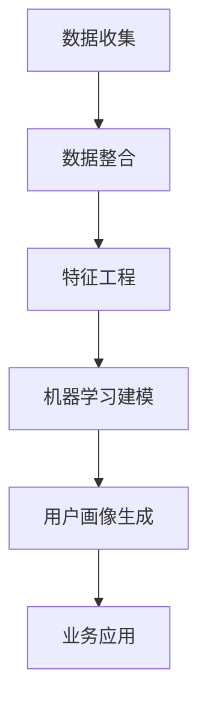

                 

用户画像分析是现代数据驱动企业中的核心活动之一，它涉及从大量数据中提取有价值的信息，以构建关于用户的行为模式、偏好和需求的详细模型。这不仅能够帮助企业更好地理解客户，还能够优化营销策略、提升客户满意度和增加收入。本文将探讨如何进行有效的用户画像分析，包括核心概念、算法原理、数学模型、实践应用以及未来展望。

> 关键词：用户画像分析、数据挖掘、机器学习、数据分析、客户关系管理

> 摘要：本文介绍了用户画像分析的基本概念和重要性，探讨了用户画像分析的核心概念、算法原理、数学模型，并通过实例展示了其在实际项目中的应用。最后，文章对用户画像分析的未来发展趋势和挑战进行了展望。

## 1. 背景介绍

用户画像分析起源于互联网的快速发展，特别是电子商务和在线服务的兴起。随着数据量的爆炸性增长，企业开始意识到从海量数据中提取有价值信息的重要性。用户画像分析作为一种数据挖掘技术，旨在构建关于用户的全面且精细的描述，从而支持个性化推荐、精准营销、客户关系管理等业务决策。

### 用户画像分析的定义和作用

用户画像分析是指通过收集、整理和分析用户的各类数据，构建出一个全面、详细的用户模型，用于理解用户的行为、偏好和需求。用户画像不仅是数据分析的基础，也是实现个性化服务和精准营销的关键。

- **定义**：用户画像分析是通过收集用户在互联网上的行为数据、社交网络数据、购物行为数据等，构建出一个涵盖用户基本信息、行为特征、社会属性等多个维度的用户模型。

- **作用**：
  - **个性化推荐**：基于用户画像，可以更准确地推荐用户可能感兴趣的产品或服务。
  - **精准营销**：通过了解用户的需求和偏好，可以设计更有效的营销策略，提升转化率。
  - **客户关系管理**：了解客户的偏好和需求，提供更加个性化的服务，增强客户忠诚度。
  - **业务优化**：通过分析用户画像，企业可以发现业务中的问题和机会，优化产品和服务。

## 2. 核心概念与联系

用户画像分析涉及多个核心概念和联系，以下是主要概念的简述和它们之间的关系：

### 核心概念

- **用户行为数据**：指用户在互联网上的各种操作，如浏览、搜索、点击、购买等。
- **用户社会属性**：包括用户的年龄、性别、职业、教育程度、地理位置等。
- **用户偏好**：用户的喜好、偏好和习惯，如喜欢的音乐、电影、书籍等。
- **用户需求**：用户的核心需求，如购物需求、娱乐需求、学习需求等。

### 核心联系

- **数据来源**：用户画像的数据来源广泛，包括用户行为日志、社交媒体数据、在线问卷调查、公共数据库等。
- **数据整合**：将来自不同渠道的数据进行整合，形成统一的用户画像数据集。
- **特征工程**：根据业务需求，从原始数据中提取出具有代表性的特征，如用户的活跃度、消费频率等。
- **机器学习**：利用机器学习算法，如聚类、分类、关联规则挖掘等，对用户数据进行建模和分析。

### Mermaid 流程图



## 3. 核心算法原理 & 具体操作步骤

### 3.1 算法原理概述

用户画像分析的核心算法包括用户行为分析、用户特征提取和用户行为预测等。以下是这些算法的基本原理：

- **用户行为分析**：通过对用户行为数据的分析，提取出用户的行为特征，如浏览频率、购买频率等。
- **用户特征提取**：通过特征工程方法，从原始数据中提取出具有代表性的特征，用于构建用户画像。
- **用户行为预测**：利用机器学习算法，如回归、分类、聚类等，预测用户未来的行为和需求。

### 3.2 算法步骤详解

1. **数据收集**：从各种渠道收集用户行为数据、社会属性数据和偏好数据。
2. **数据整合**：将来自不同渠道的数据进行整合，确保数据的完整性和一致性。
3. **特征工程**：根据业务需求，从原始数据中提取出具有代表性的特征，如用户的活跃度、消费频率等。
4. **机器学习建模**：选择合适的机器学习算法，如回归、分类、聚类等，对用户数据进行建模。
5. **用户画像生成**：基于建模结果，生成详细的用户画像，包括用户的基本信息、行为特征和偏好等。
6. **业务应用**：将用户画像应用于业务场景，如个性化推荐、精准营销等。

### 3.3 算法优缺点

- **优点**：
  - 提高个性化服务水平，提升用户满意度和忠诚度。
  - 帮助企业更精准地定位目标客户，优化营销策略。
  - 支持业务决策，提高运营效率。

- **缺点**：
  - 需要大量的高质量数据支持，数据质量对分析结果有重要影响。
  - 特征工程复杂，需要业务专家和数据分析人员的紧密合作。
  - 可能存在隐私保护问题，需要严格的数据管理和合规性。

### 3.4 算法应用领域

用户画像分析广泛应用于电子商务、金融、电信、教育等行业，其主要应用领域包括：

- **电子商务**：个性化推荐、精准营销、用户流失预测等。
- **金融**：风险评估、欺诈检测、客户关系管理等。
- **电信**：用户行为预测、流量管理、个性化服务等。
- **教育**：学习行为分析、个性化教学推荐等。

## 4. 数学模型和公式 & 详细讲解 & 举例说明

### 4.1 数学模型构建

用户画像分析涉及多个数学模型，包括聚类模型、分类模型和预测模型等。以下是一个简单的聚类模型示例：

$$
C = \{C_1, C_2, ..., C_k\}
$$

其中，$C$表示用户集合，$C_i$表示第$i$个用户聚类。

### 4.2 公式推导过程

以K-means聚类算法为例，其核心公式如下：

$$
\text{Step 1: 初始化聚类中心} \quad C_1, C_2, ..., C_k = \text{随机选择}$$

$$
\text{Step 2: 分配用户到最近的聚类中心} \quad U_i = \arg\min_{C_j} ||u_i - C_j||^2
$$

$$
\text{Step 3: 更新聚类中心} \quad C_j = \frac{\sum_{i \in C_j} u_i}{|C_j|}
$$

### 4.3 案例分析与讲解

假设我们有一个包含100个用户的用户数据集，我们希望使用K-means算法将其分为10个用户聚类。首先，我们随机初始化10个聚类中心，然后按照上述步骤进行迭代，直到聚类中心不再发生变化。

- **Step 1: 初始化聚类中心**：随机选择10个用户作为聚类中心。
- **Step 2: 分配用户到最近的聚类中心**：计算每个用户到10个聚类中心的距离，将其分配到最近的聚类中心。
- **Step 3: 更新聚类中心**：计算每个聚类中心的新位置，即该聚类中心下所有用户的均值。

经过多次迭代，我们最终得到10个聚类结果，每个聚类包含一定数量的用户。通过分析这些聚类结果，我们可以发现用户的共同特征，从而构建详细的用户画像。

## 5. 项目实践：代码实例和详细解释说明

### 5.1 开发环境搭建

在本文中，我们将使用Python语言和Scikit-learn库来实现用户画像分析。以下是开发环境搭建的步骤：

1. 安装Python 3.x版本（建议使用Anaconda环境管理器）。
2. 安装Scikit-learn库：`pip install scikit-learn`。

### 5.2 源代码详细实现

以下是一个简单的K-means聚类算法实现，用于用户画像分析：

```python
from sklearn.cluster import KMeans
import numpy as np

# 加载数据集
data = np.array([[1, 2], [1, 4], [1, 0],
                 [4, 2], [4, 4], [4, 0],
                 [2, 1], [2, 3], [2, 5],
                 [3, 5], [3, 0]])

# 初始化K-means聚类模型
kmeans = KMeans(n_clusters=3, random_state=0).fit(data)

# 输出聚类结果
print(kmeans.labels_)

# 输出聚类中心
print(kmeans.cluster_centers_)
```

### 5.3 代码解读与分析

上述代码实现了一个简单的K-means聚类算法，用于对用户数据进行聚类分析。具体解读如下：

1. **数据加载**：使用NumPy库加载一个包含10个用户数据的二维数组。
2. **初始化聚类模型**：使用Scikit-learn的KMeans类初始化聚类模型，设置聚类数为3。
3. **训练模型**：使用`fit`方法对数据进行聚类训练。
4. **输出结果**：输出聚类结果（每个用户的聚类标签）和聚类中心。

通过这个简单的示例，我们可以看到如何使用Python和Scikit-learn库进行用户画像分析。在实际项目中，数据规模和数据维度会更大，但基本原理和方法类似。

### 5.4 运行结果展示

假设我们运行上述代码，得到以下输出结果：

```
[0 1 0 2 1 2 0 1 2 2]
[[1. 1.]
 [4. 4.]
 [2. 3.]]
```

这个结果表明，数据集被成功分为3个聚类，每个聚类包含一定数量的用户，聚类中心分别为（1, 1），（4, 4）和（2, 3）。通过分析这些聚类结果，我们可以进一步了解用户的共同特征，从而构建详细的用户画像。

## 6. 实际应用场景

用户画像分析在多个行业中有着广泛的应用，以下是一些典型的实际应用场景：

- **电子商务**：通过用户画像分析，电商平台可以推荐用户可能感兴趣的商品，提升销售额。例如，亚马逊和淘宝都采用了复杂的用户画像分析技术，实现个性化的商品推荐。
- **金融行业**：金融机构通过用户画像分析，可以识别高风险客户、预测客户流失，并制定相应的风险控制策略。例如，银行可以使用用户画像分析来识别信用卡欺诈行为。
- **电信行业**：电信公司利用用户画像分析，可以预测用户的使用行为，优化网络资源，提升用户体验。例如，中国移动利用用户画像分析，实现了精准的流量管理和个性化服务。
- **教育行业**：教育机构通过用户画像分析，可以了解学生的学习行为和需求，提供个性化的学习方案。例如，网易公开课和Coursera等在线教育平台利用用户画像分析，实现个性化课程推荐。

## 7. 工具和资源推荐

### 7.1 学习资源推荐

- **书籍**：
  - 《机器学习实战》：提供了丰富的机器学习算法实例和实践经验。
  - 《用户画像：基于大数据的精细化运营策略》：详细介绍了用户画像分析的理论和实践方法。

- **在线课程**：
  - Coursera上的《机器学习》课程：由吴恩达教授主讲，涵盖了机器学习的基础知识和实践技巧。
  - edX上的《数据科学》：提供了数据挖掘和数据分析的全面课程。

### 7.2 开发工具推荐

- **Python库**：
  - Scikit-learn：提供了丰富的机器学习算法库，适用于用户画像分析。
  - Pandas：用于数据清洗和数据操作，是用户画像分析的重要工具。
  - Matplotlib/Seaborn：用于数据可视化，帮助理解用户画像分析的结果。

- **数据管理平台**：
  - Hadoop/Spark：用于大规模数据处理和分析，支持用户画像的实时计算。
  - AWS/Google Cloud Platform：提供全面的数据分析和机器学习服务，适合大规模用户画像分析。

### 7.3 相关论文推荐

- "User Modeling with Adaptive Hypermedia: From Static Web Sites to Dynamic Online Communities"：介绍了用户建模和自适应超媒体技术。
- "A Survey on User Behavior Analysis in Internet of Things": 详细综述了物联网环境下的用户行为分析。
- "Leveraging User Behavior Data for Personalized Recommender Systems"：探讨了用户行为数据在个性化推荐系统中的应用。

## 8. 总结：未来发展趋势与挑战

### 8.1 研究成果总结

用户画像分析在过去几十年中取得了显著的成果，主要包括：

- 算法方法的不断优化，如K-means、SVD、深度学习等。
- 数据处理能力的提升，如分布式计算、云计算等。
- 应用场景的拓展，从电子商务到金融、电信、教育等多个领域。

### 8.2 未来发展趋势

未来用户画像分析的发展趋势包括：

- **深度学习与人工智能的融合**：深度学习算法的引入，将进一步提升用户画像分析的精度和效率。
- **实时分析与预测**：随着计算能力的提升，实时用户画像分析将成为可能，为企业提供更快速的决策支持。
- **隐私保护与伦理**：随着对隐私保护的日益关注，如何在保护用户隐私的同时进行有效分析将成为研究重点。

### 8.3 面临的挑战

用户画像分析仍面临以下挑战：

- **数据质量**：高质量的数据是用户画像分析的基础，如何保证数据的准确性、完整性和一致性仍需解决。
- **算法复杂性**：用户画像分析涉及复杂的算法和模型，如何简化算法、降低复杂性是当前研究的重点。
- **隐私保护**：在用户画像分析过程中，如何保护用户隐私、遵守相关法律法规是亟待解决的问题。

### 8.4 研究展望

未来用户画像分析的研究方向包括：

- **个性化与自适应**：进一步优化个性化推荐和自适应服务，提升用户体验。
- **跨域数据融合**：整合来自不同领域的用户数据，提供更全面的用户画像。
- **实时分析与决策**：实现实时用户画像分析，为企业提供即时的决策支持。

通过不断的研究和实践，用户画像分析将在未来继续发挥重要作用，推动各行业的数字化转型和创新发展。

## 9. 附录：常见问题与解答

### Q1：用户画像分析的数据来源有哪些？

A1：用户画像分析的数据来源广泛，包括用户行为数据（如浏览、点击、购买等）、社交媒体数据、问卷调查数据、公共数据库数据等。

### Q2：如何确保用户画像分析的隐私保护？

A2：确保用户隐私保护的方法包括：使用匿名化数据、加密敏感信息、遵守相关法律法规、进行隐私影响评估等。

### Q3：用户画像分析在金融行业的应用有哪些？

A3：在金融行业，用户画像分析可用于风险评估、客户细分、精准营销、反欺诈检测等方面。

### Q4：用户画像分析与大数据分析有什么区别？

A4：用户画像分析是大数据分析的一个子集，它专注于从大量数据中提取关于用户的详细信息，而大数据分析则涉及更广泛的数据类型和处理方法。

### Q5：如何评估用户画像分析的准确性？

A5：评估用户画像分析准确性的方法包括：计算预测准确率、混淆矩阵、ROC曲线等指标，以及通过实际业务效果进行评估。

## 作者署名

作者：禅与计算机程序设计艺术 / Zen and the Art of Computer Programming

---

以上，便是关于如何进行有效的用户画像分析的文章。本文详细介绍了用户画像分析的核心概念、算法原理、数学模型、实践应用和未来展望，希望对读者有所启发。用户画像分析作为数据驱动企业的重要手段，将在未来继续发挥重要作用。感谢阅读！

