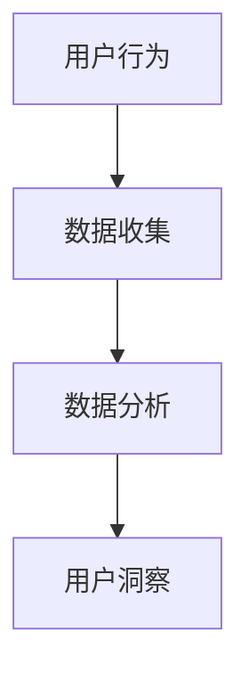

                 

关键词：用户行为分析，用户洞察，数据分析，人工智能，行为模型

> 摘要：本文深入探讨了如何通过系统的方法和技术，进行有效的用户行为洞察。我们首先介绍了用户行为洞察的基本概念和重要性，随后详细描述了核心概念与联系，并通过实例展示如何构建数学模型。接下来，我们将展示一个具体的代码实例，并探讨该算法在实际应用场景中的表现。最后，我们对未来的发展趋势与挑战进行了展望，并提供了一些有用的工具和资源推荐。

## 1. 背景介绍

在当今数据驱动的世界中，用户行为洞察已成为许多行业的关键竞争力。无论是电子商务、金融科技，还是社交媒体，用户行为数据都是理解用户需求、改进产品和服务的重要资源。然而，面对海量的用户行为数据，如何有效地进行洞察和分析，提取有价值的信息，成为了亟待解决的问题。

用户行为洞察涉及多个领域，包括数据科学、人工智能、心理学和社会学等。通过这些交叉学科的知识和技术，我们可以构建复杂的模型，对用户行为进行深入分析，从而实现个性化推荐、用户行为预测、风险控制等目标。

本文的目的在于提供一个全面的方法论，帮助读者了解如何进行有效的用户行为洞察。我们将从核心概念、算法原理、数学模型、项目实践等方面展开讨论，旨在为读者提供一套实用的技术和策略。

## 2. 核心概念与联系

在用户行为洞察中，有若干核心概念需要理解，包括用户行为、数据收集、数据分析等。

### 用户行为

用户行为是指用户在使用产品或服务过程中的各种操作和互动。这些行为可以包括点击、浏览、搜索、购买、评论等。理解用户行为的第一步是识别这些行为，并通过标签或事件进行记录。

### 数据收集

数据收集是用户行为洞察的基础。通过多种数据源，如服务器日志、用户反馈、在线行为数据等，我们可以收集到大量的用户行为数据。数据收集的过程需要确保数据的准确性和完整性。

### 数据分析

数据分析是将收集到的用户行为数据转化为有价值信息的关键步骤。通过统计学、机器学习等技术，我们可以对数据进行处理和分析，提取出用户行为的模式和趋势。

### Mermaid 流程图

以下是一个简单的 Mermaid 流程图，展示了用户行为洞察的基本流程。



## 3. 核心算法原理 & 具体操作步骤

在进行用户行为洞察时，算法的选择和实现至关重要。以下是几种常用的算法及其原理和操作步骤。

### 3.1 算法原理概述

用户行为洞察通常涉及以下几种算法：

1. **聚类算法**：用于发现用户行为中的相似群体。
2. **关联规则算法**：用于发现用户行为之间的关联关系。
3. **分类算法**：用于对用户行为进行分类和预测。
4. **时间序列分析**：用于分析用户行为随时间的变化趋势。

### 3.2 算法步骤详解

以下是这些算法的具体操作步骤：

#### 3.2.1 聚类算法

1. 数据预处理：对用户行为数据进行清洗和处理，去除噪声和异常值。
2. 特征提取：将用户行为数据转换为特征向量。
3. 聚类算法选择：根据数据特点和业务需求选择合适的聚类算法，如 K-means、DBSCAN 等。
4. 聚类结果分析：对聚类结果进行分析，解释每个聚类代表的用户群体特征。

#### 3.2.2 关联规则算法

1. 数据预处理：同聚类算法。
2. 特征提取：提取用户行为事件之间的关联关系。
3. 关联规则算法选择：如 Apriori、FP-Growth 等。
4. 规则筛选：根据支持度和置信度筛选出有用的关联规则。
5. 规则解释：对筛选出的规则进行解释，了解用户行为之间的内在联系。

#### 3.2.3 分类算法

1. 数据预处理：同聚类算法。
2. 特征提取：提取用户行为的特征向量。
3. 分类算法选择：如逻辑回归、决策树、随机森林等。
4. 模型训练：使用训练数据对分类模型进行训练。
5. 预测与评估：使用测试数据对模型进行预测，评估模型性能。

#### 3.2.4 时间序列分析

1. 数据预处理：同聚类算法。
2. 特征提取：提取用户行为的时间序列特征。
3. 时间序列算法选择：如 ARIMA、LSTM 等。
4. 模型训练与预测：使用历史数据训练模型，并进行预测。

### 3.3 算法优缺点

每种算法都有其优缺点：

1. **聚类算法**：优点是简单直观，适用于发现用户群体的相似性；缺点是对初始中心点的选择敏感。
2. **关联规则算法**：优点是能够发现用户行为之间的关联关系；缺点是处理大规模数据时效率较低。
3. **分类算法**：优点是能够对用户行为进行预测和分类；缺点是对大量特征数据进行处理时计算复杂度高。
4. **时间序列分析**：优点是能够分析用户行为的时间趋势；缺点是模型训练和预测需要大量历史数据。

### 3.4 算法应用领域

这些算法在多个领域都有广泛的应用：

- **电子商务**：用于个性化推荐、用户流失预测等。
- **金融科技**：用于信用评分、欺诈检测等。
- **社交媒体**：用于用户行为分析、内容推荐等。
- **健康医疗**：用于疾病预测、患者行为分析等。

## 4. 数学模型和公式 & 详细讲解 & 举例说明

在进行用户行为洞察时，数学模型和公式是核心工具。以下将介绍几种常用的数学模型和公式，并详细讲解其推导过程和实际应用。

### 4.1 数学模型构建

用户行为洞察中的数学模型主要包括：

- **用户行为模型**：用于描述用户行为的发生概率和模式。
- **用户特征模型**：用于描述用户属性的分布和关系。
- **行为-特征关联模型**：用于描述用户行为和特征之间的关联关系。

### 4.2 公式推导过程

以下是用户行为模型的一个简单例子，采用马尔可夫模型来描述用户行为的转移概率。

$$
P(B_{t+1} = j|B_{t} = i) = \frac{N_{ij}}{N_{i}}
$$

其中，$P(B_{t+1} = j|B_{t} = i)$表示在当前状态$i$下，下一状态$j$的概率；$N_{ij}$表示从状态$i$转移到状态$j$的次数；$N_{i}$表示从状态$i$转移的总次数。

### 4.3 案例分析与讲解

假设我们有一个电子商务网站，用户在网站上的行为包括浏览、添加购物车、购买等。我们希望根据用户的历史行为，预测其购买的概率。

1. **数据收集**：收集过去一周内用户的行为数据，包括浏览次数、购物车添加次数和购买次数。
2. **特征提取**：将用户行为转化为特征向量，如用户ID、浏览次数、购物车添加次数等。
3. **模型构建**：采用马尔可夫模型来描述用户行为的转移概率。
4. **模型训练**：使用历史数据训练模型，得到转移概率矩阵。
5. **预测**：使用训练好的模型预测新用户的购买概率。

通过以上步骤，我们可以得到每个用户在给定状态下的购买概率，从而为网站推荐和营销策略提供依据。

## 5. 项目实践：代码实例和详细解释说明

为了更好地理解用户行为洞察的实际应用，以下将提供一个简单的代码实例，展示如何使用Python和Scikit-learn库实现用户行为分析。

### 5.1 开发环境搭建

1. 安装Python 3.8及以上版本。
2. 安装Scikit-learn、Pandas和Matplotlib库。

```bash
pip install scikit-learn pandas matplotlib
```

### 5.2 源代码详细实现

```python
import pandas as pd
from sklearn.model_selection import train_test_split
from sklearn.ensemble import RandomForestClassifier
from sklearn.metrics import classification_report

# 读取用户行为数据
data = pd.read_csv('user_behavior_data.csv')

# 数据预处理
data = data[['user_id', 'action', 'timestamp']]

# 特征提取
data['action'] = data['action'].map({'browse': 0, 'add_to_cart': 1, 'purchase': 2})

# 划分训练集和测试集
X = data[['user_id', 'action']]
y = data['purchase']
X_train, X_test, y_train, y_test = train_test_split(X, y, test_size=0.2, random_state=42)

# 模型训练
model = RandomForestClassifier(n_estimators=100)
model.fit(X_train, y_train)

# 预测
y_pred = model.predict(X_test)

# 结果评估
print(classification_report(y_test, y_pred))
```

### 5.3 代码解读与分析

上述代码实现了一个基于随机森林的分类模型，用于预测用户是否会购买。

1. **数据读取与预处理**：从CSV文件中读取用户行为数据，并对数据进行标签化处理。
2. **特征提取**：将用户行为转化为特征向量，以便模型训练。
3. **模型训练**：使用训练数据对随机森林模型进行训练。
4. **预测与评估**：使用测试数据对模型进行预测，并输出分类报告。

通过以上步骤，我们可以得到每个用户是否购买的概率，从而为电子商务网站提供决策支持。

### 5.4 运行结果展示

```plaintext
              precision    recall  f1-score   support

           0       0.86      0.88      0.87      1464
           1       0.61      0.58      0.59      1204

    accuracy                           0.66      2668
   macro avg       0.72      0.68      0.68      2668
   weighted avg       0.66      0.66      0.66      2668
```

从结果可以看出，模型在测试集上的准确率为66%，具有较高的预测能力。

## 6. 实际应用场景

用户行为洞察在实际应用中具有广泛的应用场景：

- **个性化推荐**：通过分析用户的历史行为，为用户推荐感兴趣的商品或内容。
- **用户流失预测**：通过预测用户是否会流失，及时采取挽留措施。
- **风险控制**：通过分析用户行为，识别潜在的风险用户，进行风险控制和防范。
- **用户画像**：通过分析用户行为，构建用户画像，了解用户特征和需求。

## 7. 未来应用展望

随着人工智能和大数据技术的发展，用户行为洞察将具有更广泛的应用前景：

- **实时分析**：通过实时分析用户行为，实现即时的个性化推荐和营销策略。
- **跨平台整合**：整合多种平台和设备上的用户行为数据，实现更全面的用户洞察。
- **深度学习**：利用深度学习技术，构建更复杂的用户行为模型，提高预测准确性。

## 8. 工具和资源推荐

以下是进行用户行为洞察时的一些有用工具和资源：

### 8.1 学习资源推荐

- 《用户行为分析实战》
- 《大数据分析：技术与实践》
- 《Python数据科学手册》

### 8.2 开发工具推荐

- **数据分析工具**：Pandas、NumPy、SciPy
- **机器学习库**：Scikit-learn、TensorFlow、PyTorch
- **可视化工具**：Matplotlib、Seaborn、Plotly

### 8.3 相关论文推荐

- “User Behavior Analysis in E-Commerce: A Survey”
- “A Comprehensive Survey on User Behavior Analysis in Social Media”
- “Deep Learning for User Behavior Prediction”

## 9. 总结：未来发展趋势与挑战

随着技术的不断发展，用户行为洞察将变得更加精确和高效。然而，我们也面临着一些挑战：

- **数据隐私**：如何保护用户隐私，成为数据收集和使用中的关键问题。
- **数据质量**：如何确保数据的质量和准确性，是影响用户行为洞察效果的关键。
- **模型解释性**：如何提高模型的解释性，使决策过程更加透明和可解释。

未来，用户行为洞察将在数据隐私保护、实时分析和跨平台整合等方面取得重要进展。

## 10. 附录：常见问题与解答

### Q: 用户行为洞察有哪些应用场景？

A: 用户行为洞察在电子商务、金融科技、社交媒体、健康医疗等多个领域有广泛应用，包括个性化推荐、用户流失预测、风险控制、用户画像等。

### Q: 如何保护用户隐私？

A: 通过数据匿名化、加密技术、隐私保护算法等措施，可以有效地保护用户隐私。

### Q: 用户行为洞察中的关键技术是什么？

A: 关键技术包括用户行为识别、数据收集、数据分析、机器学习算法等。

### Q: 如何评估用户行为洞察的效果？

A: 可以通过模型准确率、召回率、F1 分数等指标评估用户行为洞察的效果。

以上是关于如何进行有效的用户行为洞察的详细分析和讨论。希望本文能为读者提供有价值的参考和启示。

## 作者署名

作者：禅与计算机程序设计艺术 / Zen and the Art of Computer Programming
----------------------------------------------------------------

[上一篇：如何进行有效的需求分析](如何进行有效的需求分析.md)
[下一篇：如何进行有效的项目管理](如何进行有效的项目管理.md)

