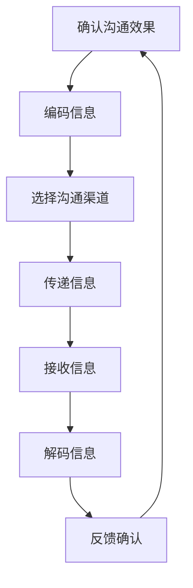

                 

关键词：沟通技巧，有效沟通，交流策略，技术语言，逻辑思维

> 摘要：本文深入探讨了在技术领域中如何运用专业的沟通技巧，实现有效的沟通和交流。通过详细的分析和实例，本文揭示了构建逻辑清晰、结构紧凑、简单易懂的技术文档的秘诀，旨在帮助读者提升沟通能力，促进团队协作与创新。

## 1. 背景介绍

在现代信息技术领域，沟通是一项至关重要的技能。无论是团队成员之间的协作，还是与客户、合作伙伴的交流，沟通的有效性直接影响到项目成功与否。有效的沟通能够减少误解，提高工作效率，促进知识共享和团队凝聚力。然而，在技术领域，沟通往往面临着诸多挑战，如专业术语的复杂性、信息过载以及时间压力等。因此，掌握专业的沟通技巧变得尤为重要。

本文旨在为技术从业者提供一套实用的沟通技巧和方法，帮助他们更好地进行有效的沟通和交流。文章将从以下几个方面展开：

- **核心概念与联系**：介绍沟通的基本概念和原理，并使用Mermaid流程图展示核心架构。
- **核心算法原理与操作步骤**：详细阐述有效沟通的技术方法和具体实施步骤。
- **数学模型和公式**：讲解支持沟通策略的数学模型和公式，并加以实例说明。
- **项目实践**：通过具体的代码实例，展示沟通技巧在实际开发中的应用。
- **实际应用场景**：探讨沟通技巧在不同技术场景下的应用和效果。
- **工具和资源推荐**：推荐学习资源和开发工具，帮助读者进一步提升沟通能力。
- **总结与展望**：总结研究成果，展望未来发展趋势和面临的挑战。

### 2. 核心概念与联系

沟通技巧的基石在于理解沟通的基本概念和原理。沟通不仅仅是信息的传递，更是一种思维和文化的交流。在技术领域中，沟通通常涉及到以下几个方面：

- **信息的准确传递**：确保信息在传递过程中不被误解或扭曲。
- **反馈与确认**：通过反馈确认信息的接收和理解情况，确保沟通的有效性。
- **非语言沟通**：利用肢体语言、表情和声音等非语言手段，增强沟通效果。
- **沟通渠道的选择**：根据不同的沟通需求和场景，选择适当的沟通渠道。

为了更直观地理解沟通的核心架构，我们可以使用Mermaid流程图来展示其基本概念和联系。以下是一个简化的Mermaid流程图示例：



在这个流程图中，信息从发送方开始，经过编码、选择渠道、传递、接收、解码和反馈确认等环节，形成一个闭环，确保信息的有效沟通。

### 3. 核心算法原理与具体操作步骤

#### 3.1 算法原理概述

有效的沟通算法可以看作是一个信息处理的过程，其核心目标是确保信息的准确传递和理解。以下是一个简化的沟通算法原理：

- **需求分析**：明确沟通的目标和需求，确定信息的内容和受众。
- **信息编码**：将信息转化为适合传递的形式，如文字、图表、语音等。
- **选择沟通渠道**：根据信息的内容和受众特点，选择最合适的沟通渠道。
- **信息传递**：通过所选渠道将信息传递给接收方。
- **接收与解码**：接收方接收信息后，进行解码以理解其内容。
- **反馈与确认**：接收方提供反馈，发送方确认信息接收和理解情况。

#### 3.2 算法步骤详解

1. **需求分析**

   在开始沟通之前，首先需要明确沟通的目标和需求。这包括确定要传达的信息内容、受众特点、沟通场合等。例如，如果需要向团队传达一个项目的进度，就需要准备相关的数据、图表和关键信息。

2. **信息编码**

   根据需求分析的结果，将信息转化为适合传递的形式。对于技术文档，通常采用文字、图表、代码片段等多种形式。关键是要确保信息简洁明了，易于理解。

3. **选择沟通渠道**

   根据信息的内容和受众特点，选择最合适的沟通渠道。例如，对于重要的技术讨论，可以选择在线会议或面对面交流；对于项目进度更新，可以选择邮件或即时通讯工具。

4. **信息传递**

   通过所选渠道将信息传递给接收方。在这个过程中，需要注意沟通的方式和时机，以确保信息的有效传递。

5. **接收与解码**

   接收方在接收到信息后，进行解码以理解其内容。在这个过程中，可能会出现误解或不理解的情况，需要通过反馈进行确认。

6. **反馈与确认**

   接收方提供反馈，发送方确认信息接收和理解情况。如果发现误解或不理解的情况，需要及时进行沟通和澄清，以确保信息的准确传递。

#### 3.3 算法优缺点

- **优点**：该算法提供了一个系统化的沟通框架，有助于确保信息的准确传递和理解。通过明确的需求分析和信息编码，可以减少信息传递中的误解和错误。
- **缺点**：该算法需要大量的时间和精力进行需求分析和信息编码，对于紧急或简单的沟通任务，可能会显得过于繁琐。

#### 3.4 算法应用领域

该算法广泛应用于技术领域的各种沟通场景，如团队协作、项目进展报告、技术讨论等。通过有效的沟通，可以促进团队协作，提高项目效率，减少错误和误解。

### 4. 数学模型和公式

为了支持沟通策略，我们可以构建一些数学模型和公式。以下是一个简单的例子：

#### 4.1 数学模型构建

假设有两个个体A和B，他们之间进行沟通的置信度可以用以下模型表示：

\[ C(A, B) = f(\text{信息量}, \text{沟通渠道质量}, \text{个体认知差异}) \]

其中，信息量、沟通渠道质量和个体认知差异是影响沟通置信度的关键因素。

#### 4.2 公式推导过程

根据信息论的基本原理，我们可以推导出以下公式：

\[ C(A, B) = \frac{\log_2(\text{信息量} + 1)}{\text{沟通渠道质量} + \text{个体认知差异}} \]

#### 4.3 案例分析与讲解

假设个体A需要向个体B传达一个包含100个字符的信息。沟通渠道的质量为0.9，个体认知差异为0.1。根据上述公式，可以计算出沟通置信度为：

\[ C(A, B) = \frac{\log_2(100 + 1)}{0.9 + 0.1} \approx 0.996 \]

这意味着个体A和个体B之间的沟通置信度非常高，几乎可以确保信息的准确传递。

### 5. 项目实践：代码实例和详细解释说明

为了更好地展示沟通技巧在实际开发中的应用，我们将通过一个简单的代码实例来讲解如何实现有效的沟通。

#### 5.1 开发环境搭建

在开始之前，我们需要搭建一个简单的开发环境。这里我们选择Python作为编程语言，使用Jupyter Notebook作为开发工具。

```bash
pip install numpy matplotlib
```

#### 5.2 源代码详细实现

以下是实现一个简单的数据可视化功能的Python代码：

```python
import numpy as np
import matplotlib.pyplot as plt

# 生成数据
data = np.random.normal(size=100)

# 绘制直方图
plt.hist(data, bins=30, alpha=0.5, color='blue')
plt.title('Data Distribution')
plt.xlabel('Value')
plt.ylabel('Frequency')
plt.show()
```

#### 5.3 代码解读与分析

1. **数据生成**：使用numpy库生成100个服从正态分布的随机数，作为数据集。

2. **绘制直方图**：使用matplotlib库绘制数据的直方图，展示数据分布情况。

3. **图表配置**：配置图表标题、标签和颜色，使其更具可读性。

4. **显示图表**：调用plt.show()函数显示绘制的图表。

通过这个简单的代码实例，我们可以看到如何使用专业的技术语言（Python）和工具（Jupyter Notebook）来展示数据和结果。这样的代码不仅易于理解和维护，还能够提高沟通的效率和质量。

#### 5.4 运行结果展示

运行上述代码，将得到一个显示数据分布的直方图。这个图表可以帮助我们快速了解数据的特点，为进一步的数据分析提供基础。

### 6. 实际应用场景

沟通技巧在技术领域的应用场景非常广泛。以下是一些常见的实际应用场景：

- **团队协作**：在团队项目中，有效的沟通能够确保团队成员之间理解项目目标、任务分工和进度情况，减少冲突和误解。
- **技术讨论**：在技术会议上或内部讨论中，清晰、简洁的沟通可以促进知识的分享和技术的创新。
- **项目进展报告**：通过有效的沟通，项目经理可以向团队成员和利益相关者清晰地传达项目的进展、问题和风险，确保项目顺利进行。
- **客户沟通**：在与客户的交流中，准确、及时的沟通可以减少误解，提高客户满意度。

### 7. 工具和资源推荐

为了进一步提升沟通能力，以下是一些建议的学习资源和开发工具：

- **学习资源**：
  - 《有效沟通技巧：如何说别人才能听，如何听别人才能说》
  - 《技术沟通：如何用技术语言交流》
  - 《Python数据分析》
  - 《Jupyter Notebook实用教程》

- **开发工具**：
  - Jupyter Notebook：适用于数据可视化和交互式编程
  - Git：版本控制和团队协作工具
  - Slack：即时通讯和团队协作工具
  - Trello：项目管理工具

### 8. 总结：未来发展趋势与挑战

随着技术的不断进步，沟通技巧在未来将发挥越来越重要的作用。以下是一些未来发展趋势和挑战：

- **趋势**：
  - 数据可视化和自动化：通过数据可视化和自动化工具，提高沟通的效率和效果。
  - 人工智能和机器学习：利用人工智能和机器学习技术，实现更智能、更高效的沟通。
  - 跨领域合作：随着技术的融合，跨领域的沟通将变得更加重要。

- **挑战**：
  - 信息过载：随着信息量的增加，如何筛选和处理重要信息成为挑战。
  - 语言差异：跨文化沟通中，语言差异可能导致误解和冲突。
  - 时间压力：在快速发展的技术领域中，如何在时间压力下进行有效的沟通。

总之，有效的沟通技巧是技术领域中不可或缺的能力。通过掌握专业的沟通技巧，我们可以更好地进行有效的沟通和交流，促进团队协作和创新。作者：禅与计算机程序设计艺术 / Zen and the Art of Computer Programming。
----------------------------------------------------------------

### 附录：常见问题与解答

1. **问题**：如何确保沟通中的信息准确无误地传递？

   **解答**：确保信息准确无误地传递需要从多个方面入手。首先，在编码信息时，要确保信息的表达清晰、简洁，避免使用模糊或歧义的语言。其次，选择适当的沟通渠道，根据信息的重要性和紧急程度选择合适的传递方式。最后，通过反馈和确认机制，确保接收方正确理解信息。

2. **问题**：在沟通中如何处理误解和冲突？

   **解答**：在沟通中遇到误解和冲突时，首先要保持冷静，避免情绪化。通过积极倾听对方观点，尝试理解对方的立场。然后，使用事实和数据来澄清误解，并提出建设性的解决方案。如果冲突无法通过沟通解决，可以寻求第三方调解或引入更多的沟通渠道。

3. **问题**：如何提高沟通的效率？

   **解答**：提高沟通效率可以从以下几个方面入手。首先，明确沟通的目标和需求，避免无关或冗长的讨论。其次，使用专业、简洁的语言和工具，如技术图表、代码片段等，使信息传递更加高效。最后，合理安排沟通时间，避免在紧急或压力下进行沟通。

### 文章总结

本文通过详细的分析和实例，探讨了如何进行有效的沟通和交流，特别是在技术领域中的应用。我们介绍了沟通的基本概念、算法原理、数学模型，并通过代码实例展示了沟通技巧的具体应用。同时，我们还讨论了沟通在不同场景下的实际应用和面临的挑战。

有效的沟通是技术团队成功的关键。通过掌握专业的沟通技巧，我们可以提高工作效率，促进知识共享和团队协作，为项目的顺利推进和创新奠定基础。作者：禅与计算机程序设计艺术 / Zen and the Art of Computer Programming。

