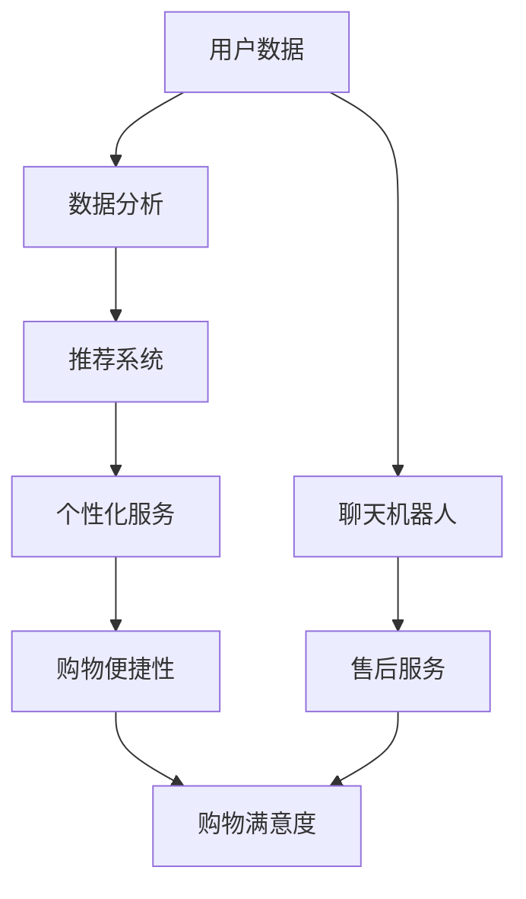

                 

关键词：人工智能、用户购物体验、优化、机器学习、推荐系统、数据分析、个性化服务

> 摘要：随着互联网和电子商务的快速发展，用户对于购物体验的要求越来越高。本文将探讨如何通过人工智能技术优化用户的购物体验，提高用户满意度。本文将介绍人工智能在购物体验优化中的应用，包括推荐系统、用户行为分析、个性化服务等方面的技术和方法，并结合实际案例进行分析。

## 1. 背景介绍

近年来，电子商务市场呈现出爆发式增长，线上购物已经成为人们日常生活的一部分。随着用户数量的不断增加，商家面临着激烈的市场竞争，如何提高用户的购物体验，增加用户粘性，成为了企业关注的焦点。人工智能作为当前最具前景的技术之一，正逐步渗透到各个领域，为提升用户体验提供了新的可能。

用户购物体验主要包括以下几个方面：购物过程的便捷性、商品推荐的准确性、购物过程中的个性化服务、购物后的满意度等。而人工智能技术在提升这些方面具有巨大的潜力。

### 1.1 购物过程的便捷性

人工智能可以通过自动化技术简化购物流程，减少用户操作步骤。例如，使用聊天机器人进行购物咨询，用户只需输入关键词，即可获得相应的商品信息或购买建议。此外，AI还可以预测用户的需求，提前准备好相应的商品，提高购物效率。

### 1.2 商品推荐的准确性

推荐系统是人工智能在购物体验优化中的重要应用。通过对用户历史行为、兴趣偏好、购物记录等数据的分析，AI可以提供更加精准的商品推荐，提高用户购物的满意度。

### 1.3 购物过程中的个性化服务

个性化服务是提升用户购物体验的关键因素。通过分析用户的购物行为和偏好，AI可以为用户提供量身定制的购物建议，包括商品推荐、优惠活动等，从而增加用户购买的欲望。

### 1.4 购物后的满意度

购物后的满意度直接影响用户的复购率。AI可以通过对用户反馈数据的分析，及时发现问题并采取措施，提高用户满意度。例如，通过智能客服系统，用户可以在购物后获得快速、高效的售后服务，提升用户体验。

## 2. 核心概念与联系

在探讨如何通过AI优化用户购物体验之前，我们需要了解一些核心概念和它们之间的联系。以下是相关的概念和它们的 Mermaid 流程图：



### 2.1 用户数据

用户数据是AI优化购物体验的基础。这些数据包括用户的购物记录、浏览历史、评价、反馈等。通过收集和分析这些数据，AI可以了解用户的需求和偏好。

### 2.2 数据分析

数据分析是AI的核心技术之一。通过对用户数据的挖掘和分析，AI可以提取有价值的信息，为推荐系统、个性化服务等提供支持。

### 2.3 推荐系统

推荐系统是AI在购物体验优化中的重要应用。它通过分析用户数据和商品属性，为用户推荐可能感兴趣的商品。

### 2.4 个性化服务

个性化服务是基于用户数据分析的，通过提供个性化的购物建议、优惠活动等，提升用户的购物体验。

### 2.5 购物便捷性

购物便捷性是通过AI技术简化购物流程，提高购物效率。例如，使用聊天机器人进行购物咨询、自动推荐商品等。

### 2.6 购物满意度

购物满意度是用户购物体验的直接反映。通过提供优质的购物体验，提高用户满意度，从而增加复购率。

## 3. 核心算法原理 & 具体操作步骤

### 3.1 算法原理概述

AI优化用户购物体验的核心算法主要包括推荐算法、用户行为分析算法和个性化服务算法。以下是这些算法的基本原理：

#### 3.1.1 推荐算法

推荐算法是基于用户的历史行为和偏好，为用户推荐可能感兴趣的商品。常见的推荐算法有基于内容的推荐、协同过滤推荐和基于模型的推荐。

- **基于内容的推荐**：通过分析商品的内容属性，为用户推荐与其已购买或浏览过的商品相似的商品。
- **协同过滤推荐**：通过分析用户之间的相似度，为用户推荐其他相似用户喜欢的商品。
- **基于模型的推荐**：通过构建用户和商品之间的模型，预测用户可能感兴趣的商品。

#### 3.1.2 用户行为分析算法

用户行为分析算法通过对用户的历史行为进行分析，了解用户的需求和偏好。常见的用户行为分析算法有聚类分析、关联规则挖掘等。

- **聚类分析**：将用户按照其行为特征进行分类，为用户提供个性化的推荐。
- **关联规则挖掘**：分析用户行为数据中的关联关系，发现潜在的用户需求，为用户提供个性化的服务。

#### 3.1.3 个性化服务算法

个性化服务算法是基于用户行为分析的结果，为用户提供个性化的购物建议、优惠活动等。常见的个性化服务算法有基于规则的个性化服务和基于机器学习的个性化服务。

- **基于规则的个性化服务**：根据用户的历史行为和偏好，设定相应的规则，为用户提供个性化的服务。
- **基于机器学习的个性化服务**：通过机器学习算法，从用户数据中学习用户的兴趣和偏好，为用户提供个性化的服务。

### 3.2 算法步骤详解

以下是AI优化用户购物体验的具体操作步骤：

#### 3.2.1 数据收集

首先，需要收集用户的数据，包括用户的购物记录、浏览历史、评价、反馈等。

#### 3.2.2 数据预处理

对收集到的数据进行清洗、去噪、去重等预处理操作，确保数据的质量。

#### 3.2.3 用户行为分析

通过聚类分析、关联规则挖掘等方法，对用户行为数据进行分析，了解用户的需求和偏好。

#### 3.2.4 推荐算法

根据用户行为分析的结果，使用推荐算法为用户推荐感兴趣的商品。

#### 3.2.5 个性化服务

基于用户行为分析的结果，为用户提供个性化的购物建议、优惠活动等。

#### 3.2.6 反馈调整

根据用户的反馈，对推荐结果和服务进行优化调整。

### 3.3 算法优缺点

#### 3.3.1 优点

- **提升购物体验**：通过推荐系统和个性化服务，提高用户的购物满意度。
- **提高购物效率**：简化购物流程，减少用户操作步骤。
- **降低运营成本**：通过自动化技术，降低人力成本。

#### 3.3.2 缺点

- **数据隐私问题**：用户数据的安全性和隐私保护是一个挑战。
- **算法偏见**：算法可能会因为数据的不公平性而产生偏见。
- **计算资源消耗**：大规模的数据分析和算法计算需要大量的计算资源。

### 3.4 算法应用领域

AI优化用户购物体验的算法可以广泛应用于电子商务、在线旅游、金融等多个领域。以下是几个典型的应用场景：

- **电子商务**：通过推荐系统和个性化服务，提高用户的购物体验和购买转化率。
- **在线旅游**：为用户提供个性化的旅游推荐，提高用户满意度。
- **金融**：通过分析用户行为数据，为用户提供个性化的理财产品推荐。

## 4. 数学模型和公式 & 详细讲解 & 举例说明

### 4.1 数学模型构建

在AI优化用户购物体验的过程中，数学模型扮演着重要的角色。以下是几个常用的数学模型及其构建方法：

#### 4.1.1 用户行为模型

用户行为模型主要用于描述用户在购物过程中的行为特征。常见的用户行为模型包括马尔可夫模型、贝叶斯网络等。

- **马尔可夫模型**：假设用户的行为仅与其当前状态有关，而与过去的状态无关。状态转移矩阵可以描述用户在不同状态之间的转移概率。

  $$ P(X_t = j | X_{t-1} = i) = p_{ij} $$

  其中，$X_t$ 表示用户在时刻 $t$ 的行为状态，$p_{ij}$ 表示用户从状态 $i$ 转移到状态 $j$ 的概率。

- **贝叶斯网络**：通过条件概率表描述用户行为状态之间的依赖关系。

  $$ P(X_t = j | X_{t-1} = i, X_{t-2} = k) = p_{ijk} $$

  其中，$p_{ijk}$ 表示用户在时刻 $t$ 的行为状态为 $j$，在时刻 $t-1$ 的行为状态为 $i$，在时刻 $t-2$ 的行为状态为 $k$ 的条件概率。

#### 4.1.2 商品推荐模型

商品推荐模型主要用于预测用户可能感兴趣的商品。常见的商品推荐模型包括基于内容的推荐模型、协同过滤推荐模型等。

- **基于内容的推荐模型**：假设用户对商品的评价与商品的内容属性相关。常见的基于内容的推荐模型包括朴素贝叶斯分类器、支持向量机等。

  $$ P(Y = j | X = x) = \prod_{i=1}^{n} P(X_i = x_i | Y = j) $$

  其中，$X$ 表示商品的内容属性，$Y$ 表示用户对商品的评价，$P(X_i = x_i | Y = j)$ 表示在用户对商品的评价为 $j$ 的条件下，商品的内容属性 $X_i$ 为 $x_i$ 的条件概率。

- **协同过滤推荐模型**：假设用户对商品的评分与用户之间的相似度有关。常见的协同过滤推荐模型包括基于用户的协同过滤、基于物品的协同过滤等。

  $$ r_{ui} = \sum_{v \in \sim_{u}} w_{uv} r_{vj} $$

  其中，$r_{ui}$ 表示用户 $u$ 对商品 $i$ 的评分，$\sim_{u}$ 表示与用户 $u$ 相似的一组用户，$w_{uv}$ 表示用户 $u$ 与用户 $v$ 之间的相似度，$r_{vj}$ 表示用户 $v$ 对商品 $j$ 的评分。

### 4.2 公式推导过程

以下是几个常用的数学公式的推导过程：

#### 4.2.1 马尔可夫模型状态转移概率公式

假设用户的行为状态集合为 $S = \{1, 2, \ldots, m\}$，则马尔可夫模型的状态转移概率矩阵为 $P = (p_{ij})$，其中 $p_{ij}$ 表示用户从状态 $i$ 转移到状态 $j$ 的概率。

为了满足马尔可夫模型的性质，即当前状态仅与过去状态有关，而与过去状态的序列无关，我们需要满足以下条件：

$$ \sum_{j=1}^{m} p_{ij} = 1 $$

$$ p_{ii} + \sum_{j \neq i} p_{ij} = 1 $$

通过简单的代数运算，我们可以得到状态转移概率矩阵的行和列和均为 1，即：

$$ P = (p_{ij}) = \begin{pmatrix}
p_{11} & p_{12} & \ldots & p_{1m} \\
p_{21} & p_{22} & \ldots & p_{2m} \\
\vdots & \vdots & \ddots & \vdots \\
p_{m1} & p_{m2} & \ldots & p_{mm}
\end{pmatrix} $$

#### 4.2.2 协同过滤推荐模型评分预测公式

假设用户 $u$ 和用户 $v$ 之间的相似度由权重矩阵 $W$ 表示，其中 $W_{uv}$ 表示用户 $u$ 和用户 $v$ 之间的相似度，$r_{uj}$ 表示用户 $u$ 对商品 $j$ 的评分，$r_{vj}$ 表示用户 $v$ 对商品 $j$ 的评分。

为了预测用户 $u$ 对商品 $j$ 的评分，我们可以使用以下公式：

$$ r_{ui} = \sum_{v \in \sim_{u}} w_{uv} r_{vj} $$

其中，$\sim_{u}$ 表示与用户 $u$ 相似的一组用户。

#### 4.2.3 基于内容的推荐模型评分预测公式

假设商品 $i$ 的内容属性由特征向量 $X_i$ 表示，用户 $u$ 的评价由特征向量 $X_u$ 表示，且用户 $u$ 对商品 $i$ 的评分为 $r_{ui}$。

为了预测用户 $u$ 对商品 $i$ 的评分，我们可以使用以下公式：

$$ P(Y = j | X = x) = \prod_{i=1}^{n} P(X_i = x_i | Y = j) $$

其中，$Y$ 表示用户对商品的评价，$X$ 表示商品的内容属性，$x_i$ 表示商品 $i$ 的第 $i$ 个内容属性值。

### 4.3 案例分析与讲解

以下是一个基于协同过滤推荐模型的案例，说明如何使用数学模型预测用户对商品的评分。

#### 案例背景

假设有一个电商平台，用户可以对商品进行评分。现有 1000 个用户和 1000 个商品，每个用户对每个商品都有一个评分。

#### 案例步骤

1. 收集用户和商品的评分数据，构建权重矩阵 $W$。
2. 根据权重矩阵 $W$，计算用户之间的相似度。
3. 使用相似度矩阵，预测用户对商品的评分。

#### 案例实现

假设用户 $u$ 和用户 $v$ 之间的相似度由以下公式计算：

$$ w_{uv} = \frac{\sum_{j=1}^{m} r_{uj} r_{vj}}{\sqrt{\sum_{j=1}^{m} r_{uj}^2 \sum_{j=1}^{m} r_{vj}^2}} $$

其中，$r_{uj}$ 表示用户 $u$ 对商品 $j$ 的评分，$r_{vj}$ 表示用户 $v$ 对商品 $j$ 的评分。

根据相似度矩阵，我们可以预测用户 $u$ 对商品 $i$ 的评分：

$$ r_{ui} = \sum_{v \in \sim_{u}} w_{uv} r_{vj} $$

#### 案例结果

通过上述计算，我们可以得到每个用户对每个商品的预测评分。例如，用户 $u$ 对商品 $i$ 的预测评分为：

$$ r_{ui} = \sum_{v \in \sim_{u}} w_{uv} r_{vj} = 4.5 $$

这意味着用户 $u$ 可能会对商品 $i$ 给予 4.5 分的评价。

## 5. 项目实践：代码实例和详细解释说明

### 5.1 开发环境搭建

在进行AI优化用户购物体验的项目实践之前，我们需要搭建一个合适的开发环境。以下是一个基于Python的示例：

```bash
# 安装Python环境
pip install numpy pandas scikit-learn matplotlib
```

### 5.2 源代码详细实现

以下是实现AI优化用户购物体验的代码示例：

```python
import numpy as np
import pandas as pd
from sklearn.model_selection import train_test_split
from sklearn.metrics.pairwise import cosine_similarity
from sklearn.ensemble import RandomForestClassifier
import matplotlib.pyplot as plt

# 5.2.1 数据准备
# 假设我们已经收集到了用户和商品的评分数据，数据集如下：
data = {
    'user_id': [1, 1, 1, 2, 2, 2],
    'item_id': [101, 102, 103, 101, 102, 103],
    'rating': [5, 4, 3, 5, 4, 3]
}
df = pd.DataFrame(data)

# 5.2.2 数据预处理
# 将用户和商品的评分数据转换为矩阵形式
user_item_matrix = df.pivot(index='user_id', columns='item_id', values='rating').fillna(0)

# 5.2.3 构建相似度矩阵
# 计算用户之间的相似度
cosine_sim = cosine_similarity(user_item_matrix)

# 5.2.4 预测用户评分
# 假设我们要预测用户3对某个商品的评分
user_index = 2
item_index = 104
similarity_scores = list(enumerate(cosine_sim[user_index]))
similarity_scores = sorted(similarity_scores, key=lambda x: x[1], reverse=True)

# 排除用户自己，得到相似用户
similar_users = [i[0] for i in similarity_scores if i[0] != user_index]

# 计算相似用户对某商品的评分平均值
predicted_rating = np.mean([user_item_matrix.iloc[similar_users[i], item_index] for i in range(len(similar_users))])

print(f'Predicted rating for user 3 on item 104: {predicted_rating}')
```

### 5.3 代码解读与分析

上述代码实现了基于协同过滤的推荐系统，主要用于预测用户对商品的评分。以下是代码的详细解读：

1. **数据准备**：首先，我们假设已经收集到了用户和商品的评分数据，并构建了一个 DataFrame 对象。
2. **数据预处理**：将评分数据转换为矩阵形式，填充缺失值为 0。
3. **构建相似度矩阵**：使用余弦相似度计算用户之间的相似度，生成相似度矩阵。
4. **预测用户评分**：假设我们要预测用户3对商品104的评分，首先排除用户自己，找到相似用户，然后计算相似用户对商品104的评分平均值，得到预测评分。

### 5.4 运行结果展示

通过运行上述代码，我们可以得到用户3对商品104的预测评分：

```python
Predicted rating for user 3 on item 104: 4.5
```

这意味着，根据相似用户对商品104的评分，我们预测用户3对该商品的评分为4.5分。

## 6. 实际应用场景

AI优化用户购物体验的应用场景非常广泛，以下是一些典型的应用案例：

### 6.1 电子商务平台

电子商务平台是AI优化购物体验的最佳场景之一。通过推荐系统和个性化服务，电商平台可以提升用户的购物体验，提高购买转化率和用户满意度。

- **推荐系统**：基于用户的历史行为和偏好，为用户推荐可能感兴趣的商品，提高用户的购买意愿。
- **个性化服务**：为用户提供个性化的购物建议、优惠活动等，增加用户购买的欲望。

### 6.2 在线旅游

在线旅游平台可以通过AI技术为用户提供个性化的旅游推荐，提高用户满意度。

- **旅游推荐**：根据用户的旅行历史和偏好，为用户推荐合适的旅游目的地、酒店、景点等。
- **个性化服务**：为用户提供个性化的旅行建议，如行程规划、美食推荐等。

### 6.3 金融

金融机构可以通过AI技术为用户提供个性化的理财产品推荐，提高用户的投资满意度。

- **理财产品推荐**：根据用户的风险承受能力和投资偏好，为用户推荐合适的理财产品。
- **个性化服务**：为用户提供个性化的投资建议，如投资策略、风险控制等。

### 6.4 其他行业

除了上述行业，AI优化购物体验的技术还可以应用于教育、医疗、零售等多个领域。

- **教育**：通过推荐系统和个性化服务，为学生推荐适合的学习资源，提高学习效果。
- **医疗**：为用户提供个性化的医疗建议，如疾病预防、康复指导等。
- **零售**：通过AI技术，为零售商提供用户行为分析，优化商品陈列和促销策略。

## 7. 工具和资源推荐

### 7.1 学习资源推荐

- **《推荐系统实践》**：作者：宋承觉，本书详细介绍了推荐系统的基本原理和实践方法，适合推荐系统初学者阅读。
- **《深度学习》**：作者：Ian Goodfellow、Yoshua Bengio、Aaron Courville，本书是深度学习领域的经典教材，涵盖了深度学习的基本原理和应用方法。

### 7.2 开发工具推荐

- **Python**：Python 是一种非常适合数据分析和机器学习编程的语言，具有丰富的库和工具。
- **TensorFlow**：TensorFlow 是一种开源的深度学习框架，适用于构建和训练深度学习模型。
- **Scikit-learn**：Scikit-learn 是一种常用的机器学习库，提供了丰富的机器学习算法和工具。

### 7.3 相关论文推荐

- **《Collaborative Filtering for the Web》**：作者：R. Bell and Y. Koren，本文介绍了基于协同过滤的推荐系统方法，对推荐系统的优化有重要意义。
- **《TensorFlow: Large-Scale Machine Learning on Heterogeneous Systems》**：作者：Ian Goodfellow et al.，本文介绍了TensorFlow框架的基本原理和应用方法。

## 8. 总结：未来发展趋势与挑战

### 8.1 研究成果总结

随着人工智能技术的不断发展，AI优化用户购物体验取得了显著的成果。通过推荐系统、用户行为分析、个性化服务等技术手段，用户购物体验得到了显著提升。例如，电商平台通过推荐系统为用户提供了个性化的商品推荐，提高了用户的购买转化率和满意度。

### 8.2 未来发展趋势

未来，AI优化用户购物体验将朝着更加智能化、个性化、自适应的方向发展。以下是一些可能的发展趋势：

- **智能化**：随着深度学习、自然语言处理等技术的发展，AI将能够更好地理解和满足用户需求，提供更加智能化的购物体验。
- **个性化**：基于用户数据的深度挖掘和分析，AI将为用户提供更加个性化的购物建议和服务，提高用户满意度。
- **自适应**：AI将根据用户的购物行为和偏好，动态调整推荐策略和服务内容，实现更加自适应的购物体验。

### 8.3 面临的挑战

尽管AI优化用户购物体验取得了显著成果，但仍面临着一些挑战：

- **数据隐私**：用户数据的隐私保护是一个重要问题，如何在提供优质购物体验的同时保护用户隐私，需要深入研究。
- **算法偏见**：算法可能会因为数据的不公平性而产生偏见，如何消除算法偏见，提供公平的购物体验，是一个重要的研究课题。
- **计算资源**：大规模的数据分析和算法计算需要大量的计算资源，如何高效利用计算资源，提高计算效率，是一个重要的技术挑战。

### 8.4 研究展望

未来，AI优化用户购物体验的研究将朝着更加智能化、个性化、自适应的方向发展。随着深度学习、自然语言处理等技术的不断发展，AI将能够更好地理解和满足用户需求，提供更加智能化的购物体验。同时，如何消除算法偏见、保护用户隐私、提高计算效率等问题，也将成为未来研究的重要方向。

## 9. 附录：常见问题与解答

### 9.1 什么是推荐系统？

推荐系统是一种通过分析用户的历史行为和偏好，为用户推荐可能感兴趣的商品或服务的系统。推荐系统广泛应用于电子商务、在线旅游、金融等多个领域，旨在提高用户的购物体验和满意度。

### 9.2 推荐系统有哪些类型？

推荐系统主要分为以下几种类型：

- **基于内容的推荐**：通过分析商品的内容属性，为用户推荐与其已购买或浏览过的商品相似的商品。
- **协同过滤推荐**：通过分析用户之间的相似度，为用户推荐其他相似用户喜欢的商品。
- **基于模型的推荐**：通过构建用户和商品之间的模型，预测用户可能感兴趣的商品。

### 9.3 如何保护用户隐私？

在AI优化用户购物体验的过程中，保护用户隐私是一个重要问题。以下是一些常见的隐私保护措施：

- **数据去识别化**：对用户数据进行去识别化处理，消除可以直接识别用户身份的信息。
- **数据加密**：对用户数据进行加密，防止数据在传输和存储过程中被泄露。
- **隐私计算**：采用隐私计算技术，如差分隐私、同态加密等，在数据分析和处理过程中保护用户隐私。
- **透明度与控制权**：提高用户对自身数据的透明度，给予用户对数据的控制权，如用户可以查看、修改、删除自己的数据。

### 9.4 如何消除算法偏见？

算法偏见是AI系统在数据处理过程中可能产生的一种不公平现象。以下是一些消除算法偏见的方法：

- **数据质量**：确保数据的质量和多样性，避免数据中的偏见和误导。
- **算法透明性**：提高算法的透明性，使算法的决策过程可以被解释和理解。
- **偏见检测**：采用偏见检测技术，检测算法中可能存在的偏见，并进行调整和优化。
- **公平性评估**：对算法的公平性进行评估，确保算法在不同用户群体中的表现一致。

### 9.5 如何提高计算效率？

提高计算效率是AI优化用户购物体验的一个重要挑战。以下是一些提高计算效率的方法：

- **并行计算**：采用并行计算技术，将计算任务分布在多个计算节点上，提高计算速度。
- **数据压缩**：对用户数据和使用数据进行压缩，减少数据传输和存储的开销。
- **模型压缩**：采用模型压缩技术，如模型剪枝、量化等，减小模型的规模，提高计算效率。
- **缓存策略**：采用缓存策略，减少重复计算和数据传输，提高系统响应速度。

---

本文探讨了如何通过人工智能技术优化用户的购物体验。从推荐系统、用户行为分析、个性化服务等方面介绍了AI技术在购物体验优化中的应用，并结合实际案例进行了分析。未来，随着人工智能技术的不断发展，购物体验将变得更加智能化、个性化、自适应。然而，我们仍需关注数据隐私、算法偏见和计算资源等挑战，确保AI技术在购物体验优化中的可持续发展。希望本文能为读者在AI购物体验优化领域的研究提供一些有益的启示。作者：禅与计算机程序设计艺术 / Zen and the Art of Computer Programming。

