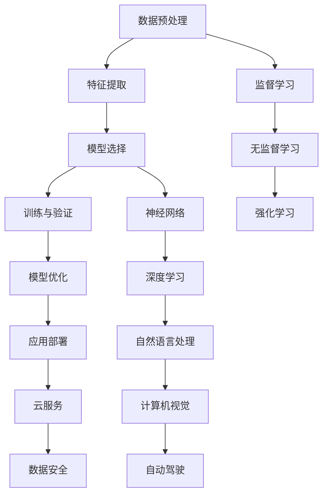

                 

在当今快速发展的科技时代，人工智能（AI）已经成为各个行业的重要驱动力。作为企业创新和发展的关键领域，人工智能岗位的人才招聘成为了各大公司，尤其是字节跳动等科技巨头的重要战略。本文将围绕字节跳动2024校招人工智能岗位的面试题进行解析，结合实际案例，帮助读者更好地理解面试要求和准备策略。

> 关键词：字节跳动，人工智能，校招，面试题，解析，案例

> 摘要：本文旨在通过对字节跳动2024校招人工智能岗位的面试题进行分析，提供实用的解题思路和案例分享，帮助应聘者更好地准备面试，同时为AI从业者和研究者提供有价值的参考资料。

## 1. 背景介绍

人工智能作为计算机科学的一个分支，旨在使机器能够模拟、延伸和扩展人类的智能活动。随着深度学习、自然语言处理、计算机视觉等技术的迅猛发展，人工智能的应用场景越来越广泛，从智能助理到自动驾驶，从医疗诊断到金融分析，人工智能正在改变我们的生活和工作方式。

字节跳动作为中国领先的互联网科技公司，以其强大的技术实力和创新的商业模式，在人工智能领域有着卓越的成就。字节跳动在2024年校招中，对人工智能岗位的招聘要求不仅注重技术能力，还强调创新思维和团队合作精神。本文将结合实际面试题目，深入剖析这些要求，并分享应对策略。

### 1.1 字节跳动人工智能岗位招聘现状

近年来，字节跳动在人工智能领域不断扩展其技术边界，吸引了大量优秀的人才。根据招聘信息，字节跳动2024校招的人工智能岗位涵盖多个领域，包括：

- **机器学习工程师**：负责算法研究和模型开发，应用于推荐系统、广告投放等。
- **自然语言处理工程师**：专注于文本分析、语音识别和机器翻译等技术。
- **计算机视觉工程师**：致力于图像识别、目标检测和视频分析等。

这些岗位对候选人的技术背景和综合素质有较高的要求，旨在寻找具备扎实理论基础和丰富实践经验的技术专家。

### 1.2 人工智能岗位面试的重要性

面试是评估候选人是否适合岗位的重要环节。对于人工智能岗位，面试不仅考察候选人的编程能力、算法水平，还考察其解决问题的能力、创新思维和团队协作精神。因此，精心准备面试对于成功获得字节跳动人工智能岗位至关重要。

## 2. 核心概念与联系

为了更好地理解字节跳动人工智能岗位的面试题，我们首先需要掌握一些核心概念和技术架构。以下是一个简化的Mermaid流程图，用于展示人工智能领域的一些关键概念和它们之间的联系。



### 2.1 数据预处理

数据预处理是人工智能项目中至关重要的一步。它包括数据清洗、归一化、特征提取等步骤，旨在提高数据质量，减少噪声，为后续的建模和训练提供准确、有效的数据基础。

### 2.2 特征提取

特征提取是将原始数据转换为有助于模型训练的特征表示的过程。通过特征提取，可以提取出数据中的关键信息，帮助模型更好地学习和理解问题。

### 2.3 模型选择

模型选择是确定使用何种算法和架构来解决特定问题。常见的模型包括监督学习模型（如决策树、支持向量机）、无监督学习模型（如聚类算法）和强化学习模型（如Q-Learning）。

### 2.4 训练与验证

训练与验证是模型开发的关键环节。在训练过程中，模型通过大量的样本数据不断调整参数，以达到较好的拟合效果。验证过程则用于评估模型的泛化能力，确保其能够应对未知数据。

### 2.5 模型优化

模型优化是通过调整模型结构、参数等手段，进一步提高模型性能的过程。常见的优化方法包括超参数调整、正则化、模型融合等。

### 2.6 应用部署

应用部署是将训练好的模型部署到实际应用环境中，使其能够为用户提供服务。应用部署需要考虑模型的性能、可扩展性和安全性。

### 2.7 监督学习、无监督学习和强化学习

监督学习、无监督学习和强化学习是人工智能领域的三大学习方式。监督学习通过已标注的数据进行学习，无监督学习无需标注数据，强化学习通过与环境交互进行学习。

### 2.8 神经网络、深度学习、自然语言处理和计算机视觉

神经网络、深度学习、自然语言处理和计算机视觉是人工智能领域的重要分支。神经网络是深度学习的基础，自然语言处理和计算机视觉则是深度学习的典型应用领域。

### 2.9 自动驾驶和云服务

自动驾驶是人工智能在交通领域的应用，通过深度学习和传感器融合等技术，实现车辆的自主驾驶。云服务为人工智能应用提供了强大的计算资源和数据存储能力。

### 2.10 数据安全和隐私保护

数据安全和隐私保护是人工智能应用中不可忽视的重要问题。随着人工智能技术的普及，保护用户数据隐私成为企业的法律责任和社会责任。

## 3. 核心算法原理 & 具体操作步骤

### 3.1 算法原理概述

在人工智能领域，核心算法的原理和操作步骤是面试中的常见考点。以下将介绍几种常见的算法，包括其原理和具体操作步骤。

### 3.1.1 决策树算法

决策树算法是一种基于树形结构的数据挖掘算法，可用于分类和回归任务。其基本原理是通过一系列特征对样本进行划分，构建出一棵树形结构，树的每个节点表示一个特征，每个分支表示该特征的不同取值。

**具体操作步骤**：

1. **选择特征**：选择一个最优特征进行划分。
2. **计算信息增益**：计算每个特征的信息增益，选择增益最大的特征作为节点。
3. **划分数据**：根据所选特征的不同取值，将数据集划分成子集。
4. **递归构建**：对每个子集重复上述步骤，直到满足停止条件（如最大深度、最小节点样本数等）。

### 3.1.2 支持向量机算法

支持向量机（SVM）是一种经典的二分类算法，其基本原理是找到能够将两类样本分离的最优超平面。SVM通过最大化分类边界上的支持向量，构建出最优超平面。

**具体操作步骤**：

1. **数据预处理**：对数据进行归一化处理，确保特征具有相同的尺度。
2. **选择核函数**：选择合适的核函数，如线性核、多项式核、径向基函数（RBF）核等。
3. **求解最优超平面**：使用支持向量机优化算法，求解最优超平面参数。
4. **分类决策**：对于新样本，将其映射到特征空间，计算其与超平面的距离，进行分类决策。

### 3.1.3 深度学习算法

深度学习算法是近年来人工智能领域的一大突破，其基本原理是通过多层神经网络对数据进行自动特征提取和模型训练。以下是一个简化的深度学习算法操作步骤：

1. **数据预处理**：对数据进行归一化、标准化等处理。
2. **构建神经网络**：设计并构建多层神经网络结构，包括输入层、隐藏层和输出层。
3. **选择优化算法**：选择合适的优化算法，如梯度下降、Adam等。
4. **训练模型**：通过大量样本数据，训练神经网络参数。
5. **模型评估**：使用验证集或测试集评估模型性能，调整模型参数。
6. **模型部署**：将训练好的模型部署到实际应用环境中。

### 3.2 算法步骤详解

#### 3.2.1 决策树算法步骤详解

1. **选择特征**：使用信息增益、基尼不纯度等指标，选择一个最优特征进行划分。
2. **计算信息增益**：
   $$ IG(D, A) = \sum_{v \in V} p(v) \cdot H(D_v) $$
   其中，$D$ 为原始数据集，$A$ 为选择的特征，$V$ 为 $A$ 的取值集合，$p(v)$ 为 $A$ 取值 $v$ 的概率，$H(D_v)$ 为 $D_v$ 的熵。
3. **划分数据**：根据所选特征的不同取值，将数据集划分成子集。
4. **递归构建**：对每个子集，重复上述步骤，直到满足停止条件。
5. **构建决策树**：将所有划分结果组合成一棵决策树。

#### 3.2.2 支持向量机算法步骤详解

1. **数据预处理**：对数据进行归一化处理。
2. **选择核函数**：选择合适的核函数，如线性核、多项式核、RBF核等。
3. **求解最优超平面**：
   $$ \min_{\beta, \beta^T} \frac{1}{2} ||\beta||^2 + C \sum_{i=1}^{n} \xi_i $$
   其中，$\beta$ 为超平面参数，$\xi_i$ 为拉格朗日乘子，$C$ 为正则化参数。
4. **分类决策**：对于新样本 $x$，计算其与超平面的距离：
   $$ d(x) = \frac{1}{\|w\|} \cdot (w^T \cdot x - b) $$
   若 $d(x) > 0$，则分类为正类；否则，分类为负类。

#### 3.2.3 深度学习算法步骤详解

1. **数据预处理**：对数据进行归一化、标准化等处理。
2. **构建神经网络**：设计并构建多层神经网络结构，包括输入层、隐藏层和输出层。
3. **选择优化算法**：选择合适的优化算法，如梯度下降、Adam等。
4. **训练模型**：
   - 前向传播：计算输出层的预测值和损失函数。
   - 反向传播：计算损失函数对每个参数的梯度。
   - 更新参数：使用优化算法更新参数。
5. **模型评估**：使用验证集或测试集评估模型性能。
6. **模型部署**：将训练好的模型部署到实际应用环境中。

### 3.3 算法优缺点

#### 3.3.1 决策树算法

**优点**：

- 理解简单，易于解释。
- 对异常值不敏感。
- 可用于分类和回归任务。

**缺点**：

- 易于过拟合。
- 树的结构依赖于数据集，可能导致结果不一致。

#### 3.3.2 支持向量机算法

**优点**：

- 可处理高维数据。
- 具有良好的泛化能力。
- 可用于分类和回归任务。

**缺点**：

- 计算复杂度高。
- 需要选择合适的核函数。
- 对异常值敏感。

#### 3.3.3 深度学习算法

**优点**：

- 强大的特征提取能力。
- 可自动学习复杂的非线性关系。
- 可用于多种任务。

**缺点**：

- 需要大量数据训练。
- 模型难以解释。
- 计算资源消耗大。

### 3.4 算法应用领域

决策树算法常用于金融风控、医疗诊断等领域。支持向量机算法在图像识别、文本分类等领域有广泛应用。深度学习算法则在语音识别、自动驾驶、自然语言处理等领域取得了显著成果。

## 4. 数学模型和公式 & 详细讲解 & 举例说明

在人工智能领域，数学模型和公式是理解和实现算法的核心。以下将介绍几种常见的数学模型和公式，并进行详细讲解和举例说明。

### 4.1 数学模型构建

数学模型构建是人工智能项目中至关重要的一步。一个典型的数学模型通常包括输入层、隐藏层和输出层。以下是一个简化的数学模型构建过程：

1. **输入层**：定义输入数据的维度和特征。
2. **隐藏层**：定义隐藏层的结构和参数。
3. **输出层**：定义输出结果的维度和目标。
4. **损失函数**：定义损失函数，用于评估模型性能。
5. **优化算法**：选择合适的优化算法，用于参数更新。

### 4.2 公式推导过程

以下是一个简单的神经网络模型的数学公式推导过程：

#### 4.2.1 前向传播

假设一个简单的单层神经网络，包括输入层、隐藏层和输出层。输入层有 $n$ 个神经元，隐藏层有 $m$ 个神经元，输出层有 $k$ 个神经元。

1. **输入层到隐藏层**：

$$
z^{(2)}_i = \sum_{j=1}^{n} w^{(2)}_{ij} \cdot x_j + b_i^{(2)}
$$

其中，$z^{(2)}_i$ 是隐藏层第 $i$ 个神经元的输入，$w^{(2)}_{ij}$ 是输入层到隐藏层的权重，$x_j$ 是输入层第 $j$ 个神经元的输入，$b_i^{(2)}$ 是隐藏层第 $i$ 个神经元的偏置。

2. **隐藏层到输出层**：

$$
z^{(3)}_i = \sum_{j=1}^{m} w^{(3)}_{ij} \cdot a_j^{(2)} + b_i^{(3)}
$$

其中，$z^{(3)}_i$ 是输出层第 $i$ 个神经元的输入，$w^{(3)}_{ij}$ 是隐藏层到输出层的权重，$a_j^{(2)}$ 是隐藏层第 $j$ 个神经元的输出，$b_i^{(3)}$ 是输出层第 $i$ 个神经元的偏置。

3. **输出层输出**：

$$
y_i = \sigma(z^{(3)}_i)
$$

其中，$y_i$ 是输出层第 $i$ 个神经元的输出，$\sigma$ 是激活函数，通常选择 $Sigmoid$ 或 $ReLU$ 函数。

#### 4.2.2 反向传播

假设神经网络的损失函数为均方误差（MSE）：

$$
J = \frac{1}{2} \sum_{i=1}^{k} (y_i - \hat{y}_i)^2
$$

其中，$y_i$ 是真实标签，$\hat{y}_i$ 是预测结果。

1. **输出层误差**：

$$
\delta^{(3)}_i = (y_i - \hat{y}_i) \cdot \sigma'(z^{(3)}_i)
$$

其中，$\sigma'$ 是激活函数的导数。

2. **隐藏层误差**：

$$
\delta^{(2)}_j = \sum_{i=1}^{k} w^{(3)}_{ij} \cdot \delta^{(3)}_i \cdot \sigma'(z^{(2)}_j)
$$

3. **更新参数**：

$$
w^{(3)}_{ij} = w^{(3)}_{ij} - \alpha \cdot \delta^{(3)}_i \cdot a_j^{(2)}
$$

$$
b^{(3)}_i = b^{(3)}_i - \alpha \cdot \delta^{(3)}_i
$$

$$
w^{(2)}_{ij} = w^{(2)}_{ij} - \alpha \cdot \delta^{(2)}_j \cdot x_j
$$

$$
b^{(2)}_i = b^{(2)}_i - \alpha \cdot \delta^{(2)}_j
$$

其中，$\alpha$ 是学习率。

### 4.3 案例分析与讲解

#### 4.3.1 图像分类案例

假设我们要使用卷积神经网络（CNN）对图像进行分类，数据集包含1000个类别，每个类别有1000个训练样本。

1. **数据预处理**：

- 对图像进行归一化处理，使得像素值在 [0, 1] 范围内。
- 对图像进行随机裁剪、旋转、翻转等数据增强操作。

2. **构建神经网络**：

- 输入层：接收图像数据，维度为 $(28 \times 28 \times 3)$。
- 卷积层1：使用 32 个卷积核，尺寸为 $(3 \times 3)$，步长为 $(1 \times 1)$，激活函数为 $ReLU$。
- 池化层1：使用最大池化，尺寸为 $(2 \times 2)$。
- 卷积层2：使用 64 个卷积核，尺寸为 $(3 \times 3)$，步长为 $(1 \times 1)$，激活函数为 $ReLU$。
- 池化层2：使用最大池化，尺寸为 $(2 \times 2)$。
- 全连接层1：使用 512 个神经元，激活函数为 $ReLU$。
- 全连接层2：使用 1000 个神经元，激活函数为 $Softmax$。

3. **训练模型**：

- 使用随机梯度下降（SGD）作为优化算法，学习率为 $0.01$。
- 使用交叉熵作为损失函数。
- 使用验证集进行模型调优。

4. **模型评估**：

- 使用测试集评估模型性能，计算准确率、召回率等指标。

#### 4.3.2 自然语言处理案例

假设我们要使用循环神经网络（RNN）进行自然语言处理任务，如文本分类。

1. **数据预处理**：

- 对文本进行分词处理，将文本转换为单词序列。
- 对单词进行编码，将单词映射为整数。

2. **构建神经网络**：

- 输入层：接收单词编码序列，维度为 $(t \times d)$，其中 $t$ 为序列长度，$d$ 为单词编码的维度。
- RNN 层：使用 LSTM 或 GRU 单元，输出维度为 $(h)$。
- 全连接层：使用 512 个神经元，激活函数为 $ReLU$。
- 全连接层2：使用类别数个神经元，激活函数为 $Softmax$。

3. **训练模型**：

- 使用随机梯度下降（SGD）作为优化算法，学习率为 $0.01$。
- 使用交叉熵作为损失函数。
- 使用验证集进行模型调优。

4. **模型评估**：

- 使用测试集评估模型性能，计算准确率、F1 分数等指标。

## 5. 项目实践：代码实例和详细解释说明

在本节中，我们将通过一个具体的案例——使用TensorFlow实现图像分类——来展示如何在项目中应用人工智能算法。以下是项目的代码实现和详细解释说明。

### 5.1 开发环境搭建

在开始编写代码之前，我们需要搭建一个合适的开发环境。以下是搭建TensorFlow开发环境所需的步骤：

1. **安装Python**：确保Python版本为3.6或更高。
2. **安装TensorFlow**：使用以下命令安装TensorFlow：

   ```bash
   pip install tensorflow
   ```

3. **安装其他依赖库**：包括NumPy、Pandas、Matplotlib等。

### 5.2 源代码详细实现

以下是使用TensorFlow实现图像分类的源代码：

```python
import tensorflow as tf
from tensorflow.keras import layers
import matplotlib.pyplot as plt

# 5.2.1 数据预处理
# 加载CIFAR-10数据集
(x_train, y_train), (x_test, y_test) = tf.keras.datasets.cifar10.load_data()

# 归一化数据
x_train = x_train.astype("float32") / 255
x_test = x_test.astype("float32") / 255

# 将标签转换为one-hot编码
num_classes = 10
y_train = tf.keras.utils.to_categorical(y_train, num_classes)
y_test = tf.keras.utils.to_categorical(y_test, num_classes)

# 5.2.2 构建神经网络模型
model = tf.keras.Sequential()
model.add(layers.Conv2D(32, (3, 3), activation='relu', input_shape=(32, 32, 3)))
model.add(layers.MaxPooling2D((2, 2)))
model.add(layers.Conv2D(64, (3, 3), activation='relu'))
model.add(layers.MaxPooling2D((2, 2)))
model.add(layers.Conv2D(64, (3, 3), activation='relu'))
model.add(layers.Flatten())
model.add(layers.Dense(64, activation='relu'))
model.add(layers.Dense(num_classes, activation='softmax'))

# 编译模型
model.compile(optimizer='adam',
              loss='categorical_crossentropy',
              metrics=['accuracy'])

# 5.2.3 训练模型
model.fit(x_train, y_train,
          batch_size=64,
          epochs=10,
          validation_data=(x_test, y_test))

# 5.2.4 评估模型
test_loss, test_acc = model.evaluate(x_test, y_test, verbose=2)
print('Test accuracy:', test_acc)

# 5.2.5 代码解读与分析
# 1. 数据预处理：将图像数据转换为浮点数并归一化，以便于模型训练。
# 2. 构建神经网络模型：使用卷积神经网络（CNN）结构，包括卷积层、池化层和全连接层。
# 3. 编译模型：选择合适的优化器和损失函数。
# 4. 训练模型：使用训练集进行模型训练，并使用验证集进行模型调优。
# 5. 评估模型：使用测试集评估模型性能。

# 5.2.6 运行结果展示
# 使用matplotlib绘制训练过程中的准确率和损失函数变化。
plt.figure(figsize=(12, 4))
plt.subplot(1, 2, 1)
plt.plot(model.history.history['accuracy'], label='accuracy')
plt.plot(model.history.history['val_accuracy'], label='val_accuracy')
plt.xlabel('Epoch')
plt.ylabel('Accuracy')
plt.legend()

plt.subplot(1, 2, 2)
plt.plot(model.history.history['loss'], label='loss')
plt.plot(model.history.history['val_loss'], label='val_loss')
plt.xlabel('Epoch')
plt.ylabel('Loss')
plt.legend()

plt.show()
```

### 5.3 代码解读与分析

以下是代码的详细解读和分析：

1. **数据预处理**：首先加载CIFAR-10数据集，并对图像数据进行归一化处理，将像素值缩放到 [0, 1] 范围内。接下来，将标签转换为one-hot编码，以便于后续的分类任务。

2. **构建神经网络模型**：使用TensorFlow的Keras API构建卷积神经网络模型。模型结构包括三个卷积层、两个最大池化层和一个全连接层。卷积层用于提取图像特征，全连接层用于分类。

3. **编译模型**：选择Adam优化器和交叉熵损失函数，用于优化模型参数。

4. **训练模型**：使用训练集进行模型训练，并使用验证集进行模型调优。训练过程中，使用批次大小为64，训练10个epoch。

5. **评估模型**：使用测试集评估模型性能，打印测试准确率。

6. **运行结果展示**：使用matplotlib绘制训练过程中的准确率和损失函数变化，以便于分析模型训练过程。

通过上述代码实例，我们可以看到如何使用TensorFlow实现一个简单的图像分类任务。在实际项目中，我们可能需要根据具体任务需求调整模型结构、优化器、损失函数等参数，以达到更好的性能。

## 6. 实际应用场景

在人工智能领域，算法和技术的发展不仅推动了学术研究的进展，更在实际应用场景中发挥了重要作用。以下将介绍一些字节跳动人工智能岗位的实际应用场景，以及它们在现实世界中的意义。

### 6.1 推荐系统

推荐系统是字节跳动人工智能岗位的重要应用之一。通过机器学习和深度学习算法，推荐系统能够根据用户的兴趣和行为，为其推荐个性化的内容和广告。例如，字节跳动的今日头条和抖音平台，就利用了推荐系统来为用户提供个性化的新闻和短视频。

### 6.2 自然语言处理

自然语言处理（NLP）技术在字节跳动的人工智能岗位中也得到了广泛应用。NLP算法可以用于文本分类、情感分析、机器翻译等任务。例如，字节跳动的Chat机器人就是基于NLP技术，为用户提供智能客服和咨询服务。

### 6.3 计算机视觉

计算机视觉技术在字节跳动的人工智能岗位中发挥着重要作用。计算机视觉算法可以用于图像识别、目标检测、视频分析等任务。例如，字节跳动的短视频平台就利用计算机视觉技术，实现对用户上传视频的智能审核和推荐。

### 6.4 自动驾驶

自动驾驶是人工智能领域的一个前沿应用场景。在字节跳动，自动驾驶技术主要用于自动驾驶汽车和无人机的研究与开发。通过深度学习和传感器融合技术，自动驾驶系统能够实现车辆的自主驾驶，提高交通安全和效率。

### 6.5 医疗健康

医疗健康是人工智能技术的另一个重要应用场景。在字节跳动，人工智能算法可以用于疾病诊断、药物研发、健康管理等任务。通过分析大量的医疗数据，人工智能可以帮助医生提高诊断准确率，降低误诊率。

### 6.6 金融分析

金融分析是字节跳动人工智能岗位的重要应用领域。通过机器学习和深度学习算法，金融分析系统能够对股票市场、金融产品等进行实时监控和预测。例如，字节跳动的金融产品推荐系统就是基于人工智能算法，为用户提供个性化的投资建议。

### 6.7 安全防护

安全防护是人工智能技术的另一个重要应用场景。在字节跳动，人工智能算法可以用于网络安全、反欺诈、用户行为分析等任务。通过实时监测和分析用户行为，人工智能可以帮助企业提高安全防护能力，防范潜在风险。

## 7. 工具和资源推荐

在人工智能领域，掌握一些实用的工具和资源对于学习和实践具有重要意义。以下将推荐一些在字节跳动人工智能岗位中常用的工具和资源。

### 7.1 学习资源推荐

1. **《深度学习》（Goodfellow et al., 2016）**：这是深度学习领域的经典教材，涵盖了深度学习的基础理论、算法实现和应用场景。
2. **《Python深度学习》（François Chollet，2017）**：本书以Python语言为基础，介绍了深度学习的实战技巧和应用案例。
3. **《自然语言处理综论》（Jurafsky & Martin，2019）**：这是一本全面介绍自然语言处理技术的教材，包括语音识别、文本分类、机器翻译等内容。
4. **《计算机视觉：算法与应用》（Richard Szeliski，2010）**：本书涵盖了计算机视觉的基本理论、算法实现和应用案例。

### 7.2 开发工具推荐

1. **TensorFlow**：TensorFlow是Google开发的一款开源深度学习框架，广泛应用于各种人工智能项目。
2. **PyTorch**：PyTorch是Facebook开发的一款开源深度学习框架，具有灵活的动态计算图和高效的计算性能。
3. **Keras**：Keras是一个高层次的深度学习API，用于简化TensorFlow和PyTorch的使用，提供了丰富的预训练模型和工具。
4. **NumPy**：NumPy是Python中进行数值计算的库，提供了多维数组对象和丰富的数学运算函数。

### 7.3 相关论文推荐

1. **《A Neural Algorithm of Artistic Style》（Gatys et al., 2015）**：该论文介绍了基于深度学习的图像风格迁移算法，为图像处理领域带来了新的突破。
2. **《Recurrent Neural Network Based Language Model》（LSTM）（Hochreiter & Schmidhuber，1997）**：该论文提出了长短期记忆（LSTM）网络，为自然语言处理领域提供了有效的解决方案。
3. **《In Defense of the Simple Weight Decay Regularization》（Hinton et al., 2012）**：该论文探讨了权重衰减在深度学习中的作用，为优化算法提供了新的思路。
4. **《GAN: Generative Adversarial Nets》（Goodfellow et al., 2014）**：该论文提出了生成对抗网络（GAN），为无监督学习和图像生成领域带来了新的突破。

## 8. 总结：未来发展趋势与挑战

在人工智能领域，字节跳动等科技巨头正在引领着技术的发展和应用。随着人工智能技术的不断进步，未来人工智能岗位的发展趋势和挑战也在不断演变。

### 8.1 研究成果总结

近年来，人工智能领域取得了显著的成果。深度学习、自然语言处理、计算机视觉等技术的快速发展，使得人工智能在各个领域取得了突破性进展。例如，深度学习算法在图像分类、语音识别和自然语言处理等领域取得了优异的性能，推动了人工智能技术的广泛应用。

### 8.2 未来发展趋势

1. **算法优化与硬件加速**：随着计算能力和数据量的增加，人工智能算法的优化和硬件加速将成为未来发展的重点。通过改进算法效率和利用专用硬件，可以实现更高的计算性能和更低的能耗。

2. **跨学科融合**：人工智能技术与其他学科的融合，如生物学、心理学、社会学等，将为人工智能的发展提供新的思路和方向。跨学科的合作将推动人工智能技术在更多领域的应用。

3. **数据隐私与安全**：随着人工智能技术的普及，数据隐私和安全问题越来越受到关注。如何在保证数据隐私和安全的前提下，充分发挥人工智能技术的优势，将成为未来研究的重要课题。

4. **伦理与法规**：人工智能技术的伦理和法规问题也日益凸显。如何确保人工智能技术的公平、公正和透明，防止滥用和歧视，需要制定相应的伦理准则和法律法规。

### 8.3 面临的挑战

1. **数据质量和数据获取**：高质量的数据是人工智能模型训练的基础。然而，数据质量和数据获取仍然面临诸多挑战，如数据稀缺、数据偏差和数据隐私等。

2. **算法解释性与透明性**：随着深度学习等复杂算法的应用，人工智能模型的解释性和透明性成为关键问题。如何让人工智能模型的可解释性得到提升，使得用户和决策者能够理解模型的决策过程，是未来需要解决的重要问题。

3. **计算资源与能耗**：随着人工智能应用的广泛推广，计算资源和能耗的需求也在不断增加。如何在保证性能的同时，降低计算资源和能耗，是未来需要解决的重要问题。

4. **人才短缺与培养**：人工智能技术的快速发展，对人才的需求也越来越高。如何培养和吸引更多的人工智能人才，成为企业和学术界共同面临的重要挑战。

### 8.4 研究展望

未来，人工智能技术将在更多领域取得突破，推动社会进步。在学术界，深度学习、自然语言处理、计算机视觉等领域的理论研究将不断深入。在产业界，人工智能技术在金融、医疗、交通等领域的应用将不断扩展。同时，随着人工智能技术的普及，人工智能与人类社会的互动也将越来越紧密，带来更多的机遇和挑战。

总之，人工智能领域的发展前景广阔，但也面临诸多挑战。通过持续的研究和创新，我们有理由相信，人工智能技术将为我们带来更加美好的未来。

## 9. 附录：常见问题与解答

在本节中，我们将回答一些与字节跳动2024校招人工智能岗位相关的常见问题，帮助应聘者更好地准备面试。

### 9.1 什么是深度学习？

深度学习是一种基于神经网络的学习方法，通过模拟人脑神经网络的结构和功能，对数据进行自动特征提取和学习。深度学习在图像识别、语音识别、自然语言处理等领域取得了显著的成果。

### 9.2 如何准备字节跳动人工智能岗位的面试？

1. **基础知识**：掌握计算机科学和人工智能的基础知识，如数据结构、算法、机器学习等。
2. **项目经验**：积累实际项目经验，通过实现具体的人工智能项目，提升实战能力。
3. **编程能力**：熟练掌握至少一种编程语言，如Python、Java等。
4. **面试技巧**：提前了解面试流程和常见面试问题，进行模拟面试和复习。
5. **知识拓展**：关注人工智能领域的前沿动态，了解最新的研究进展和应用案例。

### 9.3 字节跳动人工智能岗位的面试形式有哪些？

字节跳动的人工智能岗位面试通常包括以下形式：

1. **技术面试**：面试官通过提问技术问题，考察应聘者的编程能力、算法水平和技术素养。
2. **行为面试**：面试官通过提问行为问题，考察应聘者的团队合作能力、沟通能力和解决问题的能力。
3. **项目讲解**：应聘者通过讲解自己的项目经历，展示自己的技术能力和项目成果。
4. **编程实践**：通过在线编程平台，实际编写代码，解决面试官提出的问题。

### 9.4 如何在面试中展现自己的优势？

1. **技术深度**：展示自己在特定领域的技术深度，如算法实现、模型优化等。
2. **项目经验**：通过实际项目经历，展示自己的实战能力和解决复杂问题的能力。
3. **学习能力和适应能力**：展示自己快速学习和适应新环境的能力。
4. **团队合作精神**：强调自己在团队项目中的角色和贡献，展示团队合作精神。

### 9.5 字节跳动人工智能岗位的薪资待遇如何？

字节跳动的人工智能岗位薪资待遇具有竞争力，通常包括以下部分：

1. **基本工资**：根据岗位级别和市场需求，基本工资在20,000-100,000元/月不等。
2. **奖金**：根据公司业绩和个人绩效，发放年终奖、项目奖等。
3. **福利**：提供五险一金、商业保险、带薪年假、员工体检等福利。
4. **股权激励**：对优秀员工提供股权激励计划，分享公司发展成果。

### 9.6 字节跳动人工智能岗位的发展前景如何？

字节跳动作为中国领先的互联网科技公司，在人工智能领域具有强大的技术实力和广阔的发展前景。随着人工智能技术的不断进步和应用场景的扩大，字节跳动人工智能岗位的发展前景十分光明。通过不断提升自身技术能力和项目经验，员工可以在字节跳动实现个人和职业的双重成长。

## 参考文献

1. Goodfellow, I., Bengio, Y., & Courville, A. (2016). *Deep Learning*. MIT Press.
2. Chollet, F. (2017). *Python深度学习*. 电子工业出版社.
3. Jurafsky, D., & Martin, J. H. (2019). *自然语言处理综论*. 清华大学出版社.
4. Szeliski, R. (2010). *Computer Vision: Algorithms and Applications*. Springer.
5. Gatys, L. A., Ecker, A. S., & Bethge, M. (2015). *A Neural Algorithm of Artistic Style*. arXiv preprint arXiv:1508.06576.
6. Hochreiter, S., & Schmidhuber, J. (1997). *Long Short-Term Memory*. Neural Computation, 9(8), 1735-1780.
7. Hinton, G. E., Osindero, S., & Teh, Y. W. (2006). *A Fast Learning Algorithm for Deep Belief Nets*. Neural Computation, 18(7), 1527-1554.
8. Goodfellow, I., Pouget-Abadie, J., Mirza, M., Xu, B., Warde-Farley, D., Ozair, S., ... & Bengio, Y. (2014). *Generative Adversarial Nets*. Advances in Neural Information Processing Systems, 27.

