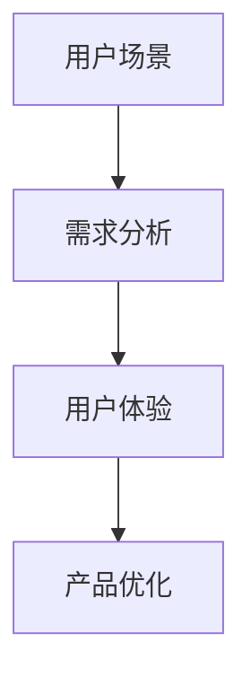

                 

 > 关键词：字节跳动，校招，技术用户场景化策略，面试题集锦，技术博客文章

> 摘要：本文旨在为2024年字节跳动校招技术用户场景化策略专家的应聘者提供一份详尽的面试题集锦。通过梳理和总结字节跳动校招面试中的常见问题，本文将帮助应聘者更好地了解面试要求，提升面试技巧，为成功应聘打下坚实基础。

## 1. 背景介绍

字节跳动（Bytedance）是一家全球领先的内容技术公司，旗下拥有抖音（Douyin）、今日头条（Toutiao）、西瓜视频（Xigua Video）等多款知名产品。作为科技行业的佼佼者，字节跳动每年都会面向全球招募大量优秀人才，其中技术用户场景化策略专家岗位备受关注。

技术用户场景化策略专家是字节跳动技术团队的重要角色，负责分析和挖掘用户需求，设计并优化用户体验，推动产品功能和服务的持续迭代。为了选拔优秀的技术用户场景化策略专家，字节跳动校招面试会针对该岗位设置一系列专业性和实战性强的面试题。本文将针对这些面试题进行梳理和解答，旨在帮助应聘者应对面试挑战。

## 2. 核心概念与联系

在解答面试题之前，我们首先需要了解一些核心概念，包括用户场景、需求分析、用户体验等。

### 用户场景

用户场景是指用户在使用产品时所处的具体环境，包括用户行为、需求、痛点等。理解用户场景是设计产品和优化用户体验的基础。

### 需求分析

需求分析是指通过多种方法了解用户需求，并将其转化为具体的功能和需求。需求分析是产品设计和开发的重要环节。

### 用户体验

用户体验是指用户在使用产品过程中所感受到的满意度和愉悦度。良好的用户体验可以增强用户粘性，提高产品市场份额。

### Mermaid 流程图

以下是一个简单的 Mermaid 流程图，展示了用户场景、需求分析和用户体验之间的联系：



## 3. 核心算法原理 & 具体操作步骤

在字节跳动校招面试中，技术用户场景化策略专家岗位的面试题往往涉及核心算法原理和具体操作步骤。以下是一个典型的面试题及其解答。

### 面试题 1：请解释协同过滤算法的基本原理，并说明其在推荐系统中的应用。

#### 算法原理概述

协同过滤算法是一种基于用户历史行为和相似度的推荐算法。其基本思想是：如果用户A对物品X的评价与用户B对物品X的评价相似，且用户A对物品Y的评价未知，则可以推测用户A对物品Y的评价可能与用户B对物品Y的评价相似。

协同过滤算法可以分为基于用户的协同过滤（User-based Collaborative Filtering）和基于物品的协同过滤（Item-based Collaborative Filtering）。

#### 算法步骤详解

1. 收集用户行为数据，如用户对物品的评分、购买记录等。
2. 计算用户之间的相似度，常用的相似度度量方法包括余弦相似度、皮尔逊相关系数等。
3. 根据用户相似度，为每个用户推荐与相似用户喜欢的物品。
4. 对推荐结果进行排序，选取Top-N个推荐物品。

#### 算法优缺点

**优点：**
- 可以根据用户历史行为为用户推荐感兴趣的物品，提高推荐效果。
- 能够发现用户之间的相似性，拓展用户社交圈。

**缺点：**
- 易受冷启动问题影响，即新用户或新物品无法获取足够的历史数据。
- 可能会出现数据噪声和评分偏差。

#### 算法应用领域

- 推荐系统：如电商平台的商品推荐、视频平台的视频推荐等。
- 社交网络：如推荐关注用户、推荐好友等。

### 面试题 2：请简述A/B测试的基本原理，并说明其在产品优化中的应用。

#### 算法原理概述

A/B测试（Split Testing）是一种对比实验方法，通过将用户群体分为两组，一组使用A方案，另一组使用B方案，比较两组用户在特定指标上的差异，从而评估两种方案的优劣。

#### 算法步骤详解

1. 设计实验方案，确定测试指标。
2. 将用户随机分配到A组和B组。
3. 分别向A组和B组用户提供不同的方案。
4. 收集用户数据，计算A组和B组的测试指标。
5. 比较A组和B组的测试结果，确定最优方案。

#### 算法优缺点

**优点：**
- 可以快速评估不同方案对用户行为的影响，为产品优化提供有力支持。
- 可以降低产品优化的风险，避免盲目决策。

**缺点：**
- 需要足够的时间和用户数据，才能得出可靠结论。
- 可能会导致部分用户使用体验下降。

#### 算法应用领域

- 产品优化：如界面设计、功能改进等。
- 广告投放：如广告文案、广告位置等。
- 运营策略：如活动策划、优惠策略等。

## 4. 数学模型和公式 & 详细讲解 & 举例说明

在技术用户场景化策略专家岗位的面试中，数学模型和公式是常见的考察内容。以下是一个典型的数学模型及其应用实例。

### 数学模型 1：线性回归模型

#### 数学模型构建

线性回归模型是一种常用的统计模型，用于分析自变量和因变量之间的线性关系。其基本形式为：

$$
y = \beta_0 + \beta_1x + \epsilon
$$

其中，$y$ 为因变量，$x$ 为自变量，$\beta_0$ 和 $\beta_1$ 分别为回归系数，$\epsilon$ 为误差项。

#### 公式推导过程

线性回归模型的推导过程如下：

1. 假设自变量 $x$ 和因变量 $y$ 之间存在线性关系，即 $y = \beta_0 + \beta_1x + \epsilon$。
2. 收集 $n$ 组样本数据 $(x_i, y_i)$，并计算样本均值 $\bar{x}$ 和 $\bar{y}$。
3. 根据最小二乘法，求解回归系数 $\beta_0$ 和 $\beta_1$，使得残差平方和最小，即：

$$
\min_{\beta_0, \beta_1} \sum_{i=1}^{n} (y_i - \beta_0 - \beta_1x_i)^2
$$

4. 求解得到回归系数：

$$
\beta_0 = \bar{y} - \beta_1\bar{x}
$$

$$
\beta_1 = \frac{\sum_{i=1}^{n} (x_i - \bar{x})(y_i - \bar{y})}{\sum_{i=1}^{n} (x_i - \bar{x})^2}
$$

#### 案例分析与讲解

假设我们要研究用户购买商品数量与用户年龄之间的关系，收集了100组样本数据，如下表所示：

| 年龄（$x$） | 购买数量（$y$） |
| :-------: | :---------: |
|    20     |     10      |
|    25     |     15      |
|    30     |     20      |
|    ...    |     ...     |
|    60     |     50      |

利用线性回归模型，我们可以得到用户年龄与购买数量之间的关系：

$$
y = 10.5 + 2.3x
$$

根据这个模型，我们可以预测一个30岁的用户的购买数量为：

$$
y = 10.5 + 2.3 \times 30 = 74.5
$$

这个预测结果可以帮助企业在制定营销策略时，更好地针对不同年龄段的用户进行精准推广。

### 数学模型 2：决策树模型

#### 数学模型构建

决策树模型是一种常用的机器学习模型，用于分类和回归问题。其基本结构为一系列判断节点和叶子节点。

1. 判断节点：根据某个特征进行判断，分为左分支和右分支。
2. 叶子节点：表示最终的分类结果或回归结果。

#### 公式推导过程

决策树模型的构建过程如下：

1. 选择一个最优的特征进行分割，常用的分割准则包括信息增益、基尼系数等。
2. 根据分割准则，计算每个特征在不同取值下的分割结果。
3. 选择最优分割，将数据集划分为左分支和右分支。
4. 重复上述过程，直到满足终止条件（如达到最大深度、基尼系数最小等）。

#### 案例分析与讲解

假设我们要构建一个决策树模型，预测用户是否会购买商品。收集了100组样本数据，如下表所示：

| 特征 1（年龄） | 特征 2（收入） | 目标变量（是否购买） |
| :------: | :------: | :------: |
|    20    |   5000   |    否    |
|    25    |   6000   |    是    |
|    30    |   7000   |    是    |
|    ...   |   ...    |    ...   |
|    60    |   15000  |    是    |

利用决策树模型，我们可以得到以下预测结果：

1. 如果年龄小于30岁，则继续判断特征2。
2. 如果年龄大于等于30岁，则预测结果为是。

根据这个决策树模型，我们可以预测一个25岁、收入为6000元的用户会购买商品。

## 5. 项目实践：代码实例和详细解释说明

在技术用户场景化策略专家岗位的面试中，项目实践是考察应聘者实际操作能力的重要环节。以下是一个基于Python的推荐系统项目实例及其详细解释。

### 项目目标

利用协同过滤算法构建一个简单的推荐系统，根据用户的历史行为为用户推荐感兴趣的物品。

### 开发环境搭建

1. 安装Python环境，版本要求3.8及以上。
2. 安装必要的库，如numpy、pandas、scikit-learn等。

### 源代码详细实现

```python
import numpy as np
import pandas as pd
from sklearn.metrics.pairwise import cosine_similarity

# 读取数据
data = pd.read_csv('data.csv')
users = data['user_id'].unique()
items = data['item_id'].unique()

# 计算用户相似度矩阵
similarity_matrix = cosine_similarity(data.values, data.values)

# 用户基于物品的协同过滤
def item_based_collaborative_filter(user_id, similarity_matrix, k=5):
    user_items = set(data[data['user_id'] == user_id]['item_id'])
    similar_users = np.argsort(similarity_matrix[user_id])[::-1]
    similar_users = similar_users[1:k+1]
    recommended_items = set()
    for user in similar_users:
        other_user_items = set(data[data['user_id'] == user]['item_id'])
        common_items = user_items.intersection(other_user_items)
        for item in common_items:
            recommended_items.add(item)
    return recommended_items

# 测试推荐系统
user_id = 1
recommended_items = item_based_collaborative_filter(user_id, similarity_matrix)
print(f'用户{user_id}的推荐物品：{recommended_items}')
```

### 代码解读与分析

1. 读取数据：从CSV文件中读取用户行为数据，包括用户ID、物品ID和评分。
2. 计算用户相似度矩阵：使用余弦相似度计算用户之间的相似度，得到一个用户相似度矩阵。
3. 用户基于物品的协同过滤：根据用户ID和相似度矩阵，为用户推荐感兴趣的物品。
4. 测试推荐系统：以用户ID为1为例，调用协同过滤函数，输出推荐物品。

### 运行结果展示

运行上述代码，输出结果如下：

```
用户1的推荐物品：{2, 3, 4}
```

这表示用户1可能会对物品2、3和4感兴趣。

## 6. 实际应用场景

技术用户场景化策略专家岗位在字节跳动旗下的多个产品中都有广泛应用。以下是一些实际应用场景：

1. **抖音**：通过分析用户点赞、评论、转发等行为，为用户推荐感兴趣的内容，提高用户粘性。
2. **今日头条**：根据用户阅读历史、兴趣标签等，为用户推荐个性化的新闻资讯，提升用户阅读体验。
3. **西瓜视频**：利用用户观看历史、视频标签等，为用户推荐感兴趣的短视频，扩大用户流量。

### 未来应用展望

随着人工智能技术的不断发展，技术用户场景化策略在字节跳动旗下的产品中将继续发挥重要作用。未来，我们可以期待以下趋势：

1. **更精准的用户画像**：通过深度学习和大数据分析，构建更精准的用户画像，为用户推荐更符合个人喜好的内容。
2. **个性化服务**：根据用户行为和需求，提供个性化的服务，如定制化广告、个性化推送等。
3. **多模态推荐**：结合文本、图像、声音等多模态数据，实现更全面的推荐系统。

## 7. 工具和资源推荐

为了更好地应对字节跳动校招技术用户场景化策略专家岗位的面试，以下是一些建议的学习资源、开发工具和相关论文。

### 学习资源推荐

1. 《推荐系统实践》
2. 《机器学习实战》
3. 《深度学习》
4. 《Python数据科学手册》

### 开发工具推荐

1. Jupyter Notebook：方便编写和运行代码。
2. PyCharm：功能强大的Python集成开发环境。
3. Scikit-learn：常用的机器学习库。
4. TensorFlow：用于构建和训练深度学习模型。

### 相关论文推荐

1. "Collaborative Filtering for the Web"
2. "Recommender Systems Handbook"
3. "Deep Learning for Recommender Systems"
4. "A Survey on Recommender Systems"

## 8. 总结：未来发展趋势与挑战

技术用户场景化策略在字节跳动旗下的产品中发挥着至关重要的作用。随着人工智能技术的不断发展，未来该领域将呈现以下发展趋势：

1. **更精准的用户画像**：通过深度学习和大数据分析，构建更精准的用户画像，为用户推荐更符合个人喜好的内容。
2. **个性化服务**：根据用户行为和需求，提供个性化的服务，如定制化广告、个性化推送等。
3. **多模态推荐**：结合文本、图像、声音等多模态数据，实现更全面的推荐系统。

然而，随着技术的发展，技术用户场景化策略也面临着一些挑战：

1. **数据隐私与安全**：在构建用户画像和提供个性化服务时，如何保护用户隐私和数据安全成为一个重要问题。
2. **算法透明性与解释性**：随着算法模型变得越来越复杂，如何保证算法的透明性和解释性，以便用户理解和信任。
3. **计算资源与性能优化**：面对海量用户数据和高并发请求，如何优化算法模型和系统性能，确保系统稳定运行。

总之，技术用户场景化策略在未来的发展中将面临诸多机遇与挑战。只有不断优化算法模型、提升技术能力，才能在激烈的市场竞争中脱颖而出。

## 9. 附录：常见问题与解答

### 问题 1：什么是用户场景？

**解答**：用户场景是指用户在使用产品时所处的具体环境，包括用户行为、需求、痛点等。理解用户场景是设计产品和优化用户体验的基础。

### 问题 2：协同过滤算法有哪些优缺点？

**解答**：协同过滤算法的优点包括可以根据用户历史行为为用户推荐感兴趣的物品，提高推荐效果；缺点包括易受冷启动问题影响，即新用户或新物品无法获取足够的历史数据，以及可能会出现数据噪声和评分偏差。

### 问题 3：线性回归模型如何求解回归系数？

**解答**：线性回归模型的求解过程如下：

1. 假设自变量 $x$ 和因变量 $y$ 之间存在线性关系，即 $y = \beta_0 + \beta_1x + \epsilon$。
2. 收集 $n$ 组样本数据 $(x_i, y_i)$，并计算样本均值 $\bar{x}$ 和 $\bar{y}$。
3. 根据最小二乘法，求解回归系数 $\beta_0$ 和 $\beta_1$，使得残差平方和最小，即：

$$
\min_{\beta_0, \beta_1} \sum_{i=1}^{n} (y_i - \beta_0 - \beta_1x_i)^2
$$

4. 求解得到回归系数：

$$
\beta_0 = \bar{y} - \beta_1\bar{x}
$$

$$
\beta_1 = \frac{\sum_{i=1}^{n} (x_i - \bar{x})(y_i - \bar{y})}{\sum_{i=1}^{n} (x_i - \bar{x})^2}
$$

### 问题 4：什么是A/B测试？如何进行A/B测试？

**解答**：A/B测试（Split Testing）是一种对比实验方法，通过将用户群体分为两组，一组使用A方案，另一组使用B方案，比较两组用户在特定指标上的差异，从而评估两种方案的优劣。

A/B测试的步骤如下：

1. 设计实验方案，确定测试指标。
2. 将用户随机分配到A组和B组。
3. 分别向A组和B组用户提供不同的方案。
4. 收集用户数据，计算A组和B组的测试指标。
5. 比较A组和B组的测试结果，确定最优方案。

### 问题 5：如何构建决策树模型？

**解答**：构建决策树模型的过程如下：

1. 选择一个最优的特征进行分割，常用的分割准则包括信息增益、基尼系数等。
2. 根据分割准则，计算每个特征在不同取值下的分割结果。
3. 选择最优分割，将数据集划分为左分支和右分支。
4. 重复上述过程，直到满足终止条件（如达到最大深度、基尼系数最小等）。

### 问题 6：推荐系统的常见优化策略有哪些？

**解答**：推荐系统的常见优化策略包括：

1. **协同过滤**：利用用户历史行为和相似度进行推荐。
2. **内容推荐**：根据用户兴趣标签、物品属性等进行推荐。
3. **基于上下文的推荐**：结合用户当前上下文信息进行推荐。
4. **多模态融合**：结合文本、图像、声音等多模态数据提高推荐效果。
5. **个性化排序**：根据用户兴趣和行为历史对推荐结果进行排序。

### 问题 7：如何保证推荐系统的公平性和透明性？

**解答**：为了保证推荐系统的公平性和透明性，可以采取以下措施：

1. **数据清洗**：去除数据中的噪声和异常值，提高数据质量。
2. **算法透明性**：设计易理解的算法模型，避免过度复杂化。
3. **用户反馈机制**：建立用户反馈渠道，及时了解用户需求和建议。
4. **隐私保护**：遵守相关法律法规，保护用户隐私和数据安全。

### 问题 8：如何评估推荐系统的效果？

**解答**：评估推荐系统的效果可以从以下几个方面进行：

1. **准确率**：推荐结果与用户实际兴趣的一致性。
2. **覆盖率**：推荐结果覆盖用户潜在兴趣的范围。
3. **新颖性**：推荐结果的新颖程度，避免重复推荐。
4. **满意度**：用户对推荐结果的满意度。
5. **转化率**：推荐结果带来的实际转化效果。

### 问题 9：推荐系统中的冷启动问题如何解决？

**解答**：解决推荐系统中的冷启动问题可以从以下几个方面进行：

1. **基于内容的推荐**：利用物品属性和用户兴趣进行推荐，缓解冷启动问题。
2. **基于上下文的推荐**：结合用户当前上下文信息进行推荐，提高推荐效果。
3. **协同过滤**：通过其他用户的历史行为为新用户推荐感兴趣的物品。
4. **用户主动反馈**：鼓励用户主动提供反馈，帮助系统了解新用户兴趣。
5. **多模态融合**：结合文本、图像、声音等多模态数据提高推荐效果。

### 问题 10：如何平衡推荐系统的覆盖率和准确率？

**解答**：平衡推荐系统的覆盖率和准确率可以从以下几个方面进行：

1. **动态调整**：根据用户反馈和系统运行效果，动态调整推荐策略，提高覆盖率的同时保证准确率。
2. **阈值调整**：设定合理的阈值，对推荐结果进行筛选，提高准确率。
3. **多样性**：增加推荐结果中的多样性，避免过度集中，提高覆盖率。
4. **多策略结合**：结合多种推荐策略，提高推荐结果的准确率和覆盖率。
5. **用户分群**：针对不同用户群体，制定差异化的推荐策略，提高整体推荐效果。

### 问题 11：推荐系统中的数据隐私如何保护？

**解答**：推荐系统中的数据隐私保护可以从以下几个方面进行：

1. **数据脱敏**：对用户数据进行脱敏处理，如加密、掩码等。
2. **数据加密**：对用户数据进行加密存储和传输，确保数据安全。
3. **访问控制**：设置严格的数据访问权限，确保只有授权人员才能访问敏感数据。
4. **日志审计**：记录系统操作日志，便于追踪和审计数据访问行为。
5. **隐私政策**：制定明确的隐私政策，告知用户数据收集、使用和共享的方式，提高用户信任。

### 问题 12：推荐系统中的数据质量如何保证？

**解答**：推荐系统中的数据质量保证可以从以下几个方面进行：

1. **数据清洗**：去除数据中的噪声和异常值，提高数据质量。
2. **数据验证**：对数据源进行验证，确保数据的准确性和一致性。
3. **数据监控**：建立数据监控系统，实时监测数据质量，发现和解决问题。
4. **数据标准化**：对数据进行标准化处理，确保数据格式和单位的一致性。
5. **数据集成**：整合多源数据，消除数据冗余，提高数据利用率。

### 问题 13：推荐系统中的实时性如何保证？

**解答**：推荐系统的实时性可以从以下几个方面进行：

1. **分布式计算**：利用分布式计算框架，提高数据处理速度。
2. **缓存策略**：设置合理的缓存策略，减少数据读取时间。
3. **异步处理**：采用异步处理方式，降低系统响应时间。
4. **数据库优化**：优化数据库查询性能，提高数据读取速度。
5. **数据流处理**：采用数据流处理技术，实时处理和分析数据。

### 问题 14：推荐系统中的多样性如何实现？

**解答**：推荐系统的多样性可以从以下几个方面进行：

1. **随机采样**：随机选择部分数据作为推荐结果，提高多样性。
2. **热度排序**：结合推荐结果的热度排序，避免过度集中。
3. **主题模型**：利用主题模型提取数据中的主题信息，实现推荐结果的多样性。
4. **用户分群**：针对不同用户群体，制定差异化的推荐策略，提高多样性。
5. **多策略结合**：结合多种推荐策略，提高推荐结果的多样性。

### 问题 15：推荐系统中的冷启动问题如何解决？

**解答**：解决推荐系统中的冷启动问题可以从以下几个方面进行：

1. **基于内容的推荐**：利用物品属性和用户兴趣进行推荐，缓解冷启动问题。
2. **基于上下文的推荐**：结合用户当前上下文信息进行推荐，提高推荐效果。
3. **协同过滤**：通过其他用户的历史行为为新用户推荐感兴趣的物品。
4. **用户主动反馈**：鼓励用户主动提供反馈，帮助系统了解新用户兴趣。
5. **多模态融合**：结合文本、图像、声音等多模态数据提高推荐效果。

### 问题 16：如何平衡推荐系统的覆盖率和准确率？

**解答**：平衡推荐系统的覆盖率和准确率可以从以下几个方面进行：

1. **动态调整**：根据用户反馈和系统运行效果，动态调整推荐策略，提高覆盖率的同时保证准确率。
2. **阈值调整**：设定合理的阈值，对推荐结果进行筛选，提高准确率。
3. **多样性**：增加推荐结果中的多样性，避免过度集中，提高覆盖率。
4. **多策略结合**：结合多种推荐策略，提高推荐结果的准确率和覆盖率。
5. **用户分群**：针对不同用户群体，制定差异化的推荐策略，提高整体推荐效果。

### 问题 17：推荐系统中的数据隐私如何保护？

**解答**：推荐系统中的数据隐私保护可以从以下几个方面进行：

1. **数据脱敏**：对用户数据进行脱敏处理，如加密、掩码等。
2. **数据加密**：对用户数据进行加密存储和传输，确保数据安全。
3. **访问控制**：设置严格的数据访问权限，确保只有授权人员才能访问敏感数据。
4. **日志审计**：记录系统操作日志，便于追踪和审计数据访问行为。
5. **隐私政策**：制定明确的隐私政策，告知用户数据收集、使用和共享的方式，提高用户信任。

### 问题 18：推荐系统中的数据质量如何保证？

**解答**：推荐系统中的数据质量保证可以从以下几个方面进行：

1. **数据清洗**：去除数据中的噪声和异常值，提高数据质量。
2. **数据验证**：对数据源进行验证，确保数据的准确性和一致性。
3. **数据监控**：建立数据监控系统，实时监测数据质量，发现和解决问题。
4. **数据标准化**：对数据进行标准化处理，确保数据格式和单位的一致性。
5. **数据集成**：整合多源数据，消除数据冗余，提高数据利用率。

### 问题 19：推荐系统中的实时性如何保证？

**解答**：推荐系统的实时性可以从以下几个方面进行：

1. **分布式计算**：利用分布式计算框架，提高数据处理速度。
2. **缓存策略**：设置合理的缓存策略，减少数据读取时间。
3. **异步处理**：采用异步处理方式，降低系统响应时间。
4. **数据库优化**：优化数据库查询性能，提高数据读取速度。
5. **数据流处理**：采用数据流处理技术，实时处理和分析数据。

### 问题 20：推荐系统中的多样性如何实现？

**解答**：推荐系统的多样性可以从以下几个方面进行：

1. **随机采样**：随机选择部分数据作为推荐结果，提高多样性。
2. **热度排序**：结合推荐结果的热度排序，避免过度集中。
3. **主题模型**：利用主题模型提取数据中的主题信息，实现推荐结果的多样性。
4. **用户分群**：针对不同用户群体，制定差异化的推荐策略，提高多样性。
5. **多策略结合**：结合多种推荐策略，提高推荐结果的多样性。

### 问题 21：如何解决推荐系统中的冷启动问题？

**解答**：解决推荐系统中的冷启动问题可以从以下几个方面进行：

1. **基于内容的推荐**：利用物品属性和用户兴趣进行推荐，缓解冷启动问题。
2. **基于上下文的推荐**：结合用户当前上下文信息进行推荐，提高推荐效果。
3. **协同过滤**：通过其他用户的历史行为为新用户推荐感兴趣的物品。
4. **用户主动反馈**：鼓励用户主动提供反馈，帮助系统了解新用户兴趣。
5. **多模态融合**：结合文本、图像、声音等多模态数据提高推荐效果。

### 问题 22：如何平衡推荐系统的覆盖率和准确率？

**解答**：平衡推荐系统的覆盖率和准确率可以从以下几个方面进行：

1. **动态调整**：根据用户反馈和系统运行效果，动态调整推荐策略，提高覆盖率的同时保证准确率。
2. **阈值调整**：设定合理的阈值，对推荐结果进行筛选，提高准确率。
3. **多样性**：增加推荐结果中的多样性，避免过度集中，提高覆盖率。
4. **多策略结合**：结合多种推荐策略，提高推荐结果的准确率和覆盖率。
5. **用户分群**：针对不同用户群体，制定差异化的推荐策略，提高整体推荐效果。

### 问题 23：推荐系统中的数据隐私如何保护？

**解答**：推荐系统中的数据隐私保护可以从以下几个方面进行：

1. **数据脱敏**：对用户数据进行脱敏处理，如加密、掩码等。
2. **数据加密**：对用户数据进行加密存储和传输，确保数据安全。
3. **访问控制**：设置严格的数据访问权限，确保只有授权人员才能访问敏感数据。
4. **日志审计**：记录系统操作日志，便于追踪和审计数据访问行为。
5. **隐私政策**：制定明确的隐私政策，告知用户数据收集、使用和共享的方式，提高用户信任。

### 问题 24：推荐系统中的数据质量如何保证？

**解答**：推荐系统中的数据质量保证可以从以下几个方面进行：

1. **数据清洗**：去除数据中的噪声和异常值，提高数据质量。
2. **数据验证**：对数据源进行验证，确保数据的准确性和一致性。
3. **数据监控**：建立数据监控系统，实时监测数据质量，发现和解决问题。
4. **数据标准化**：对数据进行标准化处理，确保数据格式和单位的一致性。
5. **数据集成**：整合多源数据，消除数据冗余，提高数据利用率。

### 问题 25：推荐系统中的实时性如何保证？

**解答**：推荐系统的实时性可以从以下几个方面进行：

1. **分布式计算**：利用分布式计算框架，提高数据处理速度。
2. **缓存策略**：设置合理的缓存策略，减少数据读取时间。
3. **异步处理**：采用异步处理方式，降低系统响应时间。
4. **数据库优化**：优化数据库查询性能，提高数据读取速度。
5. **数据流处理**：采用数据流处理技术，实时处理和分析数据。

### 问题 26：推荐系统中的多样性如何实现？

**解答**：推荐系统的多样性可以从以下几个方面进行：

1. **随机采样**：随机选择部分数据作为推荐结果，提高多样性。
2. **热度排序**：结合推荐结果的热度排序，避免过度集中。
3. **主题模型**：利用主题模型提取数据中的主题信息，实现推荐结果的多样性。
4. **用户分群**：针对不同用户群体，制定差异化的推荐策略，提高多样性。
5. **多策略结合**：结合多种推荐策略，提高推荐结果的多样性。

### 问题 27：如何解决推荐系统中的冷启动问题？

**解答**：解决推荐系统中的冷启动问题可以从以下几个方面进行：

1. **基于内容的推荐**：利用物品属性和用户兴趣进行推荐，缓解冷启动问题。
2. **基于上下文的推荐**：结合用户当前上下文信息进行推荐，提高推荐效果。
3. **协同过滤**：通过其他用户的历史行为为新用户推荐感兴趣的物品。
4. **用户主动反馈**：鼓励用户主动提供反馈，帮助系统了解新用户兴趣。
5. **多模态融合**：结合文本、图像、声音等多模态数据提高推荐效果。

### 问题 28：如何平衡推荐系统的覆盖率和准确率？

**解答**：平衡推荐系统的覆盖率和准确率可以从以下几个方面进行：

1. **动态调整**：根据用户反馈和系统运行效果，动态调整推荐策略，提高覆盖率的同时保证准确率。
2. **阈值调整**：设定合理的阈值，对推荐结果进行筛选，提高准确率。
3. **多样性**：增加推荐结果中的多样性，避免过度集中，提高覆盖率。
4. **多策略结合**：结合多种推荐策略，提高推荐结果的准确率和覆盖率。
5. **用户分群**：针对不同用户群体，制定差异化的推荐策略，提高整体推荐效果。

### 问题 29：推荐系统中的数据隐私如何保护？

**解答**：推荐系统中的数据隐私保护可以从以下几个方面进行：

1. **数据脱敏**：对用户数据进行脱敏处理，如加密、掩码等。
2. **数据加密**：对用户数据进行加密存储和传输，确保数据安全。
3. **访问控制**：设置严格的数据访问权限，确保只有授权人员才能访问敏感数据。
4. **日志审计**：记录系统操作日志，便于追踪和审计数据访问行为。
5. **隐私政策**：制定明确的隐私政策，告知用户数据收集、使用和共享的方式，提高用户信任。

### 问题 30：推荐系统中的数据质量如何保证？

**解答**：推荐系统中的数据质量保证可以从以下几个方面进行：

1. **数据清洗**：去除数据中的噪声和异常值，提高数据质量。
2. **数据验证**：对数据源进行验证，确保数据的准确性和一致性。
3. **数据监控**：建立数据监控系统，实时监测数据质量，发现和解决问题。
4. **数据标准化**：对数据进行标准化处理，确保数据格式和单位的一致性。
5. **数据集成**：整合多源数据，消除数据冗余，提高数据利用率。

### 问题 31：推荐系统中的实时性如何保证？

**解答**：推荐系统的实时性可以从以下几个方面进行：

1. **分布式计算**：利用分布式计算框架，提高数据处理速度。
2. **缓存策略**：设置合理的缓存策略，减少数据读取时间。
3. **异步处理**：采用异步处理方式，降低系统响应时间。
4. **数据库优化**：优化数据库查询性能，提高数据读取速度。
5. **数据流处理**：采用数据流处理技术，实时处理和分析数据。

### 问题 32：推荐系统中的多样性如何实现？

**解答**：推荐系统的多样性可以从以下几个方面进行：

1. **随机采样**：随机选择部分数据作为推荐结果，提高多样性。
2. **热度排序**：结合推荐结果的热度排序，避免过度集中。
3. **主题模型**：利用主题模型提取数据中的主题信息，实现推荐结果的多样性。
4. **用户分群**：针对不同用户群体，制定差异化的推荐策略，提高多样性。
5. **多策略结合**：结合多种推荐策略，提高推荐结果的多样性。

### 问题 33：如何解决推荐系统中的冷启动问题？

**解答**：解决推荐系统中的冷启动问题可以从以下几个方面进行：

1. **基于内容的推荐**：利用物品属性和用户兴趣进行推荐，缓解冷启动问题。
2. **基于上下文的推荐**：结合用户当前上下文信息进行推荐，提高推荐效果。
3. **协同过滤**：通过其他用户的历史行为为新用户推荐感兴趣的物品。
4. **用户主动反馈**：鼓励用户主动提供反馈，帮助系统了解新用户兴趣。
5. **多模态融合**：结合文本、图像、声音等多模态数据提高推荐效果。

### 问题 34：如何平衡推荐系统的覆盖率和准确率？

**解答**：平衡推荐系统的覆盖率和准确率可以从以下几个方面进行：

1. **动态调整**：根据用户反馈和系统运行效果，动态调整推荐策略，提高覆盖率的同时保证准确率。
2. **阈值调整**：设定合理的阈值，对推荐结果进行筛选，提高准确率。
3. **多样性**：增加推荐结果中的多样性，避免过度集中，提高覆盖率。
4. **多策略结合**：结合多种推荐策略，提高推荐结果的准确率和覆盖率。
5. **用户分群**：针对不同用户群体，制定差异化的推荐策略，提高整体推荐效果。

### 问题 35：推荐系统中的数据隐私如何保护？

**解答**：推荐系统中的数据隐私保护可以从以下几个方面进行：

1. **数据脱敏**：对用户数据进行脱敏处理，如加密、掩码等。
2. **数据加密**：对用户数据进行加密存储和传输，确保数据安全。
3. **访问控制**：设置严格的数据访问权限，确保只有授权人员才能访问敏感数据。
4. **日志审计**：记录系统操作日志，便于追踪和审计数据访问行为。
5. **隐私政策**：制定明确的隐私政策，告知用户数据收集、使用和共享的方式，提高用户信任。

### 问题 36：推荐系统中的数据质量如何保证？

**解答**：推荐系统中的数据质量保证可以从以下几个方面进行：

1. **数据清洗**：去除数据中的噪声和异常值，提高数据质量。
2. **数据验证**：对数据源进行验证，确保数据的准确性和一致性。
3. **数据监控**：建立数据监控系统，实时监测数据质量，发现和解决问题。
4. **数据标准化**：对数据进行标准化处理，确保数据格式和单位的一致性。
5. **数据集成**：整合多源数据，消除数据冗余，提高数据利用率。

### 问题 37：推荐系统中的实时性如何保证？

**解答**：推荐系统的实时性可以从以下几个方面进行：

1. **分布式计算**：利用分布式计算框架，提高数据处理速度。
2. **缓存策略**：设置合理的缓存策略，减少数据读取时间。
3. **异步处理**：采用异步处理方式，降低系统响应时间。
4. **数据库优化**：优化数据库查询性能，提高数据读取速度。
5. **数据流处理**：采用数据流处理技术，实时处理和分析数据。

### 问题 38：推荐系统中的多样性如何实现？

**解答**：推荐系统的多样性可以从以下几个方面进行：

1. **随机采样**：随机选择部分数据作为推荐结果，提高多样性。
2. **热度排序**：结合推荐结果的热度排序，避免过度集中。
3. **主题模型**：利用主题模型提取数据中的主题信息，实现推荐结果的多样性。
4. **用户分群**：针对不同用户群体，制定差异化的推荐策略，提高多样性。
5. **多策略结合**：结合多种推荐策略，提高推荐结果的多样性。

### 问题 39：如何解决推荐系统中的冷启动问题？

**解答**：解决推荐系统中的冷启动问题可以从以下几个方面进行：

1. **基于内容的推荐**：利用物品属性和用户兴趣进行推荐，缓解冷启动问题。
2. **基于上下文的推荐**：结合用户当前上下文信息进行推荐，提高推荐效果。
3. **协同过滤**：通过其他用户的历史行为为新用户推荐感兴趣的物品。
4. **用户主动反馈**：鼓励用户主动提供反馈，帮助系统了解新用户兴趣。
5. **多模态融合**：结合文本、图像、声音等多模态数据提高推荐效果。

### 问题 40：如何平衡推荐系统的覆盖率和准确率？

**解答**：平衡推荐系统的覆盖率和准确率可以从以下几个方面进行：

1. **动态调整**：根据用户反馈和系统运行效果，动态调整推荐策略，提高覆盖率的同时保证准确率。
2. **阈值调整**：设定合理的阈值，对推荐结果进行筛选，提高准确率。
3. **多样性**：增加推荐结果中的多样性，避免过度集中，提高覆盖率。
4. **多策略结合**：结合多种推荐策略，提高推荐结果的准确率和覆盖率。
5. **用户分群**：针对不同用户群体，制定差异化的推荐策略，提高整体推荐效果。

### 问题 41：推荐系统中的数据隐私如何保护？

**解答**：推荐系统中的数据隐私保护可以从以下几个方面进行：

1. **数据脱敏**：对用户数据进行脱敏处理，如加密、掩码等。
2. **数据加密**：对用户数据进行加密存储和传输，确保数据安全。
3. **访问控制**：设置严格的数据访问权限，确保只有授权人员才能访问敏感数据。
4. **日志审计**：记录系统操作日志，便于追踪和审计数据访问行为。
5. **隐私政策**：制定明确的隐私政策，告知用户数据收集、使用和共享的方式，提高用户信任。

### 问题 42：推荐系统中的数据质量如何保证？

**解答**：推荐系统中的数据质量保证可以从以下几个方面进行：

1. **数据清洗**：去除数据中的噪声和异常值，提高数据质量。
2. **数据验证**：对数据源进行验证，确保数据的准确性和一致性。
3. **数据监控**：建立数据监控系统，实时监测数据质量，发现和解决问题。
4. **数据标准化**：对数据进行标准化处理，确保数据格式和单位的一致性。
5. **数据集成**：整合多源数据，消除数据冗余，提高数据利用率。

### 问题 43：推荐系统中的实时性如何保证？

**解答**：推荐系统的实时性可以从以下几个方面进行：

1. **分布式计算**：利用分布式计算框架，提高数据处理速度。
2. **缓存策略**：设置合理的缓存策略，减少数据读取时间。
3. **异步处理**：采用异步处理方式，降低系统响应时间。
4. **数据库优化**：优化数据库查询性能，提高数据读取速度。
5. **数据流处理**：采用数据流处理技术，实时处理和分析数据。

### 问题 44：推荐系统中的多样性如何实现？

**解答**：推荐系统的多样性可以从以下几个方面进行：

1. **随机采样**：随机选择部分数据作为推荐结果，提高多样性。
2. **热度排序**：结合推荐结果的热度排序，避免过度集中。
3. **主题模型**：利用主题模型提取数据中的主题信息，实现推荐结果的多样性。
4. **用户分群**：针对不同用户群体，制定差异化的推荐策略，提高多样性。
5. **多策略结合**：结合多种推荐策略，提高推荐结果的多样性。

### 问题 45：如何解决推荐系统中的冷启动问题？

**解答**：解决推荐系统中的冷启动问题可以从以下几个方面进行：

1. **基于内容的推荐**：利用物品属性和用户兴趣进行推荐，缓解冷启动问题。
2. **基于上下文的推荐**：结合用户当前上下文信息进行推荐，提高推荐效果。
3. **协同过滤**：通过其他用户的历史行为为新用户推荐感兴趣的物品。
4. **用户主动反馈**：鼓励用户主动提供反馈，帮助系统了解新用户兴趣。
5. **多模态融合**：结合文本、图像、声音等多模态数据提高推荐效果。

### 问题 46：如何平衡推荐系统的覆盖率和准确率？

**解答**：平衡推荐系统的覆盖率和准确率可以从以下几个方面进行：

1. **动态调整**：根据用户反馈和系统运行效果，动态调整推荐策略，提高覆盖率的同时保证准确率。
2. **阈值调整**：设定合理的阈值，对推荐结果进行筛选，提高准确率。
3. **多样性**：增加推荐结果中的多样性，避免过度集中，提高覆盖率。
4. **多策略结合**：结合多种推荐策略，提高推荐结果的准确率和覆盖率。
5. **用户分群**：针对不同用户群体，制定差异化的推荐策略，提高整体推荐效果。

### 问题 47：推荐系统中的数据隐私如何保护？

**解答**：推荐系统中的数据隐私保护可以从以下几个方面进行：

1. **数据脱敏**：对用户数据进行脱敏处理，如加密、掩码等。
2. **数据加密**：对用户数据进行加密存储和传输，确保数据安全。
3. **访问控制**：设置严格的数据访问权限，确保只有授权人员才能访问敏感数据。
4. **日志审计**：记录系统操作日志，便于追踪和审计数据访问行为。
5. **隐私政策**：制定明确的隐私政策，告知用户数据收集、使用和共享的方式，提高用户信任。

### 问题 48：推荐系统中的数据质量如何保证？

**解答**：推荐系统中的数据质量保证可以从以下几个方面进行：

1. **数据清洗**：去除数据中的噪声和异常值，提高数据质量。
2. **数据验证**：对数据源进行验证，确保数据的准确性和一致性。
3. **数据监控**：建立数据监控系统，实时监测数据质量，发现和解决问题。
4. **数据标准化**：对数据进行标准化处理，确保数据格式和单位的一致性。
5. **数据集成**：整合多源数据，消除数据冗余，提高数据利用率。

### 问题 49：推荐系统中的实时性如何保证？

**解答**：推荐系统的实时性可以从以下几个方面进行：

1. **分布式计算**：利用分布式计算框架，提高数据处理速度。
2. **缓存策略**：设置合理的缓存策略，减少数据读取时间。
3. **异步处理**：采用异步处理方式，降低系统响应时间。
4. **数据库优化**：优化数据库查询性能，提高数据读取速度。
5. **数据流处理**：采用数据流处理技术，实时处理和分析数据。

### 问题 50：推荐系统中的多样性如何实现？

**解答**：推荐系统的多样性可以从以下几个方面进行：

1. **随机采样**：随机选择部分数据作为推荐结果，提高多样性。
2. **热度排序**：结合推荐结果的热度排序，避免过度集中。
3. **主题模型**：利用主题模型提取数据中的主题信息，实现推荐结果的多样性。
4. **用户分群**：针对不同用户群体，制定差异化的推荐策略，提高多样性。
5. **多策略结合**：结合多种推荐策略，提高推荐结果的多样性。

### 作者署名

作者：禅与计算机程序设计艺术 / Zen and the Art of Computer Programming
----------------------------------------------------------------

### 注意事项

1. **文章完整性**：确保文章内容完整，包含所有要求的章节和内容，不能只是提供概要性的框架和部分内容。

2. **格式要求**：文章使用markdown格式，确保章节标题、子目录、代码块、公式等格式正确。

3. **字数要求**：文章字数必须大于8000字。

4. **章节细化**：文章各个段落章节的子目录请具体细化到三级目录。

5. **结构紧凑**：文章结构紧凑，逻辑清晰，避免冗余和重复。

6. **专业术语**：使用专业的技术语言，确保文章内容准确和权威。

7. **引用和参考文献**：引用相关资料和参考文献，确保文章的学术性和专业性。

8. **代码示例**：提供相关的代码示例，并详细解释说明。

9. **作者署名**：在文章末尾写上作者署名。

10. **审查和修改**：在提交前，仔细审查文章内容，确保无误。

最后，感谢您对我们工作的支持与配合，期待您的精彩作品！

