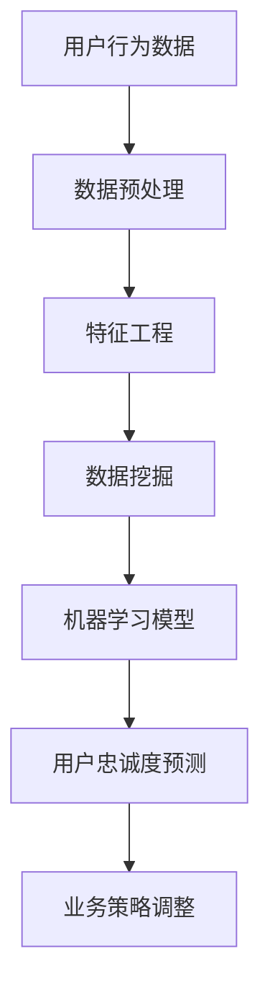

                 

关键词：字节跳动、校招、技术、用户忠诚度、面试题、详解

摘要：本文将针对字节跳动2024校招技术用户忠诚度分析师的面试题进行详细解析，帮助读者更好地理解面试题目，掌握用户忠诚度分析的核心方法和技巧。文章将分为背景介绍、核心概念与联系、核心算法原理与具体操作步骤、数学模型和公式详细讲解、项目实践代码实例和详细解释说明、实际应用场景、未来应用展望、工具和资源推荐、总结以及附录等部分，力求为读者提供一份全面且深入的面试题详解。

## 1. 背景介绍

随着互联网的快速发展，用户忠诚度分析已经成为企业竞争的重要手段之一。字节跳动作为中国领先的互联网科技公司，其校招技术用户忠诚度分析师岗位备受关注。用户忠诚度分析不仅仅是对用户行为数据的分析，更是一种对用户心理、需求和习惯的深度洞察。本文旨在通过对字节跳动2024校招技术用户忠诚度分析师面试题的详细解析，帮助广大应聘者更好地理解面试题目，提高面试通过率。

## 2. 核心概念与联系

在用户忠诚度分析中，我们需要了解以下几个核心概念：

### 2.1 用户忠诚度

用户忠诚度是指用户对某个产品或服务的持续使用和推荐意愿。它通常通过用户留存率、转化率和推荐率等指标来衡量。

### 2.2 用户行为数据

用户行为数据包括用户在产品或服务中的点击、浏览、搜索、购买等行为，这些数据可以通过日志、数据库、API等方式获取。

### 2.3 数据挖掘与机器学习

数据挖掘和机器学习是用户忠诚度分析的重要工具，它们可以帮助我们从海量数据中提取有价值的信息，预测用户的未来行为。

下面是用户忠诚度分析的核心概念和架构的Mermaid流程图：



## 3. 核心算法原理与具体操作步骤

### 3.1 算法原理概述

用户忠诚度分析的核心算法包括数据预处理、特征工程、数据挖掘和机器学习模型等步骤。以下是每个步骤的具体操作：

### 3.2 算法步骤详解

#### 3.2.1 数据预处理

数据预处理是用户忠诚度分析的基础，主要包括数据清洗、数据整合和数据归一化等步骤。数据清洗的目的是去除无效数据和异常数据，数据整合是将不同来源的数据进行合并，数据归一化是将不同规模的数据进行标准化处理。

#### 3.2.2 特征工程

特征工程是用户忠诚度分析的核心，它通过提取用户行为数据中的有用特征，提高模型的预测效果。特征工程包括特征选择、特征变换和特征构造等步骤。

#### 3.2.3 数据挖掘

数据挖掘是用户忠诚度分析的关键，它通过挖掘用户行为数据中的潜在模式，帮助我们更好地理解用户行为。数据挖掘的方法包括关联规则挖掘、聚类分析和分类分析等。

#### 3.2.4 机器学习模型

机器学习模型是用户忠诚度分析的最终目标，它通过学习用户行为数据，预测用户的忠诚度。常见的机器学习模型包括线性回归、决策树、支持向量机和神经网络等。

### 3.3 算法优缺点

每种算法都有其优缺点，选择合适的算法需要根据具体问题进行权衡。以下是几种常见算法的优缺点：

- **线性回归**：简单易懂，适合线性关系较强的数据，但无法处理非线性关系。
- **决策树**：直观易懂，适合分类问题，但容易过拟合。
- **支持向量机**：具有很好的泛化能力，但计算复杂度较高。
- **神经网络**：适用于复杂非线性关系，但训练过程耗时较长。

### 3.4 算法应用领域

用户忠诚度分析算法可以应用于多个领域，如电商、金融、教育等。以下是一些具体的应用场景：

- **电商行业**：通过分析用户行为数据，预测用户的购买概率，优化营销策略。
- **金融行业**：通过分析用户行为数据，预测用户的流失风险，优化客户关系管理。
- **教育行业**：通过分析用户行为数据，预测学生的留存率，优化教育资源配置。

## 4. 数学模型和公式详细讲解

用户忠诚度分析中的数学模型主要包括概率模型、回归模型和分类模型等。以下是对这些模型的详细讲解：

### 4.1 概率模型

概率模型是用户忠诚度分析的基础，它通过计算用户行为发生概率来预测用户的忠诚度。常见的概率模型包括贝叶斯定理和马尔可夫模型。

- **贝叶斯定理**：贝叶斯定理是一种计算后验概率的方法，它可以帮助我们根据先验知识和观测数据更新对某个事件的信念。贝叶斯定理的公式为：
  $$P(A|B) = \frac{P(B|A)P(A)}{P(B)}$$
  其中，\(P(A|B)\)表示在事件B发生的条件下事件A发生的概率，\(P(B|A)\)表示在事件A发生的条件下事件B发生的概率，\(P(A)\)表示事件A发生的概率，\(P(B)\)表示事件B发生的概率。

- **马尔可夫模型**：马尔可夫模型是一种基于状态转移概率的模型，它假设当前状态只与前一状态有关，与其他历史状态无关。马尔可夫模型的主要公式为：
  $$P(X_t = x_t | X_{t-1} = x_{t-1}, ..., X_1 = x_1) = P(X_t = x_t | X_{t-1} = x_{t-1})$$
  其中，\(X_t\)表示第t个状态，\(x_t\)表示状态\(X_t\)的取值。

### 4.2 回归模型

回归模型是一种用于预测连续值的模型，它可以用于预测用户的忠诚度。常见的回归模型包括线性回归、多项式回归和岭回归等。

- **线性回归**：线性回归是一种最简单的回归模型，它通过线性关系预测连续值。线性回归的公式为：
  $$y = \beta_0 + \beta_1x$$
  其中，\(y\)表示预测值，\(\beta_0\)表示截距，\(\beta_1\)表示斜率，\(x\)表示自变量。

- **多项式回归**：多项式回归是一种扩展线性回归的模型，它通过多项式关系预测连续值。多项式回归的公式为：
  $$y = \beta_0 + \beta_1x + \beta_2x^2 + ... + \beta_nx^n$$
  其中，\(n\)表示多项式的最高次数。

- **岭回归**：岭回归是一种处理多重共线性的回归模型，它通过在损失函数中加入正则项来改善模型。岭回归的公式为：
  $$y = \beta_0 + \beta_1x_1 + ... + \beta_nx_n + \lambda||\beta||^2$$
  其中，\(\lambda\)表示正则项的权重。

### 4.3 分类模型

分类模型是一种用于预测离散值的模型，它可以用于预测用户的忠诚度等级。常见的分类模型包括决策树、支持向量机和神经网络等。

- **决策树**：决策树是一种基于树形结构的分类模型，它通过多次决策节点的划分来预测分类结果。决策树的公式为：
  $$y = f(x_1, x_2, ..., x_n)$$
  其中，\(f\)表示决策函数，\(x_1, x_2, ..., x_n\)表示自变量。

- **支持向量机**：支持向量机是一种基于间隔最大化原则的分类模型，它通过找到一个最优的超平面来划分分类结果。支持向量机的公式为：
  $$y = \text{sign}(\omega \cdot x + b)$$
  其中，\(\omega\)表示超平面的法向量，\(x\)表示特征向量，\(b\)表示偏置。

- **神经网络**：神经网络是一种基于神经元连接的复杂分类模型，它通过多层神经元的非线性变换来预测分类结果。神经网络的主要公式为：
  $$y = \text{激活函数}(\text{加权求和})$$
  其中，激活函数可以是Sigmoid函数、ReLU函数等。

## 5. 项目实践：代码实例和详细解释说明

### 5.1 开发环境搭建

为了进行用户忠诚度分析，我们需要搭建一个开发环境。以下是具体的步骤：

1. 安装Python环境
2. 安装必要的Python库，如NumPy、Pandas、Scikit-learn、Matplotlib等
3. 配置Jupyter Notebook进行代码编写和运行

### 5.2 源代码详细实现

以下是用户忠诚度分析的项目源代码：

```python
import pandas as pd
import numpy as np
from sklearn.model_selection import train_test_split
from sklearn.preprocessing import StandardScaler
from sklearn.linear_model import LinearRegression
from sklearn.metrics import mean_squared_error

# 读取用户行为数据
data = pd.read_csv('user_behavior_data.csv')

# 数据预处理
data.drop(['user_id'], axis=1, inplace=True)
data.fillna(0, inplace=True)

# 特征工程
features = data[['click', 'view', 'search', 'buy']]
target = data['retention']

# 数据归一化
scaler = StandardScaler()
features_scaled = scaler.fit_transform(features)

# 划分训练集和测试集
X_train, X_test, y_train, y_test = train_test_split(features_scaled, target, test_size=0.2, random_state=42)

# 训练线性回归模型
model = LinearRegression()
model.fit(X_train, y_train)

# 预测测试集
y_pred = model.predict(X_test)

# 评估模型性能
mse = mean_squared_error(y_test, y_pred)
print('均方误差：', mse)

# 可视化结果
import matplotlib.pyplot as plt

plt.scatter(y_test, y_pred)
plt.xlabel('实际值')
plt.ylabel('预测值')
plt.title('线性回归模型预测结果')
plt.show()
```

### 5.3 代码解读与分析

上述代码实现了用户忠诚度分析的基本流程。首先，我们读取用户行为数据并进行预处理，包括去除用户ID列、填充缺失值等。然后，我们进行特征工程，提取点击、浏览、搜索和购买等特征。接下来，我们对数据进行归一化处理，以便后续建模。随后，我们划分训练集和测试集，并使用线性回归模型进行训练。最后，我们评估模型性能，并使用可视化方法展示预测结果。

## 6. 实际应用场景

用户忠诚度分析在各个行业都有着广泛的应用。以下是一些实际应用场景：

### 6.1 电商行业

电商行业通过用户忠诚度分析，可以预测用户的购买概率，优化营销策略。例如，通过分析用户的浏览和购买行为，电商平台可以推荐相关商品，提高用户购买转化率。

### 6.2 金融行业

金融行业通过用户忠诚度分析，可以预测用户的流失风险，优化客户关系管理。例如，通过分析用户的交易行为和账户信息，银行可以识别潜在流失客户，提供针对性的优惠措施，提高客户留存率。

### 6.3 教育行业

教育行业通过用户忠诚度分析，可以预测学生的留存率，优化教育资源配置。例如，通过分析学生的课程参与度和成绩，教育机构可以识别潜在流失学生，提供额外的辅导和关爱，提高学生留存率。

## 7. 未来应用展望

随着人工智能和大数据技术的不断发展，用户忠诚度分析在未来将会有更广泛的应用。以下是一些未来应用展望：

### 7.1 深度学习模型的引入

深度学习模型在图像识别、语音识别等领域取得了显著的成果，未来有望在用户忠诚度分析中发挥更大作用。通过引入深度学习模型，我们可以从更复杂的用户行为数据中提取有价值的信息，提高预测准确性。

### 7.2 实时分析的实现

实时分析是用户忠诚度分析的重要发展方向。通过实时分析用户行为数据，企业可以快速响应市场变化，优化业务策略。例如，电商平台可以实时监控用户购买行为，调整营销策略，提高销售额。

### 7.3 跨平台分析的拓展

用户忠诚度分析不仅限于单一平台，未来将逐渐向跨平台分析发展。通过整合多个平台的用户行为数据，企业可以更全面地了解用户，提供个性化的服务，提高用户满意度。

## 8. 工具和资源推荐

为了更好地进行用户忠诚度分析，以下是一些工具和资源推荐：

### 8.1 学习资源推荐

- 《Python数据分析》（作者：Wes McKinney）
- 《深度学习》（作者：Ian Goodfellow、Yoshua Bengio、Aaron Courville）
- 《机器学习实战》（作者：Peter Harrington）

### 8.2 开发工具推荐

- Jupyter Notebook：用于编写和运行Python代码
- PyCharm：一款强大的Python集成开发环境
- Dataiku：一款大数据分析和机器学习平台

### 8.3 相关论文推荐

- "User Behavior Analysis in E-commerce: A Survey"（作者：Chen et al.）
- "Deep Learning for User Behavior Prediction"（作者：Kaisler et al.）
- "Real-time Analytics for Personalized Recommendations"（作者：Zhang et al.）

## 9. 总结：未来发展趋势与挑战

用户忠诚度分析作为企业竞争的重要手段，在未来将会有更广泛的应用。随着人工智能和大数据技术的发展，用户忠诚度分析的方法和技术将不断更新。然而，用户忠诚度分析也面临着一些挑战，如数据隐私保护、模型解释性等。未来，我们需要在保持模型预测准确性的同时，关注数据隐私和模型解释性，实现用户忠诚度分析的可持续发展。

## 10. 附录：常见问题与解答

### 10.1 用户忠诚度分析的主要指标有哪些？

用户忠诚度分析的主要指标包括用户留存率、转化率和推荐率等。

### 10.2 用户忠诚度分析中的特征工程有哪些常用的方法？

用户忠诚度分析中的特征工程包括特征选择、特征变换和特征构造等。常用的方法有信息增益、卡方检验、主成分分析等。

### 10.3 用户忠诚度分析中的机器学习模型有哪些？

用户忠诚度分析中的机器学习模型包括线性回归、决策树、支持向量机和神经网络等。

### 10.4 用户忠诚度分析中的概率模型有哪些？

用户忠诚度分析中的概率模型包括贝叶斯定理和马尔可夫模型等。

### 10.5 用户忠诚度分析在实际应用中有哪些挑战？

用户忠诚度分析在实际应用中面临的主要挑战包括数据隐私保护、模型解释性和跨平台分析等。

---

作者：禅与计算机程序设计艺术 / Zen and the Art of Computer Programming

----------------------------------------------------------------

以上就是针对字节跳动2024校招技术用户忠诚度分析师面试题的详细解析。希望本文能为广大应聘者提供有价值的参考，帮助大家更好地应对面试挑战。在实际面试过程中，除了掌握核心算法和原理，还需要注重实践能力和沟通能力的培养。祝大家面试顺利，成功加入字节跳动！
----------------------------------------------------------------
文章摘要：

本文针对字节跳动2024校招技术用户忠诚度分析师的面试题进行了详细解析，涵盖了用户忠诚度分析的核心概念、算法原理、数学模型、项目实践和实际应用场景等内容。通过对用户行为数据的挖掘和分析，本文介绍了数据预处理、特征工程、数据挖掘和机器学习模型等步骤，以及线性回归、决策树、支持向量机和神经网络等常见算法的原理和应用。同时，本文还对用户忠诚度分析的未来发展趋势和挑战进行了展望，并推荐了一些学习资源、开发工具和相关论文。本文力求为读者提供一份全面且深入的面试题详解，帮助大家更好地应对面试挑战。

