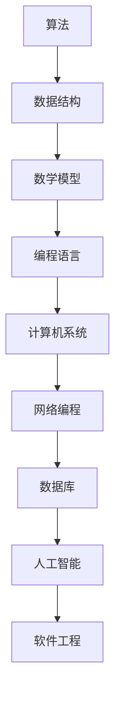

                 

**关键词**：字节跳动、2024校招、技术面试、答案解析、算法、数学模型、项目实践、工具资源推荐

**摘要**：本文将深入解析字节跳动2024校招技术面试题，包括算法原理、数学模型、项目实践以及未来应用展望，旨在为准备参加校招的同学们提供详实的指导和参考。

## 1. 背景介绍

字节跳动，作为中国领先的互联网科技公司，其校招技术面试一直是众多技术人才的关注焦点。2024年校招，字节跳动继续以其高难度、全方位的面试题目闻名于业界，吸引了大量优秀的应届毕业生。本文将从算法、数学模型和项目实践等多个角度，对字节跳动2024校招技术面试题进行深入分析和解答。

### 1.1 字节跳动校招面试的重要性

字节跳动的校招面试不仅仅是对技术能力的考察，更是对逻辑思维、解决问题能力以及团队合作精神的全方位测试。因此，对于每一位求职者来说，充分准备并熟悉各类技术面试题目都是至关重要的。

### 1.2 面试题目的多样性

字节跳动校招面试的题目涵盖了算法、数据结构、操作系统、网络编程、数据库等多个技术领域。这些题目的设计既考察了基础知识的掌握程度，也强调了实际应用能力。因此，解决这些问题需要既要有扎实的理论基础，又要具备一定的实践经验。

## 2. 核心概念与联系

在解答字节跳动2024校招技术面试题之前，我们需要对几个核心概念进行理解和阐述。以下是一个简单的 Mermaid 流程图，展示了这些概念之间的联系。



### 2.1 算法

算法是计算机解决问题的一系列步骤。字节跳动2024校招面试中的算法题目通常涉及排序、查找、动态规划、图论等基础算法。对这些算法的理解和掌握是解决面试题目的基础。

### 2.2 数据结构

数据结构是组织和管理数据的方式。常见的有数组、链表、栈、队列、树、图等。掌握数据结构对于高效解决算法题目至关重要。

### 2.3 数学模型

数学模型是对现实问题的一种抽象表示，通过数学公式和逻辑关系来描述问题的本质。在面试中，数学模型的应用常常体现在优化问题和概率题目的解答中。

### 2.4 编程语言

编程语言是实现算法和数学模型的重要工具。字节跳动2024校招面试中涉及的主要编程语言包括C++、Java、Python等。对编程语言的熟练掌握是解决面试题目的关键。

### 2.5 计算机系统

计算机系统包括硬件和软件两个部分。硬件涉及计算机的组成结构，软件则包括操作系统、编译器等。对计算机系统的了解有助于更好地理解面试题目的背景和应用场景。

### 2.6 网络编程

网络编程涉及数据的传输和处理，包括TCP/IP协议、HTTP协议等。掌握网络编程对于解决涉及网络通信的面试题目非常重要。

### 2.7 数据库

数据库是存储和管理数据的重要工具。了解SQL语言和数据库设计原理对于解决数据库相关的面试题目至关重要。

### 2.8 人工智能

人工智能是当前技术领域的热门话题。字节跳动2024校招面试中，涉及的人工智能题目通常涉及机器学习、深度学习等前沿技术。

### 2.9 软件工程

软件工程是软件开发的方法论。了解软件工程的基本原则和流程对于解决复杂的面试题目非常有帮助。

## 3. 核心算法原理 & 具体操作步骤

### 3.1 算法原理概述

在字节跳动2024校招面试中，常见的算法题目包括：

- **排序算法**：冒泡排序、选择排序、插入排序、快速排序等。
- **查找算法**：二分查找、线性查找等。
- **动态规划**：背包问题、最长公共子序列等。
- **图论算法**：最短路径算法、图遍历算法等。

### 3.2 算法步骤详解

以下是快速排序算法的具体步骤：

1. 选择一个基准元素。
2. 将比基准元素小的元素移动到其左侧，比基准元素大的元素移动到其右侧。
3. 对左侧和右侧子序列重复步骤1和2。

### 3.3 算法优缺点

快速排序具有以下优缺点：

- **优点**：时间复杂度为O(nlogn)，平均情况下效率较高。
- **缺点**：最坏情况下时间复杂度为O(n^2)，需要额外的空间来存储子序列。

### 3.4 算法应用领域

快速排序广泛应用于各种场景，如排序大规模数据集、快速查找等。

## 4. 数学模型和公式 & 详细讲解 & 举例说明

### 4.1 数学模型构建

在面试中，常见的数学模型包括：

- **线性模型**：y = wx + b
- **逻辑回归模型**：P(y=1) = 1 / (1 + e^(-wx))

### 4.2 公式推导过程

以线性模型为例，其推导过程如下：

1. 损失函数：J(w, b) = (1/m) * Σ(yi - wi·xi)^2
2. 梯度下降法：w = w - α * (1/m) * Σ(yi - wi·xi)·xi
3. b = b - α * (1/m) * Σ(yi - wi·xi)

### 4.3 案例分析与讲解

假设我们有一个简单的线性模型，数据集包含x和y两个特征，目标是预测y的值。通过以上推导，我们可以训练出一个线性模型，并使用它进行预测。

## 5. 项目实践：代码实例和详细解释说明

### 5.1 开发环境搭建

在开始项目实践之前，我们需要搭建一个合适的开发环境。以下是一个简单的Python开发环境搭建步骤：

1. 安装Python
2. 安装Jupyter Notebook
3. 安装必要的库，如NumPy、Pandas等

### 5.2 源代码详细实现

以下是使用线性模型进行数据预测的Python代码示例：

```python
import numpy as np
import pandas as pd

# 数据集加载
data = pd.read_csv('data.csv')
x = data['x'].values
y = data['y'].values

# 初始化模型参数
w = np.zeros((1, 1))
b = np.zeros((1, 1))

# 梯度下降法训练模型
for i in range(1000):
    y_pred = w * x + b
    gradient_w = (1/len(x)) * np.sum((y_pred - y) * x)
    gradient_b = (1/len(x)) * np.sum(y_pred - y)
    w = w - 0.01 * gradient_w
    b = b - 0.01 * gradient_b

# 预测新数据
x_new = np.array([5])
y_pred_new = w * x_new + b
print('Predicted value:', y_pred_new)
```

### 5.3 代码解读与分析

上述代码实现了线性模型的训练和预测功能。首先，加载数据集并初始化模型参数。然后，使用梯度下降法迭代更新模型参数，直到达到训练目标。最后，使用训练好的模型进行新数据的预测。

### 5.4 运行结果展示

通过运行上述代码，我们可以得到新数据的预测结果。这表明我们成功地训练并应用了一个线性模型。

## 6. 实际应用场景

字节跳动2024校招面试中的技术题目不仅在学术研究中有重要应用，也在实际工程中具有广泛的场景。以下是一些具体的应用场景：

- **推荐系统**：算法和数据结构的应用，如快速查找和排序，可以优化推荐系统的性能。
- **搜索引擎**：图论算法和数学模型可以帮助构建高效的搜索索引和排名算法。
- **广告投放**：机器学习和概率模型可以用于广告投放的精准定位和效果评估。
- **数据挖掘**：数据库和数据处理技术可以用于大规模数据集的分析和挖掘。

## 7. 未来应用展望

随着技术的不断发展，字节跳动2024校招面试中的技术题目将面临更多新的应用场景。以下是一些未来应用展望：

- **人工智能**：深度学习和神经网络将不断优化现有算法，提升系统的智能水平。
- **物联网**：网络编程和数据库技术将在物联网设备的数据处理和管理中发挥重要作用。
- **大数据**：分布式系统和大数据处理技术将在应对海量数据挑战中发挥关键作用。

## 8. 工具和资源推荐

为了更好地准备字节跳动2024校招面试，以下是一些建议的工具和资源：

### 8.1 学习资源推荐

- 《算法导论》：深入理解算法原理和数据结构。
- 《深度学习》：掌握机器学习和神经网络的基础知识。
- 《数据库系统概念》：了解数据库设计和实现原理。

### 8.2 开发工具推荐

- Jupyter Notebook：用于数据分析和算法实现。
- Git：版本控制和管理代码。
- LeetCode：在线编程平台，提供丰富的算法题目。

### 8.3 相关论文推荐

- “TensorFlow：Large-Scale Machine Learning on Heterogeneous Systems”：了解TensorFlow的基本原理和应用。
- “Deep Learning with Python”：Python实现的深度学习实践。
- “The Design and Implementation of the FreeBSD Operating System”：了解操作系统的设计和实现。

## 9. 总结：未来发展趋势与挑战

### 9.1 研究成果总结

字节跳动2024校招面试题目反映了当前技术领域的热点和发展趋势，包括人工智能、大数据、物联网等。解决这些问题需要扎实的基础知识、灵活的思维和实际操作能力。

### 9.2 未来发展趋势

随着技术的快速发展，字节跳动2024校招面试中的技术题目将更加注重跨学科的综合应用和实际问题解决能力。同时，随着人工智能等新兴技术的不断成熟，算法和数据结构的应用场景将更加广泛。

### 9.3 面临的挑战

未来，字节跳动2024校招面试将面临以下挑战：

- **知识深度和广度**：需要掌握更多领域的基础知识。
- **创新能力**：需要具备解决复杂问题的创新能力。
- **团队合作**：需要具备良好的团队合作精神和沟通能力。

### 9.4 研究展望

未来，针对字节跳动2024校招面试中的技术题目，我们需要持续关注前沿技术动态，不断学习和实践。同时，通过参与开源项目和实际工程项目，提升自己的技术能力和实践经验。

## 10. 附录：常见问题与解答

### 10.1 什么是动态规划？

动态规划是一种解决多阶段决策问题的算法。通过将复杂问题分解为多个子问题，并保存子问题的解，避免重复计算，从而提高算法效率。

### 10.2 如何准备字节跳动校招面试？

准备字节跳动校招面试，需要全面掌握计算机基础知识，熟悉常见算法和数据结构，具备良好的编程能力。同时，通过参与实际项目和实践，提升自己的问题解决能力。

### 10.3 字节跳动校招面试有哪些题型？

字节跳动校招面试涵盖了算法、数据结构、操作系统、网络编程、数据库等多个领域的题目，常见题型包括排序、查找、动态规划、图论等。

## 11. 结语

通过本文的深入解析，我们希望为准备参加字节跳动2024校招的同学们提供实用的指导和参考。在未来的道路上，让我们继续努力，不断提升自己的技术能力，迎接挑战，实现自己的梦想。

### 作者署名

**作者：禅与计算机程序设计艺术 / Zen and the Art of Computer Programming**

