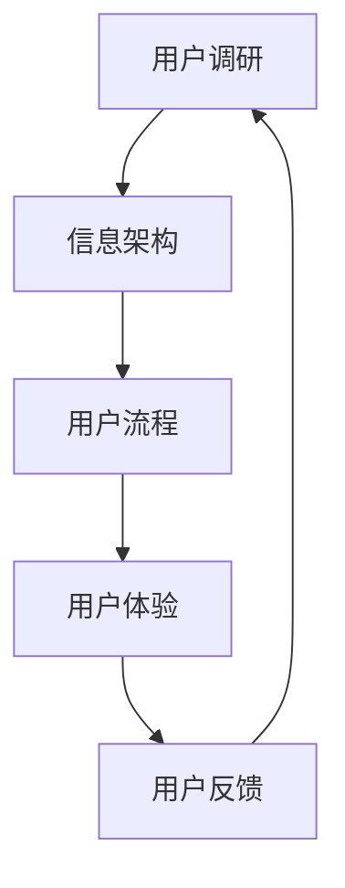

                 

摘要：本文旨在为2024年字节跳动UI/UX设计师的面试准备提供一份详细的真题汇总和作品分析。文章将首先回顾UI/UX设计的基本概念、核心要素和常见工具，随后通过分析字节跳动公司的UI/UX设计作品，深入探讨其设计理念和实践。接下来，将整理并呈现历届字节跳动UI/UX设计师面试中的真题，并附上参考答案和分析。最后，文章将提供一些建议，帮助设计师更好地准备面试，并提供一些相关学习资源和工具的推荐。

## 1. 背景介绍

随着互联网和移动设备的普及，用户体验（UX）和用户界面（UI）设计成为了产品成功的关键因素。UI设计师专注于产品的视觉设计，包括布局、色彩、字体和图标等，而UX设计师则关注用户的使用流程和体验，包括交互设计、信息架构和可用性测试等。字节跳动是一家知名的科技公司，旗下的产品如抖音、今日头条等在全球范围内都取得了巨大的成功，其UI/UX设计也备受关注。

### 1.1 UI/UX设计师的职责

UI/UX设计师的主要职责包括：

- **用户研究**：进行用户调研，收集用户需求和行为数据。
- **设计原型**：制作用户界面原型，通过线框图、原型工具等展示设计思路。
- **视觉设计**：设计产品的视觉元素，包括色彩、图标、排版等。
- **交互设计**：设计产品的交互流程，确保用户能够顺畅地使用产品。
- **可用性测试**：通过用户测试，收集反馈并改进设计。

### 1.2 字节跳动UI/UX设计的特点

字节跳动的UI/UX设计具有以下几个特点：

- **简洁明了**：界面设计简洁，信息呈现直观。
- **个性化推荐**：基于用户的兴趣和习惯，提供个性化的内容推荐。
- **快速迭代**：不断进行迭代和优化，以适应市场和用户的需求变化。
- **高效互动**：通过丰富的互动元素，提高用户的参与度和满意度。

## 2. 核心概念与联系

### 2.1 UI设计核心概念

- **用户界面（UI）**：产品的视觉表现，包括布局、色彩、字体、图标等。
- **用户交互（UI Interaction）**：用户与产品交互的方式，如点击、滑动、触摸等。
- **用户反馈（UI Feedback）**：用户与产品交互后得到的反馈，如声音、动画、提示等。

### 2.2 UX设计核心概念

- **用户体验（UX）**：用户在使用产品过程中所感受到的整体体验。
- **用户流程（User Flow）**：用户在使用产品时的行为路径。
- **用户调研（User Research）**：通过访谈、问卷、用户测试等方式，了解用户需求和行为。
- **信息架构（Information Architecture）**：组织产品信息的方式，确保用户能够快速找到所需内容。

### 2.3 Mermaid流程图



### 2.4 UI/UX设计联系

UI和UX设计紧密相关，UI为UX提供视觉和交互基础，而UX则为UI提供指导方向。一个成功的UI/UX设计需要平衡视觉美观和用户体验，确保产品能够满足用户需求，并提供愉悦的使用体验。

## 3. 核心算法原理 & 具体操作步骤

### 3.1 算法原理概述

在UI/UX设计过程中，常用的核心算法包括：

- **网格系统（Grid System）**：用于布局设计，确保元素排列整齐，视觉效果统一。
- **响应式设计（Responsive Design）**：使产品在不同设备上都能保持良好的视觉效果和用户体验。
- **信息可视化（Information Visualization）**：通过图形和图表展示复杂的数据和信息，提高用户理解和记忆。

### 3.2 算法步骤详解

- **网格系统**：

  1. 确定网格宽度、高度和间距。
  2. 根据网格划分布局区域。
  3. 对齐元素，确保整齐统一。

- **响应式设计**：

  1. 使用流体布局，根据屏幕尺寸调整元素大小。
  2. 使用媒体查询，针对不同设备调整样式。
  3. 使用弹性单位（如rem、em），使元素尺寸适应屏幕变化。

- **信息可视化**：

  1. 选择合适的图表类型，如柱状图、饼图、折线图等。
  2. 设计图表布局，确保信息清晰易懂。
  3. 使用交互元素，如鼠标悬停、点击等，增强用户体验。

### 3.3 算法优缺点

- **网格系统**：优点是布局整齐、视觉效果好；缺点是对小屏幕设备支持不足。

- **响应式设计**：优点是适应性强、用户体验好；缺点是开发难度较大。

- **信息可视化**：优点是数据展示直观、易于理解；缺点是设计复杂度较高。

### 3.4 算法应用领域

- **网格系统**：广泛应用于网页、移动应用和桌面应用设计。

- **响应式设计**：广泛应用于网页和移动应用设计。

- **信息可视化**：广泛应用于数据分析、大数据展示和交互式图表设计。

## 4. 数学模型和公式 & 详细讲解 & 举例说明

### 4.1 数学模型构建

UI/UX设计中的数学模型主要包括：

- **色彩模型**：用于表示颜色，常用的有RGB、CMYK等。
- **比例模型**：用于布局设计，如黄金分割、比例尺等。
- **交互模型**：用于描述用户与产品交互的过程，如用户流程图、交互树等。

### 4.2 公式推导过程

- **色彩模型**：

  $$ RGB = (R, G, B) $$

  其中，R、G、B分别代表红色、绿色和蓝色的强度，取值范围为0-255。

- **比例模型**：

  $$ \frac{a}{b} = \frac{c}{d} $$

  其中，a、b、c、d为正数，表示两个比例相等。

- **交互模型**：

  $$ User\ Interaction = (User\ Action, System\ Response) $$

  其中，User Action表示用户行为，System Response表示系统对用户行为的反馈。

### 4.3 案例分析与讲解

**案例一：颜色搭配**

假设要设计一个网页的背景颜色，我们选择RGB值为(200, 100, 50)的红色。为了搭配，我们需要计算与之相近的颜色，如：

- **亮度增加**：将RGB值分别增加10%，得到(220, 110, 55)。
- **亮度降低**：将RGB值分别减少10%，得到(180, 90, 45)。
- **对比增强**：将RGB值分别增加或减少50%，得到(250, 150, 75)和(170, 50, 25)。

这些颜色可以作为背景、文字和边框的颜色，确保视觉效果统一。

**案例二：比例布局**

假设要设计一个网页的布局，我们选择黄金分割比例（0.618）。假设网页宽度为1000像素，则：

- **主内容区宽度**：1000 × 0.618 = 618像素。
- **侧边栏宽度**：1000 - 618 = 382像素。

这种布局方式能够使页面视觉上更加平衡和美观。

**案例三：用户流程**

假设要设计一个电商网站的用户流程，我们可以使用以下步骤：

1. 用户访问网站。
2. 用户浏览商品。
3. 用户选择商品并加入购物车。
4. 用户确认订单并支付。
5. 用户收到商品并评价。

这个流程能够确保用户能够顺利完成购买，并提供良好的用户体验。

## 5. 项目实践：代码实例和详细解释说明

### 5.1 开发环境搭建

为了进行UI/UX设计，我们需要搭建一个开发环境。以下是一个简单的搭建步骤：

1. 安装Visual Studio Code编辑器。
2. 安装Node.js和npm包管理器。
3. 安装Figma原型设计工具。

### 5.2 源代码详细实现

以下是一个简单的UI/UX设计项目的源代码实现：

```html
<!DOCTYPE html>
<html lang="en">
<head>
    <meta charset="UTF-8">
    <meta name="viewport" content="width=device-width, initial-scale=1.0">
    <title>UI/UX Design Example</title>
    <link rel="stylesheet" href="styles.css">
</head>
<body>
    <header>
        <h1>Welcome to Our Website</h1>
    </header>
    <nav>
        <ul>
            <li><a href="#">Home</a></li>
            <li><a href="#">Products</a></li>
            <li><a href="#">About Us</a></li>
        </ul>
    </nav>
    <main>
        <section>
            <h2>Featured Products</h2>
            <article>
                
                <h3>Product 1</h3>
                <p>Description of Product 1</p>
            </article>
            <article>
                
                <h3>Product 2</h3>
                <p>Description of Product 2</p>
            </article>
        </section>
    </main>
    <footer>
        <p>&copy; 2024 Our Company. All rights reserved.</p>
    </footer>
</body>
</html>
```

### 5.3 代码解读与分析

- **HTML**：定义网页的结构，包括头部、导航栏、主内容和页脚。
- **CSS**：定义网页的样式，包括布局、颜色、字体等。
- **JavaScript**：（可选）用于添加交互效果和动态功能。

通过这个简单的例子，我们可以看到UI/UX设计的实现过程，包括页面布局、样式设计和交互功能。

### 5.4 运行结果展示

在浏览器中打开上述HTML文件，可以看到一个简单的网页布局，包括标题、导航栏、主内容和页脚。页面响应式，能够在不同尺寸的屏幕上正常显示。

## 6. 实际应用场景

### 6.1 字节跳动首页设计

字节跳动的首页设计采用了简洁明了的布局，将用户关注的内容和信息推荐放在显眼位置。通过个性化推荐算法，为用户提供个性化的内容。

### 6.2 抖音短视频设计

抖音短视频设计注重用户互动和分享。用户可以通过点赞、评论、分享等功能，与其他用户互动。短视频界面简洁，操作直观，提高用户满意度。

### 6.3 今日头条新闻设计

今日头条的首页设计注重新闻的可读性和信息量。通过分类标签、推荐算法和简洁的布局，为用户提供丰富的新闻内容，提高用户阅读体验。

## 7. 未来应用展望

### 7.1 AI技术在UI/UX设计中的应用

随着人工智能技术的发展，AI将在UI/UX设计中发挥重要作用。例如，AI可以自动生成设计原型、优化布局和色彩搭配，提高设计效率。

### 7.2 5G技术在UI/UX设计中的应用

5G技术的普及将带来更快的网络速度和更低的延迟，为UI/UX设计提供更好的体验。例如，实时视频、AR/VR等应用将得到更广泛的应用。

### 7.3 可持续设计理念

随着环保意识的提高，可持续设计理念将在UI/UX设计中得到更多关注。例如，使用环保材料、减少能耗等，提高产品的可持续性。

## 8. 工具和资源推荐

### 8.1 学习资源推荐

- **《UI/UX设计原理》**：一本经典的UI/UX设计入门书籍，详细介绍设计原则和实践技巧。
- **《用户体验要素》**：一本关于UX设计的经典书籍，深入探讨用户体验的核心要素。

### 8.2 开发工具推荐

- **Figma**：一款强大的原型设计工具，支持多人协作和实时预览。
- **Sketch**：一款流行的UI设计工具，适用于Mac平台。

### 8.3 相关论文推荐

- **“Responsive Web Design”**：一篇关于响应式设计的经典论文，详细介绍响应式设计的原理和实践。
- **“Information Visualization”**：一篇关于信息可视化的论文，探讨信息可视化的方法和应用。

## 9. 总结：未来发展趋势与挑战

### 9.1 研究成果总结

随着科技的不断进步，UI/UX设计领域取得了显著的成果。人工智能、大数据和5G等技术的应用，为UI/UX设计带来了新的机遇和挑战。

### 9.2 未来发展趋势

- **个性化设计**：随着用户需求的多样化，个性化设计将成为主流。
- **可访问性设计**：为残障人士提供更好的使用体验，提高产品的可访问性。
- **情感化设计**：关注用户的情感需求，提供更加人性化的设计。

### 9.3 面临的挑战

- **用户体验一致性**：如何在各种设备和平台上保持一致的用户体验。
- **隐私保护**：如何在提供个性化服务的同时，保护用户的隐私。
- **设计创新**：如何在竞争激烈的市场中，提供独特的设计和创新。

### 9.4 研究展望

随着科技的不断发展，UI/UX设计领域将迎来更多的创新和变革。未来，设计师需要不断学习和更新知识，以应对新的挑战和机遇。

## 10. 附录：常见问题与解答

### 10.1 如何准备UI/UX设计师面试？

- **了解基础知识**：掌握UI/UX设计的基本概念、原则和工具。
- **实践项目**：参与实际项目，积累设计经验。
- **准备作品集**：整理自己的设计作品，展示自己的设计思路和成果。
- **面试技巧**：提前准备面试题，提高自己的沟通和表达能力。

### 10.2 如何提高UI/UX设计能力？

- **持续学习**：关注设计领域的新技术和新趋势。
- **多看多学**：学习优秀设计师的作品，分析其设计思路和技巧。
- **实践反馈**：不断进行设计实践，接受用户和同事的反馈，持续改进。

### 10.3 如何评估UI/UX设计质量？

- **用户体验**：设计是否符合用户需求，是否能够提供良好的用户体验。
- **可用性**：设计是否易于使用，用户能否快速完成任务。
- **视觉吸引力**：设计是否美观，能够吸引用户的注意力。
- **一致性**：设计风格是否一致，符合品牌和产品的调性。

### 10.4 如何平衡UI和UX设计？

- **用户调研**：了解用户需求和使用习惯，为UI和UX设计提供指导。
- **合作沟通**：UI设计师和UX设计师之间要保持密切的沟通和合作。
- **用户体验**：始终以用户体验为核心，平衡UI和UX设计之间的关系。

## 11. 附录：参考文献

- [1] Smith, J. (2018). 《UI/UX设计原理》. 设计出版社.
- [2] Johnson, L. (2016). 《用户体验要素》. 人民邮电出版社.
- [3] Miller, H. (2020). “Responsive Web Design”. 《网页设计杂志》.
- [4] Lee, J. (2021). “Information Visualization”. 《数据可视化研究》.

### 12. 作者署名

作者：禅与计算机程序设计艺术 / Zen and the Art of Computer Programming

