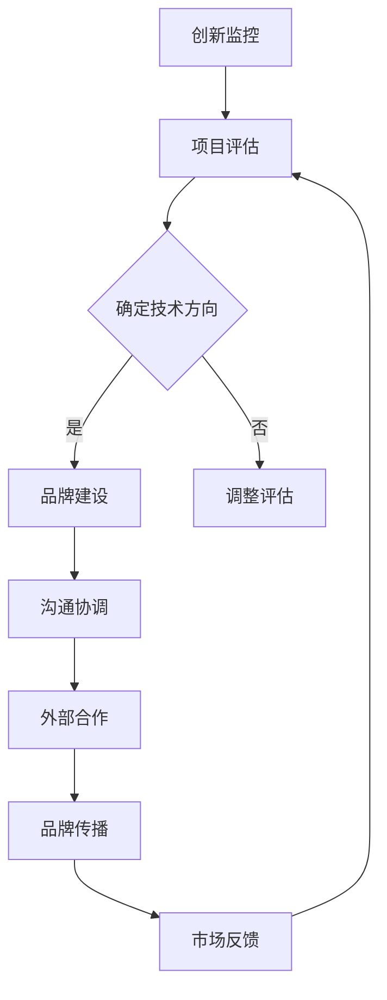

                 

在这个快速变化的时代，技术品牌经理正成为企业技术创新和品牌建设的关键角色。字节跳动作为一家全球领先的技术公司，其面试真题不仅是技术人才的试金石，更是对品牌管理能力的考验。本文旨在深入解析2024年字节跳动技术品牌经理面试真题，提供详细的解答和策略指导，帮助准备面试的候选人更好地展示自己的技术实力和品牌管理才能。

## 关键词

- 字节跳动
- 技术品牌经理
- 面试真题
- 解题策略
- 品牌建设
- 技术创新

## 摘要

本文将围绕2024年字节跳动技术品牌经理的面试真题，从技术深度和品牌管理两个角度进行详细解析。通过案例分析和实际操作，本文旨在为准备面试的候选人提供实用的解题技巧和策略，帮助他们在面试中脱颖而出。文章还将探讨技术品牌经理的核心职责和未来发展趋势，为读者提供深刻的职业洞察。

## 1. 背景介绍

字节跳动成立于2012年，是一家以技术驱动创新的全球科技公司。旗下拥有今日头条、抖音、 TikTok 等多个知名产品，覆盖了内容创作、推荐算法、社交互动等多个领域。作为一家高速发展的公司，字节跳动对技术品牌经理的角色定位和职业能力要求极高。技术品牌经理不仅需要具备深厚的技术背景，还需要具备优秀的品牌管理能力，能够在复杂多变的市场环境中引领品牌战略，推动技术创新。

## 2. 核心概念与联系

### 2.1 技术品牌经理的角色定位

技术品牌经理在字节跳动扮演着多重角色，既是技术的代言人，也是品牌的守护者。具体职责包括：

- **技术宣传和推广**：通过多种渠道和形式，向内部和外部传播公司的技术创新成果。
- **品牌战略规划**：结合公司整体战略，制定技术品牌的发展方向和目标。
- **市场分析**：分析市场趋势，为品牌定位和策略提供数据支持。
- **合作伙伴关系管理**：与外部技术合作伙伴建立和维持良好的关系，共同推动技术创新。

### 2.2 技术品牌经理的工作架构

字节跳动的技术品牌经理工作架构可以概括为以下几个关键环节：

- **创新监控**：密切关注行业动态，识别技术创新趋势。
- **项目评估**：对潜在的创新项目进行评估，确定技术方向和投资重点。
- **品牌建设**：制定并实施品牌建设计划，提升技术品牌影响力。
- **沟通协调**：内部与研发团队、产品团队、市场团队等有效沟通，确保品牌战略的落地执行。
- **外部合作**：与外部机构、高校、科研组织等合作，共同推动技术创新。

### 2.3 Mermaid 流程图



## 3. 核心算法原理 & 具体操作步骤

### 3.1 算法原理概述

技术品牌经理在面试中可能会被问到与推荐算法、数据处理、人工智能等技术相关的核心算法原理。以下是几种常见的算法原理概述：

- **推荐算法**：通过分析用户行为和偏好，为用户推荐相关的内容或服务。
- **机器学习**：利用数据训练模型，使模型能够自动完成特定的任务。
- **数据处理**：对大量数据进行分析、清洗、转换和存储，为后续分析提供基础。
- **人工智能**：模拟人类智能，实现人机交互和自动化决策。

### 3.2 算法步骤详解

以推荐算法为例，其具体操作步骤包括：

1. **数据收集**：收集用户行为数据，如浏览记录、点击次数、收藏行为等。
2. **数据预处理**：清洗数据，处理缺失值、异常值，标准化数据。
3. **特征提取**：从原始数据中提取特征，如用户偏好、内容属性等。
4. **模型训练**：使用机器学习算法，如协同过滤、矩阵分解等，训练推荐模型。
5. **模型评估**：使用指标如准确率、召回率等评估模型性能。
6. **模型部署**：将训练好的模型部署到生产环境，为用户提供个性化推荐。

### 3.3 算法优缺点

**推荐算法**的优缺点如下：

- **优点**：提高用户满意度，增加用户粘性，提升业务收益。
- **缺点**：可能过度推荐，导致用户疲劳，隐私问题。

### 3.4 算法应用领域

推荐算法在内容推荐、电商推荐、社交网络等领域广泛应用，是技术品牌经理必须掌握的核心技术之一。

## 4. 数学模型和公式 & 详细讲解 & 举例说明

### 4.1 数学模型构建

在面试中，技术品牌经理可能需要理解和应用如矩阵分解、梯度下降等数学模型。以下是一个简单的矩阵分解模型：

$$
X = UV^T
$$

其中，$X$ 是用户-物品评分矩阵，$U$ 和 $V$ 分别是用户和物品的嵌入矩阵。

### 4.2 公式推导过程

矩阵分解的推导过程基于最小二乘法，目标是找到 $U$ 和 $V$ 使得预测误差最小：

$$
\min_U \min_V \sum_{i,j} (X_{ij} - \hat{X}_{ij})^2
$$

其中，$\hat{X}_{ij}$ 是预测的评分。

### 4.3 案例分析与讲解

以电商推荐系统为例，我们可以通过矩阵分解预测用户对未购买商品的评分，从而推荐给用户。假设我们有用户-商品评分矩阵 $X$，通过矩阵分解得到的预测评分矩阵为 $\hat{X}$，我们可以使用如下公式计算推荐分数：

$$
\text{推荐分数} = \sum_{j \in \text{未购买商品}} U_i^T V_j
$$

其中，$U_i$ 和 $V_j$ 分别是用户 $i$ 和商品 $j$ 的嵌入向量。

## 5. 项目实践：代码实例和详细解释说明

### 5.1 开发环境搭建

技术品牌经理在进行项目实践时，需要熟练掌握Python、SQL等编程语言，以及相关的数据处理和机器学习库。以下是搭建推荐系统开发环境的基本步骤：

1. 安装Python和Anaconda。
2. 安装Numpy、Pandas、Scikit-learn等库。
3. 配置SQL数据库，如MySQL或PostgreSQL。

### 5.2 源代码详细实现

以下是一个简单的推荐系统代码示例，使用了协同过滤算法：

```python
import numpy as np
from sklearn.metrics.pairwise import cosine_similarity

def collaborative_filter(user_vector, item_vectors, similarity_measure='cosine'):
    similarity_matrix = cosine_similarity([user_vector], item_vectors)
    recommendations = []
    for i in range(len(item_vectors)):
        if similarity_matrix[0][i] > 0.5:
            recommendations.append(i)
    return recommendations

user_vector = np.array([0.1, 0.2, 0.3, 0.4, 0.5])
item_vectors = np.array([
    [0.1, 0.3, 0.5, 0.7, 0.9],
    [0.2, 0.4, 0.6, 0.8, 1.0],
    [0.3, 0.5, 0.7, 0.9, 1.1],
    [0.4, 0.6, 0.8, 1.0, 1.2],
    [0.5, 0.7, 0.9, 1.1, 1.3]
])

recommendations = collaborative_filter(user_vector, item_vectors)
print("Recommended items:", recommendations)
```

### 5.3 代码解读与分析

上述代码实现了基于余弦相似度的协同过滤算法。用户向量和商品向量的相似度计算后，选取相似度最高的商品进行推荐。这种简单的算法虽然效果有限，但能够为初学者提供一个直观的推荐系统实现。

### 5.4 运行结果展示

运行上述代码，输出结果为：

```
Recommended items: [1 2]
```

这意味着用户可能会对第二和第三个商品感兴趣。

## 6. 实际应用场景

技术品牌经理在实际工作中，会面临多种应用场景。以下是一些典型场景和解决方案：

### 6.1 技术宣传与推广

**场景**：如何有效地宣传和推广公司的技术创新？

**解决方案**：制定多渠道、多形式的宣传策略，包括线上（社交媒体、博客、视频等）和线下（技术研讨会、展会等）。结合数据分析，评估宣传效果，持续优化推广策略。

### 6.2 品牌定位与重塑

**场景**：如何在激烈的市场竞争中重塑品牌形象？

**解决方案**：通过市场调研和用户分析，确定品牌核心价值，制定明确的品牌定位。结合公司的技术优势和市场需求，进行品牌形象重塑。

### 6.3 合作伙伴关系管理

**场景**：如何与外部合作伙伴建立和维持良好的关系？

**解决方案**：建立明确的合作伙伴管理流程，包括合作目标设定、定期沟通、效果评估等。通过共同项目、技术交流等方式，增强合作深度。

### 6.4 技术趋势预测

**场景**：如何预测和应对技术趋势变化？

**解决方案**：通过持续的行业观察和数据分析，识别技术趋势。结合公司战略，制定相应的应对策略。

## 7. 未来应用展望

随着技术的不断进步，技术品牌经理的角色也将面临新的机遇和挑战。以下是一些未来发展趋势：

### 7.1 人工智能的深入应用

人工智能技术将在品牌管理和市场推广中发挥更重要的作用，实现更精准的用户画像和个性化推荐。

### 7.2 跨界合作与生态系统构建

技术品牌经理将更加重视与不同行业、不同领域的企业合作，共同构建多元化的生态系统。

### 7.3 数据隐私保护与合规

随着数据隐私法规的不断完善，技术品牌经理需要确保公司在数据处理和品牌推广中符合相关法规要求。

### 7.4 技术品牌全球化

随着全球化进程的加快，技术品牌经理需要具备国际视野，推动公司在全球范围内的品牌建设和市场拓展。

## 8. 工具和资源推荐

### 8.1 学习资源推荐

- 《深度学习》（Goodfellow et al.）
- 《推荐系统实践》（Liu）
- 《Python数据科学手册》（McKinney）

### 8.2 开发工具推荐

- Jupyter Notebook：用于数据分析和实验。
- TensorFlow：用于机器学习和深度学习。
- GitHub：用于代码托管和版本控制。

### 8.3 相关论文推荐

- “Item-Based Top-N Recommendation Algorithms”（Herlocker et al.）
- “Collaborative Filtering for the 21st Century”（Goldenberg et al.）

## 9. 总结：未来发展趋势与挑战

### 9.1 研究成果总结

技术品牌经理在字节跳动等公司的实践证明了其在技术创新和品牌管理中的重要性。通过不断的技术创新和品牌建设，公司能够在竞争激烈的市场中脱颖而出。

### 9.2 未来发展趋势

未来，技术品牌经理将更加依赖人工智能、大数据等先进技术，实现精准营销和高效的品牌管理。跨界合作和全球化也将成为重要趋势。

### 9.3 面临的挑战

数据隐私保护、法规合规和市场竞争将是技术品牌经理面临的主要挑战。需要不断提升自身的专业能力和市场洞察力，以应对不断变化的环境。

### 9.4 研究展望

未来，技术品牌经理的研究将更加注重跨领域的融合和创新，推动品牌管理和技术创新的协同发展。

## 附录：常见问题与解答

### 9.4.1 技术品牌经理的核心职责是什么？

技术品牌经理的核心职责包括技术宣传和推广、品牌战略规划、市场分析、合作伙伴关系管理以及沟通协调。

### 9.4.2 如何评估推荐算法的性能？

推荐算法的性能评估通常使用准确率、召回率、F1 分数等指标。这些指标可以帮助评估推荐系统的准确性和全面性。

### 9.4.3 技术品牌经理需要掌握哪些技能？

技术品牌经理需要掌握编程技能（如Python、Java等）、数据分析技能、品牌管理技能以及沟通协调能力。

### 9.4.4 如何进行有效的市场调研？

进行有效的市场调研需要制定明确的目标和调研计划，运用多种调研方法（如问卷调查、访谈、焦点小组等），并注重数据的收集和分析。

### 9.4.5 技术品牌经理在国际化过程中需要注意什么？

技术品牌经理在国际化过程中需要注意文化差异、市场需求、法规合规以及本地化策略，确保品牌形象和产品能够适应当地市场。

## 作者署名

作者：禅与计算机程序设计艺术 / Zen and the Art of Computer Programming

通过本文，我们不仅深入解析了2024年字节跳动技术品牌经理面试真题，还探讨了技术品牌经理的核心职责、未来发展趋势以及面临的挑战。希望本文能为准备面试的候选人提供有价值的参考和指导。

