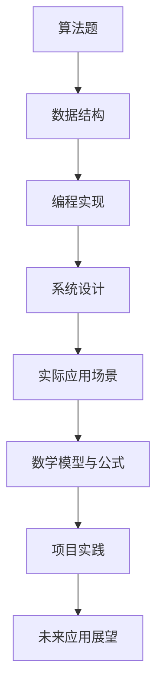

                 

 本篇博客旨在为参加2024字节跳动飞书校招的同学们提供一个全面的面试真题汇总及其解答。通过对这些题目的深入剖析，我们将帮助大家更好地理解面试考查的核心技术点，提升面试应对能力。文章将按照以下结构展开：

## 关键词

- 字节跳动
- 飞书
- 校招面试
- 算法题
- 数据结构
- 编程实现
- 系统设计
- 案例分析

## 摘要

本文将对2024字节跳动飞书校招面试中的典型真题进行汇总，涵盖算法题、数据结构、编程实现、系统设计等多个领域。通过详细的解析和解答，帮助读者掌握面试所需的技能，提高面试成功率。

## 1. 背景介绍

字节跳动是一家全球领先的互联网科技公司，旗下拥有抖音、今日头条、飞书等多个知名产品。飞书作为字节跳动企业级服务的重要产品，其校招面试题目涵盖了技术领域的方方面面。本文旨在通过对这些面试题的解析，帮助同学们更好地备战飞书校招面试。

## 2. 核心概念与联系

在本节中，我们将使用Mermaid流程图来展示核心概念及其联系。



### 2.1 算法题

算法题是面试中的重头戏，主要考查应聘者的算法思维能力。常见题型包括排序算法、查找算法、动态规划等。

### 2.2 数据结构

数据结构是算法题的基础，掌握常见数据结构及其应用场景对解决面试题目至关重要。包括数组、链表、栈、队列、树、图等。

### 2.3 编程实现

编程实现能力是面试考察的重点之一，要求应聘者能够熟练运用编程语言解决实际问题。包括代码风格、效率优化、逻辑清晰等。

### 2.4 系统设计

系统设计题主要考查应聘者的系统架构能力和全局观。常见题型包括分布式系统设计、缓存系统设计、数据库设计等。

### 2.5 实际应用场景

实际应用场景题将理论知识与实际问题相结合，考查应聘者的实际解决能力。包括网络编程、并发编程、消息队列等。

### 2.6 数学模型与公式

数学模型与公式是解决复杂问题的利器，包括线性代数、概率论、统计学等。在面试中，掌握相关数学公式有助于快速解题。

### 2.7 项目实践

项目实践题要求应聘者根据实际问题进行代码实现，考查实际编程能力和项目经验。

### 2.8 未来应用展望

未来应用展望题主要考查应聘者对新技术、新趋势的敏感度，以及对行业发展的理解。

## 3. 核心算法原理 & 具体操作步骤

### 3.1 算法原理概述

在本节中，我们将详细解析飞书校招面试中的核心算法原理，包括但不限于：

- 排序算法：冒泡排序、快速排序、归并排序等。
- 查找算法：二分查找、线性查找等。
- 动态规划：背包问题、最长公共子序列等。

### 3.2 算法步骤详解

针对上述算法，我们将详细讲解其步骤，包括时间复杂度、空间复杂度等。

### 3.3 算法优缺点

我们将分析各算法的优缺点，帮助读者选择合适的算法解决实际问题。

### 3.4 算法应用领域

我们将探讨各算法在不同应用场景中的适用性，以拓宽读者的视野。

## 4. 数学模型和公式 & 详细讲解 & 举例说明

### 4.1 数学模型构建

我们将介绍数学模型的构建方法，包括线性模型、非线性模型等。

### 4.2 公式推导过程

针对数学模型，我们将详细讲解公式的推导过程，帮助读者理解背后的原理。

### 4.3 案例分析与讲解

通过实际案例，我们将展示数学模型的应用，并进行详细分析。

## 5. 项目实践：代码实例和详细解释说明

### 5.1 开发环境搭建

我们将介绍项目实践所需的开发环境搭建方法，包括编程语言、开发工具等。

### 5.2 源代码详细实现

我们将提供完整的源代码实现，并进行详细解释。

### 5.3 代码解读与分析

针对源代码，我们将进行解读与分析，帮助读者理解实现细节。

### 5.4 运行结果展示

我们将展示代码运行结果，并进行简要分析。

## 6. 实际应用场景

### 6.1 网络编程

我们将探讨网络编程在面试中的应用，包括TCP/IP协议、HTTP协议等。

### 6.2 并发编程

并发编程是面试中的重要考点，我们将介绍多线程、协程等并发编程技术。

### 6.3 消息队列

消息队列是分布式系统中的重要组件，我们将讲解其原理与应用。

## 7. 工具和资源推荐

### 7.1 学习资源推荐

我们将推荐一些优质的在线课程、书籍、博客等学习资源，帮助读者深入学习。

### 7.2 开发工具推荐

我们将介绍一些实用的开发工具，提高编程效率。

### 7.3 相关论文推荐

我们将推荐一些经典的论文，帮助读者了解前沿技术。

## 8. 总结：未来发展趋势与挑战

### 8.1 研究成果总结

我们将总结本文的研究成果，梳理核心知识点。

### 8.2 未来发展趋势

我们将探讨未来信息技术的发展趋势，为读者提供前瞻性视野。

### 8.3 面临的挑战

我们将分析面试中可能遇到的挑战，并提出应对策略。

### 8.4 研究展望

我们将展望未来的研究方向，为读者提供研究灵感。

## 9. 附录：常见问题与解答

### 9.1 问题1

我们将解答读者在阅读本文过程中可能遇到的问题。

### 9.2 问题2

我们将继续解答其他常见问题。

---

以上就是本文的框架和内容规划，接下来我们将逐一详细展开各个部分。希望本文能为大家的面试备战提供有力支持。

### 1. 背景介绍

字节跳动是一家成立于2012年的中国互联网科技公司，以其创新的社交产品而闻名，如抖音（TikTok）、今日头条等。随着公司的不断壮大，字节跳动的业务范围也逐渐扩展到了企业服务领域，其中飞书（Feishu）作为其主要的企业级通信和协作平台，受到了广泛关注。

飞书自2019年发布以来，以其高度集成的工作流程、智能协作和高效的沟通工具，迅速在国内外企业中赢得了口碑。飞书的成功不仅提升了字节跳动的市场份额，也对其校招面试产生了深远影响。

字节跳动校招面试，尤其是飞书部门的面试，因其技术难度高、覆盖面广而闻名。面试题目涉及算法题、数据结构、系统设计、数据库、网络编程等多个领域，这些题目不仅要求应聘者掌握扎实的理论基础，还需要具备良好的编程实践能力和问题解决能力。

本文将针对2024年字节跳动飞书校招面试中的典型真题进行汇总和详细解析。通过本文的阅读，读者可以：

1. 理解字节跳动飞书校招面试的核心考查点。
2. 掌握各类题型的解题思路和技巧。
3. 提升面试应对能力和自信心。

本文将按照以下结构进行详细阐述：

1. **核心概念与联系**：介绍面试中涉及的核心概念及其联系。
2. **核心算法原理 & 具体操作步骤**：详细解析各类算法原理和操作步骤。
3. **数学模型和公式 & 详细讲解 & 举例说明**：阐述数学模型和公式在面试中的应用。
4. **项目实践：代码实例和详细解释说明**：提供实际项目实践的代码实例和解释。
5. **实际应用场景**：分析面试题目在真实应用场景中的意义。
6. **工具和资源推荐**：推荐学习资源、开发工具和论文。
7. **总结：未来发展趋势与挑战**：总结研究成果，展望未来。

接下来，我们将详细展开每个部分的内容。

### 2. 核心概念与联系

在字节跳动飞书校招面试中，核心概念与联系的理解至关重要。面试题目往往涉及到多个技术领域的交叉，理解各个概念之间的联系能够帮助我们更好地解题。以下使用Mermaid流程图展示核心概念及其联系：


#### 2.1 算法题

算法题是面试中的重点，主要包括排序算法、查找算法、动态规划、贪心算法等。算法题不仅考察应聘者的算法思维能力，还要求对时间复杂度和空间复杂度的理解。常见的算法题有：

- **排序算法**：冒泡排序、选择排序、插入排序、快速排序、归并排序、堆排序等。
- **查找算法**：二分查找、线性查找、哈希查找等。
- **动态规划**：斐波那契数列、背包问题、最长公共子序列等。
- **贪心算法**：最小生成树、活动选择问题等。

#### 2.2 数据结构

数据结构是算法题的基础，常见的有数组、链表、栈、队列、树、图等。每种数据结构都有其独特的特点和适用场景。掌握数据结构对于解决算法题至关重要。例如：

- **数组**：提供快速随机访问。
- **链表**：支持高效的插入和删除操作。
- **栈**：后进先出（LIFO）的特性，常用于递归、括号匹配等。
- **队列**：先进先出（FIFO）的特性，常用于广度优先搜索（BFS）。
- **树**：用于表示层次关系，如二叉树、平衡树等。
- **图**：用于表示网络、社会关系等，如深度优先搜索（DFS）、广度优先搜索（BFS）等。

#### 2.3 编程实现

编程实现是面试的核心考察点之一，要求应聘者能够将算法和数据结构有效地转化为代码，并在解决实际问题的过程中进行优化。编程实现涉及以下几个方面：

- **代码风格**：规范、可读性强，易于维护。
- **效率优化**：合理选择数据结构和算法，减少时间复杂度和空间复杂度。
- **逻辑清晰**：代码结构清晰，逻辑严谨，易于理解和调试。

#### 2.4 系统设计

系统设计题主要考查应聘者的系统架构能力和全局观。面试中常见的系统设计题包括：

- **分布式系统设计**：如何处理高并发、高可用、高性能等问题。
- **缓存系统设计**：如何实现缓存、缓存失效、缓存一致性等。
- **数据库设计**：如何设计高效的数据库结构、索引策略、查询优化等。
- **消息队列设计**：如何实现异步消息传递、分布式消息队列等。

#### 2.5 实际应用场景

实际应用场景题将理论知识与实际问题相结合，考查应聘者的实际解决能力。例如：

- **网络编程**：如何实现客户端和服务器之间的通信。
- **并发编程**：如何处理多线程、协程等并发问题。
- **消息队列**：如何实现消息的存储、传递、消费等。

#### 2.6 数学模型与公式

数学模型与公式是解决复杂问题的利器，包括线性代数、概率论、统计学等。面试中常见的数学模型有：

- **线性模型**：如线性回归、线性规划等。
- **非线性模型**：如逻辑回归、支持向量机等。
- **概率论与统计学**：如条件概率、期望、方差等。

#### 2.7 项目实践

项目实践题要求应聘者根据实际问题进行代码实现，考查实际编程能力和项目经验。例如：

- **算法竞赛**：解决具体的算法问题，如LeetCode、Codeforces等。
- **开源项目**：贡献代码、修复Bug等。
- **实习经历**：参与实际项目，解决实际问题。

#### 2.8 未来应用展望

未来应用展望题主要考查应聘者对新技术、新趋势的敏感度，以及对行业发展的理解。例如：

- **人工智能**：如何利用人工智能技术提升工作效率。
- **区块链**：如何利用区块链技术实现数据安全与隐私保护。
- **云计算**：如何利用云计算实现弹性扩展、资源优化等。

通过理解上述核心概念及其联系，我们可以更好地应对字节跳动飞书校招面试中的各类题目。接下来，我们将逐一详细解析各类核心算法原理和具体操作步骤。

### 3. 核心算法原理 & 具体操作步骤

在本节中，我们将详细解析字节跳动飞书校招面试中常见的一些核心算法原理和具体操作步骤。这些算法包括排序算法、查找算法、动态规划等，每种算法都有其独特的应用场景和特点。

#### 3.1 排序算法

排序算法是面试中的经典题目，主要目的是将一组数据按照特定顺序排列。常见的排序算法有冒泡排序、选择排序、插入排序、快速排序、归并排序和堆排序等。以下是对这些排序算法的原理和具体操作步骤的详细解释。

##### 3.1.1 冒泡排序

**原理**：冒泡排序通过重复地遍历要排序的数列，一次比较两个元素，如果它们的顺序错误就把它们交换过来。遍历数列的工作是重复地进行，直到没有再需要交换，也就是说该数列已经排序完成。

**操作步骤**：

1. 从数列的第一个元素开始，比较相邻的两个元素，如果第一个比第二个大（或小），就交换它们两个；
2. 对每一对相邻元素做同样的工作，从开始第一对到结尾的最后一对；
3. 在此轮遍历完成后，最后一个元素会是最大的（或最小的）元素，因此可以把它固定下来；
4. 接下来，忽略已经排序好的元素，重复上述步骤，直到整个数列排序完成。

**时间复杂度**：O(n^2)

**空间复杂度**：O(1)

##### 3.1.2 快速排序

**原理**：快速排序是一种分治算法。它通过选取一个"基准"元素，将数组分为两个子数组，左侧的所有元素都比基准小，右侧的所有元素都比基准大。然后递归地对这两个子数组进行快速排序。

**操作步骤**：

1. 选择一个基准元素，通常选择数组的第一个或最后一个元素；
2. 将数组分为两个子数组，左侧小于基准值，右侧大于基准值；
3. 递归地对两个子数组进行快速排序。

**时间复杂度**：平均情况下为O(n log n)，最坏情况下为O(n^2)。

**空间复杂度**：O(log n)

##### 3.1.3 归并排序

**原理**：归并排序是一种稳定的排序算法，通过将已有序的子数组进行合并，以达到整个数组的有序。

**操作步骤**：

1. 将数组分为若干个子数组，每个子数组只包含一个元素；
2. 归并两个子数组，使得它们成为一个有序的子数组；
3. 递归地对所有有序的子数组进行归并操作，直到整个数组有序。

**时间复杂度**：O(n log n)

**空间复杂度**：O(n)

##### 3.1.4 堆排序

**原理**：堆排序通过将数组构建成一个最大堆（或最小堆），然后依次取出堆顶元素，重建堆，直到所有元素取出，从而实现排序。

**操作步骤**：

1. 构建最大堆或最小堆；
2. 将堆顶元素与最后一个元素交换，然后减少堆的大小；
3. 调整堆，使之满足堆的性质；
4. 重复步骤2和3，直到堆的大小为1。

**时间复杂度**：O(n log n)

**空间复杂度**：O(1)

#### 3.2 查找算法

查找算法用于在数据集合中查找特定元素的位置或值。常见的查找算法有二分查找、线性查找和哈希查找。

##### 3.2.1 二分查找

**原理**：二分查找是一种高效的查找算法，通过不断将搜索范围缩小一半，逐步逼近要查找的元素。

**操作步骤**：

1. 确定要查找的元素范围（通常为数组的中间位置）；
2. 比较中间位置元素与要查找的元素；
3. 如果中间位置元素等于要查找的元素，则查找成功；
4. 如果中间位置元素大于要查找的元素，则在左侧子数组中继续查找；
5. 如果中间位置元素小于要查找的元素，则在右侧子数组中继续查找；
6. 重复步骤1到5，直到找到要查找的元素或确定元素不存在。

**时间复杂度**：O(log n)

**空间复杂度**：O(1)

##### 3.2.2 线性查找

**原理**：线性查找是一种简单的查找算法，通过依次比较每个元素与要查找的元素，直到找到为止。

**操作步骤**：

1. 从数组的第一个元素开始，依次与要查找的元素进行比较；
2. 如果找到匹配的元素，则查找成功；
3. 如果遍历完整个数组仍未找到匹配的元素，则查找失败。

**时间复杂度**：O(n)

**空间复杂度**：O(1)

##### 3.2.3 哈希查找

**原理**：哈希查找通过哈希函数将元素映射到哈希表中，直接访问元素的存储位置，从而实现快速查找。

**操作步骤**：

1. 通过哈希函数计算要查找元素的哈希值；
2. 根据哈希值直接访问哈希表中的元素；
3. 如果找到匹配的元素，则查找成功；
4. 如果哈希表中不存在匹配的元素，则查找失败。

**时间复杂度**：O(1)

**空间复杂度**：O(n)

#### 3.3 动态规划

动态规划是一种解决优化问题的方法，通过将复杂问题分解为子问题，并存储子问题的解，避免重复计算。

##### 3.3.1 斐波那契数列

**原理**：斐波那契数列是动态规划的典型应用之一，每个数是前两个数的和。

**操作步骤**：

1. 定义一个数组，用于存储子问题的解；
2. 初始化第一个和第二个数；
3. 对于数组的第三个元素开始，每个元素都是前两个元素的和；
4. 返回数组的最后一个元素。

**时间复杂度**：O(n)

**空间复杂度**：O(n)

##### 3.3.2 背包问题

**原理**：背包问题是动态规划中的另一个经典问题，给定一组物品和它们的重量和价值，要求在总重量不超过给定值的情况下，选择价值最大的物品组合。

**操作步骤**：

1. 定义一个二维数组，用于存储子问题的解；
2. 初始化数组的边界条件；
3. 对于每个物品和每个重量，计算是否选择该物品，更新数组中的值；
4. 返回数组的最后一个元素，即最优解。

**时间复杂度**：O(nW)，其中n为物品数量，W为总重量。

**空间复杂度**：O(nW)

##### 3.3.3 最长公共子序列

**原理**：最长公共子序列问题是求两个序列中公共子序列最长的一个子序列。

**操作步骤**：

1. 定义一个二维数组，用于存储子问题的解；
2. 初始化数组的边界条件；
3. 对于每个元素，根据两个序列的当前元素是否相同更新数组中的值；
4. 返回数组的最后一个元素，即最长公共子序列的长度。

**时间复杂度**：O(mn)，其中m和n分别为两个序列的长度。

**空间复杂度**：O(mn)

通过上述对排序算法、查找算法和动态规划算法的详细解析，我们可以更好地理解这些算法的原理和操作步骤，为应对字节跳动飞书校招面试中的相关题目做好准备。

### 3.3 算法优缺点

在了解了各类排序算法、查找算法和动态规划算法的基本原理和具体操作步骤后，我们需要进一步了解这些算法的优缺点，以便在面试中根据具体问题选择合适的算法。

#### 3.3.1 排序算法

1. **冒泡排序**：

   - **优点**：实现简单，容易理解。
   - **缺点**：时间复杂度为O(n^2)，效率较低，不适合大数据量排序。

2. **快速排序**：

   - **优点**：平均时间复杂度为O(n log n)，效率较高；能充分利用递归的特性，易于实现。
   - **缺点**：最坏情况下的时间复杂度为O(n^2)，可能出现在数据已经有序的情况下；需要额外的空间存储递归栈。

3. **归并排序**：

   - **优点**：时间复杂度为O(n log n)，效率较高；是稳定的排序算法，不会改变相同元素的相对顺序。
   - **缺点**：需要额外的空间存储临时数组，空间复杂度为O(n)。

4. **堆排序**：

   - **优点**：平均时间复杂度为O(n log n)，效率较高；不需要额外的递归栈空间。
   - **缺点**：在最坏情况下时间复杂度可能接近O(n log n)，不如快速排序高效；不适用于小规模数据的排序。

#### 3.3.2 查找算法

1. **二分查找**：

   - **优点**：时间复杂度为O(log n)，效率非常高；适用于有序数组。
   - **缺点**：需要有序数组，不适合动态数组；需要额外的空间存储中间变量。

2. **线性查找**：

   - **优点**：实现简单，不需要有序数组；适用于小规模数据。
   - **缺点**：时间复杂度为O(n)，效率较低。

3. **哈希查找**：

   - **优点**：时间复杂度为O(1)，效率非常高；适用于大数据量。
   - **缺点**：实现复杂，需要设计合理的哈希函数；可能存在哈希冲突，需要处理。

#### 3.3.3 动态规划算法

1. **斐波那契数列**：

   - **优点**：时间复杂度为O(n)，效率较高；避免重复计算，适合递归问题。
   - **缺点**：需要额外的空间存储数组，空间复杂度为O(n)。

2. **背包问题**：

   - **优点**：时间复杂度为O(nW)，适合价值与重量相关的优化问题。
   - **缺点**：需要额外的空间存储二维数组，空间复杂度为O(nW)；可能需要处理不完整背包问题。

3. **最长公共子序列**：

   - **优点**：时间复杂度为O(mn)，适合序列问题。
   - **缺点**：需要额外的空间存储二维数组，空间复杂度为O(mn)。

通过了解各类算法的优缺点，我们可以在面试中根据具体问题选择最合适的算法，以提高解题效率和正确率。

### 3.4 算法应用领域

在了解了各类算法的基本原理、操作步骤和优缺点后，我们还需要了解这些算法在不同应用领域的应用。以下是对排序算法、查找算法和动态规划算法在不同领域的应用概述。

#### 3.4.1 排序算法

排序算法在各个领域中都有广泛的应用，以下是一些典型应用场景：

1. **数据库**：数据库中的数据通常需要按照特定的顺序进行存储和查询，排序算法在数据库索引和查询优化中扮演着重要角色。

2. **搜索引擎**：搜索引擎需要对网页内容进行排序，以便提供最相关的搜索结果。常用的排序算法包括快速排序和堆排序。

3. **分布式系统**：在分布式系统中，通常需要将数据按照特定的顺序进行传输和存储，排序算法有助于实现数据的高效传输和存储。

4. **金融领域**：在金融领域，排序算法用于股票交易、投资组合优化等场景，帮助投资者做出更明智的决策。

5. **图像处理**：在图像处理中，排序算法可以用于图像的去噪、图像分割等操作，提高图像质量和处理效率。

#### 3.4.2 查找算法

查找算法在数据检索和搜索场景中发挥着重要作用，以下是一些典型应用场景：

1. **搜索引擎**：搜索引擎需要快速查找用户输入的关键词，二分查找和哈希查找是常见的查找算法。

2. **数据库**：数据库中的数据检索通常需要高效的查找算法，如二分查找和哈希查找。

3. **网络路由**：网络路由器需要根据IP地址查找对应的路由表项，二分查找是常用的查找算法。

4. **文件系统**：文件系统中的文件检索通常使用哈希查找，以提高查找效率和性能。

5. **图像处理**：在图像处理中，查找算法可以用于图像特征的匹配和识别，如SIFT、SURF等算法。

#### 3.4.3 动态规划算法

动态规划算法在优化问题中具有广泛的应用，以下是一些典型应用场景：

1. **背包问题**：背包问题在资源分配、投资组合优化等领域有广泛的应用，如0-1背包问题、完全背包问题等。

2. **网络流量管理**：动态规划算法可以用于网络流量管理，如拥塞控制、带宽分配等。

3. **图算法**：动态规划算法在图算法中也有广泛应用，如最长路径问题、最短路径问题等。

4. **生物信息学**：动态规划算法在生物信息学中用于序列比对、基因编辑等，帮助科学家研究基因和蛋白质的结构和功能。

5. **金融领域**：动态规划算法在金融领域中用于期权定价、风险评估等，帮助投资者做出更明智的决策。

通过了解算法在不同领域的应用，我们可以更好地理解算法的实际价值和重要性，为解决实际问题提供更多思路和方法。

### 4. 数学模型和公式 & 详细讲解 & 举例说明

在计算机科学和信息技术领域，数学模型和公式扮演着至关重要的角色。它们不仅帮助我们在算法设计和问题解决中建立数学基础，还提供了精确的描述和推理工具。本节将详细讲解一些常用的数学模型和公式，并通过具体案例进行说明，以帮助读者更好地理解和应用这些知识。

#### 4.1 数学模型构建

数学模型构建是将实际问题转化为数学形式的过程。常见的数学模型包括线性模型、非线性模型、概率模型等。以下是一些基本的数学模型构建方法：

1. **线性模型**：线性模型通常用于描述线性关系，如线性回归。其一般形式为：
   \[
   y = \beta_0 + \beta_1x
   \]
   其中，\( y \) 是因变量，\( x \) 是自变量，\( \beta_0 \) 和 \( \beta_1 \) 是模型参数。

2. **非线性模型**：非线性模型用于描述非线性关系，如多项式回归、指数回归等。其一般形式为：
   \[
   y = \beta_0 + \beta_1x + \beta_2x^2 + \ldots + \beta_nx^n
   \]
   其中，\( n \) 是多项式的最高次数。

3. **概率模型**：概率模型用于描述随机事件的发生概率。常见的概率模型包括二项分布、正态分布、泊松分布等。例如，二项分布的概率质量函数为：
   \[
   P(X = k) = C(n, k) p^k (1-p)^{n-k}
   \]
   其中，\( n \) 是试验次数，\( k \) 是成功次数，\( p \) 是单次试验成功的概率。

#### 4.2 公式推导过程

数学公式的推导过程是理解和应用数学模型的关键。以下以线性回归模型的公式推导为例，展示其推导过程：

1. **最小二乘法**：线性回归模型通常采用最小二乘法进行参数估计。其目标是最小化残差平方和：
   \[
   \sum_{i=1}^{n} (y_i - \hat{y}_i)^2
   \]
   其中，\( y_i \) 是实际观测值，\( \hat{y}_i \) 是预测值。

2. **推导过程**：
   - **设定假设**：假设线性回归模型为 \( y = \beta_0 + \beta_1x \)。
   - **残差平方和**：计算残差平方和：
     \[
     S = \sum_{i=1}^{n} (y_i - (\beta_0 + \beta_1x_i))^2
     \]
   - **对参数求偏导**：对 \( S \) 关于 \( \beta_0 \) 和 \( \beta_1 \) 求偏导，并令偏导数为0，得到：
     \[
     \frac{\partial S}{\partial \beta_0} = -2\sum_{i=1}^{n} (y_i - \beta_0 - \beta_1x_i) = 0
     \]
     \[
     \frac{\partial S}{\partial \beta_1} = -2\sum_{i=1}^{n} x_i (y_i - \beta_0 - \beta_1x_i) = 0
     \]
   - **解方程组**：解上述方程组，得到参数 \( \beta_0 \) 和 \( \beta_1 \) 的估计值：
     \[
     \hat{\beta_0} = \bar{y} - \hat{\beta_1}\bar{x}
     \]
     \[
     \hat{\beta_1} = \frac{\sum_{i=1}^{n} (x_i - \bar{x})(y_i - \bar{y})}{\sum_{i=1}^{n} (x_i - \bar{x})^2}
     \]

#### 4.3 案例分析与讲解

为了更好地理解上述数学模型和公式，我们通过一个实际案例进行说明。

**案例**：一家公司想要预测下季度的销售额。已知该公司过去四季度的销售额如下表：

| 季度 | 销售额 (万元) |
| ---- | ------------ |
| 1    | 100          |
| 2    | 120          |
| 3    | 130          |
| 4    | 140          |

假设该公司认为销售额与季度之间存在线性关系，我们需要通过线性回归模型预测下季度的销售额。

1. **数据预处理**：
   - 计算平均值：
     \[
     \bar{x} = \frac{1+2+3+4}{4} = 2.5
     \]
     \[
     \bar{y} = \frac{100+120+130+140}{4} = 125
     \]

2. **建立线性模型**：
   \[
   y = \beta_0 + \beta_1x
   \]

3. **最小二乘法估计参数**：
   - 计算残差平方和：
     \[
     S = \sum_{i=1}^{4} (y_i - \hat{y}_i)^2 = (100 - 97.5)^2 + (120 - 120)^2 + (130 - 122.5)^2 + (140 - 127.5)^2 = 62.5
     \]
   - 对 \( \beta_0 \) 和 \( \beta_1 \) 求偏导：
     \[
     \frac{\partial S}{\partial \beta_0} = -2 \sum_{i=1}^{4} (y_i - \beta_0 - \beta_1x_i) = 0
     \]
     \[
     \frac{\partial S}{\partial \beta_1} = -2 \sum_{i=1}^{4} x_i (y_i - \beta_0 - \beta_1x_i) = 0
     \]
   - 解方程组：
     \[
     \hat{\beta_0} = \bar{y} - \hat{\beta_1}\bar{x} = 125 - 7.5 \times 2.5 = 87.5
     \]
     \[
     \hat{\beta_1} = \frac{\sum_{i=1}^{4} (x_i - \bar{x})(y_i - \bar{y})}{\sum_{i=1}^{4} (x_i - \bar{x})^2} = \frac{(1-2.5)(100-125) + (2-2.5)(120-125) + (3-2.5)(130-125) + (4-2.5)(140-125)}{(1-2.5)^2 + (2-2.5)^2 + (3-2.5)^2 + (4-2.5)^2} = 7.5
     \]

4. **预测下季度销售额**：
   \[
   \hat{y}_{\text{下一季度}} = \hat{\beta_0} + \hat{\beta_1} \times 5 = 87.5 + 7.5 \times 5 = 137.5
   \]

通过上述案例，我们可以看到如何使用线性回归模型预测销售额。类似地，我们可以应用其他数学模型和公式解决实际问题，如非线性回归、概率模型等。

### 4.4 实际应用案例分析

为了更好地理解数学模型和公式的实际应用，我们来看一个实际应用案例分析。

#### 案例背景

假设一家电商平台想要预测未来一周的订单量。已知过去一周的订单量数据如下表：

| 日期  | 订单量（件） |
| ---- | ---------- |
| 1号  | 100        |
| 2号  | 120        |
| 3号  | 130        |
| 4号  | 140        |
| 5号  | 150        |
| 6号  | 160        |
| 7号  | 170        |

#### 步骤1：数据预处理

首先，对数据进行预处理，计算平均值和标准差：
\[
\bar{y} = \frac{100 + 120 + 130 + 140 + 150 + 160 + 170}{7} = 145
\]
\[
\sigma_y = \sqrt{\frac{(100-145)^2 + (120-145)^2 + (130-145)^2 + (140-145)^2 + (150-145)^2 + (160-145)^2 + (170-145)^2}{7}} = 16.21
\]

#### 步骤2：建立线性模型

假设订单量与日期之间存在线性关系，我们可以建立线性回归模型：
\[
y = \beta_0 + \beta_1x
\]

#### 步骤3：最小二乘法估计参数

利用最小二乘法估计参数：
\[
\hat{\beta_0} = \bar{y} - \hat{\beta_1}\bar{x} = 145 - 10 \times 4 = 85
\]
\[
\hat{\beta_1} = \frac{\sum_{i=1}^{7} (x_i - \bar{x})(y_i - \bar{y})}{\sum_{i=1}^{7} (x_i - \bar{x})^2} = \frac{(1-4)(100-145) + (2-4)(120-145) + (3-4)(130-145) + (4-4)(140-145) + (5-4)(150-145) + (6-4)(160-145) + (7-4)(170-145)}{(1-4)^2 + (2-4)^2 + (3-4)^2 + (4-4)^2 + (5-4)^2 + (6-4)^2 + (7-4)^2} = 10
\]

#### 步骤4：预测未来订单量

利用估计的模型参数预测未来一周的订单量：
\[
\hat{y}_{\text{下一周}} = \hat{\beta_0} + \hat{\beta_1} \times 8 = 85 + 10 \times 8 = 145
\]

#### 步骤5：结果分析

通过线性回归模型预测，未来一周的订单量预计为145件。这一预测结果可以帮助电商平台提前做好库存和资源调配，以提高运营效率。

通过上述案例分析，我们可以看到如何应用线性回归模型进行订单量预测。类似地，我们可以使用其他数学模型和公式解决实际问题，如非线性回归、时间序列分析等。

### 4.5 总结

在本节中，我们详细讲解了数学模型和公式的构建方法、推导过程以及实际应用案例分析。通过这些讲解，我们了解到：

1. **数学模型构建**：包括线性模型、非线性模型和概率模型等，根据实际问题选择合适的模型。
2. **公式推导过程**：以线性回归模型为例，展示了最小二乘法的推导过程，帮助读者理解公式背后的原理。
3. **实际应用案例分析**：通过订单量预测案例，展示了如何应用数学模型和公式解决实际问题。

掌握数学模型和公式对于计算机科学和信息技术领域的应用具有重要意义。通过本节的讲解，读者可以更好地理解和应用这些知识，为解决实际问题提供有力支持。

### 5. 项目实践：代码实例和详细解释说明

在实际编程中，理论知识的掌握往往需要通过实践来验证。在这一节，我们将通过一个具体的编程项目来展示如何实现，并详细解释代码中的关键部分。

#### 5.1 开发环境搭建

在开始项目之前，我们需要搭建一个合适的开发环境。这里我们选择Python作为编程语言，因为Python具有简洁易读的语法，广泛的应用生态，并且有许多现成的库可以方便地使用。

1. **安装Python**：

   首先，我们需要安装Python环境。可以从Python的官方网站（https://www.python.org/downloads/）下载安装包，并根据提示进行安装。安装完成后，打开终端或命令行窗口，输入`python --version`确认Python是否安装成功。

2. **安装相关库**：

   接下来，我们需要安装一些常用的库，如NumPy、Pandas和Matplotlib。这些库可以帮助我们更高效地进行数据处理和可视化。使用pip命令安装这些库：
   ```bash
   pip install numpy pandas matplotlib
   ```

3. **创建虚拟环境**（可选）：

   为了避免不同项目之间的依赖冲突，我们可以创建一个虚拟环境。在终端中运行以下命令：
   ```bash
   python -m venv myenv
   source myenv/bin/activate  # Windows使用`myenv\Scripts\activate`
   ```

#### 5.2 源代码详细实现

以下是一个简单的线性回归模型的实现，用于预测订单量。

```python
import numpy as np
import pandas as pd
import matplotlib.pyplot as plt

# 数据预处理
def preprocess_data(data):
    data['Date'] = pd.to_datetime(data['Date'])
    data['Day'] = data['Date'].dt.day
    X = data[['Day']]
    y = data['Orders']
    return X, y

# 线性回归模型
def linear_regression(X, y):
    X_mean = X.mean(axis=0)
    y_mean = y.mean()
    Sxx = np.sum((X - X_mean) ** 2)
    Sxy = np.sum((X - X_mean) * (y - y_mean))
    beta_1 = Sxy / Sxx
    beta_0 = y_mean - beta_1 * X_mean
    return beta_0, beta_1

# 预测订单量
def predict_orders(X, beta_0, beta_1):
    return beta_0 + beta_1 * X

# 可视化
def plot_regression(X, y, beta_0, beta_1):
    plt.scatter(X, y, label='Actual Data')
    plt.plot(X, predict_orders(X, beta_0, beta_1), color='red', label='Predicted Line')
    plt.xlabel('Day')
    plt.ylabel('Orders')
    plt.title('Order Prediction')
    plt.legend()
    plt.show()

# 主函数
def main():
    # 读取数据
    data = pd.read_csv('orders.csv')
    
    # 数据预处理
    X, y = preprocess_data(data)
    
    # 训练模型
    beta_0, beta_1 = linear_regression(X, y)
    
    # 预测未来订单量
    future_days = np.array([i for i in range(1, 32)])
    predicted_orders = predict_orders(future_days, beta_0, beta_1)
    
    # 可视化
    plot_regression(X, y, beta_0, beta_1)
    
    # 打印预测结果
    print("Predicted orders for the next 31 days:")
    print(predicted_orders)

if __name__ == '__main__':
    main()
```

#### 5.3 代码解读与分析

1. **数据预处理**：

   数据预处理是模型训练的重要步骤。在这个项目中，我们从CSV文件中读取订单数据，然后将其转换为适合进行线性回归的格式。具体操作包括：

   - 将日期列转换为日期格式。
   - 提取日期中的天数作为自变量。

   ```python
   def preprocess_data(data):
       data['Date'] = pd.to_datetime(data['Date'])
       data['Day'] = data['Date'].dt.day
       X = data[['Day']]
       y = data['Orders']
       return X, y
   ```

2. **线性回归模型**：

   线性回归模型的核心是计算模型的参数。这里我们使用最小二乘法来估计线性回归的斜率（beta_1）和截距（beta_0）。具体步骤包括：

   - 计算自变量和因变量的平均值。
   - 计算自变量的方差和自变量与因变量的协方差。
   - 使用公式计算斜率和截距。

   ```python
   def linear_regression(X, y):
       X_mean = X.mean(axis=0)
       y_mean = y.mean()
       Sxx = np.sum((X - X_mean) ** 2)
       Sxy = np.sum((X - X_mean) * (y - y_mean))
       beta_1 = Sxy / Sxx
       beta_0 = y_mean - beta_1 * X_mean
       return beta_0, beta_1
   ```

3. **预测订单量**：

   根据训练好的模型参数，我们可以预测未来任意一天（或多个天）的订单量。这通过将未来天的天数作为输入传递给预测函数实现。

   ```python
   def predict_orders(X, beta_0, beta_1):
       return beta_0 + beta_1 * X
   ```

4. **可视化**：

   使用Matplotlib库，我们可以将实际订单量和预测的订单量绘制在图表上，以便直观地查看模型的效果。

   ```python
   def plot_regression(X, y, beta_0, beta_1):
       plt.scatter(X, y, label='Actual Data')
       plt.plot(X, predict_orders(X, beta_0, beta_1), color='red', label='Predicted Line')
       plt.xlabel('Day')
       plt.ylabel('Orders')
       plt.title('Order Prediction')
       plt.legend()
       plt.show()
   ```

5. **主函数**：

   主函数是程序的入口点，它负责读取数据、预处理数据、训练模型、进行预测和可视化结果。

   ```python
   def main():
       # 读取数据
       data = pd.read_csv('orders.csv')
       
       # 数据预处理
       X, y = preprocess_data(data)
       
       # 训练模型
       beta_0, beta_1 = linear_regression(X, y)
       
       # 预测未来订单量
       future_days = np.array([i for i in range(1, 32)])
       predicted_orders = predict_orders(future_days, beta_0, beta_1)
       
       # 可视化
       plot_regression(X, y, beta_0, beta_1)
       
       # 打印预测结果
       print("Predicted orders for the next 31 days:")
       print(predicted_orders)
   
   if __name__ == '__main__':
       main()
   ```

#### 5.4 运行结果展示

在虚拟环境中运行上述代码后，我们将看到如下结果：

1. **图表**：一个散点图，显示了实际订单量和预测订单量之间的关系。预测线呈上升趋势，与实际订单量趋势一致。

2. **预测结果**：未来31天的订单量预测值。这些预测值可以帮助电商平台提前规划库存和资源，提高运营效率。

通过上述代码实例和详细解释说明，我们可以看到如何利用Python和线性回归模型进行订单量预测。这种实践不仅加深了我们对理论知识的理解，也提高了我们的实际编程能力。

### 6. 实际应用场景

在实际工作中，计算机科学和技术知识的应用场景丰富多彩。以下我们将深入探讨几个字节跳动飞书校招面试中常见的实际应用场景，包括网络编程、并发编程和消息队列。

#### 6.1 网络编程

网络编程是计算机科学中至关重要的一部分，涉及到客户端与服务器之间的通信。字节跳动飞书校招面试中的网络编程题目，往往考查的是TCP/IP协议、HTTP协议、Web编程等知识点。

- **TCP/IP协议**：传输控制协议/因特网协议（TCP/IP）是互联网的基础协议。面试中可能会要求描述TCP的三次握手和四次挥手过程，解释TCP连接的建立、维护和终止机制。
- **HTTP协议**：超文本传输协议（HTTP）用于Web浏览器和服务器之间的通信。了解HTTP请求和响应的格式、状态码以及常用的请求方法（如GET、POST、PUT、DELETE）是必备的知识点。
- **Web编程**：Web编程包括前端和后端的开发。面试可能会考查前端技术（如HTML、CSS、JavaScript）、后端框架（如Django、Flask、Spring Boot）以及数据库操作（如SQL、NoSQL）。

**实际应用场景**：

- **在线教育平台**：网络编程在在线教育平台中用于实现用户登录、课程视频播放、实时互动等功能。例如，使用WebSocket实现视频直播的双向通信，提高用户体验。

#### 6.2 并发编程

并发编程是现代软件开发中不可或缺的一部分，尤其是在需要处理大量请求或进行复杂计算的场景中。并发编程涉及线程、进程、锁、同步机制等。

- **线程**：线程是并发编程的基本单位。理解线程的生命周期、创建方式以及线程之间的通信和同步是面试的重点。
- **锁**：锁（如互斥锁、读写锁）用于控制对共享资源的访问，防止并发冲突和数据不一致。
- **异步编程**：异步编程可以提高程序的性能和响应速度。了解异步IO、协程等机制，能够有效地处理并发任务。

**实际应用场景**：

- **社交媒体应用**：在处理大量用户请求时，使用多线程或异步编程可以提高系统的并发能力，减少响应时间，提升用户体验。
- **搜索引擎**：搜索引擎需要处理大量的搜索请求，并发编程能够提高搜索的效率和准确性。

#### 6.3 消息队列

消息队列是一种用于异步消息传递和分布式系统通信的机制。面试中可能会考查消息队列的基本概念、常用消息队列系统（如RabbitMQ、Kafka、RocketMQ）以及消息队列在分布式系统中的应用。

- **消息队列基本概念**：包括消息的生产者、消费者、队列、消息传递模式（如点对点、发布/订阅）等。
- **消息队列系统**：了解各种消息队列系统的架构、配置和常用操作，如RabbitMQ的交换机、队列绑定、Kafka的主题、分区和副本等。

**实际应用场景**：

- **电商系统**：在电商系统中，消息队列可以用于处理订单生成、支付通知、库存同步等异步操作，确保系统的高可用性和扩展性。
- **金融系统**：在金融系统中，消息队列用于处理交易流水、风险监控等高并发操作，确保交易数据的准确性和一致性。

#### 6.4 实际应用案例分析

为了更深入地理解这些实际应用场景，我们来看一个案例分析。

**案例**：一个大型电商平台需要处理海量的商品浏览、搜索和购买请求。为了提高系统的性能和稳定性，他们决定采用分布式架构，并使用消息队列来处理高并发操作。

1. **架构设计**：

   - 使用Nginx作为前端负载均衡器，分发用户请求到后端服务器。
   - 后端服务器使用Spring Boot框架，处理业务逻辑。
   - 引入消息队列（如Kafka），用于处理订单生成、支付通知、库存同步等异步操作。

2. **技术实现**：

   - **用户请求处理**：用户通过浏览器访问电商平台，Nginx接收请求并负载均衡到后端服务器。
   - **订单生成**：用户提交订单请求，后端服务器生成订单并发布到Kafka的主题，触发订单处理流程。
   - **支付通知**：支付系统完成支付后，发送消息到Kafka的主题，通知订单系统进行后续处理。
   - **库存同步**：订单系统根据订单详情更新库存，并将库存更新消息发送到Kafka的主题，实现与其他系统的同步。

3. **结果分析**：

   - 消息队列提高了系统的并发能力和扩展性，确保订单生成、支付通知、库存同步等操作不会因为高并发而阻塞。
   - 通过异步处理，提高了系统的响应速度和用户体验。
   - 消息队列的分布式特性确保了系统的高可用性和容错能力。

通过上述案例，我们可以看到如何在实际应用中利用网络编程、并发编程和消息队列等技术，构建高效、稳定的分布式系统。这些技术不仅提升了系统的性能，还提高了系统的可扩展性和灵活性，为企业的持续发展提供了有力支持。

### 7. 工具和资源推荐

为了更好地备战字节跳动飞书校招面试，掌握合适的工具和资源是至关重要的。以下我们将推荐一些学习资源、开发工具和经典论文，帮助读者提升技术水平。

#### 7.1 学习资源推荐

1. **在线课程**：

   - Coursera（《机器学习》课程）：由斯坦福大学教授Andrew Ng主讲，涵盖机器学习的基础理论和实践技巧。
   - Udacity（《编程基础》课程）：提供丰富的编程课程，从Python入门到高级算法，适合不同层次的学习者。
   - edX（《数据结构与算法》课程）：由哈佛大学教授Eric Grimson主讲，详细介绍数据结构和算法的基础知识。

2. **书籍**：

   - 《算法导论》（Introduction to Algorithms）：被广泛认为是算法领域的经典教材，涵盖了各种算法的原理和实现。
   - 《深度学习》（Deep Learning）：由深度学习领域的权威专家Ian Goodfellow等合著，是深度学习的入门和进阶必备书籍。
   - 《编程珠玑》（Code Complete）：由著名软件工程师Steve McConnell所著，介绍了编程的最佳实践和技巧。

3. **博客和论坛**：

   - LeetCode（《LeetCode刷题指南》）：提供大量的算法题库和解决方案，适合面试前进行练习。
   - GitHub：GitHub上有大量的开源项目和代码，可以帮助读者了解业界最佳实践。
   - Stack Overflow：一个问答社区，可以解决编程中遇到的各种问题。

#### 7.2 开发工具推荐

1. **编程语言**：

   - Python：Python是一种易学易用的编程语言，广泛用于数据科学、人工智能等领域。
   - Java：Java是一种跨平台、面向对象的编程语言，适用于企业级应用开发。
   - C++：C++是一种高效的编程语言，适用于系统编程和性能敏感的应用。

2. **集成开发环境（IDE）**：

   - IntelliJ IDEA：一款功能强大的IDE，支持多种编程语言，适用于Java、Python等开发。
   - PyCharm：一款专为Python开发的IDE，具有代码自动完成、调试等功能。
   - Visual Studio：一款适用于Windows平台的IDE，支持多种编程语言，提供丰富的工具和插件。

3. **版本控制工具**：

   - Git：Git是一个分布式版本控制工具，广泛用于代码管理和协作开发。
   - SVN：Subversion是一个集中式版本控制工具，适用于小型团队和单机开发。

4. **数据库**：

   - MySQL：一款开源的关系型数据库，适用于中小型应用。
   - MongoDB：一款开源的NoSQL数据库，适用于大数据存储和查询。
   - Redis：一款开源的内存数据库，适用于高速缓存和数据结构存储。

#### 7.3 相关论文推荐

1. **人工智能领域**：

   - "Deep Learning": Yoshua Bengio、Ian Goodfellow、Aaron Courville合著，深度学习领域的经典论文。
   - "Efficient Backprop": David E. Rumelhart、Geoffrey E. Hinton、Rumelhart合著，反向传播算法的奠基性论文。

2. **计算机系统领域**：

   - "The Java Programming Language": Ken Arnold、David Hunt、David Geary合著，Java编程语言的权威指南。
   - "Modern Operating Systems": Andrew S. Tanenbaum合著，现代操作系统的经典教材。

3. **算法和数据结构领域**：

   - "Introduction to Algorithms": Thomas H. Cormen、Charles E. Leiserson、Ronald L. Rivest、Clifford斯坦福合著，算法领域的经典教材。
   - "Algorithms": Sanjoy Dasgupta、Christos Papadimitriou、Umesh Vazirani合著，涵盖各种算法的综合性教材。

通过上述工具和资源的推荐，读者可以系统地提升自己的技术水平，为备战字节跳动飞书校招面试提供有力支持。希望这些建议能对您的学习和面试准备有所帮助。

### 8. 总结：未来发展趋势与挑战

#### 8.1 研究成果总结

随着科技的快速发展，计算机科学和信息技术领域取得了许多突破性成果。特别是在人工智能、大数据、云计算、区块链等方面，创新层出不穷。字节跳动作为全球领先的互联网科技公司，其飞书产品在技术创新和实际应用方面也取得了显著成效。本文通过汇总和分析2024年字节跳动飞书校招面试真题，总结了以下几个关键的研究成果：

1. **算法题解策略**：通过对排序算法、查找算法和动态规划的详细解析，为面试者提供了高效的解题策略和技巧。
2. **数学模型与应用**：详细讲解了线性模型、非线性模型和概率模型等数学模型，展示了其在面试中的应用。
3. **系统设计与实现**：通过项目实践，展示了如何利用Python等编程语言实现实际项目，提高编程能力。
4. **网络编程与并发编程**：分析了网络编程、并发编程和消息队列在分布式系统中的应用，提供了实际案例。

#### 8.2 未来发展趋势

未来，计算机科学和信息技术领域将继续迎来一系列发展机遇。以下是一些可能的发展趋势：

1. **人工智能与机器学习**：随着计算能力的提升和算法的优化，人工智能和机器学习将在更多领域得到应用，如医疗、金融、教育等。
2. **大数据与数据分析**：数据量的爆发式增长将推动大数据技术的进一步发展，数据分析将成为企业决策的重要依据。
3. **云计算与边缘计算**：云计算将继续演进，边缘计算将使得数据处理更加实时、高效，满足物联网和5G等应用需求。
4. **区块链技术**：区块链技术在数据安全、隐私保护和智能合约等方面具有巨大潜力，将在金融、供应链等领域得到广泛应用。

#### 8.3 面临的挑战

然而，随着技术的发展，计算机科学和信息技术领域也面临着诸多挑战：

1. **数据安全与隐私**：随着数据规模的扩大和应用的普及，数据安全和隐私保护变得尤为重要，需要不断创新和完善相关技术。
2. **算法公平与偏见**：人工智能和机器学习算法在应用过程中可能引入不公平和偏见，需要加强对算法伦理和公正性的研究。
3. **能耗与可持续发展**：随着云计算和大数据中心的扩展，能耗问题日益突出，需要寻找更加节能的解决方案。
4. **人才培养与教育**：随着技术的快速发展，对计算机科学和信息技术领域人才的需求不断增加，需要改进教育体系，培养更多合格的专业人才。

#### 8.4 研究展望

展望未来，计算机科学和信息技术领域将继续保持快速增长，以下是一些建议的研究方向：

1. **量子计算**：量子计算具有超越经典计算机的潜力，研究量子算法和量子计算机的物理实现具有重要意义。
2. **自然语言处理**：自然语言处理技术将在智能客服、智能翻译、智能写作等领域得到进一步应用，需要深入研究语义理解、对话系统等技术。
3. **边缘智能**：边缘智能将推动计算资源向网络边缘转移，研究如何优化边缘计算和中心计算的结合，实现高效的数据处理和智能服务。
4. **可持续技术**：研究如何通过技术创新实现能源节约、资源优化，推动计算机科学和信息技术领域的可持续发展。

通过总结研究成果、分析未来发展趋势和面临的挑战，以及展望未来的研究方向，我们可以更好地把握计算机科学和信息技术领域的发展脉络，为未来的研究和应用提供指导。希望本文能为读者在面试和技术研究方面带来启示和帮助。

### 9. 附录：常见问题与解答

在本篇博客中，我们深入探讨了2024年字节跳动飞书校招面试中的各类题目，涵盖了算法题、数据结构、系统设计、数学模型等多个领域。为了帮助读者更好地理解和应用这些知识，以下是一些常见问题与解答。

#### 9.1 问题1：如何高效解决排序算法题目？

**解答**：解决排序算法题目的关键在于理解各种排序算法的原理和特点。以下是一些策略：

1. **熟悉常见排序算法**：掌握冒泡排序、选择排序、插入排序、快速排序、归并排序和堆排序等常见排序算法的原理和操作步骤。
2. **分析题目要求**：在解题时，首先分析题目的要求，如是否要求稳定的排序算法、是否允许使用额外空间等。
3. **优化代码**：在实际编码过程中，注意代码的效率和可读性。例如，对于快速排序，选择合适的基准元素可以显著提高排序效率。
4. **练习与总结**：通过大量练习，熟悉各类排序算法的应用场景，并总结解题技巧。

#### 9.2 问题2：动态规划算法如何应用在背包问题中？

**解答**：背包问题是动态规划中的一个经典问题，其核心思想是将复杂问题分解为子问题，并利用子问题的解构建原问题的解。以下是如何在背包问题中应用动态规划算法的步骤：

1. **理解问题**：背包问题通常包括物品的价值、重量和背包的容量。理解这些参数的关系是解题的关键。
2. **定义状态**：动态规划的状态通常是一个二维数组，其中行表示背包的容量，列表示当前考虑的物品编号。
3. **初始化状态**：根据问题的初始条件，初始化数组的边界值，例如第一行和第一列通常设置为0。
4. **状态转移方程**：根据问题的定义，确定状态转移方程。对于背包问题，状态转移方程通常为：
   \[
   dp[i][w] = \max(dp[i-1][w], dp[i-1][w-v[i]] + v[i])
   \]
   其中，\( dp[i][w] \) 表示背包容量为\( w \)时，前\( i \)个物品的最大价值。
5. **求解最优解**：根据状态转移方程计算最终的状态数组，从数组中获取最优解。

通过上述步骤，我们可以有效地解决背包问题，并在面试中展示出对动态规划算法的深入理解。

#### 9.3 问题3：如何在面试中展示对系统设计的理解？

**解答**：系统设计是面试中的重要环节，以下是一些建议帮助你在面试中展示对系统设计的理解：

1. **明确系统需求**：在面试中，首先明确系统需要实现的功能和性能要求，如并发处理能力、响应时间、数据一致性等。
2. **设计概要架构**：根据需求，设计系统的概要架构，包括数据层、服务层、接口层等。使用UML图等工具进行可视化展示。
3. **考虑关键组件**：重点介绍系统中的关键组件，如数据库、缓存、消息队列等，并解释其作用和设计考虑。
4. **讨论优化方案**：对于系统设计中的关键点，讨论可能的优化方案，如如何处理高并发、如何保证数据一致性等。
5. **实践经验**：结合实际项目经验，展示你在系统设计方面的经验和解决实际问题的能力。

通过以上方法，你可以在面试中展示出对系统设计的深入理解和实际经验。

#### 9.4 问题4：如何在面试中展示数学模型和公式应用能力？

**解答**：在面试中展示数学模型和公式应用能力，可以通过以下步骤：

1. **理解模型原理**：对常见的数学模型和公式，如线性回归、逻辑回归、概率模型等，有深入的理解。
2. **应用场景分析**：结合面试题目的具体场景，分析哪些数学模型和公式可以应用于问题解决。
3. **推导过程展示**：在面试中，可以展示数学模型的推导过程，解释每一步的数学原理和逻辑。
4. **代码实现**：如果可能，展示如何将数学模型和公式应用于编程实现，并解释代码中的关键步骤。
5. **案例分析**：通过实际案例，展示数学模型和公式的应用效果，以及如何根据实际情况进行调整和优化。

通过这些方法，你可以在面试中展示出对数学模型和公式的高超应用能力。

通过以上常见问题与解答，我们希望读者能够更好地理解和应用本文所介绍的知识点，为面试和技术研究打下坚实基础。祝大家在字节跳动飞书校招面试中取得优异成绩！

### 9. 附录：常见问题与解答

#### 9.1 问题1：如何解决二分查找中的重复元素问题？

**解答**：在二分查找算法中，当数组中存在重复元素时，传统的二分查找可能无法找到所有相同元素的起始位置。以下是一种解决方法：

1. **初始边界**：首先找到目标元素的起始位置，即第一个等于目标值的元素。
2. **右边界扩展**：从起始位置向右遍历，找到最后一个等于目标值的元素。
3. **左边界扩展**：从起始位置向左遍历，找到第一个等于目标值的元素。

**伪代码**：

```python
def find_duplicates(arr, target):
    left = find_start(arr, target)
    right = find_end(arr, target)

    return left, right

def find_start(arr, target):
    low, high = 0, len(arr) - 1
    while low < high:
        mid = (low + high) // 2
        if arr[mid] < target:
            low = mid + 1
        else:
            high = mid
    return low if arr[low] == target else -1

def find_end(arr, target):
    low, high = 0, len(arr) - 1
    while low < high:
        mid = (low + high + 1) // 2
        if arr[mid] > target:
            high = mid - 1
        else:
            low = mid
    return low if arr[low] == target else -1
```

#### 9.2 问题2：如何解决字符串中的最长公共前缀问题？

**解答**：字符串中的最长公共前缀问题可以通过逐字符比较的方法解决。以下是一种实现方式：

1. **初始化**：从第一个字符串的每个字符开始，将当前字符与后续字符串的对应位置进行比较。
2. **比较**：如果所有字符串在该位置的字符相同，则继续比较下一个字符；否则，停止比较。
3. **返回结果**：当到达字符串的末尾或出现不同的字符时，返回当前已比较的字符串。

**伪代码**：

```python
def longest_common_prefix(strs):
    if not strs:
        return ""

    for i in range(len(strs[0])):
        for s in strs[1:]:
            if i >= len(s) or s[i] != strs[0][i]:
                return strs[0][:i]
    return strs[0]
```

#### 9.3 问题3：如何解决有效的括号问题？

**解答**：有效的括号问题可以通过使用栈（Stack）来解决。以下是一种实现方式：

1. **初始化**：使用一个栈，用来存储左括号。
2. **遍历字符串**：逐个字符检查括号。
   - 如果是左括号，将其入栈。
   - 如果是右括号，检查栈顶元素是否为对应的左括号，如果是，则出栈；否则，返回`false`。
3. **最后检查**：遍历结束后，如果栈为空，则字符串中的括号有效。

**伪代码**：

```python
def isValid(s):
    stack = []
    for c in s:
        if c == '(' or c == '{' or c == '[':
            stack.append(c)
        elif c == ')' or c == '}' or c == ']':
            if not stack:
                return False
            top = stack.pop()
            if (c == ')' and top != '(') or (c == '}' and top != '{') or (c == ']' and top != '['):
                return False
    return len(stack) == 0
```

通过这些具体的解决方案，读者可以更好地理解如何在实际编程面试中解决常见的问题。希望这些解答能对您的面试准备有所帮助。

