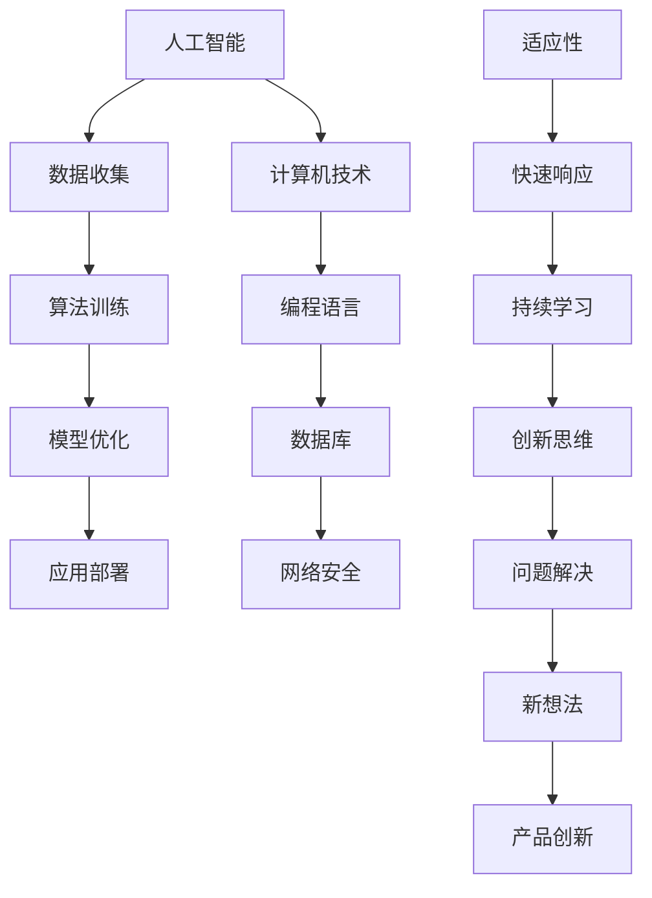

                 

关键词：VUCA时代，学习体系，技能，人工智能，计算机技术，未来趋势

> 摘要：在VUCA（易变性、不确定性、复杂性、模糊性）时代，构建一个有效的学习体系对于个人和组织的成功至关重要。本文将深入探讨VUCA时代的重要技能，包括人工智能、计算机技术、适应性和创新思维，并分析这些技能在现代社会中的应用和未来发展趋势。

## 1. 背景介绍

随着全球化的加速、技术的飞速发展以及社会结构的深刻变革，我们正处于一个VUCA时代。VUCA代表“易变性”（Volatility）、“不确定性”（Uncertainty）、“复杂性”（Complexity）和“模糊性”（Ambiguity），这些特征共同构成了当前社会和经济的现实。在这个时代，传统的稳定和线性思维模式已经无法应对快速变化的环境，因此，我们需要一个全新的学习体系来适应这种不确定性。

### 易变性（Volatility）

易变性指的是事物变化的速度和频率。在信息技术领域，例如，新的编程语言、框架和工具层出不穷，企业必须不断更新技术栈以保持竞争力。这种快速变化要求学习体系具有敏捷性和适应性。

### 不确定性（Uncertainty）

不确定性是指对未来事件的不确定性和无法预测性。在经济领域，市场波动和全球经济不确定性使得企业面临巨大的风险。个人也必须学会如何在不确定性中做出明智的决策。

### 复杂性（Complexity）

复杂性指的是系统中各部分之间的相互作用和依赖关系。在项目管理中，复杂的项目通常涉及多个学科、利益相关者和变数。有效的学习体系需要能够处理这种复杂性，并提供解决问题的方法。

### 模糊性（Ambiguity）

模糊性指的是信息的缺乏或不明确性。在沟通和决策过程中，模糊性可能导致误解和错误决策。一个有效的学习体系应该包括批判性思维和决策技能，帮助个人和组织更好地应对模糊性。

## 2. 核心概念与联系

为了构建一个适应VUCA时代的学习体系，我们需要明确几个核心概念，并理解它们之间的联系。

### 人工智能（AI）

人工智能是计算机系统模拟人类智能行为的能力。在VUCA时代，人工智能成为了解决复杂问题的重要工具，例如自然语言处理、图像识别和决策支持系统。它依赖于大量的数据和先进的算法。

### 计算机技术

计算机技术包括编程语言、数据库、网络和安全等多个领域。这些技术是构建和运行现代应用程序的基础，也是人工智能发展的基石。

### 适应性

适应性是指个体或组织在面对变化时能够迅速调整和适应的能力。在VUCA时代，适应性成为衡量个人和组织成功的关键因素。

### 创新思维

创新思维是指创造新想法、解决方案或产品的能力。在快速变化的环境中，创新思维能够帮助个人和组织保持竞争力。

### Mermaid 流程图



## 3. 核心算法原理 & 具体操作步骤

### 3.1 算法原理概述

在VUCA时代，算法成为处理复杂问题和不确定性的关键。以下是几种核心算法的原理概述：

#### 机器学习

机器学习是一种通过数据学习和改进的算法，用于预测和决策。它依赖于统计学和优化理论，能够从数据中发现模式和关系。

#### 深度学习

深度学习是机器学习的一种子领域，通过多层神经网络模拟人类大脑的决策过程。它在图像识别、语音识别和自然语言处理等领域取得了显著成果。

#### 强化学习

强化学习是一种通过奖励机制来训练智能体的算法。它被广泛应用于游戏、推荐系统和自动驾驶等领域。

### 3.2 算法步骤详解

以下是上述算法的具体步骤详解：

#### 机器学习

1. 数据收集：收集大量相关数据。
2. 数据预处理：清洗和整理数据。
3. 特征提取：将数据转换为算法可处理的形式。
4. 模型训练：使用训练数据训练模型。
5. 模型评估：使用验证数据评估模型性能。
6. 模型优化：根据评估结果调整模型参数。

#### 深度学习

1. 网络构建：设计多层神经网络结构。
2. 模型训练：通过反向传播算法训练模型。
3. 权重调整：根据训练误差调整网络权重。
4. 模型评估：使用验证数据评估模型性能。
5. 模型优化：通过调整网络结构和超参数优化模型。

#### 强化学习

1. 环境定义：定义智能体行动和奖励机制。
2. 智能体策略：设计智能体的决策策略。
3. 智能体行动：根据策略执行行动。
4. 奖励反馈：根据行动结果更新策略。
5. 模型评估：使用评估指标评估智能体性能。
6. 模型优化：根据评估结果调整策略。

### 3.3 算法优缺点

#### 机器学习

优点：
- 自动化：能够自动从数据中学习模式。
- 泛化能力：能够在新的数据上表现良好。

缺点：
- 过拟合：模型可能无法适应新的数据。
- 数据需求：需要大量高质量数据。

#### 深度学习

优点：
- 高效性：能够处理大规模数据。
- 准确性：在图像识别和自然语言处理等领域表现出色。

缺点：
- 复杂性：模型结构复杂，难以解释。
- 计算资源：需要大量计算资源。

#### 强化学习

优点：
- 适应性：能够通过互动学习适应环境。
- 创新性：能够发现新的解决方案。

缺点：
- 慢速学习：需要大量时间来训练智能体。
- 稳定性：智能体可能在某些情况下出现不稳定行为。

### 3.4 算法应用领域

#### 机器学习

应用领域：金融、医疗、零售、社交媒体等。

#### 深度学习

应用领域：图像识别、语音识别、自然语言处理、自动驾驶等。

#### 强化学习

应用领域：游戏、推荐系统、机器人控制等。

## 4. 数学模型和公式 & 详细讲解 & 举例说明

### 4.1 数学模型构建

在VUCA时代，数学模型成为理解和解决问题的重要工具。以下是一个简单的线性回归模型构建过程：

#### 线性回归模型

假设我们有两个变量：自变量X和因变量Y。线性回归模型试图找到这两个变量之间的线性关系：

$$Y = \beta_0 + \beta_1 \cdot X + \epsilon$$

其中，$\beta_0$是截距，$\beta_1$是斜率，$\epsilon$是误差项。

### 4.2 公式推导过程

为了推导线性回归模型的公式，我们使用最小二乘法。最小二乘法的目标是找到最佳拟合线，使得实际观测值与拟合值之间的误差平方和最小。

1. 假设我们有一组数据点$(x_i, y_i)$，其中$i = 1, 2, ..., n$。
2. 拟合直线的斜率和截距可以通过以下公式计算：

$$\beta_1 = \frac{\sum_{i=1}^{n}(x_i - \bar{x})(y_i - \bar{y})}{\sum_{i=1}^{n}(x_i - \bar{x})^2}$$

$$\beta_0 = \bar{y} - \beta_1 \cdot \bar{x}$$

其中，$\bar{x}$和$\bar{y}$分别是$x_i$和$y_i$的平均值。

### 4.3 案例分析与讲解

假设我们有一组数据点：

$$\begin{array}{|c|c|c|}
\hline
x & y & x - \bar{x} & y - \bar{y} & (x - \bar{x})(y - \bar{y}) & (x - \bar{x})^2 \\
\hline
1 & 2 & -1 & -1 & 1 & 1 \\
2 & 4 & 0 & 1 & 0 & 0 \\
3 & 6 & 1 & 2 & 2 & 1 \\
4 & 8 & 2 & 3 & 6 & 4 \\
\hline
\end{array}$$

我们可以使用上述公式计算线性回归模型的斜率和截距：

$$\beta_1 = \frac{1 + 0 + 2 + 6}{1 + 0 + 1 + 4} = \frac{9}{6} = 1.5$$

$$\beta_0 = \frac{2 + 4 + 6 + 8}{4} - 1.5 \cdot \frac{1 + 2 + 3 + 4}{4} = 5 - 3 = 2$$

因此，线性回归模型为：

$$y = 2 + 1.5 \cdot x$$

### 4.4 模型应用与解释

我们可以使用这个线性回归模型预测新的数据点。例如，如果我们输入$x = 5$，预测的$y$值为：

$$y = 2 + 1.5 \cdot 5 = 7.5$$

这意味着，当$x$增加一个单位时，$y$平均增加1.5个单位。这个模型可以帮助我们理解$x$和$y$之间的线性关系，并用于预测新的数据点。

## 5. 项目实践：代码实例和详细解释说明

### 5.1 开发环境搭建

为了更好地理解线性回归模型，我们将使用Python编程语言实现这个模型。首先，我们需要安装Python和必要的库。以下是安装步骤：

1. 访问Python官方网站下载最新版本的Python安装包。
2. 双击安装程序，并按照默认选项安装。
3. 打开终端或命令提示符，运行以下命令安装必要的库：

```bash
pip install numpy matplotlib
```

### 5.2 源代码详细实现

以下是实现线性回归模型的Python代码：

```python
import numpy as np
import matplotlib.pyplot as plt

# 数据集
X = np.array([1, 2, 3, 4])
Y = np.array([2, 4, 6, 8])

# 计算斜率和截距
X_mean = np.mean(X)
Y_mean = np.mean(Y)
beta_1 = np.sum((X - X_mean) * (Y - Y_mean)) / np.sum((X - X_mean) ** 2)
beta_0 = Y_mean - beta_1 * X_mean

# 拟合直线方程
model = lambda x: beta_0 + beta_1 * x

# 绘制拟合直线和原始数据点
plt.scatter(X, Y, label='Data points')
plt.plot(X, model(X), color='red', label='Fitted line')
plt.xlabel('X')
plt.ylabel('Y')
plt.legend()
plt.show()
```

### 5.3 代码解读与分析

1. **导入库**：首先，我们导入numpy库用于数学计算，以及matplotlib库用于绘图。
2. **数据集**：我们创建一个简单的数据集，包含自变量X和因变量Y。
3. **计算斜率和截距**：使用最小二乘法计算斜率和截距。
4. **拟合直线方程**：定义一个lambda函数表示拟合直线。
5. **绘制拟合直线和原始数据点**：使用matplotlib库绘制拟合直线和原始数据点。

### 5.4 运行结果展示

运行上述代码后，我们将看到一个图形界面，展示拟合直线和原始数据点。这表明我们成功实现了线性回归模型，并可以用于预测新的数据点。

## 6. 实际应用场景

线性回归模型在许多实际应用场景中具有广泛的应用。以下是一些例子：

### 金融

线性回归模型可以用于股票价格预测、风险评估和投资组合优化。通过分析历史数据，我们可以预测未来的市场走势，为投资决策提供依据。

### 医疗

线性回归模型可以用于疾病预测、药物剂量优化和医疗资源分配。通过分析患者的病史和临床表现，医生可以更准确地预测疾病的进展，并制定最佳治疗方案。

### 制造业

线性回归模型可以用于生产过程控制、质量控制和生产计划优化。通过分析生产数据，我们可以识别生产瓶颈，提高生产效率。

### 决策支持

线性回归模型可以用于企业战略规划、市场调研和决策支持系统。通过分析市场数据和竞争情况，企业可以制定更明智的战略决策。

## 7. 未来应用展望

随着人工智能和大数据技术的发展，线性回归模型的应用前景将更加广泛。未来，我们可以预见到以下趋势：

### 深度学习与线性回归的结合

深度学习模型在处理复杂数据方面具有优势，而线性回归模型在解释性和泛化能力方面具有优势。将两者结合，可以构建更强大的预测模型。

### 多变量线性回归

现有的线性回归模型通常处理单变量关系。未来，多变量线性回归模型将更广泛地应用于复杂数据分析，例如多元时间序列分析。

### 个性化建模

通过结合用户数据和机器学习算法，我们可以为每个人构建个性化的线性回归模型。这将有助于更好地满足个体需求，提高决策效率。

### 开源与协作

随着开源技术的发展，线性回归模型的开源实现和协作将变得更加普遍。这将促进模型的研究和优化，推动应用领域的创新。

## 8. 工具和资源推荐

### 学习资源推荐

1. 《机器学习》（周志华著）：系统介绍了机器学习的基础知识和方法。
2. 《深度学习》（Goodfellow, Bengio, Courville著）：深度学习领域的经典教材。
3. 《统计学习方法》（李航著）：统计学习方法的全面介绍。

### 开发工具推荐

1. Jupyter Notebook：用于数据分析和建模的交互式环境。
2. TensorFlow：开源的深度学习框架。
3. Scikit-learn：用于机器学习的Python库。

### 相关论文推荐

1. "Deep Learning"（Goodfellow, Bengio, Courville，2016）：深度学习领域的综述论文。
2. "Recurrent Neural Networks for Language Modeling"（Zhou et al.，2016）：循环神经网络在语言建模中的应用。
3. "The Unreasonable Effectiveness of Deep Learning"（Bengio，2017）：深度学习在各个领域的不合理有效性。

## 9. 总结：未来发展趋势与挑战

### 9.1 研究成果总结

本文介绍了VUCA时代的重要技能，包括人工智能、计算机技术、适应性和创新思维。我们探讨了线性回归模型的理论基础和应用，并分析了其在实际场景中的价值。研究成果表明，线性回归模型在处理复杂数据和预测未来趋势方面具有重要作用。

### 9.2 未来发展趋势

随着人工智能和大数据技术的发展，线性回归模型的应用前景将更加广泛。未来，深度学习与线性回归的结合、多变量线性回归和个性化建模将成为研究热点。开源与协作也将推动线性回归模型的研究和优化。

### 9.3 面临的挑战

尽管线性回归模型具有广泛应用，但仍面临一些挑战。首先，模型解释性较差，难以解释决策过程。其次，数据质量和数据量对模型性能有重要影响。最后，线性回归模型在处理非线性关系时可能不够准确。

### 9.4 研究展望

未来，我们应关注以下研究方向：提高模型的解释性，增强模型的泛化能力，开发新的算法以处理复杂数据。同时，推动开源和协作，促进线性回归模型的研究和应用。

## 10. 附录：常见问题与解答

### 问题1：线性回归模型如何处理非线性关系？

解答：线性回归模型假设变量之间呈线性关系。对于非线性关系，我们可以使用多项式回归或添加交互项来扩展线性模型。此外，还可以使用决策树、神经网络等非线性模型来处理非线性关系。

### 问题2：线性回归模型是否总是优于其他模型？

解答：线性回归模型在某些情况下可能是最优选择，例如数据集较小且变量间关系接近线性时。然而，对于复杂数据集和非线性关系，其他模型（如神经网络、支持向量机）可能更合适。选择合适的模型取决于具体问题和数据特点。

### 问题3：如何评估线性回归模型的性能？

解答：我们可以使用多种指标来评估线性回归模型的性能，如均方误差（MSE）、决定系数（R²）、均方根误差（RMSE）等。这些指标可以帮助我们了解模型的预测准确性和拟合效果。

## 作者署名

作者：禅与计算机程序设计艺术 / Zen and the Art of Computer Programming
```

