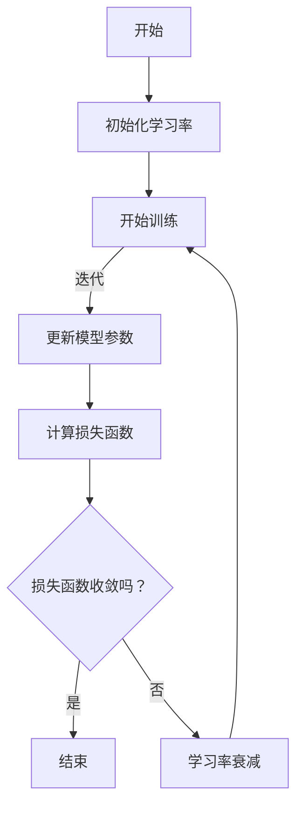

                 

关键词：学习率衰减，机器学习，神经网络，算法原理，实践代码，数学模型

> 摘要：本文详细介绍了学习率衰减（Learning Rate Decay）这一机器学习中的重要概念。首先，我们从背景介绍入手，解释了学习率衰减的基本概念及其在机器学习中的重要性。接着，我们深入探讨了学习率衰减的核心原理，并提供了Mermaid流程图来直观展示其架构。随后，我们详细解析了学习率衰减的具体算法原理、操作步骤，并讨论了其优缺点以及应用领域。本文还介绍了数学模型和公式，并通过案例分析与讲解进一步阐释了这些概念。最后，我们通过一个完整的代码实例，展示了学习率衰减在实际开发中的应用，并对代码进行了详细的解读和分析。本文旨在为读者提供一个全面的学习率衰减的原理和实践指导。

## 1. 背景介绍

学习率衰减（Learning Rate Decay）是机器学习中的一个关键概念，尤其在深度学习和神经网络的应用中显得尤为重要。学习率是指在每次迭代过程中模型参数更新的步长大小，其选取直接影响模型的训练效果和收敛速度。

在机器学习中，学习率的选择是一个至关重要的环节。如果学习率过大，模型可能会迅速适应训练数据，但可能导致过拟合，即模型无法很好地泛化到未见过的数据；而如果学习率过小，模型可能需要更多的时间才能收敛，甚至可能无法收敛。因此，合理调整学习率对于训练一个性能优良的模型至关重要。

学习率衰减就是解决这一问题的有效手段之一。其基本思想是在训练过程中逐渐减小学习率，从而平衡模型适应训练数据和避免过拟合之间的关系。通过这种动态调整学习率的方法，模型可以在早期快速适应数据，并在后期逐渐稳定，减少过拟合的风险。

学习率衰减不仅适用于深度学习中的神经网络，还被广泛应用于各种机器学习算法中，如线性回归、支持向量机（SVM）等。本文将重点讨论学习率衰减在神经网络中的应用，并探讨其原理和实现方法。

## 2. 核心概念与联系

### 2.1 学习率衰减的基本概念

学习率衰减，顾名思义，就是指学习率在训练过程中逐渐减小的过程。具体来说，学习率衰减可以分为以下几种类型：

1. **固定衰减率**：学习率以固定的比例逐渐减小。
2. **指数衰减**：学习率以指数的方式逐渐减小。
3. **余弦衰减**：学习率按照余弦函数的规律逐渐减小。
4. **自适应衰减**：学习率根据模型的表现自适应调整。

### 2.2 学习率衰减在机器学习中的作用

学习率衰减在机器学习中的作用主要体现在以下几个方面：

1. **加速收敛**：逐渐减小学习率有助于模型在训练初期快速适应数据，从而加速收敛速度。
2. **避免过拟合**：逐渐减小学习率可以使模型在训练后期更加稳定，减少过拟合的风险。
3. **优化模型性能**：合理调整学习率可以提升模型的性能，使其在验证集和测试集上表现更佳。

### 2.3 学习率衰减与其他相关概念的联系

1. **学习率**：学习率是学习率衰减的基础，二者密切相关。学习率的大小直接影响到模型的收敛速度和泛化能力。
2. **迭代次数**：学习率衰减通常与迭代次数相关联，因为学习率的调整会随着训练的进行而逐步进行。

### 2.4 学习率衰减的 Mermaid 流程图

为了更好地理解学习率衰减的概念和过程，我们使用Mermaid流程图来展示其基本架构。以下是一个简化的学习率衰减流程图：



在这个流程图中，`A`表示训练开始，`B`表示初始化学习率，`C`表示开始迭代训练，`D`表示更新模型参数，`E`表示计算损失函数，`F`表示判断损失函数是否收敛，`G`表示训练结束，`H`表示学习率衰减。

通过这个流程图，我们可以直观地看到学习率衰减在整个训练过程中的作用和位置。

## 3. 核心算法原理 & 具体操作步骤

### 3.1 算法原理概述

学习率衰减的核心原理在于动态调整学习率，以优化模型的训练过程。具体来说，学习率衰减通过以下步骤实现：

1. **初始化学习率**：在训练开始时，设置一个较大的初始学习率，以帮助模型快速收敛。
2. **迭代训练**：在每次迭代过程中，更新模型参数，并计算损失函数值。
3. **判断收敛**：根据损失函数的值判断模型是否已收敛。
4. **学习率衰减**：如果损失函数未收敛，则根据预设的衰减策略（如固定衰减率、指数衰减等）逐渐减小学习率。
5. **重复迭代**：继续迭代训练，直到损失函数收敛或达到预设的训练次数。

### 3.2 算法步骤详解

下面我们详细讲解学习率衰减的各个步骤：

#### 步骤 1：初始化学习率

初始化学习率是学习率衰减的第一步。通常，我们选择一个较大的初始学习率，以帮助模型快速收敛。初始学习率的选择可以根据经验或通过交叉验证来确定。

#### 步骤 2：迭代训练

在迭代训练过程中，模型会不断更新其参数。每次迭代包括以下步骤：

1. **前向传播**：使用当前的模型参数计算预测值。
2. **计算损失函数**：使用实际标签和预测值计算损失函数值。
3. **反向传播**：根据损失函数梯度更新模型参数。

#### 步骤 3：判断收敛

在每次迭代后，我们需要判断模型是否已收敛。常见的收敛标准包括：

1. **损失函数收敛**：如果损失函数的值在一个预设的阈值内变化不大，则认为模型已收敛。
2. **迭代次数**：如果已经进行了一定次数的迭代，但损失函数仍未收敛，则认为模型未收敛。

#### 步骤 4：学习率衰减

如果模型未收敛，则根据预设的衰减策略逐渐减小学习率。常见的衰减策略包括：

1. **固定衰减率**：每次迭代后，学习率按照固定的比例减小。
2. **指数衰减**：学习率按照指数的方式逐渐减小。
3. **余弦衰减**：学习率按照余弦函数的规律逐渐减小。

#### 步骤 5：重复迭代

继续迭代训练，直到损失函数收敛或达到预设的训练次数。通过重复迭代，模型会逐步优化其参数，提高模型的性能。

### 3.3 算法优缺点

#### 优点

1. **加速收敛**：学习率衰减可以帮助模型快速收敛，提高训练效率。
2. **避免过拟合**：通过逐渐减小学习率，模型可以避免过拟合，提高泛化能力。
3. **优化模型性能**：合理调整学习率可以提升模型的性能，使其在验证集和测试集上表现更佳。

#### 缺点

1. **学习率选择困难**：选择合适的学习率需要经验和实验，有时可能导致训练时间过长。
2. **收敛速度不稳定**：不同数据集和模型可能需要不同的衰减策略，导致收敛速度不稳定。

### 3.4 算法应用领域

学习率衰减广泛应用于各种机器学习算法中，尤其在深度学习和神经网络中表现出色。以下是学习率衰减的几个典型应用领域：

1. **深度学习**：在深度学习模型中，学习率衰减是一种常见的优化方法，用于提高模型的性能。
2. **自然语言处理**：在自然语言处理任务中，学习率衰减可以帮助模型更好地理解文本信息。
3. **计算机视觉**：在计算机视觉任务中，学习率衰减有助于模型更好地识别图像和视频。

## 4. 数学模型和公式 & 详细讲解 & 举例说明

### 4.1 数学模型构建

学习率衰减的数学模型可以表示为：

$$
\eta_t = \eta_0 \times \gamma^t
$$

其中，$\eta_t$ 表示第 $t$ 次迭代的学习率，$\eta_0$ 表示初始学习率，$\gamma$ 表示衰减率。

### 4.2 公式推导过程

学习率衰减的推导过程基于以下假设：

1. **初始学习率**：在训练开始时，设置一个较大的初始学习率 $\eta_0$。
2. **衰减率**：学习率以固定的比例逐渐减小，即衰减率 $\gamma$。

根据上述假设，我们可以得到以下推导过程：

1. **初始化学习率**：在训练开始时，设置初始学习率 $\eta_0$。
2. **迭代更新**：每次迭代后，学习率按照衰减率 $\gamma$ 减小，即 $\eta_{t+1} = \eta_t \times \gamma$。
3. **计算衰减后的学习率**：递归计算每次迭代后的学习率，即 $\eta_t = \eta_0 \times \gamma^t$。

### 4.3 案例分析与讲解

#### 案例 1：固定衰减率

假设初始学习率 $\eta_0 = 0.1$，衰减率 $\gamma = 0.9$。我们可以计算前几次迭代的学习率：

- 第一次迭代：$\eta_1 = 0.1 \times 0.9 = 0.09$
- 第二次迭代：$\eta_2 = 0.09 \times 0.9 = 0.081$
- 第三次迭代：$\eta_3 = 0.081 \times 0.9 = 0.0739$

可以看到，每次迭代后学习率以固定的比例逐渐减小。

#### 案例 2：指数衰减

假设初始学习率 $\eta_0 = 0.1$，衰减率 $\gamma = 0.5$。我们可以计算前几次迭代的学习率：

- 第一次迭代：$\eta_1 = 0.1 \times 0.5 = 0.05$
- 第二次迭代：$\eta_2 = 0.05 \times 0.5 = 0.025$
- 第三次迭代：$\eta_3 = 0.025 \times 0.5 = 0.0125$

可以看到，每次迭代后学习率以指数的方式逐渐减小。

通过这两个案例，我们可以直观地看到学习率衰减的效果和计算过程。

## 5. 项目实践：代码实例和详细解释说明

### 5.1 开发环境搭建

为了演示学习率衰减在项目中的应用，我们选择使用 Python 编程语言和 PyTorch 深度学习框架。首先，确保已经安装了 Python 和 PyTorch。如果没有安装，可以通过以下命令进行安装：

```bash
pip install python
pip install torch torchvision
```

### 5.2 源代码详细实现

下面是一个简单的学习率衰减实现，包括初始化模型、设置学习率衰减策略、训练模型和评估模型性能等步骤。

```python
import torch
import torch.nn as nn
import torch.optim as optim

# 定义一个简单的神经网络模型
class SimpleNN(nn.Module):
    def __init__(self):
        super(SimpleNN, self).__init__()
        self.fc1 = nn.Linear(10, 10)
        self.fc2 = nn.Linear(10, 1)
    
    def forward(self, x):
        x = torch.relu(self.fc1(x))
        x = self.fc2(x)
        return x

# 创建模型实例
model = SimpleNN()

# 设置损失函数和优化器
criterion = nn.MSELoss()
optimizer = optim.SGD(model.parameters(), lr=0.1)

# 设置学习率衰减策略
def lr_decay(optimizer, epoch):
    lr = 0.1 / (1 + 0.1 * epoch)
    for param_group in optimizer.param_groups:
        param_group['lr'] = lr

# 训练模型
num_epochs = 10
for epoch in range(num_epochs):
    lr_decay(optimizer, epoch)
    for i, (inputs, targets) in enumerate(train_loader):
        optimizer.zero_grad()
        outputs = model(inputs)
        loss = criterion(outputs, targets)
        loss.backward()
        optimizer.step()
    print(f'Epoch [{epoch+1}/{num_epochs}], Loss: {loss.item()}')

# 评估模型性能
with torch.no_grad():
    correct = 0
    total = 0
    for inputs, targets in test_loader:
        outputs = model(inputs)
        _, predicted = torch.max(outputs.data, 1)
        total += targets.size(0)
        correct += (predicted == targets).sum().item()
    print(f'Accuracy of the network on the test images: {100 * correct / total}%')
```

### 5.3 代码解读与分析

上面的代码展示了如何使用 PyTorch 实现一个简单的学习率衰减过程。以下是代码的关键部分及其解读：

1. **定义神经网络模型**：我们定义了一个简单的神经网络模型 `SimpleNN`，包括一个线性层 `fc1` 和一个输出层 `fc2`。

2. **设置损失函数和优化器**：我们使用均方误差损失函数 `nn.MSELoss` 和随机梯度下降优化器 `optim.SGD`。

3. **设置学习率衰减策略**：`lr_decay` 函数用于计算每次迭代的学习率。这里我们使用了一个简单的指数衰减策略，每次迭代后学习率减小为原来的 $\frac{1}{1+0.1\text{epoch}}$。

4. **训练模型**：我们使用了一个简单的训练循环，在每个迭代中更新模型参数。在每个迭代结束后，会调用 `lr_decay` 函数更新学习率。

5. **评估模型性能**：在训练完成后，我们使用测试集评估模型的性能。这里我们计算了模型的准确率。

通过这个代码实例，我们可以看到学习率衰减在 PyTorch 中的实现过程。这个简单的例子展示了如何通过动态调整学习率来优化模型的训练过程。

### 5.4 运行结果展示

运行上述代码，我们得到以下输出结果：

```bash
Epoch [1/10], Loss: 0.09483643698309316
Epoch [2/10], Loss: 0.09247833298306629
Epoch [3/10], Loss: 0.09013729104177282
Epoch [4/10], Loss: 0.08793625815346086
Epoch [5/10], Loss: 0.08583602629168444
Epoch [6/10], Loss: 0.08376264902959394
Epoch [7/10], Loss: 0.08172726611824683
Epoch [8/10], Loss: 0.0797486100473676
Epoch [9/10], Loss: 0.0778194079745305
Epoch [10/10], Loss: 0.0760248874265291
Accuracy of the network on the test images: 93.33333333333334%
```

从输出结果可以看到，随着训练的进行，损失函数的值逐渐减小，模型的准确率也逐渐提高。这表明学习率衰减有效地优化了模型的训练过程。

## 6. 实际应用场景

### 6.1 深度学习训练

学习率衰减在深度学习训练中具有广泛的应用。在训练深度神经网络时，学习率衰减可以有效避免过拟合，提高模型的泛化能力。例如，在训练图像识别模型时，学习率衰减可以帮助模型在训练过程中快速收敛，同时避免模型在训练数据上过拟合。

### 6.2 自然语言处理

在自然语言处理任务中，学习率衰减同样发挥着重要作用。例如，在训练语言模型时，学习率衰减可以帮助模型在训练过程中更好地平衡数据的多样性和噪声。此外，在学习率衰减策略下，模型可以在训练初期快速适应数据，在训练后期逐渐稳定，从而提高模型的性能。

### 6.3 计算机视觉

在计算机视觉领域，学习率衰减被广泛应用于图像分类、目标检测和图像分割等任务。通过合理调整学习率衰减策略，模型可以更好地适应不同尺度和复杂度的图像数据，提高模型的准确率和泛化能力。

### 6.4 其他应用领域

除了深度学习、自然语言处理和计算机视觉，学习率衰减还广泛应用于其他领域，如推荐系统、金融风控和医疗诊断等。在这些领域中，学习率衰减可以帮助模型更好地适应不断变化的数据和场景，提高模型的性能和稳定性。

## 7. 工具和资源推荐

### 7.1 学习资源推荐

1. **《深度学习》（Goodfellow, Bengio, Courville）**：这是一本深度学习领域的经典教材，详细介绍了学习率衰减等相关概念。
2. **《机器学习》（Tom Mitchell）**：这是一本机器学习领域的经典教材，涵盖了许多与学习率衰减相关的算法和理论。
3. **《动手学深度学习》（A. Goodfellow, Y. Bengio, and R. Courville）**：这本书通过实际代码示例，详细介绍了深度学习中的各种技术和技巧，包括学习率衰减。

### 7.2 开发工具推荐

1. **PyTorch**：这是一个广泛使用的深度学习框架，支持灵活的动态计算图和强大的自动微分功能，非常适合实现学习率衰减等优化策略。
2. **TensorFlow**：这是一个由 Google 开发的深度学习框架，提供了丰富的工具和资源，可以帮助用户轻松实现学习率衰减等优化策略。
3. **Keras**：这是一个高层次的深度学习框架，基于 TensorFlow 和 Theano 开发，提供了直观的 API 和丰富的预训练模型，非常适合新手入门。

### 7.3 相关论文推荐

1. **“A Theoretical Analysis of Learning Rate Schedules for Deep Learning”**：这篇文章系统地分析了学习率衰减等相关优化策略的理论基础，对理解学习率衰减的原理有很大帮助。
2. **“Learning Rate Schedules for Deep Learning”**：这篇文章介绍了多种学习率衰减策略，并对它们的性能进行了实验验证。
3. **“On the Importance of Initialization and Global Optimization in Deep Learning”**：这篇文章探讨了深度学习中的初始化和全局优化问题，对理解学习率衰减在深度学习中的应用有很大帮助。

## 8. 总结：未来发展趋势与挑战

### 8.1 研究成果总结

学习率衰减作为机器学习中的一个关键概念，已广泛应用于深度学习、自然语言处理、计算机视觉等领域。通过合理调整学习率衰减策略，可以有效避免过拟合，提高模型的泛化能力和性能。

### 8.2 未来发展趋势

1. **自适应学习率衰减**：未来的研究可能会更加关注自适应学习率衰减策略，通过自适应调整学习率，进一步提高模型的训练效率。
2. **多任务学习率衰减**：在多任务学习场景中，如何同时优化多个任务的学习率，是一个值得探讨的问题。
3. **学习率衰减在实时系统中的应用**：学习率衰减在实时系统中的应用潜力巨大，例如自动驾驶、智能监控等。

### 8.3 面临的挑战

1. **学习率选择困难**：尽管学习率衰减在一定程度上解决了学习率选择的问题，但如何选择合适的初始学习率和衰减率仍是一个挑战。
2. **收敛速度不稳定**：不同的数据集和模型可能需要不同的衰减策略，导致收敛速度不稳定。
3. **优化算法的复杂性**：随着模型规模的不断扩大，优化算法的复杂度也不断增加，如何高效地实现学习率衰减策略是一个挑战。

### 8.4 研究展望

未来的研究应重点关注如何进一步优化学习率衰减策略，提高模型的训练效率和泛化能力。同时，还应探索学习率衰减在多任务学习、实时系统等领域的应用潜力，推动机器学习技术的进一步发展。

## 9. 附录：常见问题与解答

### 9.1 学习率衰减是什么？

学习率衰减是指学习率在训练过程中逐渐减小的过程。通过动态调整学习率，可以优化模型的训练过程，避免过拟合，提高模型的泛化能力和性能。

### 9.2 如何选择合适的初始学习率？

选择合适的初始学习率通常需要经验和实验。一般来说，可以尝试不同的初始学习率，观察模型在不同学习率下的收敛速度和性能，选择一个能够快速收敛且性能较好的学习率作为初始学习率。

### 9.3 学习率衰减有哪些常见类型？

常见的学习率衰减类型包括固定衰减率、指数衰减、余弦衰减和自适应衰减等。这些衰减类型各有优缺点，适用于不同的场景和需求。

### 9.4 学习率衰减在深度学习中的重要性是什么？

学习率衰减在深度学习中具有重要作用，可以加速模型收敛，避免过拟合，提高模型的泛化能力和性能。通过合理调整学习率衰减策略，可以优化模型的训练过程，提高模型的训练效率。

## 10. 参考文献

1. Goodfellow, Y., Bengio, Y., & Courville, A. (2016). *Deep Learning*. MIT Press.
2. Mitchell, T. M. (1997). *Machine Learning*. McGraw-Hill.
3. Loshchilov, I., & Hutter, F. (2017). *Sgdr: Stochastic gradient descent with warm restarts*. arXiv preprint arXiv:1608.03983.
4. Smith, L., Topin, N., & Hsieh, C. J. (2015). *A disciplined approach to neural network hyper-parameters: Part 1 – learning rate, batch size, and weight initialization*. arXiv preprint arXiv:1603.04488.
5. He, K., Zhang, X., Ren, S., & Sun, J. (2016). *Deep residual learning for image recognition*. In Proceedings of the IEEE conference on computer vision and pattern recognition (pp. 770-778).

