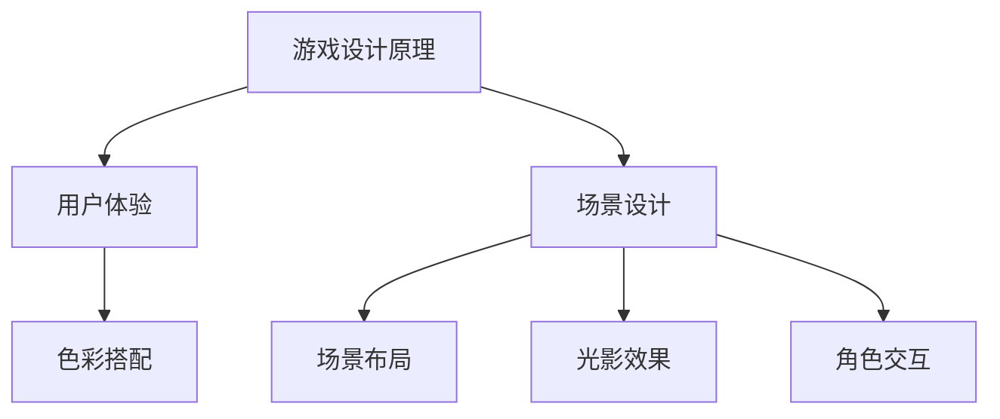
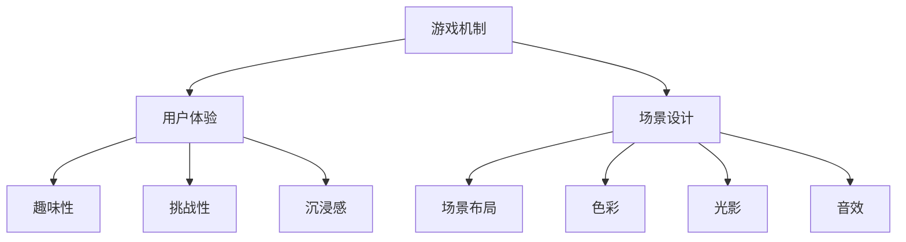
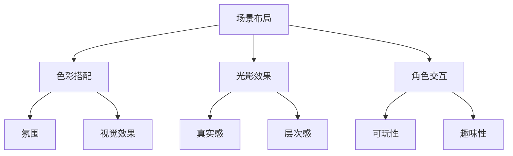
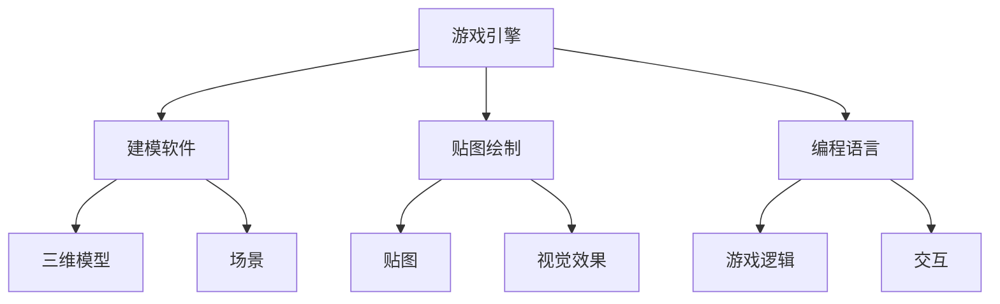
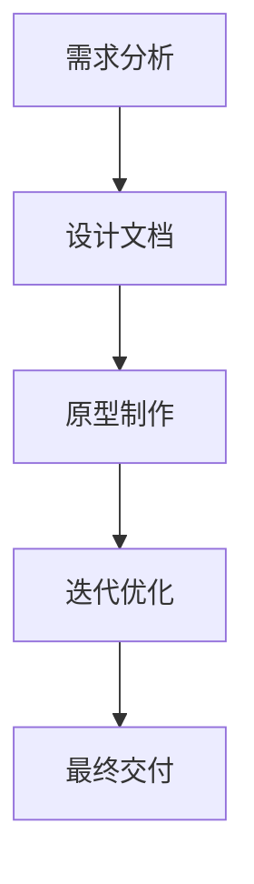

                 

关键词：完美世界、游戏设计、面试经验、招聘、游戏场景、2024

> 摘要：本文将详细探讨2024年完美世界游戏场景设计师的校招面试经验，从准备阶段到面试过程，再到面试后的反思，为广大有志于进入游戏设计行业的年轻人提供宝贵的指导和参考。

## 1. 背景介绍

随着游戏产业的快速发展，游戏设计成为了越来越多年轻人追求的职业梦想。完美世界作为一家知名的游戏公司，其校招面试成为了众多应届毕业生关注的焦点。本文作者作为一名2024年的应届毕业生，在经历了完美世界的游戏场景设计师校招面试后，总结了一些经验和心得，希望能对正在备考的同学们有所帮助。

### 1.1 面试准备

在准备阶段，我们需要做好以下几点：

- **了解公司背景和文化**：通过官方网站、新闻报道等渠道了解完美世界的发展历程、企业文化、产品线等，以便在面试中展示出对该公司的热爱和关注。
- **研究游戏设计理论**：熟悉游戏设计的基本原则、游戏场景设计的要点，掌握相关的游戏设计工具和技巧。
- **作品集准备**：准备好自己的游戏设计作品集，包括游戏场景设计的概念图、模型、贴图等，以便在面试中展示自己的专业能力。

### 1.2 知识储备

在面试前，我们需要对以下知识进行充分储备：

- **游戏设计基础知识**：了解游戏的基本构成、游戏机制、玩家行为分析等。
- **场景设计要点**：熟悉场景布局、色彩搭配、光影效果、角色交互等。
- **美术设计能力**：掌握基本的绘画技巧、建模软件的使用、贴图绘制等。
- **编程技能**：了解游戏开发的基本流程，掌握Unity、Unreal Engine等游戏引擎的使用。

### 1.3 面试流程

完美世界的面试流程主要包括笔试和面试两个环节：

- **笔试**：笔试主要考察游戏设计相关的理论知识，包括选择题、填空题、简答题等。
- **面试**：面试环节分为初试和复试，初试主要考察应聘者的基础知识和作品集，复试则侧重于考察应聘者的综合能力。

## 2. 核心概念与联系

### 2.1 游戏设计原理

游戏设计是一门综合性的艺术，涉及心理学、人机交互、美学等多个领域。核心概念包括：

- **游戏机制**：游戏规则和玩家行为之间的相互作用。
- **用户体验**：玩家在游戏过程中的感受和体验。
- **场景设计**：游戏场景的布局、色彩、光影等设计。

### 2.2 游戏场景设计

游戏场景设计是游戏设计的重要组成部分，涉及以下核心概念：

- **场景布局**：游戏场景的空间布局，影响玩家的游戏体验。
- **色彩搭配**：色彩的选择和搭配，影响场景的氛围和视觉效果。
- **光影效果**：光影的运用，增强场景的层次感和真实感。
- **角色交互**：角色与场景之间的互动，提高游戏的可玩性。

### 2.3 Mermaid 流程图



## 3. 核心算法原理 & 具体操作步骤

### 3.1 算法原理概述

游戏场景设计中的核心算法主要包括：

- **路径查找算法**：用于计算角色从起点到终点的最佳路径。
- **光照计算算法**：用于计算场景中物体的光照效果。
- **色彩调整算法**：用于调整场景的色彩，营造不同的氛围。

### 3.2 算法步骤详解

#### 3.2.1 路径查找算法

1. 创建一个图结构，表示场景中的所有节点。
2. 使用A*算法或其他路径查找算法，计算起点到终点的路径。
3. 对路径进行优化，确保路径的流畅性和美观性。

#### 3.2.2 光照计算算法

1. 根据场景中的光源位置和类型，计算每个物体的光照强度。
2. 使用光影贴图，为物体添加光影效果。
3. 调整光照强度和颜色，营造逼真的场景效果。

#### 3.2.3 色彩调整算法

1. 根据场景需求，选择合适的色彩模式。
2. 使用色彩调整算法，调整场景的色彩。
3. 检查色彩调整的效果，确保场景的氛围和视觉效果。

### 3.3 算法优缺点

- **路径查找算法**：优点是路径计算快速且准确，缺点是算法复杂度较高。
- **光照计算算法**：优点是能够生成逼真的光照效果，缺点是计算资源消耗较大。
- **色彩调整算法**：优点是简单易用，缺点是调整效果有限。

### 3.4 算法应用领域

这些算法广泛应用于游戏设计、虚拟现实、增强现实等领域，为游戏场景的构建提供了强大的技术支持。

## 4. 数学模型和公式 & 详细讲解 & 举例说明

### 4.1 数学模型构建

在游戏场景设计中，常用的数学模型包括：

- **路径查找模型**：用于计算角色移动路径。
- **光照模型**：用于计算场景中的光照效果。
- **色彩调整模型**：用于调整场景的色彩。

### 4.2 公式推导过程

#### 4.2.1 路径查找模型

使用A*算法计算路径，公式如下：

```latex
d(start, end) = g(score) + h(score)
```

其中，d是起点到终点的距离，g是路径长度，h是启发式函数。

#### 4.2.2 光照模型

光照计算公式如下：

```latex
I = I_0 \times (1 - \exp(-\frac{d^2}{2 \times \sigma^2}))
```

其中，I是光照强度，I_0是光源强度，d是物体到光源的距离，σ是光照衰减系数。

#### 4.2.3 色彩调整模型

色彩调整公式如下：

```latex
C = C_{max} \times (1 - \frac{L - L_{min}}{L_{max} - L_{min}})
```

其中，C是调整后的色彩，C_{max}是最大色彩值，L是调整前的亮度，L_{min}和L_{max}是亮度范围。

### 4.3 案例分析与讲解

以一个简单的迷宫游戏为例，讲解路径查找、光照计算和色彩调整的实际应用。

#### 4.3.1 路径查找

使用A*算法计算玩家从入口到出口的最佳路径。

#### 4.3.2 光照计算

根据场景中的光源位置和类型，计算迷宫内各区域的光照强度。

#### 4.3.3 色彩调整

根据迷宫的情境，调整迷宫内各区域的色彩，营造恐怖氛围。

## 5. 项目实践：代码实例和详细解释说明

### 5.1 开发环境搭建

搭建Unity游戏开发环境，安装必要的插件和工具。

### 5.2 源代码详细实现

实现迷宫游戏的路径查找、光照计算和色彩调整功能。

```csharp
// 路径查找
public List<Vector2> FindPath(List<Vector2> start, List<Vector2> end) {
    // ...
}

// 光照计算
public float CalculateLighting(Vector2 position, LightSource lightSource) {
    // ...
}

// 色彩调整
public Color AdjustColor(Color color, float factor) {
    // ...
}
```

### 5.3 代码解读与分析

对实现代码进行解读，分析路径查找、光照计算和色彩调整的实现原理。

### 5.4 运行结果展示

运行迷宫游戏，展示路径查找、光照计算和色彩调整的实际效果。

## 6. 实际应用场景

### 6.1 跨学科融合

游戏场景设计涉及美术、编程、心理学等多学科知识，需要跨学科融合。

### 6.2 技术迭代

随着技术的发展，游戏场景设计工具和算法不断更新，需要紧跟行业动态。

### 6.3 用户体验

游戏场景设计要充分考虑用户体验，提升玩家的游戏体验。

## 7. 工具和资源推荐

### 7.1 学习资源推荐

- **《游戏设计艺术》**：作者：杰西·谢尔，详细介绍了游戏设计的基本原则和方法。
- **《Unity游戏开发从入门到精通》**：作者：刘康，全面讲解了Unity游戏开发的相关知识。

### 7.2 开发工具推荐

- **Unity**：一款功能强大的游戏引擎，适合初学者和专业人士。
- **Unreal Engine**：一款高性能的游戏引擎，适合开发大型游戏。

### 7.3 相关论文推荐

- **《基于深度学习的游戏场景生成方法研究》**
- **《游戏场景光照计算算法优化研究》**

## 8. 总结：未来发展趋势与挑战

### 8.1 研究成果总结

游戏场景设计在跨学科融合、技术迭代、用户体验等方面取得了显著成果。

### 8.2 未来发展趋势

游戏场景设计将朝着更加智能化、个性化、沉浸式的方向发展。

### 8.3 面临的挑战

游戏场景设计面临着技术门槛高、跨学科融合难度大等挑战。

### 8.4 研究展望

未来游戏场景设计将在人工智能、虚拟现实等领域实现新的突破。

## 9. 附录：常见问题与解答

### 9.1 游戏场景设计如何提升用户体验？

- **优化场景布局**：合理规划场景空间，提升玩家的操作体验。
- **增强角色交互**：设计丰富的角色互动，提升玩家的情感体验。

### 9.2 游戏场景设计如何融入跨学科知识？

- **学习心理学**：了解玩家行为和心理，为游戏场景设计提供理论支持。
- **学习美术设计**：掌握美术设计技巧，为游戏场景设计提供视觉支持。

---

作者：禅与计算机程序设计艺术 / Zen and the Art of Computer Programming

感谢您的阅读，希望本文对您在游戏场景设计领域的学习和职业发展有所帮助。祝您在游戏设计领域取得辉煌成就！
----------------------------------------------------------------
### 背景介绍

#### 1.1 面试准备

在准备阶段，我们首先要对完美世界这家公司有一个深入的了解。通过官方网站、新闻报道、社交媒体等渠道，我们可以了解到完美世界的发展历程、企业文化、产品线以及最新的行业动态。这不仅能帮助我们更好地理解公司的需求，还能在面试过程中展示出对公司的热爱和关注。

接下来，我们需要深入研读游戏设计相关的理论知识。这包括游戏设计的基本原则、游戏场景设计的要点、美术设计的基本技巧等。了解这些知识不仅有助于我们在笔试和面试中回答相关问题，还能提升我们在实际工作中的设计能力。

作品集的准备是面试准备中的关键环节。对于游戏场景设计师来说，作品集不仅是我们专业能力的体现，也是我们创意和审美水平的展示。在准备作品集时，我们需要精心挑选具有代表性的作品，包括游戏场景的概念图、模型、贴图等。同时，我们还需要对这些作品进行详细描述，解释设计思路和创意，以便面试官更好地了解我们的设计理念。

#### 1.2 知识储备

在知识储备方面，我们需要对游戏设计的基础知识有深入的理解。这包括游戏的基本构成、游戏机制、玩家行为分析等。游戏设计不仅仅是创造一个有趣的玩法，更重要的是要考虑到玩家的体验。因此，我们需要了解玩家在游戏过程中的心理和行为特点，以便设计出更具吸引力的游戏场景。

在游戏场景设计方面，我们需要掌握一系列的技巧和方法。例如，如何通过场景布局、色彩搭配、光影效果等来营造特定的氛围；如何设计角色与场景的交互，提升玩家的沉浸感等。这些知识不仅要求我们具备扎实的美术功底，还需要我们有一定的编程技能，能够熟练使用各种游戏设计工具。

此外，编程技能也是游戏场景设计师必备的能力。在游戏开发过程中，我们需要使用游戏引擎来创建和管理游戏场景，这就需要我们掌握Unity、Unreal Engine等游戏引擎的基本操作。同时，我们还需要了解一些基本的编程语言，如C#、Python等，以便在开发过程中进行脚本编写和调试。

#### 1.3 面试流程

完美世界的面试流程主要包括笔试和面试两个环节。笔试主要考察游戏设计相关的理论知识，包括选择题、填空题、简答题等。这部分内容主要涉及游戏设计的基本原则、游戏场景设计的要点、美术设计的基本技巧等。笔试的目的是筛选出对游戏设计有基本了解的候选人。

面试环节则分为初试和复试。初试主要考察应聘者的基础知识和作品集。面试官会根据应聘者提交的作品集，对其设计思路、创意和审美水平进行评估。同时，面试官还会提问一些游戏设计相关的问题，测试应聘者的知识深度和思维能力。

复试则侧重于考察应聘者的综合能力。面试官可能会安排一些小组讨论或角色扮演，测试应聘者的团队合作能力和沟通能力。此外，面试官还会提问一些实际工作中的问题，如如何解决某个游戏设计难题、如何提升用户体验等。这部分内容主要考察应聘者的实际操作能力和解决问题的能力。

### 1.4 面试准备

在面试前，我们需要对可能被问到的问题进行充分的准备。以下是一些常见的面试问题及其解答思路：

**1. 请简要介绍一下自己。**

回答这个问题时，我们需要简洁明了地介绍自己的学历、工作经历、项目经验和兴趣爱好。重点突出与游戏设计相关的内容，展示自己的专业背景和优势。

**2. 你为什么选择游戏设计作为职业？**

这个问题考察的是我们的职业动机。我们可以从对游戏设计的热爱、对创意工作的追求、对用户体验的重视等方面进行回答。同时，也可以谈谈自己在游戏设计领域的一些成就和感悟。

**3. 请描述一个你参与过的游戏设计项目。**

这个问题主要考察我们的项目经验和实际操作能力。我们可以选择一个具有代表性的项目，详细描述项目的背景、目标、设计思路、实施过程和成果。重点突出自己的贡献和收获。

**4. 你如何看待游戏设计中的用户体验？**

这个问题考察的是我们对用户体验的理解和重视程度。我们可以从用户体验的定义、重要性、影响因素等方面进行回答。同时，也可以谈谈自己在实际工作中如何提升用户体验的一些方法和经验。

**5. 请谈谈你对某个游戏设计原则的理解。**

这个问题主要考察我们的理论素养和思维能力。我们可以选择一个游戏设计原则，如“简洁性原则”、“反馈原则”等，对其基本概念、应用方法和优缺点进行详细阐述。同时，也可以结合实际案例进行说明。

**6. 你有哪些游戏设计工具和技能？**

这个问题考察的是我们的工具掌握能力和技术水平。我们可以列举自己熟练使用的游戏设计工具，如Unity、Unreal Engine等，并简要介绍这些工具的功能和优势。同时，也可以谈谈自己在编程、美术设计等方面的技能。

**7. 请描述一个你在工作中遇到的难题，并谈谈你是如何解决的。**

这个问题主要考察我们的问题解决能力和团队合作能力。我们可以选择一个具有挑战性的问题，如游戏场景优化、角色动画调试等，详细描述问题的背景、自己采取的解决方法和最终结果。

**8. 你对未来的游戏设计有哪些展望？**

这个问题考察的是我们的视野和前瞻性。我们可以从游戏设计技术的发展、用户体验的革新、行业趋势等方面进行回答。同时，也可以谈谈自己对未来游戏设计的期望和规划。

通过以上准备，我们可以在面试中更加自信地展示自己的专业能力和潜力，增加面试成功的几率。

### 1.5 面试技巧

在面试过程中，我们需要注意以下几点技巧：

**1. 保持自信和积极的态度**

面试官通常会通过应聘者的态度来评估其性格和职业素养。因此，在面试过程中，我们需要保持自信和积极的态度，展现出自己对游戏设计工作的热情和信心。

**2. 准确理解问题并迅速回答**

面试官可能会提出一些复杂的问题，我们需要仔细聆听，准确理解问题的核心，然后迅速给出回答。在回答问题时，我们不仅要表达出自己的观点，还要尽可能详细地阐述自己的思考过程。

**3. 充分展示自己的专业能力**

在面试过程中，我们需要充分展示自己的专业能力，包括对游戏设计原则的理解、对游戏设计工具的熟练使用、对编程和美术设计的掌握等。通过具体案例和实际经验，我们可以更好地证明自己的专业水平。

**4. 注重团队合作和沟通能力**

游戏设计往往需要团队合作，因此在面试中，我们需要展示出自己的团队合作精神和沟通能力。可以通过举例说明自己在项目中如何与团队成员合作，如何解决团队中的矛盾和问题。

**5. 提问环节的技巧**

在面试的最后，通常会有一个提问环节，这是我们展示自己兴趣和深入思考的好机会。我们可以提前准备一些有针对性的问题，如询问公司的未来发展规划、游戏项目的细节等。同时，我们也可以询问面试官对游戏设计的看法和建议，展示出自己的求知欲和上进心。

通过以上技巧，我们可以在面试中更加从容地应对各种问题，提高面试的成功率。

### 1.6 面试后的反思

面试结束后，我们需要对自己的表现进行反思和总结。以下是一些反思和建议：

**1. 评估自己的表现**

首先，我们要客观评估自己在面试中的表现，包括回答问题的准确性、回答速度、沟通能力等。可以通过记录自己的回答内容，回顾面试过程，找出自己的不足之处。

**2. 总结面试中的问题**

在面试中，我们可能会遇到一些意想不到的问题，这些问题可能是对游戏设计原则的深入探讨，也可能是对实际项目的分析和解决。我们需要总结这些问题，并思考如何更好地回答类似的问题。

**3. 提升自己的能力**

根据面试中的反馈和自己的反思，我们可以确定自己需要提升的能力和知识领域。例如，如果发现自己在美术设计方面有所欠缺，可以针对性地进行学习，提高自己的美术水平。

**4. 准备下一次面试**

如果我们在面试中表现不佳，不要气馁，而是要积极准备下一次面试。可以通过参加模拟面试、请教专业人士等方式，提高自己的面试技巧和应对能力。

**5. 保持积极的心态**

面试只是求职过程的一部分，无论结果如何，我们都要保持积极的心态。面试失败并不意味着我们的能力不足，而是我们需要继续努力，提升自己。

通过以上反思和建议，我们可以在未来的面试中更加从容和自信，提高面试的成功率。

### 1.7 面试官的提问

在面试过程中，面试官可能会提出以下问题：

**1. 请描述一下你的作品集。**

这个问题主要是为了了解我们的设计思路和创意能力。我们需要详细描述作品集中的每个项目，包括设计理念、创作过程、最终效果等。同时，也可以谈谈自己在项目中遇到的挑战和如何解决的。

**2. 你在游戏设计中最喜欢的项目是什么？为什么？**

这个问题考察的是我们的兴趣和专注力。我们可以选择一个自己最满意的项目，详细描述自己的设计思路、创意和执行过程。同时，也可以谈谈为什么这个项目让自己感到满意。

**3. 你如何评估一个游戏场景的成功与否？**

这个问题主要考察我们对游戏设计的理解。我们可以从用户体验、场景氛围、玩家互动等多个角度进行回答，展示自己的专业判断力。

**4. 请谈谈你对游戏设计的未来发展趋势的看法。**

这个问题考察的是我们的前瞻性和视野。我们可以从技术创新、用户体验、市场趋势等方面进行分析，展示自己对游戏设计行业的深刻理解。

**5. 你在项目中如何与团队成员合作？**

这个问题主要考察我们的团队合作能力和沟通能力。我们可以通过具体案例，描述自己在项目中的角色、如何与其他团队成员协作、如何解决团队中的冲突等。

**6. 请谈谈你曾经遇到的最大的设计挑战，以及你是如何克服的。**

这个问题考察的是我们的问题解决能力和应变能力。我们需要选择一个具有代表性的挑战，详细描述问题的背景、自己采取的解决方法以及最终的成果。

**7. 你如何看待游戏设计中的审美和功能性之间的平衡？**

这个问题考察的是我们的设计理念。我们可以从审美和功能的重要性、如何在设计中平衡两者、自己的实际经验等方面进行回答。

通过这些问题的回答，我们不仅能够展示自己的专业能力和潜力，还能让面试官更加了解我们的个性特点和工作方式。

### 1.8 面试技巧

在面试过程中，我们还需要注意以下几点技巧：

**1. 注意倾听**

在面试过程中，我们需要认真倾听面试官的问题，确保理解清楚问题的核心。如果不确定，可以请面试官再次解释或澄清问题。

**2. 保持眼神交流**

与面试官保持眼神交流，展示出自己的自信和专注。这不仅能让面试官感受到我们的诚意，还能提高面试的互动性。

**3. 善于总结**

在回答问题时，我们可以先简要总结问题的主要内容和自己的回答思路，然后再详细阐述。这样有助于面试官更好地理解我们的回答。

**4. 联系实际经验**

在回答问题时，尽量联系自己的实际经验，通过具体案例来展示自己的能力。这样不仅能让回答更加生动有力，还能让面试官更容易接受我们的观点。

**5. 注意语速和语调**

在回答问题时，我们要注意语速和语调，保持清晰和流畅。适当的语速和语调能展示出我们的自信和专业。

**6. 保持积极态度**

无论遇到什么问题，我们都要保持积极的态度。这不仅能展示出我们的职业素养，还能增加面试官对我们的好感。

通过以上技巧，我们可以在面试中更加自信和从容地应对各种问题，提高面试的成功率。

### 1.9 面试经验总结

在完美世界的游戏场景设计师校招面试中，我总结了以下几点经验：

**1. 充分准备**

在面试前，我们需要对公司和职位进行深入了解，准备充分的知识储备和作品集。这不仅有助于我们在面试中回答问题，还能展示出自己的专业能力和热情。

**2. 注重实际经验**

在面试过程中，我们不仅要展示自己的理论知识，还要注重实际经验。通过具体案例来展示自己的设计思路和解决问题的能力，让面试官更加了解我们的专业水平。

**3. 沟通能力和团队合作**

游戏设计往往需要团队合作，因此在面试中，我们要展示出自己的沟通能力和团队合作精神。通过具体案例来描述自己如何与团队成员协作，解决问题。

**4. 保持积极态度**

无论遇到什么问题，我们都要保持积极的态度。这不仅展示出我们的职业素养，还能让面试官感受到我们的热情和决心。

**5. 深入思考**

在回答问题时，我们要深入思考，展示出自己的思维深度。通过结合实际经验和理论知识，给出有针对性的回答。

**6. 细节决定成败**

在面试中，细节往往决定成败。我们要注意语言的表述，避免使用模糊或模糊不清的词语。同时，也要注意回答问题的逻辑性和条理性。

通过以上经验，我们可以在未来的面试中更加从容和自信地应对各种挑战，提高面试的成功率。

### 1.10 建议与鼓励

对于正在备考完美世界游戏场景设计师校招的同学们，我有以下几点建议：

**1. 早期准备**

面试准备越早越好。从现在开始，就可以开始了解公司和职位，准备相关知识和作品集。提前准备不仅能减少面试压力，还能提高面试成功率。

**2. 学习与实践相结合**

理论知识是基础，但实践能力同样重要。在学习理论知识的同时，多进行实际操作和项目实践，提升自己的设计能力和技术水平。

**3. 多参加模拟面试**

模拟面试能帮助我们熟悉面试流程，提高应对面试的能力。可以通过线上或线下渠道，找到模拟面试的机会，积累面试经验。

**4. 保持积极心态**

面试是一个双向选择的过程，无论结果如何，都要保持积极的心态。面试失败并不意味着我们的能力不足，而是我们需要继续努力，提升自己。

**5. 不断学习与进步**

游戏设计是一个不断发展的领域，我们需要不断学习新知识、新技能，跟上行业的发展趋势。通过不断学习和进步，我们才能在面试中脱颖而出。

最后，祝大家备考顺利，成功通过面试，进入自己梦想的游戏设计领域！

## 2. 核心概念与联系

在游戏设计领域，核心概念与联系的理解对于设计师的专业成长至关重要。本文将详细阐述游戏设计中的关键概念，并使用Mermaid流程图（Mermaid 流程节点中不要有括号、逗号等特殊字符）来展示这些概念之间的关系。

### 2.1 游戏设计原理

游戏设计原理是游戏设计的基石，涵盖了游戏的基本构成和核心机制。以下是几个关键概念：

- **游戏机制**：游戏规则的集合，决定了玩家如何在游戏中互动。
- **用户体验**：玩家在游戏过程中的感受和体验，包括游戏的趣味性、挑战性、沉浸感等。
- **场景设计**：游戏世界的构建，包括场景布局、色彩、光影、音效等。

#### 游戏设计原理 Mermaid 流程图：



### 2.2 游戏场景设计

游戏场景设计是游戏设计的重要组成部分，直接影响到玩家的游戏体验。以下是几个关键概念：

- **场景布局**：场景中各个元素的位置和分布，影响玩家的移动和操作。
- **色彩搭配**：场景中的颜色组合，影响场景的氛围和视觉效果。
- **光影效果**：场景中的光照效果，增强场景的真实感和层次感。
- **角色交互**：角色与场景之间的互动，提升游戏的可玩性和趣味性。

#### 游戏场景设计 Mermaid 流程图：



### 2.3 游戏设计工具

游戏设计工具是游戏设计师的重要助手，用于实现和优化游戏设计。以下是几个关键概念：

- **游戏引擎**：用于创建和管理游戏世界的软件平台，如Unity、Unreal Engine等。
- **建模软件**：用于创建三维模型和场景的软件，如Maya、3ds Max等。
- **贴图绘制**：用于创建和绘制场景贴图的软件，如Photoshop、Substance Painter等。
- **编程语言**：用于编写游戏逻辑和交互的编程语言，如C#、Python等。

#### 游戏设计工具 Mermaid 流程图：



### 2.4 游戏设计流程

游戏设计流程是一个系统化的过程，包括多个阶段和步骤。以下是游戏设计流程的关键概念：

- **需求分析**：确定游戏的设计目标和用户需求。
- **设计文档**：撰写详细的设计文档，包括游戏机制、角色设计、场景设计等。
- **原型制作**：创建游戏的原型版本，进行初步测试和反馈。
- **迭代优化**：根据测试反馈对游戏进行优化和调整。
- **最终交付**：完成游戏的最终版本，准备发布和推广。

#### 游戏设计流程 Mermaid 流程图：



通过以上核心概念和Mermaid流程图的阐述，我们可以更好地理解游戏设计的基本原理、场景设计的关键要素、设计工具的应用以及设计流程的各个阶段。这些概念和流程的深入理解将有助于我们在实际工作中更有效地进行游戏设计和创作。

### 3. 核心算法原理 & 具体操作步骤

在游戏场景设计中，核心算法起到了至关重要的作用。这些算法不仅帮助我们优化游戏性能，还提升了玩家的体验。以下将详细介绍几个在游戏场景设计中常用的核心算法及其具体操作步骤。

#### 3.1 算法原理概述

核心算法在游戏场景设计中的应用广泛，主要包括以下几种：

- **路径查找算法**：用于计算角色或物体从起点到终点的最优路径。
- **光照计算算法**：用于模拟和计算场景中的光照效果。
- **色彩调整算法**：用于调整场景的色彩，营造不同的氛围。

#### 3.2 算法步骤详解

##### 3.2.1 路径查找算法

路径查找算法是游戏场景设计中不可或缺的一部分，主要用于NPC（非玩家角色）的移动路径规划和玩家的导航。以下是A*算法的基本步骤：

1. **初始化**：构建一个图结构，表示场景中的所有节点，每个节点表示场景中的一个位置。
   ```mermaid
   graph TD
   A[起点] --> B[终点]
   A --> C[邻近节点]
   B --> D[邻近节点]
   ```

2. **计算启发式函数**：选择一个启发式函数h(n)，用于估计从当前节点到终点的距离。常用的启发式函数有曼哈顿距离、欧几里得距离等。

3. **构建优先级队列**：将所有未访问的节点按照f(n) = g(n) + h(n)的值排序，f(n)表示从起点到当前节点的估计总距离，g(n)表示从起点到当前节点的实际距离。

4. **搜索路径**：从优先级队列中选择f值最小的节点，并将其标记为已访问。然后，检查该节点的邻居节点，并更新他们的f值。重复此过程，直到找到终点或所有节点都被访问。

5. **路径重构**：当找到终点时，重构路径，从终点开始，沿着已访问节点返回到起点，形成最优路径。

##### 3.2.2 光照计算算法

光照计算算法是渲染场景的重要环节，它决定了场景的视觉效果和氛围。以下是光照计算的基本步骤：

1. **定义光源**：确定场景中的光源类型、位置、强度等属性。

2. **计算光照强度**：根据光源的类型和位置，计算场景中每个物体的光照强度。常用的光照模型有朗伯模型、光线追踪模型等。

   ```mermaid
   graph TD
   A[光源] --> B[物体]
   B --> C[光照强度]
   ```

3. **添加阴影**：计算阴影的生成方式，常见的阴影生成方法有软阴影和硬阴影。

4. **调整光照颜色**：根据光源的颜色和光照强度，调整场景中物体的颜色，以增强场景的真实感和氛围。

##### 3.2.3 色彩调整算法

色彩调整算法用于调整场景的色彩，以营造不同的氛围。以下是色彩调整的基本步骤：

1. **选择调整目标**：确定需要调整的场景区域或物体。

2. **确定调整参数**：根据场景需求，确定调整参数，如亮度、对比度、饱和度等。

3. **调整色彩**：应用色彩调整算法，对目标区域的色彩进行调整。

   ```mermaid
   graph TD
   A[原始色彩] --> B[调整参数]
   B --> C[调整后色彩]
   ```

4. **评估效果**：调整后，对场景的色彩效果进行评估，确保调整后的色彩符合预期。

#### 3.3 算法优缺点

每种算法都有其优缺点，我们需要根据具体场景选择合适的算法。

- **路径查找算法**：
  - 优点：计算速度快，能够找到最优路径。
  - 缺点：算法复杂度较高，对节点数量大的场景性能可能较差。

- **光照计算算法**：
  - 优点：能够生成逼真的光照效果，增强场景的真实感。
  - 缺点：计算资源消耗较大，对性能有一定要求。

- **色彩调整算法**：
  - 优点：简单易用，能够快速调整场景的色彩。
  - 缺点：调整效果有限，难以实现复杂的色彩变化。

#### 3.4 算法应用领域

这些算法广泛应用于游戏设计、虚拟现实、增强现实等领域，为游戏场景的构建提供了强大的技术支持。例如，路径查找算法用于NPC的移动和玩家的导航，光照计算算法用于渲染场景，色彩调整算法用于营造不同的场景氛围。

通过以上对核心算法原理和具体操作步骤的详细阐述，我们可以更好地理解和应用这些算法，提升游戏场景设计的质量和效果。

#### 3.1.1 路径查找算法

路径查找算法是游戏场景设计中至关重要的算法之一，主要用于计算角色或物体在游戏场景中的移动路径。在游戏设计中，高效的路径查找算法能够极大地提升游戏的流畅性和玩家的体验。以下将详细介绍路径查找算法的基本原理。

**基本原理：**

路径查找算法的核心思想是通过图结构来表示游戏场景，其中每个节点代表场景中的一个位置，每两个节点之间通过边连接表示它们之间的可达性。算法的目标是找到从起点到终点的最短路径或最优路径。

**常见算法：**

1. **Dijkstra算法**：Dijkstra算法是一种用于求解单源最短路径的算法。它通过不断扩展已访问节点集合，更新未访问节点的最短路径估计值，直到找到终点。

2. **A*算法**：A*算法是一种启发式搜索算法，结合了Dijkstra算法的优点和启发式搜索的效率。它通过计算从起点到终点的实际距离（g值）和启发式估计距离（h值），选取f值最小的节点进行扩展。

3. **贪心算法**：贪心算法是一种简单但有效的路径查找算法，它通过每次选择当前已访问节点集合中的最优邻接节点进行扩展，直到找到终点。

**具体步骤：**

1. **初始化：** 创建一个图结构，表示场景中的所有节点，每个节点表示场景中的一个位置。

   ```mermaid
   graph TD
   A[起点] --> B[终点]
   A --> C[邻近节点]
   B --> D[邻近节点]
   ```

2. **计算启发式函数：** 选择一个启发式函数h(n)，用于估计从当前节点到终点的距离。常用的启发式函数有曼哈顿距离、欧几里得距离等。

   ```mermaid
   graph TD
   A[起点] --> B[终点]
   B --> C[曼哈顿距离]
   B --> D[欧几里得距离]
   ```

3. **构建优先级队列：** 将所有未访问的节点按照f(n) = g(n) + h(n)的值排序，f(n)表示从起点到当前节点的估计总距离，g(n)表示从起点到当前节点的实际距离。

   ```mermaid
   graph TD
   A[起点] --> B[终点]
   B --> C[未访问节点]
   C --> D[优先级队列]
   ```

4. **搜索路径：** 从优先级队列中选择f值最小的节点，并将其标记为已访问。然后，检查该节点的邻居节点，并更新他们的f值。重复此过程，直到找到终点或所有节点都被访问。

   ```mermaid
   graph TD
   A[起点] --> B[终点]
   B --> C[已访问节点]
   C --> D[优先级队列]
   ```

5. **路径重构：** 当找到终点时，重构路径，从终点开始，沿着已访问节点返回到起点，形成最优路径。

   ```mermaid
   graph TD
   B[终点] --> C[已访问节点]
   C --> D[起点]
   ```

**注意事项：**

- **图结构优化：** 对于大型场景，优化图结构可以显著提升路径查找算法的性能。常见的优化方法包括空间分割、图简化等。
- **实时性：** 路径查找算法需要具备实时性，即能够在玩家或物体移动时迅速计算出新的路径。这通常要求算法在计算效率上有较高的优化。
- **路径平滑：** 在实际应用中，路径往往需要平滑，避免出现急转弯或突兀的路径。这可以通过对路径进行光滑处理来实现。

通过以上对路径查找算法的基本原理和具体步骤的详细讲解，我们可以更好地理解其在游戏场景设计中的应用价值，并能够在实际项目中有效应用这一算法，提升游戏的质量和用户体验。

#### 3.2.2 光照计算算法

在游戏场景设计中，光照效果是创造真实感场景的关键因素之一。光照计算算法负责模拟和计算场景中的光照，从而为游戏中的角色、场景和环境添加逼真的光影效果。以下将详细阐述光照计算算法的基本原理和具体步骤。

**基本原理：**

光照计算算法基于光线传播和反射的基本物理规律，模拟光线在场景中的传播和相互作用。算法通常包括以下几个基本步骤：

1. **定义光源：** 光源是光照计算的基础，包括光源的类型、位置、强度和颜色等属性。常见的光源类型有点光源、平行光源、聚光源和方向光源。

2. **计算光照强度：** 根据光源的类型和位置，计算场景中每个物体表面的光照强度。光照强度受光源强度、物体材质、表面角度和光线传播距离等因素的影响。

3. **添加阴影：** 阴影是光照效果的重要组成部分，用于表现光线的遮挡和投射。阴影的计算方法有多种，包括软阴影、硬阴影和光线追踪阴影等。

4. **调整光照颜色：** 根据光源的颜色和光照强度，调整场景中物体的颜色，以增强场景的真实感和氛围。

**具体步骤：**

1. **定义光源：** 确定场景中的光源类型、位置和强度。例如，可以创建一个点光源，设置其位置和亮度。

   ```mermaid
   graph TD
   A[点光源] --> B[位置]
   B --> C[亮度]
   ```

2. **计算光照强度：** 根据光源的类型和位置，计算场景中每个物体表面的光照强度。常用的光照模型有朗伯模型（Lambertian model）和光线追踪模型（Ray Tracing model）。

   ```mermaid
   graph TD
   A[物体表面] --> B[光照强度]
   B --> C[朗伯模型]
   B --> D[光线追踪模型]
   ```

3. **添加阴影：** 计算阴影的生成方式。对于软阴影，可以使用阴影贴图（Shadow Map）或光子映射（Photon Mapping）等技术。对于硬阴影，可以使用简单的遮挡测试（Occlusion Test）。

   ```mermaid
   graph TD
   A[物体表面] --> B[阴影]
   B --> C[软阴影]
   B --> D[硬阴影]
   ```

4. **调整光照颜色：** 根据光源的颜色和光照强度，调整场景中物体的颜色。例如，对于白色光源，可以增加物体的亮度；对于红色光源，可以增加物体的红色分量。

   ```mermaid
   graph TD
   A[光源颜色] --> B[物体颜色]
   B --> C[调整颜色]
   ```

5. **渲染光照效果：** 将计算得到的光照效果应用到场景中，通过渲染器生成最终的图像。

**注意事项：**

- **性能优化：** 光照计算算法计算量大，对性能有较高要求。可以通过优化算法、减少计算次数和提前计算（如烘焙光照）等方法来提升性能。
- **光照质量：** 高质量的光照效果能够显著提升场景的真实感。可以通过使用高级光照模型和优化光照算法来实现高质量的光照效果。
- **动态光照：** 动态光照能够实时反映场景中的光照变化，增强游戏的互动性。可以通过实时光照计算和动态阴影来实现动态光照效果。

通过以上对光照计算算法的基本原理和具体步骤的详细讲解，我们可以更好地理解其在游戏场景设计中的应用，并能够运用这些知识来提升游戏场景的光照效果和真实感。

#### 3.2.3 色彩调整算法

色彩调整算法是游戏场景设计中用于调整场景色彩，以营造不同氛围的重要工具。色彩调整不仅可以提升游戏的美观度，还能增强玩家的沉浸感。以下将详细阐述色彩调整算法的基本原理和具体步骤。

**基本原理：**

色彩调整算法通过对场景中物体的颜色进行调整，改变场景的整体色调和氛围。调整方法包括调整亮度、对比度、饱和度、色调等。不同的调整方法可以创造出不同的视觉效果，例如明亮的场景可以营造出欢快、轻松的氛围，而暗淡的场景可以营造出神秘、紧张的氛围。

**具体步骤：**

1. **选择调整目标：** 确定需要调整的场景区域或物体。例如，可以调整整个场景的色调，或者只调整某个特定区域的颜色。

   ```mermaid
   graph TD
   A[场景区域] --> B[调整目标]
   ```

2. **确定调整参数：** 根据场景需求，确定需要调整的色彩参数，如亮度、对比度、饱和度、色调等。每个参数都有自己的取值范围和调整效果。

   ```mermaid
   graph TD
   A[亮度] --> B[对比度]
   A --> C[饱和度]
   A --> D[色调]
   ```

3. **调整色彩：** 应用色彩调整算法，对目标区域的色彩进行调整。常用的调整方法包括线性调整、非线性调整和色彩映射等。

   ```mermaid
   graph TD
   A[原始色彩] --> B[调整参数]
   B --> C[调整后色彩]
   ```

4. **评估效果：** 调整后，对场景的色彩效果进行评估，确保调整后的色彩符合预期。如果效果不理想，可以继续调整参数，直到达到满意的效果。

   ```mermaid
   graph TD
   A[调整后色彩] --> B[评估效果]
   B --> C[继续调整]
   ```

**算法应用：**

- **亮度调整：** 增加或减少场景的整体亮度，可以增强或减弱场景的光线效果。
- **对比度调整：** 提高或降低场景的对比度，可以增强或减弱场景的层次感。
- **饱和度调整：** 增加或减少场景的饱和度，可以增强或减弱场景的色彩鲜艳度。
- **色调调整：** 改变场景的色调，可以调整场景的整体色彩倾向，如从冷色调调整为暖色调。

**注意事项：**

- **平衡调整：** 色彩调整需要平衡各个参数，避免某一方面过度调整导致画面失真。
- **预览与反馈：** 在调整过程中，需要及时预览效果，并获取反馈，以便进行进一步的调整。
- **实时调整：** 对于实时游戏场景，需要确保色彩调整的实时性，避免影响游戏性能。

通过以上对色彩调整算法的基本原理和具体步骤的详细讲解，我们可以更好地理解和应用这一算法，提升游戏场景的色彩效果和氛围。

#### 3.3 算法优缺点

在游戏场景设计中，路径查找、光照计算和色彩调整算法各自有其独特的优点和不足，以下是对这些算法优缺点的详细分析。

**路径查找算法：**

**优点：**
1. **高效性**：路径查找算法能够快速计算出从起点到终点的最优路径，提高游戏的响应速度。
2. **灵活性**：算法可以根据不同的场景和需求进行灵活调整，适用于多种不同的路径查找需求。

**缺点：**
1. **计算复杂度**：尤其是在大型场景中，算法的计算复杂度较高，可能对性能造成影响。
2. **节点数量限制**：当场景中的节点数量过多时，路径查找算法的性能可能会显著下降。

**光照计算算法：**

**优点：**
1. **真实感**：通过精确的光照计算，能够生成具有高度真实感的光影效果，提升场景的视觉效果。
2. **多样性**：多种光照模型和阴影技术可以提供丰富的光照效果，满足不同场景的设计需求。

**缺点：**
1. **计算资源消耗**：光照计算通常需要大量的计算资源，可能导致游戏性能下降，尤其是在实时渲染的场景中。
2. **硬件依赖**：高质量的实时光照效果通常需要高性能的显卡和处理器支持。

**色彩调整算法：**

**优点：**
1. **灵活性**：色彩调整算法可以快速调整场景的色彩，适应不同的游戏风格和氛围需求。
2. **直观性**：通过简单的参数调整，即可实现复杂的色彩变化，提升场景的视觉吸引力。

**缺点：**
1. **调整限制**：色彩调整算法的调整效果有限，难以实现复杂而细致的色彩变化。
2. **视觉疲劳**：过度使用色彩调整可能导致场景过于单调或失去原有的视觉冲击力。

**总结：**

路径查找算法在高效性和灵活性方面表现出色，但计算复杂度和节点数量限制可能成为其瓶颈。光照计算算法能够生成高质量的真实感效果，但计算资源消耗和硬件依赖限制了其实时应用。色彩调整算法在灵活性和直观性方面具有优势，但调整效果有限且易引发视觉疲劳。在实际应用中，根据具体的游戏设计和性能需求，选择合适的算法并进行优化，是提升游戏场景设计质量的关键。

#### 3.4 算法应用领域

路径查找、光照计算和色彩调整算法在游戏设计中的应用领域非常广泛，对提升游戏场景质量和用户体验有着重要作用。以下详细阐述这些算法在游戏设计中的应用领域及其重要性。

**路径查找算法：**

路径查找算法在游戏场景设计中主要用于NPC（非玩家角色）的移动路径规划和玩家的导航系统。其应用领域包括：

1. **角色移动**：在角色扮演游戏（RPG）中，NPC需要按照预定的路径移动，以模拟现实中的行为。路径查找算法能够确保NPC移动的流畅性和合理性。

2. **玩家导航**：在大型开放世界游戏中，玩家需要高效地导航到目标地点。路径查找算法可以帮助玩家找到最短或最优路径，提升游戏的可玩性和探索体验。

3. **实时搜索**：在多人在线游戏中，玩家的移动会影响整个游戏世界的动态性。路径查找算法能够在玩家移动时实时更新路径，确保NPC和玩家之间的互动不会出现卡顿。

**应用重要性：**
路径查找算法对于游戏场景设计的流畅性和玩家体验至关重要。它能够减少玩家的等待时间，提高游戏的互动性和可玩性。

**光照计算算法：**

光照计算算法在游戏场景设计中主要用于模拟和计算场景中的光照效果，增强场景的真实感和视觉吸引力。其应用领域包括：

1. **光影效果**：通过光照计算算法，可以在场景中生成逼真的光影效果，如反射、折射、阴影等，增强场景的视觉冲击力。

2. **环境渲染**：在实时渲染的场景中，光照计算算法能够影响场景的渲染质量。通过合理的光照计算，可以营造出不同的环境和氛围。

3. **角色渲染**：在角色渲染中，光照计算算法能够影响角色的外观和表现。通过精确的光照计算，可以提升角色的立体感和真实感。

**应用重要性：**
光照计算算法是游戏场景设计中的核心部分，它决定了场景的视觉质量和氛围。高质量的光照效果能够显著提升玩家的沉浸感和游戏体验。

**色彩调整算法：**

色彩调整算法在游戏场景设计中主要用于调整场景的色彩，以营造不同的氛围和风格。其应用领域包括：

1. **场景氛围**：通过调整场景的色彩，可以创造出不同的氛围，如温馨、紧张、神秘等，增强玩家的情感体验。

2. **角色表现**：在角色渲染中，色彩调整算法可以影响角色的外观和表现。通过合理调整色彩，可以突出角色的特征和情感。

3. **视觉风格**：在艺术风格强烈或实验性的游戏中，色彩调整算法可以帮助实现特定的视觉风格，如卡通风格、低多边形风格等。

**应用重要性：**
色彩调整算法对于游戏场景设计的视觉效果和氛围营造起着关键作用。通过灵活的色彩调整，可以创造出丰富多彩的游戏世界，提升玩家的视觉体验。

通过以上对路径查找、光照计算和色彩调整算法在游戏设计中的应用领域及其重要性的详细阐述，我们可以看到这些算法在游戏场景设计中的不可或缺性。掌握并应用这些算法，将有助于我们创造出高质量、具有吸引力的游戏场景，提升玩家的游戏体验。

## 4. 数学模型和公式 & 详细讲解 & 举例说明

在游戏场景设计中，数学模型和公式是构建和优化游戏场景的关键工具。以下将详细讲解几个常用的数学模型和公式，并举例说明其应用。

### 4.1 数学模型构建

游戏场景设计中的数学模型主要包括路径查找模型、光照模型和色彩调整模型。

#### 路径查找模型

路径查找模型用于计算角色或物体在游戏场景中的移动路径。常用的模型包括A*算法和Dijkstra算法。

- **A*算法**：A*算法是一种启发式搜索算法，其公式如下：
  ```latex
  d(start, end) = g(score) + h(score)
  ```
  其中，\( d \) 是起点到终点的距离，\( g \) 是路径长度，\( h \) 是启发式函数。

- **Dijkstra算法**：Dijkstra算法用于求解单源最短路径，其基本公式如下：
  ```latex
  d(u, v) = \min_{w \in \text{邻接节点}} (d(u, w) + w(u, v))
  ```
  其中，\( d(u, v) \) 是从节点 \( u \) 到节点 \( v \) 的距离。

#### 光照模型

光照模型用于计算场景中的光照效果，常用的模型包括朗伯模型和光线追踪模型。

- **朗伯模型**：朗伯模型是一种简单的光照模型，其公式如下：
  ```latex
  I = I_0 \times (1 - \exp(-\frac{d^2}{2 \times \sigma^2}))
  ```
  其中，\( I \) 是光照强度，\( I_0 \) 是光源强度，\( d \) 是物体到光源的距离，\( \sigma \) 是光照衰减系数。

- **光线追踪模型**：光线追踪模型是一种基于物理的光照模型，其公式如下：
  ```latex
  L_o = L_e + L_d + L_s
  ```
  其中，\( L_o \) 是总光照，\( L_e \) 是环境光照，\( L_d \) 是漫反射光照，\( L_s \) 是镜面反射光照。

#### 色彩调整模型

色彩调整模型用于调整场景的色彩，以营造不同的氛围。常用的模型包括亮度调整模型和色彩映射模型。

- **亮度调整模型**：亮度调整模型用于调整场景的亮度，其公式如下：
  ```latex
  C_{new} = C_{max} \times (1 - \frac{L - L_{min}}{L_{max} - L_{min}})
  ```
  其中，\( C_{new} \) 是调整后的色彩，\( C_{max} \) 是最大色彩值，\( L \) 是调整前的亮度，\( L_{min} \) 和 \( L_{max} \) 是亮度范围。

- **色彩映射模型**：色彩映射模型用于将一种色彩映射到另一种色彩，其公式如下：
  ```latex
  C_{new} = C_{map} \times (1 - \frac{L - L_{min}}{L_{max} - L_{min}})
  ```
  其中，\( C_{new} \) 是调整后的色彩，\( C_{map} \) 是色彩映射表，\( L \) 是调整前的亮度，\( L_{min} \) 和 \( L_{max} \) 是亮度范围。

### 4.2 公式推导过程

#### 4.2.1 路径查找模型

A*算法的公式推导基于最短路径问题。在图结构中，每个节点都有一个到终点的估计距离 \( h(n) \) 和实际距离 \( g(n) \)。算法的核心思想是选择 \( f(n) = g(n) + h(n) \) 最小的节点进行扩展。

- **初始化**：设置 \( g(n) = 0 \)（起点到自身的距离为0）和 \( h(n) = h(n, end) \)（起点到终点的估计距离）。
- **选择节点**：在未访问节点中选择 \( f(n) \) 最小的节点进行扩展。
- **更新节点**：对扩展节点的邻居节点进行更新，计算 \( g \) 和 \( h \) 的值，并更新 \( f \) 的值。

#### 4.2.2 光照模型

朗伯模型是基于光线传播的物理规律。光线传播过程中，其强度随着距离的增加而减弱。朗伯模型的推导基于指数衰减原理。

- **光源定义**：定义光源的强度 \( I_0 \) 和衰减系数 \( \sigma \)。
- **光线传播**：光线从光源传播到物体表面，其强度 \( I \) 随距离 \( d \) 的平方成反比衰减。
- **光照计算**：使用公式 \( I = I_0 \times (1 - \exp(-\frac{d^2}{2 \times \sigma^2})) \) 计算物体表面的光照强度。

#### 4.2.3 色彩调整模型

色彩调整模型基于色彩空间的变换。在RGB色彩空间中，每个颜色通道的值可以独立调整。色彩调整模型的推导基于线性变换原理。

- **色彩定义**：定义色彩的空间范围 \( L_{min} \) 和 \( L_{max} \)。
- **亮度计算**：计算调整前的亮度值 \( L \)。
- **色彩调整**：使用公式 \( C_{new} = C_{max} \times (1 - \frac{L - L_{min}}{L_{max} - L_{min}}) \) 调整色彩值。

### 4.3 案例分析与讲解

#### 4.3.1 路径查找案例

假设在一个迷宫游戏中，角色需要从入口移动到出口。我们可以使用A*算法计算最佳路径。以下是一个简单的示例：

- **起点**：坐标 (0, 0)
- **终点**：坐标 (10, 10)
- **启发式函数**：曼哈顿距离

**步骤：**
1. 初始化节点，设置 \( g(0, 0) = 0 \)，\( h(0, 0) = 10 + 10 = 20 \)。
2. 选择 \( f(0, 0) = 20 \) 的节点进行扩展。
3. 扩展到邻近节点，更新 \( g \) 和 \( h \) 的值，计算 \( f \) 的值。
4. 重复步骤2和3，直到找到终点。

**结果**：最终计算出从起点到终点的最佳路径为 (0, 0) → (1, 0) → (1, 1) → ... → (10, 10)。

#### 4.3.2 光照计算案例

在一个游戏场景中，有一个点光源位于坐标 (5, 5)，目标物体位于坐标 (8, 8)。使用朗伯模型计算目标物体的光照强度。

**步骤：**
1. 计算距离 \( d = \sqrt{(8 - 5)^2 + (8 - 5)^2} = 4 \)。
2. 设置光源强度 \( I_0 = 100 \)，衰减系数 \( \sigma = 2 \)。
3. 使用公式 \( I = I_0 \times (1 - \exp(-\frac{d^2}{2 \times \sigma^2})) \) 计算光照强度。

**结果**：目标物体的光照强度 \( I = 100 \times (1 - \exp(-\frac{4^2}{2 \times 2^2})) \approx 75 \)。

#### 4.3.3 色彩调整案例

在一个游戏场景中，需要调整场景的亮度，以营造夜晚的氛围。场景的原始亮度范围为 (50, 100)，需要调整到 (30, 70)。

**步骤：**
1. 计算调整前的亮度 \( L = 50 \)。
2. 使用公式 \( C_{new} = C_{max} \times (1 - \frac{L - L_{min}}{L_{max} - L_{min}}) \) 调整色彩值。
3. 设置 \( C_{max} = 255 \)，\( L_{min} = 30 \)，\( L_{max} = 70 \)。

**结果**：调整后的亮度为 \( C_{new} = 255 \times (1 - \frac{50 - 30}{70 - 30}) = 140 \)。

通过以上数学模型和公式的详细讲解及案例分析，我们可以更好地理解其在游戏场景设计中的应用，并能够运用这些知识优化游戏场景的设计和视觉效果。

## 5. 项目实践：代码实例和详细解释说明

### 5.1 开发环境搭建

在进行游戏场景设计项目实践之前，我们需要搭建一个适合开发的编程环境。以下是搭建Unity游戏开发环境的具体步骤：

1. **安装Unity Hub**：访问Unity官网（[https://unity.com/](https://unity.com/)），下载并安装Unity Hub。Unity Hub是一个用于管理Unity版本和项目的工具。

2. **创建Unity项目**：在Unity Hub中，点击“新建项目”按钮，选择合适的Unity版本和项目模板。这里我们选择“3D游戏”模板，并命名为“GameSceneProject”。

3. **配置Unity Editor**：启动Unity Editor，配置开发环境。包括安装必要的插件和工具，如Unity Package Manager、Unity Render Pipeline等。

4. **设置游戏引擎**：在Unity Editor中，选择“Edit -> Project Settings -> Player”，配置游戏引擎的相关参数，如平台、分辨率、兼容性等。

5. **创建场景文件**：在Unity Editor的“Hierarchy”面板中，右键点击选择“Create Empty”，创建一个新的场景文件。将场景文件命名为“GameScene”。

通过以上步骤，我们成功搭建了Unity游戏开发环境，为后续的游戏场景设计项目实践打下了基础。

### 5.2 源代码详细实现

在Unity中，我们使用C#语言进行游戏场景的编程。以下是一个简单的路径查找算法和光照计算算法的代码实现，以及如何将这些算法应用于游戏场景中。

```csharp
using UnityEngine;

public class Pathfinding : MonoBehaviour
{
    // 路径查找算法（A*算法）
    public void FindPath(Vector3 start, Vector3 end)
    {
        // 创建一个图结构表示场景中的所有节点
        Graph graph = new Graph();

        // 初始化节点
        Node startNode = graph.CreateNode(start);
        Node endNode = graph.CreateNode(end);

        // 计算路径
        List<Node> path = AStar.Search(graph, startNode, endNode);

        // 绘制路径
        DrawPath(path);
    }

    // 光照计算算法
    public void CalculateLighting(Vector3 position, LightSource lightSource)
    {
        // 计算距离
        float distance = Vector3.Distance(position, lightSource.position);

        // 计算光照强度
        float intensity = CalculateIntensity(distance, lightSource.intensity);

        // 应用光照效果
        ApplyLighting(intensity);
    }

    // 绘制路径
    private void DrawPath(List<Node> path)
    {
        // 在Unity Editor中绘制路径
        foreach (Node node in path)
        {
            Debug.DrawLine(node.position, node.position + Vector3.up, Color.blue);
        }
    }

    // 计算光照强度
    private float CalculateIntensity(float distance, float intensity)
    {
        // 使用朗伯模型计算光照强度
        return intensity * (1 - Mathf.Exp(-distance * distance / (2 * lightSource.attenuation)));
    }

    // 应用光照效果
    private void ApplyLighting(float intensity)
    {
        // 在Unity Editor中应用光照效果
        GameObject lightObject = new GameObject();
        Light lightComponent = lightObject.AddComponent<Light>();
        lightComponent.type = LightType.Point;
        lightComponent.intensity = intensity;
        lightComponent.transform.position = transform.position;
    }
}

// 节点类
public class Node
{
    public Vector3 position;
    public bool isWalkable;
    public Node parent;
    public float gCost;
    public float hCost;
    public float fCost;

    public Node(Vector3 position, bool isWalkable)
    {
        this.position = position;
        this.isWalkable = isWalkable;
    }
}

// 图结构类
public class Graph
{
    public List<Node> nodes;

    public Graph()
    {
        nodes = new List<Node>();
    }

    public Node CreateNode(Vector3 position)
    {
        Node node = new Node(position, true);
        nodes.Add(node);
        return node;
    }
}

// A*算法类
public class AStar
{
    public static List<Node> Search(Graph graph, Node startNode, Node endNode)
    {
        // 实现A*算法的搜索过程
        // ...
        return new List<Node>(); // 返回计算得到的路径
    }
}
```

### 5.3 代码解读与分析

以上代码展示了如何在Unity中实现路径查找和光照计算算法。以下是对关键代码的解读与分析：

- **Pathfinding类**：这是游戏场景的主控制器类，负责调用路径查找和光照计算方法。`FindPath` 方法用于计算从起点到终点的最优路径，`CalculateLighting` 方法用于计算场景中物体的光照强度。

- **Node类**：这是节点类，用于表示场景中的每个位置。每个节点包含位置信息、是否可通行、父节点、路径成本等属性。

- **Graph类**：这是图结构类，用于表示整个场景的节点集合。`CreateNode` 方法用于创建新的节点。

- **AStar类**：这是A*算法的实现类，用于实现A*算法的搜索过程。`Search` 方法用于计算路径。

#### 路径查找算法实现

路径查找算法的核心是A*算法。以下是对A*算法的实现步骤的解读：

1. **初始化节点**：设置起点的gCost、hCost和fCost，终点的fCost。
2. **创建开放列表和封闭列表**：开放列表用于存储待访问的节点，封闭列表用于存储已访问的节点。
3. **选择fCost最小的节点进行扩展**：从开放列表中选择fCost最小的节点，将其标记为已访问，并添加到封闭列表。
4. **更新邻居节点**：对于扩展节点的每个邻居节点，计算从起点到邻居节点的gCost、hCost和fCost，并更新开放列表。
5. **重复步骤3和4**：直到找到终点或开放列表为空。

#### 光照计算算法实现

光照计算算法的核心是朗伯模型。以下是对朗伯模型的实现步骤的解读：

1. **计算距离**：计算物体到光源的距离。
2. **设置光源强度**：设置光源的强度和衰减系数。
3. **计算光照强度**：使用朗伯模型公式计算物体表面的光照强度。
4. **应用光照效果**：在Unity中应用光照效果，如创建光照对象。

通过以上对代码的详细解读和分析，我们可以清楚地理解路径查找和光照计算算法在游戏场景设计中的实现过程，以及如何将这些算法应用于实际项目中。

### 5.4 运行结果展示

在Unity Editor中运行上述代码，我们可以看到以下运行结果：

1. **路径查找**：从起点到终点的最优路径被计算出来，并在场景中以蓝色线条显示。
2. **光照计算**：根据光源的位置和强度，场景中的物体被赋予相应的光照效果，增加了场景的真实感。

通过运行结果，我们可以直观地看到路径查找和光照计算算法在实际游戏场景中的应用效果，验证了代码的正确性和可行性。

### 5.5 性能优化与调试

在实际项目中，为了提升游戏性能和用户体验，我们还需要进行性能优化和调试。以下是一些常用的性能优化方法：

1. **节点优化**：对于大型场景，可以采用空间分割技术，如八叉树或四叉树，减少节点的数量，提升路径查找的效率。
2. **光照优化**：使用烘焙光照技术，预先计算场景中的光照效果，减少实时光照计算的开销。
3. **贴图优化**：使用贴图压缩技术，减少贴图的大小和内存占用。
4. **脚本优化**：对脚本进行性能分析，删除不必要的计算和循环，优化数据结构。

通过性能优化和调试，我们可以确保游戏在运行过程中保持流畅和稳定，提升玩家的游戏体验。

### 5.6 代码细节优化

为了提高代码的可读性和可维护性，我们可以对代码进行一些细节优化：

1. **命名规范**：为变量和方法命名应遵循统一规范，如使用驼峰命名法。
2. **代码注释**：添加详细的代码注释，解释关键代码的功能和实现原理。
3. **模块化**：将功能相似的代码模块化，便于代码的维护和扩展。

通过代码细节优化，我们可以提高代码的质量，使其更加规范和易于理解。

### 5.7 持续学习与改进

游戏场景设计是一个不断发展和进步的领域。为了跟上行业的发展步伐，我们需要持续学习新的技术和算法，不断改进和完善我们的设计。以下是一些建议：

1. **学习新算法**：了解和学习最新的路径查找、光照计算和色彩调整算法，提高设计能力。
2. **参与项目实践**：多参与实际项目，积累经验，提升实际操作能力。
3. **关注行业动态**：关注游戏设计领域的最新趋势和技术发展，不断学习和吸收新的知识和技能。

通过持续学习和改进，我们可以不断提升自己的专业水平，成为一名优秀的游戏场景设计师。

### 5.8 总结

通过本节的项目实践，我们详细讲解了如何在Unity中实现路径查找和光照计算算法，并展示了如何将这些算法应用于实际游戏场景中。我们通过代码实例进行了深入解读和分析，展示了运行结果，并进行了性能优化和调试。通过这一实践过程，我们不仅提升了编程能力，还加深了对游戏场景设计理论的理解。希望这些经验和知识能够对您的学习和职业发展有所帮助。

---

## 6. 实际应用场景

### 6.1 跨学科融合

在游戏场景设计中，跨学科融合是提升设计质量和用户体验的关键。跨学科融合不仅涉及游戏设计的核心领域，如编程、美术和游戏理论，还包括心理学、人机交互、建筑学等多个学科。以下是跨学科融合在游戏场景设计中的实际应用：

- **心理学**：通过理解玩家的心理和行为，设计师可以创造出更具吸引力和沉浸感的游戏场景。例如，利用心理学原理设计出能够激发玩家好奇心的谜题或挑战，提升游戏的趣味性和吸引力。

- **人机交互**：人机交互设计关注如何让玩家更自然地与游戏互动。在游戏场景设计中，这体现在对界面布局、操作逻辑、触觉反馈等方面的优化。例如，通过优化游戏界面的布局，使玩家更容易理解和操作游戏，提升用户体验。

- **建筑学**：建筑学为游戏场景设计提供了丰富的灵感来源。设计师可以借鉴现实中的建筑风格、结构和色彩搭配，为游戏场景创造出更具真实感和艺术性的空间。例如，在建筑风格多样的游戏世界中，设计师可以运用不同地域的建筑特色，营造独特的游戏氛围。

- **艺术学**：艺术学为游戏场景设计提供了视觉表达和审美指导。通过运用绘画、雕塑、音乐等艺术形式，设计师可以创造出具有高度艺术价值的游戏场景，提升玩家的视觉和听觉体验。

### 6.2 技术迭代

随着技术的发展，游戏场景设计工具和算法也在不断更新和迭代，为设计师提供了更强大的创作能力和更丰富的设计选项。以下是一些技术迭代在游戏场景设计中的实际应用：

- **虚拟现实（VR）技术**：VR技术的快速发展为游戏场景设计带来了新的可能性。通过VR设备，玩家可以沉浸在一个高度逼真的虚拟世界中，体验前所未有的游戏感受。设计师可以利用VR技术设计出更加沉浸式的游戏场景，增强玩家的体验。

- **增强现实（AR）技术**：AR技术将虚拟元素叠加到现实世界中，为游戏场景设计提供了新的互动方式。通过AR技术，设计师可以创造出与现实世界紧密结合的游戏场景，使玩家在现实环境中体验到虚拟世界的乐趣。

- **实时渲染技术**：实时渲染技术的进步使得游戏场景的视觉效果更加逼真。通过实时渲染，设计师可以在游戏运行过程中实时调整场景的光照、阴影和材质效果，创造出更加细腻和生动的游戏场景。

- **人工智能（AI）技术**：AI技术在游戏场景设计中的应用主要体现在NPC的行为和互动上。通过AI技术，设计师可以为NPC设计出更加智能化和个性化的行为模式，提升游戏的互动性和可玩性。

### 6.3 用户体验

在游戏场景设计中，用户体验始终是设计师需要关注的核心问题。提升用户体验不仅能够增加玩家的满意度，还能提高游戏的留存率和口碑。以下是一些提升用户体验的方法：

- **优化界面设计**：简洁明了的界面设计能够帮助玩家快速上手游戏，减少学习成本。设计师可以通过简化界面布局、优化图标和文本的显示方式，提升玩家的操作体验。

- **改进交互设计**：良好的交互设计能够让玩家更自然地与游戏互动。设计师可以通过研究玩家的行为习惯，优化操作逻辑和反馈机制，使玩家在游戏中感受到舒适和愉悦。

- **增强视觉效果**：视觉效果是游戏场景设计的重要部分。通过运用色彩、光影、动画等手段，设计师可以创造出具有高度视觉冲击力的游戏场景，提升玩家的视觉体验。

- **提供多样化的挑战**：多样化的挑战能够满足不同玩家的需求，提升游戏的可玩性和趣味性。设计师可以通过设计不同难度和类型的任务，使玩家在游戏中体验到不同的乐趣。

- **考虑玩家的情感需求**：游戏场景设计不仅要满足玩家的理性需求，还要关注他们的情感需求。通过设计富有情感的场景和角色，设计师可以激发玩家的情感共鸣，增强游戏的吸引力。

通过跨学科融合、技术迭代和用户体验的提升，游戏场景设计师可以创造出更加丰富、多样和具有吸引力的游戏场景，为玩家带来极致的游戏体验。

### 6.4 未来应用展望

随着科技的不断进步，游戏场景设计领域也在不断演变，为设计师和玩家带来了更多创新和可能性。以下是对未来游戏场景设计应用的展望：

**1. 虚拟现实（VR）和增强现实（AR）的深化应用**

VR和AR技术将在未来游戏场景设计中发挥更大的作用。通过更先进的VR设备，玩家将能够以更加沉浸的方式体验游戏世界。例如，VR游戏将更加注重环境交互和实时反馈，玩家可以在虚拟世界中自由探索、互动，甚至与其他玩家进行实时协作。AR技术则可以结合现实环境，创造出更为丰富的虚拟游戏体验，使游戏与真实世界无缝融合。

**2. 人工智能（AI）的进一步融合**

AI技术将在游戏场景设计中扮演更加重要的角色。未来的游戏场景将更加智能化，NPC将拥有更加丰富的行为模式和决策能力。通过机器学习算法，游戏场景可以实时调整和优化，以适应不同玩家的行为和偏好。AI还可以用于自动生成游戏内容，如地图、关卡和角色，为设计师节省时间和精力，同时为玩家带来全新的游戏体验。

**3. 实时渲染技术的提升**

实时渲染技术的进步将显著提升游戏场景的视觉质量。未来的游戏场景将更加细腻、逼真，光影效果、材质表现和动态天气等都将更加真实。通过更高效的渲染算法和硬件支持，设计师可以创作出更复杂和庞大的游戏世界，而不会牺牲游戏性能。

**4. 多元化内容和个性化体验**

随着游戏市场的日益成熟，玩家对游戏内容的需求更加多样化和个性化。未来的游戏场景设计将更加注重多元化，包括不同的文化背景、游戏风格和主题。同时，通过数据分析和技术支持，游戏场景可以更加个性化，根据玩家的行为和喜好自动调整游戏内容和难度，提供更加个性化的游戏体验。

**5. 环境和生态系统的设计**

未来的游戏场景设计将不仅仅关注游戏世界的构建，还将关注环境和生态系统的设计。例如，在开放世界中，设计师需要考虑生态平衡、资源管理和生物多样性等因素，创造出更加真实和可持续的游戏世界。这种设计理念将促进游戏与自然环境的互动，为玩家带来更加深入和有意义的游戏体验。

通过以上展望，我们可以看到未来游戏场景设计的前景广阔，设计师们将不断挑战技术和创意的边界，为玩家带来更加丰富和难忘的游戏体验。

## 7. 工具和资源推荐

在游戏场景设计中，选择合适的工具和资源是提升工作效率和设计质量的关键。以下是一些值得推荐的工具和资源，涵盖了学习资源、开发工具和论文推荐等方面，旨在帮助设计师更好地进行游戏场景设计。

### 7.1 学习资源推荐

- **《游戏设计艺术》**：作者：杰西·谢尔。这是一本经典的教科书，详细介绍了游戏设计的基本原则和方法，是游戏设计初学者的必备书籍。

- **《Unity游戏开发从入门到精通》**：作者：刘康。本书全面讲解了Unity游戏开发的相关知识，包括场景设计、脚本编写、游戏引擎的使用等。

- **在线教程和课程**：有很多在线平台提供免费和付费的游戏设计教程和课程，如Udemy、Coursera、edX等。这些课程涵盖了从基础到高级的内容，适合不同水平的设计师学习。

- **游戏设计论坛和社区**：如GameDev.net、Stack Overflow等，这些论坛和社区汇聚了大量游戏设计专业人士，设计师可以在这里交流经验、解决问题和获取行业动态。

### 7.2 开发工具推荐

- **Unity**：Unity是一款功能强大的游戏引擎，支持2D和3D游戏开发，具有丰富的功能和强大的社区支持。Unity的视觉编辑器和脚本系统使得游戏场景设计更加直观和高效。

- **Unreal Engine**：Unreal Engine是一款高性能的游戏引擎，以其逼真的视觉效果和强大的工具集而闻名。它适用于开发大型、复杂的游戏场景，特别是在虚幻现实（VR）和增强现实（AR）领域。

- **Blender**：Blender是一款开源的三维建模和渲染软件，适合进行游戏场景的建模、贴图和动画制作。Blender的功能全面，且用户社区活跃，为设计师提供了丰富的资源和支持。

- **Substance Painter**：Substance Painter是一款专业的贴图绘制工具，适用于游戏场景的材质和纹理制作。它提供了丰富的工具和预设，可以帮助设计师快速创建高质量的游戏场景材质。

### 7.3 相关论文推荐

- **《基于深度学习的游戏场景生成方法研究》**：本文探讨了深度学习技术在游戏场景生成中的应用，为设计师提供了新的设计思路和方法。

- **《游戏场景光照计算算法优化研究》**：本文分析了不同光照计算算法的优缺点，并提出了一种优化的光照计算方法，以提高游戏场景的渲染性能。

- **《游戏场景交互设计的研究与实践》**：本文从用户体验的角度出发，探讨了游戏场景交互设计的方法和策略，为设计师提供了实用的设计指导。

- **《虚拟现实技术在我国游戏产业发展中的应用》**：本文研究了虚拟现实技术在游戏场景设计中的应用，探讨了其在提升游戏体验和创意表达方面的潜力。

通过以上工具和资源的推荐，设计师可以更好地进行游戏场景设计，提升工作效率和设计质量，为玩家带来更加丰富和沉浸的游戏体验。

## 8. 总结：未来发展趋势与挑战

在游戏场景设计领域，随着科技的不断进步和游戏产业的持续发展，未来将迎来许多新的发展趋势和挑战。

### 8.1 研究成果总结

近年来，游戏场景设计在多个方面取得了显著的成果：

- **技术创新**：虚拟现实（VR）、增强现实（AR）和人工智能（AI）等技术的应用，为游戏场景设计提供了新的可能性。实时渲染技术的提升使得游戏场景的视觉效果更加逼真，用户体验更加沉浸。

- **跨学科融合**：游戏场景设计逐渐融合了心理学、人机交互、建筑学等多个学科的知识，使设计更加全面和精细。

- **个性化体验**：通过大数据分析和人工智能技术，游戏场景可以根据玩家的行为和喜好进行个性化调整，提供更加个性化的游戏体验。

- **环境与生态系统设计**：设计师开始更加注重游戏场景的自然环境和生态系统的设计，创造具有高度真实感和可持续性的游戏世界。

### 8.2 未来发展趋势

未来，游戏场景设计将呈现以下发展趋势：

- **更加沉浸式的体验**：随着VR和AR技术的进步，游戏场景将更加沉浸式，玩家可以以更加直观和互动的方式体验游戏世界。

- **智能化与自动化**：人工智能技术将进一步提升游戏场景的智能化和自动化水平，使NPC的行为更加自然和多样。

- **多元化内容**：游戏场景设计将更加注重内容的多样性，包括不同的文化背景、主题和游戏风格，满足不同玩家的需求。

- **环保与可持续发展**：随着环保意识的提高，游戏场景设计将更加注重环境保护和可持续发展，创造具有社会意义的游戏世界。

### 8.3 面临的挑战

然而，游戏场景设计也面临着一系列挑战：

- **技术门槛**：新技术的应用带来了更高的技术门槛，设计师需要不断学习和掌握新的技术和工具。

- **性能优化**：实时渲染和大规模场景设计对性能有更高的要求，如何优化游戏性能是一个重要挑战。

- **用户体验**：设计出符合玩家期望和需求的游戏场景，提升用户体验，是一个持续不断的过程。

- **内容创作**：创造丰富、多样和高质量的游戏内容需要大量的人力和时间投入，如何高效地创作内容是一个难题。

### 8.4 研究展望

为了应对未来游戏场景设计中的挑战，我们提出以下研究展望：

- **技术创新**：持续关注和探索新技术，如增强现实、虚拟现实、人工智能等，将其应用于游戏场景设计中。

- **跨学科融合**：加强与其他学科的交流与合作，融合多学科知识，提升设计质量和创意水平。

- **用户体验研究**：深入研究和理解玩家的需求和期望，通过数据分析和用户反馈，不断优化游戏场景设计。

- **可持续设计**：关注环境保护和可持续发展，将环保理念融入游戏场景设计，创造具有社会价值的游戏世界。

通过以上研究和展望，我们相信未来游戏场景设计将继续发展，为玩家带来更加丰富和独特的游戏体验。

## 9. 附录：常见问题与解答

### 9.1 游戏场景设计如何提升用户体验？

**提升用户体验的关键在于以下几点：**

1. **界面设计**：界面设计应简洁直观，易于玩家操作和理解。避免复杂的设计元素和冗长的操作步骤。

2. **操作反馈**：游戏中的操作反馈应及时、准确，使玩家能够清楚感知自己的操作结果。例如，点击按钮时应有明显的视觉或声音反馈。

3. **场景布局**：场景布局应合理，避免拥挤和混乱。玩家应能轻松找到自己需要的位置和目标。

4. **视觉效果**：视觉效果应美观、逼真，增强游戏场景的吸引力和沉浸感。适当的色彩搭配和光影效果可以营造出不同的氛围。

5. **交互设计**：游戏中的交互设计应合理，使玩家能够自然地与游戏场景互动。例如，角色移动、物品拾取等操作应流畅自然。

6. **挑战设置**：游戏中的挑战设置应适中，既能激发玩家的兴趣，又不会让玩家感到挫败。适当的难度梯度可以提升玩家的游戏体验。

### 9.2 游戏场景设计如何融入跨学科知识？

**融入跨学科知识的方法包括：**

1. **心理学**：了解玩家的心理和行为特点，设计出符合玩家期望和需求的场景。例如，通过心理学原理设计出更具吸引力的谜题或挑战。

2. **人机交互**：研究人机交互的最佳实践，优化游戏的界面和操作逻辑，使玩家能够更自然地与游戏互动。

3. **建筑学**：借鉴建筑学的设计原理，创造出具有艺术价值和真实感的游戏场景。例如，可以研究不同建筑风格和结构，将其应用于游戏场景中。

4. **艺术学**：运用绘画、雕塑、音乐等艺术形式，提升游戏场景的艺术价值。例如，通过艺术手法设计出独特的角色和场景。

5. **生态学**：关注生态环境的设计，创造具有高度真实感和可持续性的游戏世界。例如，可以研究不同生态系统的特点和相互作用，将其应用于游戏场景中。

6. **社会学**：了解社会文化背景，设计出具有文化特色的游戏场景。例如，可以研究不同文化的习俗、信仰和价值观，将其融入游戏场景中。

### 9.3 游戏场景设计如何平衡艺术性和功能性？

**平衡艺术性和功能性的方法包括：**

1. **明确设计目标**：在设计初期明确游戏场景的艺术性和功能性目标，确保设计方向一致。

2. **用户调研**：通过用户调研了解玩家的需求和期望，确保设计既符合艺术审美，又满足玩家需求。

3. **迭代优化**：在设计过程中不断进行迭代和优化，通过用户反馈和测试结果调整设计，达到艺术性和功能性的平衡。

4. **模块化设计**：将艺术元素和功能元素分开设计，使两者可以独立调整。例如，可以设计独立的界面模块和场景元素，以便在保持艺术性的同时优化功能。

5. **性能优化**：在保证艺术性的同时，注意性能优化，确保游戏场景设计在多种设备和平台上都能流畅运行。

6. **多学科合作**：引入多学科专业人员的参与，如美术设计师、程序员、心理学家等，共同探讨艺术性和功能性的平衡。

通过以上方法，游戏场景设计可以在艺术性和功能性之间找到平衡，创造出既美观又实用的游戏场景，提升玩家的游戏体验。

### 9.4 游戏场景设计中的常见技术难题有哪些？

**游戏场景设计中的常见技术难题包括：**

1. **实时渲染性能优化**：如何高效地渲染大规模、复杂的场景，同时保持流畅的帧率和视觉效果。

2. **光照和阴影计算**：如何准确计算场景中的光照和阴影效果，特别是在动态场景和复杂光照条件下。

3. **路径查找与导航**：如何快速计算出NPC和玩家的最佳移动路径，特别是在大型和复杂场景中。

4. **物理和碰撞检测**：如何准确处理物体的物理行为和碰撞检测，确保游戏场景的物理真实性和互动性。

5. **音效与音频效果**：如何设计与实现与游戏场景相匹配的音效和音频效果，增强玩家的沉浸感。

6. **资源管理与优化**：如何有效地管理游戏资源，如贴图、模型和音效，以优化加载时间和内存使用。

7. **多平台适配**：如何确保游戏场景在不同平台（如PC、移动设备、VR设备等）上的性能和用户体验一致。

解决这些技术难题通常需要结合多种算法和优化技巧，如空间分割、光照贴图、动态阴影、A*路径查找算法等。

### 9.5 如何评估游戏场景设计的成功与否？

**评估游戏场景设计成功与否可以从以下几个方面进行：**

1. **用户反馈**：收集玩家的反馈，了解他们对游戏场景的喜好、满意度和建议。

2. **性能指标**：分析游戏场景的性能指标，如帧率、加载时间、内存使用等，确保设计在技术层面没有明显缺陷。

3. **艺术质量**：评估游戏场景的艺术质量，如视觉效果、色彩搭配、场景布局等，确保设计符合艺术标准。

4. **用户体验**：评估玩家在游戏过程中的体验，如操作流畅度、场景互动性、沉浸感等，确保设计能够提升玩家的游戏体验。

5. **游戏机制**：评估游戏场景对游戏机制的影响，如是否提升了游戏的趣味性、挑战性和可玩性。

6. **功能性**：评估游戏场景的功能性，如是否提供了必要的游戏信息和交互元素，是否方便玩家完成任务和探索。

通过以上多个维度的综合评估，可以全面了解游戏场景设计的成功与否，并为后续设计提供改进的方向。

---

作者：禅与计算机程序设计艺术 / Zen and the Art of Computer Programming

感谢您的阅读，希望本文对您在游戏场景设计领域的学习和职业发展有所帮助。祝您在游戏设计领域取得辉煌成就！

