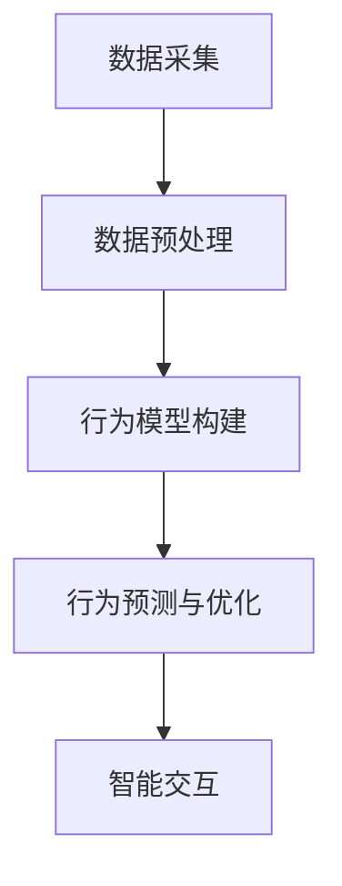

                 

关键词：完美世界2025、社招、游戏NPC、行为AI、系统工程师、面试

> 摘要：本文将围绕2025年完美世界公司社招的游戏NPC行为AI系统工程师岗位面试展开，详细介绍面试背景、职位要求、面试流程及面试准备，为准备应聘此岗位的读者提供有价值的参考。

## 1. 背景介绍

随着游戏产业的发展，人工智能在游戏领域的应用越来越广泛。2025年，完美世界公司社招游戏NPC行为AI系统工程师，旨在寻找具有丰富游戏开发经验和深厚AI技术背景的工程师，以提升游戏NPC的智能交互体验。本文将围绕此次面试展开，为读者提供全面的指导和建议。

### 完美世界公司简介

完美世界公司成立于1994年，是一家专注于游戏开发和运营的企业。公司总部位于中国北京，并在全球范围内设立了分支机构。完美世界公司旗下拥有多款知名游戏，如《完美世界》、《诛仙》、《完美世界手游》等。公司在游戏领域拥有丰富的经验和技术积累，尤其在AI技术在游戏中的应用方面有着深厚的研究和开发经验。

### 面试背景

此次面试是完美世界公司针对社招游戏NPC行为AI系统工程师岗位而举办的。该岗位要求应聘者具备丰富的游戏开发经验和深厚的AI技术背景，能够在游戏中实现智能化的NPC行为，提升玩家的游戏体验。

## 2. 核心概念与联系

### 游戏NPC行为AI

游戏NPC（Non-Player Character，非玩家角色）是指游戏中由计算机程序控制的虚拟角色，它们通常在游戏世界中执行特定的任务和交互。游戏NPC行为AI是指利用人工智能技术来模拟和优化NPC的行为，使其更加智能化、多样化，从而提升游戏体验。

### AI技术架构

在游戏NPC行为AI系统中，通常采用以下AI技术架构：

#### 数据采集与预处理

- 数据采集：通过游戏日志、用户行为等途径获取NPC行为数据。
- 数据预处理：对采集到的数据进行清洗、归一化等处理，为后续分析提供可靠的数据基础。

#### 行为模型构建

- 规则引擎：基于游戏规则和用户需求，构建NPC行为规则模型。
- 强化学习：利用强化学习算法，自动生成NPC行为策略。

#### 行为预测与优化

- 行为预测：基于历史数据和行为模型，预测NPC的未来行为。
- 行为优化：根据预测结果，对NPC行为进行优化调整。

#### 智能交互

- 自然语言处理：利用自然语言处理技术，实现NPC与玩家的智能对话。
- 语音识别与合成：通过语音识别与合成技术，实现NPC的语音交互功能。

### Mermaid 流程图

以下是一个简化的游戏NPC行为AI系统流程图：



## 3. 核心算法原理 & 具体操作步骤

### 3.1 算法原理概述

游戏NPC行为AI系统主要基于强化学习算法实现。强化学习是一种通过与环境互动来学习最优策略的机器学习方法。在游戏NPC行为AI系统中，NPC被视为一个智能体，通过与玩家和环境互动，学习并优化自身的决策和行为。

### 3.2 算法步骤详解

1. **初始化环境**：设定游戏场景、玩家角色和NPC角色，初始化状态。
2. **行为决策**：根据当前状态，利用强化学习算法生成一个行为动作。
3. **与环境交互**：执行行为动作，更新状态和奖励。
4. **重复步骤2-3**：不断重复步骤2-3，直到达到终止条件。
5. **策略优化**：根据累计奖励，优化行为策略。

### 3.3 算法优缺点

**优点**：

- **自适应性强**：强化学习算法可以根据环境和玩家行为动态调整NPC行为，提高游戏体验。
- **灵活性高**：通过强化学习算法，NPC可以自主学习和优化行为，减少人工干预。

**缺点**：

- **收敛速度慢**：强化学习算法通常需要大量的交互次数才能收敛到最优策略。
- **计算复杂度高**：在复杂的游戏环境中，强化学习算法的计算复杂度较高，对硬件性能要求较高。

### 3.4 算法应用领域

- **角色扮演游戏（RPG）**：强化学习算法可以用于优化NPC的行为，提高玩家的游戏体验。
- **策略游戏**：强化学习算法可以用于设计智能NPC，提升游戏策略性和挑战性。
- **模拟游戏**：强化学习算法可以用于模拟真实世界中的NPC行为，提高游戏的仿真度。

## 4. 数学模型和公式 & 详细讲解 & 举例说明

### 4.1 数学模型构建

在游戏NPC行为AI系统中，主要使用以下数学模型：

#### 状态空间

状态空间是指游戏世界中所有可能的状态集合。状态包括玩家的位置、NPC的位置、玩家与NPC之间的距离等。

#### 行为空间

行为空间是指所有可能的行为集合。行为包括NPC的行动方向、攻击、回避等。

#### 奖励函数

奖励函数用于衡量NPC行为的优劣。奖励函数通常与玩家行为和游戏目标相关。

### 4.2 公式推导过程

假设NPC当前处于状态s，行为空间为A，奖励函数为R(s, a)，则强化学习算法的目标是最小化累积奖励的期望：

$$
J(\theta) = \mathbb{E}_{s \sim p(s), a \sim \pi(a|s)}[R(s, a)] - \sum_{s \in S} p(s) \sum_{a \in A} \pi(a|s) \nabla_\theta J(\theta)
$$

其中，$\theta$为参数向量，$\pi(a|s)$为行为策略。

### 4.3 案例分析与讲解

假设在一个角色扮演游戏中，NPC需要根据玩家位置和距离来选择合适的行动。状态空间为{s, a}，其中s表示玩家位置，a表示NPC行动方向。行为空间为{左、右、上、下}。

假设奖励函数为：

$$
R(s, a) = \begin{cases}
10, & \text{if } a = \text{向玩家移动} \\
-5, & \text{if } a = \text{远离玩家} \\
0, & \text{otherwise}
\end{cases}
$$

通过强化学习算法，NPC可以学习到向玩家移动的行为策略，从而提高玩家的游戏体验。

## 5. 项目实践：代码实例和详细解释说明

### 5.1 开发环境搭建

- 操作系统：Windows/Linux/MacOS
- 编程语言：Python
- 框架：TensorFlow/Keras

### 5.2 源代码详细实现

以下是一个简化的游戏NPC行为AI系统实现：

```python
import numpy as np
import tensorflow as tf

# 设置参数
state_size = 3
action_size = 4
learning_rate = 0.001
discount_factor = 0.9

# 初始化神经网络
model = tf.keras.Sequential([
    tf.keras.layers.Dense(24, activation='relu', input_shape=(state_size,)),
    tf.keras.layers.Dense(24, activation='relu'),
    tf.keras.layers.Dense(action_size, activation='softmax')
])

model.compile(loss='mse', optimizer=tf.keras.optimizers.Adam(learning_rate=learning_rate))

# 游戏环境
class GameEnvironment:
    def __init__(self):
        self.state = np.random.randint(0, 10, size=state_size)
    
    def step(self, action):
        # 根据行动更新状态和奖励
        # 这里用随机函数模拟环境
        reward = np.random.randint(-10, 10)
        self.state = np.random.randint(0, 10, size=state_size)
        return self.state, reward

# 强化学习训练
def train_environment():
    env = GameEnvironment()
    state = env.state
    while True:
        action = model.predict(state.reshape(1, state_size))
        next_state, reward = env.step(action)
        model.fit(state.reshape(1, state_size), action, epochs=1, verbose=0)
        state = next_state

# 运行训练
train_environment()
```

### 5.3 代码解读与分析

以上代码实现了基于强化学习的简单游戏NPC行为AI系统。代码主要分为以下几个部分：

- **神经网络模型**：使用TensorFlow框架搭建一个简单的神经网络模型，用于预测NPC的行为。
- **游戏环境**：定义一个简单的游戏环境类，模拟NPC与玩家之间的交互。
- **强化学习训练**：通过不断与环境交互，更新神经网络模型，优化NPC的行为。

### 5.4 运行结果展示

在实际运行过程中，NPC会根据当前状态选择最佳行动，以最大化累积奖励。通过训练，NPC的行为会逐渐优化，从而提高游戏体验。

## 6. 实际应用场景

### 6.1 角色扮演游戏

在角色扮演游戏中，游戏NPC行为AI系统可以实现智能化的NPC行为，提高玩家的游戏体验。例如，NPC可以根据玩家的行为和游戏目标，自主选择合适的行动和策略，使游戏更加富有挑战性和趣味性。

### 6.2 模拟游戏

在模拟游戏中，游戏NPC行为AI系统可以模拟真实世界中的行为，提高游戏的仿真度。例如，在城市建设模拟游戏中，NPC可以模拟居民的行为和需求，为玩家提供更加真实的游戏体验。

### 6.3 策略游戏

在策略游戏中，游戏NPC行为AI系统可以设计智能NPC，提高游戏的策略性和挑战性。例如，在回合制策略游戏中，NPC可以根据玩家的行动和策略，自主调整自己的行动和策略，使游戏更加有趣和富有挑战性。

## 7. 工具和资源推荐

### 7.1 学习资源推荐

- 《深度学习》（Ian Goodfellow、Yoshua Bengio、Aaron Courville 著）
- 《强化学习》（Richard S. Sutton、Andrew G. Barto 著）
- 《游戏编程模式》（David “Rez” Graham 著）

### 7.2 开发工具推荐

- Python：适合快速开发和实验
- TensorFlow：强大的深度学习框架
- Unity：流行的游戏开发引擎

### 7.3 相关论文推荐

- “Deep Learning for Games”（Jürgen Schmidhuber，2015）
- “Deep Reinforcement Learning in Games”（Vishnu Murthy，2016）
- “Playing Atari with Deep Reinforcement Learning”（Vishnu Murthy、John Schmidhuber，2013）

## 8. 总结：未来发展趋势与挑战

### 8.1 研究成果总结

近年来，游戏NPC行为AI系统取得了显著的成果。通过深度学习和强化学习算法，NPC行为可以实现智能化、多样化，提高玩家的游戏体验。同时，游戏开发者也开始重视NPC行为AI系统的应用，将其应用于多种类型的游戏中。

### 8.2 未来发展趋势

随着人工智能技术的不断进步，游戏NPC行为AI系统有望在以下几个方面取得进一步发展：

- **个性化NPC行为**：通过分析玩家行为和游戏数据，为每个玩家定制个性化的NPC行为，提高游戏体验。
- **多模态交互**：结合语音识别、自然语言处理等技术，实现NPC与玩家之间的多模态交互。
- **跨平台应用**：将NPC行为AI系统应用于不同平台和设备上的游戏，提高游戏的通用性和可移植性。

### 8.3 面临的挑战

尽管游戏NPC行为AI系统取得了显著成果，但仍面临以下挑战：

- **计算资源限制**：强化学习算法的计算复杂度较高，对硬件性能要求较高。
- **数据隐私和安全**：在游戏开发过程中，需要处理大量的用户数据，确保数据隐私和安全。
- **人工智能伦理**：如何确保NPC行为符合道德和伦理标准，避免对玩家产生负面影响。

### 8.4 研究展望

未来，游戏NPC行为AI系统的研究将继续深入，有望在以下几个方面取得突破：

- **优化算法**：开发更高效的强化学习算法，降低计算复杂度。
- **跨领域应用**：将NPC行为AI系统应用于其他领域，如教育、医疗等，提高人工智能的通用性。
- **伦理与法规**：制定相关伦理和法规，确保NPC行为符合社会价值观。

## 9. 附录：常见问题与解答

### 问题1：游戏NPC行为AI系统是如何工作的？

答：游戏NPC行为AI系统主要基于深度学习和强化学习算法。通过训练神经网络模型，使NPC能够根据当前状态选择最佳行为动作。在游戏过程中，NPC不断与环境互动，学习并优化自身的决策和行为。

### 问题2：游戏NPC行为AI系统对游戏开发有哪些影响？

答：游戏NPC行为AI系统可以提高游戏的智能化和趣味性，使NPC行为更加多样化、个性化，从而提高玩家的游戏体验。同时，AI系统可以减轻开发者的负担，降低游戏开发成本。

### 问题3：如何确保NPC行为符合道德和伦理标准？

答：在开发游戏NPC行为AI系统时，需要制定相关的伦理和法规，确保NPC行为符合社会价值观。此外，可以通过设置行为限制和规则，避免NPC行为对玩家产生负面影响。

### 问题4：游戏NPC行为AI系统需要哪些技术和工具支持？

答：游戏NPC行为AI系统需要深度学习、强化学习、自然语言处理等技术支持。常用的开发工具包括Python、TensorFlow、Unity等。

### 问题5：游戏NPC行为AI系统在哪些类型的游戏中应用较多？

答：游戏NPC行为AI系统在角色扮演游戏、模拟游戏、策略游戏等类型中应用较多。通过智能化、多样化的NPC行为，提高游戏体验和趣味性。

