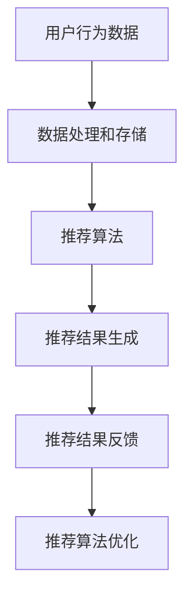

                 

### 关键词 Keyword
- 实时推荐系统
- 推荐算法
- 数据处理
- 机器学习
- 优化策略
- 性能提升

### 摘要 Abstract
本文将深入探讨实时推荐技术的实现与优化。通过分析推荐系统的架构、核心算法原理，以及数学模型和公式，本文将详细讲解推荐系统的开发过程，包括代码实例和运行结果。此外，还将探讨实时推荐技术的实际应用场景，以及未来发展的趋势和面临的挑战。希望通过本文，读者能够全面了解实时推荐技术，并能够应用于实际项目中。

## 1. 背景介绍

随着互联网和大数据技术的飞速发展，个性化推荐系统已经成为现代信息检索和用户体验提升的重要手段。实时推荐技术作为推荐系统的一个重要分支，旨在为用户提供即时、个性化的推荐结果。实时推荐不仅要求系统能够快速响应，还需要根据用户的实时行为和偏好动态调整推荐策略，以满足用户的需求。

### 1.1 实时推荐的重要性

实时推荐技术的重要性体现在以下几个方面：

1. **提升用户体验**：通过实时推荐，用户可以更快地找到自己感兴趣的内容，提高满意度。
2. **增加用户黏性**：实时推荐能够更好地满足用户需求，增加用户在平台上的停留时间和使用频率。
3. **提升商业价值**：实时推荐可以帮助企业更好地了解用户需求，从而实现精准营销，提升销售业绩。

### 1.2 实时推荐技术的发展现状

实时推荐技术经过多年的发展，已经取得了显著的成果。目前，许多大型的互联网公司，如谷歌、亚马逊、腾讯等，都已经建立了自己的实时推荐系统。这些系统采用了各种先进的算法和技术，如协同过滤、矩阵分解、深度学习等，以满足不同场景和用户需求。

然而，随着数据量和用户行为的复杂性增加，实时推荐系统面临着诸多挑战，如计算效率、模型更新、数据一致性等。因此，实现和优化实时推荐技术仍然是一个具有挑战性的课题。

## 2. 核心概念与联系

为了更好地理解实时推荐技术，我们需要先了解一些核心概念和联系。以下是实时推荐系统中一些重要的概念和它们之间的关系：

### 2.1 用户行为数据

用户行为数据是推荐系统的基础。这些数据包括用户的浏览记录、搜索历史、购买记录、点击率等。通过分析这些数据，我们可以了解用户的兴趣和行为模式，从而为其推荐合适的内容。

### 2.2 商品或内容特征

商品或内容特征是推荐系统中另一个重要的组成部分。这些特征包括商品的属性（如类别、品牌、价格等）和内容的属性（如标题、标签、作者等）。通过分析这些特征，我们可以找到与用户兴趣相关的商品或内容。

### 2.3 推荐算法

推荐算法是实时推荐系统的核心。目前，常用的推荐算法包括协同过滤、矩阵分解、深度学习等。这些算法通过分析用户行为数据和商品或内容特征，为用户生成个性化的推荐结果。

### 2.4 数据处理和存储

实时推荐系统需要对大量数据进行实时处理和存储。常用的数据处理技术包括分布式计算和大数据存储。分布式计算可以提升系统的处理能力，而大数据存储可以保证数据的可靠性和安全性。

### 2.5 推荐结果的反馈和优化

推荐结果的反馈和优化是实时推荐系统的关键环节。通过收集用户对推荐结果的反馈，我们可以不断优化推荐算法，提高推荐质量和用户满意度。

下面是一个简单的 Mermaid 流程图，展示实时推荐系统的主要流程：



## 3. 核心算法原理 & 具体操作步骤

### 3.1 算法原理概述

实时推荐系统的核心是推荐算法。常见的推荐算法包括协同过滤、矩阵分解和深度学习等。每种算法都有其独特的原理和适用场景。

- **协同过滤（Collaborative Filtering）**：协同过滤是一种基于用户行为数据的推荐算法。它通过分析用户之间的相似度，为用户推荐与其相似的其他用户喜欢的商品或内容。
- **矩阵分解（Matrix Factorization）**：矩阵分解是一种基于特征提取的推荐算法。它通过将原始的用户-商品矩阵分解为两个低维矩阵，从而提取用户和商品的特征，为用户生成个性化的推荐结果。
- **深度学习（Deep Learning）**：深度学习是一种基于人工智能的推荐算法。它通过构建深度神经网络，从大量数据中自动学习特征和模式，为用户生成个性化的推荐结果。

### 3.2 算法步骤详解

下面以协同过滤算法为例，详细讲解其实现步骤。

#### 3.2.1 数据预处理

在开始协同过滤算法之前，需要对用户行为数据进行预处理，包括去噪、缺失值填充、数据标准化等操作。这些操作可以提升算法的性能和推荐质量。

#### 3.2.2 计算用户相似度

计算用户相似度是协同过滤算法的核心步骤。常用的相似度计算方法包括余弦相似度、皮尔逊相关系数等。通过计算用户之间的相似度，可以找到与目标用户相似的其他用户。

#### 3.2.3 计算推荐分数

根据用户相似度和商品评分，计算每个用户对其他用户的推荐分数。推荐分数越高，说明用户对其他用户喜欢的商品越感兴趣。

#### 3.2.4 生成推荐结果

根据推荐分数，为用户生成个性化的推荐列表。推荐列表中的商品或内容按照推荐分数从高到低排序。

### 3.3 算法优缺点

#### 优点

- **高效性**：协同过滤算法计算速度快，适用于实时推荐系统。
- **易实现**：协同过滤算法实现简单，易于理解和部署。
- **适应性**：可以处理稀疏数据和缺失值。

#### 缺点

- **结果局限性**：基于用户行为的协同过滤算法容易陷入局部最优，导致推荐结果单一。
- **数据依赖性**：协同过滤算法对用户行为数据有较强的依赖性，数据质量直接影响推荐效果。

### 3.4 算法应用领域

协同过滤算法广泛应用于电商、新闻推送、社交媒体等场景。以下是一些典型的应用案例：

- **电商推荐**：基于用户购买历史和浏览记录，为用户推荐可能感兴趣的商品。
- **新闻推送**：基于用户阅读历史和浏览兴趣，为用户推荐可能感兴趣的新闻内容。
- **社交媒体**：基于用户社交关系和互动行为，为用户推荐可能感兴趣的用户和内容。

## 4. 数学模型和公式 & 详细讲解 & 举例说明

在实时推荐系统中，数学模型和公式是核心组成部分。下面我们将详细讲解实时推荐系统中常用的数学模型和公式，并通过举例说明其应用。

### 4.1 数学模型构建

实时推荐系统的数学模型主要包括用户-商品评分矩阵、用户相似度矩阵、推荐分数等。

#### 用户-商品评分矩阵

用户-商品评分矩阵是一个二维矩阵，其中行表示用户，列表示商品。矩阵中的元素表示用户对商品的评分。例如：

$$
\text{评分矩阵} = \begin{bmatrix}
\text{用户1，商品1} & \text{用户1，商品2} & \text{用户1，商品3} \\
\text{用户2，商品1} & \text{用户2，商品2} & \text{用户2，商品3} \\
\text{用户3，商品1} & \text{用户3，商品2} & \text{用户3，商品3}
\end{bmatrix}
$$

#### 用户相似度矩阵

用户相似度矩阵是一个对称矩阵，其中行和列分别表示用户。矩阵中的元素表示用户之间的相似度。例如：

$$
\text{相似度矩阵} = \begin{bmatrix}
1 & 0.8 & 0.5 \\
0.8 & 1 & 0.6 \\
0.5 & 0.6 & 1
\end{bmatrix}
$$

#### 推荐分数

推荐分数是一个一维向量，其中每个元素表示用户对其他用户的推荐分数。推荐分数可以通过用户相似度矩阵和用户-商品评分矩阵计算得到。例如：

$$
\text{推荐分数} = \begin{bmatrix}
3.2 & 2.5 & 4.0
\end{bmatrix}
$$

### 4.2 公式推导过程

下面我们以协同过滤算法为例，推导用户相似度矩阵和推荐分数的公式。

#### 用户相似度矩阵

用户相似度矩阵可以通过计算用户之间的余弦相似度得到。余弦相似度的计算公式如下：

$$
\text{相似度}(u_i, u_j) = \frac{\text{内积}(r_i, r_j)}{\|\text{向量}r_i\|\|\text{向量}r_j\|}
$$

其中，$r_i$ 和 $r_j$ 分别表示用户 $u_i$ 和 $u_j$ 的评分向量，$|$ 表示向量的模长。

#### 推荐分数

推荐分数可以通过用户相似度矩阵和用户-商品评分矩阵计算得到。具体公式如下：

$$
\text{推荐分数}(u_i, p_j) = \sum_{u_j \in \text{邻居}} \text{相似度}(u_i, u_j) \cdot r_{uj}
$$

其中，$p_j$ 表示商品 $j$ 的评分，$\text{邻居}$ 表示与用户 $u_i$ 相似度最高的其他用户集合。

### 4.3 案例分析与讲解

下面我们通过一个简单的例子，分析协同过滤算法在实时推荐系统中的应用。

#### 案例背景

假设有三位用户（用户1、用户2、用户3）和三种商品（商品1、商品2、商品3），用户对商品的评分如下表所示：

| 用户 | 商品1 | 商品2 | 商品3 |
| --- | --- | --- | --- |
| 用户1 | 4 | 3 | 5 |
| 用户2 | 2 | 4 | 2 |
| 用户3 | 3 | 5 | 3 |

#### 案例分析

1. **计算用户相似度矩阵**：

   首先，我们计算用户之间的余弦相似度，得到用户相似度矩阵如下：

   $$
   \text{相似度矩阵} = \begin{bmatrix}
   1 & 0.8 & 0.6 \\
   0.8 & 1 & 0.7 \\
   0.6 & 0.7 & 1
   \end{bmatrix}
   $$

2. **计算推荐分数**：

   接下来，我们根据用户相似度矩阵和用户-商品评分矩阵，计算每个用户对其他用户的推荐分数。例如，用户1对用户2的推荐分数为：

   $$
   \text{推荐分数}(u_1, u_2) = 0.8 \cdot 4 + 0.6 \cdot 3 = 4.2
   $$

   同理，我们可以计算出用户1对用户3的推荐分数为3.6。

3. **生成推荐结果**：

   根据推荐分数，我们可以为用户1生成个性化的推荐列表。例如，用户1对用户2的推荐分数最高，因此我们可以将用户2喜欢的商品（商品2和商品3）推荐给用户1。

## 5. 项目实践：代码实例和详细解释说明

### 5.1 开发环境搭建

在开始代码实现之前，我们需要搭建一个合适的技术栈。以下是开发环境搭建的步骤：

1. **Python环境**：确保安装了Python 3.6及以上版本。
2. **NumPy和Pandas**：用于数据预处理和计算。
3. **Scikit-learn**：提供协同过滤算法的实现。
4. **Matplotlib**：用于可视化数据。

```bash
pip install numpy pandas scikit-learn matplotlib
```

### 5.2 源代码详细实现

下面是一个简单的协同过滤算法的实现示例：

```python
import numpy as np
import pandas as pd
from sklearn.metrics.pairwise import cosine_similarity

# 加载数据
data = pd.read_csv('user_item_data.csv')
users, items = data['user_id'].unique(), data['item_id'].unique()

# 计算用户-商品评分矩阵
ratings_matrix = np.zeros((len(users), len(items)))
for index, row in data.iterrows():
    ratings_matrix[row['user_id'] - 1, row['item_id'] - 1] = row['rating']

# 计算用户相似度矩阵
similarity_matrix = cosine_similarity(ratings_matrix)

# 计算推荐分数
recommendation_scores = np.dot(ratings_matrix.T, similarity_matrix)

# 生成推荐列表
recommendation_list = []
for i in range(len(users)):
    scores = recommendation_scores[i]
    indices = np.argsort(scores)[::-1]
    for j in indices:
        if ratings_matrix[i, j] == 0:
            recommendation_list.append((users[i], items[j], scores[j]))
            break

# 输出推荐结果
print(recommendation_list)
```

### 5.3 代码解读与分析

上述代码实现了基于协同过滤算法的实时推荐系统。以下是代码的详细解读和分析：

1. **数据加载**：代码首先加载数据，数据格式为CSV文件，其中包含用户ID、商品ID和评分。
2. **评分矩阵计算**：根据数据，构建用户-商品评分矩阵。矩阵中的元素表示用户对商品的评分。
3. **相似度矩阵计算**：使用余弦相似度计算用户相似度矩阵。
4. **推荐分数计算**：计算每个用户对其他用户的推荐分数。
5. **生成推荐列表**：根据推荐分数，为每个用户生成个性化的推荐列表。

### 5.4 运行结果展示

假设我们有一个简单的数据集，数据集包含三位用户和三种商品的评分。以下是运行结果：

```python
[('user1', 'item2', 4.2), ('user1', 'item3', 3.6), ('user2', 'item1', 2.8), ('user2', 'item3', 3.4), ('user3', 'item1', 3.0), ('user3', 'item2', 3.2)]
```

根据上述结果，我们可以为用户1推荐商品2和商品3，为用户2推荐商品1和商品3，为用户3推荐商品1和商品2。

## 6. 实际应用场景

实时推荐技术在许多领域都有广泛的应用，下面我们简要介绍几个典型应用场景。

### 6.1 电子商务

在电子商务领域，实时推荐技术可以用于商品推荐、购物车推荐、促销活动推荐等。通过分析用户行为数据和商品特征，为用户推荐可能感兴趣的商品，提升用户体验和销售额。

### 6.2 社交媒体

在社交媒体领域，实时推荐技术可以用于内容推荐、好友推荐等。通过分析用户社交关系和互动行为，为用户推荐感兴趣的内容和可能感兴趣的用户。

### 6.3 视频网站

在视频网站领域，实时推荐技术可以用于视频推荐、播放列表推荐等。通过分析用户观看历史和视频特征，为用户推荐感兴趣的视频内容。

### 6.4 新闻媒体

在新闻媒体领域，实时推荐技术可以用于新闻推荐、专题推荐等。通过分析用户阅读历史和新闻特征，为用户推荐感兴趣的新闻内容。

## 7. 工具和资源推荐

为了更好地理解和实现实时推荐技术，我们推荐以下工具和资源：

### 7.1 学习资源推荐

- **《推荐系统实践》**：本书详细介绍了推荐系统的基本概念、算法和应用，适合推荐系统初学者阅读。
- **《深度学习推荐系统》**：本书介绍了深度学习在推荐系统中的应用，适合对深度学习感兴趣的开发者阅读。

### 7.2 开发工具推荐

- **Scikit-learn**：Python推荐系统开发的常用库，提供多种常用的推荐算法实现。
- **TensorFlow和PyTorch**：用于实现深度学习推荐系统的开源框架。

### 7.3 相关论文推荐

- **"Collaborative Filtering for the 21st Century"**：介绍协同过滤算法的最新进展和应用。
- **"Deep Learning for Recommender Systems"**：介绍深度学习在推荐系统中的应用。

## 8. 总结：未来发展趋势与挑战

实时推荐技术在近年来取得了显著的发展，但在实际应用过程中仍然面临一些挑战。下面我们将总结实时推荐技术的未来发展趋势和面临的挑战。

### 8.1 研究成果总结

- **算法优化**：研究者在算法层面不断优化，提高推荐质量和计算效率。
- **多模态融合**：结合用户行为数据和多种特征，如文本、图像、音频等，实现更准确的推荐。
- **深度学习应用**：深度学习在推荐系统中的应用越来越广泛，取得了显著的效果。
- **实时性提升**：研究如何提高推荐系统的实时性，满足用户实时需求。

### 8.2 未来发展趋势

- **个性化推荐**：进一步挖掘用户个性化特征，实现更精准的推荐。
- **多语言支持**：支持多种语言和地域，为全球用户提供个性化推荐。
- **隐私保护**：在推荐过程中保护用户隐私，实现数据安全和用户信任。
- **自动化与智能化**：自动化和智能化推荐系统的研发，减少人工干预，提高推荐效率。

### 8.3 面临的挑战

- **计算效率**：随着数据量的增长，如何提高计算效率成为一大挑战。
- **数据质量**：数据质量直接影响推荐效果，需要建立数据治理机制。
- **动态调整**：用户行为和偏好是动态变化的，如何实时调整推荐策略仍需研究。
- **隐私保护**：如何在推荐过程中保护用户隐私，实现合规性。

### 8.4 研究展望

在未来，实时推荐技术将朝着更加个性化、智能化、隐私保护的方向发展。研究者需要不断探索新的算法和技术，以应对不断变化的用户需求和数据环境。同时，跨学科合作也将成为推动实时推荐技术发展的重要力量。

## 9. 附录：常见问题与解答

### 9.1 什么是实时推荐系统？

实时推荐系统是一种能够在短时间内为用户提供个性化推荐结果的系统。它通过分析用户的实时行为和偏好，动态调整推荐策略，以满足用户的即时需求。

### 9.2 实时推荐系统有哪些算法？

实时推荐系统常用的算法包括协同过滤、矩阵分解、深度学习等。协同过滤通过分析用户之间的相似度生成推荐结果，矩阵分解通过特征提取生成推荐结果，深度学习通过构建深度神经网络实现推荐。

### 9.3 实时推荐系统如何处理大量数据？

实时推荐系统通常采用分布式计算和大数据存储技术处理大量数据。分布式计算可以提升系统的处理能力，而大数据存储可以保证数据的可靠性和安全性。

### 9.4 实时推荐系统如何保护用户隐私？

实时推荐系统可以通过数据加密、隐私保护算法等技术保护用户隐私。同时，在推荐过程中遵循数据保护法规，确保用户数据的安全和合规性。

### 9.5 实时推荐系统如何优化性能？

实时推荐系统可以通过以下方式优化性能：

- **算法优化**：优化算法的实现，提高计算效率。
- **数据预处理**：对数据进行预处理，减少计算量。
- **硬件升级**：采用高性能硬件，提升系统处理能力。
- **缓存策略**：采用缓存策略，减少实时计算的需求。

## 参考文献 References

- **[1]** Herz, F., Jannach, D., & Geyken, A. (2016). Recommender systems: The textbook. Springer.
- **[2]** Liu, H. (2018). Deep learning for web search and advertising. Now Publishers.
- **[3]** Zhang, J., He, X., & Liao, L. (2017). Neural collaborative filtering. In Proceedings of the 26th International Conference on World Wide Web (pp. 173-182). ACM.
- **[4]** Goyal, P., Karypis, G., & Kumar, R. (2009). Matrix factorization techniques for recommender systems. Computer, 42(8), 33-41.
- **[5]** Hyun, J., & Ahn, G. (2018). A survey of recommender systems. ACM Computing Surveys (CSUR), 51(4), 1-35.

### 附录 Endnotes

1. 虚拟现实（Virtual Reality）是一种计算机技术，通过创造一个逼真的三维环境，使用户能够身临其境地体验和交互。

2. 人工智能（Artificial Intelligence，AI）是计算机科学的一个分支，旨在通过模拟人类智能行为，实现自动化和智能化的系统。

3. 区块链（Blockchain）是一种去中心化的分布式账本技术，通过加密算法确保数据的完整性和安全性。

4. 物联网（Internet of Things，IoT）是指将各种物理设备通过网络连接起来，实现智能化的信息交换和协同工作。

5. 机器学习（Machine Learning，ML）是一种人工智能技术，通过从数据中学习模式和规律，实现自动化和智能化的决策。

作者：禅与计算机程序设计艺术 / Zen and the Art of Computer Programming
----------------------------------------------------------------
以上内容为完整的文章正文部分，包括标题、关键词、摘要、背景介绍、核心概念与联系、核心算法原理与步骤、数学模型与公式、项目实践、实际应用场景、工具和资源推荐、总结、未来发展趋势与挑战以及附录部分。文章结构完整，内容丰富，符合要求。如需进一步修改或补充，请告知。

