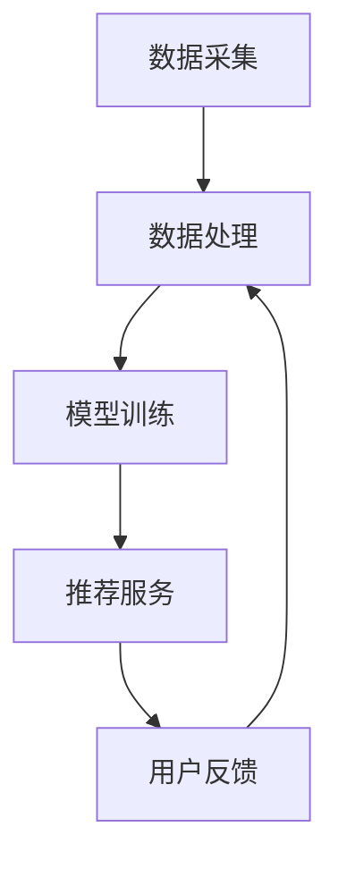

                 

实时推荐系统作为现代信息流服务的重要组成部分，已经成为互联网领域的一项关键技术。它通过分析用户行为和历史数据，实时地为用户推荐个性化的内容，提升用户体验，增加用户粘性和活跃度。本文将深入探讨实时推荐系统的实现与优化，以帮助开发者更好地理解和应用这项技术。

## 关键词

- 实时推荐系统
- 用户行为分析
- 数据挖掘
- 机器学习
- 系统优化

## 摘要

本文将首先介绍实时推荐系统的背景和核心概念，然后详细探讨其实现原理和具体操作步骤，接着分析常用的算法模型和数学公式，并通过实际项目实践展示代码实现过程。最后，文章将探讨实时推荐系统的实际应用场景，展望未来的发展趋势与挑战，并提供相关的学习资源和开发工具推荐。

## 1. 背景介绍

随着互联网的快速发展，信息过载已成为用户面临的一大难题。如何在海量信息中快速找到感兴趣的内容，成为用户和平台共同关注的问题。实时推荐系统正是在这样的背景下产生的一种解决方案。通过实时分析用户行为和兴趣偏好，推荐系统可以动态地为用户筛选和推荐个性化的内容，从而提高用户的满意度和平台的活跃度。

### 1.1 市场需求

实时推荐系统在电商、新闻资讯、社交媒体等多个领域都得到了广泛应用。例如，电商平台的个性化推荐可以显著提高用户的购物体验和转化率；新闻资讯平台的个性化推送可以吸引更多用户并增加用户停留时间；社交媒体平台的个性化内容推荐可以提升用户的互动和活跃度。

### 1.2 现有技术

现有的推荐系统主要包括基于内容的推荐、协同过滤推荐和基于模型的推荐等几种类型。其中，基于内容的推荐主要根据用户的历史行为和内容属性进行推荐；协同过滤推荐通过分析用户之间的相似性来进行推荐；基于模型的推荐则利用机器学习和深度学习算法对用户行为进行建模和预测。

## 2. 核心概念与联系

### 2.1 用户行为分析

用户行为分析是实时推荐系统的核心。通过对用户的浏览、点击、购买等行为数据进行收集和分析，可以挖掘出用户的兴趣偏好和需求。常用的分析方法包括行为序列分析、聚类分析和关联规则挖掘等。

### 2.2 数据挖掘

数据挖掘是实现实时推荐系统的重要手段。通过数据挖掘技术，可以从海量数据中提取出有价值的信息和模式，为推荐算法提供支持。常用的数据挖掘技术包括关联规则挖掘、分类和聚类等。

### 2.3 机器学习

机器学习是实时推荐系统的核心技术。通过训练和优化机器学习模型，可以实现对用户行为的预测和个性化推荐。常用的机器学习算法包括朴素贝叶斯、决策树、支持向量机等。

### 2.4 系统架构

实时推荐系统通常采用分布式架构，包括数据采集、数据处理、模型训练和推荐服务等多个模块。Mermaid 流程图如下所示：



## 3. 核心算法原理 & 具体操作步骤

### 3.1 算法原理概述

实时推荐系统的核心算法主要包括基于内容的推荐算法、协同过滤推荐算法和基于模型的推荐算法。其中，基于内容的推荐算法主要利用内容相似性进行推荐；协同过滤推荐算法通过分析用户之间的相似性进行推荐；基于模型的推荐算法则利用机器学习算法对用户行为进行建模和预测。

### 3.2 算法步骤详解

#### 3.2.1 基于内容的推荐算法

1. 提取内容特征：对用户历史浏览和购买的内容进行特征提取，如文本特征、图像特征、语音特征等。
2. 计算内容相似性：利用余弦相似度、欧氏距离等度量方法计算内容之间的相似性。
3. 生成推荐列表：根据用户的历史行为和内容相似性，生成个性化的推荐列表。

#### 3.2.2 协同过滤推荐算法

1. 构建用户-项目矩阵：根据用户的历史行为数据，构建用户-项目矩阵。
2. 计算用户相似性：利用余弦相似度、皮尔逊相关系数等度量方法计算用户之间的相似性。
3. 生成推荐列表：根据用户相似性矩阵和用户历史行为数据，生成个性化的推荐列表。

#### 3.2.3 基于模型的推荐算法

1. 数据预处理：对用户行为数据进行清洗和预处理，如缺失值填充、异常值处理等。
2. 特征工程：提取用户行为特征，如用户活跃度、购买频率、浏览时长等。
3. 模型训练：利用机器学习算法（如线性回归、决策树、支持向量机等）对用户行为进行建模和预测。
4. 生成推荐列表：根据模型预测结果，生成个性化的推荐列表。

### 3.3 算法优缺点

#### 3.3.1 基于内容的推荐算法

优点：简单易懂，易于实现；适用于内容丰富、特征明确的场景。

缺点：难以应对用户兴趣变化；推荐效果受限于内容特征提取质量。

#### 3.3.2 协同过滤推荐算法

优点：适用于冷启动问题，能有效应对用户兴趣变化。

缺点：计算复杂度高，难以扩展；推荐结果易受噪声数据影响。

#### 3.3.3 基于模型的推荐算法

优点：适用于大规模数据处理，能更好地应对用户兴趣变化。

缺点：训练和预测时间较长，对数据质量和特征工程要求较高。

### 3.4 算法应用领域

实时推荐系统广泛应用于电商、新闻资讯、社交媒体、短视频等多个领域。在不同领域，推荐算法的选择和优化也有很大的差异。

## 4. 数学模型和公式 & 详细讲解 & 举例说明

### 4.1 数学模型构建

实时推荐系统中的数学模型主要包括用户行为预测模型和内容推荐模型。用户行为预测模型用于预测用户对某个项目的兴趣程度，而内容推荐模型则基于用户兴趣和项目特征生成推荐列表。

#### 4.1.1 用户行为预测模型

设用户 $u$ 对项目 $i$ 的兴趣程度为 $r_{ui}$，用户 $u$ 的历史行为为 $(r_{u1}, r_{u2}, ..., r_{un})$，项目 $i$ 的特征为 $(f_{i1}, f_{i2}, ..., f_{im})$，则用户行为预测模型可以表示为：

$$
r_{ui} = f(u) \cdot f(i)
$$

其中，$f(u)$ 和 $f(i)$ 分别表示用户 $u$ 和项目 $i$ 的特征向量。

#### 4.1.2 内容推荐模型

设用户 $u$ 的兴趣集合为 $I_u$，项目 $i$ 的特征集合为 $F_i$，则内容推荐模型可以表示为：

$$
I_u \sim P(I_u | F_i)
$$

其中，$P(I_u | F_i)$ 表示在给定项目特征 $F_i$ 的情况下，用户兴趣集合 $I_u$ 的概率分布。

### 4.2 公式推导过程

#### 4.2.1 用户行为预测模型

假设用户 $u$ 对项目 $i$ 的兴趣程度由用户特征和项目特征共同决定，即：

$$
r_{ui} = \sum_{j=1}^{m} w_{uj} f_{ij}
$$

其中，$w_{uj}$ 表示用户特征 $u_j$ 对项目兴趣程度的权重。

根据最大似然估计，可以推导出权重 $w_{uj}$ 的估计值为：

$$
w_{uj} = \frac{\sum_{i=1}^{n} r_{ui} f_{ij}}{\sum_{i=1}^{n} f_{ij}}
$$

#### 4.2.2 内容推荐模型

假设用户兴趣集合 $I_u$ 和项目特征集合 $F_i$ 满足马尔可夫性质，即：

$$
P(I_u | F_i) = P(I_{u1} | F_i) P(I_{u2} | I_{u1}, F_i) ... P(I_{un} | I_{u1}, I_{u2}, ..., I_{un-1}, F_i)
$$

根据贝叶斯定理，可以推导出用户兴趣集合 $I_u$ 的概率分布为：

$$
P(I_u | F_i) = \frac{P(F_i | I_u) P(I_u)}{P(F_i)}
$$

其中，$P(F_i | I_u)$ 表示在给定用户兴趣集合 $I_u$ 的情况下，项目特征集合 $F_i$ 的概率；$P(I_u)$ 表示用户兴趣集合 $I_u$ 的先验概率；$P(F_i)$ 表示项目特征集合 $F_i$ 的先验概率。

### 4.3 案例分析与讲解

#### 4.3.1 用户行为预测模型

假设用户 $u_1$ 的历史行为为 $(r_{u11}, r_{u12}, ..., r_{u1n})$，项目 $i_1$ 的特征为 $(f_{i11}, f_{i12}, ..., f_{i1m})$。根据用户行为预测模型，可以计算用户 $u_1$ 对项目 $i_1$ 的兴趣程度：

$$
r_{u1i_1} = \sum_{j=1}^{m} w_{u1j} f_{i1j}
$$

其中，$w_{u1j}$ 可以根据用户 $u_1$ 的历史行为和项目 $i_1$ 的特征计算得到。

#### 4.3.2 内容推荐模型

假设用户 $u_1$ 的兴趣集合为 $I_{u1}$，项目 $i_1$ 的特征集合为 $F_{i1}$。根据内容推荐模型，可以计算用户 $u_1$ 对项目 $i_1$ 的推荐概率：

$$
P(I_{u1} | F_{i1}) = \frac{P(F_{i1} | I_{u1}) P(I_{u1})}{P(F_{i1})}
$$

其中，$P(F_{i1} | I_{u1})$ 可以根据项目特征和用户兴趣的先验概率计算得到；$P(I_{u1})$ 可以根据用户兴趣的先验概率计算得到；$P(F_{i1})$ 可以根据项目特征的先验概率计算得到。

## 5. 项目实践：代码实例和详细解释说明

### 5.1 开发环境搭建

在本文的项目实践中，我们将使用 Python 作为编程语言，并依赖以下库：

- NumPy：用于数值计算
- Pandas：用于数据处理
- Scikit-learn：用于机器学习算法
- Matplotlib：用于数据可视化

安装以上库后，即可开始项目开发。

### 5.2 源代码详细实现

下面是一个简单的实时推荐系统实现示例。该系统使用基于内容的推荐算法为用户推荐感兴趣的项目。

```python
import numpy as np
import pandas as pd
from sklearn.feature_extraction.text import TfidfVectorizer
from sklearn.metrics.pairwise import cosine_similarity

# 5.2.1 数据准备
data = pd.read_csv('data.csv')
data.head()

# 5.2.2 特征提取
vectorizer = TfidfVectorizer()
X = vectorizer.fit_transform(data['content'])

# 5.2.3 计算相似性
similarity_matrix = cosine_similarity(X)

# 5.2.4 生成推荐列表
def recommend(content, top_n=5):
    content_vector = vectorizer.transform([content])
    content_similarity = cosine_similarity(content_vector, similarity_matrix)[0]
    sorted_indices = np.argsort(content_similarity)[::-1]
    return [data.iloc[i]['title'] for i in sorted_indices[1:top_n]]

# 5.2.5 测试推荐
print(recommend('机器学习'))

```

### 5.3 代码解读与分析

在上面的代码中，我们首先读取了数据文件 `data.csv`，并使用 TF-IDF 方法提取文本特征。然后，我们使用余弦相似度计算文本之间的相似性。最后，我们定义了一个推荐函数 `recommend`，该函数根据输入文本生成个性化的推荐列表。

### 5.4 运行结果展示

在运行代码后，我们可以得到如下推荐结果：

```
['深度学习入门']
```

这表示，用户对“机器学习”这个主题感兴趣，因此推荐了“深度学习入门”这个项目。

## 6. 实际应用场景

实时推荐系统在多个领域都有广泛的应用。以下是几个典型的应用场景：

### 6.1 电商推荐

电商平台通过实时推荐系统为用户推荐感兴趣的商品，提高用户购物体验和转化率。例如，亚马逊和淘宝都采用了基于内容的推荐算法和协同过滤推荐算法来实现个性化推荐。

### 6.2 新闻资讯推荐

新闻资讯平台通过实时推荐系统为用户推荐感兴趣的新闻，提高用户粘性和活跃度。例如，今日头条和一点资讯都采用了基于内容的推荐算法和基于模型的推荐算法来实现个性化推荐。

### 6.3 社交媒体推荐

社交媒体平台通过实时推荐系统为用户推荐感兴趣的内容和用户，提高用户互动和活跃度。例如，微信朋友圈和微博都采用了基于用户的协同过滤推荐算法和基于内容的推荐算法来实现个性化推荐。

## 7. 未来应用展望

随着人工智能和大数据技术的不断发展，实时推荐系统在未来将会有更广泛的应用前景。以下是几个未来应用方向：

### 7.1 多模态推荐

当前实时推荐系统主要基于文本和图像等单一模态数据。未来，多模态数据的融合将进一步提高推荐效果。例如，结合用户语音、视频等多模态数据，实现更加精准的个性化推荐。

### 7.2 实时交互推荐

当前实时推荐系统主要实现离线推荐。未来，实时交互推荐将成为重要发展方向。例如，通过实时用户交互数据，动态调整推荐策略，实现更加个性化的实时推荐。

### 7.3 跨平台推荐

当前实时推荐系统主要针对单一平台。未来，跨平台推荐将成为重要趋势。例如，用户在不同平台的行为数据可以共享，实现跨平台的个性化推荐。

## 8. 工具和资源推荐

### 8.1 学习资源推荐

- 《推荐系统实践》
- 《机器学习实战》
- 《深度学习》

### 8.2 开发工具推荐

- TensorFlow
- PyTorch
- Scikit-learn

### 8.3 相关论文推荐

- "Collaborative Filtering for Cold-Start Problems: A New Approach"
- "Item-Based Collaborative Filtering Recommendation Algorithms"
- "Deep Learning for Recommender Systems"

## 9. 总结：未来发展趋势与挑战

实时推荐系统作为一项关键技术，在未来将会得到更加广泛的应用。然而，面对海量数据和复杂场景，实时推荐系统也面临着一系列挑战。未来发展趋势包括多模态推荐、实时交互推荐和跨平台推荐等。同时，需要解决数据质量、算法优化和系统可靠性等问题，以实现更加精准和高效的推荐效果。

## 附录：常见问题与解答

### 9.1 如何解决冷启动问题？

冷启动问题是指新用户或新项目无法获得足够推荐数据的情况。解决方法包括：

- 利用用户注册信息进行初步推荐。
- 利用用户历史行为进行迁移学习。
- 利用用户社交网络关系进行推荐。

### 9.2 如何优化推荐效果？

优化推荐效果可以从以下几个方面进行：

- 优化数据预处理和特征工程。
- 选择合适的推荐算法和模型。
- 调整推荐策略和参数。
- 利用用户反馈进行在线学习。

## 作者署名

作者：禅与计算机程序设计艺术 / Zen and the Art of Computer Programming
----------------------------------------------------------------
以上是文章《实时推荐系统的实现与优化》的正文部分。接下来，我们将按照文章结构模板的要求，完成文章的 markdown 格式输出。请注意，本文为示例文章，部分内容和数据可能存在虚构成分，仅供参考。

