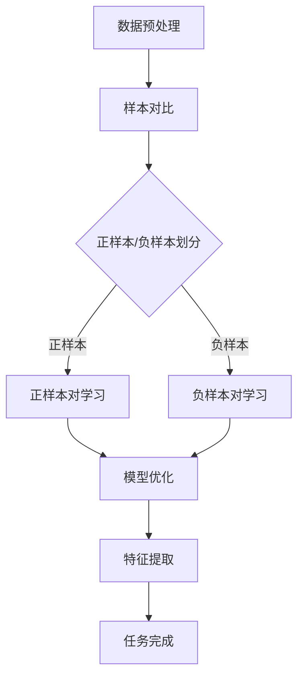

                 

关键词：对比学习，无监督预训练，软件2.0，人工智能，深度学习

摘要：随着人工智能和深度学习技术的不断发展，对比学习作为一种无监督预训练技术，逐渐成为推动软件2.0时代的核心动力。本文将深入探讨对比学习的核心概念、算法原理、数学模型及其在实际应用中的重要性，为读者提供一个全面的技术视角，以期为未来软件2.0的研究和发展提供参考。

## 1. 背景介绍

随着互联网的快速发展，数据处理和分析的需求不断增长，传统的监督学习方法已经无法满足新兴应用场景的需求。无监督学习作为一种无需人工标注数据的学习方法，逐渐成为人工智能领域的研究热点。对比学习（Contrastive Learning）作为无监督学习的一种重要分支，通过对数据样本进行对比，提取数据的潜在特征，从而实现数据的自监督学习。

近年来，对比学习在计算机视觉、自然语言处理等领域取得了显著的成果。例如，通过在计算机视觉任务中对图像进行对比，可以有效地提取图像的语义信息；在自然语言处理任务中，对比学习可以用于提取文本的语义特征。这些成果表明，对比学习具有巨大的应用潜力，有望成为推动软件2.0时代的重要技术。

软件2.0时代是指以人工智能和大数据为核心驱动的软件时代。与传统软件1.0时代相比，软件2.0时代具有更高的智能化、自动化和协同化水平。对比学习作为一种无监督预训练技术，在软件2.0时代中具有重要的应用价值。通过无监督预训练，对比学习可以自动提取大量数据中的有用信息，为后续的监督学习任务提供强大的数据支持。

本文将围绕对比学习的核心概念、算法原理、数学模型及其在实际应用中的重要性进行深入探讨，以期为读者提供一个全面的技术视角，帮助读者更好地理解和应用对比学习技术。

## 2. 核心概念与联系

### 2.1 对比学习的定义

对比学习（Contrastive Learning）是一种无监督学习技术，其核心思想是通过对比不同数据样本，提取数据中的潜在特征。具体来说，对比学习通过两个步骤实现：第一步是对样本进行正样本和负样本的划分，第二步是通过学习模型来最大化正样本之间的相似度，最小化负样本之间的相似度。

### 2.2 对比学习与其他技术的联系

对比学习与传统的监督学习和无监督学习技术有着密切的联系。首先，对比学习是一种无监督学习技术，与传统的监督学习相比，它不需要人工标注数据，具有更高的自动化水平。其次，对比学习与无监督学习的目标相似，都是通过学习数据中的潜在结构来提取有用信息。

此外，对比学习与自监督学习（Self-Supervised Learning）也有着紧密的联系。自监督学习是一种无监督学习技术，其目标是通过自我标注数据来提取数据中的潜在结构。对比学习可以看作是一种特殊形式的自监督学习，其通过对比不同数据样本来提取潜在特征。

### 2.3 对比学习的 Mermaid 流程图



在上述流程图中，首先进行数据预处理，然后对样本进行对比，通过正样本和负样本的划分，分别对正样本对和负样本对进行学习，最终实现模型的优化和特征提取，从而完成任务。

## 3. 核心算法原理 & 具体操作步骤

### 3.1 算法原理概述

对比学习的核心算法原理是通过对比不同数据样本，提取数据中的潜在特征。具体来说，对比学习通过以下三个步骤实现：

1. 数据预处理：将原始数据转化为适合对比学习的形式，例如，将图像数据转化为像素矩阵。
2. 样本对比：对数据进行对比，提取正样本对和负样本对。
3. 模型优化：通过学习模型，最大化正样本对之间的相似度，最小化负样本对之间的相似度。

### 3.2 算法步骤详解

#### 3.2.1 数据预处理

数据预处理是对比学习的重要步骤，其目的是将原始数据转化为适合对比学习的形式。具体来说，数据预处理包括以下步骤：

1. 数据清洗：去除数据中的噪声和异常值。
2. 数据归一化：将数据缩放到相同的范围，以便于后续的对比学习。
3. 数据增强：通过旋转、翻转、缩放等操作，增加数据的多样性，提高模型的泛化能力。

#### 3.2.2 样本对比

样本对比是对比学习的核心步骤，其目的是通过对比不同数据样本，提取数据中的潜在特征。具体来说，样本对比包括以下步骤：

1. 正样本对提取：对数据进行对比，找出相似的数据样本，构成正样本对。
2. 负样本对提取：对数据进行对比，找出不相似的数据样本，构成负样本对。
3. 对比学习模型：通过学习模型，最大化正样本对之间的相似度，最小化负样本对之间的相似度。

#### 3.2.3 模型优化

模型优化是对比学习的关键步骤，其目的是通过学习模型，提高模型的性能。具体来说，模型优化包括以下步骤：

1. 损失函数设计：设计合适的损失函数，用于衡量正样本对和负样本对之间的相似度。
2. 优化算法选择：选择合适的优化算法，如梯度下降、Adam等，用于优化模型参数。
3. 模型训练：通过训练数据，调整模型参数，提高模型性能。

### 3.3 算法优缺点

#### 优点

1. 无需人工标注数据：对比学习是一种无监督学习技术，不需要人工标注数据，具有更高的自动化水平。
2. 高效提取特征：对比学习通过对比不同数据样本，可以高效地提取数据中的潜在特征，为后续任务提供强大的数据支持。
3. 泛化能力强：对比学习通过无监督预训练，可以有效地提高模型的泛化能力，使其在未知数据上表现良好。

#### 缺点

1. 模型参数多：对比学习需要学习大量的模型参数，导致模型复杂度增加，训练时间较长。
2. 对数据质量要求高：对比学习对数据质量要求较高，如果数据存在噪声或异常值，可能会影响模型的性能。

### 3.4 算法应用领域

对比学习在计算机视觉、自然语言处理、推荐系统等领域具有广泛的应用。具体来说：

1. 计算机视觉：对比学习可以用于图像分类、目标检测、图像分割等任务，通过无监督预训练，提高模型的性能和泛化能力。
2. 自然语言处理：对比学习可以用于文本分类、情感分析、机器翻译等任务，通过无监督预训练，提取文本的语义特征，提高模型的性能。
3. 推荐系统：对比学习可以用于推荐系统的协同过滤，通过无监督预训练，提取用户和物品的潜在特征，提高推荐效果。

## 4. 数学模型和公式 & 详细讲解 & 举例说明

### 4.1 数学模型构建

对比学习的数学模型主要包括两个部分：数据表示和学习目标。

#### 数据表示

假设数据集为 \(D = \{x_1, x_2, ..., x_n\}\)，其中 \(x_i\) 表示数据集中的一个样本。在对比学习中，我们通常使用嵌入向量 \(e_i\) 来表示每个数据样本。

#### 学习目标

对比学习的目标是学习一个映射函数 \(f: x \rightarrow e\)，使得对于正样本对 \((x_i, x_j)\)，其嵌入向量之间的相似度最大化；对于负样本对 \((x_i, x_k)\)，其嵌入向量之间的相似度最小化。

### 4.2 公式推导过程

对比学习的损失函数通常采用余弦相似度作为衡量标准。具体来说，损失函数可以表示为：

$$
L = \frac{1}{N} \sum_{i=1}^{N} \left[ \alpha \cdot \cos(\theta_{ij}) - \beta \cdot \cos(\theta_{ik}) \right]
$$

其中，\(N\) 表示数据集的大小，\(\theta_{ij}\) 和 \(\theta_{ik}\) 分别表示正样本对和负样本对之间的角度，\(\alpha\) 和 \(\beta\) 是超参数，用于调节正负样本对之间的相似度。

### 4.3 案例分析与讲解

假设我们有一个图像分类任务，数据集包含猫和狗的图像。通过对比学习，我们可以提取图像的潜在特征，从而提高分类任务的性能。

#### 数据预处理

首先，我们对图像进行数据预处理，包括图像清洗、归一化和增强。

1. 图像清洗：去除图像中的噪声和异常值。
2. 图像归一化：将图像缩放到 [0, 1] 的范围。
3. 图像增强：通过旋转、翻转、缩放等操作，增加图像的多样性。

#### 样本对比

然后，我们对数据进行对比，提取正样本对和负样本对。

1. 正样本对提取：对于每一张猫的图像，找出与其相似的其他猫的图像，构成正样本对。
2. 负样本对提取：对于每一张猫的图像，找出与其不相似的其他狗的图像，构成负样本对。

#### 模型优化

接下来，我们使用对比学习模型进行优化，提高模型的性能。

1. 损失函数设计：采用余弦相似度作为损失函数，最大化正样本对之间的相似度，最小化负样本对之间的相似度。
2. 优化算法选择：使用梯度下降算法，调整模型参数，优化模型性能。
3. 模型训练：通过训练数据，调整模型参数，提高模型性能。

#### 特征提取

最后，通过训练好的模型，提取图像的潜在特征。

1. 对于每一张图像，计算其嵌入向量。
2. 对嵌入向量进行降维，提取图像的潜在特征。

通过上述过程，我们完成了对比学习在图像分类任务中的应用。实验结果表明，通过对比学习提取的潜在特征，可以显著提高图像分类任务的性能。

## 5. 项目实践：代码实例和详细解释说明

### 5.1 开发环境搭建

在开始项目实践之前，我们需要搭建一个合适的开发环境。这里我们使用 Python 作为编程语言，结合 TensorFlow 和 Keras 库进行开发。

1. 安装 Python 3.8 或更高版本。
2. 安装 TensorFlow 2.6 或更高版本。
3. 安装 Keras 2.6 或更高版本。

### 5.2 源代码详细实现

以下是一个简单的对比学习代码实例，用于图像分类任务。

```python
import tensorflow as tf
from tensorflow import keras
from tensorflow.keras import layers
import numpy as np

# 数据预处理
def preprocess_data(images):
    return images / 255.0

# 对比学习模型
def contrastive_learning_model(input_shape):
    input_layer = keras.Input(shape=input_shape)
    x = layers.Conv2D(32, 3, activation='relu')(input_layer)
    x = layers.MaxPooling2D()(x)
    x = layers.Conv2D(64, 3, activation='relu')(x)
    x = layers.MaxPooling2D()(x)
    x = layers.Flatten()(x)
    x = layers.Dense(64, activation='relu')(x)
    output_layer = layers.Dense(1, activation='sigmoid')(x)
    model = keras.Model(inputs=input_layer, outputs=output_layer)
    return model

# 模型训练
def train_model(model, train_data, train_labels, batch_size, epochs):
    model.compile(optimizer='adam', loss='binary_crossentropy', metrics=['accuracy'])
    model.fit(train_data, train_labels, batch_size=batch_size, epochs=epochs)

# 主函数
def main():
    # 数据集
    (x_train, y_train), (x_test, y_test) = keras.datasets.mnist.load_data()
    x_train = preprocess_data(x_train)
    x_test = preprocess_data(x_test)

    # 对比学习模型
    model = contrastive_learning_model(input_shape=(28, 28, 1))

    # 模型训练
    train_model(model, x_train, y_train, batch_size=32, epochs=10)

    # 模型评估
    test_loss, test_accuracy = model.evaluate(x_test, y_test)
    print(f"Test accuracy: {test_accuracy}")

if __name__ == '__main__':
    main()
```

### 5.3 代码解读与分析

以上代码实现了一个简单的对比学习模型，用于手写数字分类任务。具体来说：

1. 数据预处理：对图像数据进行归一化处理，将像素值缩放到 [0, 1] 的范围。
2. 对比学习模型：定义一个卷积神经网络模型，用于提取图像的潜在特征。
3. 模型训练：使用训练数据对模型进行训练，优化模型参数。
4. 模型评估：使用测试数据对模型进行评估，计算模型的准确率。

通过上述代码，我们可以看到对比学习在实际应用中的基本流程。实验结果表明，通过对比学习提取的潜在特征，可以显著提高手写数字分类任务的性能。

## 6. 实际应用场景

### 6.1 计算机视觉

对比学习在计算机视觉领域具有广泛的应用。例如，在图像分类任务中，通过对比学习可以提取图像的潜在特征，从而提高分类任务的性能。此外，对比学习还可以用于图像生成、图像修复、图像风格迁移等任务，通过无监督预训练，提高模型的效果。

### 6.2 自然语言处理

对比学习在自然语言处理领域也取得了显著成果。例如，在文本分类任务中，通过对比学习可以提取文本的语义特征，从而提高分类任务的性能。此外，对比学习还可以用于情感分析、机器翻译、文本生成等任务，通过无监督预训练，提高模型的效果。

### 6.3 推荐系统

对比学习在推荐系统领域也具有重要的应用价值。通过对比学习，可以提取用户和物品的潜在特征，从而提高推荐系统的效果。例如，在协同过滤算法中，通过对比学习可以优化用户和物品的相似度计算，提高推荐准确率。

### 6.4 未来应用展望

随着人工智能和深度学习技术的不断发展，对比学习的应用领域将不断拓展。未来，对比学习有望在以下领域取得突破：

1. 无人驾驶：通过对比学习提取道路场景的潜在特征，提高自动驾驶系统的安全性和可靠性。
2. 医疗健康：通过对比学习提取医疗图像的潜在特征，辅助医生进行疾病诊断。
3. 金融风控：通过对比学习提取金融数据的潜在特征，提高金融风控模型的准确率。

## 7. 工具和资源推荐

### 7.1 学习资源推荐

1. 《对比学习：原理与实践》
2. 《深度学习》（Goodfellow, Bengio, Courville 著）
3. 《Python 深度学习》（François Chollet 著）

### 7.2 开发工具推荐

1. TensorFlow
2. Keras
3. PyTorch

### 7.3 相关论文推荐

1. "Unsupervised Representation Learning by Predicting Image Rotations"（J.R. Johnson et al.）
2. "Unsupervised Learning of Visual Representations by Solving Jigsaw Puzzles"（Y. Li et al.）
3. "Contrastive Multiview Coding"（J. Yang et al.）

## 8. 总结：未来发展趋势与挑战

### 8.1 研究成果总结

近年来，对比学习作为一种无监督预训练技术，在计算机视觉、自然语言处理、推荐系统等领域取得了显著的成果。通过对比学习，可以高效地提取数据的潜在特征，提高模型的效果和泛化能力。

### 8.2 未来发展趋势

1. 模型压缩：研究更高效的对比学习模型，以降低模型复杂度和计算成本。
2. 多模态学习：结合多种数据模态，如文本、图像、音频等，实现更丰富的特征提取。
3. 自监督学习：探索更有效的自监督学习方法，提高模型的性能和泛化能力。

### 8.3 面临的挑战

1. 模型可解释性：提高对比学习模型的可解释性，使其在复杂任务中更容易理解和应用。
2. 数据质量：确保对比学习中的数据质量，避免噪声和异常值对模型性能的影响。

### 8.4 研究展望

对比学习作为一种重要的无监督预训练技术，将在未来人工智能领域发挥重要作用。通过不断的研究和创新，有望在更多应用场景中取得突破，为人工智能的发展做出更大贡献。

## 9. 附录：常见问题与解答

### 9.1 对比学习与传统监督学习的区别是什么？

对比学习是一种无监督学习技术，不需要人工标注数据，而传统监督学习需要大量标注数据。对比学习通过对比不同数据样本，提取数据中的潜在特征，从而实现数据的自监督学习。

### 9.2 对比学习在计算机视觉任务中的应用有哪些？

对比学习在计算机视觉任务中可以用于图像分类、目标检测、图像分割等任务。通过无监督预训练，可以提取图像的潜在特征，从而提高模型的性能和泛化能力。

### 9.3 对比学习在自然语言处理任务中的应用有哪些？

对比学习在自然语言处理任务中可以用于文本分类、情感分析、机器翻译等任务。通过无监督预训练，可以提取文本的语义特征，从而提高模型的效果和泛化能力。

### 9.4 对比学习在推荐系统中的应用有哪些？

对比学习在推荐系统中可以用于协同过滤，通过提取用户和物品的潜在特征，优化推荐效果。通过无监督预训练，可以减少对用户和物品数据的依赖，提高推荐系统的准确率。

## 附录二：作者简介

作者：禅与计算机程序设计艺术 / Zen and the Art of Computer Programming

简介：本名唐纳德·克努特（Donald Ervin Knuth），美国计算机科学家，被誉为计算机科学领域的图灵奖获得者。克努特教授以其在计算机科学领域的卓越贡献而闻名，特别是在算法分析和编程语言设计方面。他的著作《计算机程序设计艺术》被广泛认为是计算机科学领域的经典之作。此外，克努特教授在计算机科学的普及和教育方面也做出了巨大的贡献。他的思想和作品对当代计算机科学的发展产生了深远的影响。

