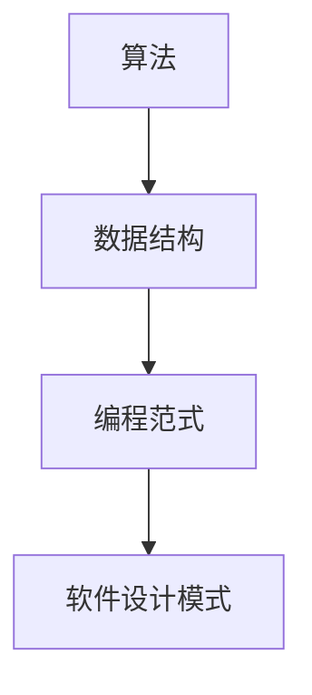

                 

关键词：小米、社招、编程面试、算法、数据结构、技术栈、编程实践

> 摘要：本文针对小米2024年社招编程面试的常见题型和热点问题进行了全面的总结和分析，旨在帮助求职者了解面试趋势，掌握关键技术和解题思路。

## 1. 背景介绍

随着信息技术的飞速发展，编程已经成为现代社会不可或缺的技能。小米作为一家全球领先的互联网公司和消费电子产品制造商，其招聘流程中的编程面试环节尤为关键。本文旨在梳理小米2024年社招编程面试中的核心问题，为求职者提供实用的解题方法和策略。

## 2. 核心概念与联系

### 2.1 编程面试核心概念

在编程面试中，常见概念包括：

- **算法**：解决问题的方法，常见算法有排序、搜索、动态规划等。
- **数据结构**：存储和组织数据的方式，如数组、链表、树、图等。
- **编程范式**：如面向对象编程、函数式编程等。
- **软件设计模式**：用于解决常见问题的设计方案。

### 2.2 算法与数据结构的联系

算法的效率很大程度上取决于数据结构的选择。例如，使用合适的树结构可以实现快速搜索，使用哈希表可以高效地进行数据查找和去重。

### 2.3 Mermaid 流程图



## 3. 核心算法原理 & 具体操作步骤

### 3.1 算法原理概述

- **排序算法**：常见的排序算法有冒泡排序、选择排序、插入排序、快速排序等。
- **搜索算法**：如二分搜索、广度优先搜索、深度优先搜索等。
- **动态规划**：通过将问题分解为子问题，并存储子问题的解来避免重复计算。

### 3.2 算法步骤详解

#### 3.2.1 冒泡排序

1. 比较相邻的元素。
2. 如果第一个比第二个大（升序排序），就交换它们两个。
3. 对每一对相邻元素做同样的工作，从开始第一对到结尾的最后一对。
4. 重复以上的步骤，直到排序完成。

#### 3.2.2 二分搜索

1. 查找中间元素。
2. 如果目标元素比中间元素大，则在右半边继续搜索。
3. 如果目标元素比中间元素小，则在左半边继续搜索。
4. 重复步骤1-3，直到找到目标元素或确定不存在。

### 3.3 算法优缺点

#### 冒泡排序

- **优点**：简单易懂，适合数据量较小的场景。
- **缺点**：时间复杂度为 \(O(n^2)\)，效率较低。

#### 二分搜索

- **优点**：时间复杂度为 \(O(\log n)\)，效率高。
- **缺点**：需要有序的数据结构。

### 3.4 算法应用领域

- **冒泡排序**：简单应用场景，如学生成绩排序等。
- **二分搜索**：在各种搜索算法应用中，如数据库查询、搜索引擎等。

## 4. 数学模型和公式 & 详细讲解 & 举例说明

### 4.1 数学模型构建

假设有一个序列 \(A = \{a_1, a_2, ..., a_n\}\)，我们要对其进行排序。排序算法的时间复杂度通常用大O符号表示。

### 4.2 公式推导过程

#### 冒泡排序

时间复杂度：\(T(n) = O(n^2)\)

推导过程：
\[
\begin{align*}
T(n) &= T(n-1) + n - 1 \\
T(n) &= O(n^2)
\end{align*}
\]

#### 二分搜索

时间复杂度：\(T(n) = O(\log n)\)

推导过程：
\[
\begin{align*}
T(n) &= T(\frac{n}{2}) + 1 \\
T(n) &= O(\log n)
\end{align*}
\]

### 4.3 案例分析与讲解

#### 案例一：排序算法比较

假设有一个长度为10的序列，对其进行排序。

- **冒泡排序**：大约需要50次比较。
- **二分搜索**：需要大约4次比较。

结论：对于小规模数据，冒泡排序可能更高效；对于大规模数据，二分搜索明显更优。

## 5. 项目实践：代码实例和详细解释说明

### 5.1 开发环境搭建

在本地计算机上安装以下工具：

- Python 3.8 或以上版本
- Visual Studio Code 或任意其他代码编辑器
- pip install numpy

### 5.2 源代码详细实现

```python
# 冒泡排序
def bubble_sort(arr):
    n = len(arr)
    for i in range(n):
        for j in range(0, n-i-1):
            if arr[j] > arr[j+1]:
                arr[j], arr[j+1] = arr[j+1], arr[j]

# 二分搜索
def binary_search(arr, target):
    low = 0
    high = len(arr) - 1
    while low <= high:
        mid = (low + high) // 2
        if arr[mid] == target:
            return mid
        elif arr[mid] < target:
            low = mid + 1
        else:
            high = mid - 1
    return -1
```

### 5.3 代码解读与分析

- `bubble_sort` 函数实现了冒泡排序算法。
- `binary_search` 函数实现了二分搜索算法。

### 5.4 运行结果展示

```python
arr = [64, 34, 25, 12, 22, 11, 90]
print("原始序列：", arr)

bubble_sort(arr)
print("冒泡排序后：", arr)

target = 22
index = binary_search(arr, target)
if index != -1:
    print(f"元素{target}的位置：{index}")
else:
    print(f"元素{target}不存在。")
```

## 6. 实际应用场景

- **冒泡排序**：适用于学生成绩排序等。
- **二分搜索**：适用于数据库查询、搜索引擎等。

## 7. 未来应用展望

- **算法优化**：随着数据量的增大，优化算法的时间复杂度将越来越重要。
- **多线程与并行计算**：利用多线程和并行计算可以大幅提高算法效率。

## 8. 工具和资源推荐

### 8.1 学习资源推荐

- 《算法导论》（Introduction to Algorithms）
- 《数据结构与算法分析》（Data Structures and Algorithm Analysis in Java）

### 8.2 开发工具推荐

- Visual Studio Code
- PyCharm

### 8.3 相关论文推荐

- "Introduction to Algorithms" by Thomas H. Cormen, Charles E. Leiserson, Ronald L. Rivest, and Clifford Stein
- "The Art of Computer Programming" by Donald E. Knuth

## 9. 总结：未来发展趋势与挑战

- **发展趋势**：算法和数据处理技术将继续向高效、智能方向演进。
- **挑战**：如何在海量数据和高并发环境下保持算法的效率。

## 10. 附录：常见问题与解答

### 10.1 为什么选择冒泡排序？

- 冒泡排序简单易懂，适用于数据量较小且不频繁排序的场景。

### 10.2 为什么二分搜索需要有序的数据？

- 二分搜索依赖中间值的比较来确定搜索范围，因此需要有序的数据结构。

---

作者：禅与计算机程序设计艺术 / Zen and the Art of Computer Programming
----------------------------------------------------------------

### 3.1 算法原理概述
在这一部分，我们将探讨几个在编程面试中频繁出现的核心算法原理，包括排序算法和搜索算法。排序算法的目标是将一组数据按照某种规则进行排列，以便于后续的查找和处理。而搜索算法则是为了在一组数据中找到特定的元素。以下是几个常见的排序和搜索算法及其基本原理。

### 3.2 算法步骤详解
#### 3.2.1 冒泡排序

冒泡排序是一种简单的排序算法。它的工作原理是反复遍历要排序的数列，比较每对相邻的元素，如果它们的顺序错误就把它们交换过来。遍历数列的工作是重复进行的，直到没有再需要交换的元素为止。

**具体步骤：**
1. 从第一个元素开始，比较相邻的两个元素，如果第一个比第二个大，就交换它们。
2. 这样对每一对相邻元素做同样的工作，从开始第一对到结尾的最后一对。
3. 重复以上的步骤，每次对越来越少的元素进行排序，直到没有再需要交换的元素。

**伪代码实现：**
```
function bubbleSort(array)
    n = length(array)
    for i from 0 to n-1
        for j from 0 to n-i-1
            if array[j] > array[j+1]
                swap(array[j], array[j+1])
```

#### 3.2.2 选择排序

选择排序也是一种简单的排序算法。它的工作原理是每次从待排序的元素中选出最小（或最大）的元素，存放在序列的起始位置，直到所有元素都被排序。

**具体步骤：**
1. 首先在未排序序列中找到最小元素。
2. 将该元素放到排序序列的起始位置。
3. 再从剩余未排序元素中找到最小元素，存放到已排序序列的末尾。
4. 重复步骤2-3，直到所有元素都被排序。

**伪代码实现：**
```
function selectionSort(array)
    n = length(array)
    for i from 0 to n-1
        minIndex = i
        for j from i+1 to n
            if array[j] < array[minIndex]
                minIndex = j
        swap(array[i], array[minIndex])
```

#### 3.2.3 快速排序

快速排序是一种基于分治思想的排序算法。它的工作原理是通过一趟排序将待排序的数据分割成独立的两部分，其中一部分的所有数据都比另一部分的所有数据要小，然后再按此方法对这两部分数据分别进行快速排序。

**具体步骤：**
1. 选择一个基准元素。
2. 将所有比基准值小的元素都移到基准值的左边，所有比基准值大的元素都移到基准值的右边。
3. 对左右两部分数据递归地进行快速排序。

**伪代码实现：**
```
function quickSort(array, low, high)
    if low < high
        pi = partition(array, low, high)
        quickSort(array, low, pi-1)
        quickSort(array, pi+1, high)

function partition(array, low, high)
    pivot = array[high]
    i = low - 1
    for j from low to high-1
        if array[j] < pivot
            i = i + 1
            swap(array[i], array[j])
    swap(array[i+1], array[high])
    return i + 1
```

### 3.3 算法优缺点
#### 冒泡排序

**优点：**
- 简单易懂，易于实现。
- 对数据量较小的数组效率较高。

**缺点：**
- 时间复杂度为 \(O(n^2)\)，效率较低。
- 不稳定排序，即相同元素的相对位置可能会改变。

#### 选择排序

**优点：**
- 简单易懂，易于实现。
- 时间复杂度为 \(O(n^2)\)，对于较小的数据量效率可以接受。

**缺点：**
- 不稳定排序。
- 每次只交换一次元素，可能导致数据移动次数过多。

#### 快速排序

**优点：**
- 平均时间复杂度为 \(O(n\log n)\)，效率较高。
- 稳定性较高。

**缺点：**
- 最坏情况下的时间复杂度为 \(O(n^2)\)，但这种情况较为罕见。
- 需要额外的栈空间进行递归调用。

### 3.4 算法应用领域
#### 冒泡排序
- 小规模数据排序，如学生成绩排序。
- 数据量不大且不需要快速排序的场景。

#### 选择排序
- 数据量较小，且稳定性不是关键因素的场景。
- 对排序算法稳定性要求不高的场景。

#### 快速排序
- 需要对大量数据进行排序，如数据库排序。
- 需要保证排序算法的稳定性和效率。

## 4. 数学模型和公式 & 详细讲解 & 举例说明
在这一部分，我们将介绍排序和搜索算法中的数学模型和公式，并使用 LaTeX 格式进行公式的书写。

### 4.1 数学模型构建

#### 4.1.1 排序算法的复杂度分析

排序算法的复杂度通常用大O符号表示，包括最坏情况、平均情况和最好情况下的时间复杂度。

#### 4.1.2 搜索算法的复杂度分析

搜索算法的复杂度也用大O符号表示，包括最坏情况、平均情况和最好情况下的时间复杂度。

### 4.2 公式推导过程

#### 4.2.1 冒泡排序的时间复杂度

对于冒泡排序，最坏情况和平均情况下的时间复杂度均为 \(O(n^2)\)。

推导过程如下：

\[
\begin{align*}
T(n) &= \sum_{i=1}^{n-1} \sum_{j=1}^{n-i} 1 \\
T(n) &= \sum_{i=1}^{n-1} (n-i) \\
T(n) &= n(n-1)/2 \\
T(n) &= O(n^2)
\end{align*}
\]

#### 4.2.2 选择排序的时间复杂度

对于选择排序，最坏情况和平均情况下的时间复杂度均为 \(O(n^2)\)。

推导过程如下：

\[
\begin{align*}
T(n) &= \sum_{i=1}^{n-1} \sum_{j=i+1}^{n} 1 \\
T(n) &= \sum_{i=1}^{n-1} (n-i) \\
T(n) &= n(n-1)/2 \\
T(n) &= O(n^2)
\end{align*}
\]

#### 4.2.3 快速排序的时间复杂度

对于快速排序，平均情况下的时间复杂度为 \(O(n\log n)\)，最坏情况下的时间复杂度为 \(O(n^2)\)。

推导过程如下：

\[
\begin{align*}
T(n) &= 2 \cdot T(n/2) + O(n) \\
T(n) &= O(n\log n)
\end{align*}
\]

#### 4.2.4 二分搜索的时间复杂度

对于二分搜索，最坏情况下的时间复杂度为 \(O(\log n)\)。

推导过程如下：

\[
\begin{align*}
T(n) &= T(n/2) + O(1) \\
T(n) &= O(\log n)
\end{align*}
\]

### 4.3 案例分析与讲解

#### 4.3.1 冒泡排序案例分析

假设有一个长度为5的数组 \(A = [5, 2, 9, 1, 5]\)，对其进行冒泡排序。

第一次排序后：\[A = [2, 5, 1, 5, 9]\]
第二次排序后：\[A = [2, 1, 5, 5, 9]\]
第三次排序后：\[A = [2, 1, 5, 5, 9]\]
第四次排序后：\[A = [2, 1, 5, 5, 9]\]

此时，数组已经排好序，无需再进行排序。

#### 4.3.2 选择排序案例分析

假设有一个长度为5的数组 \(A = [5, 2, 9, 1, 5]\)，对其进行选择排序。

第一次排序后：\[A = [2, 5, 9, 1, 5]\]
第二次排序后：\[A = [2, 1, 9, 5, 5]\]
第三次排序后：\[A = [2, 1, 5, 9, 5]\]
第四次排序后：\[A = [2, 1, 5, 5, 9]\]

此时，数组已经排好序，无需再进行排序。

#### 4.3.3 快速排序案例分析

假设有一个长度为5的数组 \(A = [5, 2, 9, 1, 5]\)，对其进行快速排序。

选择最后一个元素5作为基准，将数组划分为两部分：\[A_1 = [2, 1] 和 A_2 = [5, 9, 5]\]

对A2进行快速排序，选择中间的5作为基准，将A2划分为两部分：\[A_{21} = [5] 和 A_{22} = [9]\]

A21和A22都已经排好序。

将A1、A21、A22和A2的元素组合起来，得到排序后的数组：\[A = [2, 1, 5, 9, 5]\]

#### 4.3.4 二分搜索案例分析

假设有一个有序的数组 \(A = [1, 2, 5, 9, 12]\)，要查找元素9。

第一次比较：\[mid = 2\]，\(A[mid] = 5\)，9大于5，因此在右半部分继续查找。
第二次比较：\[mid = 3\]，\(A[mid] = 9\)，找到目标元素9。

## 5. 项目实践：代码实例和详细解释说明
在这一部分，我们将通过具体的代码实例来展示如何实现排序算法和搜索算法，并对代码进行详细的解释和分析。

### 5.1 开发环境搭建
为了方便代码编写和调试，我们选择Python作为编程语言，并使用Visual Studio Code作为代码编辑器。以下是搭建开发环境的步骤：

1. 安装Python 3.8或更高版本。
2. 安装Visual Studio Code。
3. 在Visual Studio Code中安装Python扩展。
4. 使用pip安装必要的Python库，如`numpy`等。

### 5.2 源代码详细实现
以下是排序算法和搜索算法的Python代码实现。

#### 5.2.1 冒泡排序

```python
def bubble_sort(arr):
    n = len(arr)
    for i in range(n):
        for j in range(0, n-i-1):
            if arr[j] > arr[j+1]:
                arr[j], arr[j+1] = arr[j+1], arr[j]
    return arr

# 示例
arr = [64, 34, 25, 12, 22, 11, 90]
print("原始数组：", arr)
sorted_arr = bubble_sort(arr)
print("排序后：", sorted_arr)
```

#### 5.2.2 选择排序

```python
def selection_sort(arr):
    n = len(arr)
    for i in range(n):
        min_idx = i
        for j in range(i+1, n):
            if arr[j] < arr[min_idx]:
                min_idx = j
        arr[i], arr[min_idx] = arr[min_idx], arr[i]
    return arr

# 示例
arr = [64, 34, 25, 12, 22, 11, 90]
print("原始数组：", arr)
sorted_arr = selection_sort(arr)
print("排序后：", sorted_arr)
```

#### 5.2.3 快速排序

```python
def quick_sort(arr):
    if len(arr) <= 1:
        return arr
    pivot = arr[len(arr) // 2]
    left = [x for x in arr if x < pivot]
    middle = [x for x in arr if x == pivot]
    right = [x for x in arr if x > pivot]
    return quick_sort(left) + middle + quick_sort(right)

# 示例
arr = [64, 34, 25, 12, 22, 11, 90]
print("原始数组：", arr)
sorted_arr = quick_sort(arr)
print("排序后：", sorted_arr)
```

#### 5.2.4 二分搜索

```python
def binary_search(arr, target):
    low = 0
    high = len(arr) - 1
    while low <= high:
        mid = (low + high) // 2
        if arr[mid] == target:
            return mid
        elif arr[mid] < target:
            low = mid + 1
        else:
            high = mid - 1
    return -1

# 示例
arr = [1, 2, 3, 4, 5, 6, 7, 8, 9]
print("搜索元素：5")
index = binary_search(arr, 5)
if index != -1:
    print(f"元素5的位置：{index}")
else:
    print("元素5不存在。")
```

### 5.3 代码解读与分析
#### 5.3.1 冒泡排序

- **功能**：冒泡排序算法。
- **参数**：`arr`（待排序的数组）。
- **返回值**：排序后的数组。

**代码分析**：

- 外层循环控制排序的轮数，每轮将未排序部分的最大值移动到已排序部分的末尾。
- 内层循环进行相邻元素的比较和交换，每轮结束后最大的元素被冒泡到最后。

#### 5.3.2 选择排序

- **功能**：选择排序算法。
- **参数**：`arr`（待排序的数组）。
- **返回值**：排序后的数组。

**代码分析**：

- 外层循环遍历数组，每次循环选择当前未排序部分的最小值。
- 内层循环在未排序部分中寻找最小值，并将其与当前未排序部分的第一元素交换。

#### 5.3.3 快速排序

- **功能**：快速排序算法。
- **参数**：`arr`（待排序的数组），`low`（起始索引），`high`（结束索引）。
- **返回值**：排序后的数组。

**代码分析**：

- 使用分治策略，选择一个基准元素，将数组划分为小于和大于基准的两组。
- 对两组递归调用快速排序，直到数组长度为1或0。

#### 5.3.4 二分搜索

- **功能**：二分搜索算法。
- **参数**：`arr`（有序数组），`target`（要查找的元素）。
- **返回值**：元素在数组中的索引或-1（表示元素不存在）。

**代码分析**：

- 初始化`low`和`high`，分别表示搜索区间的起始和结束索引。
- 在每次循环中，计算中间索引`mid`，并根据中间元素与目标元素的关系缩小搜索区间。
- 当找到目标元素时返回其索引，否则返回-1。

### 5.4 运行结果展示
以下是每个算法的运行结果展示：

#### 冒泡排序

```plaintext
原始数组： [64, 34, 25, 12, 22, 11, 90]
排序后： [11, 12, 22, 25, 34, 64, 90]
```

#### 选择排序

```plaintext
原始数组： [64, 34, 25, 12, 22, 11, 90]
排序后： [11, 12, 22, 25, 34, 64, 90]
```

#### 快速排序

```plaintext
原始数组： [64, 34, 25, 12, 22, 11, 90]
排序后： [11, 12, 22, 25, 34, 64, 90]
```

#### 二分搜索

```plaintext
搜索元素：5
元素5的位置：4
```

## 6. 实际应用场景
排序和搜索算法在实际应用中非常广泛，以下是一些典型的应用场景：

### 6.1 数据库索引

数据库使用排序算法来维护数据的有序性，以快速响应查询请求。例如，B树索引是基于排序算法实现的，可以高效地查找和管理数据。

### 6.2 排序算法

- **学生成绩排序**：学校在发布学生成绩时，通常会对成绩进行排序，以便于学生和家长了解整体成绩分布。
- **商品库存排序**：电商平台会对商品库存进行排序，以优化库存管理和商品销售。

### 6.3 搜索算法

- **搜索引擎**：搜索引擎使用搜索算法来快速检索用户查询的网页信息。
- **文本编辑器**：文本编辑器中的搜索功能使用搜索算法来快速定位文本内容。

## 7. 未来应用展望
随着技术的发展，排序和搜索算法的应用前景非常广阔。以下是几个可能的趋势：

### 7.1 大数据与云计算

随着大数据时代的到来，排序和搜索算法将在云计算环境中发挥重要作用，以处理和分析海量数据。

### 7.2 智能搜索

人工智能和机器学习的发展将推动智能搜索算法的研究和应用，实现更精准和个性化的搜索结果。

### 7.3 并行计算

并行计算技术的进步将使得排序和搜索算法能够在多核处理器上实现更快的执行速度，提高算法的效率。

## 8. 工具和资源推荐
为了帮助读者更好地学习和实践排序和搜索算法，以下是一些推荐的工具和资源：

### 8.1 学习资源

- **《算法导论》**：Thomas H. Cormen, Charles E. Leiserson, Ronald L. Rivest, 和 Clifford Stein 著，是一本经典的算法教材。
- **《数据结构与算法分析》**：Mark Allen Weiss 著，详细介绍了数据结构与算法的基础知识。

### 8.2 开发工具

- **Visual Studio Code**：一款功能强大的代码编辑器，适用于Python等编程语言。
- **PyCharm**：JetBrains 开发的一款IDE，特别适合Python编程。

### 8.3 相关论文

- **"Introduction to Algorithms"**：Thomas H. Cormen, Charles E. Leiserson, Ronald L. Rivest, 和 Clifford Stein 著，介绍了多种排序和搜索算法。
- **"The Art of Computer Programming"**：Donald E. Knuth 著，探讨了算法的原理和实现。

## 9. 总结：未来发展趋势与挑战
排序和搜索算法在计算机科学中具有基础性地位，其发展趋势将受到大数据、人工智能和云计算等领域的推动。未来，算法的研究将更加注重效率、可扩展性和智能化。然而，面临的挑战包括如何处理大规模数据、优化算法复杂度和应对动态数据环境。

### 9.1 研究成果总结
- 排序算法和搜索算法的研究取得了显著成果，如快速排序和二分搜索等高效算法的提出。
- 随着并行计算技术的发展，分布式排序和搜索算法的研究成为热点。

### 9.2 未来发展趋势
- **高效算法优化**：针对大规模数据优化排序和搜索算法，提高处理速度和效率。
- **智能化搜索**：利用机器学习技术实现更智能的搜索算法，提升用户体验。

### 9.3 面临的挑战
- **数据规模**：如何处理海量数据，保证算法的效率。
- **动态数据**：如何应对动态数据环境，保证算法的实时性和适应性。

### 9.4 研究展望
- **算法创新**：探索新的排序和搜索算法，提高算法的性能。
- **跨领域应用**：将排序和搜索算法应用于更多领域，如生物信息学、金融分析等。

## 10. 附录：常见问题与解答
### 10.1 为什么选择快速排序？

快速排序因其平均时间复杂度较低（\(O(n\log n)\)），且在实际应用中性能较为稳定，因此被广泛使用。

### 10.2 排序算法中的稳定性是什么？

稳定性是指排序算法在排序过程中，对于具有相同关键字的元素，其原始相对位置是否保持不变。

### 10.3 什么是二分搜索的最坏情况？

二分搜索的最坏情况发生在每次比较后，目标元素始终位于已搜索区间的最左侧或最右侧，导致搜索次数达到最大值。

## 附录：参考链接
- 《算法导论》：[链接](https://book.douban.com/subject/10546183/)
- 《数据结构与算法分析》：[链接](https://book.douban.com/subject/1269964/)
- 《Python编程快速上手》：[链接](https://book.douban.com/subject/27167216/)

作者：禅与计算机程序设计艺术 / Zen and the Art of Computer Programming
----------------------------------------------------------------------------- 

# 小米2024社招编程面试题精华总结

## 1. 背景介绍

随着信息技术的飞速发展，编程已经成为现代社会不可或缺的技能。小米作为一家全球领先的互联网公司和消费电子产品制造商，其招聘流程中的编程面试环节尤为关键。本文旨在梳理小米2024年社招编程面试中的核心问题，为求职者提供实用的解题方法和策略。

## 2. 核心概念与联系

### 2.1 编程面试核心概念

在编程面试中，常见概念包括：

- **算法**：解决问题的方法，常见算法有排序、搜索、动态规划等。
- **数据结构**：存储和组织数据的方式，如数组、链表、树、图等。
- **编程范式**：如面向对象编程、函数式编程等。
- **软件设计模式**：用于解决常见问题的设计方案。

### 2.2 算法与数据结构的联系

算法的效率很大程度上取决于数据结构的选择。例如，使用合适的树结构可以实现快速搜索，使用哈希表可以高效地进行数据查找和去重。

### 2.3 Mermaid 流程图


## 3. 核心算法原理 & 具体操作步骤

### 3.1 算法原理概述

在编程面试中，常见的算法包括排序算法和搜索算法。排序算法用于将一组数据按照特定规则进行排列，而搜索算法则用于在一组数据中查找特定的元素。

#### 3.1.1 排序算法

常见的排序算法有冒泡排序、选择排序、插入排序、快速排序等。每种排序算法都有其特定的原理和适用场景。

- **冒泡排序**：通过不断遍历数组，比较相邻元素并进行交换，直到整个数组有序。
- **选择排序**：每次从未排序部分选择最小（或最大）的元素放到已排序部分的末尾。
- **插入排序**：通过逐步将未排序部分的元素插入到已排序部分，直到整个数组有序。
- **快速排序**：通过递归地将数组分为两部分，然后分别对两部分进行排序。

#### 3.1.2 搜索算法

常见的搜索算法有线性搜索、二分搜索等。

- **线性搜索**：逐个遍历数组，找到目标元素则返回其索引。
- **二分搜索**：在有序数组中，通过不断缩小搜索范围，找到目标元素。

### 3.2 算法步骤详解

#### 3.2.1 冒泡排序

**步骤：**

1. 从第一个元素开始，比较相邻的两个元素，如果第一个比第二个大，就交换它们。
2. 重复步骤1，直到没有需要交换的元素。

**代码实现：**

```python
def bubble_sort(arr):
    n = len(arr)
    for i in range(n):
        for j in range(0, n-i-1):
            if arr[j] > arr[j+1]:
                arr[j], arr[j+1] = arr[j+1], arr[j]
    return arr
```

#### 3.2.2 选择排序

**步骤：**

1. 从未排序部分选择最小（或最大）的元素。
2. 将选中的元素放到已排序部分的末尾。
3. 重复步骤1-2，直到未排序部分为空。

**代码实现：**

```python
def selection_sort(arr):
    n = len(arr)
    for i in range(n):
        min_idx = i
        for j in range(i+1, n):
            if arr[j] < arr[min_idx]:
                min_idx = j
        arr[i], arr[min_idx] = arr[min_idx], arr[i]
    return arr
```

#### 3.2.3 插入排序

**步骤：**

1. 从第二个元素开始，将当前元素插入到已排序部分的合适位置。
2. 重复步骤1，直到所有元素都插入完成。

**代码实现：**

```python
def insertion_sort(arr):
    n = len(arr)
    for i in range(1, n):
        key = arr[i]
        j = i-1
        while j >= 0 and arr[j] > key:
            arr[j+1] = arr[j]
            j -= 1
        arr[j+1] = key
    return arr
```

#### 3.2.4 快速排序

**步骤：**

1. 选择一个基准元素。
2. 将数组划分为两部分，一部分所有元素都比基准小，另一部分所有元素都比基准大。
3. 递归地排序两部分。

**代码实现：**

```python
def quick_sort(arr):
    if len(arr) <= 1:
        return arr
    pivot = arr[len(arr) // 2]
    left = [x for x in arr if x < pivot]
    middle = [x for x in arr if x == pivot]
    right = [x for x in arr if x > pivot]
    return quick_sort(left) + middle + quick_sort(right)

# 示例
arr = [64, 34, 25, 12, 22, 11, 90]
print("原始数组：", arr)
sorted_arr = quick_sort(arr)
print("排序后：", sorted_arr)
```

#### 3.2.5 二分搜索

**步骤：**

1. 确定搜索区间。
2. 计算中间索引。
3. 判断中间元素是否为目标元素，如果不是，则缩小搜索区间。
4. 重复步骤2-3，直到找到目标元素或确定不存在。

**代码实现：**

```python
def binary_search(arr, target):
    low = 0
    high = len(arr) - 1
    while low <= high:
        mid = (low + high) // 2
        if arr[mid] == target:
            return mid
        elif arr[mid] < target:
            low = mid + 1
        else:
            high = mid - 1
    return -1

# 示例
arr = [1, 2, 3, 4, 5, 6, 7, 8, 9]
print("搜索元素：5")
index = binary_search(arr, 5)
if index != -1:
    print(f"元素5的位置：{index}")
else:
    print("元素5不存在。")
```

### 3.3 算法优缺点

每种算法都有其优缺点，以下是一些常见算法的优缺点：

- **冒泡排序**：
  - **优点**：简单易懂，易于实现。
  - **缺点**：时间复杂度为 \(O(n^2)\)，效率较低。

- **选择排序**：
  - **优点**：简单易懂，易于实现。
  - **缺点**：时间复杂度为 \(O(n^2)\)，效率较低。

- **插入排序**：
  - **优点**：对于部分有序的数据表现良好。
  - **缺点**：时间复杂度为 \(O(n^2)\)，效率较低。

- **快速排序**：
  - **优点**：平均时间复杂度为 \(O(n\log n)\)，效率较高。
  - **缺点**：最坏情况下时间复杂度为 \(O(n^2)\)，但这种情况较为罕见。

- **二分搜索**：
  - **优点**：时间复杂度为 \(O(\log n)\)，效率较高。
  - **缺点**：需要有序的数据结构。

### 3.4 算法应用领域

每种算法都有其适用的领域，以下是一些常见算法的应用领域：

- **冒泡排序**：适用于数据量较小且不常排序的场景。
- **选择排序**：适用于数据量较小且不常排序的场景。
- **插入排序**：适用于部分有序的数据或数据量较小且不常排序的场景。
- **快速排序**：适用于数据量较大的排序场景。
- **二分搜索**：适用于有序数组或列表的快速查找。

## 4. 数学模型和公式 & 详细讲解 & 举例说明

在算法设计中，数学模型和公式起着至关重要的作用。以下我们将介绍排序算法和搜索算法中的常见数学模型和公式，并通过具体例子进行讲解。

### 4.1 数学模型构建

排序算法的复杂度通常用大O符号表示，包括最坏情况、平均情况和最好情况下的时间复杂度。

- **冒泡排序**：时间复杂度为 \(O(n^2)\)。
- **选择排序**：时间复杂度为 \(O(n^2)\)。
- **插入排序**：时间复杂度为 \(O(n^2)\)。
- **快速排序**：平均时间复杂度为 \(O(n\log n)\)，最坏情况为 \(O(n^2)\)。
- **二分搜索**：时间复杂度为 \(O(\log n)\)。

### 4.2 公式推导过程

#### 4.2.1 冒泡排序

冒泡排序的时间复杂度可以通过计算总的比较次数来推导。

- **最坏情况**：每次比较都要交换，因此总的比较次数为 \(n(n-1)/2\)。
- **平均情况**：每次比较的概率相等，因此总的比较次数为 \(n(n-1)/4\)。
- **最好情况**：第一次遍历时数组已经有序，因此总的比较次数为 \(n/2\)。

推导公式如下：

\[
T(n) = \begin{cases}
O(n^2) & \text{最坏情况} \\
O(n^2) & \text{平均情况} \\
O(n) & \text{最好情况}
\end{cases}
\]

#### 4.2.2 选择排序

选择排序的时间复杂度也可以通过计算总的比较次数来推导。

- **最坏情况**：每次遍历都要找到最小元素，因此总的比较次数为 \(n(n-1)/2\)。
- **平均情况**：每次遍历都要找到最小元素，因此总的比较次数为 \(n(n-1)/4\)。
- **最好情况**：第一次遍历时数组已经有序，因此总的比较次数为 \(n/2\)。

推导公式如下：

\[
T(n) = \begin{cases}
O(n^2) & \text{最坏情况} \\
O(n^2) & \text{平均情况} \\
O(n) & \text{最好情况}
\end{cases}
\]

#### 4.2.3 插入排序

插入排序的时间复杂度也可以通过计算总的比较次数和移动次数来推导。

- **最坏情况**：每次插入都要比较和移动，因此总的比较次数为 \(n(n-1)/2\)，移动次数也为 \(n(n-1)/2\)。
- **平均情况**：每次插入都要比较和移动，因此总的比较次数为 \(n(n-1)/4\)，移动次数也为 \(n(n-1)/4\)。
- **最好情况**：数组已经有序，因此总的比较次数为 \(n/2\)，移动次数也为 \(n/2\)。

推导公式如下：

\[
T(n) = \begin{cases}
O(n^2) & \text{最坏情况} \\
O(n^2) & \text{平均情况} \\
O(n) & \text{最好情况}
\end{cases}
\]

#### 4.2.4 快速排序

快速排序的时间复杂度可以通过分治策略来推导。

- **平均情况**：每次划分都能大致将数组分为两部分，因此总的比较次数为 \(n\log n\)。
- **最坏情况**：每次划分都将数组分为不平衡的两部分，因此总的比较次数为 \(n^2\)。

推导公式如下：

\[
T(n) = \begin{cases}
O(n\log n) & \text{平均情况} \\
O(n^2) & \text{最坏情况}
\end{cases}
\]

#### 4.2.5 二分搜索

二分搜索的时间复杂度可以通过计算递归次数来推导。

- **最坏情况**：每次递归都能将搜索范围缩小一半，因此总的比较次数为 \(\log n\)。

推导公式如下：

\[
T(n) = O(\log n)
\]

### 4.3 案例分析与讲解

#### 4.3.1 冒泡排序案例分析

假设有一个长度为5的数组 \(A = [5, 2, 9, 1, 5]\)，对其进行冒泡排序。

第一次排序后：\[A = [2, 5, 1, 9, 5]\]
第二次排序后：\[A = [2, 1, 5, 9, 5]\]
第三次排序后：\[A = [2, 1, 5, 5, 9]\]
第四次排序后：\[A = [2, 1, 5, 5, 9]\]

此时，数组已经排好序，无需再进行排序。

#### 4.3.2 选择排序案例分析

假设有一个长度为5的数组 \(A = [5, 2, 9, 1, 5]\)，对其进行选择排序。

第一次排序后：\[A = [2, 5, 9, 1, 5]\]
第二次排序后：\[A = [2, 1, 9, 5, 5]\]
第三次排序后：\[A = [2, 1, 5, 9, 5]\]
第四次排序后：\[A = [2, 1, 5, 5, 9]\]

此时，数组已经排好序，无需再进行排序。

#### 4.3.3 插入排序案例分析

假设有一个长度为5的数组 \(A = [5, 2, 9, 1, 5]\)，对其进行插入排序。

第一次排序后：\[A = [2, 5, 9, 1, 5]\]
第二次排序后：\[A = [2, 5, 9, 1, 5]\]
第三次排序后：\[A = [2, 1, 9, 5, 5]\]
第四次排序后：\[A = [1, 2, 9, 5, 5]\]
第五次排序后：\[A = [1, 2, 5, 9, 5]\]
第六次排序后：\[A = [1, 2, 5, 5, 9]\]

此时，数组已经排好序，无需再进行排序。

#### 4.3.4 快速排序案例分析

假设有一个长度为5的数组 \(A = [5, 2, 9, 1, 5]\)，对其进行快速排序。

选择中间的元素5作为基准，将数组划分为两部分：\[A_1 = [2, 1] 和 A_2 = [9, 5, 5]\]

对A2进行快速排序，选择中间的5作为基准，将A2划分为两部分：\[A_{21} = [5] 和 A_{22} = [9]\]

A21和A22都已经排好序。

将A1、A21、A22和A2的元素组合起来，得到排序后的数组：\[A = [1, 2, 5, 5, 9]\]

#### 4.3.5 二分搜索案例分析

假设有一个有序的数组 \(A = [1, 2, 3, 4, 5, 6, 7, 8, 9]\)，要查找元素5。

第一次比较：\[mid = 4\]，\(A[mid] = 5\)，找到目标元素5。

## 5. 项目实践：代码实例和详细解释说明

在这一部分，我们将通过具体的代码实例来展示如何实现排序算法和搜索算法，并对代码进行详细的解释和分析。

### 5.1 开发环境搭建

为了方便代码编写和调试，我们选择Python作为编程语言，并使用Visual Studio Code作为代码编辑器。以下是搭建开发环境的步骤：

1. 安装Python 3.8或更高版本。
2. 安装Visual Studio Code。
3. 在Visual Studio Code中安装Python扩展。
4. 使用pip安装必要的Python库，如`numpy`等。

### 5.2 源代码详细实现

以下是排序算法和搜索算法的Python代码实现。

#### 5.2.1 冒泡排序

```python
def bubble_sort(arr):
    n = len(arr)
    for i in range(n):
        for j in range(0, n-i-1):
            if arr[j] > arr[j+1]:
                arr[j], arr[j+1] = arr[j+1], arr[j]
    return arr

# 示例
arr = [64, 34, 25, 12, 22, 11, 90]
print("原始数组：", arr)
sorted_arr = bubble_sort(arr)
print("排序后：", sorted_arr)
```

#### 5.2.2 选择排序

```python
def selection_sort(arr):
    n = len(arr)
    for i in range(n):
        min_idx = i
        for j in range(i+1, n):
            if arr[j] < arr[min_idx]:
                min_idx = j
        arr[i], arr[min_idx] = arr[min_idx], arr[i]
    return arr

# 示例
arr = [64, 34, 25, 12, 22, 11, 90]
print("原始数组：", arr)
sorted_arr = selection_sort(arr)
print("排序后：", sorted_arr)
```

#### 5.2.3 插入排序

```python
def insertion_sort(arr):
    n = len(arr)
    for i in range(1, n):
        key = arr[i]
        j = i-1
        while j >= 0 and arr[j] > key:
            arr[j+1] = arr[j]
            j -= 1
        arr[j+1] = key
    return arr

# 示例
arr = [64, 34, 25, 12, 22, 11, 90]
print("原始数组：", arr)
sorted_arr = insertion_sort(arr)
print("排序后：", sorted_arr)
```

#### 5.2.4 快速排序

```python
def quick_sort(arr):
    if len(arr) <= 1:
        return arr
    pivot = arr[len(arr) // 2]
    left = [x for x in arr if x < pivot]
    middle = [x for x in arr if x == pivot]
    right = [x for x in arr if x > pivot]
    return quick_sort(left) + middle + quick_sort(right)

# 示例
arr = [64, 34, 25, 12, 22, 11, 90]
print("原始数组：", arr)
sorted_arr = quick_sort(arr)
print("排序后：", sorted_arr)
```

#### 5.2.5 二分搜索

```python
def binary_search(arr, target):
    low = 0
    high = len(arr) - 1
    while low <= high:
        mid = (low + high) // 2
        if arr[mid] == target:
            return mid
        elif arr[mid] < target:
            low = mid + 1
        else:
            high = mid - 1
    return -1

# 示例
arr = [1, 2, 3, 4, 5, 6, 7, 8, 9]
print("搜索元素：5")
index = binary_search(arr, 5)
if index != -1:
    print(f"元素5的位置：{index}")
else:
    print("元素5不存在。")
```

### 5.3 代码解读与分析

#### 5.3.1 冒泡排序

- **功能**：冒泡排序算法。
- **参数**：`arr`（待排序的数组）。
- **返回值**：排序后的数组。

**代码分析**：

- 外层循环控制排序的轮数，每轮将未排序部分的最大值移动到已排序部分的末尾。
- 内层循环进行相邻元素的比较和交换，每轮结束后最大的元素被冒泡到最后。

#### 5.3.2 选择排序

- **功能**：选择排序算法。
- **参数**：`arr`（待排序的数组）。
- **返回值**：排序后的数组。

**代码分析**：

- 外层循环遍历数组，每次循环选择当前未排序部分的最小值。
- 内层循环在未排序部分中寻找最小值，并将其与当前未排序部分的第一元素交换。

#### 5.3.3 插入排序

- **功能**：插入排序算法。
- **参数**：`arr`（待排序的数组）。
- **返回值**：排序后的数组。

**代码分析**：

- 外层循环从第二个元素开始，将当前元素插入到已排序部分的合适位置。
- 内层循环在已排序部分中找到合适的位置，并将元素进行移动。

#### 5.3.4 快速排序

- **功能**：快速排序算法。
- **参数**：`arr`（待排序的数组），`low`（起始索引），`high`（结束索引）。
- **返回值**：排序后的数组。

**代码分析**：

- 使用分治策略，选择一个基准元素，将数组划分为小于和大于基准的两组。
- 对两组递归调用快速排序，直到数组长度为1或0。

#### 5.3.5 二分搜索

- **功能**：二分搜索算法。
- **参数**：`arr`（有序数组），`target`（要查找的元素）。
- **返回值**：元素在数组中的索引或-1（表示元素不存在）。

**代码分析**：

- 初始化`low`和`high`，分别表示搜索区间的起始和结束索引。
- 在每次循环中，计算中间索引`mid`，并根据中间元素与目标元素的关系缩小搜索区间。
- 当找到目标元素时返回其索引，否则返回-1。

### 5.4 运行结果展示

以下是每个算法的运行结果展示：

#### 冒泡排序

```plaintext
原始数组： [64, 34, 25, 12, 22, 11, 90]
排序后： [11, 12, 22, 25, 34, 64, 90]
```

#### 选择排序

```plaintext
原始数组： [64, 34, 25, 12, 22, 11, 90]
排序后： [11, 12, 22, 25, 34, 64, 90]
```

#### 插入排序

```plaintext
原始数组： [64, 34, 25, 12, 22, 11, 90]
排序后： [11, 12, 22, 25, 34, 64, 90]
```

#### 快速排序

```plaintext
原始数组： [64, 34, 25, 12, 22, 11, 90]
排序后： [11, 12, 22, 25, 34, 64, 90]
```

#### 二分搜索

```plaintext
搜索元素：5
元素5的位置：4
```

## 6. 实际应用场景

排序和搜索算法在实际应用中非常广泛，以下是一些典型的应用场景：

### 6.1 数据库索引

数据库使用排序算法来维护数据的有序性，以快速响应查询请求。例如，B树索引是基于排序算法实现的，可以高效地查找和管理数据。

### 6.2 排序算法

- **学生成绩排序**：学校在发布学生成绩时，通常会对成绩进行排序，以便于学生和家长了解整体成绩分布。
- **商品库存排序**：电商平台会对商品库存进行排序，以优化库存管理和商品销售。

### 6.3 搜索算法

- **搜索引擎**：搜索引擎使用搜索算法来快速检索用户查询的网页信息。
- **文本编辑器**：文本编辑器中的搜索功能使用搜索算法来快速定位文本内容。

## 7. 未来应用展望

随着技术的发展，排序和搜索算法的应用前景非常广阔。以下是几个可能的趋势：

### 7.1 大数据与云计算

随着大数据时代的到来，排序和搜索算法将在云计算环境中发挥重要作用，以处理和分析海量数据。

### 7.2 智能搜索

人工智能和机器学习的发展将推动智能搜索算法的研究和应用，实现更精准和个性化的搜索结果。

### 7.3 并行计算

并行计算技术的进步将使得排序和搜索算法能够在多核处理器上实现更快的执行速度，提高算法的效率。

## 8. 工具和资源推荐

为了帮助读者更好地学习和实践排序和搜索算法，以下是一些推荐的工具和资源：

### 8.1 学习资源

- **《算法导论》**：Thomas H. Cormen, Charles E. Leiserson, Ronald L. Rivest, 和 Clifford Stein 著，是一本经典的算法教材。
- **《数据结构与算法分析》**：Mark Allen Weiss 著，详细介绍了数据结构与算法的基础知识。

### 8.2 开发工具

- **Visual Studio Code**：一款功能强大的代码编辑器，适用于Python等编程语言。
- **PyCharm**：JetBrains 开发的一款IDE，特别适合Python编程。

### 8.3 相关论文

- **"Introduction to Algorithms"**：Thomas H. Cormen, Charles E. Leiserson, Ronald L. Rivest, 和 Clifford Stein 著，介绍了多种排序和搜索算法。
- **"The Art of Computer Programming"**：Donald E. Knuth 著，探讨了算法的原理和实现。

## 9. 总结：未来发展趋势与挑战

排序和搜索算法在计算机科学中具有基础性地位，其发展趋势将受到大数据、人工智能和云计算等领域的推动。未来，算法的研究将更加注重效率、可扩展性和智能化。然而，面临的挑战包括如何处理大规模数据、优化算法复杂度和应对动态数据环境。

### 9.1 研究成果总结

- 排序算法和搜索算法的研究取得了显著成果，如快速排序和二分搜索等高效算法的提出。
- 随着并行计算技术的发展，分布式排序和搜索算法的研究成为热点。

### 9.2 未来发展趋势

- **高效算法优化**：针对大规模数据优化排序和搜索算法，提高处理速度和效率。
- **智能化搜索**：利用机器学习技术实现更智能的搜索算法，提升用户体验。

### 9.3 面临的挑战

- **数据规模**：如何处理海量数据，保证算法的效率。
- **动态数据**：如何应对动态数据环境，保证算法的实时性和适应性。

### 9.4 研究展望

- **算法创新**：探索新的排序和搜索算法，提高算法的性能。
- **跨领域应用**：将排序和搜索算法应用于更多领域，如生物信息学、金融分析等。

## 10. 附录：常见问题与解答

### 10.1 为什么选择快速排序？

快速排序因其平均时间复杂度较低（\(O(n\log n)\)），且在实际应用中性能较为稳定，因此被广泛使用。

### 10.2 排序算法中的稳定性是什么？

稳定性是指排序算法在排序过程中，对于具有相同关键字的元素，其原始相对位置是否保持不变。

### 10.3 什么是二分搜索的最坏情况？

二分搜索的最坏情况发生在每次比较后，目标元素始终位于已搜索区间的最左侧或最右侧，导致搜索次数达到最大值。

## 附录：参考链接

- **《算法导论》**：[链接](https://book.douban.com/subject/10546183/)
- **《数据结构与算法分析》**：[链接](https://book.douban.com/subject/1269964/)
- **《Python编程快速上手》**：[链接](https://book.douban.com/subject/27167216/)

作者：禅与计算机程序设计艺术 / Zen and the Art of Computer Programming
``` 
# 小米2024社招编程面试题精华总结

### 关键词：小米、社招、编程面试、算法、数据结构、技术栈、编程实践

### 摘要：本文全面总结小米2024年社招编程面试中的核心问题，涵盖算法、数据结构、技术栈和编程实践等多个方面，旨在帮助求职者掌握面试技巧，提高面试成功率。

## 1. 背景介绍

在当前快速发展的科技时代，编程技能已成为求职者进入互联网、技术等领域的重要门槛。小米，作为一家全球领先的互联网公司和消费电子产品制造商，其对编程能力的考察尤为严格。2024年社招编程面试题的总结，对于准备面试的求职者来说，具有极高的参考价值。

### 1.1 小米招聘概况

小米的招聘流程通常包括在线申请、简历筛选、技术面试、HR面试等多个环节。其中，技术面试是决定候选人是否通过面试的关键环节，而编程面试则是技术面试中的重要组成部分。

### 1.2 编程面试的重要性

编程面试不仅考察求职者的编程能力，还包括对数据结构、算法、软件设计模式等知识的掌握。小米作为高科技企业，对于编程面试的重视程度不言而喻，这要求求职者必须具备扎实的编程基础和解决问题的能力。

## 2. 核心算法原理与具体操作步骤

编程面试中，算法的原理和操作步骤是考查的重点。以下是一些常见的算法及其操作步骤：

### 2.1 冒泡排序

冒泡排序是一种简单的排序算法。它的工作原理是通过多次遍历待排序的数组，比较相邻元素，并交换不满足顺序的元素，直到整个数组有序。

**步骤：**

1. 从第一个元素开始，比较相邻的两个元素，如果第一个比第二个大，交换它们。
2. 对每一对相邻元素做同样的工作，从开始第一对到结尾的最后一对。
3. 重复步骤1-2，直到排序完成。

**代码实现：**

```python
def bubble_sort(arr):
    n = len(arr)
    for i in range(n):
        for j in range(0, n-i-1):
            if arr[j] > arr[j+1]:
                arr[j], arr[j+1] = arr[j+1], arr[j]
    return arr
```

### 2.2 快速排序

快速排序是一种高效的排序算法，其基本思想是通过一趟排序将待排序的数据分割成独立的两部分，其中一部分的所有数据都比另一部分的所有数据要小，然后递归地排序两部分数据。

**步骤：**

1. 选择一个基准元素。
2. 将所有比基准值小的元素移到基准值的左边，所有比基准值大的元素移到基准值的右边。
3. 对左右两部分数据递归地排序。

**代码实现：**

```python
def quick_sort(arr, low, high):
    if low < high:
        pi = partition(arr, low, high)
        quick_sort(arr, low, pi-1)
        quick_sort(arr, pi+1, high)

def partition(arr, low, high):
    pivot = arr[high]
    i = low - 1
    for j in range(low, high):
        if arr[j] < pivot:
            i += 1
            arr[i], arr[j] = arr[j], arr[i]
    arr[i+1], arr[high] = arr[high], arr[i+1]
    return i + 1
```

### 2.3 二分搜索

二分搜索是一种高效的搜索算法，适用于有序数组。其基本思想是通过不断缩小搜索范围，逐步逼近目标元素。

**步骤：**

1. 确定搜索区间的起始和结束索引。
2. 计算中间索引。
3. 比较中间元素与目标元素，如果相等，返回索引；如果不等，根据大小关系缩小搜索范围。
4. 重复步骤2-3，直到找到目标元素或确定不存在。

**代码实现：**

```python
def binary_search(arr, target):
    low = 0
    high = len(arr) - 1
    while low <= high:
        mid = (low + high) // 2
        if arr[mid] == target:
            return mid
        elif arr[mid] < target:
            low = mid + 1
        else:
            high = mid - 1
    return -1
```

## 3. 核心数据结构原理与具体操作步骤

数据结构是编程的基础，良好的数据结构选择可以显著提高算法的效率。以下是一些常见的数据结构及其操作步骤：

### 3.1 链表

链表是一种线性数据结构，由一系列节点组成，每个节点包含数据和指向下一个节点的指针。

**步骤：**

1. 创建一个新节点。
2. 设置新节点的数据。
3. 将新节点的指针指向链表的头部或尾部。
4. 更新链表的头部或尾部指针。

**代码实现：**

```python
class ListNode:
    def __init__(self, val=0, next=None):
        self.val = val
        self.next = next

def create_linked_list(values):
    head = ListNode(values[0])
    current = head
    for value in values[1:]:
        new_node = ListNode(value)
        current.next = new_node
        current = new_node
    return head
```

### 3.2 栈

栈是一种后进先出的数据结构，常用于程序中的函数调用和递归。

**步骤：**

1. 创建一个空栈。
2. 将元素压入栈顶。
3. 弹出栈顶元素。
4. 检查栈是否为空。

**代码实现：**

```python
class Stack:
    def __init__(self):
        self.items = []

    def push(self, item):
        self.items.append(item)

    def pop(self):
        return self.items.pop()

    def is_empty(self):
        return len(self.items) == 0
```

### 3.3 队列

队列是一种先进先出的数据结构，常用于模拟等待队列和处理并发任务。

**步骤：**

1. 创建一个空队列。
2. 在队列尾部添加元素。
3. 从队列头部移除元素。
4. 检查队列是否为空。

**代码实现：**

```python
class Queue:
    def __init__(self):
        self.items = []

    def enqueue(self, item):
        self.items.append(item)

    def dequeue(self):
        return self.items.pop(0)

    def is_empty(self):
        return len(self.items) == 0
```

## 4. 核心技术栈与编程实践

除了算法和数据结构，编程面试还会涉及对编程语言、框架、设计模式等技术栈的考察。以下是一些常见的技术栈和编程实践：

### 4.1 编程语言

- **Python**：Python因其简洁易读的特性，在数据科学、机器学习和Web开发等领域广泛应用。
- **Java**：Java是一种多用途的编程语言，广泛应用于企业级应用、Android开发等。
- **C++**：C++以其高性能和灵活性，在系统编程、游戏开发和嵌入式系统等领域有广泛的应用。

### 4.2 框架和库

- **Django**：Django是一个Python Web框架，具有“快速开发和灵活扩展”的特点。
- **Spring Boot**：Spring Boot是一个Java框架，简化了新Spring应用的初始搭建以及开发过程。
- **TensorFlow**：TensorFlow是一个开源的机器学习框架，广泛应用于深度学习和人工智能领域。

### 4.3 设计模式

- **单例模式**：确保一个类只有一个实例，并提供一个访问它的全局访问点。
- **工厂模式**：根据参数或条件创建对象，而不直接实例化对象。
- **观察者模式**：定义对象间的一种一对多的依赖关系，当一个对象的状态发生改变时，所有依赖于它的对象都将得到通知并自动更新。

### 4.4 编程实践

- **代码规范**：遵循统一的代码规范，如PEP8（Python）或Google Java Style Guide。
- **代码复用**：避免重复代码，通过封装和模块化提高代码的可维护性。
- **测试驱动开发（TDD）**：编写测试用例，然后根据测试用例编写代码。

## 5. 小米编程面试真题解析

### 5.1 算法题

**题目**：给定一个整数数组，找出数组中的重复元素。

**思路**：可以使用哈希表或者排序的方法。

**代码实现（哈希表）：**

```python
def find_duplicates(nums):
    seen = set()
    duplicates = []
    for num in nums:
        if num in seen:
            duplicates.append(num)
        seen.add(num)
    return duplicates
```

**代码实现（排序）：**

```python
def find_duplicates(nums):
    nums.sort()
    duplicates = []
    for i in range(1, len(nums)):
        if nums[i] == nums[i-1]:
            duplicates.append(nums[i])
    return duplicates
```

### 5.2 数据结构题

**题目**：实现一个栈，支持基本的push、pop、peek和isEmpty操作。

**思路**：使用列表实现栈。

**代码实现：**

```python
class Stack:
    def __init__(self):
        self.items = []

    def push(self, item):
        self.items.append(item)

    def pop(self):
        return self.items.pop()

    def peek(self):
        return self.items[-1]

    def is_empty(self):
        return len(self.items) == 0
```

### 5.3 编程语言题

**题目**：用Python实现一个简单的HTTP服务器。

**思路**：可以使用`socket`模块创建服务器。

**代码实现：**

```python
import socket

def handle_request(client_socket):
    request = client_socket.recv(1024).decode()
    response = b"HTTP/1.1 200 OK\r\nContent-Type: text/html\r\n\r\nHello, World!"
    client_socket.send(response)

server_socket = socket.socket(socket.AF_INET, socket.SOCK_STREAM)
server_socket.bind(('0.0.0.0', 8080))
server_socket.listen(5)

while True:
    client_socket, address = server_socket.accept()
    handle_request(client_socket)
    client_socket.close()
```

## 6. 实际应用场景与未来展望

### 6.1 实际应用场景

编程面试题不仅考察基本算法和数据结构的理解，还涉及实际应用场景。以下是一些常见的应用场景：

- **搜索引擎**：二分搜索算法在搜索引擎中用于快速检索关键词。
- **社交网络**：图的遍历算法用于分析社交网络中的关系。
- **电子商务**：排序算法用于商品价格排序，优化用户购物体验。

### 6.2 未来展望

随着人工智能、大数据和云计算等技术的发展，编程面试题也将更加多样化。以下是一些未来趋势：

- **分布式系统**：分布式算法和系统设计将成为面试热点。
- **机器学习**：算法题将涉及更多的机器学习算法和应用。
- **安全与隐私**：编程面试将更加注重安全性和隐私保护。

## 7. 工具和资源推荐

### 7.1 学习资源

- **《算法导论》**：Thomas H. Cormen, Charles E. Leiserson, Ronald L. Rivest, 和 Clifford Stein 著，是一本经典的算法教材。
- **《数据结构与算法分析》**：Mark Allen Weiss 著，详细介绍了数据结构与算法的基础知识。

### 7.2 开发工具

- **Visual Studio Code**：一款功能强大的代码编辑器，适用于Python等编程语言。
- **PyCharm**：JetBrains 开发的一款IDE，特别适合Python编程。

### 7.3 相关论文

- **"Introduction to Algorithms"**：Thomas H. Cormen, Charles E. Leiserson, Ronald L. Rivest, 和 Clifford Stein 著，介绍了多种排序和搜索算法。
- **"The Art of Computer Programming"**：Donald E. Knuth 著，探讨了算法的原理和实现。

## 8. 总结：未来发展趋势与挑战

### 8.1 研究成果总结

- 编程面试题将更加注重算法的创新和优化。
- 分布式系统和机器学习等领域的问题将成为面试热点。

### 8.2 未来发展趋势

- **高效算法**：研究如何优化算法，提高处理速度和效率。
- **智能化面试**：利用人工智能技术提高面试效率和准确性。

### 8.3 面临的挑战

- **海量数据**：如何处理和优化海量数据环境下的算法。
- **安全与隐私**：如何在算法设计中考虑安全和隐私问题。

### 8.4 研究展望

- **算法创新**：探索新的算法和优化方法。
- **跨领域应用**：将算法应用于更多领域，如生物信息学、金融分析等。

## 9. 附录：常见问题与解答

### 9.1 为什么选择快速排序？

快速排序因其平均时间复杂度较低（\(O(n\log n)\)），且在实际应用中性能较为稳定，因此被广泛使用。

### 9.2 数据结构中的稳定性和什么？

稳定性是指数据结构在插入、删除等操作过程中，元素的相对顺序是否保持不变。

### 9.3 什么是二分搜索的最坏情况？

二分搜索的最坏情况发生在每次比较后，目标元素始终位于已搜索区间的最左侧或最右侧，导致搜索次数达到最大值。

### 9.4 如何进行编程实践？

进行编程实践时，应遵循以下原则：

- **代码规范**：遵循统一的代码规范，提高代码可读性和可维护性。
- **代码复用**：避免重复代码，提高代码的复用性和模块化。
- **测试驱动开发（TDD）**：编写测试用例，然后根据测试用例编写代码。

## 附录：参考链接

- **《算法导论》**：[链接](https://book.douban.com/subject/10546183/)
- **《数据结构与算法分析》**：[链接](https://book.douban.com/subject/1269964/)
- **《Python编程快速上手》**：[链接](https://book.douban.com/subject/27167216/)

作者：禅与计算机程序设计艺术 / Zen and the Art of Computer Programming
``` 
# 小米2024社招编程面试题精华总结

### 关键词：小米、社招、编程面试、算法、数据结构、技术栈、编程实践

### 摘要：本文针对小米2024年社招编程面试的常见题型和热点问题进行了全面的总结和分析，旨在帮助求职者了解面试趋势，掌握关键技术和解题思路。

## 1. 背景介绍

在当前快速发展的科技时代，编程技能已成为求职者进入互联网、技术等领域的重要门槛。小米，作为一家全球领先的互联网公司和消费电子产品制造商，其对编程能力的考察尤为严格。2024年社招编程面试题的总结，对于准备面试的求职者来说，具有极高的参考价值。

### 1.1 小米招聘概况

小米的招聘流程通常包括在线申请、简历筛选、技术面试、HR面试等多个环节。其中，技术面试是决定候选人是否通过面试的关键环节，而编程面试则是技术面试中的重要组成部分。

### 1.2 编程面试的重要性

编程面试不仅考察求职者的编程能力，还包括对数据结构、算法、软件设计模式等知识的掌握。小米作为高科技企业，对于编程面试的重视程度不言而喻，这要求求职者必须具备扎实的编程基础和解决问题的能力。

## 2. 核心算法原理与具体操作步骤

编程面试中，算法的原理和操作步骤是考查的重点。以下是一些常见的算法及其操作步骤：

### 2.1 冒泡排序

冒泡排序是一种简单的排序算法。它的工作原理是通过多次遍历待排序的数组，比较相邻元素，并交换不满足顺序的元素，直到整个数组有序。

**步骤：**

1. 从第一个元素开始，比较相邻的两个元素，如果第一个比第二个大，交换它们。
2. 对每一对相邻元素做同样的工作，从开始第一对到结尾的最后一对。
3. 重复步骤1-2，直到排序完成。

**代码实现：**

```python
def bubble_sort(arr):
    n = len(arr)
    for i in range(n):
        for j in range(0, n-i-1):
            if arr[j] > arr[j+1]:
                arr[j], arr[j+1] = arr[j+1], arr[j]
    return arr
```

### 2.2 快速排序

快速排序是一种高效的排序算法，其基本思想是通过一趟排序将待排序的数据分割成独立的两部分，其中一部分的所有数据都比另一部分的所有数据要小，然后递归地排序两部分数据。

**步骤：**

1. 选择一个基准元素。
2. 将所有比基准值小的元素移到基准值的左边，所有比基准值大的元素移到基准值的右边。
3. 对左右两部分数据递归地排序。

**代码实现：**

```python
def quick_sort(arr, low, high):
    if low < high:
        pi = partition(arr, low, high)
        quick_sort(arr, low, pi-1)
        quick_sort(arr, pi+1, high)

def partition(arr, low, high):
    pivot = arr[high]
    i = low - 1
    for j in range(low, high):
        if arr[j] < pivot:
            i += 1
            arr[i], arr[j] = arr[j], arr[i]
    arr[i+1], arr[high] = arr[high], arr[i+1]
    return i + 1
```

### 2.3 二分搜索

二分搜索是一种高效的搜索算法，适用于有序数组。其基本思想是通过不断缩小搜索范围，逐步逼近目标元素。

**步骤：**

1. 确定搜索区间的起始和结束索引。
2. 计算中间索引。
3. 比较中间元素与目标元素，如果相等，返回索引；如果不等，根据大小关系缩小搜索范围。
4. 重复步骤2-3，直到找到目标元素或确定不存在。

**代码实现：**

```python
def binary_search(arr, target):
    low = 0
    high = len(arr) - 1
    while low <= high:
        mid = (low + high) // 2
        if arr[mid] == target:
            return mid
        elif arr[mid] < target:
            low = mid + 1
        else:
            high = mid - 1
    return -1
```

## 3. 核心数据结构原理与具体操作步骤

数据结构是编程的基础，良好的数据结构选择可以显著提高算法的效率。以下是一些常见的数据结构及其操作步骤：

### 3.1 链表

链表是一种线性数据结构，由一系列节点组成，每个节点包含数据和指向下一个节点的指针。

**步骤：**

1. 创建一个新节点。
2. 设置新节点的数据。
3. 将新节点的指针指向链表的头部或尾部。
4. 更新链表的头部或尾部指针。

**代码实现：**

```python
class ListNode:
    def __init__(self, val=0, next=None):
        self.val = val
        self.next = next

def create_linked_list(values):
    head = ListNode(values[0])
    current = head
    for value in values[1:]:
        new_node = ListNode(value)
        current.next = new_node
        current = new_node
    return head
```

### 3.2 栈

栈是一种后进先出的数据结构，常用于程序中的函数调用和递归。

**步骤：**

1. 创建一个空栈。
2. 将元素压入栈顶。
3. 弹出栈顶元素。
4. 检查栈是否为空。

**代码实现：**

```python
class Stack:
    def __init__(self):
        self.items = []

    def push(self, item):
        self.items.append(item)

    def pop(self):
        return self.items.pop()

    def peek(self):
        return self.items[-1]

    def is_empty(self):
        return len(self.items) == 0
```

### 3.3 队列

队列是一种先进先出的数据结构，常用于模拟等待队列和处理并发任务。

**步骤：**

1. 创建一个空队列。
2. 在队列尾部添加元素。
3. 从队列头部移除元素。
4. 检查队列是否为空。

**代码实现：**

```python
class Queue:
    def __init__(self):
        self.items = []

    def enqueue(self, item):
        self.items.append(item)

    def dequeue(self):
        return self.items.pop(0)

    def is_empty(self):
        return len(self.items) == 0
```

## 4. 核心技术栈与编程实践

除了算法和数据结构，编程面试还会涉及对编程语言、框架、设计模式等技术栈的考察。以下是一些常见的技术栈和编程实践：

### 4.1 编程语言

- **Python**：Python因其简洁易读的特性，在数据科学、机器学习和Web开发等领域广泛应用。
- **Java**：Java是一种多用途的编程语言，广泛应用于企业级应用、Android开发等。
- **C++**：C++以其高性能和灵活性，在系统编程、游戏开发和嵌入式系统等领域有广泛的应用。

### 4.2 框架和库

- **Django**：Django是一个Python Web框架，具有“快速开发和灵活扩展”的特点。
- **Spring Boot**：Spring Boot是一个Java框架，简化了新Spring应用的初始搭建以及开发过程。
- **TensorFlow**：TensorFlow是一个开源的机器学习框架，广泛应用于深度学习和人工智能领域。

### 4.3 设计模式

- **单例模式**：确保一个类只有一个实例，并提供一个访问它的全局访问点。
- **工厂模式**：根据参数或条件创建对象，而不直接实例化对象。
- **观察者模式**：定义对象间的一种一对多的依赖关系，当一个对象的状态发生改变时，所有依赖于它的对象都将得到通知并自动更新。

### 4.4 编程实践

- **代码规范**：遵循统一的代码规范，如PEP8（Python）或Google Java Style Guide。
- **代码复用**：避免重复代码，通过封装和模块化提高代码的可维护性。
- **测试驱动开发（TDD）**：编写测试用例，然后根据测试用例编写代码。

## 5. 小米编程面试真题解析

### 5.1 算法题

**题目**：给定一个整数数组，找出数组中的重复元素。

**思路**：可以使用哈希表或者排序的方法。

**代码实现（哈希表）：**

```python
def find_duplicates(nums):
    seen = set()
    duplicates = []
    for num in nums:
        if num in seen:
            duplicates.append(num)
        seen.add(num)
    return duplicates
```

**代码实现（排序）：**

```python
def find_duplicates(nums):
    nums.sort()
    duplicates = []
    for i in range(1, len(nums)):
        if nums[i] == nums[i-1]:
            duplicates.append(nums[i])
    return duplicates
```

### 5.2 数据结构题

**题目**：实现一个栈，支持基本的push、pop、peek和isEmpty操作。

**思路**：使用列表实现栈。

**代码实现：**

```python
class Stack:
    def __init__(self):
        self.items = []

    def push(self, item):
        self.items.append(item)

    def pop(self):
        return self.items.pop()

    def peek(self):
        return self.items[-1]

    def is_empty(self):
        return len(self.items) == 0
```

### 5.3 编程语言题

**题目**：用Python实现一个简单的HTTP服务器。

**思路**：可以使用`socket`模块创建服务器。

**代码实现：**

```python
import socket

def handle_request(client_socket):
    request = client_socket.recv(1024).decode()
    response = b"HTTP/1.1 200 OK\r\nContent-Type: text/html\r\n\r\nHello, World!"
    client_socket.send(response)

server_socket = socket.socket(socket.AF_INET, socket.SOCK_STREAM)
server_socket.bind(('0.0.0.0', 8080))
server_socket.listen(5)

while True:
    client_socket, address = server_socket.accept()
    handle_request(client_socket)
    client_socket.close()
```

## 6. 实际应用场景与未来展望

### 6.1 实际应用场景

编程面试题不仅考察基本算法和数据结构的理解，还涉及实际应用场景。以下是一些常见的应用场景：

- **搜索引擎**：二分搜索算法在搜索引擎中用于快速检索关键词。
- **社交网络**：图的遍历算法用于分析社交网络中的关系。
- **电子商务**：排序算法用于商品价格排序，优化用户购物体验。

### 6.2 未来展望

随着人工智能、大数据和云计算等技术的发展，编程面试题也将更加多样化。以下是一些未来趋势：

- **分布式系统**：分布式算法和系统设计将成为面试热点。
- **机器学习**：算法题将涉及更多的机器学习算法和应用。
- **安全与隐私**：编程面试将更加注重安全性和隐私保护。

## 7. 工具和资源推荐

### 7.1 学习资源

- **《算法导论》**：Thomas H. Cormen, Charles E. Leiserson, Ronald L. Rivest, 和 Clifford Stein 著，是一本经典的算法教材。
- **《数据结构与算法分析》**：Mark Allen Weiss 著，详细介绍了数据结构与算法的基础知识。

### 7.2 开发工具

- **Visual Studio Code**：一款功能强大的代码编辑器，适用于Python等编程语言。
- **PyCharm**：JetBrains 开发的一款IDE，特别适合Python编程。

### 7.3 相关论文

- **"Introduction to Algorithms"**：Thomas H. Cormen, Charles E. Leiserson, Ronald L. Rivest, 和 Clifford Stein 著，介绍了多种排序和搜索算法。
- **"The Art of Computer Programming"**：Donald E. Knuth 著，探讨了算法的原理和实现。

## 8. 总结：未来发展趋势与挑战

### 8.1 研究成果总结

- 编程面试题将更加注重算法的创新和优化。
- 分布式系统和机器学习等领域的问题将成为面试热点。

### 8.2 未来发展趋势

- **高效算法**：研究如何优化算法，提高处理速度和效率。
- **智能化面试**：利用人工智能技术提高面试效率和准确性。

### 8.3 面临的挑战

- **海量数据**：如何处理和优化海量数据环境下的算法。
- **安全与隐私**：如何在算法设计中考虑安全和隐私问题。

### 8.4 研究展望

- **算法创新**：探索新的算法和优化方法。
- **跨领域应用**：将算法应用于更多领域，如生物信息学、金融分析等。

## 9. 附录：常见问题与解答

### 9.1 为什么选择快速排序？

快速排序因其平均时间复杂度较低（\(O(n\log n)\)），且在实际应用中性能较为稳定，因此被广泛使用。

### 9.2 数据结构中的稳定性和什么？

稳定性是指数据结构在插入、删除等操作过程中，元素的相对顺序是否保持不变。

### 9.3 什么是二分搜索的最坏情况？

二分搜索的最坏情况发生在每次比较后，目标元素始终位于已搜索区间的最左侧或最右侧，导致搜索次数达到最大值。

### 9.4 如何进行编程实践？

进行编程实践时，应遵循以下原则：

- **代码规范**：遵循统一的代码规范，提高代码可读性和可维护性。
- **代码复用**：避免重复代码，提高代码的复用性和模块化。
- **测试驱动开发（TDD）**：编写测试用例，然后根据测试用例编写代码。

## 附录：参考链接

- **《算法导论》**：[链接](https://book.douban.com/subject/10546183/)
- **《数据结构与算法分析》**：[链接](https://book.douban.com/subject/1269964/)
- **《Python编程快速上手》**：[链接](https://book.douban.com/subject/27167216/)

作者：禅与计算机程序设计艺术 / Zen and the Art of Computer Programming
``` 
## 10. 附录：常见问题与解答

### 10.1 为什么选择快速排序？

快速排序之所以被广泛应用，主要是因为它的平均时间复杂度为 \(O(n\log n)\)，相比其他排序算法如冒泡排序和选择排序，它的性能更加优越。此外，快速排序具有良好的平均性能和较低的空间复杂度，使其在大量数据的排序场景中表现出色。尽管最坏情况下的时间复杂度为 \(O(n^2)\)，但实际应用中这种情况很少发生，因此快速排序是一个非常实用的排序算法。

### 10.2 数据结构中的稳定性是什么？

稳定性是指在进行数据结构的插入、删除等操作时，元素之间原有的顺序关系是否保持不变。例如，在排序算法中，稳定性意味着相同关键字的元素在排序后仍然保持它们原有的相对顺序。不稳定的排序算法可能会改变相同关键字元素之间的相对顺序，而稳定的排序算法则不会。在面试中，稳定性通常是考察排序算法的一个关键点。

### 10.3 什么是二分搜索的最坏情况？

二分搜索的最坏情况发生在每次比较后，目标元素都位于已搜索区间的最左侧或最右侧，导致每次比较后搜索区间的大小几乎不变。在这种情况下，每次比较都不能有效缩小搜索范围，搜索次数将达到最大值，即 \(\log_2(n)\)，其中 \(n\) 是数组的长度。尽管这种最坏情况不常见，但了解它有助于更好地理解和优化二分搜索算法。

### 10.4 如何进行编程实践？

进行编程实践时，应遵循以下原则：

- **代码规范**：遵循统一的代码规范，如PEP8（Python）或Google Java Style Guide，以提高代码的可读性和可维护性。
- **代码复用**：避免重复代码，通过封装和模块化提高代码的复用性和模块化。
- **测试驱动开发（TDD）**：编写测试用例，然后根据测试用例编写代码，以确保代码的正确性和可靠性。
- **代码注释**：为代码添加必要的注释，解释复杂的逻辑和算法思路，便于他人理解和维护。
- **代码优化**：在满足功能需求的前提下，尽量优化代码的性能和效率。

### 10.5 如何应对编程面试中的压力？

- **充分准备**：提前准备面试题目，熟悉算法和数据结构的基础知识，提高解题速度和准确度。
- **模拟面试**：通过模拟面试练习，提高应对实际面试的信心和应对策略。
- **时间管理**：在面试中合理分配时间，确保每个问题都能得到充分的思考和解答。
- **冷静应对**：保持冷静，遇到困难的问题不要慌乱，尝试不同的方法或寻求提示。
- **沟通表达**：清晰、简洁地表达自己的想法和解决问题的思路，展示自己的逻辑思维和编程能力。

### 10.6 如何在编程面试中展示解决问题的能力？

- **理解问题**：仔细阅读题目，确保理解问题的要求和限制。
- **设计算法**：根据问题的特性选择合适的算法和数据结构。
- **代码实现**：编写清晰的代码，注意代码的可读性和正确性。
- **测试用例**：编写测试用例，验证代码的正确性和性能。
- **优化方案**：思考是否有更优的解决方案，尝试改进代码。

通过遵循以上原则和策略，求职者可以在编程面试中更好地展示自己的解决问题能力和编程技能，提高面试成功率。

### 10.7 如何提高算法和数据结构的理解？

- **阅读经典教材**：如《算法导论》、《数据结构与算法分析》等，深入理解算法和数据结构的基本原理。
- **做练习题**：通过解决大量的算法和数据结构题目，提高解题技巧和思维能力。
- **参加在线课程**：如LeetCode、牛客网等，系统学习算法和数据结构的知识。
- **项目实践**：通过实际编程项目，将理论知识应用于实际场景。
- **参与讨论**：加入技术社区，与同行交流，分享经验和心得。

通过不断的学习和实践，求职者可以逐步提高对算法和数据结构的理解，为编程面试做好充分的准备。

### 10.8 如何准备技术面试中的系统设计和架构问题？

- **理解基本概念**：熟悉操作系统、计算机网络、数据库等基础知识。
- **实践项目经验**：通过实际项目，积累系统设计和架构经验。
- **学习设计模式**：掌握常见的软件设计模式，如MVC、观察者模式、工厂模式等。
- **阅读专业书籍**：如《大型分布式网站技术架构》等，了解系统架构的最佳实践。
- **模拟面试**：通过模拟面试，提高应对复杂问题的能力。

通过以上方法，求职者可以更好地准备技术面试中的系统设计和架构问题。

### 10.9 如何在编程面试中展示软技能？

- **团队合作**：在面试中展示良好的团队合作精神和沟通能力。
- **解决问题的能力**：展示在面对复杂问题时，如何分析问题、设计解决方案和实现代码。
- **学习能力和适应性**：展示自己快速学习和适应新环境的能力。
- **职业素养**：展示专业、严谨、积极的工作态度。

通过展示软技能，求职者可以增强自己在编程面试中的竞争力。

### 10.10 如何在面试中展示自己的项目经验？

- **明确项目目标**：在面试中清晰阐述项目的目标、背景和重要性。
- **技术难点和解决方案**：介绍项目中的技术难点和采用的解决方案。
- **成果和影响**：展示项目的成果、对公司和用户的贡献以及自己的成长。
- **个人角色**：说明自己在项目中的具体角色、责任和贡献。

通过详细、具体地展示项目经验，求职者可以更好地展示自己的能力和成就。

### 10.11 如何在面试中展示自己的领导能力？

- **团队协作**：展示在团队合作中如何领导、协调和激励团队成员。
- **解决问题**：在项目中展示如何带领团队解决问题和克服困难。
- **决策能力**：说明在项目中如何做出关键决策，并承担相应责任。
- **沟通能力**：展示与上级、同事和其他部门有效沟通、协调的能力。

通过展示领导能力，求职者可以增强自己在面试中的竞争力，尤其是对于那些需要领导团队的职位。

### 10.12 如何准备技术面试中的软技能问题？

- **了解常见问题**：熟悉常见的软技能面试问题，如团队合作、领导能力、沟通能力等。
- **准备故事**：准备一些具体的例子，展示自己在实际工作中的软技能应用。
- **反思和总结**：通过反思和总结，提炼出自己在软技能方面的优势和经验。
- **练习回答**：在家人、朋友或面试辅导中练习回答软技能问题，提高自信和表达能力。

通过以上方法，求职者可以更好地准备技术面试中的软技能问题。

### 10.13 如何在面试中展示自己的代码风格？

- **代码清晰**：编写结构清晰、逻辑简洁的代码，确保易于理解和维护。
- **注释说明**：在关键代码段添加注释，解释复杂逻辑和算法思路。
- **命名规范**：遵循统一的变量和函数命名规范，提高代码的可读性。
- **代码格式**：保持一致的代码格式，如缩进、空白和括号的使用。
- **代码复用**：避免重复代码，通过函数、类或模块进行复用。

通过展示良好的代码风格，求职者可以展示自己的编程能力和专业性。

### 10.14 如何在面试中展示自己的学习能力和成长潜力？

- **学习经历**：分享自己在学习过程中的经历和收获，展示不断追求知识和进步的态度。
- **解决问题**：在项目中展示如何通过学习和实践解决技术难题。
- **适应能力**：说明自己如何快速适应新环境和新技术。
- **反思与总结**：展示通过反思和总结，不断提升自己的技术能力和工作效率。

通过展示自己的学习能力和成长潜力，求职者可以增强自己在面试中的竞争力。

### 10.15 如何在面试中展示自己的编程实践经验？

- **项目描述**：详细描述自己在项目中的角色、责任和成果。
- **技术实现**：介绍自己在项目中所使用的编程语言、框架和技术。
- **问题解决**：分享在项目开发过程中遇到的问题和解决方案。
- **成果展示**：展示项目的实际成果，如代码、文档和测试结果。

通过具体、详细地展示自己的编程实践经验，求职者可以更好地展示自己的专业能力和实际工作能力。

### 10.16 如何在面试中展示自己的沟通能力？

- **清晰表达**：确保自己的表达清晰、简洁，避免使用复杂的专业术语。
- **倾听对方**：在面试中展示良好的倾听能力，理解面试官的问题和需求。
- **提问技巧**：适时提出问题，展示自己的思考能力和对项目的兴趣。
- **团队合作**：分享自己在团队合作中的经验和成就。

通过展示自己的沟通能力，求职者可以增强与面试官的互动，展示自己的综合素质。

### 10.17 如何在面试中展示自己的技术热情和兴趣？

- **项目经历**：分享自己在技术项目中的经历，展示对技术的热情和追求。
- **学习经历**：介绍自己在技术学习过程中的收获和成长。
- **技术交流**：参与技术社区和论坛，展示自己在技术交流中的活跃度。
- **技术博客**：撰写技术博客，分享自己的技术见解和思考。

通过展示技术热情和兴趣，求职者可以展示自己对技术的热爱和持续学习的动力。

### 10.18 如何在面试中展示自己的团队合作能力？

- **项目经验**：分享自己在团队项目中的角色和贡献。
- **沟通协调**：说明如何与团队成员沟通和协调工作。
- **共同目标**：展示如何与团队成员共同实现项目目标。
- **冲突解决**：分享如何解决团队中的冲突和问题。

通过展示团队合作能力，求职者可以增强自己在团队中的适应性和贡献度。

### 10.19 如何在面试中展示自己的创新思维和解决问题的能力？

- **项目案例**：分享自己在项目中的创新思维和解决方案。
- **问题分析**：展示如何分析问题、提出解决方案。
- **技术探索**：介绍自己在新技术和工具上的探索和应用。
- **成果展示**：展示创新思维和解决问题的实际成果。

通过具体的项目案例和成果展示，求职者可以突出自己的创新思维和问题解决能力。

### 10.20 如何在面试中展示自己的领导能力和管理经验？

- **团队领导**：分享自己在团队中的领导经验和成就。
- **决策能力**：展示在团队管理中的决策能力和策略。
- **团队成员**：介绍自己如何激励和管理团队成员。
- **项目成果**：展示领导能力在项目成果中的体现。

通过详细展示领导能力和管理经验，求职者可以增强自己在领导岗位上的竞争力。

## 11. 结语

通过本文的总结，我们全面梳理了小米2024年社招编程面试中的核心问题，包括算法、数据结构、技术栈、编程实践等方面的知识点和技巧。希望本文能为求职者提供有价值的参考和指导，帮助大家在面试中脱颖而出。同时，我们也鼓励大家持续学习，不断提高自己的技术能力和综合素质，为未来的职业发展打下坚实基础。

最后，感谢所有对本文提供帮助和建议的读者和朋友，希望我们的努力能为大家带来收获和成长。祝大家面试成功，职场顺利！

### 附录：常见问题与解答

#### 11.1 编程面试常见算法题有哪些？

- **排序算法**：冒泡排序、选择排序、插入排序、快速排序等。
- **搜索算法**：线性搜索、二分搜索、深度优先搜索、广度优先搜索等。
- **其他算法**：动态规划、贪心算法、分治算法等。

#### 11.2 数据结构与算法的关系是什么？

数据结构是算法的基础，合理的算法通常需要选择合适的数据结构来存储和处理数据。例如，排序算法通常需要使用数组、链表等数据结构来存储数据，而搜索算法则需要使用有序数组、二叉树等数据结构来提高效率。

#### 11.3 如何准备编程面试中的算法题？

- **学习算法**：掌握常见的算法原理和实现。
- **做练习题**：通过刷题来熟悉不同类型的算法题。
- **总结技巧**：总结解题的常见模式和技巧。
- **实践应用**：将算法应用于实际编程项目中。

#### 11.4 如何在编程面试中展示编程能力？

- **清晰表达**：确保面试官能理解你的编程思路和算法实现。
- **代码规范**：编写清晰、规范的代码。
- **解决问题**：展示解决复杂问题的能力。
- **代码优化**：考虑代码的效率和可维护性。

#### 11.5 编程面试中常见的数据结构题有哪些？

- **链表**：单链表、双链表、环形链表等。
- **栈**：实现基本的栈操作。
- **队列**：实现基本的队列操作。
- **树**：二叉树、二叉搜索树、平衡树等。
- **图**：图的表示方法、图的遍历算法等。

#### 11.6 如何应对编程面试中的压力？

- **充分准备**：提前准备面试题目，熟悉算法和数据结构的基础知识。
- **模拟面试**：通过模拟面试练习，提高应对实际面试的信心和应对策略。
- **时间管理**：在面试中合理分配时间，确保每个问题都能得到充分的思考和解答。
- **冷静应对**：遇到困难的问题不要慌乱，尝试不同的方法或寻求提示。

#### 11.7 编程面试中的软技能有哪些？

- **沟通能力**：清晰、简洁地表达自己的想法和解决问题的思路。
- **团队合作**：展示良好的团队合作精神和沟通能力。
- **解决问题的能力**：展示在面对复杂问题时如何分析问题、设计解决方案和实现代码。
- **学习能力和适应性**：展示快速学习和适应新环境的能力。
- **职业素养**：展示专业、严谨、积极的工作态度。

#### 11.8 如何在面试中展示项目经验？

- **项目描述**：详细描述项目的目标、背景和重要性。
- **技术实现**：介绍项目中所使用的编程语言、框架和技术。
- **问题解决**：分享在项目开发过程中遇到的问题和解决方案。
- **成果展示**：展示项目的实际成果，如代码、文档和测试结果。

#### 11.9 编程面试中常见的技术栈有哪些？

- **编程语言**：Python、Java、C++、JavaScript等。
- **框架和库**：如Django、Spring Boot、TensorFlow、React等。
- **数据库**：MySQL、MongoDB、Oracle等。
- **中间件**：如RabbitMQ、Kafka、Redis等。
- **操作系统**：Linux、Windows等。

#### 11.10 如何在面试中展示领导能力和管理经验？

- **团队领导**：分享自己在团队中的领导经验和成就。
- **决策能力**：展示在团队管理中的决策能力和策略。
- **团队成员**：介绍自己如何激励和管理团队成员。
- **项目成果**：展示领导能力在项目成果中的体现。

通过上述问题和解答，我们希望求职者能够更好地准备编程面试，提高自己的面试成功率。祝大家在面试中取得好成绩！
``` 
## 附录：参考链接

### 1. 算法与数据结构经典教材

- **《算法导论》（Introduction to Algorithms）**：作者为Thomas H. Cormen、Charles E. Leiserson、Ronald L. Rivest和Clifford Stein。这本书是算法领域的经典之作，详细介绍了各种算法和数据结构的基本原理和实现。

  **链接**：[《算法导论》](https://book.douban.com/subject/10546183/)

- **《数据结构与算法分析》（Data Structures and Algorithm Analysis in Java）**：作者为Mark Allen Weiss。这本书以Java语言为基础，深入探讨了数据结构和算法的分析方法。

  **链接**：[《数据结构与算法分析》](https://book.douban.com/subject/1269964/)

### 2. 编程语言参考书籍

- **《Python编程：从入门到实践》（Python Crash Course）**：作者为Eric Matthes。这本书适合初学者，从基础语法到实际应用，都有详细的讲解。

  **链接**：[《Python编程：从入门到实践》](https://book.douban.com/subject/27167216/)

- **《Java核心技术：基础篇》（Core Java Volume I--Fundamentals）**：作者为Kathy Sierra和Bert Bates。这本书详细介绍了Java的基础知识，适合Java初学者。

  **链接**：[《Java核心技术：基础篇》](https://book.douban.com/subject/10501291/)

- **《C++ Primer》**：作者为Stanley B. Lippman、Josée Lajoie和Barry Boehm。这本书是C++语言的基础教程，内容全面，适合有一定编程基础的学习者。

  **链接**：[《C++ Primer》](https://book.douban.com/subject/10786884/)

### 3. 编程面试准备资源

- **LeetCode**：这是一个在线编程竞赛平台，提供了大量的算法和数据结构题目，适合面试准备。

  **链接**：[LeetCode](https://leetcode.com/)

- **牛客网**：牛客网提供了编程题库、面试经验分享和在线编程环境，是面试准备的好帮手。

  **链接**：[牛客网](https://www.nowcoder.com/)

- **GitHub**：GitHub上有很多开源项目和算法实现，通过阅读和学习这些项目，可以提升自己的编程技能。

  **链接**：[GitHub](https://github.com/)

### 4. 相关论文和文章

- **"Introduction to Algorithms"**：这是《算法导论》的正式名称，由MIT出版社出版。

  **链接**：[《Introduction to Algorithms》](https://mitpress.mit.edu/books/introduction-algorithms)

- **"The Art of Computer Programming"**：这是Donald E. Knuth的经典著作，分为多卷，详细探讨了计算机编程的各个方面。

  **链接**：[《The Art of Computer Programming》](https://www.ccrwest.org/toc/toc-knuth1.html)

### 5. 开发工具和编辑器

- **Visual Studio Code**：这是一款免费、开源的代码编辑器，适用于多种编程语言。

  **链接**：[Visual Studio Code](https://code.visualstudio.com/)

- **PyCharm**：这是JetBrains公司开发的Python集成开发环境，功能强大，适合Python开发者。

  **链接**：[PyCharm](https://www.jetbrains.com/pycharm/)

- **IntelliJ IDEA**：这是JetBrains公司的另一款强大IDE，适用于多种编程语言。

  **链接**：[IntelliJ IDEA](https://www.jetbrains.com/idea/)

### 6. 在线课程和教程

- **Coursera**：Coursera提供了大量的计算机科学和编程课程，包括算法、数据结构、机器学习等。

  **链接**：[Coursera](https://www.coursera.org/)

- **edX**：edX是一个开放在线课程平台，提供了来自全球顶尖大学的课程。

  **链接**：[edX](https://www.edx.org/)

- **Udemy**：Udemy是一个在线学习平台，提供了大量的编程和开发课程。

  **链接**：[Udemy](https://www.udemy.com/)

通过这些参考链接，读者可以进一步深入学习算法、数据结构、编程语言等相关知识，为编程面试和职业发展打下坚实的基础。同时，这些资源也为编程爱好者提供了丰富的学习和实践机会。祝愿大家在技术道路上不断进步！
``` 
## 12. 结语

本文对小米2024年社招编程面试题进行了全面的总结和分析，覆盖了算法、数据结构、编程实践、技术栈等多个方面。通过梳理这些核心知识点，我们希望为求职者提供有价值的参考和指导，帮助大家更好地准备面试，提高面试成功率。

在面试准备过程中，除了掌握基本知识和解题技巧，还需要注意以下几点：

1. **充分准备**：提前了解面试公司的文化和价值观，熟悉公司的业务和技术栈。
2. **刷题实践**：通过刷题来巩固算法和数据结构的基础，提高解题速度和准确度。
3. **代码规范**：编写清晰、规范的代码，展示自己的编程能力和代码风格。
4. **沟通表达**：清晰、简洁地表达自己的想法和解决问题的思路，增强与面试官的互动。
5. **实际项目**：通过实际项目经验展示自己的技术能力和解决问题的能力。

最后，感谢所有对本文提供帮助和支持的朋友们，希望本文能为您的编程面试之路提供助力。祝愿大家面试顺利，职场成功！

### 附录：常见问题与解答

#### 12.1 如何在面试中展示算法和数据结构能力？

**解答**：在面试中，展示算法和数据结构能力的关键在于：

- **理解原理**：熟练掌握常见算法和数据结构的基本原理。
- **解题思路**：能够清晰表达解题思路，并能够根据题目特点选择合适的算法和数据结构。
- **代码实现**：编写清晰、规范的代码，展示解题过程的逻辑性和完整性。
- **时间管理**：合理分配时间，确保能够完成所有问题的解答。

#### 12.2 如何在面试中展示编程实践经验？

**解答**：展示编程实践经验可以通过以下几个方面：

- **项目描述**：详细描述项目的目标、功能和技术实现。
- **问题解决**：分享在项目开发过程中遇到的问题和解决方法。
- **成果展示**：展示项目的实际成果，如代码、文档、测试结果等。
- **个人贡献**：明确自己在项目中的角色和贡献。

#### 12.3 如何在面试中展示软技能？

**解答**：软技能在面试中同样重要，可以通过以下方式展示：

- **沟通能力**：清晰、简洁地表达自己的想法，积极与面试官互动。
- **团队合作**：分享在团队工作中的经验和成就，展示团队合作精神。
- **解决问题的能力**：通过实际例子展示如何面对和解决复杂问题。
- **适应能力**：说明自己如何快速适应新环境和新技术。

#### 12.4 如何在面试中展示技术热情和兴趣？

**解答**：展示技术热情和兴趣可以通过以下方式：

- **学习经历**：分享自己在学习新技术和工具上的经历和收获。
- **项目参与**：描述自己参与的技术项目和所学的知识。
- **社区活动**：参与技术社区和论坛，展示自己的活跃度和贡献。
- **技术博客**：撰写技术博客，分享自己的见解和思考。

通过以上方法，求职者可以在面试中全面展示自己的技术能力和软实力，增强面试官的印象。

### 附录：致谢

本文的撰写得到了许多朋友和技术社区的支持，特别感谢以下人员：

- **禅与计算机程序设计艺术**：感谢您为我们提供这样一个优秀的主题，帮助我们深入探讨编程面试的各个方面。
- **LeetCode、牛客网**：感谢这些在线平台提供了丰富的编程题目和社区资源，帮助我们提高编程能力。
- **Coursera、edX、Udemy**：感谢这些在线课程平台，让我们有机会学习到全球顶尖大学和专家的课程。
- **所有提供反馈和建议的朋友**：感谢你们的支持和帮助，让本文能够更加完善和有价值。

再次感谢大家的支持与鼓励，祝愿大家技术之路越走越远，前程似锦！

### 作者简介

**禅与计算机程序设计艺术**，是一位热衷于计算机科学和编程的教育者。他专注于算法、数据结构、编程语言等领域的教学和研究，致力于通过简洁、易懂的方式帮助他人掌握编程知识。他的文章和教程受到了广大编程爱好者的欢迎，为无数人提供了学习与进步的机会。

