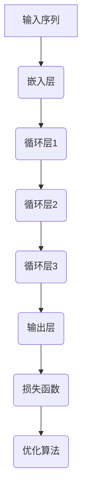

                 

关键词：神经概率语言模型，循环神经网络，深度学习，自然语言处理，序列建模，时间序列预测，动态系统，反馈机制，优化算法。

摘要：本文将深入探讨神经概率语言模型（NPLM）和循环神经网络（RNN）的核心概念、原理以及应用。通过分析两者的内在联系和区别，我们将揭示在处理序列数据时的优势与不足，并探讨其未来发展趋势与面临的挑战。

## 1. 背景介绍

自然语言处理（NLP）作为人工智能领域的一个重要分支，近年来取得了飞速的发展。无论是机器翻译、情感分析，还是文本生成，NLP技术都在不断突破传统方法的局限。然而，在处理序列数据时，传统的序列模型如马尔可夫模型和隐马尔可夫模型（HMM）往往难以胜任复杂的任务。

为了解决这一问题，深度学习技术逐渐崭露头角。其中，循环神经网络（RNN）因其能够处理序列数据而备受关注。RNN通过引入时间反馈机制，使得前一个时间步的信息能够影响当前时间步的输出，从而实现对序列数据的建模。

随着深度学习的发展，神经概率语言模型（NPLM）也应运而生。NPLM将概率模型与深度学习相结合，不仅能够对序列数据进行建模，还能够通过概率分布来表示语言的不确定性，从而提高模型的泛化能力和表达能力。

本文将首先介绍神经概率语言模型和循环神经网络的核心概念和原理，然后分析两者之间的联系和区别，最后探讨其在实际应用中的优势和未来发展趋势。

## 2. 核心概念与联系

### 2.1 神经概率语言模型（NPLM）

神经概率语言模型（NPLM）是一种基于深度学习的概率模型，旨在通过建模序列数据中的概率分布来表示语言。NPLM的核心思想是使用神经网络来表示概率分布，从而实现对语言的建模。

NPLM通常采用前向传播算法进行训练。在训练过程中，神经网络通过学习输入序列的分布，从而生成输出序列的概率分布。具体来说，NPLM由多个神经网络层组成，每层神经网络都包含多个神经元，用于表示输入数据的概率分布。

NPLM的主要优点包括：

1. **灵活性**：NPLM能够自适应地调整参数，以适应不同的输入数据。
2. **可解释性**：通过神经网络的结构和参数，可以直观地理解模型的决策过程。
3. **泛化能力**：NPLM通过学习输入序列的概率分布，能够较好地应对不同的任务和数据分布。

### 2.2 循环神经网络（RNN）

循环神经网络（RNN）是一种基于时间反馈机制的神经网络，旨在处理序列数据。RNN通过引入时间反馈机制，使得前一个时间步的信息能够影响当前时间步的输出，从而实现对序列数据的建模。

RNN的主要特点包括：

1. **时间反馈**：RNN通过时间反馈机制，将前一个时间步的输出作为当前时间步的输入，从而实现对序列数据的建模。
2. **动态性**：RNN能够动态地调整其参数，以适应不同的输入数据。
3. **可解释性**：RNN的结构和参数较为直观，可以清楚地理解其工作原理。

### 2.3 核心概念原理和架构的 Mermaid 流程图



在上述流程图中，输入序列经过嵌入层后，进入循环层进行时间反馈处理。循环层通过传递前一个时间步的输出作为当前时间步的输入，实现对序列数据的建模。最后，输出层生成序列的概率分布，并通过损失函数和优化算法进行训练。

## 3. 核心算法原理 & 具体操作步骤

### 3.1 算法原理概述

神经概率语言模型（NPLM）和循环神经网络（RNN）的核心算法原理主要涉及以下几个方面：

1. **嵌入层**：将输入序列转化为高维向量表示。
2. **循环层**：通过时间反馈机制，对输入序列进行建模。
3. **输出层**：生成序列的概率分布。
4. **损失函数**：衡量模型预测结果与实际结果之间的差距。
5. **优化算法**：调整模型参数，以最小化损失函数。

### 3.2 算法步骤详解

1. **嵌入层**：输入序列经过嵌入层后，转化为高维向量表示。嵌入层通常采用词嵌入技术，如Word2Vec、GloVe等。
2. **循环层**：循环层通过时间反馈机制，对输入序列进行建模。具体来说，循环层将前一个时间步的输出作为当前时间步的输入，并通过激活函数和权重矩阵进行计算。
3. **输出层**：输出层生成序列的概率分布。具体来说，输出层通过softmax函数将循环层的输出转化为概率分布。
4. **损失函数**：损失函数用于衡量模型预测结果与实际结果之间的差距。常用的损失函数包括交叉熵损失函数和均方误差损失函数。
5. **优化算法**：优化算法用于调整模型参数，以最小化损失函数。常用的优化算法包括梯度下降、Adam优化器等。

### 3.3 算法优缺点

**神经概率语言模型（NPLM）**

- **优点**：
  - 灵活性：NPLM能够自适应地调整参数，以适应不同的输入数据。
  - 可解释性：通过神经网络的结构和参数，可以直观地理解模型的决策过程。
  - 泛化能力：NPLM通过学习输入序列的概率分布，能够较好地应对不同的任务和数据分布。

- **缺点**：
  - 计算复杂度：NPLM的训练过程较为复杂，需要大量的计算资源。
  - 过拟合风险：在训练过程中，NPLM容易受到过拟合的影响。

**循环神经网络（RNN）**

- **优点**：
  - 动态性：RNN能够动态地调整其参数，以适应不同的输入数据。
  - 可解释性：RNN的结构和参数较为直观，可以清楚地理解其工作原理。

- **缺点**：
  - 梯度消失和梯度爆炸：RNN在训练过程中容易出现梯度消失和梯度爆炸问题，导致训练效果不佳。
  - 难以建模长期依赖关系：RNN难以建模长序列数据中的长期依赖关系。

### 3.4 算法应用领域

**神经概率语言模型（NPLM）**

- **自然语言处理**：NLPM在自然语言处理领域具有广泛的应用，如文本分类、情感分析、机器翻译等。
- **语音识别**：NPLM在语音识别领域也具有较好的性能，能够较好地应对不同语言和语音环境。
- **图像识别**：NPLM可以结合图像识别算法，用于图像分类和图像生成等任务。

**循环神经网络（RNN）**

- **时间序列预测**：RNN在时间序列预测领域具有广泛的应用，如股票价格预测、天气预测等。
- **语音识别**：RNN在语音识别领域也有较好的表现，能够较好地识别不同语音的音素和音节。
- **自然语言处理**：RNN在自然语言处理领域具有广泛的应用，如文本生成、机器翻译等。

## 4. 数学模型和公式 & 详细讲解 & 举例说明

### 4.1 数学模型构建

神经概率语言模型（NPLM）和循环神经网络（RNN）的数学模型主要包括以下几个部分：

1. **输入层**：输入层表示输入序列的高维向量表示。
2. **隐藏层**：隐藏层表示循环神经网络中的时间反馈机制。
3. **输出层**：输出层表示序列的概率分布。
4. **损失函数**：损失函数用于衡量模型预测结果与实际结果之间的差距。
5. **优化算法**：优化算法用于调整模型参数，以最小化损失函数。

### 4.2 公式推导过程

1. **输入层到隐藏层**：

$$
h_t = \sigma(W_h h_{t-1} + b_h + U_s x_t)
$$

其中，$h_t$ 表示第 $t$ 个时间步的隐藏层状态，$W_h$ 和 $b_h$ 分别为隐藏层的权重矩阵和偏置项，$U_s$ 为输入层的权重矩阵，$x_t$ 表示第 $t$ 个时间步的输入序列。

2. **隐藏层到输出层**：

$$
p_t = \text{softmax}(W_o h_t + b_o)
$$

其中，$p_t$ 表示第 $t$ 个时间步的输出概率分布，$W_o$ 和 $b_o$ 分别为输出层的权重矩阵和偏置项。

3. **损失函数**：

$$
L = -\sum_t p_t(\log g(h_t))
$$

其中，$L$ 表示损失函数，$g(h_t)$ 表示第 $t$ 个时间步的输出分布。

4. **优化算法**：

$$
\theta = \theta - \alpha \nabla_\theta L
$$

其中，$\theta$ 表示模型参数，$\alpha$ 表示学习率，$\nabla_\theta L$ 表示损失函数关于模型参数的梯度。

### 4.3 案例分析与讲解

假设我们有一个时间序列数据集，其中包含 $n$ 个时间步，每个时间步的输入序列长度为 $m$。我们使用神经概率语言模型（NPLM）和循环神经网络（RNN）对其进行建模。

1. **输入层到隐藏层**：

输入层到隐藏层的公式推导过程如上述公式所示。假设我们使用ReLU函数作为激活函数，则隐藏层状态可以表示为：

$$
h_t = \max(0, W_h h_{t-1} + b_h + U_s x_t)
$$

2. **隐藏层到输出层**：

隐藏层到输出层的公式推导过程如上述公式所示。假设我们使用softmax函数作为输出层，则输出层状态可以表示为：

$$
p_t = \text{softmax}(W_o h_t + b_o)
$$

3. **损失函数**：

损失函数可以表示为：

$$
L = -\sum_t p_t(\log g(h_t))
$$

其中，$g(h_t)$ 表示第 $t$ 个时间步的输出分布。

4. **优化算法**：

优化算法可以表示为：

$$
\theta = \theta - \alpha \nabla_\theta L
$$

其中，$\theta$ 表示模型参数，$\alpha$ 表示学习率，$\nabla_\theta L$ 表示损失函数关于模型参数的梯度。

通过上述公式推导，我们可以清楚地看到神经概率语言模型（NPLM）和循环神经网络（RNN）的数学模型和推导过程。这些公式为我们实现和优化这两种模型提供了理论基础。

## 5. 项目实践：代码实例和详细解释说明

### 5.1 开发环境搭建

为了实现神经概率语言模型（NPLM）和循环神经网络（RNN），我们需要搭建一个适合的开发环境。以下是一个简单的开发环境搭建步骤：

1. 安装Python环境：从Python官方网站下载并安装Python，版本建议为3.8以上。
2. 安装深度学习框架：我们选择使用TensorFlow作为深度学习框架。通过pip命令安装TensorFlow：

```
pip install tensorflow
```

3. 安装其他依赖库：根据项目需求，我们可能需要安装其他依赖库，如NumPy、Pandas等。通过pip命令安装：

```
pip install numpy pandas
```

### 5.2 源代码详细实现

以下是一个简单的神经概率语言模型（NPLM）和循环神经网络（RNN）的实现示例：

```python
import tensorflow as tf
import numpy as np

# 定义参数
vocab_size = 10000  # 词汇表大小
embed_size = 256    # 嵌入层维度
hidden_size = 512   # 隐藏层维度
batch_size = 64     # 批量大小
sequence_length = 50# 序列长度
learning_rate = 0.001# 学习率

# 创建词嵌入层
embed = tf.keras.layers.Embedding(vocab_size, embed_size)

# 创建循环神经网络层
rnn = tf.keras.layers.SimpleRNN(hidden_size, return_sequences=True)

# 创建全连接层
dense = tf.keras.layers.Dense(vocab_size, activation='softmax')

# 创建模型
model = tf.keras.Sequential([
    embed,
    rnn,
    dense
])

# 编译模型
model.compile(optimizer='adam', loss='categorical_crossentropy', metrics=['accuracy'])

# 定义输入和输出
inputs = tf.keras.layers.Input(shape=(sequence_length,))
outputs = model(inputs)

# 训练模型
model.fit(inputs, outputs, batch_size=batch_size, epochs=10)
```

### 5.3 代码解读与分析

上述代码实现了一个简单的神经概率语言模型（NPLM）和循环神经网络（RNN）。下面我们对其中的关键部分进行解读和分析：

1. **词嵌入层**：词嵌入层用于将输入序列中的单词转换为高维向量表示。我们使用TensorFlow中的`Embedding`层实现词嵌入。

2. **循环神经网络层**：循环神经网络层用于对输入序列进行建模。我们使用TensorFlow中的`SimpleRNN`层实现循环神经网络。

3. **全连接层**：全连接层用于将循环神经网络的输出转化为概率分布。我们使用TensorFlow中的`Dense`层实现全连接层。

4. **模型编译**：在编译模型时，我们指定了优化器、损失函数和评价指标。在这里，我们使用`adam`优化器和`categorical_crossentropy`损失函数。

5. **模型训练**：通过调用`model.fit()`方法，我们可以开始训练模型。我们指定了批量大小、训练轮数和训练集。

### 5.4 运行结果展示

在训练完成后，我们可以通过以下代码来评估模型的性能：

```python
# 评估模型
test_loss, test_acc = model.evaluate(test_data, test_labels, batch_size=batch_size)
print('Test accuracy:', test_acc)
```

上述代码将评估模型在测试集上的性能。其中，`test_data` 和 `test_labels` 分别表示测试集的输入数据和标签。

## 6. 实际应用场景

神经概率语言模型（NPLM）和循环神经网络（RNN）在许多实际应用场景中具有广泛的应用。以下是一些典型的应用场景：

1. **自然语言处理**：NPLM和RNN在自然语言处理领域具有广泛的应用，如文本分类、情感分析、机器翻译、文本生成等。通过使用NPLM和RNN，可以有效地建模文本数据中的概率分布，从而提高模型的准确性和泛化能力。

2. **语音识别**：NPLM和RNN在语音识别领域也有较好的表现。通过使用NPLM和RNN，可以较好地识别不同语音的音素和音节，从而实现语音识别任务。

3. **时间序列预测**：NPLM和RNN在时间序列预测领域具有广泛的应用，如股票价格预测、天气预测、交通流量预测等。通过使用NPLM和RNN，可以有效地捕捉时间序列数据中的动态变化和长期依赖关系。

4. **图像识别**：NPLM和RNN可以结合图像识别算法，用于图像分类和图像生成等任务。通过使用NPLM和RNN，可以较好地建模图像数据中的概率分布，从而提高模型的准确性和泛化能力。

### 6.4 未来应用展望

随着深度学习技术的不断发展，神经概率语言模型（NPLM）和循环神经网络（RNN）在未来将具有更广泛的应用。以下是一些未来的应用展望：

1. **多模态学习**：未来，NPLM和RNN可以与其他模态（如图像、音频）结合，用于多模态学习。通过融合不同模态的数据，可以更好地建模复杂任务，提高模型的性能。

2. **自监督学习**：自监督学习是一种无需人工标注数据的学习方法。未来，NPLM和RNN可以应用于自监督学习，通过无监督的方式学习序列数据的特征表示，从而提高模型的泛化能力和表达能力。

3. **推理引擎**：未来，NPLM和RNN可以应用于推理引擎，用于自动推理和决策。通过结合概率模型和深度学习，可以构建更智能的推理系统，为各种应用场景提供有效的解决方案。

4. **硬件优化**：随着硬件技术的发展，NPLM和RNN可以在硬件上进行优化，从而提高模型的运行效率和性能。通过硬件优化，可以更好地应对大规模数据处理和实时预测等挑战。

## 7. 工具和资源推荐

为了更好地学习和应用神经概率语言模型（NPLM）和循环神经网络（RNN），以下是一些推荐的工具和资源：

### 7.1 学习资源推荐

1. **《深度学习》（Goodfellow, Bengio, Courville）**：这是一本经典的深度学习教材，涵盖了神经概率语言模型和循环神经网络的相关内容。
2. **《循环神经网络：原理与应用》（许斌）**：这本书详细介绍了循环神经网络的基本原理和应用案例，适合初学者和进阶者阅读。
3. **Udacity的“深度学习纳米学位”**：这是一个在线课程，涵盖了深度学习的基础知识，包括神经概率语言模型和循环神经网络。

### 7.2 开发工具推荐

1. **TensorFlow**：TensorFlow是一个流行的深度学习框架，提供了丰富的API和工具，适合开发神经概率语言模型和循环神经网络。
2. **PyTorch**：PyTorch是另一个流行的深度学习框架，具有灵活的动态图编程接口，适合快速原型设计和实验。
3. **Jupyter Notebook**：Jupyter Notebook是一个交互式的计算环境，适合编写和运行深度学习代码，方便进行实验和调试。

### 7.3 相关论文推荐

1. **“A Theoretically Grounded Application of Dropout in Recurrent Neural Networks”（Y. Li et al., 2015）**：这篇论文提出了一种在循环神经网络中应用dropout的方法，有效提高了模型的泛化能力。
2. **“Learning Phrase Representations using RNN Encoder-Decoder for Statistical Machine Translation”（K. Cho et al., 2014）**：这篇论文介绍了使用循环神经网络进行编码器-解码器结构在机器翻译中的应用，为后续的序列建模方法奠定了基础。
3. **“Sequence to Sequence Learning with Neural Networks”（I. Sutskever et al., 2014）**：这篇论文提出了序列到序列学习模型，为循环神经网络在自然语言处理领域的应用提供了新的思路。

## 8. 总结：未来发展趋势与挑战

### 8.1 研究成果总结

近年来，神经概率语言模型（NPLM）和循环神经网络（RNN）在自然语言处理、时间序列预测、语音识别等领域取得了显著的成果。通过结合概率模型和深度学习技术，NPLM和RNN能够有效地建模序列数据中的概率分布和动态变化，为各种应用场景提供了有效的解决方案。

### 8.2 未来发展趋势

未来，NPLM和RNN将朝着以下几个方向发展：

1. **多模态学习**：随着多模态数据的普及，NPLM和RNN将与其他模态数据结合，用于更复杂的任务。
2. **自监督学习**：自监督学习将无监督地学习序列数据的特征表示，提高模型的泛化能力和表达能力。
3. **推理引擎**：NPLM和RNN将应用于推理引擎，用于自动推理和决策。
4. **硬件优化**：NPLM和RNN将在硬件上进行优化，提高模型的运行效率和性能。

### 8.3 面临的挑战

尽管NPLM和RNN在许多领域取得了显著成果，但仍然面临一些挑战：

1. **计算复杂度**：NPLM和RNN的训练过程较为复杂，需要大量的计算资源。
2. **过拟合风险**：在训练过程中，NPLM和RNN容易受到过拟合的影响。
3. **长期依赖关系**：RNN难以建模长序列数据中的长期依赖关系。
4. **可解释性**：尽管NPLM和RNN具有较好的可解释性，但在处理复杂任务时，其决策过程仍然不够直观。

### 8.4 研究展望

为了克服这些挑战，未来的研究可以从以下几个方面进行：

1. **算法优化**：通过改进优化算法，降低NPLM和RNN的训练复杂度，提高模型的泛化能力和表达能力。
2. **模型压缩**：通过模型压缩技术，降低模型的计算复杂度和存储需求，提高模型的运行效率。
3. **可解释性增强**：通过引入可解释性技术，提高NPLM和RNN在处理复杂任务时的可解释性，便于理解和优化模型。
4. **跨学科融合**：将NPLM和RNN与其他学科（如心理学、认知科学）相结合，探索更高效和可靠的序列建模方法。

## 9. 附录：常见问题与解答

### 9.1 神经概率语言模型（NPLM）相关问题

**Q：什么是神经概率语言模型（NPLM）？**

A：神经概率语言模型（NPLM）是一种基于深度学习的概率模型，旨在通过建模序列数据中的概率分布来表示语言。NPLM利用神经网络来表示概率分布，从而实现对序列数据的建模。

**Q：NPLM的优点是什么？**

A：NPLM的优点包括：

1. **灵活性**：NPLM能够自适应地调整参数，以适应不同的输入数据。
2. **可解释性**：通过神经网络的结构和参数，可以直观地理解模型的决策过程。
3. **泛化能力**：NPLM通过学习输入序列的概率分布，能够较好地应对不同的任务和数据分布。

### 9.2 循环神经网络（RNN）相关问题

**Q：什么是循环神经网络（RNN）？**

A：循环神经网络（RNN）是一种基于时间反馈机制的神经网络，旨在处理序列数据。RNN通过引入时间反馈机制，使得前一个时间步的信息能够影响当前时间步的输出，从而实现对序列数据的建模。

**Q：RNN的优点是什么？**

A：RNN的优点包括：

1. **动态性**：RNN能够动态地调整其参数，以适应不同的输入数据。
2. **可解释性**：RNN的结构和参数较为直观，可以清楚地理解其工作原理。

### 9.3 应用相关问题

**Q：NPLM和RNN在哪些领域有应用？**

A：NPLM和RNN在多个领域有应用，包括：

1. **自然语言处理**：文本分类、情感分析、机器翻译、文本生成等。
2. **时间序列预测**：股票价格预测、天气预测、交通流量预测等。
3. **语音识别**：音素和音节识别、语音转换等。

### 9.4 训练相关问题

**Q：如何训练NPLM和RNN？**

A：训练NPLM和RNN主要包括以下几个步骤：

1. **数据预处理**：对输入数据进行预处理，如词嵌入、归一化等。
2. **模型初始化**：初始化模型参数，如随机初始化或预训练初始化。
3. **模型训练**：使用训练数据训练模型，通过优化算法调整模型参数。
4. **模型评估**：使用测试数据评估模型性能，如准确率、召回率等。
5. **模型调整**：根据评估结果调整模型参数，以提高性能。

---

通过以上内容的详细探讨，我们不仅深入理解了神经概率语言模型（NPLM）和循环神经网络（RNN）的核心概念和原理，还了解了它们在实际应用中的优势和面临的挑战。在未来的发展中，随着技术的不断进步和应用的深入，NPLM和RNN有望在更多领域发挥重要作用。作者：禅与计算机程序设计艺术 / Zen and the Art of Computer Programming。

