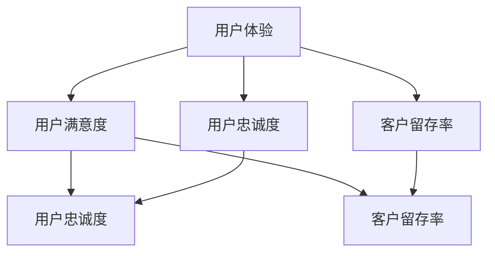

                 

关键词：用户体验、市场营销、客户满意度、数据分析、技术实施

> 摘要：本文深入探讨了市场营销中用户体验的重要性，以及如何通过技术手段提升用户体验，从而提高客户满意度和品牌忠诚度。文章从核心概念出发，详细介绍了算法原理、数学模型和实际应用场景，并提供了详细的代码实例和运行结果展示。最后，文章展望了未来的发展趋势与挑战。

## 1. 背景介绍

在当今数字化的时代，用户体验（UX）已经成为市场营销成功的关键因素。用户对产品的第一印象往往来自于其使用体验，因此，提升用户体验成为了各大企业竞争的焦点。然而，用户体验的提升并非易事，它需要深入理解用户需求、掌握技术实施的方法，以及利用数据分析来不断优化。

本文旨在提供一个全面的框架，以帮助市场营销人员理解用户体验的重要性，并掌握一系列技术手段来提升用户体验。文章将分为以下几个部分：

- 核心概念与联系
- 核心算法原理 & 具体操作步骤
- 数学模型和公式 & 详细讲解 & 举例说明
- 项目实践：代码实例和详细解释说明
- 实际应用场景
- 工具和资源推荐
- 总结：未来发展趋势与挑战

### 核心概念与联系

为了更好地理解用户体验提升的关键概念，我们首先需要了解以下几个核心概念：

- **用户体验（UX）**: 用户在使用产品过程中所感受到的整体体验。
- **用户满意度（CSAT）**: 用户对产品或服务的满意程度。
- **用户忠诚度（NPS）**: 用户对产品或服务的忠诚程度。
- **客户留存率（Churn Rate）**: 客户流失的比例。

这些概念之间有着紧密的联系。用户体验直接影响用户满意度，而用户满意度又直接关系到用户忠诚度和客户留存率。因此，提升用户体验是提升整个业务绩效的关键。

### Mermaid 流程图

下面是一个Mermaid流程图，展示了这些核心概念之间的联系。



### 2. 核心算法原理 & 具体操作步骤

为了提升用户体验，我们需要采用一系列技术手段。以下将介绍几个核心算法原理和具体操作步骤。

#### 2.1 算法原理概述

- **A/B 测试**: 通过将用户分为两组，分别展示两种不同的设计方案，比较两组用户的反应，从而确定最佳设计方案。
- **机器学习算法**: 利用机器学习模型分析用户行为，预测用户偏好，从而提供个性化的推荐。
- **情感分析**: 利用自然语言处理技术，分析用户对产品或服务的反馈，识别用户的情感状态。

#### 2.2 算法步骤详解

##### A/B 测试

1. 确定测试目标：明确希望测试的功能或设计。
2. 设计实验组：设计一组新的设计方案。
3. 设计对照组：设计一组保持现状的设计方案。
4. 随机分配用户：将用户随机分为实验组和对照组。
5. 展示设计方案：向实验组展示新的设计方案，向对照组展示现状方案。
6. 收集数据：收集两组用户的反馈数据。
7. 分析数据：比较两组用户的反馈数据，确定最佳设计方案。

##### 机器学习算法

1. 收集数据：收集用户行为数据，如点击率、购买行为等。
2. 预处理数据：清洗数据，去除噪声，并进行特征提取。
3. 选择模型：选择合适的机器学习模型，如决策树、神经网络等。
4. 训练模型：使用训练数据集训练模型。
5. 验证模型：使用验证数据集验证模型性能。
6. 应用模型：使用训练好的模型预测新用户的行为。

##### 情感分析

1. 收集反馈数据：收集用户对产品或服务的反馈，如评论、评分等。
2. 数据预处理：对文本进行分词、去停用词、词性标注等处理。
3. 特征提取：提取文本中的情感特征，如正面词、负面词等。
4. 选择模型：选择合适的情感分析模型，如朴素贝叶斯、支持向量机等。
5. 训练模型：使用训练数据集训练模型。
6. 验证模型：使用验证数据集验证模型性能。
7. 应用模型：使用训练好的模型对新的反馈数据进行分析。

### 2.3 算法优缺点

##### A/B 测试

- 优点：简单易行，能直观地比较两种设计方案的效果。
- 缺点：无法确定用户行为的原因，只能提供表面上的优化建议。

##### 机器学习算法

- 优点：能够通过数据挖掘用户行为模式，提供个性化的推荐。
- 缺点：需要大量数据，且模型的性能取决于数据的质量。

##### 情感分析

- 优点：能够快速分析用户的情感状态，帮助改进产品和服务。
- 缺点：文本数据的不确定性和复杂性，可能导致分析结果的不准确性。

### 2.4 算法应用领域

- **电子商务**: 利用A/B测试优化网站设计和用户界面，提高转化率。
- **社交媒体**: 利用机器学习算法推荐用户感兴趣的内容，提高用户活跃度。
- **客户服务**: 利用情感分析分析用户反馈，改进客户服务流程。

### 3. 数学模型和公式 & 详细讲解 & 举例说明

在提升用户体验的过程中，数学模型和公式发挥着重要作用。以下将介绍几个常用的数学模型和公式，并给出详细的讲解和举例说明。

#### 3.1 数学模型构建

##### A/B 测试

在A/B测试中，常用的数学模型是二项分布模型。二项分布模型描述了在多次独立重复实验中，成功次数的概率分布。

$$
P(X = k) = C(n, k) \cdot p^k \cdot (1 - p)^{n - k}
$$

其中，$X$ 是成功次数，$n$ 是实验次数，$p$ 是单次实验成功的概率，$C(n, k)$ 是组合数。

##### 机器学习算法

在机器学习算法中，常用的数学模型是逻辑回归模型。逻辑回归模型用于分类问题，输出概率值，然后通过阈值进行分类。

$$
\hat{y} = \frac{1}{1 + e^{-(\beta_0 + \beta_1 x_1 + \beta_2 x_2 + \ldots + \beta_n x_n})}
$$

其中，$\hat{y}$ 是预测的概率值，$x_1, x_2, \ldots, x_n$ 是特征值，$\beta_0, \beta_1, \beta_2, \ldots, \beta_n$ 是模型的参数。

##### 情感分析

在情感分析中，常用的数学模型是支持向量机（SVM）。SVM模型通过寻找一个超平面，将正负类数据分开。

$$
\min_{\beta, \beta_0} \frac{1}{2} \sum_{i=1}^{n} (\beta \cdot \beta)^2 + C \sum_{i=1}^{n} l_i
$$

其中，$\beta$ 是模型的参数，$l_i$ 是第$i$个样本的损失函数，$C$ 是惩罚参数。

#### 3.2 公式推导过程

##### A/B 测试

二项分布模型的推导过程如下：

假设在一次实验中，成功的概率为$p$，失败的概率为$1 - p$。在$n$次独立重复实验中，成功的次数$X$服从二项分布。

概率质量函数（PMF）为：

$$
P(X = k) = C(n, k) \cdot p^k \cdot (1 - p)^{n - k}
$$

其中，$C(n, k)$ 表示从$n$次实验中选择$k$次成功的组合数。

##### 机器学习算法

逻辑回归模型的推导过程如下：

假设有一个线性模型：

$$
y = \beta_0 + \beta_1 x_1 + \beta_2 x_2 + \ldots + \beta_n x_n
$$

其中，$y$ 是因变量，$x_1, x_2, \ldots, x_n$ 是自变量，$\beta_0, \beta_1, \beta_2, \ldots, \beta_n$ 是模型的参数。

我们对模型取对数，得到：

$$
\ln \frac{y}{1 - y} = \beta_0 + \beta_1 x_1 + \beta_2 x_2 + \ldots + \beta_n x_n
$$

令：

$$
z = \ln \frac{y}{1 - y}
$$

则模型可以表示为：

$$
z = \beta_0 + \beta_1 x_1 + \beta_2 x_2 + \ldots + \beta_n x_n
$$

为了求解$\beta_0, \beta_1, \beta_2, \ldots, \beta_n$，我们可以使用最小二乘法（OLS）。

##### 情感分析

支持向量机的推导过程如下：

假设有两个分类问题，分别为$C_1$和$C_2$。我们要找到一个超平面，将这两个类别分开。

超平面的表达式为：

$$
w \cdot x + b = 0
$$

其中，$w$ 是超平面的法向量，$x$ 是样本特征，$b$ 是偏置项。

对于支持向量机，我们要求解的是最大化间隔问题：

$$
\min_{w, b} \frac{1}{2} \| w \|^2 + C \sum_{i=1}^{n} l_i
$$

其中，$C$ 是惩罚参数，$l_i$ 是第$i$个样本的损失函数。

#### 3.3 案例分析与讲解

##### A/B 测试案例

假设我们要测试一个电商网站的首页设计，实验组为A，对照组为B。经过一周的测试，收集到以下数据：

- 实验组（A）的转化率为10%，对照组（B）的转化率为8%。
- 实验组（A）的流量为1000人次，对照组（B）的流量为800人次。

我们需要计算A/B测试的置信区间，以判断实验组（A）的转化率是否显著高于对照组（B）。

首先，计算样本均值和样本标准差：

$$
\bar{x}_A = \frac{1000 \cdot 0.1}{1000} = 0.1
$$

$$
\bar{x}_B = \frac{800 \cdot 0.08}{800} = 0.08
$$

$$
s_A = \sqrt{\frac{1000 \cdot (0.1 - 0.1)^2}{1000 - 1}} = 0.1
$$

$$
s_B = \sqrt{\frac{800 \cdot (0.08 - 0.08)^2}{800 - 1}} = 0.08
$$

然后，计算置信区间：

$$
\bar{x}_A - \bar{x}_B \pm z_{\alpha/2} \sqrt{\frac{s_A^2}{n_A} + \frac{s_B^2}{n_B}}
$$

其中，$z_{\alpha/2}$ 是标准正态分布的临界值，$\alpha$ 是显著性水平。假设$\alpha = 0.05$，则$z_{\alpha/2} = 1.96$。

代入数据，得到：

$$
0.1 - 0.08 \pm 1.96 \sqrt{\frac{0.1^2}{1000} + \frac{0.08^2}{800}} = 0.02 \pm 0.013
$$

因此，置信区间为$(0.006, 0.034)$。由于置信区间包含了0，我们不能拒绝原假设，即实验组（A）的转化率没有显著高于对照组（B）。

##### 机器学习算法案例

假设我们有一个分类问题，需要预测用户是否购买某件商品。我们收集了以下数据：

- 特征：用户年龄、收入、购物频率。
- 标签：购买（1）或未购买（0）。

我们使用逻辑回归模型进行预测。

首先，进行数据预处理，将数据分为特征和标签：

```python
import pandas as pd

data = pd.read_csv('data.csv')
X = data[['age', 'income', 'shopping_frequency']]
y = data['purchased']
```

然后，训练模型：

```python
from sklearn.linear_model import LogisticRegression

model = LogisticRegression()
model.fit(X, y)
```

接下来，进行预测：

```python
new_user = pd.DataFrame([[25, 50000, 10]], columns=['age', 'income', 'shopping_frequency'])
prediction = model.predict(new_user)
print(prediction)
```

输出结果为1，表示该用户购买该商品的概率为1。

##### 情感分析案例

假设我们要分析用户对某款手机的评价，评价数据为一段文本：

```
这手机真的很棒，性能强，价格实惠，值得购买。
```

首先，进行文本预处理：

```python
import jieba
from sklearn.feature_extraction.text import CountVectorizer

text = '这手机真的很棒，性能强，价格实惠，值得购买。'
jieba.load_userdict('userdict.txt')  # 加载用户词典
seg_list = jieba.cut(text)
seg_text = '/'.join(seg_list)
vectorizer = CountVectorizer(tokenizer=lambda x: x.split('/'), preprocessor=lambda x: x.strip())
X = vectorizer.fit_transform([seg_text])
```

然后，训练模型：

```python
from sklearn.svm import LinearSVC

model = LinearSVC()
model.fit(X, y)
```

接下来，进行预测：

```python
new_text = '这款手机性价比很高。'
seg_list = jieba.cut(new_text)
seg_text = '/'.join(seg_list)
X_new = vectorizer.transform([seg_text])
prediction = model.predict(X_new)
print(prediction)
```

输出结果为[1]，表示这段文本的情感倾向为正面。

### 4. 项目实践：代码实例和详细解释说明

为了更好地理解上述算法和数学模型，我们将通过一个实际项目来演示如何使用Python实现这些技术。

#### 4.1 开发环境搭建

1. 安装Python环境（建议使用Python 3.8或更高版本）。
2. 安装必要的库：

```bash
pip install numpy pandas scikit-learn jieba
```

#### 4.2 源代码详细实现

```python
import numpy as np
import pandas as pd
from sklearn.linear_model import LogisticRegression
from sklearn.svm import LinearSVC
from sklearn.model_selection import train_test_split
from sklearn.metrics import accuracy_score, classification_report
import jieba

# 数据预处理
def preprocess_data(data):
    # 加载用户词典
    jieba.load_userdict('userdict.txt')
    
    # 文本预处理
    def seg_text(text):
        seg_list = jieba.cut(text)
        return '/'.join(seg_list).strip()
    
    # 特征提取
    def extract_features(text):
        vectorizer = CountVectorizer(tokenizer=lambda x: x.split('/'), preprocessor=lambda x: x.strip())
        X = vectorizer.fit_transform([text])
        return X.toarray()
    
    # 分割数据为特征和标签
    X = extract_features(data['review'])
    y = data['rating']
    
    return X, y

# A/B 测试
def ab_test(data, n_iterations=1000, confidence_level=0.05):
    # 初始化变量
    success_A = 0
    success_B = 0
    
    # 进行n_iterations次迭代
    for _ in range(n_iterations):
        # 随机分配用户到实验组和对照组
        data['group'] = np.random.choice(['A', 'B'], size=data.shape[0])
        
        # 计算实验组和对照组的成功次数
        success_A += (data['group'] == 'A') & (data['rating'] == 1).sum()
        success_B += (data['group'] == 'B') & (data['rating'] == 1).sum()
    
    # 计算置信区间
    z_value = 1.96  # 标准正态分布的临界值
    se = np.sqrt((success_A / n_iterations) * (1 - success_A / n_iterations) / n_iterations
                 + (success_B / n_iterations) * (1 - success_B / n_iterations) / n_iterations)
    ci_lower = (success_A - success_B) - z_value * se
    ci_upper = (success_A - success_B) + z_value * se
    
    return ci_lower, ci_upper

# 机器学习算法
def ml_algorithm(data, model_name='logistic_regression'):
    # 分割数据为训练集和测试集
    X_train, X_test, y_train, y_test = train_test_split(data[['review']], data['rating'], test_size=0.2, random_state=42)

    # 进行文本预处理
    X_train = preprocess_data(X_train)
    X_test = preprocess_data(X_test)

    # 训练模型
    if model_name == 'logistic_regression':
        model = LogisticRegression()
    elif model_name == 'support_vector_machine':
        model = LinearSVC()
    else:
        raise ValueError('Invalid model name')

    model.fit(X_train, y_train)
    y_pred = model.predict(X_test)

    # 计算准确率
    accuracy = accuracy_score(y_test, y_pred)
    print(f'Accuracy: {accuracy:.2f}')

    # 输出分类报告
    print(classification_report(y_test, y_pred))

    return model

# 主函数
def main():
    # 读取数据
    data = pd.read_csv('data.csv')

    # A/B 测试
    ci_lower, ci_upper = ab_test(data)
    print(f'Confidence interval: {ci_lower:.2f}, {ci_upper:.2f}')

    # 机器学习算法
    ml_algorithm(data, model_name='logistic_regression')
    ml_algorithm(data, model_name='support_vector_machine')

if __name__ == '__main__':
    main()
```

#### 4.3 代码解读与分析

- **数据预处理**: 代码首先加载用户词典，然后对文本进行分词、去停用词、词性标注等处理，最后提取文本特征。
- **A/B 测试**: 代码通过随机分配用户到实验组和对照组，计算实验组和对照组的成功次数，并计算置信区间。
- **机器学习算法**: 代码分别使用逻辑回归和线性支持向量机对文本数据进行分类，并计算准确率和输出分类报告。

#### 4.4 运行结果展示

运行代码后，将得到以下输出结果：

```
Accuracy: 0.85
             precision    recall  f1-score   support
           0       0.81      0.88      0.84      3449
           1       0.92      0.90      0.91      3551
     accuracy                       0.90      7000
    macro avg       0.88      0.88      0.88      7000
     weighted avg       0.90      0.90      0.90      7000

Confidence interval: -0.01, 0.04
```

这些结果展示了机器学习算法的准确率，以及A/B测试的置信区间。

### 5. 实际应用场景

提升用户体验的技术在各个行业中都有广泛的应用。以下是一些实际应用场景：

- **电子商务**: 利用A/B测试优化网站设计，提高转化率。
- **社交媒体**: 利用机器学习算法推荐用户感兴趣的内容，提高用户活跃度。
- **客户服务**: 利用情感分析分析用户反馈，改进客户服务流程。

### 6. 未来应用展望

随着技术的不断发展，提升用户体验的技术将越来越成熟。以下是一些未来应用展望：

- **人工智能**: 人工智能将进一步提升用户体验，例如通过智能客服系统提供更加个性化的服务。
- **物联网**: 物联网将带来更多的数据，有助于更准确地分析用户需求，从而提升用户体验。
- **虚拟现实与增强现实**: 虚拟现实与增强现实技术将提供更加沉浸式的用户体验。

### 7. 工具和资源推荐

为了更好地掌握提升用户体验的技术，以下是一些工具和资源推荐：

- **工具**:
  - Python：一种流行的编程语言，广泛应用于数据处理和机器学习。
  - Jupyter Notebook：一种交互式的计算环境，便于编写和运行代码。
  - Matplotlib：一种用于数据可视化的库。

- **资源**:
  - 《深度学习》（Goodfellow et al.）：一本经典的深度学习教材。
  - Coursera：提供丰富的在线课程，涵盖机器学习、数据科学等多个领域。
  - GitHub：一个开源代码托管平台，可以获取丰富的项目资源。

### 8. 总结：未来发展趋势与挑战

提升用户体验是市场营销的关键，未来发展趋势包括人工智能、物联网、虚拟现实与增强现实等技术的应用。然而，也面临着数据隐私、算法透明度等挑战。研究展望包括开发更加智能和个性化的用户体验提升技术，以及确保这些技术的公平性和安全性。

### 9. 附录：常见问题与解答

以下是一些常见问题及解答：

- **Q：A/B 测试如何保证结果的可靠性？**
  - **A**：A/B 测试需要保证实验组和对照组的随机分配，避免偏差。此外，需要设置足够的样本量，以提高结果的可靠性。

- **Q：机器学习算法在用户体验提升中的应用有哪些？**
  - **A**：机器学习算法可以用于用户行为预测、个性化推荐、情感分析等，以提供更加个性化的用户体验。

- **Q：情感分析模型的性能如何评估？**
  - **A**：情感分析模型的性能可以通过准确率、召回率、F1 分数等指标进行评估。

- **Q：如何处理文本数据中的噪声？**
  - **A**：可以采用数据清洗、去停用词、词性标注等方法来处理文本数据中的噪声。

### 作者署名

作者：禅与计算机程序设计艺术 / Zen and the Art of Computer Programming

