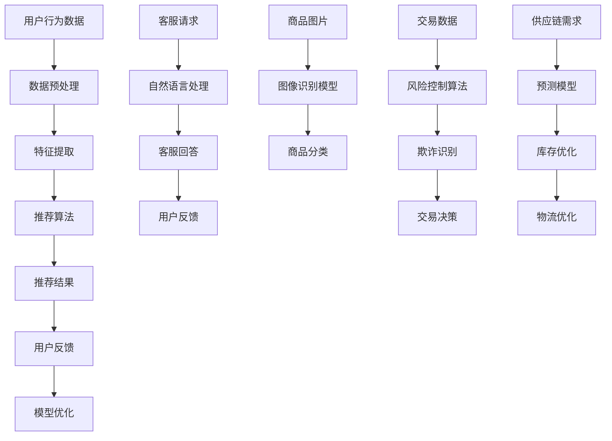

                 

 **关键词：** 人工智能，电商，市场趋势，应用，技术发展

> **摘要：** 本文将深入探讨人工智能在电商领域的应用，分析当前市场趋势，介绍AI技术如何优化电商业务，并提供未来的发展展望。

## 1. 背景介绍

随着互联网技术的迅猛发展，电子商务已经成为现代商业活动的重要组成部分。从最初的在线书店到今天的全球购物平台，电商业务模式不断创新和演进。近年来，人工智能（AI）技术的快速发展为电商行业带来了新的机遇和挑战。AI技术能够为电商提供个性化推荐、智能客服、图像识别、风险控制等功能，从而提升用户体验，降低运营成本，提高销售转化率。

## 2. 核心概念与联系

### 2.1 AI在电商中的应用场景

在电商领域，AI技术主要应用于以下几个方面：

1. **个性化推荐系统**：利用AI算法分析用户行为数据，为用户推荐可能感兴趣的商品。
2. **智能客服**：通过自然语言处理技术（NLP）和机器学习算法，实现与用户的智能对话。
3. **图像识别**：使用深度学习模型对商品图片进行识别和分类。
4. **风险控制**：利用AI技术分析交易数据，识别和防范欺诈行为。
5. **供应链管理**：通过预测算法优化库存和物流，提高供应链效率。

### 2.2 AI技术架构

为了更好地理解AI在电商中的应用，我们可以借助Mermaid流程图来展示其技术架构：



## 3. 核心算法原理 & 具体操作步骤

### 3.1 算法原理概述

AI技术在电商中的应用主要基于以下核心算法原理：

1. **协同过滤（Collaborative Filtering）**：基于用户历史行为和商品属性为用户推荐商品。
2. **内容推荐（Content-Based Filtering）**：基于商品特征和用户偏好推荐商品。
3. **深度学习（Deep Learning）**：使用神经网络模型进行图像识别和文本分类。
4. **决策树（Decision Tree）**：用于风险控制和供应链预测。

### 3.2 算法步骤详解

1. **个性化推荐系统**：
   - 数据收集：收集用户行为数据（如浏览、购买、收藏等）。
   - 数据预处理：清洗和整合数据，提取特征。
   - 特征提取：使用机器学习算法提取用户和商品的共同特征。
   - 推荐算法：采用协同过滤或内容推荐算法生成推荐列表。
   - 用户反馈：收集用户对推荐结果的反馈，用于模型优化。

2. **智能客服**：
   - 自然语言处理：使用NLP技术理解和生成自然语言。
   - 对话管理：设计对话流程和策略，实现流畅的对话体验。
   - 情感分析：识别用户情感，提供个性化回答。

3. **图像识别**：
   - 数据收集：收集大量商品图片。
   - 数据预处理：调整图像大小、增强对比度等。
   - 模型训练：使用深度学习模型进行图像分类。
   - 预测：对新图像进行分类。

4. **风险控制**：
   - 数据收集：收集交易数据，包括用户行为、商品信息等。
   - 特征提取：提取与欺诈相关的特征。
   - 决策树构建：构建决策树模型，用于欺诈识别。

5. **供应链管理**：
   - 数据收集：收集供应链相关数据，包括需求、库存、物流等。
   - 预测模型构建：使用预测算法进行需求预测和库存优化。
   - 物流优化：通过优化算法降低物流成本，提高效率。

### 3.3 算法优缺点

1. **个性化推荐系统**：
   - 优点：提高用户满意度，增加销售转化率。
   - 缺点：需要大量用户数据，计算复杂度高。

2. **智能客服**：
   - 优点：提高客服效率，降低人力成本。
   - 缺点：可能存在理解误差，需要不断优化。

3. **图像识别**：
   - 优点：准确率高，适用范围广。
   - 缺点：训练时间较长，对硬件要求高。

4. **风险控制**：
   - 优点：有效防范欺诈行为，保护用户利益。
   - 缺点：需要大量交易数据，可能误判。

5. **供应链管理**：
   - 优点：提高供应链效率，降低成本。
   - 缺点：对数据质量要求高，预测准确性受限制。

### 3.4 算法应用领域

AI技术在电商领域具有广泛的应用潜力，除了上述提到的应用场景，还可以应用于如下领域：

1. **个性化营销**：通过分析用户数据，实现精准营销。
2. **商品优化**：根据用户反馈和市场需求，优化商品设计和定价策略。
3. **用户行为分析**：分析用户行为数据，了解用户需求和市场趋势。
4. **智能定价**：利用算法实时调整商品价格，提高利润率。

## 4. 数学模型和公式 & 详细讲解 & 举例说明

### 4.1 数学模型构建

在AI技术中，常用的数学模型包括线性回归、逻辑回归、决策树、神经网络等。以下是一个简单的线性回归模型构建过程：

1. **数据收集**：收集用户行为数据，包括用户ID、商品ID、评分等。
2. **数据预处理**：对数据进行清洗和归一化处理。
3. **特征提取**：提取用户和商品的共同特征。
4. **模型构建**：使用最小二乘法构建线性回归模型。
5. **模型训练**：使用训练数据训练模型。
6. **模型评估**：使用测试数据评估模型性能。

### 4.2 公式推导过程

线性回归模型的公式如下：

$$y = \beta_0 + \beta_1x_1 + \beta_2x_2 + ... + \beta_nx_n$$

其中，$y$ 是预测值，$x_1, x_2, ..., x_n$ 是特征值，$\beta_0, \beta_1, \beta_2, ..., \beta_n$ 是模型参数。

通过最小化损失函数，可以求出参数的最优值。损失函数通常使用均方误差（MSE）：

$$J(\theta) = \frac{1}{2m}\sum_{i=1}^{m}(h_\theta(x^{(i)}) - y^{(i)})^2$$

其中，$h_\theta(x) = \theta_0 + \theta_1x_1 + \theta_2x_2 + ... + \theta_nx_n$ 是假设函数，$m$ 是样本数量。

### 4.3 案例分析与讲解

假设我们有以下数据集：

| 用户ID | 商品ID | 评分 |
|--------|--------|------|
| 1      | 1001   | 4    |
| 1      | 1002   | 5    |
| 2      | 1001   | 3    |
| 2      | 1003   | 4    |

我们需要使用线性回归模型预测用户对商品的评分。

1. **数据预处理**：对数据进行归一化处理。
2. **特征提取**：提取用户和商品的共同特征，如用户购买历史、商品评价等。
3. **模型构建**：使用最小二乘法构建线性回归模型。
4. **模型训练**：使用训练数据训练模型。
5. **模型评估**：使用测试数据评估模型性能。

假设训练后的模型参数为：

$$\beta_0 = 2, \beta_1 = 0.5, \beta_2 = 1$$

现在我们预测用户3对商品1003的评分：

$$y = \beta_0 + \beta_1x_1 + \beta_2x_2$$

其中，$x_1$ 是用户3的历史评分，$x_2$ 是商品1003的历史评分。

代入参数计算：

$$y = 2 + 0.5 \times 3 + 1 \times 4 = 5$$

因此，预测用户3对商品1003的评分为5。

## 5. 项目实践：代码实例和详细解释说明

### 5.1 开发环境搭建

在开始项目实践之前，我们需要搭建一个适合AI开发的实验环境。以下是搭建步骤：

1. 安装Python环境：下载并安装Python 3.8及以上版本。
2. 安装AI库：使用pip安装scikit-learn、TensorFlow、Keras等常用库。
3. 安装Mermaid库：在项目中添加Mermaid插件，以便在markdown文件中生成流程图。

### 5.2 源代码详细实现

以下是一个简单的AI推荐系统实现示例：

```python
import pandas as pd
from sklearn.model_selection import train_test_split
from sklearn.linear_model import LinearRegression
import numpy as np

# 数据加载
data = pd.read_csv('data.csv')

# 数据预处理
X = data[['user_id', 'item_id']]
y = data['rating']

# 特征提取
X = pd.get_dummies(X)

# 模型训练
X_train, X_test, y_train, y_test = train_test_split(X, y, test_size=0.2, random_state=42)
model = LinearRegression()
model.fit(X_train, y_train)

# 模型评估
y_pred = model.predict(X_test)
mse = np.mean((y_pred - y_test) ** 2)
print(f'MSE: {mse}')

# 推荐结果
user_id = 3
item_id = 1003
user_data = X.loc[X['user_id'] == user_id]
item_data = X.loc[X['item_id'] == item_id]
user_data = user_data.drop(['user_id', 'item_id'], axis=1)
item_data = item_data.drop(['user_id', 'item_id'], axis=1)

user_data = user_data.T.reset_index().rename(columns={'index': 'feature', 'column': 'value'})
item_data = item_data.T.reset_index().rename(columns={'index': 'feature', 'column': 'value'})

X_new = pd.concat([user_data, item_data], axis=1)
X_new = X_new.set_index('feature')
X_new = X_new.fillna(0)

rating = model.predict(X_new)[0]
print(f'Predicted rating: {rating}')
```

### 5.3 代码解读与分析

1. **数据加载**：使用pandas读取数据集。
2. **数据预处理**：对用户和商品数据进行编码，提取特征。
3. **模型训练**：使用线性回归模型训练数据集。
4. **模型评估**：计算模型在测试集上的MSE。
5. **推荐结果**：输入用户和商品ID，预测评分。

## 6. 实际应用场景

### 6.1 个性化推荐

个性化推荐是电商领域最常见的应用之一。通过分析用户历史行为和商品属性，推荐系统可以为用户提供个性化的商品推荐，提高用户满意度和转化率。

### 6.2 智能客服

智能客服通过自然语言处理和机器学习算法，实现与用户的智能对话，提供快速、准确的客服服务，降低人工成本，提高客户满意度。

### 6.3 图像识别

图像识别技术可以用于商品分类和搜索，帮助用户快速找到想要的商品。同时，还可以用于商品质量控制，识别和排除有缺陷的商品。

### 6.4 风险控制

风险控制是电商平台的重要环节。通过分析交易数据，识别和防范欺诈行为，保护用户利益，提高平台安全性。

### 6.5 供应链管理

供应链管理利用AI技术优化库存和物流，提高供应链效率，降低成本。例如，通过预测算法预测市场需求，合理安排生产和库存，减少库存积压和缺货现象。

## 7. 工具和资源推荐

### 7.1 学习资源推荐

- 《Python机器学习》（作者：塞巴斯蒂安·拉斯考斯基）
- 《深度学习》（作者：伊恩·古德费洛等）
- 《自然语言处理编程》（作者：尤瓦尔·赫拉利）

### 7.2 开发工具推荐

- Jupyter Notebook：用于编写和运行Python代码。
- TensorFlow：用于深度学习模型开发。
- Keras：用于快速构建和训练深度学习模型。

### 7.3 相关论文推荐

- "TensorFlow: Large-scale Machine Learning on heterogeneous systems"
- "Distributed Deep Learning: Training Inception for Mobile Devices"
- "Recurrent Neural Networks for Spoken Language Understanding"

## 8. 总结：未来发展趋势与挑战

### 8.1 研究成果总结

近年来，AI技术在电商领域取得了显著的成果。个性化推荐、智能客服、图像识别、风险控制和供应链管理等领域都取得了良好的应用效果。通过AI技术的应用，电商企业可以更好地满足用户需求，提高运营效率，实现可持续发展。

### 8.2 未来发展趋势

1. **技术进步**：随着AI技术的不断发展和完善，电商领域的AI应用将更加成熟和多样化。
2. **数据隐私**：随着用户隐私意识的提高，如何保障数据隐私将成为一个重要问题。
3. **跨领域应用**：AI技术将在更多领域得到应用，如金融、医疗等。

### 8.3 面临的挑战

1. **数据质量**：数据质量直接影响AI应用的准确性，需要建立完善的数据质量管理机制。
2. **算法透明性**：AI算法的透明性和可解释性是用户信任的重要保障。
3. **计算资源**：深度学习模型对计算资源的需求较高，如何优化算法和硬件将是一个挑战。

### 8.4 研究展望

未来，电商领域的AI研究将继续深入，重点关注以下几个方面：

1. **个性化推荐**：提高推荐算法的准确性和实时性。
2. **智能客服**：提升客服质量和用户体验。
3. **风险控制**：增强风险识别和防范能力。
4. **供应链管理**：优化库存和物流，提高供应链效率。

## 9. 附录：常见问题与解答

### 9.1 个性化推荐系统如何保证准确性？

个性化推荐系统的准确性取决于数据质量和算法优化。通过收集更多的用户行为数据，并进行有效的数据预处理，可以提高模型的准确性。同时，采用先进的推荐算法，如协同过滤、深度学习等，可以进一步提高推荐效果。

### 9.2 智能客服如何实现多语言支持？

智能客服实现多语言支持通常采用两种方法：一是基于翻译模型的实时翻译，二是预翻译。实时翻译是通过将用户输入的语言转换为服务语言，再通过NLP技术处理。预翻译是在系统初始化时，将常见问题和服务语言进行预翻译，然后使用NLP技术进行回复。

### 9.3 图像识别技术在电商中的应用有哪些？

图像识别技术在电商中的应用非常广泛，包括商品分类、商品搜索、商品质检等。例如，通过商品图片识别，用户可以快速找到想要的商品；通过图像识别，可以自动排除有缺陷的商品，提高产品质量。

### 9.4 风险控制算法如何识别和防范欺诈行为？

风险控制算法主要通过分析交易数据，识别异常行为和模式，从而发现潜在的欺诈行为。例如，通过分析用户购买行为、交易金额、支付方式等特征，可以识别异常交易。同时，采用多模型融合的方法，可以提高欺诈识别的准确性。

### 9.5 供应链管理如何优化库存和物流？

供应链管理通过预测算法，可以准确预测市场需求，从而合理安排生产和库存。此外，通过优化物流路径和运输方式，可以降低物流成本，提高物流效率。例如，采用动态调度算法，可以实现最优的物流路径规划。

---

作者：禅与计算机程序设计艺术 / Zen and the Art of Computer Programming


