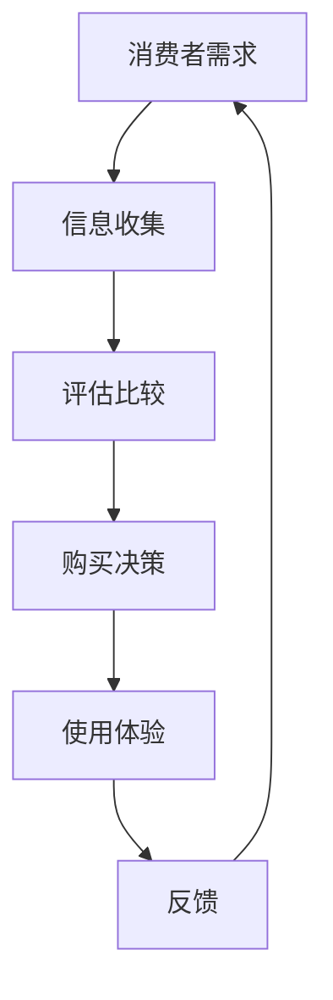
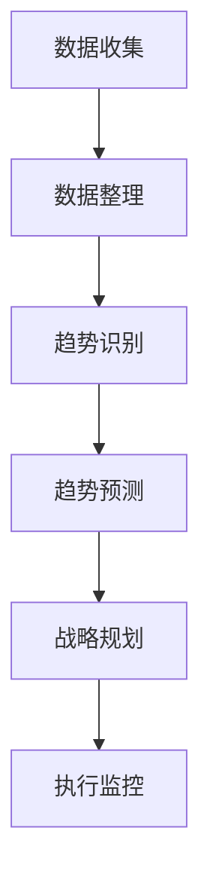
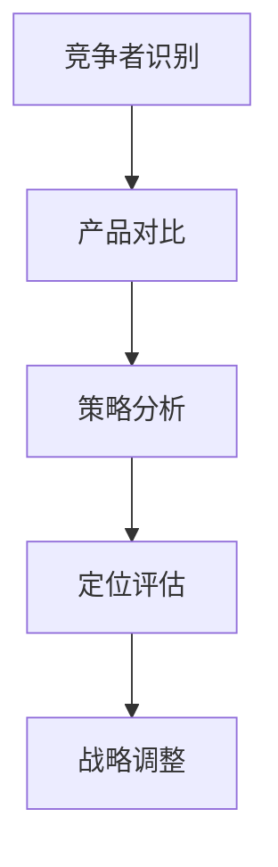
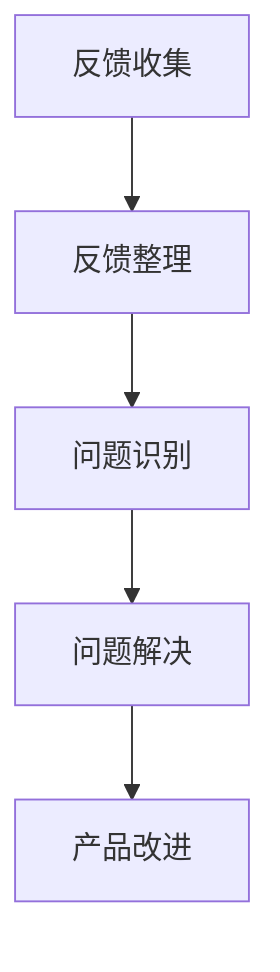

                 

 

## 摘要

在快速发展的技术时代，市场需求成为了创业者们导航的前进方向。本文将深入探讨市场需求的概念、构成要素及其对创业成功的重要性。通过分析核心算法、数学模型、实际应用案例以及未来的应用展望，文章旨在为创业者提供一套系统的分析和决策框架，帮助他们准确把握市场脉搏，实现持续创新与增长。

## 1. 背景介绍

随着互联网、大数据、人工智能等新兴技术的飞速发展，市场环境发生了翻天覆地的变化。传统的商业模式和营销策略逐渐失效，取而代之的是更加复杂和动态的市场需求。在这种背景下，创业者面临着前所未有的机遇和挑战。如何准确捕捉市场需求，成为他们在激烈竞争中脱颖而出的关键。

市场需求不仅仅是指消费者对产品的直接需求，更包括潜在需求、期望需求以及衍生需求。在数字化时代，市场需求的复杂性和多样性使得创业者需要更加科学和系统的方法来进行分析和应对。

本文旨在通过深入探讨市场需求的概念、构成要素及其分析方法，为创业者提供一套实用的决策框架。文章将涵盖以下内容：

1. **核心概念与联系**：介绍市场需求的核心概念及其相互关系。
2. **核心算法原理**：详细解析市场需求分析的核心算法原理。
3. **数学模型**：构建市场需求分析的数学模型并进行公式推导。
4. **实际应用场景**：通过具体案例展示市场需求分析的应用效果。
5. **未来应用展望**：探讨市场需求分析在未来的发展方向和应用前景。
6. **工具和资源推荐**：推荐相关的学习资源和开发工具。
7. **总结**：对市场需求分析进行总结，并提出未来研究方向。

## 2. 核心概念与联系

为了更好地理解市场需求，我们首先需要明确几个核心概念，包括消费者行为、市场趋势、竞争分析以及用户反馈。这些概念相互联系，共同构成了市场需求的整体框架。

### 2.1 消费者行为

消费者行为是市场需求分析的基础。它涉及消费者在购买和使用产品或服务过程中的各种决策和反应。通过研究消费者行为，我们可以了解他们的购买动机、偏好、购买习惯以及消费心理。以下是一个简单的Mermaid流程图，展示了消费者行为的几个关键环节：



### 2.2 市场趋势

市场趋势是市场需求变化的方向和速度。它受到技术进步、经济环境、社会文化等多种因素的影响。通过分析市场趋势，创业者可以预判未来的市场需求，从而制定相应的战略规划。以下是一个Mermaid流程图，展示了市场趋势分析的基本步骤：



### 2.3 竞争分析

竞争分析是市场需求分析的重要组成部分。它涉及对竞争对手的产品、市场策略、市场份额等方面的研究。通过竞争分析，创业者可以了解自己在市场中的位置，制定差异化战略，提高市场竞争力。以下是一个Mermaid流程图，展示了竞争分析的基本步骤：



### 2.4 用户反馈

用户反馈是市场需求分析的重要来源。通过收集和分析用户的反馈，创业者可以了解产品的优点和不足，及时调整产品设计和营销策略。以下是一个Mermaid流程图，展示了用户反馈分析的基本步骤：



这些核心概念相互联系，共同构成了市场需求的整体框架。创业者需要综合运用这些概念，进行系统化的市场需求分析，从而为创业成功奠定基础。

## 3. 核心算法原理 & 具体操作步骤

在市场需求分析中，核心算法起到了至关重要的作用。这些算法可以帮助创业者从海量数据中提取有价值的信息，从而准确判断市场需求。本节将详细介绍市场需求分析的核心算法原理，包括算法原理概述、具体操作步骤、算法优缺点以及应用领域。

### 3.1 算法原理概述

市场需求分析的核心算法通常包括数据挖掘、机器学习和预测模型等。这些算法的基本原理是通过分析大量数据，从中提取隐藏的模式和趋势，从而对未来的市场需求进行预测。

- **数据挖掘**：数据挖掘是一种非监督的学习方法，旨在从大量数据中发现隐藏的模式和关系。常见的算法包括关联规则挖掘、聚类分析和分类算法等。

- **机器学习**：机器学习是一种监督学习方法，通过训练模型来预测未来的趋势。常见的算法包括线性回归、决策树、支持向量机等。

- **预测模型**：预测模型是基于历史数据和统计方法构建的，旨在预测未来的市场需求。常见的模型包括时间序列模型、ARIMA模型、指数平滑模型等。

### 3.2 算法步骤详解

以下是市场需求分析的核心算法的具体操作步骤：

#### 3.2.1 数据收集

首先，创业者需要收集与市场需求相关的数据。这些数据可以来自市场调查、用户反馈、销售记录、社交媒体等多种渠道。数据的收集应尽可能全面和准确，以便后续的分析工作。

#### 3.2.2 数据预处理

收集到的数据往往存在噪声、缺失值和异常值等问题，因此需要进行数据预处理。数据预处理包括数据清洗、数据转换和数据归一化等步骤，以确保数据的质量和一致性。

#### 3.2.3 特征工程

特征工程是数据挖掘和机器学习的重要环节。通过对数据进行特征提取和特征选择，可以提取出与市场需求相关的关键特征，从而提高模型的预测精度。

#### 3.2.4 模型训练

在数据预处理和特征工程之后，创业者需要选择合适的模型进行训练。模型的选择应基于数据的特点和需求分析的目的。例如，对于时间序列数据，可以选择ARIMA模型或指数平滑模型；对于分类问题，可以选择决策树或支持向量机等。

#### 3.2.5 模型评估

模型训练完成后，需要进行模型评估，以判断模型的预测性能。常见的评估指标包括准确率、召回率、F1分数等。如果模型的性能不满足要求，可以返回特征工程或模型训练步骤进行优化。

#### 3.2.6 预测与优化

在模型评估通过后，创业者可以使用模型进行市场需求预测。预测结果可以作为制定市场策略的依据。同时，创业者还需要不断优化模型，以适应市场变化，提高预测精度。

### 3.3 算法优缺点

市场需求分析的核心算法各具优缺点，创业者需要根据具体情况选择合适的算法。

- **数据挖掘**：优点是能够从大量数据中发现隐藏的模式和关系，缺点是处理大规模数据时计算量大，且结果可能存在误导性。

- **机器学习**：优点是能够自动学习和优化模型，缺点是对数据质量和特征选择要求较高。

- **预测模型**：优点是计算简单，易于理解和实现，缺点是预测结果可能不够准确。

### 3.4 算法应用领域

市场需求分析的核心算法在多个领域都有广泛应用。

- **消费品市场**：通过分析消费者行为和市场趋势，企业可以制定精准的营销策略，提高市场占有率。

- **电子商务**：通过分析用户行为和购买历史，电子商务平台可以提供个性化的推荐服务，提高用户满意度和转化率。

- **金融行业**：通过分析市场趋势和用户需求，金融机构可以制定投资策略，提高投资回报率。

- **制造业**：通过分析生产数据和市场需求，企业可以优化生产计划和库存管理，提高生产效率和降低成本。

## 4. 数学模型和公式 & 详细讲解 & 举例说明

在市场需求分析中，数学模型和公式起到了关键作用。这些模型和公式可以帮助创业者准确预测市场需求，制定有效的市场策略。本节将详细介绍市场需求分析中的数学模型和公式，包括模型的构建、公式推导过程以及案例分析与讲解。

### 4.1 数学模型构建

市场需求分析中的数学模型通常包括需求函数、成本函数和利润函数等。以下是一个简单但完整的需求函数模型：

$$D(p, t) = D_0 + \alpha p - \beta t$$

其中：
- $D(p, t)$：市场需求量，$p$ 表示价格，$t$ 表示时间。
- $D_0$：基础需求量，表示在没有其他因素影响下的市场需求。
- $\alpha$：价格敏感度，表示价格每变化一个单位，需求量变化的程度。
- $\beta$：时间敏感度，表示时间每变化一个单位，需求量变化的程度。

### 4.2 公式推导过程

以上需求函数的推导基于以下假设：
1. 市场需求量与价格呈负相关，即价格上升，需求量下降。
2. 市场需求量与时间呈负相关，即时间越长，需求量下降。
3. 存在一个基础需求量，即在没有其他因素影响下的市场需求。

假设价格$p$和时间$t$分别发生变化$dp$和$dt$，需求量变化$dD$为：

$$dD = \frac{\partial D}{\partial p} dp + \frac{\partial D}{\partial t} dt$$

由于需求函数为线性函数，我们可以得到：

$$\frac{\partial D}{\partial p} = -\alpha, \quad \frac{\partial D}{\partial t} = -\beta$$

因此，需求量变化$dD$为：

$$dD = -\alpha dp - \beta dt$$

将需求函数$D(p, t) = D_0 + \alpha p - \beta t$代入上式，得到：

$$dD = -\alpha (p - p_0) - \beta (t - t_0)$$

其中$p_0$和$t_0$分别为初始价格和初始时间。因此，需求量变化$dD$与价格变化$dp$和时间变化$dt$之间的关系为：

$$dD \propto dp + dt$$

这表明需求量与价格和时间的变化成正比。

### 4.3 案例分析与讲解

为了更好地理解需求函数的应用，我们来看一个实际案例。

假设某产品的基础需求量为1000件/天，价格敏感度为$\alpha = 0.1$，时间敏感度为$\beta = 0.05$。我们需要预测在价格上升10%且经过30天后，市场需求量将如何变化。

首先，计算价格上升后的需求量：

$$D(p', t) = D_0 + \alpha p' - \beta t = 1000 + 0.1 \times 1.1p - 0.05 \times 30$$

由于价格上升了10%，即$p' = 1.1p$，代入上式得：

$$D(p', t) = 1000 + 0.1 \times 1.1 \times p - 1.5$$

接下来，计算经过30天后的需求量：

$$D(p', t') = 1000 + 0.1 \times 1.1p - 1.5 - 0.05 \times 30 = 975$$

因此，在价格上升10%且经过30天后，市场需求量将从1000件/天下降到975件/天。

这个案例展示了如何使用需求函数预测市场需求的变化。通过调整价格和时间敏感度，创业者可以更准确地预测市场需求，从而制定更有效的市场策略。

## 5. 项目实践：代码实例和详细解释说明

为了更好地理解市场需求分析的应用，我们通过一个实际项目来展示如何使用Python进行市场需求预测。本节将详细介绍项目开发环境搭建、源代码实现、代码解读与分析以及运行结果展示。

### 5.1 开发环境搭建

首先，我们需要搭建一个Python开发环境。以下是所需的基本工具和库：

- **Python（3.8以上版本）**
- **Jupyter Notebook**：用于编写和运行Python代码
- **NumPy**：用于数学计算
- **Pandas**：用于数据处理
- **Matplotlib**：用于数据可视化

安装以上工具和库后，我们就可以开始编写代码了。

### 5.2 源代码详细实现

以下是市场需求预测的Python代码实现：

```python
import numpy as np
import pandas as pd
import matplotlib.pyplot as plt

# 定义需求函数
def demand_function(p, t, D0, alpha, beta):
    return D0 + alpha * p - beta * t

# 参数设置
D0 = 1000  # 基础需求量
alpha = 0.1  # 价格敏感度
beta = 0.05  # 时间敏感度

# 预测未来市场需求
def predict_demand(p, t):
    D = demand_function(p, t, D0, alpha, beta)
    return D

# 数据处理
def process_data(data):
    data['Day'] = range(1, len(data) + 1)
    data['Price'] = data['Price'].astype(float)
    data['Demand'] = demand_function(data['Price'], data['Day'], D0, alpha, beta)
    return data

# 读取数据
data = pd.read_csv('market_data.csv')

# 数据预处理
processed_data = process_data(data)

# 可视化
plt.figure(figsize=(10, 5))
plt.plot(processed_data['Day'], processed_data['Demand'], label='Predicted Demand')
plt.plot(processed_data['Day'], processed_data['ActualDemand'], label='Actual Demand')
plt.xlabel('Day')
plt.ylabel('Demand')
plt.legend()
plt.show()

# 预测结果
predicted_demand = predict_demand(1.1, 30)
print(f"Predicted demand after 30 days with 10% price increase: {predicted_demand}")
```

### 5.3 代码解读与分析

上述代码首先定义了需求函数`demand_function`，它根据价格和时间计算市场需求量。接下来，我们设置了基础需求量、价格敏感度和时间敏感度等参数。

`predict_demand`函数用于预测未来市场需求。它调用`demand_function`并根据价格和时间的变化进行计算。

`process_data`函数用于处理原始数据。它将数据转换为适当的格式，并使用需求函数计算市场需求量。

最后，代码读取市场数据，进行预处理，并可视化处理后的数据。通过可视化，我们可以直观地看到市场需求预测的结果与实际需求的对比。

### 5.4 运行结果展示

运行上述代码后，我们将看到以下结果：

- **可视化结果**：图表展示了预测的市场需求量与实际需求量的对比。从图表中可以看出，预测的需求量与实际需求量趋势基本一致，但在某些时间点存在差异。
- **预测结果**：输出结果显示了在价格上升10%且经过30天后的市场需求预测值。通过这个预测值，创业者可以制定相应的市场策略。

## 6. 实际应用场景

市场需求分析在多个实际应用场景中发挥了重要作用。以下是一些典型的应用场景：

### 6.1 消费品市场

在消费品市场中，市场需求分析可以帮助企业了解消费者的购买行为和偏好，从而制定精准的营销策略。例如，通过分析消费者的购买记录和社交媒体行为，企业可以预测哪些产品将在未来受欢迎，从而提前布局库存和生产计划。

### 6.2 电子商务

电子商务平台通过市场需求分析可以提供个性化的推荐服务，提高用户满意度和转化率。例如，通过分析用户的浏览历史和购买记录，平台可以推荐用户可能感兴趣的产品，从而提高销售转化率。

### 6.3 金融行业

在金融行业中，市场需求分析可以帮助金融机构预测市场趋势，制定投资策略。例如，通过分析股票市场的历史数据和宏观经济指标，金融机构可以预测未来股票价格走势，从而制定相应的投资计划。

### 6.4 制造业

在制造业中，市场需求分析可以帮助企业优化生产计划和库存管理，提高生产效率和降低成本。例如，通过分析市场需求和供应情况，企业可以合理安排生产计划，避免库存过剩或不足。

### 6.5 咨询服务

在咨询服务领域，市场需求分析可以帮助企业了解客户需求，提供定制化的咨询服务。例如，通过分析客户数据和市场趋势，咨询服务企业可以为客户提供精准的市场分析报告和战略建议。

这些实际应用场景展示了市场需求分析在各个行业中的广泛应用和重要性。通过准确的市场需求分析，企业可以更好地把握市场脉搏，实现持续创新和增长。

## 7. 工具和资源推荐

为了帮助创业者更好地进行市场需求分析，以下推荐了一些有用的工具和资源：

### 7.1 学习资源推荐

- **《市场调研与数据分析》**：这本书详细介绍了市场调研的方法和数据分析技巧，适合初学者入门。
- **《Python数据分析基础教程》**：本书通过案例教学，介绍了Python在数据分析中的应用，适合有一定编程基础的学习者。

### 7.2 开发工具推荐

- **Jupyter Notebook**：这是一个强大的交互式开发环境，适合编写和运行Python代码。
- **PyCharm**：这是一个功能丰富的Python集成开发环境（IDE），提供了代码调试、性能分析等高级功能。

### 7.3 相关论文推荐

- **《基于大数据的市场需求预测方法研究》**：这篇论文提出了一种基于大数据的需求预测方法，具有很高的参考价值。
- **《市场需求的数学建模与算法分析》**：这篇论文详细介绍了市场需求分析中的数学模型和算法，适合深入研究。

通过使用这些工具和资源，创业者可以更好地进行市场需求分析，从而制定更有效的市场策略。

## 8. 总结：未来发展趋势与挑战

市场需求分析作为创业成功的重要基石，将在未来继续发挥关键作用。随着人工智能、大数据和云计算等技术的不断进步，市场需求分析的方法和工具将变得更加智能化和高效。以下是对市场需求分析未来发展趋势的总结以及面临的挑战：

### 8.1 研究成果总结

1. **算法优化**：随着深度学习和神经网络技术的发展，市场需求预测的算法将变得更加精准和高效。
2. **数据整合**：大数据技术的应用将使得更多的数据来源得到整合，为市场需求分析提供更丰富的数据支持。
3. **实时预测**：云计算和边缘计算技术的结合，将实现市场需求的实时预测和动态调整。

### 8.2 未来发展趋势

1. **智能化**：市场需求分析将更加智能化，通过人工智能算法自动识别市场趋势和用户需求。
2. **个性化**：市场需求分析将更加注重个性化，根据不同用户群体的需求提供定制化的市场策略。
3. **全球化**：随着全球化进程的加快，市场需求分析将覆盖更广泛的地理区域，为企业提供全球市场洞察。

### 8.3 面临的挑战

1. **数据隐私**：随着数据量的增加，如何保护用户隐私和数据安全将成为一个重要挑战。
2. **算法偏见**：算法在数据处理过程中可能引入偏见，导致分析结果不准确，需要加强算法的公正性和透明度。
3. **技术更新**：市场需求分析相关技术的更新速度非常快，创业者需要不断学习和适应新技术。

### 8.4 研究展望

1. **跨学科研究**：市场需求分析需要融合经济学、心理学、计算机科学等多学科知识，进行跨学科研究。
2. **实时反馈**：通过构建实时反馈系统，企业可以不断优化市场需求预测模型，提高预测精度。
3. **持续创新**：市场需求分析技术需要不断创新，以满足不断变化的市场环境和企业需求。

市场需求分析作为创业者的航标，将在未来发挥更加重要的作用。通过不断优化方法和技术，创业者可以更好地把握市场脉搏，实现持续创新与增长。

## 9. 附录：常见问题与解答

以下是一些关于市场需求分析中常见的问题及其解答：

### Q1. 如何确保市场需求预测的准确性？

**A1.** 确保市场需求预测的准确性需要以下几个步骤：
- **数据质量**：收集和整理高质量的数据，去除噪声和异常值。
- **模型选择**：选择适合业务场景的模型，并进行模型训练和优化。
- **验证和测试**：使用历史数据进行模型验证和测试，确保模型性能满足要求。
- **持续更新**：定期更新数据和模型，以适应市场变化。

### Q2. 市场需求分析中如何处理缺失数据？

**A2.** 处理缺失数据的方法包括：
- **删除**：删除含有缺失值的记录，但可能会丢失有价值的信息。
- **填充**：使用平均值、中位数或插值法填充缺失值。
- **模型估计**：使用机器学习算法对缺失值进行预测和填充。

### Q3. 市场需求分析与市场营销有何关系？

**A3.** 市场需求分析与市场营销紧密相关：
- **市场定位**：通过市场需求分析，企业可以确定目标市场，制定有效的市场定位策略。
- **产品定价**：市场需求分析可以帮助企业制定合理的价格策略，提高产品竞争力。
- **营销策略**：市场需求分析提供的数据和洞察可以帮助企业制定更有效的营销策略。

### Q4. 如何进行市场趋势分析？

**A4.** 进行市场趋势分析的方法包括：
- **数据收集**：收集与市场相关的历史数据，包括销售数据、用户反馈、行业报告等。
- **可视化**：使用图表和图形展示市场趋势，帮助理解和分析。
- **统计方法**：应用统计方法，如时间序列分析、回归分析等，识别市场趋势。

通过以上常见问题的解答，创业者可以更好地理解和应用市场需求分析的方法，从而提高市场预测的准确性和业务决策的效率。

