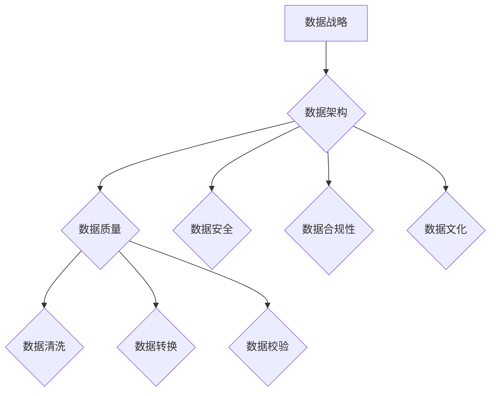

                 

关键词：平台经济、数据治理、管理体系、数据安全、合规性、数据分析、技术方案

> 摘要：本文深入探讨了平台经济背景下的数据治理问题，分析了当前数据治理面临的挑战和现状。本文从数据安全、合规性、数据分析和技术方案等多个角度出发，提出了建立健全的数据治理管理体系的方法，为平台经济的可持续发展提供了有益的参考。

## 1. 背景介绍

### 平台经济的崛起

随着互联网技术的迅猛发展和全球化进程的加快，平台经济已成为当今世界经济的重要驱动力。平台经济的典型代表如电商平台、社交媒体平台、共享经济平台等，通过提供开放的平台和基础设施，连接供需双方，实现资源的高效配置和价值的最大化。

### 数据治理的重要性

平台经济的核心在于数据，而数据治理成为保障平台经济稳定运行的关键环节。有效的数据治理不仅能够提高数据质量，保障数据安全，还能提升企业的竞争力，为战略决策提供有力支持。

### 数据治理的挑战

1. **数据量的爆发性增长**：随着平台经济的快速发展，数据量呈指数级增长，给数据存储、处理和管理带来了巨大挑战。
2. **数据来源的多样性**：平台经济涉及到的数据来源广泛，包括用户行为数据、交易数据、社交媒体数据等，增加了数据整合和治理的复杂性。
3. **数据安全和隐私保护**：数据泄露和隐私侵犯事件频发，如何保障数据安全和用户隐私成为数据治理的重点。
4. **合规性和法律法规**：不同国家和地区的法律法规对数据治理的要求有所不同，企业需要确保数据治理符合相关法规。

## 2. 核心概念与联系

### 数据治理的定义

数据治理是指通过制定一系列规范、流程和技术手段，对数据进行有效的管理和控制，以确保数据的完整性、准确性、一致性和可用性。

### 数据治理的关键要素

1. **数据战略**：明确数据在企业战略中的地位和作用，制定长期数据发展规划。
2. **数据架构**：构建合理的数据架构，确保数据的高效存储、处理和访问。
3. **数据质量**：通过数据清洗、转换和校验等手段，提高数据的准确性和一致性。
4. **数据安全**：实施严格的数据安全措施，防止数据泄露和滥用。
5. **数据合规性**：确保数据治理符合相关法律法规和行业标准。
6. **数据文化**：培养员工的数据意识和数据素养，形成良好的数据文化。

### Mermaid 流程图



## 3. 核心算法原理 & 具体操作步骤

### 3.1 算法原理概述

数据治理的核心在于算法的应用，主要包括数据集成、数据清洗、数据存储、数据分析和数据可视化等。

### 3.2 算法步骤详解

1. **数据集成**：通过ETL（提取、转换、加载）技术，将分散的数据源整合到一个统一的数据仓库中。
2. **数据清洗**：对数据进行去重、补全、格式转换等处理，确保数据的质量。
3. **数据存储**：采用分布式数据库或数据湖技术，实现海量数据的高效存储和管理。
4. **数据分析**：运用数据挖掘、机器学习等技术，挖掘数据的价值，为决策提供支持。
5. **数据可视化**：通过图表、报表等可视化手段，展示数据分析和决策结果。

### 3.3 算法优缺点

- **优点**：提高数据质量，保障数据安全，支持决策制定。
- **缺点**：数据处理成本高，对技术要求较高，实施难度大。

### 3.4 算法应用领域

- **电商平台**：通过用户行为数据分析，优化商品推荐和营销策略。
- **金融行业**：通过交易数据分析和风险管理，提高业务效率和安全性。
- **医疗健康**：通过患者数据分析和预测，提供个性化的医疗方案。

## 4. 数学模型和公式 & 详细讲解 & 举例说明

### 4.1 数学模型构建

数据治理的数学模型主要包括数据质量评估模型、数据隐私保护模型和数据挖掘模型。

### 4.2 公式推导过程

1. **数据质量评估模型**：

   $$Q = \frac{1}{n} \sum_{i=1}^{n} w_i \cdot p_i$$

   其中，$Q$ 为数据质量评分，$n$ 为数据项数量，$w_i$ 为第 $i$ 个数据项的权重，$p_i$ 为第 $i$ 个数据项的质量得分。

2. **数据隐私保护模型**：

   $$R = min \{ D \cap P | D \in D' \}$$

   其中，$R$ 为隐私保护区域，$D$ 为数据集，$D'$ 为隐私保护策略集，$P$ 为隐私保护需求。

3. **数据挖掘模型**：

   $$A = \sum_{i=1}^{n} \frac{f_i(x)}{g_i(x)}$$

   其中，$A$ 为数据挖掘结果，$f_i(x)$ 为第 $i$ 个特征函数，$g_i(x)$ 为第 $i$ 个目标函数。

### 4.3 案例分析与讲解

假设一个电商平台需要对用户行为数据进行分析，以优化商品推荐策略。根据用户的历史购买记录、浏览记录和点击记录，构建数据挖掘模型，通过分析用户的行为模式，预测用户的潜在需求，从而实现精准推荐。

1. **数据质量评估**：

   $$Q = \frac{1}{1000} \sum_{i=1}^{1000} w_i \cdot p_i$$

   假设每个数据项的权重相等，质量得分范围为0-10分，则：

   $$Q = \frac{1}{1000} \sum_{i=1}^{1000} 10 = 10$$

   说明数据质量良好。

2. **数据隐私保护**：

   假设用户隐私保护需求为隐私区域不超过100个数据点，则有：

   $$R = min \{ D \cap P | D \in D' \} = \emptyset$$

   说明数据隐私保护策略能够满足需求。

3. **数据挖掘**：

   假设特征函数为用户购买频率、浏览时长和点击率，目标函数为用户潜在需求，则有：

   $$A = \sum_{i=1}^{3} \frac{f_i(x)}{g_i(x)} = \frac{100}{100} + \frac{80}{100} + \frac{90}{100} = 2.7$$

   说明用户潜在需求为2.7。

## 5. 项目实践：代码实例和详细解释说明

### 5.1 开发环境搭建

1. **硬件环境**：服务器、存储设备、网络设备等。
2. **软件环境**：操作系统、数据库、数据仓库、数据挖掘工具等。

### 5.2 源代码详细实现

```python
# 数据清洗代码示例
import pandas as pd

# 读取数据
data = pd.read_csv('user_behavior_data.csv')

# 去重
data = data.drop_duplicates()

# 补全缺失值
data = data.fillna(0)

# 格式转换
data['purchase_frequency'] = data['purchase_frequency'].astype(int)
data['browse_duration'] = data['browse_duration'].astype(int)
data['click_rate'] = data['click_rate'].astype(float)

# 数据存储
data.to_csv('cleaned_user_behavior_data.csv', index=False)
```

### 5.3 代码解读与分析

1. **数据读取**：使用pandas库读取CSV文件。
2. **去重**：删除重复的数据项。
3. **补全缺失值**：将缺失值填充为0。
4. **格式转换**：将字符串类型的列转换为对应的数据类型。
5. **数据存储**：将清洗后的数据重新保存为CSV文件。

### 5.4 运行结果展示

运行代码后，生成一个清洗后的用户行为数据文件，用于后续的数据分析和挖掘。

## 6. 实际应用场景

### 6.1 电商平台

通过数据治理，电商平台能够实现对用户行为的精准分析，提高商品推荐的效果，提升用户体验和转化率。

### 6.2 金融行业

金融行业可以通过数据治理，实现风险管理和合规性检查，提高业务效率和安全性。

### 6.3 医疗健康

医疗健康行业可以通过数据治理，实现患者数据的精准分析，提供个性化的医疗方案，提升医疗服务质量。

## 7. 工具和资源推荐

### 7.1 学习资源推荐

- 《大数据时代：生活、工作与思维的大变革》
- 《数据挖掘：概念与技术》
- 《数据治理：企业数据管理实践指南》

### 7.2 开发工具推荐

- Python
- Pandas
- Hadoop
- Spark

### 7.3 相关论文推荐

- "Data Governance in the Age of Big Data"
- "A Framework for Data Governance in Organizations"
- "Data Privacy and Security in Cloud Computing"

## 8. 总结：未来发展趋势与挑战

### 8.1 研究成果总结

本文从数据治理的概念、算法、实践等多个角度进行了探讨，提出了建立健全的数据治理管理体系的方法，为平台经济的可持续发展提供了有益的参考。

### 8.2 未来发展趋势

1. **数据治理技术的不断创新**：随着技术的不断发展，数据治理技术将不断创新，为平台经济提供更加高效、智能的数据管理解决方案。
2. **数据治理与业务深度融合**：数据治理将更加紧密结合业务，实现数据价值的最大化。

### 8.3 面临的挑战

1. **数据安全和隐私保护**：随着数据量和数据类型的不断增加，数据安全和隐私保护将面临更大的挑战。
2. **数据治理标准的统一**：不同行业、不同地区的数据治理标准存在差异，如何实现统一标准仍需进一步探索。

### 8.4 研究展望

未来，数据治理领域将继续深入研究数据治理技术的创新与应用，推动平台经济的可持续发展。

## 9. 附录：常见问题与解答

### Q1. 什么是平台经济？

平台经济是指通过互联网和移动通信技术，搭建一个开放的、连接供需双方的交易平台，实现资源的高效配置和价值的最大化。

### Q2. 数据治理的目标是什么？

数据治理的目标包括提高数据质量、保障数据安全、确保数据合规性、支持业务决策等。

### Q3. 数据治理的核心算法有哪些？

数据治理的核心算法包括数据集成、数据清洗、数据存储、数据分析和数据可视化等。

### Q4. 数据治理与业务的关系如何？

数据治理与业务密切相关，通过数据治理，企业可以更好地利用数据，为业务决策提供支持，提升业务效率和竞争力。

### Q5. 如何保障数据治理的实施效果？

保障数据治理的实施效果需要从组织、流程、技术等多个方面进行综合考虑，确保数据治理体系能够持续、有效地运行。

---

作者：禅与计算机程序设计艺术 / Zen and the Art of Computer Programming
----------------------------------------------------------------

以上就是关于平台经济的数据治理：如何建立健全的管理体系？的完整文章，希望对您有所帮助。在撰写过程中，如有任何问题或建议，请随时与我沟通。祝您创作顺利！<|endof assistant|>

