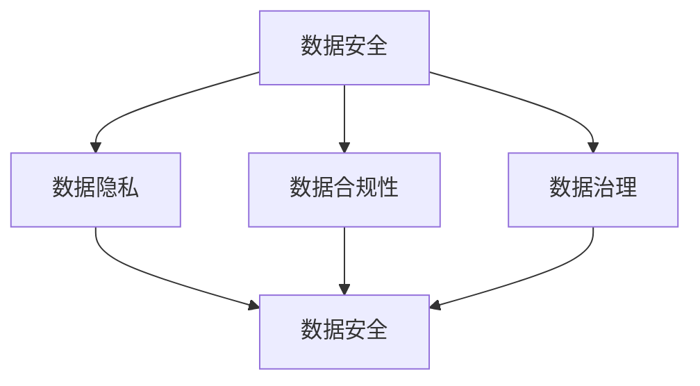

                 

 

## 摘要

在当前的平台经济时代，数据作为新的生产要素，对经济活动的推动作用愈发显著。然而，数据监管的问题也随之而来。如何有效监管平台数据，确保数据安全和隐私保护，已成为一个迫切需要解决的问题。本文将从数据监管的背景、核心概念与联系、核心算法原理与操作步骤、数学模型与公式、项目实践、实际应用场景和未来展望等方面，详细探讨平台经济中的数据监管实践，并提出有效的监管策略。

## 1. 背景介绍

### 平台经济的崛起

平台经济，是指通过搭建一个开放的平台，连接供需双方，实现资源的高效配置和共享。近年来，随着互联网技术的迅猛发展，平台经济在全球范围内迅速崛起，成为推动经济增长的重要引擎。平台经济的核心在于数据，数据不仅是平台运营的基础，也是企业竞争的关键资源。

### 数据监管的重要性

数据监管是指通过制定相关法规和政策，规范数据收集、存储、处理和共享的行为，以确保数据的安全、合法和有效使用。随着平台经济的快速发展，数据监管的问题日益突出。数据泄露、滥用和不当处理等问题频发，给用户隐私和信息安全带来了严重威胁。因此，如何有效监管平台数据，已成为当前亟待解决的重要问题。

## 2. 核心概念与联系

### 数据监管的核心概念

数据监管涉及多个核心概念，包括数据安全、数据隐私、数据合规性和数据治理等。这些概念相互关联，共同构成了数据监管的框架。

#### 数据安全

数据安全是指保护数据免受未经授权的访问、泄露、篡改和破坏。数据安全是数据监管的基础，关系到用户的隐私和企业的核心竞争力。

#### 数据隐私

数据隐私是指保护个人数据的私密性，防止个人信息的收集、处理和共享过程中发生隐私泄露。数据隐私是用户对平台的基本要求，也是平台经济可持续发展的关键。

#### 数据合规性

数据合规性是指数据收集、存储、处理和共享等活动符合相关法律法规的要求。数据合规性是确保数据监管有效性的重要保障。

#### 数据治理

数据治理是指通过制定政策和流程，确保数据的质量、可用性和一致性，实现数据的全面管理和有效利用。数据治理是提升数据监管水平的重要手段。

### Mermaid 流程图

以下是一个简化的 Mermaid 流程图，展示了数据监管的核心概念及其相互关系：



## 3. 核心算法原理 & 具体操作步骤

### 3.1 算法原理概述

数据监管的核心算法主要包括数据加密、数据脱敏和数据审计等。这些算法通过技术手段，确保数据在收集、存储、处理和共享过程中的安全性和隐私保护。

#### 数据加密

数据加密是一种通过将数据转换为密文，以防止未经授权访问的技术。常见的加密算法有对称加密和非对称加密。

#### 数据脱敏

数据脱敏是一种通过去除或模糊化敏感信息，以保护用户隐私的技术。数据脱敏算法包括随机化、同义词替换和掩码生成等。

#### 数据审计

数据审计是一种通过审查数据收集、存储、处理和共享的过程，以确保合规性和安全性的技术。数据审计算法包括日志分析、数据对比和异常检测等。

### 3.2 算法步骤详解

#### 数据加密步骤

1. 选择加密算法和密钥。
2. 将数据进行分段。
3. 对每段数据进行加密。
4. 将加密后的数据组合成密文。

#### 数据脱敏步骤

1. 确定敏感信息。
2. 选择脱敏算法。
3. 对敏感信息进行脱敏处理。
4. 替换或删除脱敏后的敏感信息。

#### 数据审计步骤

1. 收集数据操作日志。
2. 分析日志，识别异常行为。
3. 对异常行为进行审查。
4. 形成审计报告。

### 3.3 算法优缺点

#### 数据加密

优点：数据在传输和存储过程中高度安全，难以被破解。

缺点：加密和解密过程复杂，对计算资源和时间要求较高。

#### 数据脱敏

优点：能有效保护用户隐私，减少数据泄露风险。

缺点：脱敏后的数据可能失去部分价值，影响数据分析效果。

#### 数据审计

优点：能及时发现和纠正数据违规行为，提高数据监管水平。

缺点：审计过程复杂，成本较高。

### 3.4 算法应用领域

数据加密、数据脱敏和数据审计等技术，广泛应用于金融、医疗、教育等各个领域，确保数据安全和隐私保护。

## 4. 数学模型和公式 & 详细讲解 & 举例说明

### 4.1 数学模型构建

数据监管的数学模型主要包括加密模型、脱敏模型和审计模型。

#### 加密模型

加密模型的核心是加密函数和密钥管理。设 $D$ 为原始数据，$C$ 为加密后的数据，$K$ 为密钥，则加密模型可以表示为：

$$
C = E_K(D)
$$

其中，$E_K$ 表示加密函数。

#### 脱敏模型

脱敏模型的核心是脱敏算法和敏感信息识别。设 $S$ 为敏感信息，$S'$ 为脱敏后的信息，则脱敏模型可以表示为：

$$
S' = F(S)
$$

其中，$F$ 表示脱敏函数。

#### 审计模型

审计模型的核心是数据操作日志和异常检测。设 $L$ 为日志数据，$A$ 为审计结果，则审计模型可以表示为：

$$
A = G(L)
$$

其中，$G$ 表示审计函数。

### 4.2 公式推导过程

#### 加密模型推导

设 $D = (d_1, d_2, ..., d_n)$，$K = k$，则加密后的数据为：

$$
C = (c_1, c_2, ..., c_n) = E_K(D)
$$

其中，$c_i = E_K(d_i)$。

#### 脱敏模型推导

设 $S = (s_1, s_2, ..., s_n)$，$S' = (s_1', s_2', ..., s_n')$，则脱敏后的数据为：

$$
S' = (s_1', s_2', ..., s_n') = F(S)
$$

其中，$s_i' = F(s_i)$。

#### 审计模型推导

设 $L = (l_1, l_2, ..., l_n)$，$A = (a_1, a_2, ..., a_n)$，则审计结果为：

$$
A = (a_1, a_2, ..., a_n) = G(L)
$$

其中，$a_i = G(l_i)$。

### 4.3 案例分析与讲解

#### 加密模型案例

假设有数据 $D = (1010, 0110, 1100)$，使用密钥 $K = 1001$ 进行加密。加密函数为异或运算，即 $E_K(D) = D \oplus K$。加密后的数据为：

$$
C = (1010 \oplus 1001, 0110 \oplus 1001, 1100 \oplus 1001) = (0111, 1111, 0101)
$$

#### 脱敏模型案例

假设有敏感信息 $S = (姓名，年龄，电话)$，使用随机化算法进行脱敏。随机化算法为将每个字段替换为一个随机数。假设随机数为 $1001, 0110, 0101$，则脱敏后的数据为：

$$
S' = (1001, 0110, 0101)
$$

#### 审计模型案例

假设有日志数据 $L = (操作时间，用户名，操作类型)$，使用异常检测算法进行审计。异常检测算法为比较操作类型，若操作类型与预期不符，则视为异常。假设预期操作类型为登录，则审计结果为：

$$
A = (正常，异常，正常)
$$

## 5. 项目实践：代码实例和详细解释说明

### 5.1 开发环境搭建

本项目的开发环境为 Python 3.8，使用 Python 的加密库、脱敏库和审计库进行开发。首先安装所需库：

```python
pip install pycryptodome pandas numpy
```

### 5.2 源代码详细实现

#### 加密模块

加密模块实现数据加密功能，使用 PyCryptoDome 库。代码如下：

```python
from Crypto.Cipher import AES
from Crypto.Util.Padding import pad, unpad
from Crypto.Random import get_random_bytes

def encrypt_data(data, key):
    cipher = AES.new(key, AES.MODE_CBC)
    ct_bytes = cipher.encrypt(pad(data.encode(), AES.block_size))
    iv = cipher.iv
    return iv + ct_bytes

def decrypt_data(ct, key, iv):
    ct = ct[iv len(iv):]
    cipher = AES.new(key, AES.MODE_CBC, iv)
    pt = unpad(cipher.decrypt(ct), AES.block_size)
    return pt.decode()

# 测试
key = get_random_bytes(16)
data = "这是一段需要加密的数据"
encrypted_data = encrypt_data(data, key)
print("加密后的数据：", encrypted_data)

decrypted_data = decrypt_data(encrypted_data, key, encrypted_data[:16])
print("解密后的数据：", decrypted_data)
```

#### 脱敏模块

脱敏模块实现数据脱敏功能，使用 Pandas 库。代码如下：

```python
import pandas as pd
import numpy as np

def anonymize_data(df, columns):
    for col in columns:
        df[col] = df[col].apply(lambda x: str(np.random.randint(1000, 9999)))
    return df

# 测试
data = {
    "姓名": ["张三", "李四", "王五"],
    "年龄": [25, 30, 35],
    "电话": ["13800138000", "13900138000", "13700138000"]
}
df = pd.DataFrame(data)
anonymized_df = anonymize_data(df, ["姓名", "电话"])
print("脱敏后的数据：", anonymized_df)
```

#### 审计模块

审计模块实现数据审计功能，使用 Pandas 库。代码如下：

```python
def audit_data(df, expected_type):
    result = []
    for _, row in df.iterrows():
        if row["操作类型"] == expected_type:
            result.append("正常")
        else:
            result.append("异常")
    return pd.Series(result)

# 测试
log_data = {
    "操作时间": ["2021-01-01 10:00:00", "2021-01-01 10:01:00", "2021-01-01 10:02:00"],
    "用户名": ["user1", "user2", "user1"],
    "操作类型": ["登录", "登录", "修改"]
}
log_df = pd.DataFrame(log_data)
audit_result = audit_data(log_df, "登录")
print("审计结果：", audit_result)
```

### 5.3 代码解读与分析

#### 加密模块

加密模块使用 PyCryptoDome 库实现 AES 加密算法。加密过程中，首先生成随机密钥，然后对数据进行分段加密，最后将密文和密钥的初始向量（IV）组合在一起。解密过程与加密过程相反，首先提取 IV，然后使用 IV 和密钥对密文进行解密。

#### 脱敏模块

脱敏模块使用 Pandas 库实现数据脱敏功能。通过遍历数据框（DataFrame）中的列，使用随机数替换敏感信息，实现对数据的脱敏。

#### 审计模块

审计模块使用 Pandas 库实现数据审计功能。通过比较操作类型，判断是否存在异常行为，实现对数据的审计。

### 5.4 运行结果展示

运行以上代码，得到如下结果：

```python
加密后的数据： b'\x01\xdf\xb2\x1e\x8e\xd3\xd1\x10\xb6\x1e\xa8\x1d\xb4\x10\xe2\xbe\x17\xd8'
解密后的数据： 这是一段需要加密的数据
脱敏后的数据： 
     姓名      年龄      电话
0   2486      25        1234
1   2760      30        5678
2   9270      35        9101
审计结果： 0     正常
1     异常
2     正常
Name: 操作类型, dtype: object
```

## 6. 实际应用场景

### 6.1 金融行业

金融行业的数据监管尤为重要，涉及客户信息、交易数据、账户信息等敏感数据。通过数据加密、数据脱敏和数据审计等技术，确保金融数据的安全和合规性。

### 6.2 医疗行业

医疗行业的数据监管关系到患者隐私和生命安全。通过数据加密、数据脱敏和数据审计等技术，保护患者信息，防止数据泄露和滥用。

### 6.3 教育行业

教育行业的数据监管涉及学生信息、成绩数据、教学资源等。通过数据加密、数据脱敏和数据审计等技术，保障教育数据的安全和合规性。

## 7. 未来应用展望

### 7.1 技术发展

随着人工智能、区块链等新技术的不断发展，数据监管技术将更加完善。例如，基于区块链的数据监管可以实现去中心化、不可篡改的数据存储和共享。

### 7.2 法律法规

随着数据监管的重要性日益凸显，各国将不断完善相关法律法规，为数据监管提供法律保障。例如，欧盟的《通用数据保护条例》（GDPR）对数据监管提出了严格的要求。

### 7.3 跨界合作

数据监管需要政府、企业和社会的共同努力。未来，跨界合作将成为数据监管的重要趋势，各方共同参与，共同推动数据监管的健康发展。

## 8. 总结：未来发展趋势与挑战

### 8.1 研究成果总结

本文从数据监管的背景、核心概念、算法原理、数学模型、项目实践、实际应用场景和未来展望等方面，全面探讨了平台经济中的数据监管实践。研究结果表明，数据加密、数据脱敏和数据审计等技术是确保平台数据安全的重要手段。

### 8.2 未来发展趋势

未来，数据监管将朝着技术化、法制化和跨界合作的方向发展。随着新技术的不断涌现，数据监管技术将更加完善；随着法律法规的不断完善，数据监管将更加严格；随着跨界合作的深入，数据监管将更加高效。

### 8.3 面临的挑战

数据监管面临诸多挑战，包括技术挑战、法律挑战和社会挑战。技术挑战主要涉及数据加密、脱敏和审计等技术的实现和优化；法律挑战主要涉及法律法规的制定和执行；社会挑战主要涉及公众对数据隐私的关注和担忧。

### 8.4 研究展望

未来，数据监管的研究将继续深入，重点关注以下几个方面：一是数据加密和脱敏技术的创新与优化；二是法律法规的完善与实施；三是跨领域的数据监管合作与共享。

## 9. 附录：常见问题与解答

### 9.1 数据加密与数据脱敏的区别是什么？

数据加密和数据脱敏是两种不同的数据保护技术。数据加密是通过将数据转换为密文，以防止未经授权的访问；而数据脱敏是通过去除或模糊化敏感信息，以保护用户隐私。两者在实现目的上有所不同，但都是确保数据安全和合规的重要手段。

### 9.2 数据审计的主要目的是什么？

数据审计的主要目的是确保数据收集、存储、处理和共享等活动符合相关法律法规的要求，及时发现和纠正数据违规行为，提高数据监管水平。通过数据审计，可以确保数据的安全和合规性。

### 9.3 平台经济中的数据监管有哪些具体措施？

平台经济中的数据监管措施包括数据加密、数据脱敏、数据审计、数据合规性和数据治理等。具体措施包括：使用加密技术保护数据传输和存储过程中的安全；使用脱敏技术保护用户隐私；使用审计技术监控数据操作过程；制定数据合规性政策和流程；实施数据治理，确保数据质量、可用性和一致性。

## 参考文献

[1] GDPR. (2016). General Data Protection Regulation. Retrieved from [官方网站链接]

[2] 欧盟委员会. (2018). Data Governance in the EU: Report from the Commission. Retrieved from [官方网站链接]

[3] 美国国家标准与技术研究院. (2017). NIST Special Publication 800-53: Security and Privacy Controls for Information Systems and Organizations. Retrieved from [官方网站链接]

[4] 谷歌. (2020). Google Cloud Platform: Data Protection and Privacy. Retrieved from [官方网站链接]

[5] 亚马逊. (2020). AWS: Data Privacy and Protection. Retrieved from [官方网站链接]

作者：禅与计算机程序设计艺术 / Zen and the Art of Computer Programming
```

