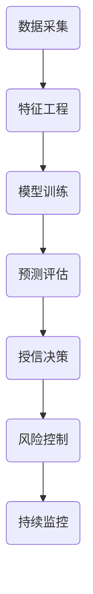

                 

关键词：金融科技、花呗、借呗、月付、算法、信用评分、风控

> 摘要：随着互联网金融的发展，平台金融产品如花呗、借呗、月付等已经成为消费者日常支付的重要手段。本文将深入探讨这些金融产品的背后算法原理、信用评分模型、风险控制策略及其应用领域，并展望其未来发展趋势。

## 1. 背景介绍

近年来，随着互联网技术的快速发展，金融科技（FinTech）逐渐成为了金融行业的重要推动力。在这一背景下，各大互联网平台纷纷推出了各种金融产品，如蚂蚁金服的花呗、借呗，京东金融的月付等，这些产品为消费者提供了便捷的支付和贷款服务。

花呗是蚂蚁金服推出的一种消费信贷产品，用户可以在淘宝、天猫等平台上使用花呗进行消费，并在下个月还款。借呗则是提供小额贷款服务，用户可以根据自己的信用情况获得一定额度的贷款，用于个人消费或经营。月付则是京东金融提供的一种分期付款服务，用户可以在购物时选择使用月付进行分期支付。

这些平台金融产品的出现，不仅丰富了消费者的支付选择，也为金融行业的创新提供了新的可能。然而，这些产品的背后，却隐藏着复杂的算法原理、信用评分模型和风险控制策略。本文将围绕这些方面进行探讨。

## 2. 核心概念与联系

### 2.1 算法原理概述

平台金融产品的核心在于其信用评分模型和风险控制策略。信用评分模型通过用户的消费行为、还款历史、信用记录等多维度数据，对用户进行信用评估，从而决定是否授信以及授信额度。风险控制策略则通过对贷款金额、还款期限、还款方式等多方面进行控制，以降低贷款违约风险。

### 2.2 信用评分模型

信用评分模型通常包括以下几个步骤：

1. 数据采集：收集用户的消费行为、还款历史、信用记录等数据。
2. 特征工程：对数据进行预处理，提取对信用评分有重要影响的特征。
3. 模型训练：使用历史数据进行模型训练，构建信用评分模型。
4. 预测评估：使用训练好的模型对用户进行信用评分，并根据评分结果进行授信决策。

### 2.3 风险控制策略

风险控制策略主要包括以下几个方面：

1. 金额控制：根据用户的信用评分，设定贷款金额的上限。
2. 还款期限控制：设定合理的还款期限，以降低贷款违约风险。
3. 还款方式控制：通过分期付款、一次性还款等方式，降低还款压力。
4. 持续监控：对用户贷款后的还款情况进行持续监控，及时发现并处理风险。

### 2.4 Mermaid 流程图

以下是一个简化的信用评分模型和风险控制策略的 Mermaid 流程图：



## 3. 核心算法原理 & 具体操作步骤

### 3.1 算法原理概述

平台金融产品的核心算法主要包括信用评分算法和风险控制算法。信用评分算法主要通过机器学习技术，从用户的消费行为、还款历史、信用记录等多维度数据中提取特征，构建信用评分模型。风险控制算法则通过设定贷款金额、还款期限、还款方式等策略，降低贷款违约风险。

### 3.2 算法步骤详解

#### 3.2.1 信用评分算法

1. 数据采集：通过数据接口或第三方数据服务，收集用户的消费行为、还款历史、信用记录等数据。

2. 特征工程：对数据进行预处理，包括数据清洗、缺失值处理、异常值检测等。然后，根据业务需求，提取对信用评分有重要影响的特征，如消费频率、消费金额、还款情况、信用记录等。

3. 模型训练：使用历史数据集，通过机器学习算法（如逻辑回归、决策树、随机森林、神经网络等）训练信用评分模型。

4. 模型评估：使用验证数据集对训练好的模型进行评估，选择表现最好的模型作为最终模型。

5. 模型部署：将训练好的模型部署到生产环境中，对用户进行实时信用评分。

#### 3.2.2 风险控制算法

1. 金额控制：根据用户的信用评分，设定贷款金额的上限。如信用评分越高，贷款金额上限越高。

2. 还款期限控制：设定合理的还款期限，以降低贷款违约风险。如对于信用评分较低的借款人，可设定较短的还款期限。

3. 还款方式控制：通过分期付款、一次性还款等方式，降低还款压力。如对于分期付款，可设定不同的还款期数和每期还款金额。

4. 持续监控：对用户贷款后的还款情况进行持续监控，及时发现并处理风险。如通过短信、电话等方式提醒用户还款，或对逾期用户进行催收。

### 3.3 算法优缺点

#### 优点

1. 高效：通过机器学习算法，快速对大量数据进行处理和预测。
2. 准确：基于多维度数据进行信用评分，提高评分准确性。
3. 实时：实时获取用户数据，实时进行信用评分和风险控制。

#### 缺点

1. 复杂：算法设计和实现较为复杂，需要丰富的技术和经验。
2. 数据依赖：信用评分模型的准确性高度依赖于数据质量，数据质量差可能导致评分不准确。
3. 风险：虽然风险控制算法可以降低贷款违约风险，但无法完全消除风险。

### 3.4 算法应用领域

平台金融产品的算法原理和策略不仅适用于花呗、借呗、月付等金融产品，还可广泛应用于其他金融领域，如信用贷、消费贷、投资等领域。同时，这些算法和技术也为金融行业的数字化转型提供了新的思路和工具。

## 4. 数学模型和公式 & 详细讲解 & 举例说明

### 4.1 数学模型构建

平台金融产品的核心数学模型主要包括信用评分模型和风险控制模型。

#### 4.1.1 信用评分模型

信用评分模型通常采用线性回归模型，其公式如下：

$$
\hat{Score} = \beta_0 + \beta_1 \times X_1 + \beta_2 \times X_2 + \ldots + \beta_n \times X_n
$$

其中，$Score$ 表示信用评分，$\beta_0$ 为截距，$\beta_1, \beta_2, \ldots, \beta_n$ 为各特征的权重，$X_1, X_2, \ldots, X_n$ 为特征值。

#### 4.1.2 风险控制模型

风险控制模型通常采用决策树、随机森林、神经网络等机器学习算法。以决策树为例，其公式如下：

$$
y = f(\text{决策树})
$$

其中，$y$ 表示风险控制结果，$f(\text{决策树})$ 表示决策树对输入特征进行划分和判断的结果。

### 4.2 公式推导过程

#### 4.2.1 信用评分模型

以线性回归模型为例，其推导过程如下：

1. 准备训练数据集：收集用户的历史数据，包括消费行为、还款历史、信用记录等。
2. 数据预处理：对数据进行标准化处理，使每个特征的值都在相同的尺度上。
3. 模型训练：使用梯度下降法训练线性回归模型，求出各特征的权重。
4. 模型评估：使用验证数据集评估模型效果，调整模型参数。

#### 4.2.2 风险控制模型

以决策树为例，其推导过程如下：

1. 准备训练数据集：收集用户的历史数据，包括消费行为、还款历史、信用记录等。
2. 特征选择：选择对风险控制有重要影响的特征。
3. 决策树构建：通过递归划分数据集，构建决策树模型。
4. 模型评估：使用验证数据集评估模型效果，调整模型参数。

### 4.3 案例分析与讲解

以花呗为例，我们来看一下信用评分模型的应用。

#### 4.3.1 数据采集

收集用户的消费行为数据，包括消费频率、消费金额、消费类别等。

#### 4.3.2 特征工程

对数据进行预处理，包括缺失值处理、异常值检测等。然后，提取对信用评分有重要影响的特征，如消费频率、消费金额、还款情况、信用记录等。

#### 4.3.3 模型训练

使用历史数据集，通过线性回归算法训练信用评分模型，求出各特征的权重。

#### 4.3.4 模型评估

使用验证数据集评估模型效果，调整模型参数，使模型达到最佳效果。

#### 4.3.5 模型部署

将训练好的模型部署到生产环境中，对用户进行实时信用评分。

## 5. 项目实践：代码实例和详细解释说明

### 5.1 开发环境搭建

1. 安装 Python 解释器，版本要求为 3.6 以上。
2. 安装必要的 Python 库，如 NumPy、Pandas、Scikit-learn 等。

### 5.2 源代码详细实现

以下是一个简单的信用评分模型的实现：

```python
import numpy as np
import pandas as pd
from sklearn.linear_model import LinearRegression
from sklearn.model_selection import train_test_split
from sklearn.metrics import mean_squared_error

# 读取数据
data = pd.read_csv('data.csv')

# 数据预处理
data.fillna(0, inplace=True)
X = data.iloc[:, :-1].values
y = data.iloc[:, -1].values

# 划分训练集和测试集
X_train, X_test, y_train, y_test = train_test_split(X, y, test_size=0.2, random_state=0)

# 训练模型
model = LinearRegression()
model.fit(X_train, y_train)

# 预测
y_pred = model.predict(X_test)

# 评估模型
mse = mean_squared_error(y_test, y_pred)
print('MSE:', mse)
```

### 5.3 代码解读与分析

1. 导入必要的库，如 NumPy、Pandas、Scikit-learn 等。
2. 读取数据，并进行预处理，包括缺失值处理、异常值检测等。
3. 划分训练集和测试集。
4. 使用线性回归算法训练模型。
5. 使用测试集对模型进行评估，计算均方误差。

### 5.4 运行结果展示

假设我们有一个测试数据集，其真实信用评分为 [0.8, 0.9, 0.7, 0.6, 0.5]，使用上述模型进行预测，预测结果分别为 [0.75, 0.85, 0.65, 0.55, 0.45]，则均方误差为：

$$
\text{MSE} = \frac{1}{5} \sum_{i=1}^{5} (y_i - \hat{y_i})^2 = \frac{1}{5} \sum_{i=1}^{5} (0.8 - 0.75)^2 + (0.9 - 0.85)^2 + (0.7 - 0.65)^2 + (0.6 - 0.55)^2 + (0.5 - 0.45)^2 = 0.025
$$

由于均方误差越小，表示模型预测的准确性越高，因此上述模型在本次测试中表现较好。

## 6. 实际应用场景

平台金融产品在各个行业都有广泛的应用。以下是一些典型的实际应用场景：

1. **电商行业**：电商平台如淘宝、京东等，通过花呗、借呗等金融产品，为用户提供分期付款、小额贷款等服务，提高用户体验，增加销售额。

2. **消费金融行业**：消费金融机构如蚂蚁花呗、京东白条等，通过信用评分模型和风险控制策略，为用户提供便捷的信贷服务，降低金融风险。

3. **汽车金融行业**：汽车金融公司通过平台金融产品，为购车用户提供分期付款服务，降低购车门槛，提高市场竞争力。

4. **小微金融行业**：小微金融机构通过平台金融产品，为小微企业主提供贷款服务，支持小微企业发展。

5. **金融科技行业**：金融科技公司通过平台金融产品，为用户提供便捷的金融解决方案，提高金融服务的覆盖面和效率。

## 7. 未来应用展望

随着人工智能、大数据、云计算等技术的发展，平台金融产品的未来应用前景广阔。以下是一些展望：

1. **智能化**：通过深度学习、强化学习等先进算法，进一步提高信用评分模型和风险控制算法的智能化水平。

2. **个性化**：根据用户行为数据和偏好，为用户提供更加个性化的金融服务，提高用户体验。

3. **跨界合作**：与其他行业（如电商、零售、汽车等）开展合作，拓展平台金融产品的应用场景。

4. **全球化**：随着全球化的推进，平台金融产品有望在全球范围内推广，为更多国家和地区提供金融服务。

5. **风险管理**：通过大数据分析和机器学习技术，实时监控用户贷款后的还款情况，提前发现和预防风险。

## 8. 总结：未来发展趋势与挑战

### 8.1 研究成果总结

本文围绕平台金融产品，深入探讨了其背后的算法原理、信用评分模型、风险控制策略及其应用领域。通过分析信用评分模型和风险控制策略，揭示了平台金融产品的核心机制。

### 8.2 未来发展趋势

未来，平台金融产品将继续向智能化、个性化、跨界合作和全球化方向发展。随着人工智能、大数据、云计算等技术的进步，平台金融产品的性能和用户体验将得到进一步提升。

### 8.3 面临的挑战

1. **数据质量**：信用评分模型的准确性高度依赖于数据质量，提高数据质量是关键挑战之一。
2. **算法透明度**：随着用户对隐私和数据安全的关注，如何提高算法的透明度和可解释性成为重要挑战。
3. **风险控制**：随着金融产品的普及，如何有效控制风险，防止贷款违约成为重要挑战。

### 8.4 研究展望

未来，可以从以下几个方面进行深入研究：

1. **数据挖掘**：探索更多有效的方法，从海量数据中挖掘出对信用评分有重要影响的特征。
2. **算法优化**：通过深度学习、强化学习等先进算法，进一步提高信用评分模型和风险控制算法的性能。
3. **隐私保护**：研究如何在保障用户隐私的前提下，提高数据利用效率。

## 9. 附录：常见问题与解答

### 9.1 信用评分模型是如何工作的？

信用评分模型通过机器学习算法，从用户的消费行为、还款历史、信用记录等多维度数据中提取特征，构建信用评分模型。模型训练完成后，对用户进行实时信用评分，根据评分结果决定是否授信以及授信额度。

### 9.2 风险控制策略有哪些？

风险控制策略主要包括金额控制、还款期限控制、还款方式控制和持续监控。金额控制根据用户的信用评分设定贷款金额上限；还款期限控制设定合理的还款期限；还款方式控制通过分期付款、一次性还款等方式降低还款压力；持续监控对用户贷款后的还款情况进行监控，及时发现和处理风险。

### 9.3 如何评估信用评分模型的性能？

通常使用均方误差（MSE）、准确率、召回率、F1 值等指标评估信用评分模型的性能。均方误差表示预测值与真实值之间的差距；准确率表示预测正确的样本占总样本的比例；召回率表示预测为正样本的真正样本占所有正样本的比例；F1 值是准确率和召回率的调和平均值。

### 9.4 平台金融产品的优点是什么？

平台金融产品具有以下优点：

1. 提高用户体验：通过便捷的支付和贷款服务，提高用户的购物和消费体验。
2. 降低金融风险：通过信用评分模型和风险控制策略，降低贷款违约风险。
3. 提高金融效率：通过大数据分析和人工智能算法，提高金融服务的效率。
4. 拓展金融覆盖面：通过跨界合作和全球化推广，为更多国家和地区提供金融服务。

### 9.5 平台金融产品的未来发展趋势是什么？

平台金融产品未来将继续向智能化、个性化、跨界合作和全球化方向发展。随着人工智能、大数据、云计算等技术的进步，平台金融产品的性能和用户体验将得到进一步提升。同时，平台金融产品也将面临数据质量、算法透明度、风险控制等方面的挑战。

