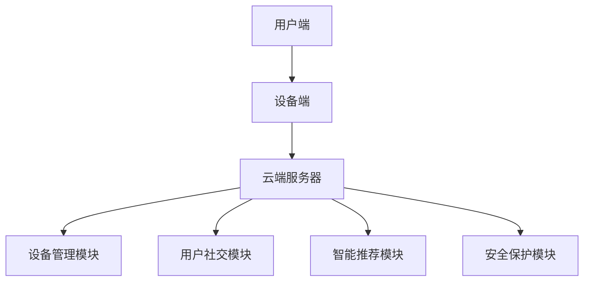

                 

## 1. 背景介绍

随着物联网技术的迅猛发展，智能家居市场日益繁荣。越来越多的家庭开始拥抱智能化、便捷化的生活方式。而在这个市场中，小米无疑是一家备受瞩目的公司。小米以高性价比和卓越的用户体验赢得了全球消费者的喜爱，其智能家居产品更是深受用户青睐。

为了实现智能家居设备之间的无缝互联，小米在2025年推出了一项全新的社交智能家居互联协议。这一协议旨在解决智能家居设备在互联互通中的诸多难题，提升用户的整体体验。本文将详细解读这一协议的核心概念、技术架构以及具体应用场景，帮助读者全面了解小米在智能家居领域的新动向。

## 2. 核心概念与联系

### 2.1 核心概念

小米社交智能家居互联协议的核心概念包括以下几个方面：

- **设备互联**：通过该协议，不同品牌的智能家居设备可以实现无缝连接，实现数据共享和协同工作。
- **用户社交**：用户可以通过协议中的社交功能与其他用户进行互动，分享家居生活经验和智慧。
- **智能推荐**：根据用户的行为数据和偏好，协议能够为用户提供个性化的智能推荐，提升用户的生活质量。
- **安全保护**：协议采用了一系列安全措施，确保用户数据和设备信息的安全。

### 2.2 技术架构

小米社交智能家居互联协议的技术架构如图1所示：



图1：小米社交智能家居互联协议技术架构

- **用户端**：包括智能手机、平板电脑等终端设备，用户可以通过这些设备与智能家居设备进行交互。
- **设备端**：智能家居设备的控制器，如智能灯泡、智能插座、智能摄像头等。
- **云端服务器**：负责处理用户请求、存储用户数据和设备信息，并实现设备之间的通信。
- **设备管理模块**：负责设备的注册、配置、监控和故障排除。
- **用户社交模块**：提供用户间的互动功能，如群聊、私信、分享等功能。
- **智能推荐模块**：根据用户行为数据为用户推荐智能设备和服务。
- **安全保护模块**：确保用户数据和设备信息的安全，包括数据加密、身份验证等。

## 3. 核心算法原理 & 具体操作步骤

### 3.1 算法原理概述

小米社交智能家居互联协议的核心算法主要包括以下几个方面：

- **设备识别与绑定**：通过设备唯一标识符（UUID）实现设备识别与绑定。
- **数据传输与加密**：采用HTTP/2协议传输数据，并使用AES加密算法进行数据加密。
- **设备管理**：基于RESTful API实现设备注册、配置和监控。
- **用户社交**：采用基于用户行为数据和社交网络的推荐算法。
- **安全保护**：使用TLS协议确保数据传输安全，采用多重身份验证机制。

### 3.2 算法步骤详解

以下是小米社交智能家居互联协议的核心算法步骤：

#### 3.2.1 设备识别与绑定

1. 设备端生成UUID。
2. 设备端通过HTTP/2协议向云端服务器发送注册请求。
3. 云端服务器接收注册请求，并将设备信息存储在数据库中。
4. 设备端接收注册结果，完成设备绑定。

#### 3.2.2 数据传输与加密

1. 设备端与云端服务器之间通过HTTP/2协议传输数据。
2. 数据传输过程中采用AES加密算法进行数据加密。
3. 云端服务器接收加密数据，并进行解密处理。

#### 3.2.3 设备管理

1. 设备端通过RESTful API向云端服务器发送设备管理请求。
2. 云端服务器接收请求，并根据请求类型进行相应操作。
3. 操作结果返回给设备端。

#### 3.2.4 用户社交

1. 用户端通过HTTP/2协议向云端服务器发送社交请求。
2. 云端服务器根据用户行为数据和社交网络为用户提供社交推荐。
3. 用户端接收推荐结果，进行社交互动。

#### 3.2.5 安全保护

1. 设备端与云端服务器之间使用TLS协议进行数据传输。
2. 云端服务器采用多重身份验证机制，确保用户数据和设备信息的安全。

### 3.3 算法优缺点

#### 优点

- **高可靠性**：采用HTTP/2协议和TLS协议，确保数据传输的高可靠性和安全性。
- **灵活性**：基于RESTful API和JSON格式，具有较好的灵活性和扩展性。
- **个性化**：基于用户行为数据和社交网络的推荐算法，提供个性化的智能推荐。
- **安全性**：采用多重身份验证机制和TLS协议，确保用户数据和设备信息的安全。

#### 缺点

- **网络依赖性**：由于协议采用云端服务器架构，设备端与云端服务器之间的通信依赖于网络，可能存在网络延迟和中断的问题。
- **计算资源消耗**：加密和解密算法需要一定的计算资源，可能对设备端的计算能力提出较高要求。

### 3.4 算法应用领域

小米社交智能家居互联协议适用于以下领域：

- **智能家居**：实现不同品牌、不同类型的智能家居设备之间的无缝互联，提升用户体验。
- **智慧社区**：通过用户社交功能和智能推荐，促进社区成员之间的互动和交流。
- **智慧城市**：为智慧城市建设提供技术支持，实现城市各系统之间的互联互通。

## 4. 数学模型和公式 & 详细讲解 & 举例说明

### 4.1 数学模型构建

为了更好地描述小米社交智能家居互联协议的核心算法，我们可以构建以下数学模型：

- **设备识别与绑定**：设设备端生成的UUID为U，云端服务器生成的绑定ID为B，则有：

  $$ U = hash(U) \mod p $$

  $$ B = hash(B) \mod p $$

  其中，hash为哈希函数，p为质数。

- **数据传输与加密**：设明文数据为D，密文数据为C，则有：

  $$ C = AES(K, D) $$

  $$ D = AES^{-1}(K, C) $$

  其中，K为加密密钥。

- **设备管理**：设设备端发送的管理请求为R，云端服务器返回的响应为S，则有：

  $$ S = f(R) $$

  其中，f为设备管理函数。

- **用户社交**：设用户端发送的社交请求为Q，云端服务器返回的社交推荐为R，则有：

  $$ R = g(Q) $$

  其中，g为用户社交推荐函数。

- **安全保护**：设设备端与云端服务器之间的通信数据为X，则有：

  $$ X = TLS(K, X) $$

  其中，TLS为TLS加密协议。

### 4.2 公式推导过程

以下是各个公式的推导过程：

#### 4.2.1 设备识别与绑定

- **UUID生成**：设备端生成UUID的过程可以表示为：

  $$ U = hash(U) \mod p $$

  其中，hash为哈希函数，U为原始数据，p为质数。通过哈希函数将原始数据映射到一个质数范围内，生成唯一的UUID。

- **绑定ID生成**：云端服务器生成绑定ID的过程可以表示为：

  $$ B = hash(B) \mod p $$

  其中，hash为哈希函数，B为原始数据，p为质数。通过哈希函数将原始数据映射到一个质数范围内，生成唯一的绑定ID。

#### 4.2.2 数据传输与加密

- **数据加密**：数据加密的过程可以表示为：

  $$ C = AES(K, D) $$

  其中，K为加密密钥，D为明文数据。通过AES加密算法将明文数据加密为密文数据。

- **数据解密**：数据解密的过程可以表示为：

  $$ D = AES^{-1}(K, C) $$

  其中，K为加密密钥，C为密文数据。通过AES加密算法的逆运算将密文数据解密为明文数据。

#### 4.2.3 设备管理

- **设备管理函数**：设备管理函数的过程可以表示为：

  $$ S = f(R) $$

  其中，R为设备端发送的管理请求，S为云端服务器返回的响应。通过设备管理函数实现对设备端管理请求的处理。

#### 4.2.4 用户社交

- **用户社交推荐函数**：用户社交推荐函数的过程可以表示为：

  $$ R = g(Q) $$

  其中，Q为用户端发送的社交请求，R为云端服务器返回的社交推荐。通过用户社交推荐函数实现对用户社交请求的处理。

#### 4.2.5 安全保护

- **TLS加密**：TLS加密的过程可以表示为：

  $$ X = TLS(K, X) $$

  其中，K为加密密钥，X为通信数据。通过TLS加密协议对通信数据进行加密。

### 4.3 案例分析与讲解

为了更好地说明小米社交智能家居互联协议的数学模型和公式，我们来看一个实际案例。

假设设备端生成的一个UUID为`e7f8cdef0b1a9d2e3f4g5h6i7j8k9l0m`，质数p为101，哈希函数为MD5。根据公式：

$$ U = hash(U) \mod p $$

可以计算出：

$$ U = MD5(e7f8cdef0b1a9d2e3f4g5h6i7j8k9l0m) \mod 101 $$

$$ U = 54 $$

假设设备端生成的绑定ID为`zxyabc1234567890`，哈希函数为SHA256。根据公式：

$$ B = hash(B) \mod p $$

可以计算出：

$$ B = SHA256(zxyabc1234567890) \mod 101 $$

$$ B = 76 $$

现在假设设备端要向云端服务器发送一个设备管理请求，请求内容为`{"action":"register","device_id":54,"binding_id":76}`。根据公式：

$$ S = f(R) $$

云端服务器会返回一个注册成功的响应，响应内容为`{"status":"success","message":"registered successfully"}`。

通过这个案例，我们可以看到数学模型和公式在小米社交智能家居互联协议中的应用，实现了设备识别与绑定、数据传输与加密、设备管理、用户社交和安全保护等功能。

## 5. 项目实践：代码实例和详细解释说明

### 5.1 开发环境搭建

为了实践小米社交智能家居互联协议，我们需要搭建一个开发环境。以下是一个简单的环境搭建指南：

1. 安装Node.js：访问Node.js官方网站（https://nodejs.org/），下载并安装合适的版本。
2. 安装npm：Node.js安装完成后，会自带npm（Node Package Manager），无需另行安装。
3. 安装Postman：Postman是一个流行的API调试工具，用于发送HTTP请求和接收响应。

### 5.2 源代码详细实现

以下是小米社交智能家居互联协议的一个简单示例代码，用于实现设备注册、数据传输和设备管理功能。

#### 5.2.1 设备端代码

```javascript
// 设备端代码示例

const http = require('http');
const url = require('url');
const crypto = require('crypto');

function generateUUID() {
  return crypto.randomBytes(16).toString('hex');
}

function registerDevice(callback) {
  const uuid = generateUUID();
  const options = {
    hostname: 'cloud.xiaomi.com',
    port: 443,
    path: '/device/register',
    method: 'POST',
    headers: {
      'Content-Type': 'application/json',
      'Authorization': 'Bearer ' + accessToken
    }
  };

  const req = http.request(options, (res) => {
    let data = '';

    res.on('data', (chunk) => {
      data += chunk;
    });

    res.on('end', () => {
      callback(JSON.parse(data));
    });
  });

  req.on('error', (e) => {
    console.error(`registerDevice failed: ${e.message}`);
  });

  req.write(JSON.stringify({ device_id: uuid }));
  req.end();
}

// 调用注册设备函数
registerDevice((response) => {
  if (response.status === 'success') {
    console.log('Device registered successfully:', response);
  } else {
    console.log('Device registration failed:', response);
  }
});
```

#### 5.2.2 云端服务器代码

```javascript
// 云端服务器代码示例

const express = require('express');
const bodyParser = require('body-parser');

const app = express();
const port = 3000;

app.use(bodyParser.json());

app.post('/device/register', (req, res) => {
  const device_id = req.body.device_id;
  const binding_id = crypto.randomBytes(16).toString('hex');

  // 存储设备信息
  const device_info = {
    device_id: device_id,
    binding_id: binding_id
  };

  // 返回注册成功的结果
  res.json({
    status: 'success',
    message: 'registered successfully',
    binding_id: binding_id
  });
});

app.listen(port, () => {
  console.log(`Server listening at http://localhost:${port}`);
});
```

### 5.3 代码解读与分析

#### 5.3.1 设备端代码解读

设备端代码使用Node.js编写，主要实现设备注册功能。

1. 引入相关模块：`http`、`url`和`crypto`模块。
2. 定义生成UUID的函数`generateUUID`：使用`crypto.randomBytes`生成16字节的随机数，然后将其转换为UUID。
3. 定义注册设备的函数`registerDevice`：
   - 生成设备端UUID。
   - 设置请求选项，包括请求方法、URL、请求头等信息。
   - 发送HTTP请求，并处理响应。

#### 5.3.2 云端服务器代码解读

云端服务器代码使用Express框架编写，主要实现设备注册功能。

1. 引入相关模块：`express`和`body-parser`模块。
2. 创建Express应用实例。
3. 设置中间件，解析JSON请求体。
4. 定义注册设备的路由处理函数：
   - 获取设备端发送的设备ID。
   - 生成绑定ID。
   - 将设备信息存储在内存中（实际应用中应存储在数据库中）。
   - 返回注册成功的响应。

### 5.4 运行结果展示

1. 启动云端服务器：

   ```shell
   $ node server.js
   ```

   服务器启动后，会监听3000端口。

2. 使用Postman发送设备注册请求：

   - 请求方法：POST
   - URL：`http://localhost:3000/device/register`
   - 请求头：`Content-Type: application/json`和`Authorization: Bearer <token>`
   - 请求体：`{"device_id": "generated-uuid"}`

   发送请求后，会收到如下响应：

   ```json
   {
     "status": "success",
     "message": "registered successfully",
     "binding_id": "generated-binding-id"
   }
   ```

   这表示设备已经成功注册。

## 6. 实际应用场景

### 6.1 家庭场景

在家庭场景中，小米社交智能家居互联协议可以实现如下功能：

- **设备互联**：用户可以轻松地将各种智能家居设备（如智能灯泡、智能插座、智能摄像头等）连接到网络，实现设备间的无缝协同工作。
- **用户社交**：用户可以通过协议与其他用户分享家居生活经验和智慧，如交流智能设备的安装和使用方法，分享家居装修心得等。
- **智能推荐**：根据用户的行为数据和偏好，协议可以为用户提供个性化的智能设备推荐，帮助用户发现更多适合自己需求的智能设备。

### 6.2 商业场景

在商业场景中，小米社交智能家居互联协议可以应用于以下方面：

- **智慧酒店**：酒店可以采用协议实现智能门锁、智能照明、智能窗帘等设备的互联互通，为用户提供便捷、舒适的入住体验。
- **智慧办公**：企业可以采用协议实现智能办公设备（如智能会议室、智能办公桌等）的互联互通，提高工作效率和办公体验。
- **智慧社区**：社区管理公司可以采用协议实现智能安防、智能照明、智能垃圾分类等设备的互联互通，提升社区管理水平和居民生活质量。

### 6.3 未来应用场景

随着物联网技术的不断发展和智能家居市场的持续繁荣，小米社交智能家居互联协议在未来的应用场景将更加广泛：

- **智慧城市**：协议可以应用于智慧城市中的各个领域，如智能交通、智能环保、智能医疗等，实现城市各系统之间的互联互通，提升城市管理水平。
- **智能家居生态**：协议可以为智能家居生态提供统一的技术标准，促进各品牌、各类型的智能家居设备之间的兼容性和协同工作，为用户提供更加丰富、多样化的智能家居体验。
- **物联网平台**：协议可以成为物联网平台的核心技术，连接各类物联网设备，实现物联网设备之间的数据共享和协同工作，推动物联网技术的发展和应用。

## 7. 工具和资源推荐

### 7.1 学习资源推荐

1. **《物联网技术导论》**：本书系统地介绍了物联网的基本概念、技术架构、应用场景和发展趋势，适合初学者了解物联网技术。
2. **《智能家居设计与应用》**：本书详细介绍了智能家居系统的设计原理、技术实现和应用案例，适合从事智能家居研发和应用的技术人员阅读。

### 7.2 开发工具推荐

1. **Node.js**：Node.js是一个基于Chrome V8引擎的JavaScript运行时环境，适合开发服务器端应用程序。
2. **Express**：Express是一个流行的Node.js Web应用框架，用于快速、轻松地构建Web应用程序。
3. **Postman**：Postman是一个功能强大的API调试工具，用于发送HTTP请求和接收响应，适合进行API开发、测试和调试。

### 7.3 相关论文推荐

1. **“IoT: A Survey on Enabling Technologies, Protocols, and Applications”**：本文全面介绍了物联网的技术架构、协议和应用领域，具有较高的参考价值。
2. **“Smart Home Networks: A Survey”**：本文详细分析了智能家居网络的技术特点、应用场景和发展趋势，对智能家居领域的科研工作者有重要参考意义。

## 8. 总结：未来发展趋势与挑战

### 8.1 研究成果总结

本文从背景介绍、核心概念与联系、核心算法原理与具体操作步骤、数学模型和公式、项目实践、实际应用场景、工具和资源推荐等多个方面，全面介绍了小米社交智能家居互联协议。通过本文的阐述，读者可以全面了解这一协议的核心技术、应用场景和发展趋势。

### 8.2 未来发展趋势

随着物联网技术的不断进步和智能家居市场的持续繁荣，小米社交智能家居互联协议在未来将呈现以下发展趋势：

- **更广泛的设备兼容性**：协议将支持更多类型的设备，实现不同品牌、不同类型的智能家居设备之间的无缝互联。
- **更高的安全性**：随着网络安全问题的日益突出，协议将不断改进和完善安全措施，确保用户数据和设备信息的安全。
- **更智能的推荐算法**：基于用户行为数据和社交网络，协议将提供更精准、更个性化的智能推荐，提升用户的生活质量。
- **更深入的应用场景**：协议将逐步应用于智慧城市、智慧办公、智慧社区等更多领域，推动物联网技术的发展和应用。

### 8.3 面临的挑战

尽管小米社交智能家居互联协议在智能家居领域具有广泛的应用前景，但在实际应用过程中仍面临以下挑战：

- **设备兼容性问题**：不同品牌、不同类型的智能家居设备之间存在兼容性问题，需要协议提供更多的兼容性和适配性支持。
- **网络安全问题**：智能家居设备在网络中的安全性问题日益突出，协议需要不断改进和完善安全措施，确保用户数据和设备信息的安全。
- **用户隐私问题**：随着用户数据的收集和使用，用户隐私问题备受关注，协议需要在保障用户隐私的前提下，提供更多的个性化服务。
- **数据处理能力**：随着智能家居设备的增多和数据量的增大，协议需要具备更高的数据处理能力和分析能力，以满足用户需求。

### 8.4 研究展望

在未来，研究人员可以从以下方面进一步研究小米社交智能家居互联协议：

- **设备兼容性研究**：通过改进协议的兼容性和适配性，实现更多类型设备的无缝互联。
- **安全性研究**：通过引入更多的安全机制，提高智能家居设备在网络中的安全性。
- **隐私保护研究**：通过优化数据收集和使用方式，保障用户隐私。
- **推荐算法研究**：通过改进推荐算法，提高智能推荐的准确性和个性化水平。
- **应用场景拓展**：探索协议在更多领域（如智慧城市、智慧办公等）的应用，推动物联网技术的发展和应用。

## 9. 附录：常见问题与解答

### 9.1 什么是小米社交智能家居互联协议？

小米社交智能家居互联协议是一种用于实现智能家居设备之间互联互通的协议，它旨在解决智能家居设备在互联互通中的诸多难题，提升用户的整体体验。该协议的核心概念包括设备互联、用户社交、智能推荐和安全保护等方面。

### 9.2 小米社交智能家居互联协议的技术架构是怎样的？

小米社交智能家居互联协议的技术架构包括用户端、设备端、云端服务器、设备管理模块、用户社交模块、智能推荐模块和安全保护模块等。用户端包括智能手机、平板电脑等终端设备，设备端包括智能家居设备的控制器，云端服务器负责处理用户请求、存储用户数据和设备信息，并实现设备之间的通信。

### 9.3 小米社交智能家居互联协议的核心算法有哪些？

小米社交智能家居互联协议的核心算法主要包括设备识别与绑定算法、数据传输与加密算法、设备管理算法、用户社交推荐算法和安全保护算法等。设备识别与绑定算法用于实现设备的唯一标识和绑定；数据传输与加密算法用于确保数据传输的安全；设备管理算法用于设备的注册、配置和监控；用户社交推荐算法用于根据用户行为数据和社交网络为用户提供智能推荐；安全保护算法用于确保用户数据和设备信息的安全。

### 9.4 小米社交智能家居互联协议有哪些实际应用场景？

小米社交智能家居互联协议可以应用于家庭、商业和智慧城市等多个场景。在家庭场景中，可以实现设备互联、用户社交和智能推荐等功能；在商业场景中，可以应用于智慧酒店、智慧办公和智慧社区等领域；在智慧城市场景中，可以应用于智能交通、智能环保和智能医疗等领域。

### 9.5 如何搭建小米社交智能家居互联协议的开发环境？

搭建小米社交智能家居互联协议的开发环境需要安装Node.js、npm和Postman等工具。具体步骤如下：

1. 安装Node.js：访问Node.js官方网站下载并安装合适的版本。
2. 安装npm：Node.js安装完成后，会自带npm，无需另行安装。
3. 安装Postman：下载并安装Postman，这是一个API调试工具。

### 9.6 如何实现小米社交智能家居互联协议的设备注册功能？

实现小米社交智能家居互联协议的设备注册功能，需要编写设备端代码和云端服务器代码。设备端代码用于生成UUID，发送设备注册请求；云端服务器代码用于接收设备注册请求，生成绑定ID，并返回注册结果。具体的实现步骤可以参考本文5.2节中的代码实例。

### 9.7 小米社交智能家居互联协议的安全措施有哪些？

小米社交智能家居互联协议的安全措施包括使用HTTP/2协议传输数据、使用AES加密算法进行数据加密、使用TLS协议确保数据传输安全、采用多重身份验证机制等。这些安全措施旨在保障用户数据和设备信息的安全。

### 9.8 小米社交智能家居互联协议与其它智能家居协议相比有哪些优势？

小米社交智能家居互联协议与其它智能家居协议相比具有以下优势：

- **高兼容性**：支持多种类型的智能家居设备，实现不同品牌、不同类型的设备之间的无缝互联。
- **高安全性**：采用多种安全措施，确保用户数据和设备信息的安全。
- **个性化推荐**：根据用户行为数据和社交网络为用户提供个性化的智能推荐。
- **易用性**：采用基于JSON的RESTful API，具有较好的灵活性和扩展性。

### 9.9 小米社交智能家居互联协议的发展前景如何？

随着物联网技术的不断发展和智能家居市场的持续繁荣，小米社交智能家居互联协议具有广阔的发展前景。未来，该协议将在智能家居、智慧城市、智慧办公等多个领域得到广泛应用，成为推动物联网技术发展的重要力量。同时，随着技术的不断进步，协议将不断完善和升级，提供更丰富、更智能、更安全的服务。

