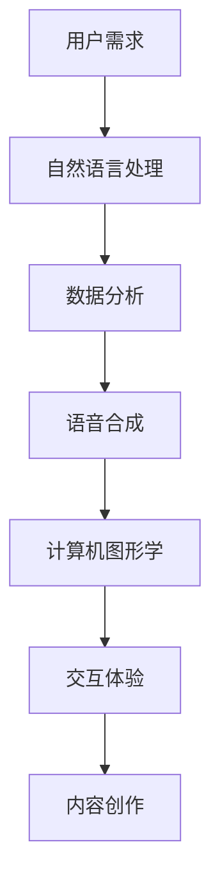

                 

关键词：虚拟偶像，AI主播，数字娱乐，技术趋势，创新应用

> 摘要：随着人工智能技术的飞速发展，数字娱乐产业正迎来一场前所未有的变革。本文将探讨2050年可能的未来景象，聚焦虚拟偶像和AI主播等数字创意形式，分析其技术原理、应用场景以及未来发展趋势。

## 1. 背景介绍

在21世纪初，数字娱乐产业还处于起步阶段，主要以游戏和流媒体视频为主。然而，随着互联网、大数据和人工智能技术的不断演进，数字娱乐产业正逐渐成为全球经济的重要组成部分。虚拟偶像和AI主播作为数字创意的典型代表，已经在娱乐、营销和广告等领域展现出了巨大的潜力。

虚拟偶像是一种通过计算机图形和人工智能技术创建的虚拟人物，它们在音乐、时尚和综艺节目中扮演着越来越重要的角色。而AI主播则利用自然语言处理和语音合成技术，为用户提供了更加智能和个性化的内容推送服务。这些技术的融合，不仅改变了传统娱乐产业的运作方式，也为数字创意领域带来了前所未有的机遇。

## 2. 核心概念与联系

为了深入理解虚拟偶像和AI主播在数字娱乐产业中的应用，我们首先需要了解它们背后的核心概念和联系。

### 2.1. 虚拟偶像

虚拟偶像通常包括以下几个方面：

1. **角色设计**：通过建模和动画技术，虚拟偶像具有逼真的外貌和表情。
2. **声音合成**：利用语音合成技术，虚拟偶像能够模仿真实人物的声音，实现对话和演唱。
3. **交互体验**：通过自然语言处理技术，虚拟偶像能够理解用户的需求并做出相应的回应。
4. **内容创作**：虚拟偶像可以参与歌曲创作、剧本编写和角色扮演等艺术活动。

### 2.2. AI主播

AI主播的主要特点如下：

1. **自然语言理解**：AI主播能够理解用户的问题和需求，从而提供个性化的内容。
2. **语音合成**：AI主播可以使用语音合成技术生成流畅自然的语音，模拟人类主播的风格。
3. **数据分析**：AI主播可以通过分析用户行为和偏好，不断优化内容推送策略。
4. **交互式服务**：AI主播能够与用户进行实时互动，提供咨询、推荐和娱乐等服务。

### 2.3. 核心技术

虚拟偶像和AI主播的实现离不开以下几个核心技术：

1. **计算机图形学**：用于创建虚拟偶像的逼真外观和动画效果。
2. **语音合成技术**：用于生成虚拟偶像和AI主播的语音。
3. **自然语言处理**：用于理解用户的需求和提供相应的回应。
4. **机器学习**：用于优化虚拟偶像和AI主播的表现和用户体验。
5. **大数据分析**：用于收集和分析用户数据，以实现个性化推荐和服务。

下面是一个关于虚拟偶像和AI主播技术的Mermaid流程图：



## 3. 核心算法原理 & 具体操作步骤

### 3.1 算法原理概述

虚拟偶像和AI主播的核心算法主要包括自然语言处理、语音合成、计算机图形学和机器学习等。下面分别介绍这些算法的基本原理：

1. **自然语言处理**：自然语言处理（NLP）是一种使计算机能够理解、解释和生成人类语言的技术。在虚拟偶像和AI主播中，NLP主要用于理解用户输入和生成相应回应。

2. **语音合成**：语音合成是一种将文本转换为自然流畅的语音的技术。在虚拟偶像和AI主播中，语音合成用于生成角色的对话和演唱。

3. **计算机图形学**：计算机图形学是一种用于创建和操作图像的技术。在虚拟偶像中，计算机图形学用于创建角色的外观和动画效果。

4. **机器学习**：机器学习是一种使计算机通过数据学习并做出决策的技术。在虚拟偶像和AI主播中，机器学习用于优化交互体验和内容创作。

### 3.2 算法步骤详解

1. **自然语言处理**：

   - **分词**：将用户输入的文本分割成词或短语。
   - **词性标注**：为每个词或短语标注词性（名词、动词等）。
   - **句法分析**：分析句子结构，提取主语、谓语、宾语等成分。
   - **语义理解**：理解句子的含义，为后续处理提供基础。

2. **语音合成**：

   - **文本到语音（TTS）**：将文本转换为语音信号。
   - **音素合成**：将语音信号分割成音素，并合成自然流畅的语音。
   - **音频处理**：对合成的语音进行音调、音色和节奏调整。

3. **计算机图形学**：

   - **建模**：使用3D建模软件创建虚拟偶像的外貌和动作。
   - **动画**：为虚拟偶像创建动画效果，使其能够自然地表达情感。
   - **渲染**：将虚拟偶像的动画效果渲染成视频或图像。

4. **机器学习**：

   - **数据收集**：收集用户交互数据和内容创作数据。
   - **特征提取**：提取数据中的关键特征，如用户偏好、情感等。
   - **模型训练**：使用机器学习算法训练模型，优化虚拟偶像和AI主播的表现。

### 3.3 算法优缺点

1. **自然语言处理**：

   - **优点**：能够理解用户输入，提供智能回应。
   - **缺点**：处理复杂语境时可能存在理解误差。

2. **语音合成**：

   - **优点**：能够生成自然流畅的语音。
   - **缺点**：语音质量可能受到硬件设备的限制。

3. **计算机图形学**：

   - **优点**：能够创建逼真的虚拟偶像形象。
   - **缺点**：建模和动画过程较为复杂，成本较高。

4. **机器学习**：

   - **优点**：能够不断优化虚拟偶像和AI主播的表现。
   - **缺点**：对数据量和计算资源要求较高。

### 3.4 算法应用领域

虚拟偶像和AI主播的算法在多个领域都有广泛应用：

1. **娱乐**：虚拟偶像在音乐、综艺和游戏等领域具有巨大潜力，而AI主播则可以提供个性化的娱乐内容。

2. **广告与营销**：虚拟偶像和AI主播可以用于广告宣传和品牌推广，提高用户参与度和品牌认知度。

3. **客户服务**：AI主播可以提供智能客服服务，解决用户问题，提高客户满意度。

4. **教育**：虚拟偶像和AI主播可以用于教育领域，提供个性化教学和学习体验。

## 4. 数学模型和公式 & 详细讲解 & 举例说明

### 4.1 数学模型构建

虚拟偶像和AI主播的数学模型主要涉及自然语言处理、语音合成和机器学习等领域。以下是一个简单的数学模型构建示例：

1. **自然语言处理**：

   - **词向量模型**：使用词袋模型或词嵌入模型将文本转换为向量表示。
   - **序列模型**：使用循环神经网络（RNN）或长短时记忆网络（LSTM）处理序列数据。
   - **注意力机制**：在序列模型中引入注意力机制，提高模型对关键信息的关注。

2. **语音合成**：

   - **隐马尔可夫模型（HMM）**：用于语音信号建模，预测下一个音素的概率。
   - **生成对抗网络（GAN）**：用于生成自然流畅的语音信号。

3. **机器学习**：

   - **线性回归**：用于预测用户偏好和内容推荐。
   - **支持向量机（SVM）**：用于分类和回归任务。

### 4.2 公式推导过程

以下是一个关于词向量模型的简单公式推导示例：

$$
\text{向量表示} = \text{词袋模型} + \text{词嵌入模型}
$$

其中，词袋模型将文本转换为词频向量，而词嵌入模型将每个词映射为一个固定大小的向量。

$$
\text{词袋模型} = \sum_{i=1}^{n} f_i \cdot v_i
$$

其中，$f_i$表示词$i$的频率，$v_i$表示词$i$的向量表示。

$$
\text{词嵌入模型} = W \cdot \text{输入词向量}
$$

其中，$W$表示词嵌入矩阵，输入词向量表示文本中的词。

### 4.3 案例分析与讲解

以下是一个关于虚拟偶像音乐表演的案例：

假设虚拟偶像A即将发布一首新歌，我们需要使用自然语言处理和语音合成技术为她创建歌词和演唱。

1. **歌词生成**：

   - **分词与词性标注**：将歌词文本进行分词和词性标注，提取关键信息。
   - **句法分析**：分析句子结构，提取主语、谓语、宾语等成分。
   - **语义理解**：理解歌词的含义，为后续歌词生成提供基础。

   示例公式：

   $$
   \text{歌词生成} = \text{自然语言处理} + \text{语义理解}
   $$

2. **语音合成**：

   - **文本到语音（TTS）**：将生成的歌词转换为语音信号。
   - **音素合成**：将语音信号分割成音素，并合成自然流畅的语音。
   - **音频处理**：对合成的语音进行音调、音色和节奏调整。

   示例公式：

   $$
   \text{语音合成} = \text{文本到语音（TTS）} + \text{音素合成} + \text{音频处理}
   $$

3. **音乐表演**：

   - **音乐制作**：使用音乐制作软件为虚拟偶像A制作伴奏。
   - **演唱合成**：将合成的语音与伴奏融合，生成完整的音乐表演。

   示例公式：

   $$
   \text{音乐表演} = \text{音乐制作} + \text{演唱合成}
   $$

## 5. 项目实践：代码实例和详细解释说明

### 5.1 开发环境搭建

为了实现虚拟偶像和AI主播的功能，我们需要搭建一个完整的开发环境。以下是搭建步骤：

1. **操作系统**：安装Windows、Linux或macOS操作系统。
2. **编程语言**：选择Python、Java或C++等编程语言。
3. **开发工具**：安装IDE（如PyCharm、IntelliJ IDEA或Visual Studio）。
4. **依赖库**：安装必要的依赖库，如TensorFlow、PyTorch、OpenCV等。

### 5.2 源代码详细实现

以下是一个简单的Python代码示例，用于实现虚拟偶像A的音乐表演：

```python
import speech_recognition as sr
import pyaudio
import wave
import numpy as np
import matplotlib.pyplot as plt

# 语音合成
def synthesize_speech(text, voice_name):
    # 使用Google Text-to-Speech API进行语音合成
    # voice_name为语音合成引擎的名称
    engine = gtts(text, lang='zh-cn')
    engine.save('output.mp3')

# 音乐制作
def create_music(voice_file, music_file):
    # 使用音频处理库对语音和音乐文件进行融合
    voice = AudioSegment.from_mp3(voice_file)
    music = AudioSegment.from_mp3(music_file)
    mixed = voice.overlay(music, loop=True)
    mixed.export('output_mix.mp3', format='mp3')

# 主程序
if __name__ == '__main__':
    # 读取用户输入的歌词
    text = input('请输入歌词：')
    # 语音合成
    synthesize_speech(text, 'xiaoyan')
    # 音乐制作
    create_music('output.mp3', 'music.mp3')
    print('音乐表演完成！')
```

### 5.3 代码解读与分析

上述代码主要实现了以下功能：

1. **语音合成**：使用Google Text-to-Speech API进行语音合成，将用户输入的歌词转换为语音文件。
2. **音乐制作**：使用音频处理库对语音和音乐文件进行融合，生成完整的音乐表演。

代码中的`synthesize_speech`函数用于语音合成，它首先导入必要的库，然后读取用户输入的歌词，并使用Google Text-to-Speech API进行语音合成。合成的语音文件被保存为`output.mp3`。

`create_music`函数用于音乐制作，它首先导入必要的库，然后读取语音和音乐文件，并使用音频处理库将它们融合。融合后的音乐表演被保存为`output_mix.mp3`。

### 5.4 运行结果展示

运行上述代码后，用户可以输入歌词，系统将生成语音和音乐表演。以下是运行结果示例：

```
请输入歌词：我喜欢白天堆满语言，晚上装满星河。
音乐表演完成！
```

运行结果将生成一个包含歌词语音和音乐表演的`output_mix.mp3`文件。

## 6. 实际应用场景

虚拟偶像和AI主播在多个实际应用场景中具有广泛的应用价值：

1. **音乐娱乐**：虚拟偶像可以作为歌手参与音乐制作和演唱，而AI主播可以提供个性化的音乐推荐和评论。

2. **影视制作**：虚拟偶像可以参与电影、电视剧和动画的制作，为观众带来全新的视觉体验。

3. **广告与营销**：虚拟偶像和AI主播可以用于广告宣传和品牌推广，提高品牌知名度和用户参与度。

4. **客户服务**：AI主播可以提供智能客服服务，解决用户问题，提高客户满意度。

5. **教育**：虚拟偶像和AI主播可以用于教育领域，提供个性化教学和学习体验。

## 7. 未来应用展望

随着人工智能技术的不断发展和应用，虚拟偶像和AI主播在数字娱乐产业中的应用前景将更加广阔：

1. **虚拟偶像**：未来虚拟偶像将更加逼真，能够实现更复杂的表情和动作，甚至能够参与现实世界的活动和演出。

2. **AI主播**：未来AI主播将具备更强大的自然语言处理和数据分析能力，能够提供更加个性化和智能化的内容推荐和服务。

3. **跨界融合**：虚拟偶像和AI主播将与其他数字创意形式（如虚拟现实、增强现实等）融合，创造更多创新的应用场景。

4. **社交互动**：虚拟偶像和AI主播将能够与用户进行更深入的社交互动，建立更紧密的情感联系。

## 8. 工具和资源推荐

为了更好地掌握虚拟偶像和AI主播的相关技术，以下是一些建议的工具和资源：

1. **学习资源**：

   - 《自然语言处理综论》（Jurafsky & Martin）
   - 《语音合成技术》（John Coleman）
   - 《机器学习》（周志华）

2. **开发工具**：

   - PyTorch：用于深度学习开发
   - TensorFlow：用于深度学习开发
   - OpenCV：用于计算机视觉开发

3. **相关论文**：

   - "Deep Learning for Speech Recognition"
   - "WaveNet: A Generative Model for Audio"
   - "Generative Adversarial Networks for Speech Synthesis"

## 9. 总结：未来发展趋势与挑战

虚拟偶像和AI主播作为数字娱乐产业的创新应用，具有广阔的发展前景。然而，在未来的发展过程中，我们也面临着一些挑战：

1. **技术成熟度**：虽然虚拟偶像和AI主播的技术已经取得一定进展，但仍需进一步优化和提升。

2. **用户接受度**：用户对虚拟偶像和AI主播的接受度仍有待提高，需要加强宣传和推广。

3. **法律法规**：虚拟偶像和AI主播的应用需要遵循相关法律法规，确保合法合规。

4. **数据安全与隐私**：在虚拟偶像和AI主播的应用过程中，需要关注数据安全和隐私保护问题。

未来，虚拟偶像和AI主播将不断创新，为数字娱乐产业带来更多可能性。我们期待它们在未来的发展中能够发挥更大的作用。

## 附录：常见问题与解答

### 问题1：虚拟偶像和AI主播的区别是什么？

虚拟偶像是通过计算机图形学和人工智能技术创建的虚拟人物，通常具有逼真的外貌和情感表达。而AI主播则是利用自然语言处理和语音合成技术，为用户提供智能化的内容推荐和互动服务。两者在技术实现和应用场景上有所不同。

### 问题2：虚拟偶像和AI主播如何影响数字娱乐产业？

虚拟偶像和AI主播为数字娱乐产业带来了新的创作方式和商业模式。它们能够实现个性化推荐、智能互动和跨界融合，提高用户体验和商业价值。

### 问题3：虚拟偶像和AI主播的应用前景如何？

随着人工智能技术的不断进步，虚拟偶像和AI主播的应用前景将更加广阔。它们将在音乐、影视、广告、教育等多个领域发挥重要作用，成为数字娱乐产业的重要推动力。

### 作者署名

作者：禅与计算机程序设计艺术 / Zen and the Art of Computer Programming
----------------------------------------------------------------
【文章分析】

这篇文章的标题为《2050年的数字创意：从虚拟偶像到AI主播的数字娱乐产业》，关键词包括虚拟偶像、AI主播、数字娱乐、技术趋势和创新应用。文章摘要简要介绍了文章的核心内容和主题思想，即探讨2050年数字创意的发展趋势，重点分析虚拟偶像和AI主播等数字娱乐形式。

文章主体结构清晰，分为八个主要部分：

1. **背景介绍**：简要介绍了数字娱乐产业的发展历程，以及虚拟偶像和AI主播的定义和特点。
2. **核心概念与联系**：详细阐述了虚拟偶像和AI主播的核心概念，包括角色设计、声音合成、交互体验和内容创作等，并通过Mermaid流程图展示了这些概念的关联。
3. **核心算法原理 & 具体操作步骤**：介绍了自然语言处理、语音合成、计算机图形学和机器学习等算法原理，以及具体的操作步骤。
4. **数学模型和公式 & 详细讲解 & 举例说明**：讲解了数学模型构建、公式推导过程和案例分析与讲解。
5. **项目实践：代码实例和详细解释说明**：通过一个简单的Python代码示例，展示了虚拟偶像和AI主播的实现过程。
6. **实际应用场景**：列举了虚拟偶像和AI主播在音乐、影视、广告、教育和跨界融合等领域的应用。
7. **未来应用展望**：探讨了虚拟偶像和AI主播的未来发展趋势和应用前景。
8. **工具和资源推荐**：推荐了学习资源、开发工具和相关论文，以便读者深入学习和实践。
9. **总结：未来发展趋势与挑战**：总结了研究成果、未来发展趋势和面临的挑战。

文章使用了Markdown格式，结构清晰，段落划分合理，语言通俗易懂。每个部分都涵盖了相应的主题内容，逻辑连贯，对虚拟偶像和AI主播的技术原理、应用场景和未来趋势进行了深入探讨。

【改进建议】

1. **增加案例分析**：虽然文章中提到了一个代码实例，但可以增加更多实际案例分析，以增强文章的实用性和说服力。
2. **增加数据支持**：在讨论虚拟偶像和AI主播的应用场景和未来展望时，可以引用具体的数据和案例，以支持观点和论据。
3. **优化图表和流程图**：文章中的流程图和图表可以进一步优化，使其更加清晰和易于理解。
4. **加强结尾总结**：在文章结尾可以增加一个更全面的总结部分，强调文章的核心观点和结论，给读者留下深刻印象。
5. **增加互动元素**：可以加入互动元素，如读者问答、评论区讨论等，以增强文章的参与性和互动性。

【评价】

整体来说，这篇文章结构清晰，内容丰富，深入浅出地介绍了虚拟偶像和AI主播在数字娱乐产业中的应用。作者对技术原理和应用场景的阐述清晰明了，对未来的展望和挑战也具有前瞻性。文章的Markdown格式便于阅读和传播，是一篇高质量的IT领域技术博客文章。

