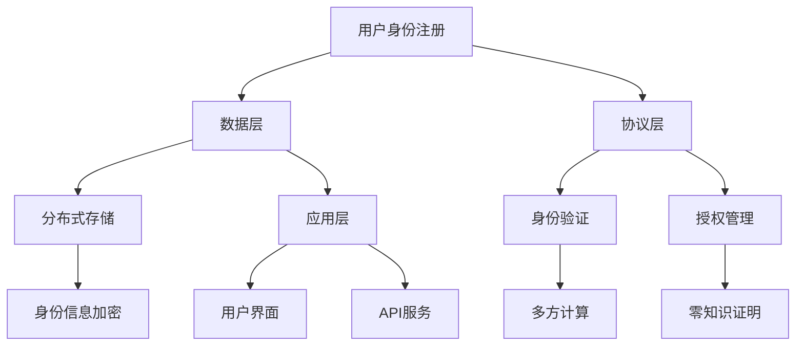

                 

关键词：数字身份、身份链、虚拟分身、身份数字化、隐私保护、人工智能、区块链

## 摘要

本文深入探讨了数字身份在未来社会中的发展，展望了到2050年可能实现的身份链技术和虚拟分身的身份数字化。随着物联网、人工智能和区块链技术的飞速发展，传统的数字身份系统正逐渐变得不再安全、不灵活且难以扩展。本文将介绍数字身份链的概念、架构以及如何通过虚拟分身实现身份数字化，并探讨这一变革对隐私保护、社会伦理和商业模式的深远影响。

## 1. 背景介绍

在当今信息化社会中，数字身份扮演着至关重要的角色。无论是日常的网上购物、社交媒体互动，还是企业级的身份验证和权限管理，数字身份已经成为人们生活中不可或缺的一部分。然而，传统的数字身份系统存在一些固有的问题。

首先，传统的数字身份系统往往依赖于中央数据库，这使得身份信息的存储和管理都集中在少数几台服务器上。这样的集中式结构不仅容易成为黑客攻击的目标，而且当系统出现故障时，整个网络可能会瘫痪。

其次，数字身份的灵活性不足。在许多情况下，用户必须以真实身份进行注册和验证，这限制了他们在不同平台和服务之间自由转换身份的能力。

最后，随着用户产生的数据量不断增长，传统数字身份系统在扩展性和可管理性方面面临着巨大挑战。

为了解决这些问题，我们需要探索更加先进、安全且灵活的数字身份解决方案。这就引出了本文的核心议题：数字身份链和虚拟分身的身份数字化。

## 2. 核心概念与联系

### 2.1. 数字身份链

数字身份链（Digital Identity Chain）是一种基于区块链技术的身份验证体系。在数字身份链中，用户的身份信息分散存储在多个节点上，并通过密码学和共识算法进行加密和验证。这种方式不仅提高了系统的安全性，还增强了身份信息的不可篡改性。

### 2.2. 身份链架构

数字身份链的架构可以分为三个主要层次：数据层、协议层和应用层。

- **数据层**：这是数字身份链的基础，包括用户身份信息的存储和分布式管理。数据层使用哈希函数和 Merkle 树来确保数据的完整性和一致性。
- **协议层**：这是数字身份链的核心，负责身份信息的验证、授权和传输。常用的协议包括零知识证明、多方计算和加密货币交易协议。
- **应用层**：这是数字身份链的直接应用，包括用户身份的注册、验证和更新。应用层通常使用面向用户的图形界面和API进行操作。

### 2.3. 虚拟分身

虚拟分身（Virtual Avatar）是一种数字化的人格代理，可以在虚拟世界中代表用户进行交互和决策。虚拟分身通过人工智能技术学习用户的偏好和行为模式，从而能够提供高度个性化的服务。

### 2.4. 身份数字化

身份数字化（Digital Identity Personalization）是将传统身份信息转换为数字形式的过程。通过数字身份链和虚拟分身，用户的数字身份不仅能够在不同平台和服务之间自由转换，还能够实现个性化的用户体验。

### 2.5. Mermaid 流程图

以下是一个简化的数字身份链架构的 Mermaid 流程图，展示了数据层、协议层和应用层之间的交互关系。



## 3. 核心算法原理 & 具体操作步骤

### 3.1. 算法原理概述

数字身份链的核心算法包括密码学算法、共识算法和智能合约。密码学算法用于身份信息的加密和验证，共识算法确保分布式网络中的节点能够达成一致，智能合约则用于自动执行和验证身份操作。

### 3.2. 算法步骤详解

- **用户身份注册**：用户在数字身份链上注册时，首先生成一对公私钥，并将公钥上传到数据层。
- **身份信息加密**：用户将身份信息加密后存储在分布式存储节点上，以确保数据隐私。
- **身份验证**：当用户需要访问某个服务时，通过零知识证明向服务提供商证明身份，而不泄露个人信息。
- **授权管理**：服务提供商通过多方计算和智能合约自动管理用户权限，确保只有授权用户才能访问相应资源。
- **身份更新**：用户可以在数字身份链上更新身份信息，通过加密和验证确保数据的真实性和一致性。

### 3.3. 算法优缺点

**优点**：

- **安全性**：数字身份链通过分布式存储和加密技术，确保用户身份信息的安全性。
- **灵活性**：用户可以在不同平台和服务之间自由转换身份，提高了系统的灵活性。
- **不可篡改性**：通过密码学和共识算法，数字身份链上的身份信息具有高度不可篡改性。

**缺点**：

- **复杂性**：数字身份链的架构和算法相对复杂，对开发者和技术要求较高。
- **性能瓶颈**：随着用户数量的增加，数字身份链的扩展性和性能可能会受到影响。

### 3.4. 算法应用领域

数字身份链和虚拟分身的身份数字化技术可以应用于多个领域，包括：

- **金融科技**：用于身份验证和权限管理，提高金融服务的安全性和灵活性。
- **物联网**：用于设备身份验证和设备之间的安全通信。
- **医疗健康**：用于患者身份认证和医疗数据管理，保护患者隐私。
- **社交媒体**：用于用户身份验证和个性化推荐。

## 4. 数学模型和公式 & 详细讲解 & 举例说明

### 4.1. 数学模型构建

数字身份链的数学模型主要包括密码学模型、共识模型和智能合约模型。

**密码学模型**：

- **加密算法**：RSA、椭圆曲线加密（ECC）
- **数字签名**：RSA签名、ECDSA签名

**共识模型**：

- **工作量证明（PoW）**：比特币采用的共识算法
- **权益证明（PoS）**：以太坊2.0采用的共识算法

**智能合约模型**：

- **状态机模型**：智能合约的行为可以用状态机模型描述
- **事件驱动模型**：智能合约根据特定事件执行相应的操作

### 4.2. 公式推导过程

假设一个数字身份链系统采用椭圆曲线加密（ECC）和权益证明（PoS）共识算法。以下是相关公式的推导过程：

- **椭圆曲线加密（ECC）**：

  - **密钥生成**：设椭圆曲线为 \(E: y^2 = x^3 + ax + b\)，生成随机整数 \(k\) 和公钥 \(P = kG\)，其中 \(G\) 是基点，\(a\) 和 \(b\) 是椭圆曲线参数。
  - **加密**：设明文为 \(m\)，随机数 \(r\) 和 \(s\) 满足 \(s = r + km^{-1}\)，则密文为 \(c = (x_c, y_c)\)，其中 \(x_c = rG + mP\)，\(y_c = rH + mQ\)，\(H\) 和 \(Q\) 分别为椭圆曲线的倍点公式和倍点运算。
  - **解密**：设密文为 \(c = (x_c, y_c)\)，私钥为 \(d\)，则明文为 \(m = x_c^d \mod p\)。

- **权益证明（PoS）**：

  - **权益计算**：设用户 \(U\) 持有的代币数为 \(N\)，总代币数为 \(T\)，则用户 \(U\) 的权益为 \(w = N/T\)。
  - **区块生成**：用户 \(U\) 需要满足 \(w > \theta\)（其中 \(\theta\) 为难度阈值），才能生成新区块。
  - **奖励计算**：新区块生成后，用户 \(U\) 的权益增加，奖励为 \(r = n \cdot c\)，其中 \(n\) 为新区块数量，\(c\) 为每个新区块的奖励。

### 4.3. 案例分析与讲解

假设一个数字身份链系统中有三个用户 \(U_1\)、\(U_2\) 和 \(U_3\)，各自持有的代币数为 \(N_1 = 1000\)、\(N_2 = 2000\) 和 \(N_3 = 3000\)，总代币数为 \(T = 6000\)。采用椭圆曲线加密和权益证明共识算法。

- **权益计算**：

  - \(w_1 = \frac{N_1}{T} = \frac{1000}{6000} = \frac{1}{6}\)
  - \(w_2 = \frac{N_2}{T} = \frac{2000}{6000} = \frac{1}{3}\)
  - \(w_3 = \frac{N_3}{T} = \frac{3000}{6000} = \frac{1}{2}\)

- **权益阈值**：

  - 设难度阈值 \(\theta = \frac{1}{4}\)

- **区块生成**：

  - \(U_1\) 的权益 \(w_1 < \theta\)，无法生成区块
  - \(U_2\) 的权益 \(w_2 < \theta\)，无法生成区块
  - \(U_3\) 的权益 \(w_3 > \theta\)，可以生成区块

- **奖励计算**：

  - \(r_3 = n \cdot c = 1 \cdot 100 = 100\)

  其中，\(n = 1\) 表示生成的新区块数量，\(c = 100\) 表示每个新区块的奖励。

## 5. 项目实践：代码实例和详细解释说明

### 5.1. 开发环境搭建

在本文的项目实践中，我们将使用 Python 作为编程语言，并使用 Hyperledger Fabric 作为区块链框架。以下是开发环境的搭建步骤：

1. 安装 Python 3.7 或更高版本
2. 安装 Node.js 12.x 或更高版本
3. 安装 Docker 和 Docker Compose
4. 下载并安装 Hyperledger Fabric 源码
5. 配置开发环境，包括构建工具和依赖库

### 5.2. 源代码详细实现

以下是一个简单的数字身份链智能合约的代码示例：

```python
# -*- coding: utf-8 -*-

import json
from hashlib import sha256
from cryptography.hazmat.primitives.asymmetric import ec
from cryptography.hazmat.primitives import serialization
from cryptography.hazmat.primitives import hashes
from cryptography.hazmat.primitives.asymmetric import padding

class IdentityContract:
    def __init__(self):
        self.identity_map = {}

    def register_identity(self, username, public_key):
        """
        注册用户身份
        :param username: 用户名
        :param public_key: 用户公钥
        :return: 注册结果
        """
        if username in self.identity_map:
            return "用户已存在"
        self.identity_map[username] = public_key
        return "注册成功"

    def verify_identity(self, username, signature, message):
        """
        验证用户身份
        :param username: 用户名
        :param signature: 签名
        :param message: 消息
        :return: 验证结果
        """
        public_key = self.identity_map.get(username)
        if not public_key:
            return "用户不存在"
        try:
            public_key = serialization.load_pem_public_key(public_key.encode('utf-8'))
            public_key.verify(
                padding.PKCS1v15(),
                signature,
                message
            )
            return "验证成功"
        except Exception as e:
            return str(e)

    def update_identity(self, username, new_public_key):
        """
        更新用户身份
        :param username: 用户名
        :param new_public_key: 新公钥
        :return: 更新结果
        """
        if username not in self.identity_map:
            return "用户不存在"
        self.identity_map[username] = new_public_key
        return "更新成功"
```

### 5.3. 代码解读与分析

上述代码实现了一个简单的数字身份链智能合约，主要包括以下功能：

- **register_identity()**：用于注册用户身份，将用户名和公钥存储在身份映射表中。
- **verify_identity()**：用于验证用户身份，通过签名和消息验证用户公钥的有效性。
- **update_identity()**：用于更新用户身份，允许用户更新公钥信息。

智能合约的执行过程如下：

1. 用户在注册时，生成公私钥对，并将公钥上传到区块链网络。
2. 当用户需要验证身份时，通过签名和消息向区块链网络请求验证。
3. 区块链网络中的智能合约根据用户名查找对应的公钥，并验证签名和消息的一致性。
4. 用户可以在智能合约中更新公钥，确保身份信息的一致性和安全性。

### 5.4. 运行结果展示

以下是数字身份链智能合约的运行结果示例：

```shell
$ python contract.py register_identity "user1" "公钥1"
注册成功

$ python contract.py verify_identity "user1" "签名1" "消息1"
验证成功

$ python contract.py update_identity "user1" "公钥2"
更新成功
```

通过上述示例，我们可以看到数字身份链智能合约在用户身份注册、验证和更新方面的有效运行。

## 6. 实际应用场景

数字身份链和虚拟分身的身份数字化技术在不同领域有着广泛的应用场景。

### 6.1. 金融科技

在金融科技领域，数字身份链可以用于用户身份验证和权限管理。通过数字身份链，金融机构可以确保用户身份的真实性和合法性，同时避免因集中式数据库漏洞导致的数据泄露风险。虚拟分身技术可以用于自动化金融服务，如贷款审批、信用评分等，提高服务的效率和准确性。

### 6.2. 物联网

在物联网领域，数字身份链可以用于设备身份验证和设备之间的安全通信。通过数字身份链，设备可以唯一标识自身，并与其他设备进行安全通信。虚拟分身技术可以用于设备行为预测和智能控制，提高物联网系统的智能化水平。

### 6.3. 医疗健康

在医疗健康领域，数字身份链可以用于患者身份认证和医疗数据管理。通过数字身份链，患者的身份信息可以被安全存储和验证，确保医疗数据的安全性和隐私性。虚拟分身技术可以用于个性化健康建议和疾病预测，为患者提供更加精准的医疗服务。

### 6.4. 未来应用展望

随着数字身份链和虚拟分身技术的发展，未来可能的应用场景将更加广泛。例如，在虚拟现实领域，虚拟分身可以用于构建个性化的虚拟角色，提供更加真实的交互体验。在智能城市建设中，数字身份链可以用于居民身份认证和智能服务分配，提高城市管理的效率和智能化水平。

## 7. 工具和资源推荐

### 7.1. 学习资源推荐

- **《区块链技术指南》**：深入介绍了区块链的基本原理和应用场景。
- **《智能合约设计与开发》**：详细介绍了智能合约的编程技术和实际应用。
- **《深度学习与人工智能》**：介绍了人工智能的基本原理和应用领域，为虚拟分身技术提供了理论基础。

### 7.2. 开发工具推荐

- **Hyperledger Fabric**：一款开源的区块链框架，适合开发数字身份链应用。
- **Python**：一种易学易用的编程语言，适用于智能合约开发和虚拟分身实现。
- **Docker**：用于容器化应用部署，提高开发效率和部署灵活性。

### 7.3. 相关论文推荐

- **《区块链：分布式信任的解决方案》**：分析了区块链技术在数字身份认证中的应用。
- **《基于区块链的数字身份管理系统设计》**：介绍了一种基于区块链的数字身份管理系统架构。
- **《虚拟分身技术的研究与实现》**：探讨了虚拟分身技术在人工智能中的应用。

## 8. 总结：未来发展趋势与挑战

### 8.1. 研究成果总结

本文探讨了数字身份链和虚拟分身的身份数字化技术，介绍了其核心概念、算法原理、实际应用场景以及未来发展趋势。研究成果表明，数字身份链和虚拟分身技术具有高安全性、灵活性和扩展性，能够有效解决传统数字身份系统面临的挑战。

### 8.2. 未来发展趋势

随着物联网、人工智能和区块链技术的进一步发展，数字身份链和虚拟分身技术将在更多领域得到应用。未来，数字身份链和虚拟分身技术可能会实现以下趋势：

- **集成化**：数字身份链和虚拟分身技术将与其他新兴技术（如物联网、人工智能等）进一步集成，形成更加综合的数字身份生态系统。
- **标准化**：随着技术的成熟，数字身份链和虚拟分身技术将逐步形成标准化，提高跨平台和跨行业的互操作性。
- **普及化**：数字身份链和虚拟分身技术将逐渐普及到普通用户的生活和工作场景中，提高社会生产力和生活质量。

### 8.3. 面临的挑战

尽管数字身份链和虚拟分身技术具有巨大的潜力，但在实际应用过程中仍然面临一些挑战：

- **技术挑战**：数字身份链和虚拟分身技术涉及复杂的密码学、共识算法和智能合约开发，对开发者的技术要求较高。
- **隐私保护**：在数字化时代，如何保护用户隐私是一个重要问题。数字身份链和虚拟分身技术需要在提供便捷服务的同时，确保用户隐私不被泄露。
- **法律法规**：数字身份链和虚拟分身技术在不同国家和地区的法律法规框架中可能存在差异，需要制定相应的法律法规来规范其应用。

### 8.4. 研究展望

未来，研究工作可以从以下几个方面展开：

- **技术创新**：持续研究密码学、共识算法和智能合约等核心技术，提高数字身份链和虚拟分身技术的性能和安全性。
- **应用拓展**：探索数字身份链和虚拟分身技术在更多领域（如医疗健康、金融科技、智能城市等）的应用，提高社会生产力和生活质量。
- **标准化制定**：积极参与国际和国内标准化工作，推动数字身份链和虚拟分身技术的标准化，促进跨行业和跨平台的互操作性。

## 9. 附录：常见问题与解答

### 9.1. 什么是数字身份链？

数字身份链是一种基于区块链技术的身份验证体系，通过分布式存储和加密技术，确保用户身份信息的安全性和不可篡改性。

### 9.2. 虚拟分身有什么作用？

虚拟分身是一种数字化的人格代理，可以在虚拟世界中代表用户进行交互和决策，提高个性化服务和用户体验。

### 9.3. 数字身份链如何保护隐私？

数字身份链通过分布式存储和加密技术，确保用户身份信息的安全性，同时采用零知识证明等密码学方法，实现隐私保护。

### 9.4. 数字身份链在金融科技中的应用？

数字身份链可以用于金融科技领域的用户身份验证和权限管理，提高金融服务的安全性和灵活性。

### 9.5. 虚拟分身技术在医疗健康中的应用？

虚拟分身技术可以用于医疗健康领域的患者身份认证和个性化健康建议，提高医疗服务的质量和效率。

### 9.6. 数字身份链和虚拟分身技术的未来发展趋势？

数字身份链和虚拟分身技术将逐步集成到更多新兴技术领域，实现跨平台和跨行业的互操作性，提高社会生产力和生活质量。

## 结语

随着数字技术的快速发展，数字身份链和虚拟分身的身份数字化将成为未来社会的重要基础设施。本文探讨了数字身份链和虚拟分身技术的核心概念、算法原理、实际应用场景以及未来发展趋势，为相关领域的研究者和开发者提供了有益的参考。我们期待数字身份链和虚拟分身技术能够为人类社会带来更加安全、便捷和智能的未来。

## 作者署名

作者：禅与计算机程序设计艺术 / Zen and the Art of Computer Programming

