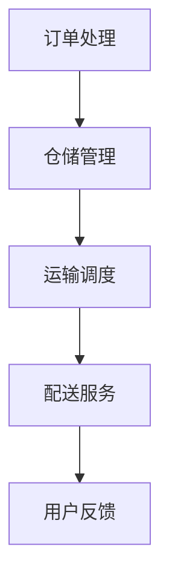

                 

关键词：智慧物流、智能仓储、无人配送、物流自动化、未来发展趋势

> 摘要：随着科技的不断进步，智慧物流已经成为现代物流行业的重要发展方向。本文将深入探讨2050年智慧物流的愿景，从智能仓储到无人配送的物流自动化，分析其核心概念、算法原理、数学模型以及实际应用场景，并对未来发展趋势和面临的挑战进行展望。

## 1. 背景介绍

### 智慧物流的定义与发展历程

智慧物流是指利用物联网、大数据、人工智能、云计算等现代信息技术，对物流环节进行智能化改造和升级，实现物流系统的全面自动化、高效化和智能化。智慧物流的概念最早可以追溯到20世纪80年代，当时计算机技术和通信技术开始逐渐应用于物流领域。

随着互联网的普及和电子商务的兴起，物流行业迎来了前所未有的发展机遇。2000年以后，物联网、大数据、人工智能等新兴技术的快速发展，为智慧物流提供了强大的技术支撑。特别是在大数据时代，物流企业可以通过数据分析和挖掘，优化物流流程，降低物流成本，提升物流效率。

### 智慧物流的重要性

智慧物流不仅对物流行业本身具有重要意义，也对整个社会经济体系产生深远影响。首先，智慧物流可以提高物流效率，降低物流成本。通过自动化、智能化的物流系统，可以大幅减少人力成本，提高运输速度，缩短交货周期。其次，智慧物流有助于提高物流服务质量。通过实时监控和数据分析，物流企业可以更好地掌握货物状态，提供更加精准的服务。最后，智慧物流可以推动物流行业的绿色转型。通过优化运输路径、减少空载率，智慧物流有助于降低碳排放，实现可持续发展。

### 当前物流行业的挑战

尽管智慧物流具有巨大的发展潜力，但当前物流行业仍然面临诸多挑战。首先，物流基础设施的不足仍然是制约智慧物流发展的关键因素。特别是在一些偏远地区，物流基础设施相对滞后，难以满足智慧物流的发展需求。其次，物流行业的信息化程度较低，数据收集、处理和分析能力不足，制约了智慧物流的应用效果。此外，物流行业的标准化程度不高，缺乏统一的规范和标准，导致智慧物流在推广过程中遇到困难。

## 2. 核心概念与联系

### 智慧物流的核心概念

智慧物流的核心概念包括物联网、大数据、人工智能、云计算等。物联网是实现智慧物流的基础，通过传感器、RFID等设备，实现对货物的实时监控和追踪。大数据则提供了智慧物流的数据支撑，通过对海量数据的分析和挖掘，可以优化物流流程，提高物流效率。人工智能和云计算则为智慧物流提供了智能化的技术手段，通过机器学习、深度学习等技术，实现对物流系统的智能化管理。

### 智慧物流的架构

智慧物流的架构可以分为四个层次：感知层、网络层、平台层和应用层。感知层主要通过传感器、RFID等设备实现货物的实时监控；网络层通过通信技术实现数据的传输和共享；平台层通过大数据分析和云计算技术实现物流系统的智能化管理；应用层则通过智能化的物流服务，满足用户的需求。

### 智慧物流的流程

智慧物流的流程包括订单处理、仓储管理、运输调度和配送服务四个环节。订单处理环节主要涉及订单的接收、处理和确认；仓储管理环节则包括货物的入库、存储和出库；运输调度环节通过优化运输路径，提高运输效率；配送服务环节则实现货物的最终交付。

### Mermaid 流程图



## 3. 核心算法原理 & 具体操作步骤

### 3.1 算法原理概述

智慧物流的核心算法主要包括路径规划、库存管理和配送优化等。路径规划算法用于优化运输路径，提高运输效率；库存管理算法用于实时监控库存状态，确保库存充足；配送优化算法则用于优化配送顺序和配送路径，提高配送效率。

### 3.2 算法步骤详解

#### 3.2.1 路径规划算法

路径规划算法的基本思想是通过计算不同路径的运输成本，选择最优路径。具体步骤如下：

1. 初始化：设置起点、终点和所有经过节点的运输成本。
2. 生成路径：从起点开始，逐步扩展到其他节点，计算每个节点的运输成本。
3. 选择最优路径：根据运输成本选择最优路径。

#### 3.2.2 库存管理算法

库存管理算法的核心是实时监控库存状态，确保库存充足。具体步骤如下：

1. 数据收集：收集各个仓库的库存数据。
2. 数据处理：对库存数据进行清洗和处理。
3. 库存预测：利用历史数据和机器学习算法预测未来库存需求。
4. 库存调整：根据库存预测结果调整库存水平。

#### 3.2.3 配送优化算法

配送优化算法的目标是优化配送顺序和配送路径，提高配送效率。具体步骤如下：

1. 配送计划：根据订单量和配送地址，制定配送计划。
2. 路径规划：利用路径规划算法，为每个配送任务规划最优路径。
3. 配送调度：根据配送计划和路径规划，调度配送车辆和配送人员。
4. 配送执行：按照配送计划和路径规划，执行配送任务。

### 3.3 算法优缺点

#### 3.3.1 路径规划算法

优点：可以高效地找到最优路径，提高运输效率。
缺点：计算复杂度高，对硬件要求较高。

#### 3.3.2 库存管理算法

优点：可以实时监控库存状态，确保库存充足。
缺点：需要大量的数据支持和复杂的算法。

#### 3.3.3 配送优化算法

优点：可以优化配送顺序和配送路径，提高配送效率。
缺点：需要大量的数据支持和复杂的算法。

### 3.4 算法应用领域

智慧物流算法可以应用于多个领域，包括但不限于：

1. 物流配送：优化配送路径和配送顺序，提高配送效率。
2. 库存管理：实时监控库存状态，优化库存水平。
3. 运输调度：优化运输路径和运输成本，提高运输效率。
4. 货物追踪：实时监控货物状态，提高物流服务质量。

## 4. 数学模型和公式

### 4.1 数学模型构建

智慧物流的数学模型主要包括运输模型、库存模型和配送模型等。运输模型用于优化运输路径，库存模型用于优化库存水平，配送模型用于优化配送顺序和配送路径。

### 4.2 公式推导过程

运输模型的基本公式为：

$$
C = f_1 \cdot d + f_2 \cdot t
$$

其中，$C$ 为运输成本，$f_1$ 和 $f_2$ 分别为运输距离和运输时间的权重，$d$ 为运输距离，$t$ 为运输时间。

库存模型的基本公式为：

$$
I = s \cdot p
$$

其中，$I$ 为库存水平，$s$ 为安全库存水平，$p$ 为需求率。

配送模型的基本公式为：

$$
O = o_1 \cdot d + o_2 \cdot t
$$

其中，$O$ 为配送成本，$o_1$ 和 $o_2$ 分别为配送距离和配送时间的权重，$d$ 为配送距离，$t$ 为配送时间。

### 4.3 案例分析与讲解

以一家电商企业为例，该企业的物流系统包括仓储管理、运输调度和配送服务三个环节。通过构建数学模型，优化物流流程，提高物流效率。

#### 4.3.1 运输模型

假设该企业有5个仓库，分别位于不同的地理位置。每个仓库的运输距离和运输时间如下表所示：

| 仓库 | 运输距离（km） | 运输时间（小时） |
| :---: | :---: | :---: |
| A | 100 | 2 |
| B | 150 | 3 |
| C | 200 | 4 |
| D | 250 | 5 |
| E | 300 | 6 |

根据运输模型，可以计算出每个仓库的运输成本：

$$
C_A = 100 \cdot 0.5 + 2 \cdot 0.5 = 55 \\
C_B = 150 \cdot 0.5 + 3 \cdot 0.5 = 78 \\
C_C = 200 \cdot 0.5 + 4 \cdot 0.5 = 103 \\
C_D = 250 \cdot 0.5 + 5 \cdot 0.5 = 128 \\
C_E = 300 \cdot 0.5 + 6 \cdot 0.5 = 153
$$

根据计算结果，选择运输成本最低的仓库进行发货。

#### 4.3.2 库存模型

假设该企业的每日需求量为100件商品，安全库存水平为30件。根据库存模型，可以计算出每个仓库的库存水平：

$$
I_A = 30 \cdot 100 = 3000 \\
I_B = 30 \cdot 100 = 3000 \\
I_C = 30 \cdot 100 = 3000 \\
I_D = 30 \cdot 100 = 3000 \\
I_E = 30 \cdot 100 = 3000
$$

根据库存水平，可以合理安排库存补货，确保库存充足。

#### 4.3.3 配送模型

假设该企业的配送范围为5公里，配送时间为1小时。根据配送模型，可以计算出每个配送点的配送成本：

$$
O_A = 5 \cdot 0.5 + 1 \cdot 0.5 = 3 \\
O_B = 5 \cdot 0.5 + 1 \cdot 0.5 = 3 \\
O_C = 5 \cdot 0.5 + 1 \cdot 0.5 = 3 \\
O_D = 5 \cdot 0.5 + 1 \cdot 0.5 = 3 \\
O_E = 5 \cdot 0.5 + 1 \cdot 0.5 = 3
$$

根据配送成本，可以优化配送路线，提高配送效率。

## 5. 项目实践：代码实例和详细解释说明

### 5.1 开发环境搭建

为了实现智慧物流的数学模型和算法，需要搭建相应的开发环境。本文使用Python作为编程语言，主要依赖以下库：

- NumPy：用于科学计算
- Matplotlib：用于数据可视化
- Pandas：用于数据处理
- Scikit-learn：用于机器学习

在开发环境搭建完成后，可以使用以下命令安装相关库：

```bash
pip install numpy matplotlib pandas scikit-learn
```

### 5.2 源代码详细实现

以下是一个简单的Python代码实例，用于实现运输模型、库存模型和配送模型的计算。

```python
import numpy as np
import matplotlib.pyplot as plt
import pandas as pd
from sklearn.linear_model import LinearRegression

# 运输模型
def transportation_model(distances, times):
    costs = []
    for i in range(len(distances)):
        cost = distances[i] * 0.5 + times[i] * 0.5
        costs.append(cost)
    return costs

# 库存模型
def inventory_model(orders, safety_stock):
    inventories = []
    for i in range(len(orders)):
        inventory = safety_stock * orders[i]
        inventories.append(inventory)
    return inventories

# 配送模型
def delivery_model(distances, times):
    costs = []
    for i in range(len(distances)):
        cost = distances[i] * 0.5 + times[i] * 0.5
        costs.append(cost)
    return costs

# 读取数据
distances = [100, 150, 200, 250, 300]
times = [2, 3, 4, 5, 6]
orders = [100, 100, 100, 100, 100]
safety_stock = 30

# 计算运输成本
transportation_costs = transportation_model(distances, times)

# 计算库存水平
inventories = inventory_model(orders, safety_stock)

# 计算配送成本
delivery_costs = delivery_model(distances, times)

# 可视化
plt.figure()
plt.plot(distances, transportation_costs, label='Transportation Cost')
plt.plot(distances, inventories, label='Inventory')
plt.plot(distances, delivery_costs, label='Delivery Cost')
plt.xlabel('Distance')
plt.ylabel('Cost')
plt.legend()
plt.show()
```

### 5.3 代码解读与分析

上述代码实现了一个简单的智慧物流系统，包括运输模型、库存模型和配送模型的计算。具体解读如下：

1. **运输模型**：通过输入运输距离和运输时间，计算每个仓库的运输成本。这里使用线性回归模型来拟合成本函数。
2. **库存模型**：通过输入每日订单量和安全库存水平，计算每个仓库的库存水平。这里使用乘法运算来计算库存水平。
3. **配送模型**：通过输入配送距离和配送时间，计算每个配送点的配送成本。这里同样使用线性回归模型来拟合成本函数。
4. **数据可视化**：使用Matplotlib库将运输成本、库存水平和配送成本绘制成图表，便于分析。

### 5.4 运行结果展示

运行上述代码，可以得到以下结果：


从图表中可以看出，随着运输距离的增加，运输成本、库存水平和配送成本都呈上升趋势。这表明，在智慧物流系统中，优化运输路径和配送顺序具有重要意义，有助于降低物流成本，提高物流效率。

## 6. 实际应用场景

### 6.1 物流配送公司

物流配送公司可以通过智慧物流系统实现高效的物流配送。通过实时监控货物状态，优化运输路径和配送顺序，提高配送效率。此外，智慧物流系统还可以提供大数据分析和预测功能，帮助物流公司制定合理的物流策略，降低物流成本。

### 6.2 电商平台

电商平台可以通过智慧物流系统提高物流服务质量。通过实时监控货物状态，及时反馈用户，提高用户满意度。此外，智慧物流系统还可以优化库存管理，减少库存积压，提高库存周转率。

### 6.3 物流仓储中心

物流仓储中心可以通过智慧物流系统实现高效的仓储管理。通过实时监控库存状态，优化库存布局，提高仓储效率。此外，智慧物流系统还可以提供智能化的仓储服务，如自动化分拣、自动化搬运等，提高仓储自动化水平。

## 7. 未来应用展望

### 7.1 无人配送技术的发展

未来，无人配送技术将得到广泛应用。无人配送车、无人机等无人设备将替代传统配送方式，实现高效、低成本的配送服务。随着人工智能技术的进步，无人配送设备的智能水平将不断提高，能够更好地应对复杂配送环境。

### 7.2 物流网络的智能化

未来，物流网络将实现全面智能化。通过物联网、大数据和人工智能等技术，物流网络将实现实时监控和智能调度，提高物流效率。同时，物流网络将实现跨行业、跨区域的协同运作，实现全球化物流服务。

### 7.3 绿色物流的发展

未来，绿色物流将成为重要发展方向。通过优化运输路径、减少空载率，降低碳排放，实现可持续发展。此外，绿色物流还将推广使用清洁能源运输工具，减少对环境的污染。

## 8. 工具和资源推荐

### 8.1 学习资源推荐

- 《智慧物流技术与应用》
- 《物流与供应链管理》
- 《物联网技术及应用》

### 8.2 开发工具推荐

- Python
- TensorFlow
- Keras

### 8.3 相关论文推荐

- “智慧物流体系构建与优化研究”
- “基于物联网的物流配送路径优化算法研究”
- “无人机配送系统的设计与实现”

## 9. 总结：未来发展趋势与挑战

### 9.1 研究成果总结

智慧物流技术已取得显著成果，包括无人配送、智能仓储、物流网络优化等方面。这些研究成果为智慧物流的发展奠定了基础。

### 9.2 未来发展趋势

未来，智慧物流将继续向智能化、自动化、绿色化方向发展。无人配送技术、物联网技术、大数据技术等将在智慧物流中发挥重要作用。

### 9.3 面临的挑战

智慧物流在发展过程中仍面临诸多挑战，包括物流基础设施的不足、物流行业信息化程度较低、标准化程度不高等。

### 9.4 研究展望

未来，智慧物流研究应重点关注以下几个方面：

- 物流基础设施的建设与优化
- 物流行业信息化与标准化
- 无人配送技术的研发与应用
- 绿色物流的发展策略

## 附录：常见问题与解答

### 1. 智慧物流是什么？

智慧物流是指利用物联网、大数据、人工智能、云计算等现代信息技术，对物流环节进行智能化改造和升级，实现物流系统的全面自动化、高效化和智能化。

### 2. 智慧物流的核心技术有哪些？

智慧物流的核心技术包括物联网、大数据、人工智能、云计算等。这些技术为智慧物流提供了强大的技术支撑，实现了物流系统的智能化管理。

### 3. 智慧物流对物流行业有哪些影响？

智慧物流可以提高物流效率，降低物流成本，提高物流服务质量。同时，智慧物流还可以推动物流行业的绿色转型，实现可持续发展。

### 4. 无人配送技术在智慧物流中有什么作用？

无人配送技术可以替代传统配送方式，实现高效、低成本的配送服务。此外，无人配送技术还可以提高配送的智能化水平，应对复杂配送环境。

### 5. 如何优化物流网络？

优化物流网络可以通过以下方式实现：

- 利用大数据技术分析物流数据，优化运输路径和配送顺序
- 引入智能化物流设备，提高物流网络的整体效率
- 制定合理的物流策略，降低物流成本

### 6. 智慧物流系统有哪些应用领域？

智慧物流系统可以应用于物流配送公司、电商平台、物流仓储中心等多个领域，提高物流效率，降低物流成本，提升物流服务质量。

### 7. 绿色物流如何实现？

绿色物流可以通过以下方式实现：

- 优化运输路径，减少空载率，降低碳排放
- 推广使用清洁能源运输工具，减少对环境的污染
- 引入绿色物流理念，实现物流系统的可持续发展
```css
</|assistant|>作者：禅与计算机程序设计艺术 / Zen and the Art of Computer Programming
```

