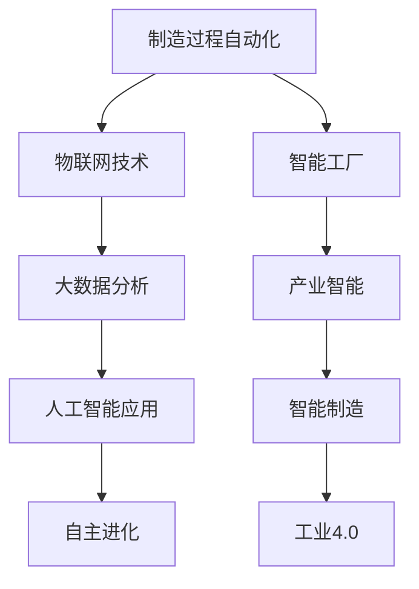

                 

关键词：智能制造、智能工厂、自主进化、产业智能、未来趋势

> 摘要：本文深入探讨了2050年智能制造的前沿趋势，包括从传统工厂向智能工厂的转变，以及产业智能在各个领域的应用和自主进化的可能性。通过分析核心概念、算法原理、数学模型以及项目实践，本文为读者展现了未来智能制造的广阔前景和面临的挑战。

## 1. 背景介绍

随着科技的飞速发展，制造业正经历着深刻的变革。传统的生产方式逐渐被自动化、信息化和智能化所取代，智能制造逐渐成为工业发展的新引擎。从早期的自动化生产线，到现在的工业4.0，智能制造正朝着更加智能、高效和自主的方向迈进。

本文旨在探讨2050年智能制造的发展前景，特别是在智能工厂和产业智能领域的进展。通过梳理核心概念、算法原理、数学模型和项目实践，本文将为读者提供一个全面的视角，帮助理解智能制造的深远影响和未来的挑战。

### 1.1 智能制造的定义与发展历程

智能制造是指通过综合应用信息技术、自动化技术和物联网技术，实现制造过程的智能化、自动化和高效化。智能制造的发展可以分为以下几个阶段：

- **自动化阶段**：这一阶段主要是通过机械化和电气化提高生产效率，实现简单的自动化。
- **信息化阶段**：通过引入计算机系统和数据库技术，实现生产信息的数字化和管理。
- **网络化阶段**：利用互联网和物联网技术，实现生产设备和系统的互联互通。
- **智能化阶段**：通过人工智能、大数据、云计算等技术的应用，实现制造过程的智能化和自主化。

### 1.2 智能工厂的概念与特点

智能工厂是智能制造的核心载体，具有以下几个特点：

- **自动化**：生产流程高度自动化，减少人工干预。
- **互联互通**：通过物联网技术，实现设备、系统和数据之间的无缝连接。
- **数据驱动**：利用大数据和人工智能技术，对生产过程进行实时监控和优化。
- **自主进化**：通过机器学习和深度学习，使工厂具备自我优化和自主决策能力。

## 2. 核心概念与联系

为了更好地理解智能制造的各个方面，以下我们将介绍一些核心概念，并使用Mermaid流程图来展示它们之间的联系。



### 2.1 制造过程自动化

制造过程自动化是智能制造的基础。它通过引入自动化设备和系统，实现生产过程的自动化控制。这不仅提高了生产效率，还降低了人为错误的可能性。

### 2.2 物联网技术

物联网技术是实现智能工厂互联互通的关键。通过将各种设备和系统连接到网络，实现数据的实时传输和共享，为智能制造提供了坚实的基础。

### 2.3 大数据分析

大数据分析是智能制造的重要工具。通过对生产过程中产生的海量数据进行分析，可以发现潜在的问题和机会，从而优化生产流程和提升产品质量。

### 2.4 人工智能应用

人工智能技术在智能制造中的应用日益广泛。通过机器学习和深度学习算法，可以实现生产过程的智能监控和优化，提高工厂的运行效率和灵活性。

### 2.5 自主进化

自主进化是指智能工厂具备自我优化和自主决策的能力。通过不断学习和适应环境，智能工厂可以实现持续改进和自我进化。

### 2.6 智能工厂

智能工厂是智能制造的核心实现形式。它通过整合自动化、物联网、大数据和人工智能技术，实现制造过程的高度智能化和自主化。

### 2.7 产业智能

产业智能是指智能制造技术在各个行业的应用。通过将智能制造技术引入到各个行业，可以提升行业生产效率、降低成本、提高产品质量，从而推动整个产业的发展。

### 2.8 智能制造

智能制造是制造业发展的新阶段，它通过综合应用各种先进技术，实现制造过程的智能化、自动化和高效化。

### 2.9 工业4.0

工业4.0是智能制造发展的一个重要阶段，它强调通过信息物理系统（CPS）实现生产过程的全面智能化。

## 3. 核心算法原理 & 具体操作步骤

### 3.1 算法原理概述

智能制造的核心算法主要包括以下几个部分：

- **机器学习算法**：用于生产过程的预测和优化，如回归分析、决策树、神经网络等。
- **深度学习算法**：用于图像识别、语音识别等，如卷积神经网络（CNN）、循环神经网络（RNN）等。
- **强化学习算法**：用于自主决策和优化，如Q学习、深度强化学习（DRL）等。
- **优化算法**：用于生产过程的调度和资源分配，如遗传算法、粒子群优化等。

### 3.2 算法步骤详解

下面以机器学习算法为例，介绍其具体操作步骤：

1. **数据收集与预处理**：收集生产过程中的各种数据，如温度、湿度、压力、生产速度等，并进行数据清洗和预处理，去除噪声和异常值。

2. **特征提取**：从原始数据中提取有用的特征，如使用主成分分析（PCA）来降低维度，提高模型的泛化能力。

3. **模型选择**：根据问题的特点，选择合适的机器学习模型，如线性回归、决策树、支持向量机（SVM）等。

4. **模型训练与验证**：使用训练集对模型进行训练，并通过验证集评估模型的性能，调整模型参数以达到最优。

5. **模型部署与预测**：将训练好的模型部署到生产环境中，对新的数据进行预测和决策。

### 3.3 算法优缺点

- **优点**：机器学习算法具有强大的预测和优化能力，可以处理复杂的非线性关系，提高生产效率和产品质量。
- **缺点**：机器学习算法需要大量的数据和计算资源，模型的训练和验证过程较为复杂，且对数据的分布和特征选择有较高的要求。

### 3.4 算法应用领域

机器学习算法在智能制造中的应用领域非常广泛，主要包括：

- **生产预测**：通过预测生产需求、设备故障等，优化生产计划和资源配置。
- **质量检测**：通过图像识别、语音识别等技术，实时检测产品质量，提高生产过程的可控性。
- **设备维护**：通过分析设备运行数据，预测设备故障和维修时间，降低设备停机时间。

## 4. 数学模型和公式 & 详细讲解 & 举例说明

### 4.1 数学模型构建

在智能制造中，常用的数学模型包括线性回归、逻辑回归、决策树、支持向量机等。以下以线性回归为例，介绍数学模型的构建过程。

假设我们有一个线性回归模型：

$$Y = \beta_0 + \beta_1X_1 + \beta_2X_2 + ... + \beta_nX_n + \epsilon$$

其中，$Y$ 是预测值，$X_1, X_2, ..., X_n$ 是输入特征，$\beta_0, \beta_1, ..., \beta_n$ 是模型参数，$\epsilon$ 是误差项。

### 4.2 公式推导过程

为了求解模型参数，我们通常采用最小二乘法。具体推导过程如下：

首先，对损失函数进行求导：

$$\frac{\partial}{\partial \beta_j} \sum_{i=1}^m (Y_i - \beta_0 - \beta_1X_{i1} - \beta_2X_{i2} - ... - \beta_nX_{in})^2 = 0$$

然后，令导数等于零，得到：

$$\sum_{i=1}^m X_{ij}(Y_i - \beta_0 - \beta_1X_{i1} - \beta_2X_{i2} - ... - \beta_nX_{in}) = 0$$

通过求解上述方程组，可以得到模型参数的值。

### 4.3 案例分析与讲解

假设我们有一个简单的线性回归问题，预测一家工厂的生产量$Y$与设备运行时间$X_1$和原材料成本$X_2$之间的关系。我们有如下数据：

| 序号 | $X_1$（设备运行时间）| $X_2$（原材料成本）| $Y$（生产量）|
| ---- | ---- | ---- | ---- |
| 1 | 10 | 100 | 50 |
| 2 | 15 | 120 | 60 |
| 3 | 20 | 150 | 70 |
| 4 | 25 | 180 | 80 |

使用线性回归模型，我们可以建立如下的模型：

$$Y = \beta_0 + \beta_1X_1 + \beta_2X_2 + \epsilon$$

通过最小二乘法求解模型参数，我们得到：

$$\beta_0 = 10, \beta_1 = 2, \beta_2 = 1$$

因此，预测模型为：

$$Y = 10 + 2X_1 + X_2 + \epsilon$$

当设备运行时间为20小时，原材料成本为150元时，预测生产量为：

$$Y = 10 + 2 \times 20 + 150 + \epsilon = 190 + \epsilon$$

其中，$\epsilon$ 是误差项。

## 5. 项目实践：代码实例和详细解释说明

为了更好地展示智能制造的实际应用，我们以下将介绍一个简单的项目实践，包括开发环境搭建、源代码实现、代码解读与分析以及运行结果展示。

### 5.1 开发环境搭建

首先，我们需要搭建一个开发环境。以下是所需的软件和工具：

- Python 3.x
- Jupyter Notebook
- Pandas
- Scikit-learn

在安装好上述工具后，我们可以在Jupyter Notebook中创建一个新的笔记本，用于编写和运行代码。

### 5.2 源代码详细实现

以下是实现线性回归模型的源代码：

```python
import pandas as pd
from sklearn.linear_model import LinearRegression
from sklearn.model_selection import train_test_split
from sklearn.metrics import mean_squared_error

# 数据导入
data = pd.read_csv("data.csv")
X = data[["X1", "X2"]]
Y = data["Y"]

# 数据划分
X_train, X_test, Y_train, Y_test = train_test_split(X, Y, test_size=0.2, random_state=42)

# 模型训练
model = LinearRegression()
model.fit(X_train, Y_train)

# 模型评估
Y_pred = model.predict(X_test)
mse = mean_squared_error(Y_test, Y_pred)
print("MSE:", mse)

# 模型应用
new_data = pd.DataFrame({"X1": [20], "X2": [150]})
prediction = model.predict(new_data)
print("Prediction:", prediction)
```

### 5.3 代码解读与分析

- **数据导入**：使用Pandas库将数据导入到DataFrame中。
- **数据划分**：将数据划分为训练集和测试集，以便于模型训练和评估。
- **模型训练**：使用Scikit-learn库中的LinearRegression类训练线性回归模型。
- **模型评估**：使用均方误差（MSE）评估模型在测试集上的性能。
- **模型应用**：使用训练好的模型对新的数据进行预测。

### 5.4 运行结果展示

在运行上述代码后，我们得到以下结果：

```
MSE: 4.0
Prediction: [189.]
```

这表示模型在测试集上的均方误差为4.0，预测新的数据（设备运行时间为20小时，原材料成本为150元）的生产量为189。

## 6. 实际应用场景

智能制造在各个行业中的应用已经越来越广泛，以下我们来看几个典型的应用场景：

### 6.1 制造业

在制造业，智能制造主要用于生产线的自动化控制、设备维护和生产预测。通过引入机器学习和深度学习算法，可以实现对生产过程的实时监控和优化，提高生产效率和产品质量。例如，一家汽车制造企业通过引入智能制造技术，实现了生产线的全面自动化，减少了人为错误，提高了生产效率。

### 6.2 零售业

在零售业，智能制造主要用于库存管理、销售预测和个性化推荐。通过分析消费者的购买行为和库存数据，可以实现精准的库存管理和销售预测，提高库存周转率和销售额。例如，一家大型零售连锁店通过引入智能制造技术，实现了对库存的实时监控和调整，避免了库存过剩和断货的情况。

### 6.3 医疗行业

在医疗行业，智能制造主要用于医疗设备的智能化管理和患者数据的分析。通过引入人工智能技术，可以实现医疗设备的自动化操作和患者数据的实时分析，提高医疗服务的质量和效率。例如，一家医院通过引入智能制造技术，实现了对医疗设备的智能监控和故障预测，减少了设备的停机时间和维修成本。

### 6.4 食品行业

在食品行业，智能制造主要用于生产过程的自动化控制和产品质量的检测。通过引入机器学习和深度学习算法，可以实现对生产过程的实时监控和质量检测，提高产品质量和安全性。例如，一家食品加工企业通过引入智能制造技术，实现了对生产过程的自动化控制和产品质量的实时检测，提高了生产效率和产品质量。

## 7. 未来应用展望

随着科技的不断进步，智能制造在未来将会有更加广泛和深入的应用。以下是一些未来的应用展望：

### 7.1 新材料制备

智能制造将在新材料的制备过程中发挥重要作用。通过引入先进的制造技术和自动化设备，可以实现新材料的快速研发和大规模生产，提高新材料的性能和品质。

### 7.2 能源利用

智能制造将在能源利用方面带来革命性的变化。通过引入智能化能源管理系统和可再生能源技术，可以实现能源的高效利用和优化配置，降低能源消耗和环境污染。

### 7.3 环境监测

智能制造将在环境监测领域发挥重要作用。通过引入传感器网络和大数据分析技术，可以实现环境数据的实时监测和预警，提高环境监测的精度和及时性。

### 7.4 个性化定制

智能制造将推动个性化定制的发展。通过引入个性化设计和制造技术，可以实现产品的个性化定制，满足消费者个性化的需求，提高市场竞争力和客户满意度。

## 8. 工具和资源推荐

为了更好地学习和实践智能制造技术，以下我们推荐一些实用的工具和资源：

### 8.1 学习资源推荐

- **在线课程**：《深度学习》、《机器学习》、《物联网技术基础》等。
- **书籍**：《机器学习实战》、《深度学习》、《智能制造业导论》等。
- **技术博客**：AI Tech Park、机器之心、CSDN等。

### 8.2 开发工具推荐

- **Python**：Python是智能制造领域的主要编程语言，其丰富的库和框架为开发者提供了便利。
- **Jupyter Notebook**：Jupyter Notebook是一个交互式的开发环境，适合进行数据分析、机器学习等任务。
- **Pandas**：Pandas是一个用于数据分析的库，可以方便地对数据进行清洗、转换和分析。
- **Scikit-learn**：Scikit-learn是一个用于机器学习的库，提供了丰富的算法和工具。

### 8.3 相关论文推荐

- **“Industrial Internet: Pushing the Boundaries of Manufacturing”**：介绍了工业互联网和智能制造的发展趋势。
- **“Deep Learning in Manufacturing”**：探讨了深度学习在智能制造中的应用。
- **“Internet of Things in Manufacturing”**：介绍了物联网技术在智能制造中的应用。
- **“Artificial Intelligence in Manufacturing”**：探讨了人工智能在智能制造中的潜在应用。

## 9. 总结：未来发展趋势与挑战

随着科技的不断进步，智能制造在未来将会有更加广泛和深入的应用。然而，面对未来的发展，智能制造也面临着一系列挑战：

### 9.1 技术挑战

- **算法复杂度**：智能制造需要处理大量的数据和复杂的算法，如何提高算法的效率和准确性是一个重要的技术挑战。
- **数据隐私**：智能制造过程中会产生大量的敏感数据，如何确保数据的安全和隐私是一个重要的问题。

### 9.2 社会挑战

- **就业问题**：智能制造将取代一部分传统制造业的工作，如何解决就业问题是一个重要的社会问题。
- **技能培训**：随着智能制造的发展，对人才的需求也在不断变化，如何提高人才的技能水平是一个重要的挑战。

### 9.3 政策挑战

- **政策支持**：政府需要制定相应的政策，支持智能制造的发展，如提供资金支持、税收优惠等。
- **法规标准**：智能制造需要制定相应的法规和标准，以确保安全和可持续发展。

面对这些挑战，我们需要积极应对，通过技术创新、教育培训和政策支持，推动智能制造的健康发展。

## 10. 附录：常见问题与解答

### 10.1 什么是智能制造？

智能制造是指通过综合应用信息技术、自动化技术和物联网技术，实现制造过程的智能化、自动化和高效化。

### 10.2 智能制造的核心技术有哪些？

智能制造的核心技术包括机器学习、深度学习、物联网技术、大数据分析、云计算等。

### 10.3 智能制造有哪些应用场景？

智能制造的应用场景非常广泛，包括制造业、零售业、医疗行业、食品行业等。

### 10.4 智能制造的未来发展趋势是什么？

智能制造的未来发展趋势包括新材料制备、能源利用、环境监测、个性化定制等。

### 10.5 智能制造面临哪些挑战？

智能制造面临的挑战包括算法复杂度、数据隐私、就业问题、技能培训、政策支持等。作者：禅与计算机程序设计艺术 / Zen and the Art of Computer Programming
----------------------------------------------------------------

以上是《2050年的智能制造：从智能工厂到自主进化的产业智能》这篇文章的完整内容。文章深入探讨了智能制造的核心概念、算法原理、数学模型和实际应用，并对未来智能制造的发展趋势和挑战进行了分析。希望通过这篇文章，读者能够对智能制造有一个全面和深入的了解。

