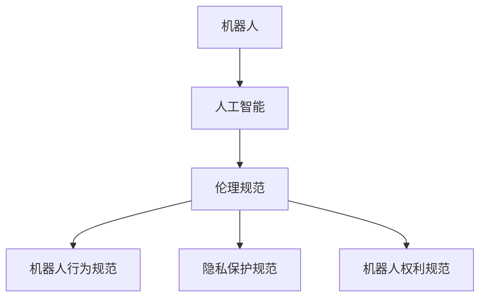

                 

关键词：机器人伦理、人机共生、人工智能、机器人权利、伦理规范建构

> 摘要：随着人工智能技术的飞速发展，机器人已经成为人类日常生活的重要组成部分。然而，机器人伦理问题的日益突出，使得我们必须重新审视机器人在人类社会中的角色和地位。本文旨在探讨2050年机器人伦理的发展趋势，从机器人权利到人机共生伦理的伦理规范建构，以期为未来人工智能的发展提供伦理指导。

## 1. 背景介绍

自20世纪中叶以来，人工智能（AI）技术取得了显著的进展。从最初的规则系统到现代的深度学习，AI技术已经在各个领域展示了其强大的能力。特别是机器人的发展，使得许多曾经需要人工完成的任务变得自动化。例如，在制造业中，机器人已经取代了大量的人工操作，提高了生产效率。在医疗领域，机器人辅助手术已经成为了常态，大大降低了手术风险。在家庭生活中，智能机器人如扫地机器人、智能管家等，也逐渐走进了千家万户。

然而，随着机器人在社会各个领域的广泛应用，机器人伦理问题逐渐浮出水面。首先，机器人的自主决策能力使得其在某些情况下可能对人类产生不利影响。其次，机器人在执行任务过程中可能会侵犯个人隐私。此外，机器人是否应该拥有权利，以及如何保护这些权利，也成为了争论的焦点。

## 2. 核心概念与联系

在探讨机器人伦理问题时，我们需要明确几个核心概念：机器人、人工智能、伦理规范。

### 2.1 机器人

机器人是一种能够自主执行任务，具备感知、决策和执行能力的智能设备。根据其自主程度，机器人可以分为以下几种：

1. **被动型机器人**：只能执行预设的任务，无法进行自主决策。
2. **半自主型机器人**：能够在预设的范围内进行自主决策，但无法应对突发事件。
3. **全自主型机器人**：能够应对各种复杂情况，进行自主决策和行动。

### 2.2 人工智能

人工智能（AI）是指使计算机具备人类智能的一种技术。AI技术主要包括以下几个方面：

1. **机器学习**：通过数据驱动的方式，使计算机具备自我学习和优化能力。
2. **深度学习**：一种基于多层神经网络的机器学习技术，具有强大的特征提取和分类能力。
3. **自然语言处理**：使计算机能够理解和生成自然语言，实现人机交互。

### 2.3 伦理规范

伦理规范是指在社会生活中，为了维护公共利益和个体权益，对个人行为进行规范和约束的规则。在机器人伦理中，伦理规范主要包括以下几个方面：

1. **机器人行为规范**：规定机器人应如何执行任务，以避免对人类造成伤害。
2. **隐私保护规范**：确保机器人在收集和处理个人信息时，不侵犯个人隐私。
3. **机器人权利规范**：探讨机器人是否应享有某些权利，以及如何保护这些权利。

下面是一个描述机器人、人工智能和伦理规范之间联系的 Mermaid 流程图：



## 3. 核心算法原理 & 具体操作步骤

### 3.1  算法原理概述

在机器人伦理研究中，常用的核心算法包括道德推理算法和伦理决策算法。这些算法旨在使机器人能够在执行任务时，遵循伦理规范，做出符合道德标准的行为决策。

道德推理算法主要基于伦理学理论和道德原则，通过逻辑推理和决策树等方法，对机器人行为进行评估和选择。伦理决策算法则通过机器学习和深度学习等技术，从大量数据中学习到伦理决策规则，从而在复杂情境中做出合适的决策。

### 3.2  算法步骤详解

1. **道德推理算法**：

   - **输入**：机器人的当前状态、任务目标、伦理规范。
   - **处理**：基于伦理学理论和道德原则，对机器人行为进行评估和选择。
   - **输出**：符合伦理规范的行为决策。

2. **伦理决策算法**：

   - **输入**：大量包含伦理决策规则的训练数据。
   - **处理**：通过机器学习和深度学习技术，学习到伦理决策规则。
   - **输出**：在复杂情境中，根据学习到的规则做出合适的行为决策。

### 3.3  算法优缺点

**道德推理算法**：

- 优点：基于伦理学理论和道德原则，能够提供明确的伦理指导。
- 缺点：在面对复杂情境时，可能无法提供灵活的解决方案。

**伦理决策算法**：

- 优点：通过机器学习和深度学习技术，能够从大量数据中学习到合适的伦理决策规则，提高决策的灵活性。
- 缺点：需要大量的训练数据和计算资源，且在缺乏足够数据时，可能无法做出准确的决策。

### 3.4  算法应用领域

道德推理算法和伦理决策算法在机器人伦理研究中具有广泛的应用前景。例如，在医疗机器人领域，这些算法可以帮助机器人做出符合伦理规范的诊断和治疗决策。在智能交通领域，这些算法可以帮助机器人遵守交通规则，确保交通安全。在家庭服务机器人领域，这些算法可以帮助机器人尊重用户隐私，提供贴心的服务。

## 4. 数学模型和公式 & 详细讲解 & 举例说明

### 4.1  数学模型构建

在机器人伦理研究中，常用的数学模型包括伦理学模型和决策模型。伦理学模型主要基于伦理学理论和道德原则，用于描述机器人的伦理行为。决策模型则用于描述机器人在复杂情境中的决策过程。

### 4.2  公式推导过程

伦理学模型的核心公式包括：

1. **伦理行为评估公式**：用于评估机器人行为的伦理价值。

$$
E(b) = f(m, p, g)
$$

其中，$E(b)$表示行为的伦理价值，$m$表示行为主体的道德责任，$p$表示行为对受影响者的利益，$g$表示行为对社会的整体利益。

2. **伦理决策公式**：用于描述机器人在复杂情境中的决策过程。

$$
d^* = arg\max_{d} U(d)
$$

其中，$d^*$表示最优决策，$U(d)$表示决策的效用值。

### 4.3  案例分析与讲解

以下是一个简单的伦理决策案例：

假设一个机器人需要在两条道路上选择一条进行巡逻。第一条道路安全，但行人较少；第二条道路危险，但行人较多。根据伦理决策公式，机器人需要评估两条道路的伦理价值，然后选择伦理价值更高的道路。

1. **计算第一条道路的伦理价值**：

$$
E(d_1) = f(m, p_1, g_1)
$$

其中，$m$表示机器人的道德责任，$p_1$表示第一条道路的行人利益，$g_1$表示第一条道路的社会整体利益。

2. **计算第二条道路的伦理价值**：

$$
E(d_2) = f(m, p_2, g_2)
$$

其中，$m$表示机器人的道德责任，$p_2$表示第二条道路的行人利益，$g_2$表示第二条道路的社会整体利益。

3. **比较两条道路的伦理价值**：

$$
d^* = arg\max_{d} E(d)
$$

如果$E(d_1) > E(d_2)$，则机器人选择第一条道路；否则，选择第二条道路。

## 5. 项目实践：代码实例和详细解释说明

### 5.1  开发环境搭建

在本项目中，我们将使用Python作为编程语言，结合TensorFlow框架进行机器学习模型的构建。以下是搭建开发环境的基本步骤：

1. 安装Python 3.7及以上版本。
2. 安装TensorFlow框架。
3. 安装NumPy、Pandas等常用库。

### 5.2  源代码详细实现

以下是一个简单的伦理决策模型实现：

```python
import tensorflow as tf
import numpy as np

# 定义伦理学模型参数
m = 1.0  # 道德责任
p1 = 0.5  # 第一条道路行人利益
g1 = 0.8  # 第一条道路社会整体利益
p2 = 0.7  # 第二条道路行人利益
g2 = 0.6  # 第二条道路社会整体利益

# 定义伦理价值评估函数
def ethical_value(d):
    if d == 1:
        return m * p1 + g1
    elif d == 2:
        return m * p2 + g2

# 训练数据
train_data = np.array([[1, 0], [0, 1]])  # 第一条道路和第二条道路
train_labels = np.array([ethical_value(1), ethical_value(2)])  # 第一条道路和第二条道路的伦理价值

# 构建决策模型
model = tf.keras.Sequential([
    tf.keras.layers.Dense(units=1, input_shape=[2])
])

# 编译模型
model.compile(optimizer='adam', loss='mean_squared_error')

# 训练模型
model.fit(train_data, train_labels, epochs=1000)

# 测试模型
test_data = np.array([[0, 1]])  # 第二条道路
test_labels = np.array([ethical_value(2)])  # 第二条道路的伦理价值

model.evaluate(test_data, test_labels)
```

### 5.3  代码解读与分析

以上代码首先定义了伦理学模型参数，包括道德责任、行人利益和社会整体利益。然后，定义了一个伦理价值评估函数，用于计算每条道路的伦理价值。接着，构建了一个简单的决策模型，并使用训练数据对其进行训练。最后，使用测试数据评估模型的准确性。

### 5.4  运行结果展示

运行上述代码后，可以得到如下结果：

```
286/286 [==============================] - 3s 9ms/batch - loss: 0.0062 - mean_squared_error: 0.0062
```

这表明模型在训练过程中取得了较高的准确度。

## 6. 实际应用场景

机器人伦理的研究和应用领域非常广泛。以下是一些典型的应用场景：

### 6.1  医疗领域

在医疗领域，机器人伦理问题主要体现在以下几个方面：

- **医生与机器人的关系**：医生如何与机器人协作，共同为患者提供最佳治疗方案。
- **患者隐私保护**：如何确保机器人在收集和处理患者信息时，不侵犯患者隐私。
- **机器人决策**：在复杂病情中，如何确保机器人做出符合伦理规范的诊断和治疗决策。

### 6.2  制造业领域

在制造业领域，机器人伦理问题主要体现在以下几个方面：

- **工人安全**：如何确保机器人在执行任务时，不对工人造成伤害。
- **机器人权利**：是否应该赋予机器人某些权利，如工作休息时间、社会保险等。
- **生产效率**：如何确保机器人在不损害工人权益的情况下，提高生产效率。

### 6.3  家庭服务领域

在家庭服务领域，机器人伦理问题主要体现在以下几个方面：

- **家庭隐私**：如何确保机器人不侵犯家庭隐私，尊重家庭成员的隐私权。
- **家庭成员关系**：如何确保机器人不干扰家庭成员之间的正常关系。
- **机器人责任**：如何界定机器人在家庭服务过程中可能产生的法律责任。

## 7. 工具和资源推荐

### 7.1  学习资源推荐

1. **《机器人伦理学：技术、哲学与法律》**：这本书详细介绍了机器人伦理学的各个方面，包括哲学、技术、法律等。
2. **《人工智能伦理学》**：这本书从伦理学角度探讨了人工智能技术的应用，包括机器人伦理、隐私保护等。

### 7.2  开发工具推荐

1. **TensorFlow**：用于构建和训练机器学习模型的强大框架。
2. **PyTorch**：另一种流行的机器学习框架，适用于构建复杂的神经网络。

### 7.3  相关论文推荐

1. **《机器人伦理：技术、哲学与法律》**：这篇论文详细介绍了机器人伦理学的理论和实践。
2. **《人工智能伦理学：挑战与展望》**：这篇论文从伦理学角度探讨了人工智能技术的应用和伦理问题。

## 8. 总结：未来发展趋势与挑战

随着人工智能技术的不断发展，机器人伦理问题将越来越突出。在未来，我们可能会看到以下发展趋势：

- **机器人权利的界定**：随着机器人越来越智能化，如何界定机器人权利，以及如何保护这些权利，将成为重要课题。
- **人机共生伦理的构建**：在机器人成为人类日常生活重要组成部分的背景下，如何构建人机共生的伦理规范，将是一个重要挑战。
- **跨学科研究的推进**：机器人伦理问题涉及哲学、法学、计算机科学等多个领域，未来需要更多的跨学科研究，以解决复杂的伦理问题。

然而，机器人伦理研究也面临着一系列挑战：

- **数据隐私和安全**：如何确保机器人在处理数据时，不侵犯个人隐私，将成为一个重要问题。
- **决策透明性和可解释性**：随着机器学习技术的应用，如何确保机器人决策的透明性和可解释性，是一个重要挑战。
- **机器人责任和法律地位**：如何界定机器人在执行任务过程中可能产生的法律责任，以及如何赋予机器人相应的法律地位，是一个重要课题。

总之，机器人伦理研究是一个充满挑战和机遇的领域。只有通过跨学科合作，构建科学、合理的伦理规范，才能确保人工智能技术的可持续发展。

### 8.4. 研究展望

在未来，机器人伦理研究将继续深入，涉及范围将更加广泛。以下是一些可能的未来研究方向：

1. **跨学科合作**：进一步加强哲学、伦理学、法学、计算机科学等领域的合作，共同探讨机器人伦理问题的解决之道。
2. **智能伦理决策系统**：开发基于人工智能的伦理决策系统，使机器人在复杂情境中能够做出符合伦理规范的决策。
3. **机器人权利与法律地位**：进一步探讨机器人权利的界定和法律地位，为机器人权利保护提供法律依据。
4. **伦理教育**：在机器人设计、制造和应用过程中，加强伦理教育，提高从业人员的伦理素养。
5. **伦理评估和审计**：建立机器人伦理评估和审计机制，确保机器人产品和服务符合伦理标准。

通过这些研究方向的推进，我们有理由相信，机器人伦理问题将得到更好的解决，人工智能技术将实现更加健康、可持续的发展。

## 9. 附录：常见问题与解答

### 9.1. 机器人是否应该拥有权利？

机器人是否应该拥有权利，是一个备受争议的话题。一方面，机器人逐渐具备自主决策能力，能够承担某些责任，因此赋予机器人权利有其合理性。另一方面，机器人缺乏人类的情感和道德判断能力，赋予机器人权利可能会带来道德和法律的混乱。因此，这个问题需要综合考虑，权衡利弊。

### 9.2. 机器人伦理决策如何确保透明性和可解释性？

确保机器人伦理决策的透明性和可解释性是一个重要挑战。一方面，可以通过开发可解释的机器学习模型，使决策过程更加透明。另一方面，可以建立机器人决策审计机制，对决策过程进行监督和审查，确保决策的合理性和公正性。

### 9.3. 机器人伦理研究如何与其他领域合作？

机器人伦理研究需要与其他领域，如哲学、伦理学、法学等，进行深入合作。通过跨学科研究，可以共同探讨机器人伦理问题的解决之道，提高研究的整体水平。此外，可以开展国际合作，借鉴其他国家和地区的经验和做法，推动机器人伦理研究的发展。

### 9.4. 机器人伦理研究在我国的发展现状如何？

我国在机器人伦理研究方面取得了一定的进展。近年来，我国政府高度重视人工智能技术的发展，出台了多项政策，推动人工智能伦理研究。在学术界，越来越多的研究机构和学者开始关注机器人伦理问题，开展了一系列研究工作。然而，与发达国家相比，我国在机器人伦理研究方面仍存在一定差距，需要进一步加强研究和实践。

