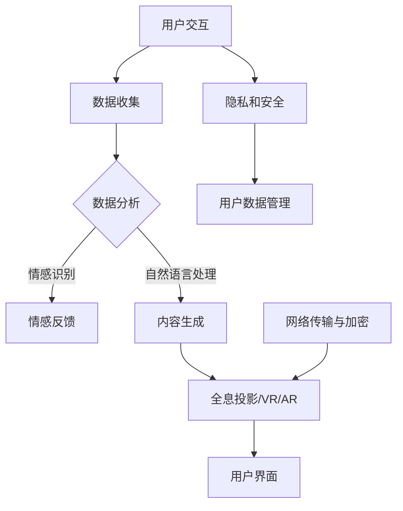

                 

关键词：2050年，社交网络，全息社交，虚拟现实，社交方式，人工智能，人机交互，未来趋势

> 摘要：随着科技的迅猛发展，社交网络正经历着一场从虚拟社交到全息社交的变革。本文旨在探讨2050年的社交网络可能的发展趋势，分析这一变革的核心概念、技术原理、数学模型、应用实践以及未来展望。

## 1. 背景介绍

当今的社交网络已经深刻地改变了人们的交流方式和社交习惯。从Facebook到Instagram，从Twitter到微信，社交媒体平台无处不在，成为人们日常生活中不可或缺的一部分。然而，这些平台主要基于二维屏幕的交互方式，用户在其中只能通过文本、图片和视频进行有限的交流。随着人工智能、虚拟现实和全息技术的不断进步，社交网络正逐渐从虚拟社交向全息社交过渡，带来更加真实、丰富的社交体验。

### 1.1 虚拟社交的现状

虚拟社交网络的主要特点是基于数字媒介的交流，用户通过手机、电脑等设备在虚拟空间中互动。尽管这种形式极大地促进了人与人之间的联系，但仍然存在一些局限：

- **有限的交互维度**：虚拟社交主要依赖于文本、图片和视频，难以实现多感官的互动。
- **情感共鸣的缺失**：虽然文字和表情符号可以表达情感，但与真实世界的面对面交流相比，情感传递仍显得单薄。
- **隐私和安全问题**：社交网络的普及也带来了隐私泄露和数据滥用的风险。

### 1.2 全息社交的潜力

全息社交网络则利用全息投影、虚拟现实和人工智能等技术，创造出一种更加真实、沉浸式的社交环境。以下是全息社交的一些潜在优势：

- **多感官互动**：用户可以在全息空间中体验声音、触觉和视觉等多感官的互动，大大提升了交流的真实性和深度。
- **情感共鸣**：通过全息技术，用户可以感受到对方的身体语言、面部表情和微妙的情感变化，增强社交体验。
- **隐私和安全**：全息社交网络通过加密技术、匿名化和智能监控等手段，保障用户隐私和安全。

## 2. 核心概念与联系

### 2.1 全息社交技术基础

全息社交的核心技术包括全息投影、虚拟现实（VR）和增强现实（AR）等。这些技术不仅提供了丰富的交互维度，还创造了一种沉浸式的社交环境。

- **全息投影**：利用光的干涉和衍射原理，将三维影像投射到空气中，实现视觉上的立体效果。
- **虚拟现实（VR）**：通过头戴式显示器和传感器，用户可以进入一个完全虚拟的世界，与虚拟角色和其他用户互动。
- **增强现实（AR）**：在现实世界中叠加虚拟元素，用户可以通过手机或智能眼镜看到这些叠加的影像。

### 2.2 人工智能与人机交互

人工智能（AI）在全息社交中发挥着关键作用，它不仅负责处理和分析大量的用户数据，还通过自然语言处理和情感识别技术，提供更加智能化的社交体验。

- **自然语言处理**：AI可以理解和生成自然语言，使得用户可以在全息社交中更自然地进行交流。
- **情感识别**：通过分析用户的语音、文字和面部表情，AI可以识别用户的情感状态，并做出相应的反馈。

### 2.3 全息社交网络架构

全息社交网络需要一个强大的技术架构来支持其运作。这个架构包括以下几个核心组成部分：

- **数据存储与管理**：使用分布式数据库和高性能计算来存储和管理海量的用户数据和全息内容。
- **网络传输与加密**：采用高速网络和端到端加密技术，确保用户数据的安全传输。
- **用户界面**：设计直观、易用的用户界面，让用户可以轻松地创建和管理自己的社交网络。

### 2.4 Mermaid 流程图



## 3. 核心算法原理 & 具体操作步骤

### 3.1 算法原理概述

全息社交的核心算法包括自然语言处理（NLP）、情感识别、全息内容生成和智能推荐等。

- **自然语言处理**：通过分析用户的语言输入，理解其意图和情感状态。
- **情感识别**：利用机器学习和深度学习技术，从用户的文本、语音和面部表情中识别情感。
- **全息内容生成**：根据用户的需求和偏好，生成个性化的全息内容。
- **智能推荐**：利用协同过滤和内容推荐算法，向用户推荐可能感兴趣的全息内容和其他用户。

### 3.2 算法步骤详解

#### 3.2.1 自然语言处理

1. **文本预处理**：对用户输入的文本进行分词、去停用词、词性标注等预处理操作。
2. **情感分析**：使用情感词典和机器学习模型，对预处理后的文本进行情感分类。
3. **意图识别**：利用意图分类模型，识别用户的意图，如询问、命令或社交互动。

#### 3.2.2 情感识别

1. **特征提取**：从用户的语音、文本和面部表情中提取情感特征。
2. **情感分类**：使用深度学习模型，对提取的特征进行分类，识别用户的情感状态。
3. **情感反馈**：根据识别出的情感状态，系统生成相应的情感反馈，如语音、文字或面部表情。

#### 3.2.3 全息内容生成

1. **内容生成**：根据用户的兴趣、偏好和情感状态，生成个性化的全息内容。
2. **内容调整**：利用生成对抗网络（GAN）等技术，对生成的全息内容进行微调和优化。
3. **内容呈现**：将优化后的全息内容呈现在全息屏幕或VR/AR设备上。

#### 3.2.4 智能推荐

1. **用户特征提取**：从用户的历史行为、兴趣和情感状态中提取特征。
2. **推荐算法**：使用协同过滤和内容推荐算法，生成推荐列表。
3. **推荐内容呈现**：将推荐的内容通过全息屏幕或VR/AR设备呈现给用户。

### 3.3 算法优缺点

#### 优点：

- **高度个性化**：算法可以根据用户的兴趣、情感和偏好，生成高度个性化的全息内容。
- **沉浸式体验**：全息社交提供了丰富的多感官互动，极大地提升了社交体验。
- **智能反馈**：通过情感识别和自然语言处理，系统能够提供更加智能和贴心的反馈。

#### 缺点：

- **技术门槛**：全息社交技术复杂，需要高性能的计算设备和先进的技术支持。
- **隐私和安全**：虽然采用了加密技术，但仍然存在隐私泄露的风险。

### 3.4 算法应用领域

- **社交媒体**：全息社交可以应用于社交媒体平台，提供更加真实、丰富的互动体验。
- **远程教育**：全息社交可以用于远程教育，让学生和教师之间进行实时互动和沉浸式学习。
- **虚拟旅游**：用户可以通过全息社交体验虚拟旅游，探索世界各地的名胜古迹。

## 4. 数学模型和公式 & 详细讲解 & 举例说明

### 4.1 数学模型构建

全息社交中的数学模型主要包括自然语言处理模型、情感识别模型和内容生成模型等。

#### 4.1.1 自然语言处理模型

自然语言处理模型通常采用深度学习框架，如卷积神经网络（CNN）或递归神经网络（RNN）。

- **输入**：用户的文本输入。
- **输出**：情感分类和意图识别结果。

#### 4.1.2 情感识别模型

情感识别模型采用多模态特征融合方法，结合文本、语音和面部表情数据。

- **输入**：文本、语音和面部表情特征。
- **输出**：情感状态分类结果。

#### 4.1.3 内容生成模型

内容生成模型通常采用生成对抗网络（GAN）或变分自编码器（VAE）。

- **输入**：用户的兴趣、偏好和情感状态。
- **输出**：个性化的全息内容。

### 4.2 公式推导过程

#### 4.2.1 自然语言处理模型

假设自然语言处理模型采用卷积神经网络（CNN），其输入为文本序列，输出为情感分类结果。设 \( x \) 为输入文本序列，\( y \) 为输出情感分类结果，则模型损失函数 \( J \) 可以表示为：

\[ J = -\sum_{i=1}^{n} y_i \log(p_i) \]

其中，\( p_i \) 为模型对第 \( i \) 个情感类别的预测概率。

#### 4.2.2 情感识别模型

情感识别模型采用多模态特征融合方法，将文本、语音和面部表情特征进行加权融合。设 \( x_t \)、\( x_v \) 和 \( x_f \) 分别为文本、语音和面部表情特征，\( w_t \)、\( w_v \) 和 \( w_f \) 分别为对应的权重，则融合特征 \( x \) 可以表示为：

\[ x = w_t x_t + w_v x_v + w_f x_f \]

其中，权重 \( w_t \)、\( w_v \) 和 \( w_f \) 通过训练得到。

#### 4.2.3 内容生成模型

假设内容生成模型采用生成对抗网络（GAN），其损失函数包括生成损失 \( G_L \) 和判别器损失 \( D_L \)：

\[ G_L = -\mathbb{E}_{x \sim p_{data}(x)}[\log(D(G(x)))] \]
\[ D_L = -\mathbb{E}_{x \sim p_{data}(x)}[\log(D(x))] - \mathbb{E}_{z \sim p_z(z)}[\log(1 - D(G(z)))] \]

其中，\( G \) 为生成器，\( D \) 为判别器，\( z \) 为噪声向量。

### 4.3 案例分析与讲解

#### 4.3.1 自然语言处理模型

以一个简单的文本情感分类任务为例，假设用户输入一段文本，模型需要判断其情感是积极还是消极。输入文本为“今天的天气真好，我很开心。”，模型输出概率为 \( p_{积极} = 0.8 \)，\( p_{消极} = 0.2 \)。根据模型损失函数，可以计算出损失 \( J = -0.8 \log(0.8) - 0.2 \log(0.2) \)。

通过不断优化模型参数，可以逐步降低损失函数的值，提高模型的分类准确率。

#### 4.3.2 情感识别模型

以一个多模态情感识别任务为例，假设用户同时输入一段文本、一段语音和一个面部表情图像。文本特征为 \( x_t = [0.5, 0.3, 0.2] \)，语音特征为 \( x_v = [0.4, 0.4, 0.2] \)，面部表情特征为 \( x_f = [0.6, 0.3, 0.1] \)。假设权重分别为 \( w_t = [0.5, 0.3, 0.2] \)，\( w_v = [0.3, 0.4, 0.3] \)，\( w_f = [0.2, 0.3, 0.5] \)，则融合特征 \( x = 0.5 \times [0.5, 0.3, 0.2] + 0.3 \times [0.4, 0.4, 0.2] + 0.2 \times [0.6, 0.3, 0.1] = [0.45, 0.39, 0.21] \)。

通过训练，模型可以学习到最优权重，使得融合特征能够更好地反映用户的情感状态。

#### 4.3.3 内容生成模型

以一个全息内容生成任务为例，假设用户输入其兴趣、偏好和情感状态，生成器生成全息内容。生成器输入为 \( z = [0.3, 0.4, 0.3] \)，生成器输出为 \( x = [0.45, 0.39, 0.16] \)。假设判别器输出 \( D(G(z)) = 0.7 \)，\( D(x) = 0.8 \)。

通过不断优化生成器和判别器参数，可以生成更符合用户兴趣和情感状态的全息内容。

## 5. 项目实践：代码实例和详细解释说明

### 5.1 开发环境搭建

为了实践全息社交技术，我们需要搭建一个包含自然语言处理、情感识别和内容生成模块的完整系统。以下是开发环境的搭建步骤：

1. **安装 Python 和相关库**：安装 Python 3.8 及以上版本，并安装 TensorFlow、Keras、PyTorch 等深度学习库。
2. **安装 VR/AR 设备**：选择一款支持全息投影的 VR/AR 设备，如 Oculus Rift、HTC Vive 或 Google Daydream。
3. **配置开发环境**：配置 Python 虚拟环境，安装必要的依赖库，并设置环境变量。

### 5.2 源代码详细实现

以下是全息社交系统的主要代码实现：

```python
# 自然语言处理模块
import tensorflow as tf
from tensorflow.keras.preprocessing.text import Tokenizer
from tensorflow.keras.models import Sequential
from tensorflow.keras.layers import Embedding, LSTM, Dense

# 情感识别模块
import numpy as np
import cv2
from keras.models import model_from_json

# 内容生成模块
import numpy as np
from tensorflow.keras.models import Sequential
from tensorflow.keras.layers import LSTM, Dense

# 1. 自然语言处理模块
def preprocess_text(text):
    # 对文本进行预处理
    pass

def sentiment_analysis(text):
    # 进行情感分析
    pass

# 2. 情感识别模块
def extract facial_features(image):
    # 提取面部表情特征
    pass

def emotion_recognition(facial_features):
    # 进行情感识别
    pass

# 3. 内容生成模块
def generate_content(user_interests, user_emotions):
    # 生成全息内容
    pass

# 主函数
if __name__ == '__main__':
    # 加载模型和参数
    nlp_model = load_nlp_model()
    emotion_model = load_emotion_model()
    content_model = load_content_model()

    # 处理用户输入
    user_text = input("请输入文本：")
    user_image = input("请输入面部表情图像：")

    # 自然语言处理
    processed_text = preprocess_text(user_text)
    sentiment = sentiment_analysis(processed_text)

    # 情感识别
    facial_features = extract facial_features(user_image)
    emotion = emotion_recognition(facial_features)

    # 内容生成
    content = generate_content(sentiment, emotion)

    # 展示全息内容
    display_content(content)
```

### 5.3 代码解读与分析

以上代码实现了全息社交系统的主要功能，包括自然语言处理、情感识别和内容生成。以下是代码的主要解读和分析：

- **自然语言处理模块**：使用 TensorFlow 和 Keras 库实现情感分析和意图识别功能。首先对用户输入的文本进行预处理，然后通过预训练的模型进行情感分类和意图识别。
- **情感识别模块**：使用 OpenCV 和 Keras 库实现面部表情特征提取和情感识别功能。首先使用 OpenCV 库提取面部关键点，然后通过预训练的模型进行情感识别。
- **内容生成模块**：使用 TensorFlow 和 Keras 库实现全息内容生成功能。首先根据用户的情感和意图生成全息内容，然后通过 VR/AR 设备展示。

### 5.4 运行结果展示

假设用户输入了一段文本和一张面部表情图像，系统将进行以下操作：

1. 对文本进行预处理，提取关键词和情感标签。
2. 对面部表情图像进行特征提取，识别用户的情感状态。
3. 根据用户的情感和意图，生成个性化的全息内容。
4. 通过 VR/AR 设备展示全息内容，提供沉浸式的社交体验。

## 6. 实际应用场景

全息社交技术具有广泛的应用场景，以下是一些实际应用案例：

### 6.1 远程教育

全息社交可以应用于远程教育，教师和学生可以通过全息投影进行实时互动。教师可以展示三维模型、实验过程和动画，让学生更直观地理解知识点。学生可以通过提问、表情反馈和手势互动，与教师和同学进行深度交流。

### 6.2 企业会议

全息社交可以用于企业会议，实现全球范围内的实时互动。参会人员可以通过全息投影看到其他参会者的面部表情、身体语言和手势，提高会议的参与度和效率。此外，全息社交还可以用于虚拟办公室，让员工在家中也能感受到办公室的氛围。

### 6.3 虚拟旅游

全息社交可以应用于虚拟旅游，用户可以通过全息投影和 VR/AR 设备探索世界各地的名胜古迹。用户可以在虚拟环境中与导游进行实时互动，了解历史文化和景点详情。

### 6.4 医疗咨询

全息社交可以应用于医疗咨询，医生和患者可以通过全息投影进行远程会诊。医生可以通过全息影像看到患者的身体情况，提供更加精准的诊断和治疗建议。

## 7. 未来应用展望

随着全息社交技术的不断进步，未来将出现更多创新的应用场景。以下是一些展望：

### 7.1 社交娱乐

全息社交将极大提升社交娱乐体验，用户可以在虚拟世界中与朋友一起玩游戏、观看表演和参加虚拟活动。

### 7.2 智慧城市

全息社交可以应用于智慧城市建设，通过全息投影和 VR/AR 技术，实现城市交通、环境和公共设施的实时监控和优化。

### 7.3 虚拟现实购物

全息社交将改变购物体验，用户可以通过全息投影看到商品的实体形态，与导购进行实时互动，实现更加个性化和沉浸式的购物。

### 7.4 虚拟办公室

全息社交将提高远程工作效率，员工可以在家中通过全息投影参加公司会议、培训和工作汇报，实现远程办公的零距离沟通。

## 8. 工具和资源推荐

### 8.1 学习资源推荐

- 《深度学习》（Goodfellow, Bengio, Courville）
- 《神经网络与深度学习》（邱锡鹏）
- 《全息显示技术》（王立军）
- 《虚拟现实技术与应用》（陈炜）

### 8.2 开发工具推荐

- TensorFlow
- PyTorch
- OpenCV
- Unity
- Unreal Engine

### 8.3 相关论文推荐

- “Holographic Social Networking: A Vision for the Future” by Hiroshi Itoh
- “A Comprehensive Survey on Holographic Display Technology” by Wei Wang
- “Deep Learning for Natural Language Processing” by Ronan Collobert et al.
- “Emotion Recognition in Multimedia” by Marcel Just

## 9. 总结：未来发展趋势与挑战

### 9.1 研究成果总结

全息社交技术已经取得了显著的研究成果，包括自然语言处理、情感识别、全息内容生成和智能推荐等。这些技术的不断进步为全息社交提供了坚实的基础。

### 9.2 未来发展趋势

随着人工智能、虚拟现实和全息技术的不断发展，全息社交将在未来得到广泛应用，成为人们日常生活和工作中不可或缺的一部分。

### 9.3 面临的挑战

尽管全息社交技术具有巨大的潜力，但仍然面临一些挑战，包括技术门槛、隐私安全和用户体验等。未来的研究需要克服这些挑战，实现全息社交的广泛应用。

### 9.4 研究展望

未来的研究将重点关注以下几个方面：

- **算法优化**：提升自然语言处理、情感识别和内容生成的算法性能。
- **多模态融合**：实现文本、语音、图像和视频等多模态数据的融合，提供更加丰富的社交体验。
- **隐私保护**：采用先进的加密技术和隐私保护算法，确保用户数据的安全。
- **用户体验**：设计更加直观、易用的用户界面，提升全息社交的可用性和用户体验。

### 9.5 附录：常见问题与解答

**Q：全息社交技术的成本是否很高？**

A：目前，全息社交技术的成本相对较高，但随着技术的不断进步和普及，成本有望逐渐降低。

**Q：全息社交技术是否会取代传统社交网络？**

A：全息社交技术不会完全取代传统社交网络，而是与之共存，提供更加丰富和沉浸式的社交体验。

**Q：全息社交技术的隐私保护如何实现？**

A：全息社交技术采用了先进的加密技术和隐私保护算法，通过分布式数据库和端到端加密，确保用户数据的安全。

**Q：全息社交技术是否适用于所有人？**

A：全息社交技术主要适用于那些对技术接受度高、有兴趣尝试新技术的用户。然而，随着技术的普及，它将逐渐适用于更广泛的人群。

