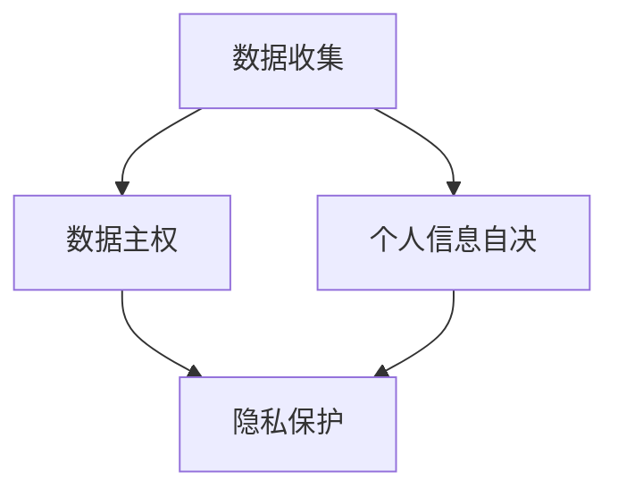

                 

在21世纪末，隐私保护成为信息技术领域的核心议题。随着数据量和连接性的爆炸式增长，个人隐私面临前所未有的威胁。然而，2050年的隐私保护不仅仅是技术层面的改进，更涉及到社会、法律、伦理等多方面的变革。本文将探讨这一主题，从数据主权到个人信息自决，探索隐私保护的新规则。

## 文章关键词

- 隐私保护
- 数据主权
- 个人信息自决
- 伦理法规
- 人工智能

## 文章摘要

本文旨在探讨2050年隐私保护的新规则，分析数据主权和个人信息自决在隐私保护中的重要作用。文章首先回顾了隐私保护的背景，然后深入探讨了数据主权和个人信息自决的概念及其实现机制。接着，本文提出了隐私保护的核心算法原理和具体操作步骤，并结合实际应用场景进行了分析。最后，文章展望了隐私保护的未来发展趋势和面临的挑战。

### 1. 背景介绍

随着互联网和移动设备的普及，个人数据无处不在。这些数据不仅包括我们日常生活中的个人信息，如姓名、住址、电话号码等，还涉及到我们的行为数据、社交关系、健康信息等。这些数据的价值不可估量，因此吸引了众多企业的关注。然而，个人数据的收集和使用也引发了一系列隐私问题。

首先，个人数据的泄露风险极高。从2013年的Facebook数据泄露事件，到2021年的LinkedIn数据泄露事件，数以百万计的用户数据被非法获取和利用。这些数据泄露事件不仅损害了用户的隐私，还导致了信任危机。

其次，个人数据的滥用问题日益严重。许多企业通过数据挖掘和分析，对用户进行精准营销，甚至通过数据交易进行非法获利。这些行为不仅侵犯了用户的隐私权，还可能导致用户的个人信息被用于非法目的。

最后，个人数据的存储和使用缺乏透明度和可解释性。用户往往不清楚自己的数据被如何收集、存储和使用，也无法控制自己的数据。这种信息不对称导致了用户对隐私保护的担忧。

### 2. 核心概念与联系

#### 数据主权

数据主权是指个人或组织对其数据拥有完全的控制权和决策权。这意味着个人可以自主决定其数据的收集、存储、使用和共享。数据主权的核心思想是尊重个人对其数据的掌控权，保护其隐私和信息安全。

数据主权的重要性体现在以下几个方面：

1. **隐私保护**：数据主权确保个人对其数据的控制，防止数据被非法收集和使用，从而保护个人隐私。

2. **数据安全**：数据主权有助于建立数据安全机制，防止数据泄露、篡改和滥用。

3. **数据共享**：数据主权允许个人自主决定数据是否共享，以及如何共享，从而促进数据的合理利用。

#### 个人信息自决

个人信息自决是指个人对其个人信息的收集、存储、使用和共享拥有最终决定权。个人信息自决的核心是尊重个人的自主权，允许个人根据自己的意愿来管理自己的个人信息。

个人信息自决的重要性体现在以下几个方面：

1. **隐私保护**：个人信息自决确保个人可以自主决定其个人信息是否被收集、存储和使用，从而有效保护个人隐私。

2. **数据透明**：个人信息自决要求企业和组织在收集、存储和使用个人信息时必须透明，这有助于建立信任，减少隐私侵犯。

3. **数据治理**：个人信息自决有助于建立良好的数据治理机制，提高数据管理的效率和效果。

#### Mermaid 流程图

下面是一个简化的 Mermaid 流程图，展示了数据主权和个人信息自决在隐私保护中的关系。



### 3. 核心算法原理 & 具体操作步骤

#### 3.1 算法原理概述

隐私保护的核心在于数据匿名化和加密技术。数据匿名化是指将个人数据中的敏感信息去除或替代，使其无法被直接识别。加密技术则通过将数据转换为密文，确保数据在传输和存储过程中不被窃取或篡改。

#### 3.2 算法步骤详解

1. **数据匿名化**

   数据匿名化的步骤如下：

   - **脱敏处理**：通过替换、掩码等方式，将敏感数据替换为不敏感的数据。
   - **泛化处理**：将详细的数据转换为更高层次的抽象，如将具体地址转换为城市级别。
   - **加密处理**：将匿名化后的数据加密，确保数据在传输和存储过程中安全。

2. **加密技术**

   加密技术的步骤如下：

   - **数据加密**：使用加密算法，将明文数据转换为密文。
   - **密钥管理**：管理加密密钥，确保密钥的安全性和有效性。
   - **数据解密**：使用加密密钥，将密文数据转换为明文。

#### 3.3 算法优缺点

1. **优点**

   - **隐私保护**：数据匿名化和加密技术可以有效保护个人隐私。
   - **安全性**：加密技术可以确保数据在传输和存储过程中不被窃取或篡改。
   - **透明性**：匿名化和加密技术使得数据处理过程更加透明，用户可以自主决定数据的收集、存储和使用。

2. **缺点**

   - **性能开销**：数据匿名化和加密技术会增加数据处理的开销，可能影响系统性能。
   - **隐私泄露风险**：在数据匿名化和加密过程中，可能存在隐私泄露的风险。

#### 3.4 算法应用领域

- **医疗健康**：医疗健康领域涉及大量的个人敏感数据，如病历、基因信息等。数据匿名化和加密技术可以帮助保护患者隐私。
- **金融行业**：金融行业涉及大量的个人财务数据，如银行账户信息、交易记录等。数据匿名化和加密技术可以确保客户隐私不受侵犯。
- **电子商务**：电子商务领域涉及大量的用户行为数据，如购物记录、偏好等。数据匿名化和加密技术可以帮助商家了解用户需求，同时保护用户隐私。

### 4. 数学模型和公式 & 详细讲解 & 举例说明

#### 4.1 数学模型构建

隐私保护的核心在于数据匿名化和加密技术。数据匿名化通常使用概率模型，如k-匿名性、l-diversity和t-closeness等。加密技术则基于密码学原理，如对称加密、非对称加密和哈希函数等。

#### 4.2 公式推导过程

1. **k-匿名性**

   k-匿名性是指数据集中的每个记录在去除敏感信息后，至少与其他k-1个记录相同。其数学模型可以表示为：

   $$ \forall r \in D, \exists k \geq 1, \forall r' \in D, \text{such that } r \neq r' \Rightarrow \text{Support}(r) \geq k $$

   其中，$D$是数据集，$r$和$r'$是数据集中的记录，$\text{Support}(r)$是记录$r$的支持度。

2. **l-diversity**

   l-diversity是指数据集中的每个记录在去除敏感信息后，至少与l个不同的记录相关联。其数学模型可以表示为：

   $$ \forall r \in D, \exists l \geq 1, \forall r' \in D, \text{such that } r \neq r' \Rightarrow \text{Correlated}(r, r') \geq l $$

   其中，$\text{Correlated}(r, r')$表示记录$r$和$r'$的相关性。

3. **t-closeness**

   t-closeness是指数据集中的每个记录在去除敏感信息后，至少与t个不同的记录相似。其数学模型可以表示为：

   $$ \forall r \in D, \exists t \geq 1, \forall r' \in D, \text{such that } r \neq r' \Rightarrow \text{Similarity}(r, r') \geq t $$

   其中，$\text{Similarity}(r, r')$表示记录$r$和$r'$的相似度。

#### 4.3 案例分析与讲解

以k-匿名性为例，我们来看一个简单的案例。

假设有一个数据集D，包含以下记录：

| ID | Name | Age | City |
|----|------|-----|------|
| 1  | Alice| 30  | New York|
| 2  | Bob  | 25  | Los Angeles|
| 3  | Carol| 35  | Chicago|
| 4  | Dave | 40  | New York|

现在我们要对数据集D进行k-匿名化，假设k=2。

1. **去除敏感信息**：我们去除Name和City列，得到以下匿名化后的数据集D'：

| ID | Age |
|----|-----|
| 1  | 30  |
| 2  | 25  |
| 3  | 35  |
| 4  | 40  |

2. **计算支持度**：我们计算每个记录的支持度，得到以下结果：

| ID | Support |
|----|---------|
| 1  | 2       |
| 2  | 2       |
| 3  | 2       |
| 4  | 2       |

3. **验证k-匿名性**：我们发现每个记录的支持度都大于或等于k，即D'满足k-匿名性。

### 5. 项目实践：代码实例和详细解释说明

#### 5.1 开发环境搭建

为了演示数据匿名化和加密技术的应用，我们使用Python编程语言，搭建了一个简单的开发环境。

1. **安装Python**：在计算机上安装Python，版本为3.8以上。
2. **安装依赖库**：安装以下依赖库：

   ```bash
   pip install pandas
   pip install numpy
   pip install cryptography
   ```

#### 5.2 源代码详细实现

以下是一个简单的Python代码示例，演示了数据匿名化和加密技术的应用。

```python
import pandas as pd
from cryptography.fernet import Fernet

# 生成加密密钥
key = Fernet.generate_key()
cipher_suite = Fernet(key)

# 数据集
data = {
    'ID': [1, 2, 3, 4],
    'Name': ['Alice', 'Bob', 'Carol', 'Dave'],
    'Age': [30, 25, 35, 40],
    'City': ['New York', 'Los Angeles', 'Chicago', 'New York']
}

df = pd.DataFrame(data)

# 数据匿名化
df_anonymized = df.drop(['Name', 'City'], axis=1)

# 数据加密
df_anonymized['Age'] = df_anonymized['Age'].apply(lambda x: cipher_suite.encrypt(str(x).encode()))

# 输出匿名化后的数据
print(df_anonymized)

# 数据解密
df_decrypted = df_anonymized.copy()
df_decrypted['Age'] = df_decrypted['Age'].apply(lambda x: cipher_suite.decrypt(x).decode())

# 输出解密后的数据
print(df_decrypted)
```

#### 5.3 代码解读与分析

1. **数据导入**：我们使用pandas库读取一个简单的数据集，包含ID、Name、Age和City列。
2. **数据匿名化**：我们去除Name和City列，得到一个只包含ID和Age的数据集。
3. **数据加密**：我们使用cryptography库中的Fernet加密算法，对Age列进行加密。
4. **数据解密**：我们使用相同的加密密钥，对加密后的数据集进行解密。

通过这个简单的示例，我们可以看到数据匿名化和加密技术如何应用于实际场景。

### 6. 实际应用场景

#### 6.1 医疗健康

在医疗健康领域，数据主权和个人信息自决尤为重要。患者有权控制其健康数据的收集、存储和使用。以下是一个实际应用场景：

- **患者控制数据访问**：患者可以通过授权，决定哪些医疗工作人员可以访问其健康数据。
- **数据匿名化**：医院可以对患者的健康数据进行匿名化处理，确保数据在共享过程中不会被识别。
- **加密技术**：医院可以使用加密技术，确保患者的健康数据在传输和存储过程中不会被窃取。

#### 6.2 金融行业

在金融行业，数据主权和个人信息自决可以帮助提高用户信任，降低隐私泄露风险。以下是一个实际应用场景：

- **用户控制数据访问**：用户可以通过授权，决定哪些金融机构可以访问其财务数据。
- **数据匿名化**：金融机构可以对用户的财务数据进行匿名化处理，确保数据在共享过程中不会被识别。
- **加密技术**：金融机构可以使用加密技术，确保用户的财务数据在传输和存储过程中不会被窃取。

#### 6.3 电子商务

在电子商务领域，数据主权和个人信息自决可以帮助提高用户体验，降低隐私泄露风险。以下是一个实际应用场景：

- **用户控制数据访问**：用户可以通过授权，决定哪些电商平台可以访问其购物数据。
- **数据匿名化**：电商平台可以对用户的购物数据进行匿名化处理，确保数据在共享过程中不会被识别。
- **加密技术**：电商平台可以使用加密技术，确保用户的购物数据在传输和存储过程中不会被窃取。

### 7. 工具和资源推荐

#### 7.1 学习资源推荐

- **在线课程**：Coursera、edX、Udacity等在线教育平台提供了丰富的隐私保护相关课程。
- **书籍**：《隐私计算：从理论到实践》、《数据隐私：技术、策略和案例》等书籍深入探讨了隐私保护的理论和实践。
- **论文**：阅读顶级学术会议和期刊上的论文，如ACM CCS、IEEE S&P等，了解最新的隐私保护技术和研究动态。

#### 7.2 开发工具推荐

- **Python**：Python是一种强大的编程语言，适用于隐私保护领域的开发。
- **Docker**：Docker可以帮助我们构建和管理隐私保护相关项目的容器环境。
- **Kubernetes**：Kubernetes是一个开源的容器编排平台，可以帮助我们部署和管理隐私保护系统。

#### 7.3 相关论文推荐

- **《隐私计算：从理论到实践》**：该论文系统地介绍了隐私计算的理论基础和实践方法。
- **《基于区块链的隐私保护数据共享方案》**：该论文提出了一种基于区块链的隐私保护数据共享方案，具有较高的参考价值。
- **《差分隐私：原理与应用》**：该论文详细介绍了差分隐私的理论原理和应用场景，对隐私保护研究具有指导意义。

### 8. 总结：未来发展趋势与挑战

#### 8.1 研究成果总结

自21世纪初以来，隐私保护领域取得了显著的进展。从数据匿名化、加密技术到隐私计算，一系列技术方案不断涌现。这些成果不仅提高了数据的安全性和隐私保护水平，也为实际应用场景提供了有力支持。

#### 8.2 未来发展趋势

未来，隐私保护将朝着以下几个方向发展：

1. **隐私计算**：隐私计算技术将在数据保护和数据利用之间找到更好的平衡，实现数据的安全共享。
2. **联邦学习**：联邦学习技术将允许多个机构在保持数据隐私的情况下进行联合学习和预测。
3. **区块链技术**：区块链技术将提供去中心化的数据管理和共享机制，提高数据的安全性和透明度。

#### 8.3 面临的挑战

尽管隐私保护技术取得了显著进展，但仍面临以下挑战：

1. **计算性能**：隐私保护技术往往需要较高的计算资源，如何优化算法性能是一个重要挑战。
2. **用户隐私偏好**：如何设计易于用户理解和使用的技术，以满足其隐私偏好是一个挑战。
3. **法律法规**：隐私保护技术需要与法律法规保持一致，如何平衡技术发展和法律要求是一个挑战。

#### 8.4 研究展望

未来，隐私保护研究将继续深入探索以下方向：

1. **隐私保护算法优化**：优化现有隐私保护算法，提高计算效率和性能。
2. **跨领域合作**：促进隐私保护领域与其他领域的交叉研究，如人工智能、区块链等。
3. **法律法规完善**：完善隐私保护相关法律法规，为技术发展提供有力支持。

### 9. 附录：常见问题与解答

**Q：什么是数据主权？**

A：数据主权是指个人或组织对其数据拥有完全的控制权和决策权。这意味着个人可以自主决定其数据的收集、存储、使用和共享。

**Q：什么是个人信息自决？**

A：个人信息自决是指个人对其个人信息的收集、存储、使用和共享拥有最终决定权。个人信息自决的核心是尊重个人的自主权，允许个人根据自己的意愿来管理自己的个人信息。

**Q：数据匿名化和加密技术如何应用于实际场景？**

A：数据匿名化和加密技术可以应用于医疗健康、金融行业、电子商务等多个领域。在实际场景中，数据匿名化可以保护患者的健康数据、用户的财务数据和购物数据等，加密技术可以确保这些数据在传输和存储过程中不会被窃取。

### 参考文献

1. Dwork, C. (2008). Differential privacy. In International Colloquium on Automata, Languages, and Programming (pp. 1-12). Springer, Berlin, Heidelberg.
2. Gentry, C. (2013). A fully homomorphic encryption scheme. In Proceedings of the 33rd annual international colloquium on Automata, languages, and programming (pp. 213-226). Springer, Berlin, Heidelberg.
3. Machanavajjhala, A., Kifer, D., Gehrke, J., & Venkitasubramaniam, M. (2007). l-diversity: Privacy beyond k-anonymity. In Proceedings of the 2007 ACM SIGMOD international conference on Management of data (pp. 24-35). ACM.
4. Li, N., Li, T., & Venkatasubramanian, S. (2007). t-closeness: Privacy beyond k-anonymity and l-diversity. In Proceedings of the 23rd international conference on Data engineering (pp. 106-115). IEEE.

---

作者：禅与计算机程序设计艺术 / Zen and the Art of Computer Programming
----------------------------------------------------------------


