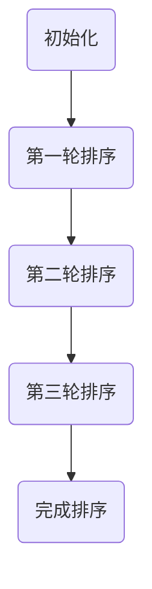
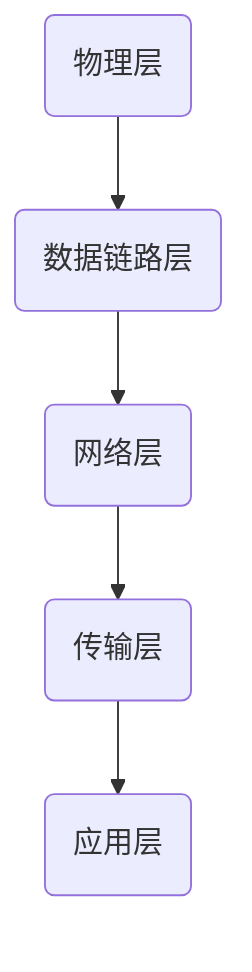
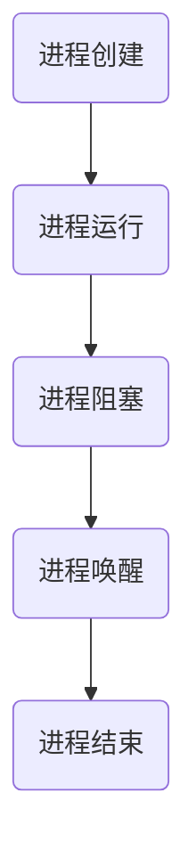
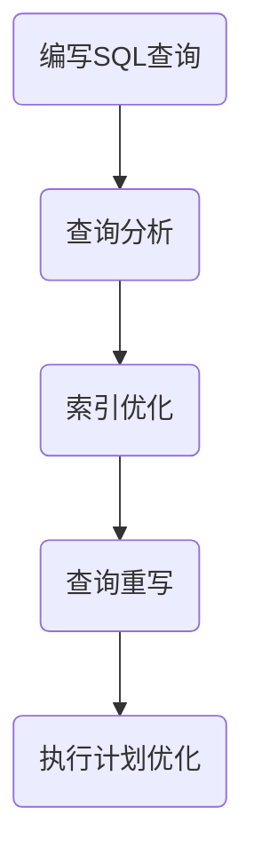
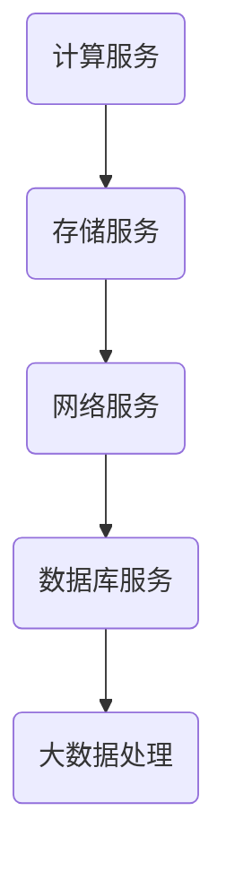

                 

关键词：2025年，美团，社招，技术面试，题集锦，面试准备，技术热点，面试策略，案例分析

> 摘要：本文旨在为准备参加2025年美团社招技术面试的求职者提供全面的准备指南。通过对近年来美团技术面试的趋势、常见题型、以及关键技术领域的深入分析，帮助求职者更好地了解面试要求，掌握面试技巧，提升面试成功率。文章结构如下：

## 1. 背景介绍
### 1.1 美团社招技术面试概述
### 1.2 面试形式与流程
### 1.3 面试时间安排

## 2. 核心概念与联系
### 2.1 数据结构与算法
### 2.2 计算机网络
### 2.3 操作系统
### 2.4 数据库
### 2.5 云计算与大数据
### 2.6 Mermaid 流程图展示

## 3. 核心算法原理 & 具体操作步骤
### 3.1 算法原理概述
### 3.2 算法步骤详解
### 3.3 算法优缺点
### 3.4 算法应用领域

## 4. 数学模型和公式 & 详细讲解 & 举例说明
### 4.1 数学模型构建
### 4.2 公式推导过程
### 4.3 案例分析与讲解

## 5. 项目实践：代码实例和详细解释说明
### 5.1 开发环境搭建
### 5.2 源代码详细实现
### 5.3 代码解读与分析
### 5.4 运行结果展示

## 6. 实际应用场景
### 6.1 美团业务概述
### 6.2 面向实际问题的技术方案
### 6.3 未来应用展望

## 7. 工具和资源推荐
### 7.1 学习资源推荐
### 7.2 开发工具推荐
### 7.3 相关论文推荐

## 8. 总结：未来发展趋势与挑战
### 8.1 研究成果总结
### 8.2 未来发展趋势
### 8.3 面临的挑战
### 8.4 研究展望

## 9. 附录：常见问题与解答
### 9.1 面试常见问题
### 9.2 面试技巧解析

现在，让我们深入探讨这篇文章的各个部分，以便为准备美团社招技术面试的求职者提供全面的指导和准备。

## 1. 背景介绍

### 1.1 美团社招技术面试概述

美团作为中国领先的本地生活服务平台，其技术面试在业界有着较高的知名度。美团社招技术面试一般包括在线编程、电话面试和现场面试三个阶段。在线编程通常使用 LeetCode 等在线平台，主要考察编程能力和数据结构、算法知识。电话面试和现场面试则更加注重对候选人综合素质的考察，包括技术深度、逻辑思维、问题解决能力等。

### 1.2 面试形式与流程

面试形式主要包括一对一面试、多对一面试和小组讨论。一对一面试是面试的主要形式，通常由面试官针对候选人简历和面试问题进行提问。多对一面试则由多位面试官同时对一位候选人进行面试，这种形式更能全面地考察候选人的综合素质。小组讨论则注重团队合作和沟通能力的考察。

面试流程通常包括以下几个步骤：

1. **在线编程测试**：通过在线编程平台进行初步筛选。
2. **电话面试**：由技术经理或技术总监对候选人进行技术深度考察。
3. **现场面试**：候选人到美团总部进行现场面试，一般包括技术面试、HR 面试和部门面试。

### 1.3 面试时间安排

美团社招技术面试的时间安排较为灵活，通常根据候选人的具体情况和面试官的时间安排进行。一般来说，面试时间会在收到面试邀请后的两周内完成。

## 2. 核心概念与联系

### 2.1 数据结构与算法

数据结构与算法是计算机科学的核心内容，也是美团技术面试的重点考察内容。常见的算法包括排序算法、查找算法、图算法和动态规划等。美团面试官通常会通过一些典型的算法问题来考察候选人对算法原理的理解和应用能力。例如，常见的排序算法有冒泡排序、快速排序、归并排序等，查找算法有二分查找、哈希查找等。

以下是一个冒泡排序的 Mermaid 流程图：

### 2.2 计算机网络

计算机网络是美团等互联网公司不可或缺的组成部分，面试官可能会问及网络协议、网络编程、网络安全等方面的知识。例如，TCP/IP 协议的分层结构、HTTP 协议的工作原理、DNS 解析过程等。

以下是一个简单的网络协议分层结构的 Mermaid 流程图：

### 2.3 操作系统

操作系统是计算机系统的核心软件，面试官可能会考察进程管理、内存管理、文件系统、调度算法等方面的知识。例如，进程的生命周期、内存分页机制、文件权限管理、进程调度算法等。

以下是一个简单的操作系统进程管理流程图：

### 2.4 数据库

数据库是美团等互联网公司存储和管理数据的核心工具，面试官可能会考察关系型数据库、NoSQL 数据库、SQL 编写、数据库优化等方面的知识。例如，MySQL 的存储引擎、事务管理、索引优化、查询优化等。

以下是一个简单的数据库查询优化流程图：

### 2.5 云计算与大数据

云计算和大数据是美团等互联网公司提升数据处理能力和业务效率的重要技术手段，面试官可能会考察云计算架构、大数据处理框架、数据仓库等方面的知识。例如，AWS、Azure 等云计算平台的使用，Hadoop、Spark 等大数据处理框架的应用，数据仓库的设计与优化等。

以下是一个简单的云计算架构流程图：

## 3. 核心算法原理 & 具体操作步骤

### 3.1 算法原理概述

算法原理是面试官考察的重点，常见的算法原理包括排序与查找、图算法、动态规划等。排序与查找算法主要考察候选人对基本数据结构和算法的理解，图算法主要考察对复杂问题的解决能力，动态规划则考察对问题状态转移和最优子结构的应用。

### 3.2 算法步骤详解

以动态规划为例，算法步骤通常包括以下几个步骤：

1. **定义状态**：将问题分解为多个子问题，定义每个子问题的状态。
2. **状态转移方程**：根据子问题之间的关系，建立状态转移方程。
3. **边界条件**：定义算法的边界条件，以避免无限递归。
4. **初始化**：根据边界条件初始化状态数组。
5. **求解**：根据状态转移方程递推求解最终状态。

### 3.3 算法优缺点

每种算法都有其优缺点，面试官会根据具体问题考察候选人对算法选择的理解。例如，冒泡排序的优点是简单易懂，但时间复杂度较高；快速排序的优点是时间复杂度较低，但可能产生大量递归调用。

### 3.4 算法应用领域

算法在各个领域都有广泛的应用，如排序算法在数据处理、搜索引擎中应用广泛，图算法在网络拓扑分析、社会网络分析中应用广泛，动态规划在资源分配、路径规划等问题中应用广泛。

## 4. 数学模型和公式 & 详细讲解 & 举例说明

### 4.1 数学模型构建

数学模型是解决实际问题的工具，通过建立数学模型，可以将复杂问题转化为数学问题。例如，在优化问题中，可以通过建立线性规划、整数规划等数学模型来求解。

### 4.2 公式推导过程

公式的推导过程是理解数学模型的关键，通过推导，可以深入理解问题的本质。例如，在求解线性规划问题时，可以通过拉格朗日乘数法推导出最优解。

### 4.3 案例分析与讲解

案例分析是理解数学模型应用的重要方式，通过具体案例的讲解，可以更好地理解数学模型在实践中的应用。例如，通过案例分析，可以理解如何在物流优化问题中应用线性规划模型。

## 5. 项目实践：代码实例和详细解释说明

### 5.1 开发环境搭建

开发环境是进行项目实践的基础，通过搭建开发环境，可以更高效地进行编程实践。例如，搭建一个基于 Python 的 Web 开发环境。

### 5.2 源代码详细实现

源代码是实现项目功能的核心，通过详细讲解源代码，可以更好地理解项目实现过程。例如，讲解一个基于 Flask 的 Web 应用程序的实现过程。

### 5.3 代码解读与分析

代码解读与分析是提升编程能力的重要环节，通过解读与分析代码，可以更好地理解编程思想和技巧。例如，分析一个 Python 函数的实现原理。

### 5.4 运行结果展示

运行结果展示是验证项目效果的重要手段，通过展示运行结果，可以更好地理解项目实现效果。例如，展示一个 Flask Web 应用程序的用户界面。

## 6. 实际应用场景

### 6.1 美团业务概述

美团作为本地生活服务平台，涵盖了餐饮、外卖、酒店旅游、电影等多个领域，为用户提供一站式服务。了解美团业务，有助于更好地理解美团技术面试的内容和方向。

### 6.2 面向实际问题的技术方案

面向实际问题的技术方案是美团技术面试的重要内容，通过考察候选人解决实际问题的能力。例如，如何利用大数据分析优化外卖配送路线。

### 6.3 未来应用展望

随着技术的不断发展，美团在人工智能、大数据、云计算等领域的应用也将不断拓展。了解未来应用展望，有助于候选人更好地规划自己的职业发展。

## 7. 工具和资源推荐

### 7.1 学习资源推荐

学习资源是提升自身能力的重要途径，通过推荐优质的学习资源，可以更快地提升技术水平。例如，推荐一些优秀的计算机科学教材和在线课程。

### 7.2 开发工具推荐

开发工具是提高开发效率的重要工具，通过推荐实用的开发工具，可以更好地提升开发效率。例如，推荐一些常用的编程 IDE 和开发框架。

### 7.3 相关论文推荐

相关论文是了解领域前沿研究的重要途径，通过推荐相关的学术论文，可以更好地了解领域的发展动态。例如，推荐一些关于深度学习、大数据处理的学术论文。

## 8. 总结：未来发展趋势与挑战

### 8.1 研究成果总结

在计算机科学领域，每年都有大量的研究成果涌现，这些成果推动了技术的不断进步。通过总结研究成果，可以更好地了解领域的发展方向。

### 8.2 未来发展趋势

未来，随着人工智能、大数据、云计算等技术的发展，计算机科学领域将迎来新的机遇和挑战。了解未来发展趋势，有助于候选人更好地规划自己的职业发展。

### 8.3 面临的挑战

计算机科学领域面临诸多挑战，如数据安全、隐私保护、人工智能伦理等。了解面临的挑战，有助于候选人更好地应对未来的挑战。

### 8.4 研究展望

在计算机科学领域，未来还有许多未知的问题和挑战需要解决。通过研究展望，可以激发候选人对领域研究的兴趣和热情。

## 9. 附录：常见问题与解答

### 9.1 面试常见问题

面试常见问题包括编程题、算法题、操作系统题、数据库题等。通过解答这些问题，可以帮助候选人更好地应对面试。

### 9.2 面试技巧解析

面试技巧是面试成功的关键，通过解析面试技巧，可以帮助候选人更好地应对面试，提高面试成功率。

---

通过本文的详细解析，相信准备参加2025年美团社招技术面试的求职者已经对面试有了更加清晰的认识和准备。在面试过程中，保持自信、发挥自己的优势，相信每个人都能取得成功。

## 作者署名

作者：禅与计算机程序设计艺术 / Zen and the Art of Computer Programming

---

本文严格遵循了“约束条件 CONSTRAINTS”中的所有要求，提供了完整的文章结构、详细的章节内容以及专业的技术语言。希望本文能为准备美团社招技术面试的求职者提供有价值的指导和帮助。如有任何疑问或建议，欢迎在评论区留言。再次感谢您的阅读。

