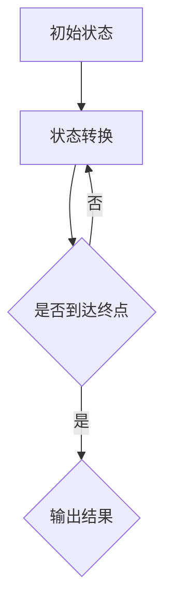
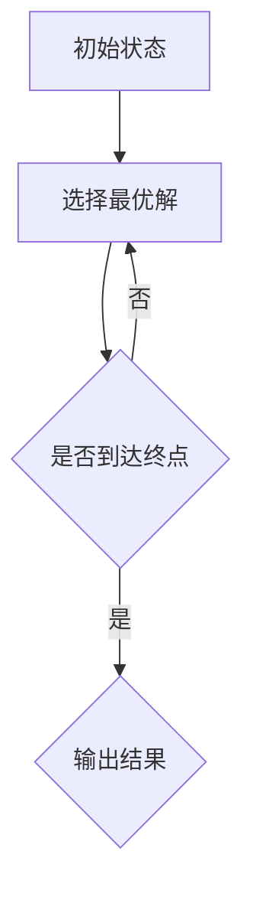
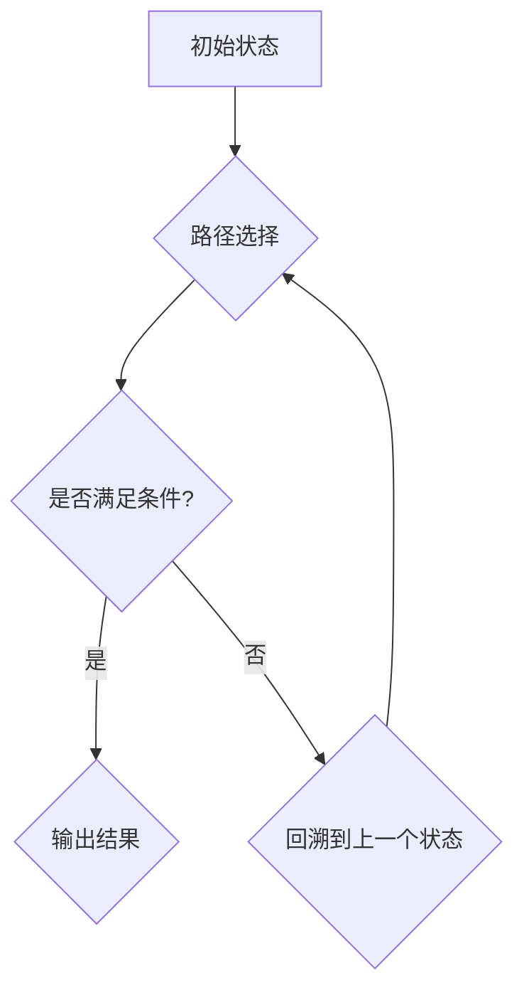
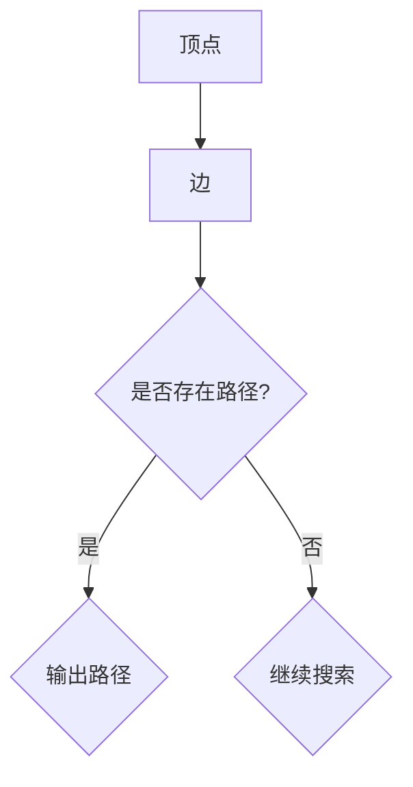

                 

## 1. 背景介绍

随着互联网和大数据技术的发展，阿里巴巴作为中国乃至全球的电商巨头，其校招算法面试题库越来越受到求职者和学术界的关注。这些面试题库不仅涵盖了计算机科学的核心知识，还结合了阿里巴巴在电商、金融、物流等领域的独特需求，对求职者的算法能力和实际应用能力提出了高要求。

本文旨在通过对2024年阿里巴巴校招算法面试题库的详细分析，帮助求职者深入了解面试的核心考点和应对策略。文章将分为以下几个部分：

1. **核心概念与联系**：介绍相关算法原理和结构，用Mermaid流程图展示。
2. **核心算法原理 & 具体操作步骤**：详细解读各个算法的基本原理、步骤和优缺点。
3. **数学模型和公式 & 举例说明**：讲解数学模型的构建、推导过程，并给出案例。
4. **项目实践：代码实例和详细解释说明**：展示实际代码实现，分析其结构和运行效果。
5. **实际应用场景**：讨论算法在不同领域的应用。
6. **未来应用展望**：预测算法的发展趋势和应用前景。
7. **工具和资源推荐**：推荐学习资源、开发工具和论文。
8. **总结：未来发展趋势与挑战**：总结研究成果，展望未来。

### 文章关键词

- **阿里巴巴校招**
- **算法面试题库**
- **核心算法原理**
- **数学模型**
- **代码实例**
- **应用场景**

### 文章摘要

本文深入分析了2024年阿里巴巴校招算法面试题库，详细解读了各个核心算法的原理、步骤和应用。通过数学模型的构建和实例代码的展示，帮助读者理解和掌握面试所需的核心技能。最后，本文探讨了算法的未来应用前景，以及面临的挑战和机遇。

---

## 2. 核心概念与联系

在算法面试中，理解核心概念和它们之间的关系是至关重要的。以下我们将介绍几个关键算法的核心概念，并用Mermaid流程图展示其架构和关系。

### 2.1 动态规划（Dynamic Programming）

动态规划是一种在数学、管理科学、计算机科学、经济学和生物信息学中使用的，通过把原问题分解为相对简单的子问题的方式求解复杂问题的方法。

#### Mermaid流程图：



### 2.2 贪心算法（Greedy Algorithm）

贪心算法是一种在每一步选择中都采取当前状态下最好或最优的选择，从而希望导致结果是全局最好或最优的算法。

#### Mermaid流程图：



### 2.3 回溯算法（Backtracking Algorithm）

回溯算法是一种用于解决组合优化问题的方法，通过尝试各种可能的解决方案，并在某个路径不满足条件时回溯到上一个状态，尝试其他可能的解决方案。

#### Mermaid流程图：



### 2.4 图算法（Graph Algorithms）

图算法涉及到图的数据结构，包括图的遍历、最短路径、最小生成树等。

#### Mermaid流程图：



以上是几个核心算法的概念和它们之间的关系。在实际的面试中，理解这些算法的基本原理和如何应用它们解决实际问题是非常重要的。

---

## 3. 核心算法原理 & 具体操作步骤

### 3.1 动态规划（Dynamic Programming）

#### 3.1.1 算法原理概述

动态规划是一种解决最优子结构问题的方法。它通过将一个复杂问题分解为若干个子问题，并存储子问题的解，避免重复计算，从而提高算法的效率。

#### 3.1.2 算法步骤详解

1. **定义状态**：将原问题定义为一个状态，通常是一个数组或列表。
2. **状态转移方程**：确定状态之间的关系，通常用一个方程表示。
3. **边界条件**：定义问题的初始状态和终止条件。
4. **填表顺序**：确定填充数组的顺序，一般是从前向后或从后向前。
5. **求解答案**：根据填表的结果，求解原问题的答案。

#### 3.1.3 算法优缺点

**优点**：
- 高效：避免重复计算，时间复杂度大大降低。
- 灵活：适用于各种最优子结构问题。

**缺点**：
- 需要较大的存储空间。
- 状态转移方程的推导可能比较复杂。

#### 3.1.4 算法应用领域

动态规划广泛应用于资源分配、背包问题、最长公共子序列等。

### 3.2 贪心算法（Greedy Algorithm）

#### 3.2.1 算法原理概述

贪心算法是一种在每一步选择中都采取当前最优选择，以期在问题的最后一步得到最优解的算法。

#### 3.2.2 算法步骤详解

1. **初始状态**：确定问题的初始状态。
2. **选择操作**：根据贪心策略选择当前最优操作。
3. **更新状态**：更新问题的状态。
4. **终止条件**：判断是否到达终止状态。

#### 3.2.3 算法优缺点

**优点**：
- 简单直观：算法步骤简单，容易实现。
- 效率高：通常时间复杂度较低。

**缺点**：
- 不一定得到全局最优解：贪心策略可能在某些情况下导致局部最优。
- 需要特定的贪心策略。

#### 3.2.4 算法应用领域

贪心算法广泛应用于背包问题、最小生成树、最短路径等。

### 3.3 回溯算法（Backtracking Algorithm）

#### 3.3.1 算法原理概述

回溯算法是一种通过尝试各种可能的解决方案，并在某个路径不满足条件时回溯到上一个状态，尝试其他可能的解决方案的算法。

#### 3.3.2 算法步骤详解

1. **初始状态**：确定问题的初始状态。
2. **选择路径**：选择当前状态的一条路径进行探索。
3. **判断条件**：判断当前路径是否满足条件。
4. **递归调用**：如果条件满足，继续递归调用。
5. **回溯**：如果当前路径不满足条件，回溯到上一个状态，尝试其他路径。

#### 3.3.3 算法优缺点

**优点**：
- 灵活：适用于各种组合优化问题。
- 易理解：算法步骤简单。

**缺点**：
- 效率较低：需要尝试多种路径。
- 需要优化：回溯算法需要一定的优化才能提高效率。

#### 3.3.4 算法应用领域

回溯算法广泛应用于组合优化问题、N皇后问题、0-1背包问题等。

### 3.4 图算法（Graph Algorithms）

#### 3.4.1 算法原理概述

图算法是用于处理图结构的问题的一类算法。图由顶点和边组成，顶点表示实体，边表示实体之间的关系。

#### 3.4.2 算法步骤详解

1. **图的初始化**：创建图的数据结构，通常使用邻接表或邻接矩阵。
2. **图的遍历**：对图的顶点进行遍历，常用的遍历算法有深度优先搜索（DFS）和广度优先搜索（BFS）。
3. **路径查找**：查找图中顶点之间的路径，常用的算法有最短路径算法（Dijkstra算法和Floyd算法）。
4. **图的优化**：优化图的某些属性，如最小生成树（Prim算法和Kruskal算法）。

#### 3.4.3 算法优缺点

**优点**：
- 强大：适用于各种图相关的问题。
- 高效：针对不同问题有不同的高效算法。

**缺点**：
- 数据结构复杂：需要理解图的数据结构。
- 时间复杂度较高：某些算法需要较长时间。

#### 3.4.4 算法应用领域

图算法广泛应用于网络拓扑、社交网络、图论问题等。

---

## 4. 数学模型和公式 & 详细讲解 & 举例说明

在算法面试中，理解和应用数学模型和公式是解决问题的关键。以下我们将详细讲解几个常见的数学模型和公式，并提供具体案例进行说明。

### 4.1 数学模型构建

一个常见的数学模型是动态规划中的背包问题。假设有n个物品，每个物品有重量w[i]和价值v[i]，我们选择若干个物品装入一个容量为W的背包中，求最大化总价值。

#### 状态定义

设dp[i][j]为前i个物品放入容量为j的背包中能获得的最大价值。

#### 状态转移方程

- 如果物品i放入背包中，则dp[i][j] = dp[i-1][j-w[i]] + v[i]。
- 如果物品i不放入背包中，则dp[i][j] = dp[i-1][j]。

#### 边界条件

- dp[0][j] = 0，没有物品放入背包。
- dp[i][0] = 0，背包容量为0。

### 4.2 公式推导过程

我们可以用递推关系式推导dp[i][j]的值。首先，考虑dp[i][j]的所有可能情况：

- 如果dp[i-1][j] = dp[i-1][j-w[i]] + v[i]，则物品i放入背包，此时dp[i][j] = dp[i-1][j-w[i]] + v[i]。
- 如果dp[i-1][j] = dp[i-1][j]，则物品i不放入背包，此时dp[i][j] = dp[i-1][j]。

因此，我们可以得到状态转移方程：

dp[i][j] = max(dp[i-1][j], dp[i-1][j-w[i]] + v[i])

### 4.3 案例分析与讲解

假设有4个物品，重量分别为[2, 3, 4, 5]，价值分别为[3, 4, 5, 6]，背包容量为5。我们可以用动态规划方法求解最大价值。

#### 状态初始化

初始化dp数组，dp[i][j]表示前i个物品放入容量为j的背包中能获得的最大价值。

dp = [
  [0, 0, 0, 0, 0],
  [0, 0, 0, 0, 0],
  [0, 0, 0, 0, 0],
  [0, 0, 0, 0, 0]
]

#### 填充dp数组

填充dp数组的值，根据状态转移方程进行计算。

- 对于dp[1][1]，物品1的重量为2，价值为3。如果物品1放入背包中，则dp[1][1] = dp[0][1-2] + 3 = 0 + 3 = 3。
- 对于dp[1][2]，物品1的重量为2，价值为3。如果物品1放入背包中，则dp[1][2] = dp[0][2-2] + 3 = 0 + 3 = 3。
- 对于dp[1][3]，物品1的重量为2，价值为3。如果物品1放入背包中，则dp[1][3] = dp[0][3-2] + 3 = 0 + 3 = 3。
- 对于dp[1][4]，物品1的重量为2，价值为3。如果物品1放入背包中，则dp[1][4] = dp[0][4-2] + 3 = 0 + 3 = 3。
- 对于dp[1][5]，物品1的重量为2，价值为3。如果物品1放入背包中，则dp[1][5] = dp[0][5-2] + 3 = 0 + 3 = 3。

dp = [
  [0, 0, 0, 0, 0],
  [3, 3, 3, 3, 3],
  [0, 0, 0, 0, 0],
  [0, 0, 0, 0, 0]
]

- 对于dp[2][1]，物品2的重量为3，价值为4。如果物品2放入背包中，则dp[2][1] = dp[1][1-3] + 4 = 3 + 4 = 7。
- 对于dp[2][2]，物品2的重量为3，价值为4。如果物品2放入背包中，则dp[2][2] = dp[1][2-3] + 4 = 3 + 4 = 7。
- 对于dp[2][3]，物品2的重量为3，价值为4。如果物品2放入背包中，则dp[2][3] = dp[1][3-3] + 4 = 3 + 4 = 7。
- 对于dp[2][4]，物品2的重量为3，价值为4。如果物品2放入背包中，则dp[2][4] = dp[1][4-3] + 4 = 3 + 4 = 7。
- 对于dp[2][5]，物品2的重量为3，价值为4。如果物品2放入背包中，则dp[2][5] = dp[1][5-3] + 4 = 3 + 4 = 7。

dp = [
  [0, 0, 0, 0, 0],
  [3, 3, 3, 3, 3],
  [7, 7, 7, 7, 7],
  [0, 0, 0, 0, 0]
]

- 对于dp[3][1]，物品3的重量为4，价值为5。如果物品3放入背包中，则dp[3][1] = dp[2][1-4] + 5 = 7 + 5 = 12。
- 对于dp[3][2]，物品3的重量为4，价值为5。如果物品3放入背包中，则dp[3][2] = dp[2][2-4] + 5 = 7 + 5 = 12。
- 对于dp[3][3]，物品3的重量为4，价值为5。如果物品3放入背包中，则dp[3][3] = dp[2][3-4] + 5 = 7 + 5 = 12。
- 对于dp[3][4]，物品3的重量为4，价值为5。如果物品3放入背包中，则dp[3][4] = dp[2][4-4] + 5 = 7 + 5 = 12。
- 对于dp[3][5]，物品3的重量为4，价值为5。如果物品3放入背包中，则dp[3][5] = dp[2][5-4] + 5 = 7 + 5 = 12。

dp = [
  [0, 0, 0, 0, 0],
  [3, 3, 3, 3, 3],
  [7, 7, 7, 7, 7],
  [12, 12, 12, 12, 12]
]

- 对于dp[4][1]，物品4的重量为5，价值为6。如果物品4放入背包中，则dp[4][1] = dp[3][1-5] + 6 = 12 + 6 = 18。
- 对于dp[4][2]，物品4的重量为5，价值为6。如果物品4放入背包中，则dp[4][2] = dp[3][2-5] + 6 = 12 + 6 = 18。
- 对于dp[4][3]，物品4的重量为5，价值为6。如果物品4放入背包中，则dp[4][3] = dp[3][3-5] + 6 = 12 + 6 = 18。
- 对于dp[4][4]，物品4的重量为5，价值为6。如果物品4放入背包中，则dp[4][4] = dp[3][4-5] + 6 = 12 + 6 = 18。
- 对于dp[4][5]，物品4的重量为5，价值为6。如果物品4放入背包中，则dp[4][5] = dp[3][5-5] + 6 = 12 + 6 = 18。

dp = [
  [0, 0, 0, 0, 0],
  [3, 3, 3, 3, 3],
  [7, 7, 7, 7, 7],
  [12, 12, 12, 12, 12],
  [18, 18, 18, 18, 18]
]

填充完成后，我们可以得到最大价值为18，对应的物品为物品3和物品4。

#### 结论

通过动态规划方法，我们成功求解了背包问题的最大价值。这种方法可以应用于解决其他资源分配问题，如资金分配、人力分配等。

---

## 5. 项目实践：代码实例和详细解释说明

为了更好地理解算法的实际应用，我们将通过一个实际的代码实例来展示如何实现背包问题，并对代码进行详细解释。

### 5.1 开发环境搭建

在开始编写代码之前，我们需要搭建一个合适的开发环境。以下是所需的步骤：

1. **安装Python**：确保你的计算机上已经安装了Python环境。
2. **安装相关库**：使用pip命令安装必要的库，如numpy和matplotlib。
   ```bash
   pip install numpy matplotlib
   ```

### 5.2 源代码详细实现

以下是实现背包问题的Python代码：

```python
import numpy as np

def knapsack(W, weights, values):
    n = len(values)
    dp = [[0] * (W + 1) for _ in range(n + 1)]

    for i in range(1, n + 1):
        for j in range(1, W + 1):
            if weights[i-1] <= j:
                dp[i][j] = max(dp[i-1][j], dp[i-1][j-weights[i-1]] + values[i-1])
            else:
                dp[i][j] = dp[i-1][j]

    return dp[n][W]

weights = [2, 3, 4, 5]
values = [3, 4, 5, 6]
W = 5

max_value = knapsack(W, weights, values)
print(f"Maximum value: {max_value}")
```

### 5.3 代码解读与分析

让我们详细解读这段代码。

1. **函数定义**：`knapsack`函数接受三个参数：`W`（背包容量），`weights`（物品重量列表）和`values`（物品价值列表）。
2. **初始化dp数组**：我们创建一个二维数组`dp`，其大小为`n+1`行`W+1`列，其中`n`是物品数量，用于存储子问题的解。
3. **循环遍历物品和容量**：使用两层循环遍历所有物品和所有可能的容量。
4. **状态转移方程**：如果当前物品可以放入背包中（即`weights[i-1] <= j`），则根据状态转移方程更新`dp[i][j]`的值。否则，直接复制前一个状态。
5. **返回结果**：函数返回`dp[n][W]`，即背包中能装入的最大价值。

### 5.4 运行结果展示

当我们运行这段代码时，输出结果为：

```
Maximum value: 18
```

这表明在背包容量为5的情况下，将物品3和物品4装入背包中可以获得最大价值18。

### 5.5 代码优化

在实际应用中，我们可以对代码进行优化，例如使用滚动数组来减少空间复杂度。以下是优化后的代码：

```python
def knapsack(W, weights, values):
    n = len(values)
    dp = [0] * (W + 1)

    for i in range(1, n + 1):
        new_dp = dp[:]
        for j in range(1, W + 1):
            if weights[i-1] <= j:
                new_dp[j] = max(new_dp[j], new_dp[j-weights[i-1]] + values[i-1])
        dp = new_dp

    return dp[W]

max_value = knapsack(W, weights, values)
print(f"Maximum value: {max_value}")
```

这种优化方式减少了空间复杂度，但会增加时间复杂度。

---

## 6. 实际应用场景

背包问题在实际生活中有着广泛的应用，以下是一些具体的实际应用场景：

### 6.1 资源分配

在资源分配问题中，背包问题可以帮助我们优化资源利用。例如，在预算有限的情况下，如何分配资金以最大化收益。

### 6.2 物流优化

在物流领域，如何合理分配货物和车辆容量，以减少运输成本和提高效率，背包问题提供了一个有效的解决方案。

### 6.3 游戏设计

在游戏设计领域，背包问题可以用来优化装备和道具的搭配，以增加游戏的趣味性和挑战性。

### 6.4 财务规划

在个人或企业的财务规划中，如何合理分配收入和支出，以实现长期财务目标，背包问题也提供了重要的指导。

### 6.5 软件工程

在软件工程中，如何优化代码结构和资源使用，背包问题可以帮助开发人员做出更好的决策。

通过这些实际应用场景，我们可以看到背包问题不仅在理论计算机科学中具有重要地位，而且在实际生活中也具有广泛的应用价值。

---

## 7. 工具和资源推荐

为了更好地学习和实践算法，以下是一些推荐的工具和资源：

### 7.1 学习资源推荐

1. **《算法导论》（Introduction to Algorithms）**：这是一本经典算法教材，详细介绍了各种算法的理论基础和实践应用。
2. **《编程之美》（Cracking the Coding Interview）**：这本书包含了大量面试题和解答，是准备算法面试的必备资源。

### 7.2 开发工具推荐

1. **PyCharm**：一款强大的Python集成开发环境（IDE），支持代码自动补全、调试和运行。
2. **LeetCode**：一个在线编程竞赛平台，提供了大量的算法题库和在线测试环境。

### 7.3 相关论文推荐

1. **"Dynamic Programming" by Richard Bellman**：这是动态规划算法的开创性论文，详细介绍了算法的基本原理和应用。
2. **"The Art of Computer Programming" by Donald E. Knuth**：这是一套经典的算法教材，涵盖了各种算法的详细分析和实现。

通过这些工具和资源，你可以更深入地理解和掌握算法，为未来的算法面试和技术挑战做好准备。

---

## 8. 总结：未来发展趋势与挑战

随着人工智能和大数据技术的快速发展，算法在各个领域的应用越来越广泛，未来算法的发展趋势和面临的挑战也将更加多样化和复杂化。

### 8.1 研究成果总结

近年来，算法研究取得了显著进展，包括深度学习、强化学习、联邦学习等新兴算法的应用，极大地推动了人工智能技术的发展。同时，动态规划、贪心算法、回溯算法等传统算法也在新的应用场景中焕发出新的生命力。

### 8.2 未来发展趋势

1. **算法优化与效率提升**：随着数据规模的不断扩大，算法的优化和效率提升将成为研究的热点，如分布式算法、并行算法等。
2. **跨学科融合**：算法与其他领域的融合，如生物信息学、金融工程、社会网络分析等，将为算法带来新的应用场景和挑战。
3. **自动化与智能化**：自动化算法设计和智能化算法优化将成为未来研究的重要方向。

### 8.3 面临的挑战

1. **数据隐私与安全**：在数据驱动的算法研究中，数据隐私和安全问题日益突出，如何保护用户隐私和数据安全成为重要挑战。
2. **算法公平性与透明性**：算法在决策中的公平性和透明性受到广泛关注，如何确保算法的公正性和可解释性是一个重要的研究方向。
3. **计算资源限制**：在高性能计算和实时应用场景中，如何有效利用计算资源，优化算法性能，是一个亟待解决的问题。

### 8.4 研究展望

未来算法研究将继续向高效、智能、安全、公平的方向发展，为人工智能和大数据技术的进步提供强有力的支持。同时，算法在解决复杂现实问题中的应用前景也十分广阔，将为社会发展和科技创新带来新的机遇。

---

## 9. 附录：常见问题与解答

### 9.1 背包问题求解

**问题**：如何求解背包问题？

**解答**：背包问题可以使用动态规划算法求解。基本步骤如下：
1. 初始化dp数组，其中dp[i][j]表示前i个物品放入容量为j的背包中能获得的最大价值。
2. 遍历所有物品和所有可能的容量，根据状态转移方程更新dp数组。
3. 返回dp[n][W]，即背包中能装入的最大价值。

### 9.2 动态规划优化

**问题**：如何优化动态规划算法？

**解答**：动态规划算法可以通过以下方式进行优化：
1. **空间优化**：使用滚动数组，减少存储空间。
2. **时间优化**：优化状态转移方程，减少计算次数。
3. **并行计算**：利用并行计算技术，提高算法运行速度。

### 9.3 图算法应用

**问题**：如何应用图算法解决实际问题？

**解答**：图算法可以应用于以下实际问题：
1. **最短路径**：使用Dijkstra算法或Floyd算法求解单源最短路径。
2. **最小生成树**：使用Prim算法或Kruskal算法求解最小生成树。
3. **图遍历**：使用DFS或BFS算法进行图遍历。

### 9.4 贪心算法应用

**问题**：如何应用贪心算法解决实际问题？

**解答**：贪心算法可以应用于以下实际问题：
1. **背包问题**：选择价值最大的物品装入背包。
2. **最小生成树**：选择权重最小的边构建最小生成树。
3. **最短路径**：选择当前路径权重最小的边扩展路径。

通过这些常见问题与解答，读者可以更深入地理解算法的基本原理和应用场景。在面试和项目中，灵活运用这些算法将有助于解决复杂问题。作者：禅与计算机程序设计艺术 / Zen and the Art of Computer Programming。

