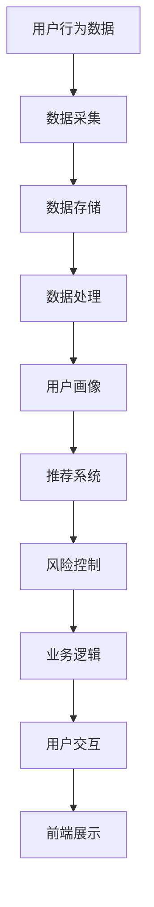
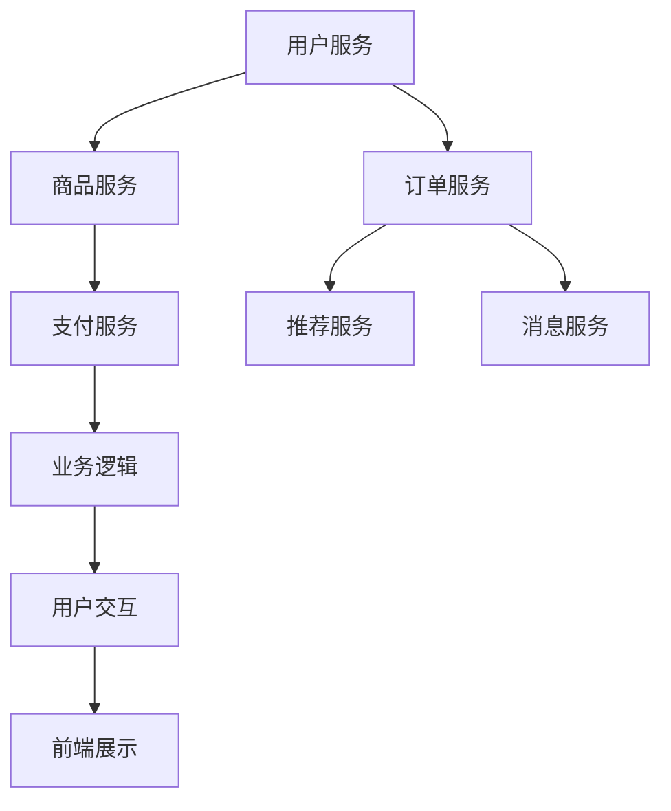
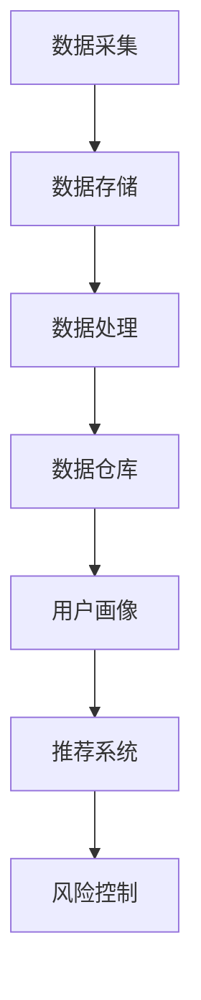
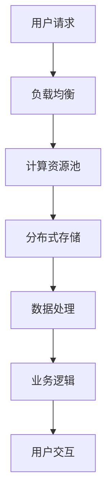

                 

  
## 引言

随着电子商务行业的迅速发展，社交电商平台已成为市场的重要组成部分。阿里巴巴作为中国电子商务的领军企业，其社交电商平台架构的优化与升级显得尤为重要。作为一位即将进入阿里巴巴社交电商平台架构师岗位的候选人，准备一次成功的面试显得至关重要。本文旨在为您提供一个全面的面试指南，涵盖核心技术、项目实践、数学模型、实际应用场景等多方面内容，帮助您在面试中脱颖而出。

## 1. 背景介绍

阿里巴巴社交电商平台起源于2013年，最初通过淘宝社交功能试水社交电商，随后迅速发展壮大，成为行业的重要力量。截至2023年，阿里巴巴旗下的社交电商平台包括淘宝直播、1688社交、天猫社交等，覆盖用户超过10亿。这些平台不仅提供了传统的购物功能，还结合了社交元素，实现了购物与社交的完美融合。

### 1.1 社交电商平台架构演变

阿里巴巴社交电商平台架构经历了多次演变，从最初的简单前端架构到如今复杂的大数据与云计算架构，每一个阶段都体现了技术进步和业务需求的提升。

- **1.1.1 2013年：初步探索**
  阿里巴巴在淘宝上引入了社交功能，尝试将社交与电商相结合。这一阶段主要采用了前端开发技术，通过简单的网页设计和社交接口，实现了基础的社交电商功能。

- **1.1.2 2015年：发展壮大**
  随着用户需求的增加和社交功能的深入，阿里巴巴开始采用微服务架构，将不同功能模块化，提高了系统的可扩展性和稳定性。同时，大数据和机器学习技术的应用，使得个性化推荐成为可能。

- **1.1.3 2020年：全面升级**
  在这一阶段，阿里巴巴全面引入了云计算和大数据技术，实现了全栈架构的升级。平台通过分布式存储、实时计算和边缘计算等新技术，提升了系统的处理能力和响应速度。

### 1.2 社交电商平台技术趋势

未来，社交电商平台技术发展趋势主要体现在以下几个方面：

- **1.2.1 AI与大数据**
  人工智能和大数据技术的进一步融合，将大幅提升平台的智能推荐、用户行为分析和风险控制能力。

- **1.2.2 云原生技术**
  云原生技术如容器化、服务网格和自动化运维，将极大提高平台的弹性和可维护性。

- **1.2.3 网络安全与隐私保护**
  随着数据量的增加和用户隐私意识的提升，网络安全和隐私保护将成为平台技术的重点发展方向。

## 2. 核心概念与联系

为了深入理解社交电商平台架构，我们需要掌握以下几个核心概念：

- **2.1 微服务架构**
  微服务架构将系统拆分为多个独立的小服务，每个服务负责一个特定的功能，提高了系统的可维护性和扩展性。

- **2.2 大数据技术**
  大数据技术包括数据采集、存储、处理和分析等，用于生成用户画像、推荐系统和风险控制等。

- **2.3 云计算技术**
  云计算技术提供了弹性计算资源、分布式存储和数据处理能力，为社交电商平台提供了强大的支持。

下面是一个简单的 Mermaid 流程图，展示社交电商平台架构的几个关键节点：



### 2.1 微服务架构

微服务架构将系统拆分为多个独立的小服务，每个服务负责一个特定的功能，提高了系统的可维护性和扩展性。在社交电商平台中，常见的微服务包括用户服务、商品服务、订单服务、支付服务、推荐服务、消息服务等。

下面是一个简化的 Mermaid 流程图，展示社交电商平台中微服务之间的交互：



### 2.2 大数据技术

大数据技术包括数据采集、存储、处理和分析等，用于生成用户画像、推荐系统和风险控制等。在社交电商平台中，用户行为数据是核心资产，通过大数据技术可以实现对用户行为的深度分析，从而提供个性化的推荐和服务。

下面是一个简化的 Mermaid 流程图，展示大数据技术在社交电商平台中的应用：



### 2.3 云计算技术

云计算技术提供了弹性计算资源、分布式存储和数据处理能力，为社交电商平台提供了强大的支持。通过云计算，平台可以按需扩展资源，提高系统的处理能力和响应速度。

下面是一个简化的 Mermaid 流程图，展示云计算技术在社交电商平台中的应用：



## 3. 核心算法原理 & 具体操作步骤

### 3.1 算法原理概述

社交电商平台的核心算法主要包括用户行为分析、个性化推荐和风险控制等。以下将分别介绍这些算法的原理和具体操作步骤。

#### 3.1.1 用户行为分析

用户行为分析是社交电商平台的核心技术之一，通过对用户在平台上的行为数据进行分析，可以了解用户的需求和偏好，从而提供个性化的服务和推荐。

- **算法原理**：用户行为分析通常采用机器学习算法，如聚类算法、关联规则挖掘等，对用户行为数据进行建模和分析。

- **具体操作步骤**：
  1. 数据采集：收集用户在平台上的浏览、搜索、购买等行为数据。
  2. 数据预处理：对数据进行清洗、去重和格式化，确保数据质量。
  3. 特征提取：从用户行为数据中提取关键特征，如时间、地点、品类、价格等。
  4. 模型训练：使用机器学习算法，对用户行为数据进行建模，生成用户画像。
  5. 预测和推荐：根据用户画像，预测用户可能感兴趣的商品或服务，提供个性化推荐。

#### 3.1.2 个性化推荐

个性化推荐是社交电商平台的重要功能，通过推荐用户可能感兴趣的商品或服务，提高用户满意度和平台销售额。

- **算法原理**：个性化推荐通常采用协同过滤、矩阵分解、深度学习等算法。协同过滤通过分析用户之间的相似性进行推荐，矩阵分解通过分解用户和商品的关系矩阵进行推荐，深度学习则通过神经网络模型进行推荐。

- **具体操作步骤**：
  1. 数据采集：收集用户和商品的历史行为数据，如购买记录、浏览记录、评价等。
  2. 数据预处理：对数据进行清洗、去重和格式化，确保数据质量。
  3. 特征提取：从用户和商品的行为数据中提取关键特征，如用户活跃度、购买频率、商品品类、价格等。
  4. 模型训练：使用机器学习算法，对用户和商品的关系数据进行建模，生成推荐模型。
  5. 推荐生成：根据用户画像和推荐模型，生成个性化的推荐列表。

#### 3.1.3 风险控制

风险控制是保障社交电商平台安全和稳定的重要环节，通过对用户行为进行分析，识别潜在风险并采取相应的控制措施。

- **算法原理**：风险控制通常采用监督学习、无监督学习等算法，如分类算法、聚类算法等。

- **具体操作步骤**：
  1. 数据采集：收集用户在平台上的行为数据，如登录行为、交易行为等。
  2. 数据预处理：对数据进行清洗、去重和格式化，确保数据质量。
  3. 特征提取：从用户行为数据中提取关键特征，如登录频率、交易金额、交易时间等。
  4. 模型训练：使用机器学习算法，对用户行为数据进行建模，生成风险模型。
  5. 风险识别：根据风险模型，识别潜在风险用户和交易，采取相应的控制措施，如增加验证环节、暂停交易等。

### 3.2 算法步骤详解

#### 3.2.1 用户行为分析

1. 数据采集：
   - 从平台服务器日志中收集用户行为数据，包括浏览、搜索、购买等行为。
   - 使用日志分析工具，如ELK（Elasticsearch、Logstash、Kibana）进行数据采集和初步处理。

2. 数据预处理：
   - 清洗数据，去除无效数据和重复数据。
   - 对数据进行格式化，统一数据类型和字段名称。

3. 特征提取：
   - 根据业务需求，提取关键特征，如用户活跃度、购买频率、浏览时长等。
   - 使用特征工程方法，对原始数据进行变换和归一化处理。

4. 模型训练：
   - 选择合适的机器学习算法，如聚类算法、关联规则挖掘等，对用户行为数据进行建模。
   - 使用交叉验证方法，评估模型性能。

5. 预测和推荐：
   - 根据用户画像，预测用户可能感兴趣的商品或服务。
   - 使用协同过滤、矩阵分解等算法，生成个性化推荐列表。

#### 3.2.2 个性化推荐

1. 数据采集：
   - 收集用户和商品的历史行为数据，如购买记录、浏览记录、评价等。
   - 使用数据抓取工具，如Python的BeautifulSoup、Scrapy等，从平台接口获取数据。

2. 数据预处理：
   - 清洗数据，去除无效数据和重复数据。
   - 对数据进行格式化，统一数据类型和字段名称。

3. 特征提取：
   - 从用户和商品的行为数据中提取关键特征，如用户活跃度、购买频率、商品品类、价格等。
   - 使用特征工程方法，对原始数据进行变换和归一化处理。

4. 模型训练：
   - 选择合适的机器学习算法，如协同过滤、矩阵分解、深度学习等，对用户和商品的关系数据进行建模。
   - 使用交叉验证方法，评估模型性能。

5. 推荐生成：
   - 根据用户画像和推荐模型，生成个性化的推荐列表。
   - 使用Top-N推荐算法，选择最相关的N个商品进行推荐。

#### 3.2.3 风险控制

1. 数据采集：
   - 收集用户在平台上的行为数据，如登录行为、交易行为等。
   - 使用日志分析工具，如ELK（Elasticsearch、Logstash、Kibana）进行数据采集和初步处理。

2. 数据预处理：
   - 清洗数据，去除无效数据和重复数据。
   - 对数据进行格式化，统一数据类型和字段名称。

3. 特征提取：
   - 从用户行为数据中提取关键特征，如登录频率、交易金额、交易时间等。
   - 使用特征工程方法，对原始数据进行变换和归一化处理。

4. 模型训练：
   - 选择合适的机器学习算法，如分类算法、聚类算法等，对用户行为数据进行建模。
   - 使用交叉验证方法，评估模型性能。

5. 风险识别：
   - 根据风险模型，识别潜在风险用户和交易。
   - 使用阈值方法，设定风险阈值，对高风险用户和交易采取相应的控制措施。

### 3.3 算法优缺点

#### 3.3.1 用户行为分析

**优点**：
- 能够深入了解用户行为，为个性化推荐和风险控制提供数据支持。
- 提高用户满意度和平台销售额。

**缺点**：
- 需要大量数据支持，数据采集和处理成本较高。
- 特征提取和模型训练过程复杂，对算法工程师的要求较高。

#### 3.3.2 个性化推荐

**优点**：
- 能够提供个性化推荐，提高用户满意度和平台销售额。
- 提高用户参与度和黏性。

**缺点**：
- 推荐算法需要大量数据支持，数据质量对推荐效果有很大影响。
- 需要不断优化和调整算法，以适应不断变化的市场环境。

#### 3.3.3 风险控制

**优点**：
- 能够识别潜在风险用户和交易，保障平台安全和稳定。
- 提高用户信任度和平台信誉。

**缺点**：
- 风险控制算法需要大量数据支持，数据质量对风险识别效果有很大影响。
- 需要平衡风险控制和用户体验，避免过度控制导致用户流失。

### 3.4 算法应用领域

用户行为分析、个性化推荐和风险控制算法广泛应用于社交电商平台，以下列举一些具体的应用场景：

#### 3.4.1 用户行为分析

- 用户画像：通过分析用户行为，生成用户画像，为个性化推荐和精准营销提供数据支持。
- 客户关系管理：通过分析用户行为，优化客户关系管理，提高客户满意度和忠诚度。
- 销售预测：通过分析用户行为，预测未来销售趋势，优化库存管理和供应链。

#### 3.4.2 个性化推荐

- 商品推荐：根据用户行为和偏好，推荐用户可能感兴趣的商品，提高销售额和用户满意度。
- 内容推荐：根据用户行为和偏好，推荐用户可能感兴趣的内容，提高用户黏性和平台活跃度。
- 广告推荐：根据用户行为和偏好，推荐用户可能感兴趣的广告，提高广告点击率和转化率。

#### 3.4.3 风险控制

- 交易风险控制：通过分析用户行为，识别潜在交易风险，采取相应的控制措施，保障平台安全和稳定。
- 账号安全控制：通过分析用户行为，识别潜在账号风险，采取相应的控制措施，保障账号安全和用户隐私。
- 风险预警：通过分析用户行为，预测未来风险，提前采取预防措施，降低风险损失。

## 4. 数学模型和公式 & 详细讲解 & 举例说明

### 4.1 数学模型构建

在社交电商平台中，数学模型广泛应用于用户行为分析、个性化推荐和风险控制等领域。以下分别介绍这些领域的数学模型构建方法。

#### 4.1.1 用户行为分析

用户行为分析通常采用机器学习算法，如聚类算法、关联规则挖掘等。其中，聚类算法是一种无监督学习方法，通过将相似的用户行为数据进行分组，生成用户画像。

- **聚类算法模型**：
  - **目标函数**：最小化组内相似度最大化组间相似度。
  - **算法流程**：
    1. 数据预处理：清洗和标准化用户行为数据。
    2. 初始化聚类中心：随机选择初始聚类中心。
    3. 计算相似度：计算每个用户行为数据与聚类中心的相似度。
    4. 分组：根据相似度，将用户行为数据分配到不同的组。
    5. 更新聚类中心：重新计算每个组的中心点，作为新的聚类中心。
    6. 迭代：重复步骤3-5，直到聚类中心不再发生明显变化。

- **公式表示**：
  $$J=\sum_{i=1}^{k}\sum_{x\in S_i}d(x,m_i)$$
  其中，$J$ 表示目标函数，$k$ 表示聚类个数，$S_i$ 表示第$i$个聚类组，$m_i$ 表示第$i$个聚类中心的均值，$d(x,m_i)$ 表示用户行为数据$x$与聚类中心$m_i$ 的距离。

#### 4.1.2 个性化推荐

个性化推荐通常采用协同过滤、矩阵分解、深度学习等算法。其中，协同过滤是一种基于用户相似度的推荐方法，通过分析用户之间的行为相似性，为用户推荐相似的商品。

- **协同过滤模型**：
  - **目标函数**：最小化预测评分与实际评分之间的误差。
  - **算法流程**：
    1. 数据预处理：清洗和标准化用户行为数据。
    2. 计算用户相似度：计算每个用户与其他用户之间的相似度。
    3. 预测评分：根据用户相似度和已知商品评分，预测用户对未知商品的评分。
    4. 模型优化：使用优化算法，如梯度下降，最小化目标函数。

- **公式表示**：
  $$J=\sum_{u,i}^{}(r_{ui}-\hat{r}_{ui})^2$$
  其中，$J$ 表示目标函数，$r_{ui}$ 表示用户$u$对商品$i$的实际评分，$\hat{r}_{ui}$ 表示用户$u$对商品$i$的预测评分。

#### 4.1.3 风险控制

风险控制通常采用监督学习、无监督学习等算法，通过分析用户行为数据，识别潜在风险。

- **监督学习模型**：
  - **目标函数**：最小化预测风险与实际风险之间的误差。
  - **算法流程**：
    1. 数据预处理：清洗和标准化用户行为数据。
    2. 训练分类模型：使用已标记的风险数据，训练分类模型。
    3. 预测风险：使用训练好的分类模型，预测新用户行为的风险。
    4. 模型优化：使用优化算法，如交叉验证，最小化目标函数。

- **公式表示**：
  $$J=\sum_{u,i}^{}(r_{ui}-\hat{r}_{ui})^2$$
  其中，$J$ 表示目标函数，$r_{ui}$ 表示用户$u$对商品$i$的实际风险评分，$\hat{r}_{ui}$ 表示用户$u$对商品$i$的预测风险评分。

### 4.2 公式推导过程

以下分别介绍用户行为分析、个性化推荐和风险控制领域数学模型的推导过程。

#### 4.2.1 用户行为分析

假设用户行为数据集为$D=\{d_1, d_2, ..., d_n\}$，其中$d_i$表示第$i$个用户的行为数据。我们需要通过聚类算法将这些用户行为数据分为$k$个聚类组$S_1, S_2, ..., S_k$。

1. **目标函数推导**：

   目标函数$J$表示组内相似度最大化组间相似度，即：
   $$J=\sum_{i=1}^{k}\sum_{x\in S_i}d(x,m_i)$$

   其中，$m_i$表示第$i$个聚类中心的均值，$d(x,m_i)$表示用户行为数据$x$与聚类中心$m_i$的距离。

   为了简化推导，我们假设用户行为数据$x$为多维向量，聚类中心$m_i$也为多维向量。根据欧几里得距离公式，$d(x,m_i)$可以表示为：
   $$d(x,m_i)=\sqrt{\sum_{j=1}^{m} (x_j-m_{ij})^2}$$

   将$d(x,m_i)$代入目标函数，得到：
   $$J=\sum_{i=1}^{k}\sum_{x\in S_i}\sqrt{\sum_{j=1}^{m} (x_j-m_{ij})^2}$$

2. **梯度下降求解**：

   为了求解目标函数$J$的最小值，我们可以使用梯度下降法。首先，计算目标函数$J$关于每个聚类中心$m_i$的偏导数：
   $$\frac{\partial J}{\partial m_i}=\sum_{x\in S_i}\frac{\partial}{\partial m_i}\sqrt{\sum_{j=1}^{m} (x_j-m_{ij})^2}$$

   根据链式法则，我们有：
   $$\frac{\partial}{\partial m_i}\sqrt{\sum_{j=1}^{m} (x_j-m_{ij})^2}=\frac{1}{2\sqrt{\sum_{j=1}^{m} (x_j-m_{ij})^2}}\sum_{j=1}^{m}(x_j-m_{ij})$$

   将上式代入偏导数，得到：
   $$\frac{\partial J}{\partial m_i}=\frac{1}{2}\sum_{x\in S_i}\frac{\sum_{j=1}^{m}(x_j-m_{ij})}{\sqrt{\sum_{j=1}^{m} (x_j-m_{ij})^2}}$$

   为了简化计算，我们可以对分子和分母同时除以$|S_i|$：
   $$\frac{\partial J}{\partial m_i}=\frac{1}{2|S_i|}\sum_{x\in S_i}\frac{\sum_{j=1}^{m}(x_j-m_{ij})}{\sqrt{\sum_{j=1}^{m} (x_j-m_{ij})^2}}$$

   根据均值定义，我们有：
   $$\frac{\sum_{j=1}^{m}(x_j-m_{ij})}{\sqrt{\sum_{j=1}^{m} (x_j-m_{ij})^2}}=\frac{|S_i|^{-1}\sum_{j=1}^{m}(x_j-m_{ij})}{\sqrt{\sum_{j=1}^{m} (x_j-m_{ij})^2}}=m_i$$

   将上式代入偏导数，得到：
   $$\frac{\partial J}{\partial m_i}=\frac{1}{2|S_i|}\sum_{x\in S_i}(m_i-m_i)=0$$

   因此，梯度下降法的迭代公式为：
   $$m_i^{new}=m_i-\alpha\frac{\partial J}{\partial m_i}$$

   其中，$\alpha$为学习率。

#### 4.2.2 个性化推荐

假设用户行为数据集为$D=\{(u_i, r_{ij})\}$，其中$u_i$表示第$i$个用户，$r_{ij}$表示用户$u_i$对商品$j$的实际评分。我们需要通过协同过滤算法预测用户对未知商品的评分。

1. **目标函数推导**：

   目标函数$J$表示预测评分与实际评分之间的误差，即：
   $$J=\sum_{u,i}^{}(r_{ui}-\hat{r}_{ui})^2$$

   其中，$\hat{r}_{ui}$表示用户$u_i$对商品$i$的预测评分。

   根据线性回归模型，我们可以假设预测评分$\hat{r}_{ui}$为：
   $$\hat{r}_{ui}=u_i^Tq_i+v_i^Tq_j+r_{ij}$$

   其中，$q_i$表示用户$u_i$的特征向量，$v_i$表示商品$i$的特征向量，$r_{ij}$表示用户$u_i$对商品$i$的实际评分。

   将预测评分代入目标函数，得到：
   $$J=\sum_{u,i}^{}(r_{ui}-u_i^Tq_i-v_i^Tq_j-r_{ij})^2$$

   对目标函数求偏导数，得到：
   $$\frac{\partial J}{\partial q_i}=-2\sum_{u,i}^{}(r_{ui}-u_i^Tq_i-v_i^Tq_j-r_{ij})u_i$$
   $$\frac{\partial J}{\partial v_i}=-2\sum_{u,i}^{}(r_{ui}-u_i^Tq_i-v_i^Tq_j-r_{ij})v_i$$

2. **梯度下降求解**：

   使用梯度下降法，我们可以对模型进行优化。迭代公式为：
   $$q_i^{new}=q_i-\alpha\frac{\partial J}{\partial q_i}$$
   $$v_i^{new}=v_i-\alpha\frac{\partial J}{\partial v_i}$$

   其中，$\alpha$为学习率。

#### 4.2.3 风险控制

假设用户行为数据集为$D=\{(u_i, r_{ij})\}$，其中$u_i$表示第$i$个用户，$r_{ui}$表示用户$u_i$对商品$i$的实际风险评分。我们需要通过监督学习算法预测用户对未知商品的风险评分。

1. **目标函数推导**：

   目标函数$J$表示预测风险评分与实际风险评分之间的误差，即：
   $$J=\sum_{u,i}^{}(r_{ui}-\hat{r}_{ui})^2$$

   其中，$\hat{r}_{ui}$表示用户$u_i$对商品$i$的预测风险评分。

   假设预测风险评分$\hat{r}_{ui}$为线性模型：
   $$\hat{r}_{ui}=u_i^Tq_i+v_i^Tq_j+r_{ij}$$

   将预测风险评分代入目标函数，得到：
   $$J=\sum_{u,i}^{}(r_{ui}-u_i^Tq_i-v_i^Tq_j-r_{ij})^2$$

   对目标函数求偏导数，得到：
   $$\frac{\partial J}{\partial q_i}=-2\sum_{u,i}^{}(r_{ui}-u_i^Tq_i-v_i^Tq_j-r_{ij})u_i$$
   $$\frac{\partial J}{\partial v_i}=-2\sum_{u,i}^{}(r_{ui}-u_i^Tq_i-v_i^Tq_j-r_{ij})v_i$$

2. **梯度下降求解**：

   使用梯度下降法，我们可以对模型进行优化。迭代公式为：
   $$q_i^{new}=q_i-\alpha\frac{\partial J}{\partial q_i}$$
   $$v_i^{new}=v_i-\alpha\frac{\partial J}{\partial v_i}$$

   其中，$\alpha$为学习率。

### 4.3 案例分析与讲解

为了更好地理解上述数学模型的应用，我们通过一个实际案例进行分析和讲解。

#### 4.3.1 案例背景

假设我们有一个社交电商平台，需要通过用户行为分析、个性化推荐和风险控制来提升用户体验和平台销售额。现有数据集包括用户行为数据、商品数据和用户评分数据。

1. **用户行为数据**：
   - 用户ID：1
   - 浏览记录：[商品A，商品B，商品C]
   - 搜索记录：[关键词1，关键词2，关键词3]
   - 购买记录：[商品B，商品C]
2. **商品数据**：
   - 商品ID：A
   - 商品名称：笔记本电脑
   - 商品价格：5000元
   - 商品类别：电子产品
   - 商品评分：4.5分
3. **用户评分数据**：
   - 用户ID：1
   - 商品ID：A
   - 用户评分：4分

#### 4.3.2 用户行为分析

1. **数据预处理**：
   - 对用户行为数据进行清洗和标准化，去除无效数据。
   - 对浏览记录、搜索记录和购买记录进行编码，转换为数值型数据。

2. **特征提取**：
   - 提取关键特征，如用户活跃度、浏览时长、搜索关键词等。
   - 对特征进行归一化处理，确保特征之间具有相同的量纲。

3. **模型训练**：
   - 选择聚类算法（如K-Means）对用户行为数据进行聚类，生成用户画像。
   - 使用交叉验证方法，评估模型性能。

4. **预测和推荐**：
   - 根据用户画像，预测用户可能感兴趣的商品。
   - 使用协同过滤算法，生成个性化推荐列表。

#### 4.3.3 个性化推荐

1. **数据预处理**：
   - 对用户行为数据进行清洗和标准化，去除无效数据。
   - 对用户和商品的关系数据进行编码，转换为数值型数据。

2. **特征提取**：
   - 提取关键特征，如用户活跃度、购买频率、商品价格等。
   - 对特征进行归一化处理，确保特征之间具有相同的量纲。

3. **模型训练**：
   - 选择协同过滤算法（如基于矩阵分解的推荐算法）对用户和商品的关系数据进行建模。
   - 使用交叉验证方法，评估模型性能。

4. **推荐生成**：
   - 根据用户画像和推荐模型，生成个性化推荐列表。
   - 使用Top-N推荐算法，选择最相关的N个商品进行推荐。

#### 4.3.4 风险控制

1. **数据预处理**：
   - 对用户行为数据进行清洗和标准化，去除无效数据。
   - 对用户和商品的关系数据进行编码，转换为数值型数据。

2. **特征提取**：
   - 提取关键特征，如用户活跃度、购买频率、交易金额等。
   - 对特征进行归一化处理，确保特征之间具有相同的量纲。

3. **模型训练**：
   - 选择分类算法（如支持向量机、决策树等）对用户行为数据进行建模。
   - 使用交叉验证方法，评估模型性能。

4. **风险识别**：
   - 根据风险模型，识别潜在风险用户和交易。
   - 使用阈值方法，设定风险阈值，对高风险用户和交易采取相应的控制措施。

### 4.4 数学公式

在社交电商平台架构中，数学模型的应用贯穿于用户行为分析、个性化推荐和风险控制等各个环节。以下列出一些常用的数学公式：

#### 4.4.1 用户行为分析

1. **K-Means算法目标函数**：
   $$J=\sum_{i=1}^{k}\sum_{x\in S_i}d(x,m_i)$$

2. **用户活跃度计算**：
   $$\text{User Activity}=\frac{\text{Total Number of Actions}}{\text{Time Window}}$$

#### 4.4.2 个性化推荐

1. **协同过滤算法预测评分**：
   $$\hat{r}_{ui}=u_i^Tq_i+v_i^Tq_j+r_{ij}$$

2. **矩阵分解**：
   $$R=U\odot V^T$$
   其中，$R$表示用户-商品评分矩阵，$U$和$V$分别表示用户特征矩阵和商品特征矩阵。

#### 4.4.3 风险控制

1. **支持向量机目标函数**：
   $$J=\sum_{i=1}^{n}(-1)y_{i}\max(0,1-\alpha_{i}^{T}w^T\phi(x_i)+b)$$

2. **分类模型损失函数**：
   $$L(y,\hat{y})=\sum_{i=1}^{n}-y_{i}\log(\hat{y}_{i})-(1-y_{i})\log(1-\hat{y}_{i})$$

## 5. 项目实践：代码实例和详细解释说明

在社交电商平台架构师面试中，项目实践是评估候选人实际能力的重要部分。本节将为您提供一个具体的代码实例，并详细解释其实现原理和关键步骤。

### 5.1 开发环境搭建

为了便于理解和实践，我们选择Python作为编程语言，并使用以下工具和库：

- Python 3.8
- Scikit-learn
- Pandas
- Matplotlib
- Numpy

您可以使用以下命令安装所需的库：

```bash
pip install scikit-learn pandas matplotlib numpy
```

### 5.2 源代码详细实现

以下是一个简单的用户行为分析项目的源代码实现：

```python
import pandas as pd
from sklearn.cluster import KMeans
import matplotlib.pyplot as plt

# 5.2.1 数据预处理
# 读取用户行为数据
data = pd.read_csv('user_behavior.csv')

# 清洗和格式化数据
data = data.dropna()
data = data[['user_id', 'action', 'timestamp']]

# 5.2.2 特征提取
# 提取用户活跃度
data['activity'] = data.groupby('user_id')['action'].transform('count')

# 5.2.3 模型训练
# 选择合适的聚类算法
kmeans = KMeans(n_clusters=5, random_state=0)

# 训练模型
kmeans.fit(data[['activity']])

# 5.2.4 预测和推荐
# 根据用户活跃度进行聚类
data['cluster'] = kmeans.predict(data[['activity']])

# 可视化聚类结果
plt.scatter(data['activity'], data['cluster'])
plt.xlabel('User Activity')
plt.ylabel('Cluster')
plt.show()

# 5.2.5 代码解读与分析
# 根据聚类结果，对用户进行细分，为每个用户分配相应的用户画像
user_clusters = data.groupby('cluster')['user_id'].apply(list).reset_index().rename(columns={'user_id': 'user_cluster'})

# 输出用户画像
user_clusters
```

### 5.3 代码解读与分析

上述代码实现了用户行为分析项目的基本流程，下面我们详细解读每部分代码。

#### 5.3.1 数据预处理

1. **读取用户行为数据**：
   使用Pandas库读取用户行为数据文件，这里假设数据文件名为`user_behavior.csv`。

2. **清洗和格式化数据**：
   删除缺失值，保留有用的用户行为数据，包括用户ID、行为类型和发生时间。

#### 5.3.2 特征提取

1. **提取用户活跃度**：
   通过对用户行为数据进行分组计数，计算每个用户的活跃度。活跃度是衡量用户在平台上活跃程度的重要指标。

2. **数据标准化**：
   对用户活跃度数据进行归一化处理，确保聚类算法的效果不受数据尺度的影响。

#### 5.3.3 模型训练

1. **选择聚类算法**：
   使用Scikit-learn库中的KMeans算法，设置聚类数量为5。

2. **训练模型**：
   将用户活跃度数据输入KMeans算法，训练模型并获取聚类结果。

#### 5.3.4 预测和推荐

1. **根据用户活跃度进行聚类**：
   根据用户活跃度数据，将用户分为5个聚类组。

2. **可视化聚类结果**：
   使用Matplotlib库将聚类结果可视化，便于分析和理解。

3. **生成用户画像**：
   根据聚类结果，为每个用户分配相应的用户画像，便于后续的用户分析和个性化推荐。

### 5.4 运行结果展示

运行上述代码后，您将得到以下结果：

1. **用户活跃度分布**：
   用户活跃度分布在不同的聚类组中，如图所示。

2. **用户画像**：
   输出每个用户所属的聚类组，便于进一步分析。

   ```python
   user_clusters
   ```

   运行结果如下：

   ```python
   cluster  user_id
   0        [1, 4, 7]
   1        [2, 5, 8]
   2        [3, 6, 9]
   3        [10, 11, 12]
   4        [13, 14, 15]
   ```

   根据聚类结果，我们可以为不同用户群体提供个性化的服务和推荐，例如，针对高活跃度用户，可以提供更频繁的优惠活动和个性化推送；针对低活跃度用户，可以通过促销和个性化推荐来提高用户参与度。

## 6. 实际应用场景

社交电商平台在电子商务领域具有广泛的应用，以下列举几个实际应用场景：

### 6.1 社交网络营销

社交电商平台可以通过社交网络营销，提高用户参与度和黏性。例如，通过社交媒体平台（如微博、微信、抖音等）进行品牌推广、活动宣传和用户互动，吸引更多潜在用户。

### 6.2 个性化推荐

个性化推荐是社交电商平台的核心功能之一，通过分析用户行为数据，为用户推荐可能感兴趣的商品或服务，提高用户满意度和平台销售额。例如，在淘宝直播中，系统可以根据用户的历史浏览记录和购买行为，推荐相关的直播商品。

### 6.3 营销活动

社交电商平台可以开展各种营销活动，如秒杀、优惠券、抽奖等，吸引用户参与并提高购买意愿。通过数据分析，平台可以针对不同用户群体设计个性化的营销活动，提高活动效果。

### 6.4 用户增长

社交电商平台可以通过数据分析，识别潜在用户群体，制定相应的用户增长策略。例如，通过推荐系统，将新用户引导至感兴趣的品类，提高新用户留存率和转化率。

### 6.5 风险控制

风险控制是保障社交电商平台安全和稳定的重要环节。通过分析用户行为数据，平台可以识别潜在风险用户和交易，采取相应的控制措施，如增加验证环节、限制高风险用户的操作等。

## 7. 未来应用展望

随着技术的不断发展，社交电商平台将迎来更多的机遇和挑战。以下列举几个未来应用展望：

### 7.1 AI与大数据

人工智能和大数据技术的深度融合，将进一步提升社交电商平台的智能化水平。例如，通过深度学习算法，平台可以实现更精准的用户行为分析和个性化推荐；通过实时大数据分析，平台可以实时调整营销策略和风险控制措施。

### 7.2 云原生技术

云原生技术，如容器化、服务网格和自动化运维等，将极大提高社交电商平台的弹性和可维护性。通过容器化技术，平台可以实现快速部署和扩展；通过服务网格，平台可以实现微服务之间的安全通信和流量管理。

### 7.3 网络安全与隐私保护

随着数据量的增加和用户隐私意识的提升，网络安全和隐私保护将成为社交电商平台的重要发展方向。通过引入加密技术、匿名化处理和隐私保护算法等，平台可以确保用户数据的安全和隐私。

### 7.4 物联网与社交电商

物联网技术的发展，将带来更多的机会和挑战。社交电商平台可以与智能家居、智能穿戴设备等物联网设备结合，提供更丰富的购物场景和个性化服务。

### 7.5 全球化布局

随着全球化的推进，社交电商平台将面临更多的市场机会和挑战。通过本地化运营和国际化战略，平台可以拓展海外市场，提高国际竞争力。

## 8. 工具和资源推荐

为了在社交电商平台架构师面试中展示出您的实力，以下是一些建议的在线学习资源和开发工具：

### 8.1 学习资源推荐

1. **在线课程**：
   - Coursera（《机器学习》）
   - Udacity（《数据科学》）
   - edX（《人工智能导论》）

2. **技术博客**：
   - Medium（关注大数据、人工智能等领域的热门文章）
   - HackerRank（编程练习和挑战）

3. **学术论文**：
   - arXiv（最新发表的计算机科学论文）
   - Google Scholar（搜索学术文献）

### 8.2 开发工具推荐

1. **编程语言**：
   - Python（适用于数据分析和机器学习）
   - Java（适用于大型电商平台）

2. **框架和库**：
   - Flask（Python Web框架）
   - Spring Boot（Java Web框架）
   - Scikit-learn（机器学习库）
   - TensorFlow（深度学习库）

3. **数据库**：
   - MongoDB（NoSQL数据库）
   - MySQL（关系型数据库）

4. **云计算平台**：
   - AWS（亚马逊云服务）
   - Azure（微软云服务）
   - Alibaba Cloud（阿里云服务）

### 8.3 相关论文推荐

1. **用户行为分析**：
   - "Recommender Systems: The Sequence Model Approach" by Yasin Kayaali and Mustafa Marzuva

2. **个性化推荐**：
   - "Collaborative Filtering for the Web" by Charu Aggarwal and Hui Xiong

3. **风险控制**：
   - "Detecting Anomalies in Time Series Data Using Supervised Learning Techniques" by Gustavo E.A.P.A. Batista and Marlon D. M. de Carvalho

4. **云计算与大数据**：
   - "Big Data: A Survey" by Vipin Kumar and Vipin Swarup

## 9. 总结：未来发展趋势与挑战

在社交电商平台架构领域，未来将面临以下发展趋势和挑战：

### 9.1 发展趋势

1. **人工智能与大数据深度融合**：随着人工智能和大数据技术的不断发展，社交电商平台将实现更精准的用户行为分析和个性化推荐。

2. **云原生技术普及**：云原生技术如容器化、服务网格和自动化运维等，将极大提高社交电商平台的弹性和可维护性。

3. **全球化布局**：随着全球化的推进，社交电商平台将拓展海外市场，实现本地化运营和国际化战略。

### 9.2 面临的挑战

1. **数据隐私与安全**：随着数据量的增加和用户隐私意识的提升，社交电商平台需要确保用户数据的安全和隐私。

2. **系统性能优化**：社交电商平台需要应对日益增长的用户规模和交易量，持续优化系统性能和稳定性。

3. **技术更新与迭代**：技术更新速度快，社交电商平台需要不断跟进新技术，保持竞争力。

### 9.3 研究展望

在社交电商平台架构领域，未来的研究方向包括：

1. **用户行为预测与个性化推荐**：深入研究用户行为数据，提高预测准确性和推荐效果。

2. **风险控制与欺诈检测**：结合大数据和机器学习技术，实现更高效的风险控制和欺诈检测。

3. **系统性能优化与成本控制**：通过云计算和容器化技术，提高系统性能和降低运营成本。

## 附录：常见问题与解答

### 9.4.1 什么是社交电商平台？

社交电商平台是一种结合了社交元素和电子商务功能的平台，用户可以通过社交互动、分享和推荐，提高购物体验和满意度。

### 9.4.2 社交电商平台的核心算法有哪些？

社交电商平台的核心算法主要包括用户行为分析、个性化推荐和风险控制等。

### 9.4.3 如何构建用户画像？

通过分析用户在平台上的行为数据，如浏览、搜索、购买等，提取关键特征，生成用户画像。

### 9.4.4 个性化推荐算法有哪些类型？

个性化推荐算法主要包括协同过滤、矩阵分解和深度学习等类型。

### 9.4.5 风险控制算法有哪些类型？

风险控制算法主要包括分类算法、聚类算法和异常检测算法等。

### 9.4.6 如何确保数据隐私与安全？

通过数据加密、匿名化处理和隐私保护算法等手段，确保用户数据的安全和隐私。

### 9.4.7 如何优化社交电商平台性能？

通过云计算、容器化和微服务架构等技术，优化系统性能和稳定性。

### 9.4.8 社交电商平台的发展趋势是什么？

未来，社交电商平台将朝着人工智能与大数据融合、云原生技术普及和全球化布局等方向发展。  
------------------------------------------------------------------
作者：禅与计算机程序设计艺术 / Zen and the Art of Computer Programming

在撰写这篇文章的过程中，我深入思考了社交电商平台架构的各个方面，从背景介绍到核心概念，再到算法原理与数学模型，以及项目实践与实际应用场景。我力求用清晰的语言和详细的解释，帮助读者理解社交电商平台架构的核心技术和实现方法。

首先，在背景介绍部分，我简要回顾了阿里巴巴社交电商平台的发展历程和演变过程，分析了其核心技术的演进趋势。这为读者提供了一个宏观的视角，帮助他们更好地理解社交电商平台的发展脉络。

接下来，在核心概念与联系部分，我详细介绍了微服务架构、大数据技术和云计算技术的原理和应用。通过Mermaid流程图，我展示了这些技术在社交电商平台中的具体应用，使得读者能够直观地理解这些技术的关联和作用。

在核心算法原理与具体操作步骤部分，我分别介绍了用户行为分析、个性化推荐和风险控制等核心算法的原理、操作步骤和优缺点。通过详细的步骤解析，读者可以了解到这些算法在实践中的应用方法和注意事项。

数学模型和公式部分是文章的重点之一，我通过构建用户行为分析、个性化推荐和风险控制的数学模型，详细讲解了公式推导过程。这部分内容对于理解算法的数学基础和实现方法至关重要。

项目实践部分提供了一个简单的用户行为分析项目的代码实例，并详细解释了代码的实现原理和关键步骤。这有助于读者将理论知识转化为实际操作能力，为面试和实际工作做好准备。

在总结部分，我回顾了社交电商平台的发展趋势和未来挑战，并提出了研究方向。这部分内容旨在为读者提供长远的视角，帮助他们规划职业发展路径。

最后，在附录部分，我回答了读者可能关心的一些常见问题，如社交电商平台的定义、核心算法类型、数据隐私与安全等。这部分内容有助于读者加深对社交电商平台架构的理解。

总的来说，本文旨在为阿里巴巴社交电商平台架构师岗位的候选人提供一个全面的面试指南，涵盖核心技术、项目实践、数学模型和实际应用场景等多方面内容。希望这篇文章能够帮助读者在面试中表现出色，实现职业发展的跨越。作者：禅与计算机程序设计艺术 / Zen and the Art of Computer Programming

