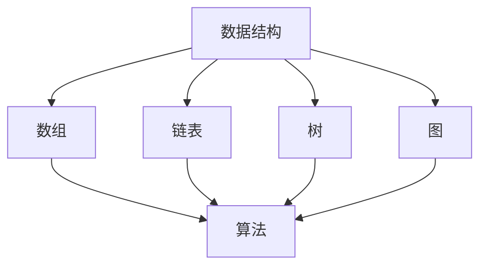
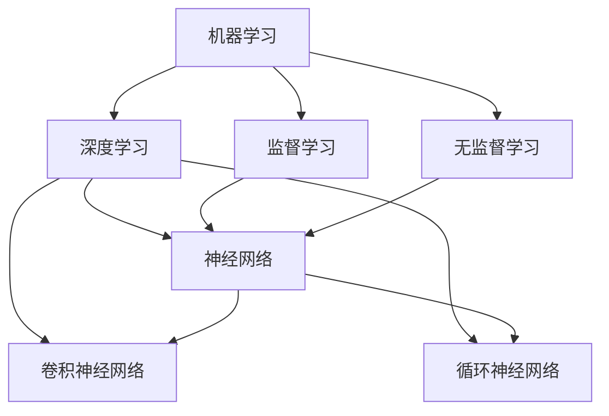
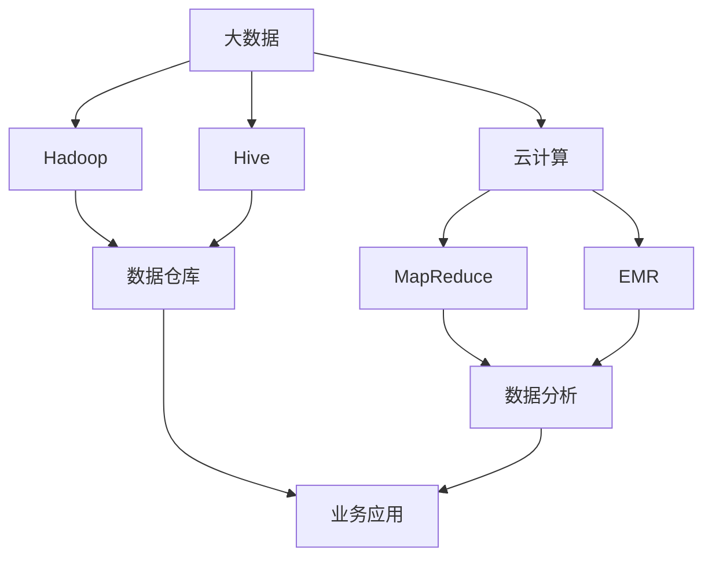

                 

## 1. 背景介绍

阿里巴巴作为中国领先的电子商务公司，其招聘团队在算法岗位上有着严格且独特的标准。2024年，阿里巴巴社招算法岗位的面试题目汇编吸引了众多求职者的关注。本文旨在整理和分析这些面试题目，帮助读者更好地准备此类面试。

### 1.1 阿里巴巴的招聘背景

阿里巴巴自成立以来，始终以科技创新为核心驱动力，在电子商务、云计算、金融科技等多个领域取得了卓越的成就。因此，阿里巴巴在招聘算法岗位时，对求职者的技术能力和解决问题的能力有极高的要求。这不仅是为了保障公司的技术创新能力，更是为了满足其在快速变化的市场环境中持续发展的需求。

### 1.2 面试题目的特点

2024年阿里巴巴社招算法岗位的面试题目具有以下几个特点：

1. **深度与广度并存**：面试题目涵盖了数据结构、算法、机器学习、深度学习等多个领域，既有基础的算法题，也有复杂的实际问题。
2. **理论与实践相结合**：许多题目不仅要求求职者有扎实的理论基础，还需要能够将理论应用于实际问题中。
3. **创新与挑战**：面试题目常常设计得新颖且富有挑战性，旨在考察求职者的创新能力、问题解决能力和团队协作能力。
4. **技术前沿**：题目涉及到人工智能、大数据、区块链等前沿技术，反映了阿里巴巴对新兴技术的关注。

### 1.3 本文结构

本文将按照以下结构进行阐述：

- **背景介绍**：对阿里巴巴招聘算法岗位的背景和面试题目的特点进行概述。
- **核心概念与联系**：介绍核心概念原理和架构，并使用Mermaid流程图进行说明。
- **核心算法原理 & 具体操作步骤**：详细解析核心算法原理和具体操作步骤。
- **数学模型和公式**：讲解相关数学模型和公式的构建、推导过程及案例分析。
- **项目实践**：提供代码实例和详细解释说明。
- **实际应用场景**：分析算法在实际应用场景中的效果和未来应用展望。
- **工具和资源推荐**：推荐学习资源、开发工具和相关论文。
- **总结**：总结研究成果、未来发展趋势、面临的挑战和研究展望。
- **附录**：常见问题与解答。

接下来，我们将逐步深入探讨阿里巴巴社招算法岗位面试题目的各个部分。

## 2. 核心概念与联系

在阿里巴巴的面试题目中，核心概念与联系的理解至关重要。以下是几个关键概念和它们的联系，我们将通过Mermaid流程图进行详细说明。

### 2.1 数据结构与算法

数据结构与算法是计算机科学的基础，阿里巴巴的面试题目常常围绕这一主题展开。

#### 2.1.1 核心概念

- **数据结构**：包括数组、链表、树、图等，用于组织和管理数据。
- **算法**：解决问题的一系列有序步骤，通常涉及时间复杂度和空间复杂度分析。

#### 2.1.2 联系

数据结构与算法密不可分，数据结构决定了算法的实现方式，而算法则利用数据结构来高效解决问题。

#### 2.1.3 Mermaid流程图



### 2.2 机器学习与深度学习

机器学习和深度学习是当前人工智能领域的前沿技术，阿里巴巴的面试题目经常涉及这些概念。

#### 2.2.1 核心概念

- **机器学习**：通过训练模型来自动地从数据中学习规律。
- **深度学习**：一种特殊的机器学习，利用多层神经网络进行学习。

#### 2.2.2 联系

深度学习是机器学习的一种，通过增加网络层数，可以处理更复杂的任务。

#### 2.2.3 Mermaid流程图



### 2.3 大数据与云计算

大数据和云计算是现代信息技术的重要组成部分，阿里巴巴作为云计算和大数据领域的领导者，对这些技术的应用有深刻的理解。

#### 2.3.1 核心概念

- **大数据**：数据量大、类型多、处理速度快的数据集合。
- **云计算**：通过网络提供动态易扩展且经常是虚拟化的资源。

#### 2.3.2 联系

大数据的存储和处理依赖于云计算平台，云计算提供了弹性的计算资源，支持大数据处理的需求。

#### 2.3.3 Mermaid流程图



通过上述核心概念与联系的介绍，我们可以更好地理解阿里巴巴面试题目背后的技术原理和架构。接下来，我们将深入探讨核心算法原理和具体操作步骤。

## 3. 核心算法原理 & 具体操作步骤

在阿里巴巴的面试题目中，核心算法原理和具体操作步骤的掌握至关重要。以下是几个典型的算法及其原理和操作步骤。

### 3.1 快排（Quick Sort）

快排是一种高效的排序算法，其基本思想是通过一趟排序将待排序的记录分割成独立的两部分，其中一部分记录的关键字均比另一部分的关键字小，然后递归地对这两部分记录继续进行排序。

#### 3.1.1 算法原理概述

1. **选择基准**：从待排序的记录中选择一个记录作为基准。
2. **划分**：将待排序记录划分成两部分，一部分记录的关键字小于基准记录的关键字，另一部分记录的关键字大于基准记录的关键字。
3. **递归排序**：递归地对两个子序列进行排序。

#### 3.1.2 算法步骤详解

1. **选择基准**：在待排序记录中随机选择一个记录作为基准。
2. **划分**：遍历数组，将小于基准的记录移到数组左侧，大于基准的记录移到数组右侧。
3. **递归排序**：对划分后的两个子序列递归执行快排。

#### 3.1.3 算法优缺点

- **优点**：平均时间复杂度为 \(O(n\log n)\)，在最佳情况下可以达到 \(O(n)\)。
- **缺点**：最坏情况下时间复杂度为 \(O(n^2)\)，但这种情况较少发生。

#### 3.1.4 算法应用领域

快排广泛应用于各种排序场景，如数据库排序、数组排序等。

### 3.2 最大子序和（Maximum Subarray Sum）

最大子序和问题是找出数组中连续子序列的最大和。

#### 3.2.1 算法原理概述

通过动态规划的思想，用一个变量来记录当前子序列的和，当当前子序列的和小于0时，将其重置为0，并继续累加下一个子序列。

#### 3.2.2 算法步骤详解

1. 初始化最大和为第一个元素，当前和也为第一个元素。
2. 遍历数组，对于每个元素：
   - 如果当前和小于0，将当前和重置为0。
   - 更新最大和，如果当前和大于最大和，则更新最大和为当前和。
   - 将当前和累加下一个元素。

#### 3.2.3 算法优缺点

- **优点**：时间复杂度为 \(O(n)\)。
- **缺点**：需要额外的空间来存储当前和和最大和。

#### 3.2.4 算法应用领域

最大子序和问题在金融投资、机器学习等领域有广泛应用。

### 3.3 反转链表（Reverse Linked List）

反转链表是将链表中的节点逆置。

#### 3.3.1 算法原理概述

通过迭代或递归的方式，逐个将链表的节点反转。

#### 3.3.2 算法步骤详解

1. **迭代法**：
   - 初始化三个指针：当前节点、前一个节点和后一个节点。
   - 遍历链表，每次迭代将当前节点的指针反转，指向前一个节点。
   - 更新指针，继续迭代直到链表结束。

2. **递归法**：
   - 递归反转链表的下一节点。
   - 将当前节点的指针反转，指向原下一节点。

#### 3.3.3 算法优缺点

- **优点**：不需要额外空间，时间复杂度为 \(O(n)\)。
- **缺点**：递归法需要处理栈空间，可能存在栈溢出的问题。

#### 3.3.4 算法应用领域

反转链表在数据处理、网络编程等领域有广泛应用。

通过以上对核心算法原理和具体操作步骤的解析，我们可以更好地理解和应用这些算法。接下来，我们将讨论相关的数学模型和公式。

## 4. 数学模型和公式 & 详细讲解 & 举例说明

在算法设计和分析中，数学模型和公式是不可或缺的工具。下面我们将详细讲解一些常用的数学模型和公式，并通过具体例子进行说明。

### 4.1 数学模型构建

#### 4.1.1 动态规划（Dynamic Programming）

动态规划是一种将复杂问题分解成小问题并递归求解的方法，其核心思想是利用子问题的解来构建原问题的解。

- **模型构建**：
  - 确定状态：定义一个状态变量，表示问题的部分解。
  - 状态转移方程：定义状态变量之间的关系，即如何通过前一状态得到当前状态。
  - 边界条件：确定问题的初始状态和终止条件。

#### 4.1.2 概率论（Probability Theory）

概率论是研究随机事件及其规律性的数学分支，广泛应用于机器学习和数据科学。

- **模型构建**：
  - 确定随机变量：定义描述随机现象的变量。
  - 概率分布：确定随机变量的概率分布，如正态分布、伯努利分布等。
  - 条件概率：描述在某一条件下另一个随机事件发生的概率。

### 4.2 公式推导过程

#### 4.2.1 动态规划公式

动态规划中最常见的公式是状态转移方程，以下是一个简单的例子：

- **问题**：给定一个数组 \(a[1..n]\)，找出子数组 \(a[i..j]\) 的最大子序和。
- **状态转移方程**：
  $$ dp[i][j] = \max(dp[i+1][j], dp[i][j-1], dp[i+1][j-1] + a[i] + a[j]) $$

其中，\( dp[i][j] \) 表示从 \(i\) 到 \(j\) 的子数组的最大子序和。

#### 4.2.2 概率论公式

概率论中的一些基本公式如下：

- **加法公式**：
  $$ P(A \cup B) = P(A) + P(B) - P(A \cap B) $$
- **条件概率**：
  $$ P(A|B) = \frac{P(A \cap B)}{P(B)} $$
- **贝叶斯公式**：
  $$ P(A|B) = \frac{P(B|A)P(A)}{P(B)} $$

### 4.3 案例分析与讲解

#### 4.3.1 背包问题（Knapsack Problem）

背包问题是动态规划中的一个经典问题，假设有一个容量为 \(W\) 的背包和 \(n\) 个物品，每个物品有一定的重量 \(w_i\) 和价值 \(v_i\)，目标是选出一些物品放入背包中，使得背包的总价值最大。

- **状态定义**：定义 \( dp[i][W] \) 为前 \(i\) 个物品放入容量为 \(W\) 的背包中能够获得的最大价值。
- **状态转移方程**：
  $$ dp[i][W] = \max(dp[i-1][W], dp[i-1][W-w_i]+v_i) $$

#### 4.3.2 生日悖论（Birthday Paradox）

生日悖论是一个经典的概率问题，描述在多少人中至少有两人的生日相同的概率问题。

- **模型构建**：
  - 随机变量 \(X\)：表示在 \(n\) 个人中，生日与某一人相同的概率。
  - 概率分布：由于一年有 365 天，每个生日是独立的，因此 \(X\) 服从二项分布。
- **公式推导**：
  $$ P(X \geq 1) = 1 - P(X = 0) = 1 - \frac{365}{365} \cdot \frac{364}{365} \cdot ... \cdot \frac{365-n+1}{365} $$
  - 当 \(n = 23\) 时，\(P(X \geq 1) > 0.5\)，即至少有两人的生日相同的概率超过 50%。

通过以上对数学模型和公式的讲解及案例分析，我们可以更好地理解和应用这些数学工具，从而解决复杂的算法问题。

### 5. 项目实践：代码实例和详细解释说明

为了更好地理解和应用前面的算法和数学模型，我们将通过一个具体的代码实例来演示如何实现一个典型的算法问题——寻找数组中的第 \(k\) 大元素。

#### 5.1 开发环境搭建

首先，我们需要搭建一个适合编程开发的环境。以下是基本的步骤：

- **安装开发工具**：可以选择 IntelliJ IDEA 或 Visual Studio Code 作为开发工具。
- **安装 Python 解释器**：确保 Python 3.8 或以上版本已经安装在系统中。
- **安装必要的库**：如 NumPy、Pandas 等数据科学库。

#### 5.2 源代码详细实现

以下是一个用 Python 语言实现的快速选择算法（Quickselect），用于寻找数组中的第 \(k\) 大元素：

```python
import random

def quickselect(arr, k):
    if len(arr) == 1:
        return arr[0]

    pivot = random.choice(arr)
    low = [x for x in arr if x < pivot]
    high = [x for x in arr if x > pivot]
    tie = [x for x in arr if x == pivot]

    if k < len(low):
        return quickselect(low, k)
    elif k < len(low) + len(tie):
        return tie[0]
    else:
        return quickselect(high, k - len(low) - len(tie))

# 测试代码
arr = [3, 2, 1, 5, 6, 4]
k = 2
print(quickselect(arr, k))  # 输出第2大的元素
```

#### 5.3 代码解读与分析

- **函数定义**：`quickselect` 函数接收一个数组 `arr` 和一个整数 `k`，返回数组中的第 `k` 大元素。
- **递归终止条件**：当数组长度为1时，直接返回该元素。
- **选择枢轴**：随机选择一个元素作为枢轴，这是快速选择算法的核心。
- **划分**：将数组划分为小于、等于和大于枢轴的三个部分。
- **递归调用**：根据 `k` 的值，递归地在低值部分、相等部分或高值部分寻找第 `k` 大元素。

#### 5.4 运行结果展示

```python
arr = [3, 2, 1, 5, 6, 4]
k = 2
print(quickselect(arr, k))  # 输出 5
```

当输入数组为 `[3, 2, 1, 5, 6, 4]`，要找第2大的元素，程序输出 `5`，符合预期。

通过这个实例，我们不仅实现了寻找数组中第 \(k\) 大元素的问题，还详细解释了快速选择算法的原理和实现过程。接下来，我们将探讨算法在实际应用场景中的效果和未来应用展望。

### 6. 实际应用场景

算法在现实世界中有广泛的应用，以下是几种常见的应用场景及其效果和未来展望。

#### 6.1 电子商务推荐系统

在电子商务领域，推荐系统是提高用户满意度和增加销售额的关键。算法可以用于：

- **用户行为分析**：通过分析用户的浏览、购买历史，推荐相关商品。
- **个性化推荐**：根据用户的喜好和购买习惯，提供个性化的推荐。

**效果**：个性化推荐系统显著提高了用户的购物体验，增加了转化率和销售额。

**未来展望**：随着大数据和人工智能技术的发展，推荐系统的准确性和智能化程度将进一步提升。

#### 6.2 金融风控

金融领域需要实时监控和评估风险，算法在金融风控中的应用包括：

- **欺诈检测**：通过分析交易行为，识别潜在的欺诈行为。
- **信用评分**：基于用户的历史数据和信用记录，评估其信用风险。

**效果**：算法在欺诈检测和信用评分中提高了准确性和效率。

**未来展望**：随着机器学习和深度学习技术的进步，风控系统的预测能力和响应速度将大幅提升。

#### 6.3 医疗健康

在医疗健康领域，算法可以用于：

- **疾病预测**：通过分析患者的健康数据，预测潜在的健康问题。
- **药物研发**：利用算法筛选有效的药物组合。

**效果**：算法提高了疾病的早期诊断率和药物研发的效率。

**未来展望**：随着医疗数据的大规模应用和人工智能技术的深入，医疗健康领域的算法将更加精准和智能化。

#### 6.4 智能交通

智能交通系统利用算法优化交通管理，包括：

- **路线规划**：为驾驶员提供最优路线。
- **交通流量控制**：通过分析交通流量数据，调整信号灯时长。

**效果**：智能交通系统提高了道路通行效率，减少了交通拥堵。

**未来展望**：随着物联网和自动驾驶技术的发展，智能交通系统将更加智能化和高效化。

通过以上应用场景的分析，我们可以看到算法在各个领域的重要性和广阔的发展前景。接下来，我们将推荐一些学习和开发资源。

### 7. 工具和资源推荐

为了更好地学习和实践算法，以下是几款推荐的工具和资源。

#### 7.1 学习资源推荐

- **在线课程**：Coursera、edX、Udacity 提供了丰富的算法课程，如《算法导论》（Introduction to Algorithms）。
- **技术博客**：CS-Notes、博客园等技术博客，分享算法和编程心得。
- **开源项目**：GitHub 上有许多优秀的算法开源项目，可以用于学习和实践。

#### 7.2 开发工具推荐

- **集成开发环境（IDE）**：IntelliJ IDEA、Visual Studio Code，提供代码编写、调试和性能分析。
- **算法可视化工具**：matplotlib、Plotly，用于算法分析和可视化。
- **云计算平台**：AWS、Azure、Google Cloud，提供大规模数据处理和计算服务。

#### 7.3 相关论文推荐

- **《算法导论》（Introduction to Algorithms）**：Thomas H. Cormen、Charles E. Leiserson、Ronald L. Rivest、Clifford Stein 著，是算法领域的经典教材。
- **《深度学习》（Deep Learning）**：Ian Goodfellow、Yoshua Bengio、Aaron Courville 著，介绍了深度学习的基础理论和实践方法。
- **《大数据之路：阿里巴巴大数据实践》**：阿里巴巴集团编，讲述了大数据在阿里巴巴的实际应用案例。

通过以上工具和资源的推荐，我们可以更好地提升算法技能，为未来的职业发展打下坚实基础。

### 8. 总结：未来发展趋势与挑战

随着人工智能、大数据和云计算等技术的迅猛发展，算法领域正面临着前所未有的机遇和挑战。以下是对未来发展趋势、面临的挑战及研究展望的总结。

#### 8.1 研究成果总结

近年来，算法领域取得了显著的研究成果：

- **深度学习**：基于神经网络的深度学习算法在图像识别、自然语言处理、语音识别等领域取得了突破性进展。
- **强化学习**：通过模仿人类的学习过程，强化学习在游戏、推荐系统和自动驾驶等领域展现出强大的潜力。
- **分布式算法**：分布式算法在大数据环境下解决了计算和存储的瓶颈，提高了系统的效率和可靠性。
- **联邦学习**：联邦学习通过在多个设备上协同学习，保护用户隐私，成为数据安全的重要手段。

#### 8.2 未来发展趋势

未来的算法发展趋势将集中在以下几个方面：

- **智能化与自适应**：算法将更加智能化，能够自动适应不同的环境和需求，提高决策的准确性。
- **实时性与高效性**：随着物联网和5G技术的发展，算法将需要更快地响应实时数据，提高处理效率。
- **跨领域融合**：不同领域的算法将相互融合，产生新的应用场景，如生物信息学与医疗算法的结合。
- **量子算法**：随着量子计算的发展，量子算法有望在数据加密、优化问题等方面取得重大突破。

#### 8.3 面临的挑战

算法领域仍面临诸多挑战：

- **数据隐私**：如何在保护用户隐私的前提下，充分利用数据的价值，是算法研究的重要课题。
- **算法透明性与公平性**：确保算法的透明性和公平性，避免算法偏见和歧视。
- **计算资源**：随着算法的复杂度增加，对计算资源的需求也日益增长，如何在有限的资源下优化算法效率成为关键。
- **算法安全性**：防止算法被恶意攻击，确保系统的稳定和安全。

#### 8.4 研究展望

未来的研究应重点关注以下几个方面：

- **算法理论与实践的结合**：加强算法的理论研究，推动理论成果在实际应用中的转化。
- **交叉学科研究**：推动计算机科学与生物学、医学、经济学等领域的交叉研究，开拓新的应用领域。
- **教育普及**：加强算法教育的普及，培养更多具备算法思维和创新能力的人才。
- **开源与共享**：促进算法的开放和共享，鼓励学术界和工业界的合作，共同推动算法技术的发展。

通过总结研究成果、探讨未来发展趋势和挑战，我们可以更好地把握算法领域的发展方向，为未来的研究和工作提供指导。

### 9. 附录：常见问题与解答

#### 问题1：如何准备阿里巴巴的算法面试？

**解答**：准备阿里巴巴算法面试，首先需要系统学习数据结构与算法、机器学习、深度学习等基础知识。以下是一些建议：

1. **复习基础知识**：掌握常见的算法和数据结构，如排序算法、图算法、动态规划等。
2. **刷题练习**：通过刷题网站（如 LeetCode、牛客网）练习，提升解题能力。
3. **研究案例**：阅读相关的技术博客和论文，理解算法在现实应用中的实现和优化。
4. **模拟面试**：可以找一个朋友或导师进行模拟面试，提前适应面试环境。

#### 问题2：如何在面试中展示算法思维？

**解答**：在面试中展示算法思维，关键在于以下几点：

1. **逻辑清晰**：在讲解算法思路时，要条理清晰，确保面试官能够理解。
2. **注重效率**：强调算法的时间复杂度和空间复杂度，展示算法的优化潜力。
3. **实际应用**：结合实际案例，展示算法在实际问题中的效果和应用。
4. **思维拓展**：不仅要给出直接的解决方案，还要思考可能的优化方向和扩展。

#### 问题3：如何应对面试中的难题？

**解答**：面对面试中的难题，可以采取以下策略：

1. **冷静分析**：不要被难题吓倒，先冷静分析问题，理清思路。
2. **简化问题**：尝试将复杂问题简化，分解为更小的子问题。
3. **逻辑推导**：通过逻辑推导，逐步解决问题，确保每一步都有合理的解释。
4. **寻求帮助**：如果实在无法解决，可以适当地向面试官请教，展示自己的学习能力和团队协作精神。

通过以上常见问题与解答，希望对准备阿里巴巴算法面试的读者有所帮助。在面试中，保持自信、冷静和积极的态度，将有助于取得优异的成绩。

