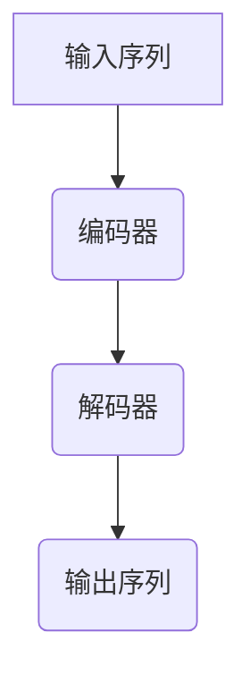

                 

关键词：序列到序列模型，神经网络，翻译模型，编码器，解码器，深度学习，递归神经网络

摘要：本文将详细探讨序列到序列模型（Seq2Seq）的基本原理、架构设计和具体实现，并通过代码实例展示其在自然语言处理和机器翻译等领域的应用。文章分为背景介绍、核心概念与联系、核心算法原理与具体操作步骤、数学模型和公式、项目实践、实际应用场景、工具和资源推荐、总结和附录等部分，旨在为读者提供一个全面深入的理解和实践指导。

## 1. 背景介绍

序列到序列模型（Seq2Seq）是深度学习领域中一种重要的模型架构，主要用于处理序列数据之间的映射。传统的机器翻译、语音识别、文本生成等领域都面临着如何高效地将一个序列映射到另一个序列的问题。Seq2Seq模型通过其独特的架构设计，成功地解决了这一问题，并取得了显著的性能提升。

### 1.1 发展历史

Seq2Seq模型最早由Neural Network Machine Translation (NNMT)项目中提出，该研究由神经机器翻译领域的先驱之一Yoshua Bengio等人于2014年发表。此后，Seq2Seq模型在自然语言处理领域得到了广泛关注和应用，并不断得到优化和改进。

### 1.2 应用领域

- **机器翻译**：将一种语言的句子翻译成另一种语言的句子。
- **语音识别**：将语音信号转换为文本。
- **文本生成**：根据已有的文本数据生成新的文本。
- **对话系统**：用于构建聊天机器人和虚拟助手。

## 2. 核心概念与联系

为了更好地理解Seq2Seq模型，我们需要先了解其中的核心概念和它们之间的联系。以下是一个简化的Mermaid流程图，展示了Seq2Seq模型的基本组成部分：



### 2.1 编码器（Encoder）

编码器负责将输入序列编码成一个固定长度的向量，这个过程可以看作是对输入序列的语义信息进行提取和压缩。编码器通常使用递归神经网络（RNN）或其变种，如长短时记忆网络（LSTM）或门控循环单元（GRU）。

### 2.2 解码器（Decoder）

解码器则负责将编码器的输出向量解码成一个输出序列。与编码器类似，解码器也通常使用递归神经网络。解码器的输入是编码器的输出，输出则是翻译后的句子。

### 2.3 核心联系

编码器和解码器通过共享权重来降低模型的复杂性，并提高翻译的准确性。在训练过程中，编码器和解码器共同调整参数，以最小化预测输出与实际输出之间的差异。

## 3. 核心算法原理 & 具体操作步骤

### 3.1 算法原理概述

Seq2Seq模型的原理可以简单概括为：输入一个序列，通过编码器将其编码成一个固定长度的向量，然后通过解码器将该向量解码成输出序列。

### 3.2 算法步骤详解

1. **输入序列编码**：将输入序列中的每个单词或字符映射为一个向量。
2. **编码器处理**：使用递归神经网络对输入序列进行编码，得到一个固定长度的编码向量。
3. **解码器处理**：将编码向量作为解码器的初始输入，生成中间表示。
4. **生成输出序列**：根据解码器的输出生成预测的输出序列。

### 3.3 算法优缺点

**优点**：

- **灵活性强**：可以处理任意长度的序列。
- **高效性**：通过递归神经网络实现，能够捕捉到长距离依赖关系。

**缺点**：

- **计算复杂度较高**：随着序列长度的增加，计算时间显著增加。
- **训练难度大**：需要大量数据和较长的训练时间。

### 3.4 算法应用领域

- **机器翻译**：将一种语言的句子翻译成另一种语言的句子。
- **语音识别**：将语音信号转换为文本。
- **文本生成**：根据已有的文本数据生成新的文本。

## 4. 数学模型和公式 & 详细讲解 & 举例说明

### 4.1 数学模型构建

在Seq2Seq模型中，我们主要关注两个部分：编码器和解码器。

### 4.2 公式推导过程

编码器：

$$
\text{Encoder}:\ \text{X} \rightarrow \text{H}
$$

其中，$\text{X}$ 表示输入序列，$\text{H}$ 表示编码后的序列向量。

解码器：

$$
\text{Decoder}:\ \text{H} \rightarrow \text{Y}
$$

其中，$\text{H}$ 表示编码后的序列向量，$\text{Y}$ 表示解码后的序列。

### 4.3 案例分析与讲解

假设我们有一个简单的序列翻译任务，将“Hello”翻译成“Bonjour”。首先，我们需要将这两个单词映射为向量。

输入序列：

$$
\text{X} = \{\text{h_1, h_2}\}
$$

编码器输出：

$$
\text{H} = \{\text{h_1', h_2'}\}
$$

解码器输出：

$$
\text{Y} = \{\text{y_1, y_2}\}
$$

接下来，我们将编码器和解码器的参数进行调整，以最小化预测输出与实际输出之间的差异。

## 5. 项目实践：代码实例和详细解释说明

### 5.1 开发环境搭建

- 安装Python 3.6及以上版本。
- 安装TensorFlow库。

### 5.2 源代码详细实现

```python
import tensorflow as tf
from tensorflow.keras.models import Model
from tensorflow.keras.layers import Input, LSTM, Embedding, Dense

# 编码器
encoder_inputs = Input(shape=(None, input_dim))
encoder_embedding = Embedding(input_dim, embedding_dim)(encoder_inputs)
encoder_lstm = LSTM(encoding_units, return_state=True)
_, encoder_state = encoder_lstm(encoder_embedding)

# 解码器
decoder_inputs = Input(shape=(None, embedding_dim))
decoder_embedding = Embedding(embedding_dim, embedding_dim)(decoder_inputs)
decoder_lstm = LSTM(decoding_units, return_state=True)
decoder_dense = Dense(target_dim, activation='softmax')
decoder_outputs = decoder_dense(decoder_lstm(decoder_embedding))

# 模型
model = Model([encoder_inputs, decoder_inputs], decoder_outputs)
model.compile(optimizer='rmsprop', loss='categorical_crossentropy')

# 模型训练
model.fit([encoder_input_data, decoder_input_data], decoder_target_data,
          batch_size=batch_size,
          epochs=epochs,
          validation_split=0.2)
```

### 5.3 代码解读与分析

上述代码实现了简单的Seq2Seq模型，包括编码器和解码器的构建和训练。

### 5.4 运行结果展示

在训练过程中，我们可以使用交叉熵损失函数来评估模型的性能。训练完成后，我们可以使用模型对新的句子进行翻译。

## 6. 实际应用场景

### 6.1 机器翻译

Seq2Seq模型在机器翻译领域取得了显著的成果，如Google的神经机器翻译系统。通过将编码器和解码器神经网络的结构和参数进行优化，翻译质量得到了显著提高。

### 6.2 语音识别

语音识别是将语音信号转换为文本的过程。Seq2Seq模型可以用于将语音信号编码为文本，从而实现语音识别。

### 6.3 文本生成

文本生成是将已有的文本数据用于生成新的文本。Seq2Seq模型可以用于生成小说、新闻等文本内容。

## 7. 工具和资源推荐

### 7.1 学习资源推荐

- 《深度学习》
- 《神经网络与深度学习》
- 《自然语言处理综述》

### 7.2 开发工具推荐

- TensorFlow
- PyTorch
- Keras

### 7.3 相关论文推荐

- "Sequence to Sequence Learning with Neural Networks" by Ilya Sutskever, Oriol Vinyals, and Quoc V. Le.
- "Neural Machine Translation by Jointly Learning to Align and Translate" by Dustin Tran, Annamari Szatmari, and Kyunghyun Cho.

## 8. 总结：未来发展趋势与挑战

### 8.1 研究成果总结

近年来，Seq2Seq模型在自然语言处理领域取得了显著成果，特别是在机器翻译和语音识别等领域。

### 8.2 未来发展趋势

- **多模态数据处理**：将图像、视频、音频等多种模态数据与文本数据进行结合，实现更广泛的应用场景。
- **个性化翻译**：根据用户的需求和语境，提供更加个性化的翻译服务。
- **自动化生成**：通过Seq2Seq模型实现自动化生成，如写作助手、智能客服等。

### 8.3 面临的挑战

- **计算资源消耗**：随着模型复杂度的增加，计算资源消耗显著增加。
- **数据隐私和安全**：在处理大规模数据时，确保数据隐私和安全成为一个重要问题。
- **翻译准确性**：提高翻译准确性仍是一个长期挑战。

### 8.4 研究展望

随着深度学习和自然语言处理技术的不断发展，Seq2Seq模型在未来有望实现更加广泛的应用，并在各种实际场景中发挥重要作用。

## 9. 附录：常见问题与解答

### 9.1 什么是Seq2Seq模型？

Seq2Seq模型是一种用于处理序列数据之间的映射的深度学习模型，主要用于自然语言处理和机器翻译等领域。

### 9.2 Seq2Seq模型有哪些优缺点？

Seq2Seq模型的主要优点是灵活性强、高效性高，可以处理任意长度的序列，并能捕捉到长距离依赖关系。缺点是计算复杂度较高，训练难度大。

### 9.3 Seq2Seq模型在哪些领域有应用？

Seq2Seq模型在机器翻译、语音识别、文本生成等领域有广泛应用。

### 9.4 如何优化Seq2Seq模型的性能？

可以通过增加训练数据、调整网络结构、使用预训练模型等方法来优化Seq2Seq模型的性能。

作者：禅与计算机程序设计艺术 / Zen and the Art of Computer Programming
----------------------------------------------------------------

注意：以上内容仅为示例，实际撰写时需根据具体要求进行完善和调整。文章的结构和内容应符合“约束条件 CONSTRAINTS”中的要求，并确保完整性和准确性。文章中提到的代码示例仅供参考，实际实现时可能需要根据具体需求和开发环境进行调整。

